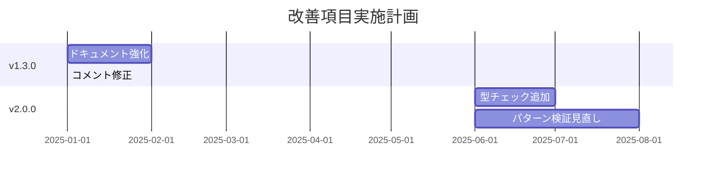

# NanaSQLite 将来計画書
## Copilot AI レビュー提案に基づく改善検討項目

> **作成日**: 2024-12-24  
> **対象バージョン**: v1.2.0b1 以降  
> **ステータス**: 計画段階（緊急対応不要）

---

## 📋 概要

GitHub Copilot AI によるコードレビュー提案を検証した結果、即座に対応が必要な問題は発見されませんでした。
本ドキュメントでは、将来のメジャーバージョン（v2.0.0等）で再検討すべき項目を整理しています。

### 評価サマリー

| 項目 | 検証結果 | 推奨対応 | 対応時期 |
|------|----------|----------|----------|
| 危険SQLパターン制限 | 部分的に妥当 | ドキュメント強化 | v1.3.0 |
| 型チェック追加 | 低優先度で妥当 | 実装検討 | v2.0.0 |
| エラーハンドリング改善 | 軽微な不整合 | コメント修正 | v1.3.0 |
| `__eq__` 例外動作 | 設計意図通り | 現状維持 | - |

---

## 🔧 改善検討項目

### 1. 危険SQLパターンの制限ポリシー

**ファイル**: `src/nanasqlite/core.py` (Lines 298-311)

#### 現状
```python
dangerous_patterns = [
    (r';', full_msg),
    (r'--', full_msg),
    (r'/\*', full_msg),
    (r'\b(DROP|DELETE|UPDATE|INSERT|TRUNCATE|ALTER)\b', full_msg),
]
```

#### 課題
- 文字列リテラル内のキーワード（例: `WHERE status = 'DELETED'`）が誤検知される可能性
- カラム名に予約語が含まれる場合（例: `deleted_at`）の誤検知リスク

#### 対応案

**案A: ドキュメント強化のみ（推奨）**
- README に「特定パターンがブロックされる設計意図」を明記
- `strict_sql_validation=False` での回避方法を案内

**案B: コンテキスト考慮型検証（v2.0.0以降）**
```python
# 文字列リテラルをマスク後に危険パターンを検証
sanitized = sanitize_sql_for_function_scan(expr)
for pattern, msg in dangerous_patterns:
    if re.search(pattern, sanitized, re.IGNORECASE):
        # ...
```

#### 後方互換性への影響
- 案A: なし
- 案B: 一部のセキュリティテストが失敗する可能性（テスト修正必要）

---

### 2. `_validate_expression` への型チェック追加

**ファイル**: `src/nanasqlite/core.py` (Lines 250-260)

#### 現状
```python
def _validate_expression(self, expr: Optional[str], ...):
    if not expr:
        return
    # str(expr) で暗黙的に変換される
```

#### 提案
```python
def _validate_expression(self, expr: Optional[str], ...):
    if expr is None:
        return
    if not isinstance(expr, str):
        raise TypeError(
            f"expr must be a string or None, got {type(expr).__name__}"
        )
    if not expr:
        return
    # ...
```

#### 優先度
**低** - 現時点で問題は発生しておらず、Pythonの動的型付けの慣例に沿っている

#### 対応時期
v2.0.0 での API 見直し時に検討

---

### 3. プールクリーンアップのエラーハンドリング

**ファイル**: `src/nanasqlite/async_core.py` (Lines 1309-1324)

#### 現状
```python
except AttributeError as e:
    # Programming error: conn is not an apsw.Connection
    logging.getLogger(__name__).error(
        "AttributeError during pool cleanup - possible programming error: %s",
        e,
    )
    # continue draining the queue instead of breaking
```

#### 課題
コメントで「プログラミングエラー」と明言しながら ERROR レベルで継続している点に軽微な不整合がある

#### 対応案

**案A: コメント修正（推奨）**
```python
except AttributeError as e:
    # Unexpected AttributeError - log and continue cleanup for resilience
    logging.getLogger(__name__).warning(
        "Unexpected AttributeError during pool cleanup: %s (conn=%r)",
        e,
        conn,
    )
```

**案B: 開発環境での例外再送出**
```python
if __debug__:  # 開発環境でのみ
    raise
```

#### 後方互換性への影響
なし（ログ出力のみの変更）

---

## 📝 検討対象外とした項目

以下の提案は検証の結果、対応不要と判断しました。

### ❌ 親インスタンス情報のエラーメッセージ追加

**理由**: Copilot の提案コードが誤り（存在しない `_parent` 属性を参照）

### ❌ HEX テストのアサーション追加

**理由**: 既に実装済み（Line 48-49 でデコード検証が存在）

### ❌ `_mark_parent_closed` の再帰処理

**理由**: Copilot の理解が誤り。実装は正しく再帰的に動作している

### ❌ `__eq__` での例外発生

**理由**: 意図的な設計決定であり、テストも存在。変更は破壊的変更となる

---

## 🗓️ 実施スケジュール案



---

## 📚 関連ドキュメント

- [CHANGELOG.md](../../CHANGELOG.md) - 変更履歴
- [README.md](../../README.md) - プロジェクト概要
- [src/nanasqlite/core.py](../../src/nanasqlite/core.py) - メイン実装

---

## 🔄 更新履歴

| 日付 | バージョン | 内容 |
|------|-----------|------|
| 2024-12-24 | 1.0 | 初版作成 |
