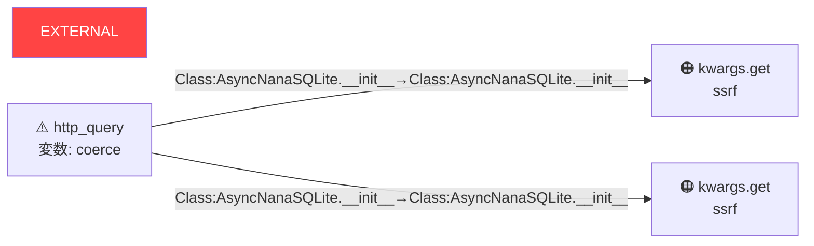

# Python セキュリティ構造マップ (Deep Analyzer V4)

> 生成元: `D:\data-backup\code\コード保存\NanaSQLite\src\nanasqlite` — 11 ファイル解析

> ⚠️ このレポートはソースコードを一切含みません。
> AIはこの構造情報のみで脆弱性を特定できます。

## 📊 サマリー

| 項目 | 件数 |
|:---|---:|
| 解析ファイル数 | 11 |
| クラス数 | 32 |
| 関数数 | 311 |
| テイントフロー検出 (CRITICAL) | 🔴 0 |
| テイントフロー検出 (HIGH) | 🟠 2 |
| 静的スキャン指摘 (CRITICAL) | 🔴 12 |
| 脆弱パッケージ | ⚠️ 0 |

---
## 1. クラス構造

```mermaid
classDiagram
    class AsyncNanaSQLite {
        +__init__(db_path, table, bulk_load, optimize, cache_size_mb, max_workers, strict_sql_validation, validator, coerce, v2_mode, v2_config) None
        +_validator() Any
        +_coerce() bool
        +_hooks() list[NanaHook]
        +add_hook(hook) None
        +_ensure_initialized() None
        +_init_pool_connection() None
        +_read_connection() None
        +_run_in_executor(func) None
        +aget(key, default) Any
        +aset(key, value) None
        +adelete(key) None
        +acontains(key) bool
        +alen() int
        +akeys() list[str]
        +avalues() list[Any]
        +aitems() list[tuple[str, Any]]
        +apop(key) Any
        +aupdate(mapping) None
        +update_wrapper() None
        +aflush(wait) None
        +_flush_wrapper() None
        +aclear() None
        +aget_dlq() list[dict[str, Any]]
        +aretry_dlq() None
        +aclear_dlq() None
        +aget_v2_metrics() dict[str, Any]
        +asetdefault(key, default) Any
        +aupsert(table_name, data, conflict_columns) int | None
        +load_all() None
        +refresh(key) None
        +is_cached(key) bool
        +batch_update(mapping) None
        +batch_update_partial(mapping) dict[str, str]
        +batch_delete(keys) None
        +to_dict() dict
        +copy() dict
        +get_fresh(key, default) Any
        +abatch_get(keys) dict[str, Any]
        +set_model(key, model) None
        +get_model(key, model_class) Any
        +execute(sql, parameters) Any
        +execute_many(sql, parameters_list) None
        +fetch_one(sql, parameters) tuple | None
        +_fetch_one_impl() None
        +fetch_all(sql, parameters) list[tuple]
        +_fetch_all_impl() None
        +create_table(table_name, columns, if_not_exists, primary_key) None
        +create_index(index_name, table_name, columns, unique, if_not_exists) None
        +query(table_name, columns, where, parameters, order_by, limit, strict_sql_validation, allowed_sql_functions, forbidden_sql_functions, override_allowed) list[dict]
        +query_with_pagination(table_name, columns, where, parameters, order_by, limit, offset, group_by, strict_sql_validation, allowed_sql_functions, forbidden_sql_functions, override_allowed) list[dict]
        +table_exists(table_name) bool
        +list_tables() list[str]
        +drop_table(table_name, if_exists) None
        +drop_index(index_name, if_exists) None
        +sql_insert(table_name, data) int
        +sql_update(table_name, data, where, parameters) int
        +sql_delete(table_name, where, parameters) int
        +count(table_name, where, parameters, strict_sql_validation, allowed_sql_functions, forbidden_sql_functions, override_allowed) int
        +vacuum() None
        +begin_transaction() None
        +commit() None
        +rollback() None
        +in_transaction() bool
        +transaction() None
        +__aenter__() None
        +__aexit__(exc_type, exc_val, exc_tb) None
        +aclear_cache() None
        +clear_cache() None
        +close() None
        +_mark_parent_closed() None
        +__repr__() str
        +sync_db() NanaSQLite | None
        +table(table_name, validator, coerce, hooks) AsyncNanaSQLite
        +abackup(target_path) None
        +arestore(source_path) None
        +apragma(pragma_name, value) Any
        +aget_table_schema(table_name) list[dict]
        +alist_indexes(table_name) list[str]
        +aalter_table_add_column(table_name, column_name, column_type) None
        +_shared_query_impl(table_name, columns, where, parameters, order_by, limit, offset, group_by, strict_sql_validation, allowed_sql_functions, forbidden_sql_functions, override_allowed) list[dict]
    }
    class BaseHook {
        +__init__(key_pattern, key_filter, re_fallback) None
        +_compile_re2(pattern, re_fallback, flags) Any
        +_validate_regex_pattern(pattern) None
        +_should_run(key) bool
        +before_write(db, key, value) Any
        +after_read(db, key, value) Any
        +before_delete(db, key) None
    }
    Protocol <|-- CacheStrategy
    class CacheStrategy {
        +get(key) Any | None
        +set(key, value) None
        +delete(key) None
        +invalidate(key) None
        +contains(key) bool
        +mark_cached(key) None
        +is_cached(key) bool
        +clear() None
        +get_data() MutableMapping[str, Any]
        +size() int
    }
    str <|-- CacheType
    Enum <|-- CacheType
    class CacheType {
    }
    BaseHook <|-- CheckHook
    class CheckHook {
        +__init__(check_func, error_msg) None
        +before_write(db, key, value) Any
    }
    class DLQEntry {
    }
    str <|-- ExpirationMode
    Enum <|-- ExpirationMode
    class ExpirationMode {
    }
    collections_abc_MutableMapping <|-- ExpiringDict
    class ExpiringDict {
        +__init__(expiration_time, mode, on_expire) None
        +_start_scheduler() None
        +_scheduler_loop() None
        +_evict(key) None
        +_check_expiry(key) bool
        +__setitem__(key, value) None
        +_set_timer(key) None
        +_cancel_timer(key) None
        +__getitem__(key) Any
        +__delitem__(key) None
        +__iter__() Iterator[str]
        +__len__() int
        +__contains__(key) bool
        +set_on_expire_callback(callback) None
        +clear() None
        +__del__() None
    }
    CacheStrategy <|-- FastLRUCache
    class FastLRUCache {
        +__init__(max_size) None
        +get(key) Any | None
        +set(key, value) None
        +delete(key) None
        +invalidate(key) None
        +contains(key) bool
        +mark_cached(key) None
        +is_cached(key) bool
        +clear() None
        +get_data() MutableMapping[str, Any]
        +size() int
    }
    BaseHook <|-- ForeignKeyHook
    class ForeignKeyHook {
        +__init__(field, target_db) None
        +before_write(db, key, value) Any
    }
    Protocol <|-- NanaHook
    class NanaHook {
        +before_write(db, key, value) Any
        +after_read(db, key, value) Any
        +before_delete(db, key) None
    }
    MutableMapping <|-- NanaSQLite
    class NanaSQLite {
        +__init__(db_path, table, bulk_load, optimize, cache_size_mb, strict_sql_validation, validator, coerce, v2_mode, v2_config) None
        +_expire_callback(value) None
        +_apply_optimizations(cache_size_mb) None
        +_sanitize_identifier() str
        +add_hook(hook) None
        +_is_in_memory_path() bool
        +_extract_column_aliases() list[str]
        +_acquire_lock() threading.RLock | _TimedLockContext
        +__hash__() None
        +__eq__(other) None
        +_validator() Any
        +_coerce() bool
        +_check_connection() None
        +_format_key_validation_error_message(key, exc) str
        +_format_partial_batch_error_message(key, exc) str
        +_raise_key_validation_error(key, exc) None
        +_validate_expression(expr, strict, allowed, forbidden, override_allowed, context) None
        +_mark_parent_closed() None
        +_serialize(value) bytes | str
        +_deserialize(value) Any
        +_write_to_db(key, value) None
        +_read_from_db(key) Any
        +_delete_from_db(key) None
        +_get_all_keys_from_db() list[str]
        +_update_cache(key, value) None
        +_ensure_cached(key) bool
        +__getitem__(key) Any
        +__setitem__(key, value) None
        +__delitem__(key) None
        +__contains__(key) bool
        +__len__() int
        +__iter__() Iterator[str]
        +__repr__() str
        +keys() list
        +values() list
        +items() list
        +get(key, default) Any
        +_get_raw(key, default) Any
        +get_fresh(key, default) Any
        +batch_get(keys) dict[str, Any]
        +pop(key) Any
        +update(mapping) None
        +flush(wait) None
        +get_dlq() list[dict[str, Any]]
        +retry_dlq() None
        +clear_dlq() None
        +get_v2_metrics() dict[str, Any]
        +clear() None
        +setdefault(key, default) Any
        +load_all() None
        +refresh(key) None
        +is_cached(key) bool
        +batch_update(mapping) None
        +batch_update_partial(mapping) dict[str, str]
        +batch_delete(keys) None
        +to_dict() dict
        +copy() dict
        +clear_cache() None
        +_delete_from_db_on_expire(key) None
        +backup(dest_path) None
        +restore(src_path) None
        +close() None
        +__enter__() None
        +__exit__(exc_type, exc_val, exc_tb) None
        +set_model(key, model) None
        +get_model(key, model_class) Any
        +execute(sql, parameters) apsw.Cursor
        +_on_error() None
        +_on_success() None
        +execute_many(sql, parameters_list) None
        +fetch_one(sql, parameters) tuple | None
        +fetch_all(sql, parameters) list[tuple]
        +create_table(table_name, columns, if_not_exists, primary_key) None
        +create_index(index_name, table_name, columns, unique, if_not_exists) None
        +query(table_name, columns, where, parameters, order_by, limit, strict_sql_validation, allowed_sql_functions, forbidden_sql_functions, override_allowed) list[dict]
        +table_exists(table_name) bool
        +list_tables() list[str]
        +drop_table(table_name, if_exists) None
        +drop_index(index_name, if_exists) None
        +alter_table_add_column(table_name, column_name, column_type, default) None
        +get_table_schema(table_name) list[dict]
        +list_indexes(table_name) list[dict]
        +sql_insert(table_name, data) int
        +sql_update(table_name, data, where, parameters) int
        +sql_delete(table_name, where, parameters) int
        +upsert(table_name, data, conflict_columns) int | None
        +count(table_name, where, parameters, strict_sql_validation, allowed_sql_functions, forbidden_sql_functions, override_allowed) int
        +exists(table_name, where, parameters) bool
        +query_with_pagination(table_name, columns, where, parameters, order_by, limit, offset, group_by, strict_sql_validation, allowed_sql_functions, forbidden_sql_functions, override_allowed) list[dict]
        +vacuum() None
        +get_db_size() int
        +export_table_to_dict(table_name) list[dict]
        +import_from_dict_list(table_name, data_list) int
        +get_last_insert_rowid() int
        +pragma(pragma_name, value) Any
        +begin_transaction() None
        +commit() None
        +rollback() None
        +in_transaction() bool
        +transaction() None
        +table(table_name, cache_strategy, cache_size, cache_ttl, cache_persistence_ttl, validator, coerce, hooks, v2_enable_metrics) None
    }
    NanaSQLiteError <|-- NanaSQLiteCacheError
    class NanaSQLiteCacheError {
    }
    NanaSQLiteConnectionError <|-- NanaSQLiteClosedError
    class NanaSQLiteClosedError {
    }
    NanaSQLiteError <|-- NanaSQLiteConnectionError
    class NanaSQLiteConnectionError {
    }
    NanaSQLiteError <|-- NanaSQLiteDatabaseError
    class NanaSQLiteDatabaseError {
        +__init__(message, original_error) None
    }
    Exception <|-- NanaSQLiteError
    class NanaSQLiteError {
    }
    NanaSQLiteError <|-- NanaSQLiteLockError
    class NanaSQLiteLockError {
    }
    NanaSQLiteError <|-- NanaSQLiteTransactionError
    class NanaSQLiteTransactionError {
    }
    NanaSQLiteError <|-- NanaSQLiteValidationError
    class NanaSQLiteValidationError {
    }
    BaseHook <|-- PydanticHook
    class PydanticHook {
        +__init__(model_class) None
        +before_write(db, key, value) Any
        +after_read(db, key, value) Any
    }
    CacheStrategy <|-- StdLRUCache
    class StdLRUCache {
        +__init__(max_size) None
        +get(key) Any | None
        +set(key, value) None
        +delete(key) None
        +invalidate(key) None
        +contains(key) bool
        +mark_cached(key) None
        +is_cached(key) bool
        +clear() None
        +get_data() MutableMapping[str, Any]
        +size() int
    }
    class StrictTask {
    }
    CacheStrategy <|-- TTLCache
    class TTLCache {
        +__init__(ttl, max_size, on_expire) None
        +get(key) Any | None
        +set(key, value) None
        +delete(key) None
        +clear() None
        +mark_cached(key) None
        +is_cached(key) bool
        +invalidate(key) None
        +contains(key) bool
        +size() int
        +get_data() MutableMapping[str, Any]
    }
    CacheStrategy <|-- UnboundedCache
    class UnboundedCache {
        +__init__(max_size) None
        +get(key) Any | None
        +set(key, value) None
        +delete(key) None
        +invalidate(key) None
        +contains(key) bool
        +mark_cached(key) None
        +is_cached(key) bool
        +clear() None
        +get_data() MutableMapping[str, Any]
        +size() int
    }
    BaseHook <|-- UniqueHook
    class UniqueHook {
        +__init__(field, use_index) None
        +invalidate_index() None
        +_extract_field(key, value) Any
        +_build_index(db) None
        +before_write(db, key, value) Any
        +before_delete(db, key) None
    }
    class V2Config {
    }
    class V2Engine {
        +__init__(connection, table_name, flush_mode, flush_interval, flush_count, max_chunk_size, serialize_func, enable_metrics, shared_lock) None
        +_start_timer() None
        +_timer_loop() None
        +_add_to_dlq(error_msg, item) None
        +kvs_set(table_name, key, value) None
        +kvs_delete(table_name, key) None
        +kvs_get_staging(table_name, key) dict[str, Any] | None
        +_check_auto_flush() None
        +enqueue_strict_task(task_type, sql, parameters, priority, on_success, on_error) None
        +flush(wait) None
        +_run_flush() None
        +_perform_flush() None
        +_process_kvs_chunk(kvs_chunk) None
        +_process_all_strict_tasks() None
        +_recover_chunk_via_dlq(failed_kvs_chunk) None
        +get_dlq() list[dict[str, Any]]
        +retry_dlq() None
        +clear_dlq() None
        +get_metrics() dict[str, Any]
        +shutdown() None
    }
    BaseHook <|-- ValidkitHook
    class ValidkitHook {
        +__init__(schema, coerce) None
        +before_write(db, key, value) Any
    }
    class _AsyncTransactionContext {
        +__init__(db) None
        +__aenter__() None
        +__aexit__(exc_type, exc_val, exc_tb) None
    }
    class _TimedLockContext {
        +__init__(lock, timeout) None
        +__enter__() _TimedLockContext
        +__exit__() None
    }
    class _TransactionContext {
        +__init__(db) None
        +__enter__() None
        +__exit__(exc_type, exc_val, exc_tb) None
    }
```



---
## 2. 呼び出しグラフ

```mermaid
graph TD
    AsyncNanaSQLite___init__["AsyncNanaSQLite.__init__"] --> bool["bool"]
    AsyncNanaSQLite___init__["AsyncNanaSQLite.__init__"] --> weakref_WeakSet["weakref.WeakSet"]
    AsyncNanaSQLite___init__["AsyncNanaSQLite.__init__"] --> ThreadPoolExecutor["ThreadPoolExecutor"]
    AsyncNanaSQLite__validator["AsyncNanaSQLite._validator"] --> getattr["getattr"]
    AsyncNanaSQLite__coerce["AsyncNanaSQLite._coerce"] --> getattr["getattr"]
    AsyncNanaSQLite__hooks["AsyncNanaSQLite._hooks"] --> getattr["getattr"]
    AsyncNanaSQLite_add_hook["AsyncNanaSQLite.add_hook"] --> self__run_in_executor["self._run_in_executor"]
    AsyncNanaSQLite_add_hook["AsyncNanaSQLite.add_hook"] --> hasattr["hasattr"]
    AsyncNanaSQLite__ensure_initialized["AsyncNanaSQLite._ensure_initialized"] --> getattr["getattr"]
    AsyncNanaSQLite__ensure_initialized["AsyncNanaSQLite._ensure_initialized"] --> NanaSQLiteClosedError["NanaSQLiteClosedError"]
    AsyncNanaSQLite__ensure_initialized["AsyncNanaSQLite._ensure_initialized"] --> asyncio_Lock["asyncio.Lock"]
    AsyncNanaSQLite__ensure_initialized["AsyncNanaSQLite._ensure_initialized"] --> asyncio_get_running_loop["asyncio.get_running_loop"]
    AsyncNanaSQLite__ensure_initialized["AsyncNanaSQLite._ensure_initialized"] --> loop_run_in_executor["loop.run_in_executor"]
    AsyncNanaSQLite__ensure_initialized["AsyncNanaSQLite._ensure_initialized"] --> NanaSQLite["NanaSQLite"]
    AsyncNanaSQLite__ensure_initialized["AsyncNanaSQLite._ensure_initialized"] --> queue_Queue["queue.Queue"]
    AsyncNanaSQLite__init_pool_connection["AsyncNanaSQLite._init_pool_connection"] --> range["range"]
    AsyncNanaSQLite__init_pool_connection["AsyncNanaSQLite._init_pool_connection"] --> apsw_Connection["apsw.Connection"]
    AsyncNanaSQLite__init_pool_connection["AsyncNanaSQLite._init_pool_connection"] --> conn_cursor["conn.cursor"]
    AsyncNanaSQLite__init_pool_connection["AsyncNanaSQLite._init_pool_connection"] --> c_execute["c.execute"]
    AsyncNanaSQLite__init_pool_connection["AsyncNanaSQLite._init_pool_connection"] --> self__read_pool_put["self._read_pool.put"]
    AsyncNanaSQLite__read_connection["AsyncNanaSQLite._read_connection"] --> pool_put["pool.put"]
    AsyncNanaSQLite__run_in_executor["AsyncNanaSQLite._run_in_executor"] --> self__ensure_initialized["self._ensure_initialized"]
    AsyncNanaSQLite__run_in_executor["AsyncNanaSQLite._run_in_executor"] --> asyncio_get_running_loop["asyncio.get_running_loop"]
    AsyncNanaSQLite__run_in_executor["AsyncNanaSQLite._run_in_executor"] --> loop_run_in_executor["loop.run_in_executor"]
    AsyncNanaSQLite_aget["AsyncNanaSQLite.aget"] --> self__ensure_initialized["self._ensure_initialized"]
    AsyncNanaSQLite_aget["AsyncNanaSQLite.aget"] --> asyncio_get_running_loop["asyncio.get_running_loop"]
    AsyncNanaSQLite_aget["AsyncNanaSQLite.aget"] --> loop_run_in_executor["loop.run_in_executor"]
    AsyncNanaSQLite_aset["AsyncNanaSQLite.aset"] --> self__ensure_initialized["self._ensure_initialized"]
    AsyncNanaSQLite_aset["AsyncNanaSQLite.aset"] --> asyncio_get_running_loop["asyncio.get_running_loop"]
    AsyncNanaSQLite_aset["AsyncNanaSQLite.aset"] --> loop_run_in_executor["loop.run_in_executor"]
    AsyncNanaSQLite_adelete["AsyncNanaSQLite.adelete"] --> self__ensure_initialized["self._ensure_initialized"]
    AsyncNanaSQLite_adelete["AsyncNanaSQLite.adelete"] --> asyncio_get_running_loop["asyncio.get_running_loop"]
    AsyncNanaSQLite_adelete["AsyncNanaSQLite.adelete"] --> loop_run_in_executor["loop.run_in_executor"]
    AsyncNanaSQLite_acontains["AsyncNanaSQLite.acontains"] --> self__ensure_initialized["self._ensure_initialized"]
    AsyncNanaSQLite_acontains["AsyncNanaSQLite.acontains"] --> RuntimeError["RuntimeError"]
    AsyncNanaSQLite_acontains["AsyncNanaSQLite.acontains"] --> asyncio_get_running_loop["asyncio.get_running_loop"]
    AsyncNanaSQLite_acontains["AsyncNanaSQLite.acontains"] --> loop_run_in_executor["loop.run_in_executor"]
    AsyncNanaSQLite_alen["AsyncNanaSQLite.alen"] --> self__ensure_initialized["self._ensure_initialized"]
    AsyncNanaSQLite_alen["AsyncNanaSQLite.alen"] --> asyncio_get_running_loop["asyncio.get_running_loop"]
    AsyncNanaSQLite_alen["AsyncNanaSQLite.alen"] --> loop_run_in_executor["loop.run_in_executor"]
    AsyncNanaSQLite_akeys["AsyncNanaSQLite.akeys"] --> self__ensure_initialized["self._ensure_initialized"]
    AsyncNanaSQLite_akeys["AsyncNanaSQLite.akeys"] --> asyncio_get_running_loop["asyncio.get_running_loop"]
    AsyncNanaSQLite_akeys["AsyncNanaSQLite.akeys"] --> loop_run_in_executor["loop.run_in_executor"]
    AsyncNanaSQLite_avalues["AsyncNanaSQLite.avalues"] --> self__ensure_initialized["self._ensure_initialized"]
    AsyncNanaSQLite_avalues["AsyncNanaSQLite.avalues"] --> asyncio_get_running_loop["asyncio.get_running_loop"]
    AsyncNanaSQLite_avalues["AsyncNanaSQLite.avalues"] --> loop_run_in_executor["loop.run_in_executor"]
    AsyncNanaSQLite_aitems["AsyncNanaSQLite.aitems"] --> self__ensure_initialized["self._ensure_initialized"]
    AsyncNanaSQLite_aitems["AsyncNanaSQLite.aitems"] --> asyncio_get_running_loop["asyncio.get_running_loop"]
    AsyncNanaSQLite_aitems["AsyncNanaSQLite.aitems"] --> loop_run_in_executor["loop.run_in_executor"]
    AsyncNanaSQLite_apop["AsyncNanaSQLite.apop"] --> self__ensure_initialized["self._ensure_initialized"]
    AsyncNanaSQLite_apop["AsyncNanaSQLite.apop"] --> asyncio_get_running_loop["asyncio.get_running_loop"]
    AsyncNanaSQLite_apop["AsyncNanaSQLite.apop"] --> loop_run_in_executor["loop.run_in_executor"]
    AsyncNanaSQLite_aupdate["AsyncNanaSQLite.aupdate"] --> self__ensure_initialized["self._ensure_initialized"]
    AsyncNanaSQLite_aupdate["AsyncNanaSQLite.aupdate"] --> asyncio_get_running_loop["asyncio.get_running_loop"]
    AsyncNanaSQLite_aupdate["AsyncNanaSQLite.aupdate"] --> loop_run_in_executor["loop.run_in_executor"]
    AsyncNanaSQLite_aflush["AsyncNanaSQLite.aflush"] --> self__ensure_initialized["self._ensure_initialized"]
    AsyncNanaSQLite_aflush["AsyncNanaSQLite.aflush"] --> asyncio_get_running_loop["asyncio.get_running_loop"]
    AsyncNanaSQLite__flush_wrapper["AsyncNanaSQLite._flush_wrapper"] --> self__db_flush["self._db.flush"]
    AsyncNanaSQLite_aflush["AsyncNanaSQLite.aflush"] --> loop_run_in_executor["loop.run_in_executor"]
    AsyncNanaSQLite_aclear["AsyncNanaSQLite.aclear"] --> self__ensure_initialized["self._ensure_initialized"]
    AsyncNanaSQLite_aclear["AsyncNanaSQLite.aclear"] --> asyncio_get_running_loop["asyncio.get_running_loop"]
    AsyncNanaSQLite_aclear["AsyncNanaSQLite.aclear"] --> loop_run_in_executor["loop.run_in_executor"]
    AsyncNanaSQLite_aget_dlq["AsyncNanaSQLite.aget_dlq"] --> self__ensure_initialized["self._ensure_initialized"]
    AsyncNanaSQLite_aget_dlq["AsyncNanaSQLite.aget_dlq"] --> asyncio_get_running_loop["asyncio.get_running_loop"]
    AsyncNanaSQLite_aget_dlq["AsyncNanaSQLite.aget_dlq"] --> loop_run_in_executor["loop.run_in_executor"]
    AsyncNanaSQLite_aretry_dlq["AsyncNanaSQLite.aretry_dlq"] --> self__ensure_initialized["self._ensure_initialized"]
    AsyncNanaSQLite_aretry_dlq["AsyncNanaSQLite.aretry_dlq"] --> asyncio_get_running_loop["asyncio.get_running_loop"]
    AsyncNanaSQLite_aretry_dlq["AsyncNanaSQLite.aretry_dlq"] --> loop_run_in_executor["loop.run_in_executor"]
    AsyncNanaSQLite_aclear_dlq["AsyncNanaSQLite.aclear_dlq"] --> self__ensure_initialized["self._ensure_initialized"]
    AsyncNanaSQLite_aclear_dlq["AsyncNanaSQLite.aclear_dlq"] --> asyncio_get_running_loop["asyncio.get_running_loop"]
    AsyncNanaSQLite_aclear_dlq["AsyncNanaSQLite.aclear_dlq"] --> loop_run_in_executor["loop.run_in_executor"]
    AsyncNanaSQLite_aget_v2_metrics["AsyncNanaSQLite.aget_v2_metrics"] --> self__ensure_initialized["self._ensure_initialized"]
    AsyncNanaSQLite_aget_v2_metrics["AsyncNanaSQLite.aget_v2_metrics"] --> asyncio_get_running_loop["asyncio.get_running_loop"]
    AsyncNanaSQLite_aget_v2_metrics["AsyncNanaSQLite.aget_v2_metrics"] --> loop_run_in_executor["loop.run_in_executor"]
    AsyncNanaSQLite_asetdefault["AsyncNanaSQLite.asetdefault"] --> self__ensure_initialized["self._ensure_initialized"]
    AsyncNanaSQLite_asetdefault["AsyncNanaSQLite.asetdefault"] --> asyncio_get_running_loop["asyncio.get_running_loop"]
    AsyncNanaSQLite_asetdefault["AsyncNanaSQLite.asetdefault"] --> loop_run_in_executor["loop.run_in_executor"]
    AsyncNanaSQLite_aupsert["AsyncNanaSQLite.aupsert"] --> self__ensure_initialized["self._ensure_initialized"]
    AsyncNanaSQLite_aupsert["AsyncNanaSQLite.aupsert"] --> asyncio_get_running_loop["asyncio.get_running_loop"]
    AsyncNanaSQLite_aupsert["AsyncNanaSQLite.aupsert"] --> functools_partial["functools.partial"]
    AsyncNanaSQLite_aupsert["AsyncNanaSQLite.aupsert"] --> loop_run_in_executor["loop.run_in_executor"]
    AsyncNanaSQLite_load_all["AsyncNanaSQLite.load_all"] --> self__ensure_initialized["self._ensure_initialized"]
    AsyncNanaSQLite_load_all["AsyncNanaSQLite.load_all"] --> asyncio_get_running_loop["asyncio.get_running_loop"]
    AsyncNanaSQLite_load_all["AsyncNanaSQLite.load_all"] --> loop_run_in_executor["loop.run_in_executor"]
    AsyncNanaSQLite_refresh["AsyncNanaSQLite.refresh"] --> self__ensure_initialized["self._ensure_initialized"]
    AsyncNanaSQLite_refresh["AsyncNanaSQLite.refresh"] --> asyncio_get_running_loop["asyncio.get_running_loop"]
    AsyncNanaSQLite_refresh["AsyncNanaSQLite.refresh"] --> loop_run_in_executor["loop.run_in_executor"]
    AsyncNanaSQLite_is_cached["AsyncNanaSQLite.is_cached"] --> self__ensure_initialized["self._ensure_initialized"]
    AsyncNanaSQLite_is_cached["AsyncNanaSQLite.is_cached"] --> asyncio_get_running_loop["asyncio.get_running_loop"]
    AsyncNanaSQLite_is_cached["AsyncNanaSQLite.is_cached"] --> loop_run_in_executor["loop.run_in_executor"]
    AsyncNanaSQLite_batch_update["AsyncNanaSQLite.batch_update"] --> self__ensure_initialized["self._ensure_initialized"]
    AsyncNanaSQLite_batch_update["AsyncNanaSQLite.batch_update"] --> asyncio_get_running_loop["asyncio.get_running_loop"]
    AsyncNanaSQLite_batch_update["AsyncNanaSQLite.batch_update"] --> loop_run_in_executor["loop.run_in_executor"]
    AsyncNanaSQLite_batch_update_partial["AsyncNanaSQLite.batch_update_partial"] --> self__ensure_initialized["self._ensure_initialized"]
    AsyncNanaSQLite_batch_update_partial["AsyncNanaSQLite.batch_update_partial"] --> asyncio_get_running_loop["asyncio.get_running_loop"]
    AsyncNanaSQLite_batch_update_partial["AsyncNanaSQLite.batch_update_partial"] --> loop_run_in_executor["loop.run_in_executor"]
    AsyncNanaSQLite_batch_delete["AsyncNanaSQLite.batch_delete"] --> self__ensure_initialized["self._ensure_initialized"]
    AsyncNanaSQLite_batch_delete["AsyncNanaSQLite.batch_delete"] --> asyncio_get_running_loop["asyncio.get_running_loop"]
    AsyncNanaSQLite_batch_delete["AsyncNanaSQLite.batch_delete"] --> loop_run_in_executor["loop.run_in_executor"]
    AsyncNanaSQLite_to_dict["AsyncNanaSQLite.to_dict"] --> self__ensure_initialized["self._ensure_initialized"]
    AsyncNanaSQLite_to_dict["AsyncNanaSQLite.to_dict"] --> asyncio_get_running_loop["asyncio.get_running_loop"]
    AsyncNanaSQLite_to_dict["AsyncNanaSQLite.to_dict"] --> loop_run_in_executor["loop.run_in_executor"]
    AsyncNanaSQLite_copy["AsyncNanaSQLite.copy"] --> self__ensure_initialized["self._ensure_initialized"]
    AsyncNanaSQLite_copy["AsyncNanaSQLite.copy"] --> asyncio_get_running_loop["asyncio.get_running_loop"]
    AsyncNanaSQLite_copy["AsyncNanaSQLite.copy"] --> loop_run_in_executor["loop.run_in_executor"]
    AsyncNanaSQLite_get_fresh["AsyncNanaSQLite.get_fresh"] --> self__ensure_initialized["self._ensure_initialized"]
    AsyncNanaSQLite_get_fresh["AsyncNanaSQLite.get_fresh"] --> asyncio_get_running_loop["asyncio.get_running_loop"]
    AsyncNanaSQLite_get_fresh["AsyncNanaSQLite.get_fresh"] --> loop_run_in_executor["loop.run_in_executor"]
    AsyncNanaSQLite_abatch_get["AsyncNanaSQLite.abatch_get"] --> self__ensure_initialized["self._ensure_initialized"]
    AsyncNanaSQLite_abatch_get["AsyncNanaSQLite.abatch_get"] --> asyncio_get_running_loop["asyncio.get_running_loop"]
    AsyncNanaSQLite_abatch_get["AsyncNanaSQLite.abatch_get"] --> loop_run_in_executor["loop.run_in_executor"]
    AsyncNanaSQLite_set_model["AsyncNanaSQLite.set_model"] --> self__ensure_initialized["self._ensure_initialized"]
    AsyncNanaSQLite_set_model["AsyncNanaSQLite.set_model"] --> asyncio_get_running_loop["asyncio.get_running_loop"]
    AsyncNanaSQLite_set_model["AsyncNanaSQLite.set_model"] --> loop_run_in_executor["loop.run_in_executor"]
    AsyncNanaSQLite_get_model["AsyncNanaSQLite.get_model"] --> self__ensure_initialized["self._ensure_initialized"]
    AsyncNanaSQLite_get_model["AsyncNanaSQLite.get_model"] --> asyncio_get_running_loop["asyncio.get_running_loop"]
    AsyncNanaSQLite_get_model["AsyncNanaSQLite.get_model"] --> loop_run_in_executor["loop.run_in_executor"]
    AsyncNanaSQLite_execute["AsyncNanaSQLite.execute"] --> self__ensure_initialized["self._ensure_initialized"]
    AsyncNanaSQLite_execute["AsyncNanaSQLite.execute"] --> asyncio_get_running_loop["asyncio.get_running_loop"]
    AsyncNanaSQLite_execute["AsyncNanaSQLite.execute"] --> loop_run_in_executor["loop.run_in_executor"]
    AsyncNanaSQLite_execute_many["AsyncNanaSQLite.execute_many"] --> self__ensure_initialized["self._ensure_initialized"]
    AsyncNanaSQLite_execute_many["AsyncNanaSQLite.execute_many"] --> asyncio_get_running_loop["asyncio.get_running_loop"]
    AsyncNanaSQLite_execute_many["AsyncNanaSQLite.execute_many"] --> loop_run_in_executor["loop.run_in_executor"]
    AsyncNanaSQLite_fetch_one["AsyncNanaSQLite.fetch_one"] --> self__ensure_initialized["self._ensure_initialized"]
    AsyncNanaSQLite__fetch_one_impl["AsyncNanaSQLite._fetch_one_impl"] --> self__read_connection["self._read_connection"]
    AsyncNanaSQLite__fetch_one_impl["AsyncNanaSQLite._fetch_one_impl"] --> conn_execute["conn.execute"]
    AsyncNanaSQLite__fetch_one_impl["AsyncNanaSQLite._fetch_one_impl"] --> cursor_fetchone["cursor.fetchone"]
    AsyncNanaSQLite_fetch_one["AsyncNanaSQLite.fetch_one"] --> asyncio_get_running_loop["asyncio.get_running_loop"]
    AsyncNanaSQLite_fetch_one["AsyncNanaSQLite.fetch_one"] --> loop_run_in_executor["loop.run_in_executor"]
    AsyncNanaSQLite_fetch_all["AsyncNanaSQLite.fetch_all"] --> self__ensure_initialized["self._ensure_initialized"]
    AsyncNanaSQLite__fetch_all_impl["AsyncNanaSQLite._fetch_all_impl"] --> self__read_connection["self._read_connection"]
    AsyncNanaSQLite__fetch_all_impl["AsyncNanaSQLite._fetch_all_impl"] --> conn_execute["conn.execute"]
    AsyncNanaSQLite_fetch_all["AsyncNanaSQLite.fetch_all"] --> asyncio_get_running_loop["asyncio.get_running_loop"]
    AsyncNanaSQLite_fetch_all["AsyncNanaSQLite.fetch_all"] --> loop_run_in_executor["loop.run_in_executor"]
    AsyncNanaSQLite_create_table["AsyncNanaSQLite.create_table"] --> self__ensure_initialized["self._ensure_initialized"]
    AsyncNanaSQLite_create_table["AsyncNanaSQLite.create_table"] --> asyncio_get_running_loop["asyncio.get_running_loop"]
    AsyncNanaSQLite_create_table["AsyncNanaSQLite.create_table"] --> loop_run_in_executor["loop.run_in_executor"]
    AsyncNanaSQLite_create_index["AsyncNanaSQLite.create_index"] --> self__ensure_initialized["self._ensure_initialized"]
    AsyncNanaSQLite_create_index["AsyncNanaSQLite.create_index"] --> asyncio_get_running_loop["asyncio.get_running_loop"]
    AsyncNanaSQLite_create_index["AsyncNanaSQLite.create_index"] --> loop_run_in_executor["loop.run_in_executor"]
    AsyncNanaSQLite_query["AsyncNanaSQLite.query"] --> self__ensure_initialized["self._ensure_initialized"]
    AsyncNanaSQLite_query["AsyncNanaSQLite.query"] --> asyncio_get_running_loop["asyncio.get_running_loop"]
    AsyncNanaSQLite_query["AsyncNanaSQLite.query"] --> loop_run_in_executor["loop.run_in_executor"]
    AsyncNanaSQLite_query_with_pagination["AsyncNanaSQLite.query_with_pagination"] --> self__ensure_initialized["self._ensure_initialized"]
    AsyncNanaSQLite_query_with_pagination["AsyncNanaSQLite.query_with_pagination"] --> asyncio_get_running_loop["asyncio.get_running_loop"]
    AsyncNanaSQLite_query_with_pagination["AsyncNanaSQLite.query_with_pagination"] --> loop_run_in_executor["loop.run_in_executor"]
    AsyncNanaSQLite_table_exists["AsyncNanaSQLite.table_exists"] --> self__ensure_initialized["self._ensure_initialized"]
    AsyncNanaSQLite_table_exists["AsyncNanaSQLite.table_exists"] --> asyncio_get_running_loop["asyncio.get_running_loop"]
    AsyncNanaSQLite_table_exists["AsyncNanaSQLite.table_exists"] --> loop_run_in_executor["loop.run_in_executor"]
    AsyncNanaSQLite_list_tables["AsyncNanaSQLite.list_tables"] --> self__ensure_initialized["self._ensure_initialized"]
    AsyncNanaSQLite_list_tables["AsyncNanaSQLite.list_tables"] --> asyncio_get_running_loop["asyncio.get_running_loop"]
    AsyncNanaSQLite_list_tables["AsyncNanaSQLite.list_tables"] --> loop_run_in_executor["loop.run_in_executor"]
    AsyncNanaSQLite_drop_table["AsyncNanaSQLite.drop_table"] --> self__ensure_initialized["self._ensure_initialized"]
    AsyncNanaSQLite_drop_table["AsyncNanaSQLite.drop_table"] --> asyncio_get_running_loop["asyncio.get_running_loop"]
    AsyncNanaSQLite_drop_table["AsyncNanaSQLite.drop_table"] --> loop_run_in_executor["loop.run_in_executor"]
    AsyncNanaSQLite_drop_index["AsyncNanaSQLite.drop_index"] --> self__ensure_initialized["self._ensure_initialized"]
    AsyncNanaSQLite_drop_index["AsyncNanaSQLite.drop_index"] --> asyncio_get_running_loop["asyncio.get_running_loop"]
    AsyncNanaSQLite_drop_index["AsyncNanaSQLite.drop_index"] --> loop_run_in_executor["loop.run_in_executor"]
    AsyncNanaSQLite_sql_insert["AsyncNanaSQLite.sql_insert"] --> self__ensure_initialized["self._ensure_initialized"]
    AsyncNanaSQLite_sql_insert["AsyncNanaSQLite.sql_insert"] --> asyncio_get_running_loop["asyncio.get_running_loop"]
    AsyncNanaSQLite_sql_insert["AsyncNanaSQLite.sql_insert"] --> loop_run_in_executor["loop.run_in_executor"]
    AsyncNanaSQLite_sql_update["AsyncNanaSQLite.sql_update"] --> self__ensure_initialized["self._ensure_initialized"]
    AsyncNanaSQLite_sql_update["AsyncNanaSQLite.sql_update"] --> asyncio_get_running_loop["asyncio.get_running_loop"]
    AsyncNanaSQLite_sql_update["AsyncNanaSQLite.sql_update"] --> loop_run_in_executor["loop.run_in_executor"]
    AsyncNanaSQLite_sql_delete["AsyncNanaSQLite.sql_delete"] --> self__ensure_initialized["self._ensure_initialized"]
    AsyncNanaSQLite_sql_delete["AsyncNanaSQLite.sql_delete"] --> asyncio_get_running_loop["asyncio.get_running_loop"]
    AsyncNanaSQLite_sql_delete["AsyncNanaSQLite.sql_delete"] --> loop_run_in_executor["loop.run_in_executor"]
    AsyncNanaSQLite_count["AsyncNanaSQLite.count"] --> self__ensure_initialized["self._ensure_initialized"]
    AsyncNanaSQLite_count["AsyncNanaSQLite.count"] --> asyncio_get_running_loop["asyncio.get_running_loop"]
    AsyncNanaSQLite_count["AsyncNanaSQLite.count"] --> loop_run_in_executor["loop.run_in_executor"]
    AsyncNanaSQLite_vacuum["AsyncNanaSQLite.vacuum"] --> self__ensure_initialized["self._ensure_initialized"]
    AsyncNanaSQLite_vacuum["AsyncNanaSQLite.vacuum"] --> asyncio_get_running_loop["asyncio.get_running_loop"]
    AsyncNanaSQLite_vacuum["AsyncNanaSQLite.vacuum"] --> loop_run_in_executor["loop.run_in_executor"]
    AsyncNanaSQLite_begin_transaction["AsyncNanaSQLite.begin_transaction"] --> self__ensure_initialized["self._ensure_initialized"]
    AsyncNanaSQLite_begin_transaction["AsyncNanaSQLite.begin_transaction"] --> asyncio_get_running_loop["asyncio.get_running_loop"]
    AsyncNanaSQLite_begin_transaction["AsyncNanaSQLite.begin_transaction"] --> loop_run_in_executor["loop.run_in_executor"]
    AsyncNanaSQLite_commit["AsyncNanaSQLite.commit"] --> self__ensure_initialized["self._ensure_initialized"]
    AsyncNanaSQLite_commit["AsyncNanaSQLite.commit"] --> asyncio_get_running_loop["asyncio.get_running_loop"]
    AsyncNanaSQLite_commit["AsyncNanaSQLite.commit"] --> loop_run_in_executor["loop.run_in_executor"]
    AsyncNanaSQLite_rollback["AsyncNanaSQLite.rollback"] --> self__ensure_initialized["self._ensure_initialized"]
    AsyncNanaSQLite_rollback["AsyncNanaSQLite.rollback"] --> asyncio_get_running_loop["asyncio.get_running_loop"]
    AsyncNanaSQLite_rollback["AsyncNanaSQLite.rollback"] --> loop_run_in_executor["loop.run_in_executor"]
    AsyncNanaSQLite_in_transaction["AsyncNanaSQLite.in_transaction"] --> self__ensure_initialized["self._ensure_initialized"]
    AsyncNanaSQLite_in_transaction["AsyncNanaSQLite.in_transaction"] --> asyncio_get_running_loop["asyncio.get_running_loop"]
    AsyncNanaSQLite_in_transaction["AsyncNanaSQLite.in_transaction"] --> loop_run_in_executor["loop.run_in_executor"]
    AsyncNanaSQLite_transaction["AsyncNanaSQLite.transaction"] --> _AsyncTransactionContext["_AsyncTransactionContext"]
    AsyncNanaSQLite___aenter__["AsyncNanaSQLite.__aenter__"] --> self__ensure_initialized["self._ensure_initialized"]
    AsyncNanaSQLite___aexit__["AsyncNanaSQLite.__aexit__"] --> self_close["self.close"]
    AsyncNanaSQLite_aclear_cache["AsyncNanaSQLite.aclear_cache"] --> asyncio_get_running_loop["asyncio.get_running_loop"]
    AsyncNanaSQLite_aclear_cache["AsyncNanaSQLite.aclear_cache"] --> loop_run_in_executor["loop.run_in_executor"]
    AsyncNanaSQLite_clear_cache["AsyncNanaSQLite.clear_cache"] --> self_aclear_cache["self.aclear_cache"]
    AsyncNanaSQLite_close["AsyncNanaSQLite.close"] --> asyncio_get_running_loop["asyncio.get_running_loop"]
    AsyncNanaSQLite_close["AsyncNanaSQLite.close"] --> loop_run_in_executor["loop.run_in_executor"]
    AsyncNanaSQLite_close["AsyncNanaSQLite.close"] --> child__mark_parent_closed["child._mark_parent_closed"]
    AsyncNanaSQLite_close["AsyncNanaSQLite.close"] --> self__child_instances_clear["self._child_instances.clear"]
    AsyncNanaSQLite_close["AsyncNanaSQLite.close"] --> self__read_pool_get_nowait["self._read_pool.get_nowait"]
    AsyncNanaSQLite_close["AsyncNanaSQLite.close"] --> conn_close["conn.close"]
    AsyncNanaSQLite_close["AsyncNanaSQLite.close"] --> logging_getLogger___name____warning["logging.getLogger(__name__).warning"]
    AsyncNanaSQLite_close["AsyncNanaSQLite.close"] --> logging_getLogger["logging.getLogger"]
    AsyncNanaSQLite__mark_parent_closed["AsyncNanaSQLite._mark_parent_closed"] --> child__mark_parent_closed["child._mark_parent_closed"]
    AsyncNanaSQLite__mark_parent_closed["AsyncNanaSQLite._mark_parent_closed"] --> self__child_instances_clear["self._child_instances.clear"]
    AsyncNanaSQLite_table["AsyncNanaSQLite.table"] --> self__ensure_initialized["self._ensure_initialized"]
    AsyncNanaSQLite_table["AsyncNanaSQLite.table"] --> asyncio_get_running_loop["asyncio.get_running_loop"]
    AsyncNanaSQLite_table["AsyncNanaSQLite.table"] --> loop_run_in_executor["loop.run_in_executor"]
    AsyncNanaSQLite_table["AsyncNanaSQLite.table"] --> self__db_table["self._db.table"]
    AsyncNanaSQLite_table["AsyncNanaSQLite.table"] --> object___new__["object.__new__"]
    AsyncNanaSQLite_table["AsyncNanaSQLite.table"] --> bool["bool"]
    AsyncNanaSQLite_table["AsyncNanaSQLite.table"] --> getattr["getattr"]
    AsyncNanaSQLite_table["AsyncNanaSQLite.table"] --> weakref_WeakSet["weakref.WeakSet"]
    AsyncNanaSQLite_abackup["AsyncNanaSQLite.abackup"] --> self__ensure_initialized["self._ensure_initialized"]
    AsyncNanaSQLite_abackup["AsyncNanaSQLite.abackup"] --> asyncio_get_running_loop["asyncio.get_running_loop"]
    AsyncNanaSQLite_abackup["AsyncNanaSQLite.abackup"] --> loop_run_in_executor["loop.run_in_executor"]
    AsyncNanaSQLite_arestore["AsyncNanaSQLite.arestore"] --> self__ensure_initialized["self._ensure_initialized"]
    AsyncNanaSQLite_arestore["AsyncNanaSQLite.arestore"] --> asyncio_get_running_loop["asyncio.get_running_loop"]
    AsyncNanaSQLite_arestore["AsyncNanaSQLite.arestore"] --> loop_run_in_executor["loop.run_in_executor"]
    AsyncNanaSQLite_apragma["AsyncNanaSQLite.apragma"] --> self__ensure_initialized["self._ensure_initialized"]
    AsyncNanaSQLite_apragma["AsyncNanaSQLite.apragma"] --> asyncio_get_running_loop["asyncio.get_running_loop"]
    AsyncNanaSQLite_apragma["AsyncNanaSQLite.apragma"] --> loop_run_in_executor["loop.run_in_executor"]
    AsyncNanaSQLite_aget_table_schema["AsyncNanaSQLite.aget_table_schema"] --> self__ensure_initialized["self._ensure_initialized"]
    AsyncNanaSQLite_aget_table_schema["AsyncNanaSQLite.aget_table_schema"] --> asyncio_get_running_loop["asyncio.get_running_loop"]
    AsyncNanaSQLite_aget_table_schema["AsyncNanaSQLite.aget_table_schema"] --> loop_run_in_executor["loop.run_in_executor"]
    AsyncNanaSQLite_alist_indexes["AsyncNanaSQLite.alist_indexes"] --> self__ensure_initialized["self._ensure_initialized"]
    AsyncNanaSQLite_alist_indexes["AsyncNanaSQLite.alist_indexes"] --> asyncio_get_running_loop["asyncio.get_running_loop"]
    AsyncNanaSQLite_alist_indexes["AsyncNanaSQLite.alist_indexes"] --> loop_run_in_executor["loop.run_in_executor"]
    AsyncNanaSQLite_aalter_table_add_column["AsyncNanaSQLite.aalter_table_add_column"] --> self__ensure_initialized["self._ensure_initialized"]
    AsyncNanaSQLite_aalter_table_add_column["AsyncNanaSQLite.aalter_table_add_column"] --> asyncio_get_running_loop["asyncio.get_running_loop"]
    AsyncNanaSQLite_aalter_table_add_column["AsyncNanaSQLite.aalter_table_add_column"] --> loop_run_in_executor["loop.run_in_executor"]
    AsyncNanaSQLite__shared_query_impl["AsyncNanaSQLite._shared_query_impl"] --> self__db__sanitize_identifier["self._db._sanitize_identifier"]
    AsyncNanaSQLite__shared_query_impl["AsyncNanaSQLite._shared_query_impl"] --> self__db__validate_expression["self._db._validate_expression"]
    AsyncNanaSQLite__shared_query_impl["AsyncNanaSQLite._shared_query_impl"] --> IDENTIFIER_PATTERN_match["IDENTIFIER_PATTERN.match"]
    AsyncNanaSQLite__shared_query_impl["AsyncNanaSQLite._shared_query_impl"] --> isinstance["isinstance"]
    AsyncNanaSQLite__shared_query_impl["AsyncNanaSQLite._shared_query_impl"] --> ValueError["ValueError"]
    AsyncNanaSQLite__shared_query_impl["AsyncNanaSQLite._shared_query_impl"] --> type["type"]
    AsyncNanaSQLite__shared_query_impl["AsyncNanaSQLite._shared_query_impl"] --> self__read_connection["self._read_connection"]
    AsyncNanaSQLite__shared_query_impl["AsyncNanaSQLite._shared_query_impl"] --> conn_cursor["conn.cursor"]
    AsyncNanaSQLite__shared_query_impl["AsyncNanaSQLite._shared_query_impl"] --> cursor_execute["cursor.execute"]
    AsyncNanaSQLite__shared_query_impl["AsyncNanaSQLite._shared_query_impl"] --> cursor_getdescription["cursor.getdescription"]
    AsyncNanaSQLite__shared_query_impl["AsyncNanaSQLite._shared_query_impl"] --> p_cursor_execute["p_cursor.execute"]
    AsyncNanaSQLite__shared_query_impl["AsyncNanaSQLite._shared_query_impl"] --> NanaSQLite__extract_column_aliases["NanaSQLite._extract_column_aliases"]
    AsyncNanaSQLite__shared_query_impl["AsyncNanaSQLite._shared_query_impl"] --> zip["zip"]
    AsyncNanaSQLite__shared_query_impl["AsyncNanaSQLite._shared_query_impl"] --> NanaSQLiteDatabaseError["NanaSQLiteDatabaseError"]
    _AsyncTransactionContext___aenter__["_AsyncTransactionContext.__aenter__"] --> self_db_begin_transaction["self.db.begin_transaction"]
    _AsyncTransactionContext___aexit__["_AsyncTransactionContext.__aexit__"] --> self_db_commit["self.db.commit"]
    _AsyncTransactionContext___aexit__["_AsyncTransactionContext.__aexit__"] --> self_db_rollback["self.db.rollback"]
    module["module"] --> logging_getLogger["logging.getLogger"]
    module["module"] --> object["object"]
    UnboundedCache_set["UnboundedCache.set"] --> next["next"]
    UnboundedCache_set["UnboundedCache.set"] --> iter["iter"]
    UnboundedCache_set["UnboundedCache.set"] --> self__cached_keys_discard["self._cached_keys.discard"]
    UnboundedCache_delete["UnboundedCache.delete"] --> self__cached_keys_discard["self._cached_keys.discard"]
    UnboundedCache_invalidate["UnboundedCache.invalidate"] --> self__cached_keys_discard["self._cached_keys.discard"]
    UnboundedCache_clear["UnboundedCache.clear"] --> self__data_clear["self._data.clear"]
    UnboundedCache_clear["UnboundedCache.clear"] --> self__cached_keys_clear["self._cached_keys.clear"]
    StdLRUCache___init__["StdLRUCache.__init__"] --> OrderedDict["OrderedDict"]
    StdLRUCache_get["StdLRUCache.get"] --> self__data_move_to_end["self._data.move_to_end"]
    StdLRUCache_set["StdLRUCache.set"] --> self__data_move_to_end["self._data.move_to_end"]
    StdLRUCache_set["StdLRUCache.set"] --> self__data_popitem["self._data.popitem"]
    StdLRUCache_invalidate["StdLRUCache.invalidate"] --> self_delete["self.delete"]
    StdLRUCache_clear["StdLRUCache.clear"] --> self__data_clear["self._data.clear"]
    FastLRUCache___init__["FastLRUCache.__init__"] --> ImportError["ImportError"]
    FastLRUCache___init__["FastLRUCache.__init__"] --> _FAST_LRU["_FAST_LRU"]
    FastLRUCache_invalidate["FastLRUCache.invalidate"] --> self_delete["self.delete"]
    FastLRUCache_clear["FastLRUCache.clear"] --> self__data_clear["self._data.clear"]
    TTLCache___init__["TTLCache.__init__"] --> ExpiringDict["ExpiringDict"]
    TTLCache_set["TTLCache.set"] --> next["next"]
    TTLCache_set["TTLCache.set"] --> iter["iter"]
    TTLCache_set["TTLCache.set"] --> self__cached_keys_discard["self._cached_keys.discard"]
    TTLCache_delete["TTLCache.delete"] --> self__cached_keys_discard["self._cached_keys.discard"]
    TTLCache_clear["TTLCache.clear"] --> self__data_clear["self._data.clear"]
    TTLCache_clear["TTLCache.clear"] --> self__cached_keys_clear["self._cached_keys.clear"]
    TTLCache_invalidate["TTLCache.invalidate"] --> self_delete["self.delete"]
    create_cache["create_cache"] --> isinstance["isinstance"]
    create_cache["create_cache"] --> ValueError["ValueError"]
    create_cache["create_cache"] --> logger_info["logger.info"]
    create_cache["create_cache"] --> FastLRUCache["FastLRUCache"]
    create_cache["create_cache"] --> logger_warning["logger.warning"]
    create_cache["create_cache"] --> StdLRUCache["StdLRUCache"]
    create_cache["create_cache"] --> TTLCache["TTLCache"]
    create_cache["create_cache"] --> UnboundedCache["UnboundedCache"]
    validkit_validate["validkit_validate"] --> ImportError["ImportError"]
    module["module"] --> logger_debug["logger.debug"]
    module["module"] --> re_compile["re.compile"]
    _TimedLockContext___enter__["_TimedLockContext.__enter__"] --> self__lock_acquire["self._lock.acquire"]
    _TimedLockContext___enter__["_TimedLockContext.__enter__"] --> NanaSQLiteLockError["NanaSQLiteLockError"]
    _TimedLockContext___exit__["_TimedLockContext.__exit__"] --> self__lock_release["self._lock.release"]
    NanaSQLite___init__["NanaSQLite.__init__"] --> NanaSQLite__sanitize_identifier["NanaSQLite._sanitize_identifier"]
    NanaSQLite___init__["NanaSQLite.__init__"] --> isinstance["isinstance"]
    NanaSQLite___init__["NanaSQLite.__init__"] --> math_isfinite["math.isfinite"]
    NanaSQLite___init__["NanaSQLite.__init__"] --> NanaSQLiteValidationError["NanaSQLiteValidationError"]
    NanaSQLite___init__["NanaSQLite.__init__"] --> float["float"]
    NanaSQLite___init__["NanaSQLite.__init__"] --> ImportError["ImportError"]
    NanaSQLite___init__["NanaSQLite.__init__"] --> encryption_key_encode["encryption_key.encode"]
    NanaSQLite___init__["NanaSQLite.__init__"] --> Fernet["Fernet"]
    NanaSQLite___init__["NanaSQLite.__init__"] --> AESGCM["AESGCM"]
    NanaSQLite___init__["NanaSQLite.__init__"] --> ChaCha20Poly1305["ChaCha20Poly1305"]
    NanaSQLite___init__["NanaSQLite.__init__"] --> ValueError["ValueError"]
    NanaSQLite___init__["NanaSQLite.__init__"] --> bool["bool"]
    NanaSQLite___init__["NanaSQLite.__init__"] --> self__hooks_extend["self._hooks.extend"]
    NanaSQLite___init__["NanaSQLite.__init__"] --> ValidkitHook["ValidkitHook"]
    NanaSQLite___init__["NanaSQLite.__init__"] --> multiprocessing_current_process["multiprocessing.current_process"]
    NanaSQLite___init__["NanaSQLite.__init__"] --> getattr["getattr"]
    NanaSQLite___init__["NanaSQLite.__init__"] --> os_getpid["os.getpid"]
    NanaSQLite___init__["NanaSQLite.__init__"] --> getattr_os___getppid___lambda__None_["getattr(os, 'getppid', lambda: None)"]
    NanaSQLite___init__["NanaSQLite.__init__"] --> proc_name_lower["proc_name.lower"]
    NanaSQLite___init__["NanaSQLite.__init__"] --> warnings_warn["warnings.warn"]
    NanaSQLite__expire_callback["NanaSQLite._expire_callback"] --> self__delete_from_db_on_expire["self._delete_from_db_on_expire"]
    NanaSQLite__expire_callback["NanaSQLite._expire_callback"] --> logger_error["logger.error"]
    NanaSQLite___init__["NanaSQLite.__init__"] --> create_cache["create_cache"]
    NanaSQLite___init__["NanaSQLite.__init__"] --> self__cache_get_data["self._cache.get_data"]
    NanaSQLite___init__["NanaSQLite.__init__"] --> hasattr["hasattr"]
    NanaSQLite___init__["NanaSQLite.__init__"] --> weakref_WeakSet["weakref.WeakSet"]
    NanaSQLite___init__["NanaSQLite.__init__"] --> threading_RLock["threading.RLock"]
    NanaSQLite___init__["NanaSQLite.__init__"] --> apsw_Connection["apsw.Connection"]
    NanaSQLite___init__["NanaSQLite.__init__"] --> NanaSQLiteConnectionError["NanaSQLiteConnectionError"]
    NanaSQLite___init__["NanaSQLite.__init__"] --> self__apply_optimizations["self._apply_optimizations"]
    NanaSQLite___init__["NanaSQLite.__init__"] --> self__acquire_lock["self._acquire_lock"]
    NanaSQLite___init__["NanaSQLite.__init__"] --> self__connection_execute["self._connection.execute"]
    NanaSQLite___init__["NanaSQLite.__init__"] --> self__is_in_memory_path["self._is_in_memory_path"]
    NanaSQLite___init__["NanaSQLite.__init__"] --> os_stat["os.stat"]
    NanaSQLite___init__["NanaSQLite.__init__"] --> V2Engine["V2Engine"]
    NanaSQLite___init__["NanaSQLite.__init__"] --> self_load_all["self.load_all"]
    NanaSQLite__apply_optimizations["NanaSQLite._apply_optimizations"] --> self__connection_cursor["self._connection.cursor"]
    NanaSQLite__apply_optimizations["NanaSQLite._apply_optimizations"] --> cursor_execute["cursor.execute"]
    NanaSQLite__sanitize_identifier["NanaSQLite._sanitize_identifier"] --> NanaSQLiteValidationError["NanaSQLiteValidationError"]
    NanaSQLite__sanitize_identifier["NanaSQLite._sanitize_identifier"] --> identifier_startswith["identifier.startswith"]
    NanaSQLite__sanitize_identifier["NanaSQLite._sanitize_identifier"] --> identifier_endswith["identifier.endswith"]
    NanaSQLite__sanitize_identifier["NanaSQLite._sanitize_identifier"] --> IDENTIFIER_PATTERN_match["IDENTIFIER_PATTERN.match"]
    NanaSQLite__sanitize_identifier["NanaSQLite._sanitize_identifier"] --> lru_cache["lru_cache"]
    NanaSQLite_add_hook["NanaSQLite.add_hook"] --> hasattr["hasattr"]
    NanaSQLite__is_in_memory_path["NanaSQLite._is_in_memory_path"] --> path_startswith["path.startswith"]
    NanaSQLite__extract_column_aliases["NanaSQLite._extract_column_aliases"] --> parts__2__lower["parts[-2].lower"]
    NanaSQLite__extract_column_aliases["NanaSQLite._extract_column_aliases"] --> parts__1__strip___strip______strip["parts[-1].strip().strip('"').strip"]
    NanaSQLite__extract_column_aliases["NanaSQLite._extract_column_aliases"] --> parts__1__strip___strip["parts[-1].strip().strip"]
    NanaSQLite__extract_column_aliases["NanaSQLite._extract_column_aliases"] --> parts__1__strip["parts[-1].strip"]
    NanaSQLite__extract_column_aliases["NanaSQLite._extract_column_aliases"] --> col_strip___strip______strip["col.strip().strip('"').strip"]
    NanaSQLite__extract_column_aliases["NanaSQLite._extract_column_aliases"] --> col_strip___strip["col.strip().strip"]
    NanaSQLite__extract_column_aliases["NanaSQLite._extract_column_aliases"] --> col_strip["col.strip"]
    NanaSQLite__acquire_lock["NanaSQLite._acquire_lock"] --> _TimedLockContext["_TimedLockContext"]
    NanaSQLite___hash__["NanaSQLite.__hash__"] --> id["id"]
    NanaSQLite___eq__["NanaSQLite.__eq__"] --> isinstance["isinstance"]
    NanaSQLite___eq__["NanaSQLite.__eq__"] --> self__check_connection["self._check_connection"]
    NanaSQLite__validator["NanaSQLite._validator"] --> getattr["getattr"]
    NanaSQLite__coerce["NanaSQLite._coerce"] --> getattr["getattr"]
    NanaSQLite__check_connection["NanaSQLite._check_connection"] --> NanaSQLiteClosedError["NanaSQLiteClosedError"]
    NanaSQLite__raise_key_validation_error["NanaSQLite._raise_key_validation_error"] --> NanaSQLiteValidationError["NanaSQLiteValidationError"]
    NanaSQLite__raise_key_validation_error["NanaSQLite._raise_key_validation_error"] --> self__format_key_validation_error_message["self._format_key_validation_error_message"]
    NanaSQLite__validate_expression["NanaSQLite._validate_expression"] --> fast_validate_sql_chars["fast_validate_sql_chars"]
    NanaSQLite__validate_expression["NanaSQLite._validate_expression"] --> ValueError["ValueError"]
    NanaSQLite__validate_expression["NanaSQLite._validate_expression"] --> warnings_warn["warnings.warn"]
    NanaSQLite__validate_expression["NanaSQLite._validate_expression"] --> _DANGEROUS_SQL_RE_search["_DANGEROUS_SQL_RE.search"]
    NanaSQLite__validate_expression["NanaSQLite._validate_expression"] --> NanaSQLiteValidationError["NanaSQLiteValidationError"]
    NanaSQLite__validate_expression["NanaSQLite._validate_expression"] --> sanitize_sql_for_function_scan["sanitize_sql_for_function_scan"]
    NanaSQLite__validate_expression["NanaSQLite._validate_expression"] --> re_findall["re.findall"]
    NanaSQLite__validate_expression["NanaSQLite._validate_expression"] --> func_upper["func.upper"]
    NanaSQLite__serialize["NanaSQLite._serialize"] --> orjson_dumps["orjson.dumps"]
    NanaSQLite__serialize["NanaSQLite._serialize"] --> data_decode["data.decode"]
    NanaSQLite__serialize["NanaSQLite._serialize"] --> json_dumps["json.dumps"]
    NanaSQLite__serialize["NanaSQLite._serialize"] --> json_str_encode["json_str.encode"]
    NanaSQLite__serialize["NanaSQLite._serialize"] --> self__fernet_encrypt["self._fernet.encrypt"]
    NanaSQLite__serialize["NanaSQLite._serialize"] --> os_urandom["os.urandom"]
    NanaSQLite__serialize["NanaSQLite._serialize"] --> self__aead_encrypt["self._aead.encrypt"]
    NanaSQLite__deserialize["NanaSQLite._deserialize"] --> self__fernet_decrypt_value__decode["self._fernet.decrypt(value).decode"]
    NanaSQLite__deserialize["NanaSQLite._deserialize"] --> self__fernet_decrypt["self._fernet.decrypt"]
    NanaSQLite__deserialize["NanaSQLite._deserialize"] --> orjson_loads["orjson.loads"]
    NanaSQLite__deserialize["NanaSQLite._deserialize"] --> json_loads["json.loads"]
    NanaSQLite__deserialize["NanaSQLite._deserialize"] --> isinstance["isinstance"]
    NanaSQLite__deserialize["NanaSQLite._deserialize"] --> logger_warning["logger.warning"]
    NanaSQLite__deserialize["NanaSQLite._deserialize"] --> NanaSQLiteDatabaseError["NanaSQLiteDatabaseError"]
    NanaSQLite__deserialize["NanaSQLite._deserialize"] --> self__aead_decrypt_nonce__ciphertext__None__decode["self._aead.decrypt(nonce, ciphertext, None).decode"]
    NanaSQLite__deserialize["NanaSQLite._deserialize"] --> self__aead_decrypt["self._aead.decrypt"]
    NanaSQLite__write_to_db["NanaSQLite._write_to_db"] --> self__serialize["self._serialize"]
    NanaSQLite__write_to_db["NanaSQLite._write_to_db"] --> self__acquire_lock["self._acquire_lock"]
    NanaSQLite__write_to_db["NanaSQLite._write_to_db"] --> self__connection_execute["self._connection.execute"]
    NanaSQLite__read_from_db["NanaSQLite._read_from_db"] --> self__acquire_lock["self._acquire_lock"]
    NanaSQLite__read_from_db["NanaSQLite._read_from_db"] --> self__connection_execute["self._connection.execute"]
    NanaSQLite__read_from_db["NanaSQLite._read_from_db"] --> cursor_fetchone["cursor.fetchone"]
    NanaSQLite__read_from_db["NanaSQLite._read_from_db"] --> self__deserialize["self._deserialize"]
    NanaSQLite__delete_from_db["NanaSQLite._delete_from_db"] --> self__acquire_lock["self._acquire_lock"]
    NanaSQLite__delete_from_db["NanaSQLite._delete_from_db"] --> self__connection_execute["self._connection.execute"]
    NanaSQLite__get_all_keys_from_db["NanaSQLite._get_all_keys_from_db"] --> self__acquire_lock["self._acquire_lock"]
    NanaSQLite__get_all_keys_from_db["NanaSQLite._get_all_keys_from_db"] --> self__connection_execute["self._connection.execute"]
    NanaSQLite__update_cache["NanaSQLite._update_cache"] --> self__absent_keys_discard["self._absent_keys.discard"]
    NanaSQLite__ensure_cached["NanaSQLite._ensure_cached"] --> self__v2_engine_kvs_get_staging["self._v2_engine.kvs_get_staging"]
    NanaSQLite__ensure_cached["NanaSQLite._ensure_cached"] --> self__deserialize["self._deserialize"]
    NanaSQLite__ensure_cached["NanaSQLite._ensure_cached"] --> self__acquire_lock["self._acquire_lock"]
    NanaSQLite__ensure_cached["NanaSQLite._ensure_cached"] --> self__update_cache["self._update_cache"]
    NanaSQLite__ensure_cached["NanaSQLite._ensure_cached"] --> self__cache_mark_cached["self._cache.mark_cached"]
    NanaSQLite__ensure_cached["NanaSQLite._ensure_cached"] --> self__read_from_db["self._read_from_db"]
    NanaSQLite___getitem__["NanaSQLite.__getitem__"] --> self__ensure_cached["self._ensure_cached"]
    NanaSQLite___getitem__["NanaSQLite.__getitem__"] --> KeyError["KeyError"]
    NanaSQLite___getitem__["NanaSQLite.__getitem__"] --> hook_after_read["hook.after_read"]
    NanaSQLite___setitem__["NanaSQLite.__setitem__"] --> self__check_connection["self._check_connection"]
    NanaSQLite___setitem__["NanaSQLite.__setitem__"] --> hook_before_write["hook.before_write"]
    NanaSQLite___setitem__["NanaSQLite.__setitem__"] --> self__v2_engine_kvs_set["self._v2_engine.kvs_set"]
    NanaSQLite___setitem__["NanaSQLite.__setitem__"] --> self__update_cache["self._update_cache"]
    NanaSQLite___setitem__["NanaSQLite.__setitem__"] --> self__acquire_lock["self._acquire_lock"]
    NanaSQLite___setitem__["NanaSQLite.__setitem__"] --> self__serialize["self._serialize"]
    NanaSQLite___setitem__["NanaSQLite.__setitem__"] --> self__connection_execute["self._connection.execute"]
    NanaSQLite___delitem__["NanaSQLite.__delitem__"] --> self__check_connection["self._check_connection"]
    NanaSQLite___delitem__["NanaSQLite.__delitem__"] --> self__ensure_cached["self._ensure_cached"]
    NanaSQLite___delitem__["NanaSQLite.__delitem__"] --> KeyError["KeyError"]
    NanaSQLite___delitem__["NanaSQLite.__delitem__"] --> hook_before_delete["hook.before_delete"]
    NanaSQLite___delitem__["NanaSQLite.__delitem__"] --> self__v2_engine_kvs_delete["self._v2_engine.kvs_delete"]
    NanaSQLite___delitem__["NanaSQLite.__delitem__"] --> self__cache_delete["self._cache.delete"]
    NanaSQLite___delitem__["NanaSQLite.__delitem__"] --> self__acquire_lock["self._acquire_lock"]
    NanaSQLite___delitem__["NanaSQLite.__delitem__"] --> self__connection_execute["self._connection.execute"]
    NanaSQLite___contains__["NanaSQLite.__contains__"] --> self__acquire_lock["self._acquire_lock"]
    NanaSQLite___contains__["NanaSQLite.__contains__"] --> self__connection_execute["self._connection.execute"]
    NanaSQLite___contains__["NanaSQLite.__contains__"] --> cursor_fetchone["cursor.fetchone"]
    NanaSQLite___len__["NanaSQLite.__len__"] --> self__acquire_lock["self._acquire_lock"]
    NanaSQLite___len__["NanaSQLite.__len__"] --> self__connection_execute["self._connection.execute"]
    NanaSQLite___len__["NanaSQLite.__len__"] --> cursor_fetchone["cursor.fetchone"]
    NanaSQLite___iter__["NanaSQLite.__iter__"] --> iter["iter"]
    NanaSQLite_keys["NanaSQLite.keys"] --> self__get_all_keys_from_db["self._get_all_keys_from_db"]
    NanaSQLite_values["NanaSQLite.values"] --> self__check_connection["self._check_connection"]
    NanaSQLite_values["NanaSQLite.values"] --> self_load_all["self.load_all"]
    NanaSQLite_values["NanaSQLite.values"] --> self__cache_get_data["self._cache.get_data"]
    NanaSQLite_items["NanaSQLite.items"] --> self__check_connection["self._check_connection"]
    NanaSQLite_items["NanaSQLite.items"] --> self_load_all["self.load_all"]
    NanaSQLite_items["NanaSQLite.items"] --> self__cache_get_data["self._cache.get_data"]
    NanaSQLite_get["NanaSQLite.get"] --> self__ensure_cached["self._ensure_cached"]
    NanaSQLite_get["NanaSQLite.get"] --> hook_after_read["hook.after_read"]
    NanaSQLite__get_raw["NanaSQLite._get_raw"] --> self__ensure_cached["self._ensure_cached"]
    NanaSQLite_get_fresh["NanaSQLite.get_fresh"] --> self__read_from_db["self._read_from_db"]
    NanaSQLite_get_fresh["NanaSQLite.get_fresh"] --> self__acquire_lock["self._acquire_lock"]
    NanaSQLite_get_fresh["NanaSQLite.get_fresh"] --> self__update_cache["self._update_cache"]
    NanaSQLite_get_fresh["NanaSQLite.get_fresh"] --> hook_after_read["hook.after_read"]
    NanaSQLite_get_fresh["NanaSQLite.get_fresh"] --> self__cache_delete["self._cache.delete"]
    NanaSQLite_batch_get["NanaSQLite.batch_get"] --> self__cache_get_data["self._cache.get_data"]
    NanaSQLite_batch_get["NanaSQLite.batch_get"] --> self__acquire_lock["self._acquire_lock"]
    NanaSQLite_batch_get["NanaSQLite.batch_get"] --> self__connection_execute["self._connection.execute"]
    NanaSQLite_batch_get["NanaSQLite.batch_get"] --> tuple["tuple"]
    NanaSQLite_batch_get["NanaSQLite.batch_get"] --> self__deserialize["self._deserialize"]
    NanaSQLite_batch_get["NanaSQLite.batch_get"] --> self__update_cache["self._update_cache"]
    NanaSQLite_batch_get["NanaSQLite.batch_get"] --> self__cache_mark_cached["self._cache.mark_cached"]
    NanaSQLite_batch_get["NanaSQLite.batch_get"] --> hook_after_read["hook.after_read"]
    NanaSQLite_pop["NanaSQLite.pop"] --> self__check_connection["self._check_connection"]
    NanaSQLite_pop["NanaSQLite.pop"] --> self__ensure_cached["self._ensure_cached"]
    NanaSQLite_pop["NanaSQLite.pop"] --> hook_before_delete["hook.before_delete"]
    NanaSQLite_pop["NanaSQLite.pop"] --> self__v2_engine_kvs_delete["self._v2_engine.kvs_delete"]
    NanaSQLite_pop["NanaSQLite.pop"] --> self__cache_delete["self._cache.delete"]
    NanaSQLite_pop["NanaSQLite.pop"] --> self__acquire_lock["self._acquire_lock"]
    NanaSQLite_pop["NanaSQLite.pop"] --> self__connection_execute["self._connection.execute"]
    NanaSQLite_pop["NanaSQLite.pop"] --> hook_after_read["hook.after_read"]
    NanaSQLite_pop["NanaSQLite.pop"] --> KeyError["KeyError"]
    NanaSQLite_flush["NanaSQLite.flush"] --> self__v2_engine_flush["self._v2_engine.flush"]
    NanaSQLite_get_dlq["NanaSQLite.get_dlq"] --> self__v2_engine_get_dlq["self._v2_engine.get_dlq"]
    NanaSQLite_retry_dlq["NanaSQLite.retry_dlq"] --> self__v2_engine_retry_dlq["self._v2_engine.retry_dlq"]
    NanaSQLite_clear_dlq["NanaSQLite.clear_dlq"] --> self__v2_engine_clear_dlq["self._v2_engine.clear_dlq"]
    NanaSQLite_get_v2_metrics["NanaSQLite.get_v2_metrics"] --> self__v2_engine_get_metrics["self._v2_engine.get_metrics"]
    NanaSQLite_clear["NanaSQLite.clear"] --> self__check_connection["self._check_connection"]
    NanaSQLite_clear["NanaSQLite.clear"] --> self__v2_engine_flush["self._v2_engine.flush"]
    NanaSQLite_clear["NanaSQLite.clear"] --> self__acquire_lock["self._acquire_lock"]
    NanaSQLite_clear["NanaSQLite.clear"] --> self__connection_execute["self._connection.execute"]
    NanaSQLite_clear["NanaSQLite.clear"] --> self__cache_clear["self._cache.clear"]
    NanaSQLite_clear["NanaSQLite.clear"] --> self__absent_keys_clear["self._absent_keys.clear"]
    NanaSQLite_setdefault["NanaSQLite.setdefault"] --> self__ensure_cached["self._ensure_cached"]
    NanaSQLite_setdefault["NanaSQLite.setdefault"] --> hook_after_read["hook.after_read"]
    NanaSQLite_load_all["NanaSQLite.load_all"] --> self__v2_engine_flush["self._v2_engine.flush"]
    NanaSQLite_load_all["NanaSQLite.load_all"] --> self__acquire_lock["self._acquire_lock"]
    NanaSQLite_load_all["NanaSQLite.load_all"] --> self__connection_execute["self._connection.execute"]
    NanaSQLite_load_all["NanaSQLite.load_all"] --> self__deserialize["self._deserialize"]
    NanaSQLite_load_all["NanaSQLite.load_all"] --> self__absent_keys_clear["self._absent_keys.clear"]
    NanaSQLite_refresh["NanaSQLite.refresh"] --> self__absent_keys_discard["self._absent_keys.discard"]
    NanaSQLite_refresh["NanaSQLite.refresh"] --> self__cache_invalidate["self._cache.invalidate"]
    NanaSQLite_refresh["NanaSQLite.refresh"] --> self__ensure_cached["self._ensure_cached"]
    NanaSQLite_refresh["NanaSQLite.refresh"] --> self_clear_cache["self.clear_cache"]
    NanaSQLite_is_cached["NanaSQLite.is_cached"] --> self__cache_is_cached["self._cache.is_cached"]
    NanaSQLite_batch_update["NanaSQLite.batch_update"] --> self__check_connection["self._check_connection"]
    NanaSQLite_batch_update["NanaSQLite.batch_update"] --> hook_before_write["hook.before_write"]
    NanaSQLite_batch_update["NanaSQLite.batch_update"] --> self__v2_engine_kvs_set["self._v2_engine.kvs_set"]
    NanaSQLite_batch_update["NanaSQLite.batch_update"] --> self__absent_keys_difference_update["self._absent_keys.difference_update"]
    NanaSQLite_batch_update["NanaSQLite.batch_update"] --> self__acquire_lock["self._acquire_lock"]
    NanaSQLite_batch_update["NanaSQLite.batch_update"] --> self__serialize["self._serialize"]
    NanaSQLite_batch_update["NanaSQLite.batch_update"] --> self__connection_cursor["self._connection.cursor"]
    NanaSQLite_batch_update["NanaSQLite.batch_update"] --> cursor_execute["cursor.execute"]
    NanaSQLite_batch_update["NanaSQLite.batch_update"] --> cursor_executemany["cursor.executemany"]
    NanaSQLite_batch_update_partial["NanaSQLite.batch_update_partial"] --> self__check_connection["self._check_connection"]
    NanaSQLite_batch_update_partial["NanaSQLite.batch_update_partial"] --> hook_before_write["hook.before_write"]
    NanaSQLite_batch_update_partial["NanaSQLite.batch_update_partial"] --> self__format_key_validation_error_message["self._format_key_validation_error_message"]
    NanaSQLite_batch_update_partial["NanaSQLite.batch_update_partial"] --> self__serialize["self._serialize"]
    NanaSQLite_batch_update_partial["NanaSQLite.batch_update_partial"] --> self__format_partial_batch_error_message["self._format_partial_batch_error_message"]
    NanaSQLite_batch_update_partial["NanaSQLite.batch_update_partial"] --> self__v2_engine_kvs_set["self._v2_engine.kvs_set"]
    NanaSQLite_batch_update_partial["NanaSQLite.batch_update_partial"] --> self__acquire_lock["self._acquire_lock"]
    NanaSQLite_batch_update_partial["NanaSQLite.batch_update_partial"] --> self__absent_keys_difference_update["self._absent_keys.difference_update"]
    NanaSQLite_batch_update_partial["NanaSQLite.batch_update_partial"] --> self__connection_cursor["self._connection.cursor"]
    NanaSQLite_batch_update_partial["NanaSQLite.batch_update_partial"] --> cursor_execute["cursor.execute"]
    NanaSQLite_batch_update_partial["NanaSQLite.batch_update_partial"] --> cursor_executemany["cursor.executemany"]
    NanaSQLite_batch_delete["NanaSQLite.batch_delete"] --> self__check_connection["self._check_connection"]
    NanaSQLite_batch_delete["NanaSQLite.batch_delete"] --> self__ensure_cached["self._ensure_cached"]
    NanaSQLite_batch_delete["NanaSQLite.batch_delete"] --> hook_before_delete["hook.before_delete"]
    NanaSQLite_batch_delete["NanaSQLite.batch_delete"] --> self__v2_engine_kvs_delete["self._v2_engine.kvs_delete"]
    NanaSQLite_batch_delete["NanaSQLite.batch_delete"] --> self__cache_delete["self._cache.delete"]
    NanaSQLite_batch_delete["NanaSQLite.batch_delete"] --> self__acquire_lock["self._acquire_lock"]
    NanaSQLite_batch_delete["NanaSQLite.batch_delete"] --> self__connection_cursor["self._connection.cursor"]
    NanaSQLite_batch_delete["NanaSQLite.batch_delete"] --> cursor_execute["cursor.execute"]
    NanaSQLite_batch_delete["NanaSQLite.batch_delete"] --> cursor_executemany["cursor.executemany"]
    NanaSQLite_to_dict["NanaSQLite.to_dict"] --> self__check_connection["self._check_connection"]
    NanaSQLite_to_dict["NanaSQLite.to_dict"] --> self_load_all["self.load_all"]
    NanaSQLite_copy["NanaSQLite.copy"] --> self_to_dict["self.to_dict"]
    NanaSQLite_clear_cache["NanaSQLite.clear_cache"] --> self__cache_clear["self._cache.clear"]
    NanaSQLite_clear_cache["NanaSQLite.clear_cache"] --> self__absent_keys_clear["self._absent_keys.clear"]
    NanaSQLite__delete_from_db_on_expire["NanaSQLite._delete_from_db_on_expire"] --> self__connection_execute["self._connection.execute"]
    NanaSQLite__delete_from_db_on_expire["NanaSQLite._delete_from_db_on_expire"] --> logger_error["logger.error"]
    NanaSQLite_backup["NanaSQLite.backup"] --> self__check_connection["self._check_connection"]
    NanaSQLite_backup["NanaSQLite.backup"] --> self__is_in_memory_path["self._is_in_memory_path"]
    NanaSQLite_backup["NanaSQLite.backup"] --> NanaSQLiteValidationError["NanaSQLiteValidationError"]
    NanaSQLite_backup["NanaSQLite.backup"] --> os_stat["os.stat"]
    NanaSQLite_backup["NanaSQLite.backup"] --> os_path_samefile["os.path.samefile"]
    NanaSQLite_backup["NanaSQLite.backup"] --> logger_warning["logger.warning"]
    NanaSQLite_backup["NanaSQLite.backup"] --> self__acquire_lock["self._acquire_lock"]
    NanaSQLite_backup["NanaSQLite.backup"] --> apsw_Connection["apsw.Connection"]
    NanaSQLite_backup["NanaSQLite.backup"] --> dest_conn_backup["dest_conn.backup"]
    NanaSQLite_backup["NanaSQLite.backup"] --> b_step["b.step"]
    NanaSQLite_backup["NanaSQLite.backup"] --> NanaSQLiteDatabaseError["NanaSQLiteDatabaseError"]
    NanaSQLite_backup["NanaSQLite.backup"] --> dest_conn_close["dest_conn.close"]
    NanaSQLite_backup["NanaSQLite.backup"] --> logger_error["logger.error"]
    NanaSQLite_restore["NanaSQLite.restore"] --> self__check_connection["self._check_connection"]
    NanaSQLite_restore["NanaSQLite.restore"] --> self__is_in_memory_path["self._is_in_memory_path"]
    NanaSQLite_restore["NanaSQLite.restore"] --> NanaSQLiteValidationError["NanaSQLiteValidationError"]
    NanaSQLite_restore["NanaSQLite.restore"] --> NanaSQLiteConnectionError["NanaSQLiteConnectionError"]
    NanaSQLite_restore["NanaSQLite.restore"] --> getattr["getattr"]
    NanaSQLite_restore["NanaSQLite.restore"] --> self__v2_engine_shutdown["self._v2_engine.shutdown"]
    NanaSQLite_restore["NanaSQLite.restore"] --> self__acquire_lock["self._acquire_lock"]
    NanaSQLite_restore["NanaSQLite.restore"] --> NanaSQLiteTransactionError["NanaSQLiteTransactionError"]
    NanaSQLite_restore["NanaSQLite.restore"] --> os_stat["os.stat"]
    NanaSQLite_restore["NanaSQLite.restore"] --> self__connection_close["self._connection.close"]
    NanaSQLite_restore["NanaSQLite.restore"] --> os_path_dirname["os.path.dirname"]
    NanaSQLite_restore["NanaSQLite.restore"] --> os_path_abspath["os.path.abspath"]
    NanaSQLite_restore["NanaSQLite.restore"] --> tempfile_mkstemp["tempfile.mkstemp"]
    NanaSQLite_restore["NanaSQLite.restore"] --> os_fdopen["os.fdopen"]
    NanaSQLite_restore["NanaSQLite.restore"] --> shutil_copyfileobj["shutil.copyfileobj"]
    NanaSQLite_restore["NanaSQLite.restore"] --> tmp_f_flush["tmp_f.flush"]
    NanaSQLite_restore["NanaSQLite.restore"] --> os_fsync["os.fsync"]
    NanaSQLite_restore["NanaSQLite.restore"] --> tmp_f_fileno["tmp_f.fileno"]
    NanaSQLite_restore["NanaSQLite.restore"] --> os_chmod["os.chmod"]
    NanaSQLite_restore["NanaSQLite.restore"] --> stat_S_IMODE["stat.S_IMODE"]
    NanaSQLite_restore["NanaSQLite.restore"] --> logger_warning["logger.warning"]
    NanaSQLite_restore["NanaSQLite.restore"] --> os_unlink["os.unlink"]
    NanaSQLite_restore["NanaSQLite.restore"] --> os_rename["os.rename"]
    NanaSQLite_restore["NanaSQLite.restore"] --> OSError["OSError"]
    NanaSQLite_restore["NanaSQLite.restore"] --> apsw_Connection["apsw.Connection"]
    NanaSQLite_restore["NanaSQLite.restore"] --> self__apply_optimizations["self._apply_optimizations"]
    NanaSQLite_restore["NanaSQLite.restore"] --> V2Engine["V2Engine"]
    NanaSQLite_restore["NanaSQLite.restore"] --> child__v2_engine_shutdown["child._v2_engine.shutdown"]
    NanaSQLite_restore["NanaSQLite.restore"] --> self_clear_cache["self.clear_cache"]
    NanaSQLite_restore["NanaSQLite.restore"] --> child_clear_cache["child.clear_cache"]
    NanaSQLite_restore["NanaSQLite.restore"] --> logger_debug["logger.debug"]
    NanaSQLite_restore["NanaSQLite.restore"] --> child__mark_parent_closed["child._mark_parent_closed"]
    NanaSQLite_restore["NanaSQLite.restore"] --> self__child_instances_clear["self._child_instances.clear"]
    NanaSQLite_restore["NanaSQLite.restore"] --> NanaSQLiteDatabaseError["NanaSQLiteDatabaseError"]
    NanaSQLite_close["NanaSQLite.close"] --> NanaSQLiteTransactionError["NanaSQLiteTransactionError"]
    NanaSQLite_close["NanaSQLite.close"] --> child__mark_parent_closed["child._mark_parent_closed"]
    NanaSQLite_close["NanaSQLite.close"] --> self__child_instances_clear["self._child_instances.clear"]
    NanaSQLite_close["NanaSQLite.close"] --> self__v2_engine_shutdown["self._v2_engine.shutdown"]
    NanaSQLite_close["NanaSQLite.close"] --> warnings_warn["warnings.warn"]
    NanaSQLite_close["NanaSQLite.close"] --> self__cache_clear["self._cache.clear"]
    NanaSQLite_close["NanaSQLite.close"] --> self__connection_close["self._connection.close"]
    NanaSQLite___exit__["NanaSQLite.__exit__"] --> self_close["self.close"]
    NanaSQLite_set_model["NanaSQLite.set_model"] --> hasattr["hasattr"]
    NanaSQLite_set_model["NanaSQLite.set_model"] --> model_model_dump["model.model_dump"]
    NanaSQLite_set_model["NanaSQLite.set_model"] --> TypeError["TypeError"]
    NanaSQLite_set_model["NanaSQLite.set_model"] --> type["type"]
    NanaSQLite_get_model["NanaSQLite.get_model"] --> isinstance["isinstance"]
    NanaSQLite_get_model["NanaSQLite.get_model"] --> ValueError["ValueError"]
    NanaSQLite_get_model["NanaSQLite.get_model"] --> model_class["model_class"]
    NanaSQLite_execute["NanaSQLite.execute"] --> self__check_connection["self._check_connection"]
    NanaSQLite_execute["NanaSQLite.execute"] --> sql_strip___upper["sql.strip().upper"]
    NanaSQLite_execute["NanaSQLite.execute"] --> sql_strip["sql.strip"]
    NanaSQLite_execute["NanaSQLite.execute"] --> _sql_stripped_startswith["_sql_stripped.startswith"]
    NanaSQLite_execute["NanaSQLite.execute"] --> threading_Event["threading.Event"]
    NanaSQLite_execute["NanaSQLite.execute"] --> self__v2_engine_enqueue_strict_task["self._v2_engine.enqueue_strict_task"]
    NanaSQLite_execute["NanaSQLite.execute"] --> event_wait["event.wait"]
    NanaSQLite_execute["NanaSQLite.execute"] --> NanaSQLiteDatabaseError["NanaSQLiteDatabaseError"]
    NanaSQLite_execute["NanaSQLite.execute"] --> self__acquire_lock["self._acquire_lock"]
    NanaSQLite_execute["NanaSQLite.execute"] --> self__connection_cursor["self._connection.cursor"]
    NanaSQLite_execute["NanaSQLite.execute"] --> self__connection_execute["self._connection.execute"]
    NanaSQLite_execute_many["NanaSQLite.execute_many"] --> self__check_connection["self._check_connection"]
    NanaSQLite_execute_many["NanaSQLite.execute_many"] --> threading_Event["threading.Event"]
    NanaSQLite_execute_many["NanaSQLite.execute_many"] --> self__v2_engine_enqueue_strict_task["self._v2_engine.enqueue_strict_task"]
    NanaSQLite_execute_many["NanaSQLite.execute_many"] --> event_wait["event.wait"]
    NanaSQLite_execute_many["NanaSQLite.execute_many"] --> NanaSQLiteDatabaseError["NanaSQLiteDatabaseError"]
    NanaSQLite_execute_many["NanaSQLite.execute_many"] --> self__acquire_lock["self._acquire_lock"]
    NanaSQLite_execute_many["NanaSQLite.execute_many"] --> self__connection_cursor["self._connection.cursor"]
    NanaSQLite_execute_many["NanaSQLite.execute_many"] --> cursor_execute["cursor.execute"]
    NanaSQLite_execute_many["NanaSQLite.execute_many"] --> cursor_executemany["cursor.executemany"]
    NanaSQLite_fetch_one["NanaSQLite.fetch_one"] --> self_execute["self.execute"]
    NanaSQLite_fetch_one["NanaSQLite.fetch_one"] --> cursor_fetchone["cursor.fetchone"]
    NanaSQLite_fetch_all["NanaSQLite.fetch_all"] --> self_execute["self.execute"]
    NanaSQLite_fetch_all["NanaSQLite.fetch_all"] --> cursor_fetchall["cursor.fetchall"]
    NanaSQLite_create_table["NanaSQLite.create_table"] --> self__sanitize_identifier["self._sanitize_identifier"]
    NanaSQLite_create_table["NanaSQLite.create_table"] --> re_match["re.match"]
    NanaSQLite_create_table["NanaSQLite.create_table"] --> NanaSQLiteValidationError["NanaSQLiteValidationError"]
    NanaSQLite_create_table["NanaSQLite.create_table"] --> any["any"]
    NanaSQLite_create_table["NanaSQLite.create_table"] --> primary_key_upper["primary_key.upper"]
    NanaSQLite_create_table["NanaSQLite.create_table"] --> col_upper["col.upper"]
    NanaSQLite_create_table["NanaSQLite.create_table"] --> self_execute["self.execute"]
    NanaSQLite_create_index["NanaSQLite.create_index"] --> self__sanitize_identifier["self._sanitize_identifier"]
    NanaSQLite_create_index["NanaSQLite.create_index"] --> self_execute["self.execute"]
    NanaSQLite_query["NanaSQLite.query"] --> self__sanitize_identifier["self._sanitize_identifier"]
    NanaSQLite_query["NanaSQLite.query"] --> self__validate_expression["self._validate_expression"]
    NanaSQLite_query["NanaSQLite.query"] --> IDENTIFIER_PATTERN_match["IDENTIFIER_PATTERN.match"]
    NanaSQLite_query["NanaSQLite.query"] --> isinstance["isinstance"]
    NanaSQLite_query["NanaSQLite.query"] --> ValueError["ValueError"]
    NanaSQLite_query["NanaSQLite.query"] --> type["type"]
    NanaSQLite_query["NanaSQLite.query"] --> self_execute["self.execute"]
    NanaSQLite_query["NanaSQLite.query"] --> self__extract_column_aliases["self._extract_column_aliases"]
    NanaSQLite_query["NanaSQLite.query"] --> zip["zip"]
    NanaSQLite_table_exists["NanaSQLite.table_exists"] --> self_execute["self.execute"]
    NanaSQLite_table_exists["NanaSQLite.table_exists"] --> cursor_fetchone["cursor.fetchone"]
    NanaSQLite_list_tables["NanaSQLite.list_tables"] --> self_execute["self.execute"]
    NanaSQLite_drop_table["NanaSQLite.drop_table"] --> self__sanitize_identifier["self._sanitize_identifier"]
    NanaSQLite_drop_table["NanaSQLite.drop_table"] --> self_execute["self.execute"]
    NanaSQLite_drop_index["NanaSQLite.drop_index"] --> self__sanitize_identifier["self._sanitize_identifier"]
    NanaSQLite_drop_index["NanaSQLite.drop_index"] --> self_execute["self.execute"]
    NanaSQLite_alter_table_add_column["NanaSQLite.alter_table_add_column"] --> self__sanitize_identifier["self._sanitize_identifier"]
    NanaSQLite_alter_table_add_column["NanaSQLite.alter_table_add_column"] --> re_match["re.match"]
    NanaSQLite_alter_table_add_column["NanaSQLite.alter_table_add_column"] --> ValueError["ValueError"]
    NanaSQLite_alter_table_add_column["NanaSQLite.alter_table_add_column"] --> isinstance["isinstance"]
    NanaSQLite_alter_table_add_column["NanaSQLite.alter_table_add_column"] --> stripped_startswith["stripped.startswith"]
    NanaSQLite_alter_table_add_column["NanaSQLite.alter_table_add_column"] --> stripped_endswith["stripped.endswith"]
    NanaSQLite_alter_table_add_column["NanaSQLite.alter_table_add_column"] --> self_execute["self.execute"]
    NanaSQLite_get_table_schema["NanaSQLite.get_table_schema"] --> self__sanitize_identifier["self._sanitize_identifier"]
    NanaSQLite_get_table_schema["NanaSQLite.get_table_schema"] --> self_execute["self.execute"]
    NanaSQLite_get_table_schema["NanaSQLite.get_table_schema"] --> bool["bool"]
    NanaSQLite_list_indexes["NanaSQLite.list_indexes"] --> self_execute["self.execute"]
    NanaSQLite_list_indexes["NanaSQLite.list_indexes"] --> row_0__startswith["row[0].startswith"]
    NanaSQLite_sql_insert["NanaSQLite.sql_insert"] --> self__sanitize_identifier["self._sanitize_identifier"]
    NanaSQLite_sql_insert["NanaSQLite.sql_insert"] --> self_execute["self.execute"]
    NanaSQLite_sql_insert["NanaSQLite.sql_insert"] --> tuple["tuple"]
    NanaSQLite_sql_insert["NanaSQLite.sql_insert"] --> self_get_last_insert_rowid["self.get_last_insert_rowid"]
    NanaSQLite_sql_update["NanaSQLite.sql_update"] --> self__sanitize_identifier["self._sanitize_identifier"]
    NanaSQLite_sql_update["NanaSQLite.sql_update"] --> self__validate_expression["self._validate_expression"]
    NanaSQLite_sql_update["NanaSQLite.sql_update"] --> values_extend["values.extend"]
    NanaSQLite_sql_update["NanaSQLite.sql_update"] --> self_execute["self.execute"]
    NanaSQLite_sql_update["NanaSQLite.sql_update"] --> tuple["tuple"]
    NanaSQLite_sql_update["NanaSQLite.sql_update"] --> self__connection_changes["self._connection.changes"]
    NanaSQLite_sql_delete["NanaSQLite.sql_delete"] --> self__sanitize_identifier["self._sanitize_identifier"]
    NanaSQLite_sql_delete["NanaSQLite.sql_delete"] --> self__validate_expression["self._validate_expression"]
    NanaSQLite_sql_delete["NanaSQLite.sql_delete"] --> self_execute["self.execute"]
    NanaSQLite_sql_delete["NanaSQLite.sql_delete"] --> self__connection_changes["self._connection.changes"]
    NanaSQLite_upsert["NanaSQLite.upsert"] --> isinstance["isinstance"]
    NanaSQLite_upsert["NanaSQLite.upsert"] --> self__sanitize_identifier["self._sanitize_identifier"]
    NanaSQLite_upsert["NanaSQLite.upsert"] --> self_table_exists["self.table_exists"]
    NanaSQLite_upsert["NanaSQLite.upsert"] --> ValueError["ValueError"]
    NanaSQLite_upsert["NanaSQLite.upsert"] --> self_execute["self.execute"]
    NanaSQLite_upsert["NanaSQLite.upsert"] --> tuple["tuple"]
    NanaSQLite_upsert["NanaSQLite.upsert"] --> self__connection_changes["self._connection.changes"]
    NanaSQLite_upsert["NanaSQLite.upsert"] --> self_get_last_insert_rowid["self.get_last_insert_rowid"]
    NanaSQLite_count["NanaSQLite.count"] --> self__sanitize_identifier["self._sanitize_identifier"]
    NanaSQLite_count["NanaSQLite.count"] --> self__validate_expression["self._validate_expression"]
    NanaSQLite_count["NanaSQLite.count"] --> self_execute["self.execute"]
    NanaSQLite_count["NanaSQLite.count"] --> cursor_fetchone["cursor.fetchone"]
    NanaSQLite_exists["NanaSQLite.exists"] --> self__sanitize_identifier["self._sanitize_identifier"]
    NanaSQLite_exists["NanaSQLite.exists"] --> self__validate_expression["self._validate_expression"]
    NanaSQLite_exists["NanaSQLite.exists"] --> self_execute["self.execute"]
    NanaSQLite_exists["NanaSQLite.exists"] --> bool["bool"]
    NanaSQLite_exists["NanaSQLite.exists"] --> cursor_fetchone["cursor.fetchone"]
    NanaSQLite_query_with_pagination["NanaSQLite.query_with_pagination"] --> self__sanitize_identifier["self._sanitize_identifier"]
    NanaSQLite_query_with_pagination["NanaSQLite.query_with_pagination"] --> self__validate_expression["self._validate_expression"]
    NanaSQLite_query_with_pagination["NanaSQLite.query_with_pagination"] --> isinstance["isinstance"]
    NanaSQLite_query_with_pagination["NanaSQLite.query_with_pagination"] --> ValueError["ValueError"]
    NanaSQLite_query_with_pagination["NanaSQLite.query_with_pagination"] --> type["type"]
    NanaSQLite_query_with_pagination["NanaSQLite.query_with_pagination"] --> IDENTIFIER_PATTERN_match["IDENTIFIER_PATTERN.match"]
    NanaSQLite_query_with_pagination["NanaSQLite.query_with_pagination"] --> self_execute["self.execute"]
    NanaSQLite_query_with_pagination["NanaSQLite.query_with_pagination"] --> self__extract_column_aliases["self._extract_column_aliases"]
    NanaSQLite_query_with_pagination["NanaSQLite.query_with_pagination"] --> zip["zip"]
    NanaSQLite_vacuum["NanaSQLite.vacuum"] --> self__check_connection["self._check_connection"]
    NanaSQLite_vacuum["NanaSQLite.vacuum"] --> self__acquire_lock["self._acquire_lock"]
    NanaSQLite_vacuum["NanaSQLite.vacuum"] --> self__connection_execute["self._connection.execute"]
    NanaSQLite_vacuum["NanaSQLite.vacuum"] --> NanaSQLiteDatabaseError["NanaSQLiteDatabaseError"]
    NanaSQLite_get_db_size["NanaSQLite.get_db_size"] --> os_path_getsize["os.path.getsize"]
    NanaSQLite_export_table_to_dict["NanaSQLite.export_table_to_dict"] --> self_query_with_pagination["self.query_with_pagination"]
    NanaSQLite_import_from_dict_list["NanaSQLite.import_from_dict_list"] --> self__sanitize_identifier["self._sanitize_identifier"]
    NanaSQLite_import_from_dict_list["NanaSQLite.import_from_dict_list"] --> tuple["tuple"]
    NanaSQLite_import_from_dict_list["NanaSQLite.import_from_dict_list"] --> self_execute_many["self.execute_many"]
    NanaSQLite_get_last_insert_rowid["NanaSQLite.get_last_insert_rowid"] --> self__connection_last_insert_rowid["self._connection.last_insert_rowid"]
    NanaSQLite_pragma["NanaSQLite.pragma"] --> ValueError["ValueError"]
    NanaSQLite_pragma["NanaSQLite.pragma"] --> self_execute["self.execute"]
    NanaSQLite_pragma["NanaSQLite.pragma"] --> cursor_fetchone["cursor.fetchone"]
    NanaSQLite_pragma["NanaSQLite.pragma"] --> isinstance["isinstance"]
    NanaSQLite_pragma["NanaSQLite.pragma"] --> type["type"]
    NanaSQLite_pragma["NanaSQLite.pragma"] --> re_match["re.match"]
    NanaSQLite_begin_transaction["NanaSQLite.begin_transaction"] --> self__check_connection["self._check_connection"]
    NanaSQLite_begin_transaction["NanaSQLite.begin_transaction"] --> NanaSQLiteTransactionError["NanaSQLiteTransactionError"]
    NanaSQLite_begin_transaction["NanaSQLite.begin_transaction"] --> self__acquire_lock["self._acquire_lock"]
    NanaSQLite_begin_transaction["NanaSQLite.begin_transaction"] --> self__connection_execute["self._connection.execute"]
    NanaSQLite_begin_transaction["NanaSQLite.begin_transaction"] --> NanaSQLiteDatabaseError["NanaSQLiteDatabaseError"]
    NanaSQLite_commit["NanaSQLite.commit"] --> self__check_connection["self._check_connection"]
    NanaSQLite_commit["NanaSQLite.commit"] --> NanaSQLiteTransactionError["NanaSQLiteTransactionError"]
    NanaSQLite_commit["NanaSQLite.commit"] --> self__acquire_lock["self._acquire_lock"]
    NanaSQLite_commit["NanaSQLite.commit"] --> self__connection_execute["self._connection.execute"]
    NanaSQLite_commit["NanaSQLite.commit"] --> NanaSQLiteDatabaseError["NanaSQLiteDatabaseError"]
    NanaSQLite_rollback["NanaSQLite.rollback"] --> self__check_connection["self._check_connection"]
    NanaSQLite_rollback["NanaSQLite.rollback"] --> NanaSQLiteTransactionError["NanaSQLiteTransactionError"]
    NanaSQLite_rollback["NanaSQLite.rollback"] --> self__acquire_lock["self._acquire_lock"]
    NanaSQLite_rollback["NanaSQLite.rollback"] --> self__connection_execute["self._connection.execute"]
    NanaSQLite_rollback["NanaSQLite.rollback"] --> NanaSQLiteDatabaseError["NanaSQLiteDatabaseError"]
    NanaSQLite_transaction["NanaSQLite.transaction"] --> _TransactionContext["_TransactionContext"]
    NanaSQLite_table["NanaSQLite.table"] --> self__check_connection["self._check_connection"]
    NanaSQLite_table["NanaSQLite.table"] --> getattr["getattr"]
    NanaSQLite_table["NanaSQLite.table"] --> bool["bool"]
    NanaSQLite_table["NanaSQLite.table"] --> self__acquire_lock["self._acquire_lock"]
    NanaSQLite_table["NanaSQLite.table"] --> NanaSQLite["NanaSQLite"]
    _TransactionContext___enter__["_TransactionContext.__enter__"] --> self_db_begin_transaction["self.db.begin_transaction"]
    _TransactionContext___exit__["_TransactionContext.__exit__"] --> self_db_commit["self.db.commit"]
    _TransactionContext___exit__["_TransactionContext.__exit__"] --> self_db_rollback["self.db.rollback"]
    NanaSQLiteDatabaseError___init__["NanaSQLiteDatabaseError.__init__"] --> super_____init__["super().__init__"]
    NanaSQLiteDatabaseError___init__["NanaSQLiteDatabaseError.__init__"] --> super["super"]
    BaseHook___init__["BaseHook.__init__"] --> isinstance["isinstance"]
    BaseHook___init__["BaseHook.__init__"] --> self__compile_re2["self._compile_re2"]
    BaseHook___init__["BaseHook.__init__"] --> self__validate_regex_pattern["self._validate_regex_pattern"]
    BaseHook___init__["BaseHook.__init__"] --> re_compile["re.compile"]
    BaseHook__compile_re2["BaseHook._compile_re2"] --> getattr["getattr"]
    BaseHook__compile_re2["BaseHook._compile_re2"] --> hex["hex"]
    BaseHook__compile_re2["BaseHook._compile_re2"] --> warnings_warn["warnings.warn"]
    BaseHook__compile_re2["BaseHook._compile_re2"] --> re_compile["re.compile"]
    BaseHook__compile_re2["BaseHook._compile_re2"] --> re_error["re.error"]
    BaseHook__compile_re2["BaseHook._compile_re2"] --> re2_module_Options["re2_module.Options"]
    BaseHook__compile_re2["BaseHook._compile_re2"] --> re2_module_compile["re2_module.compile"]
    BaseHook__validate_regex_pattern["BaseHook._validate_regex_pattern"] --> re_search["re.search"]
    BaseHook__validate_regex_pattern["BaseHook._validate_regex_pattern"] --> NanaSQLiteValidationError["NanaSQLiteValidationError"]
    BaseHook__should_run["BaseHook._should_run"] --> self__key_regex_search["self._key_regex.search"]
    BaseHook__should_run["BaseHook._should_run"] --> self__key_filter["self._key_filter"]
    CheckHook___init__["CheckHook.__init__"] --> super_____init__["super().__init__"]
    CheckHook___init__["CheckHook.__init__"] --> super["super"]
    CheckHook_before_write["CheckHook.before_write"] --> self__should_run["self._should_run"]
    CheckHook_before_write["CheckHook.before_write"] --> self_check_func["self.check_func"]
    CheckHook_before_write["CheckHook.before_write"] --> NanaSQLiteValidationError["NanaSQLiteValidationError"]
    UniqueHook___init__["UniqueHook.__init__"] --> super_____init__["super().__init__"]
    UniqueHook___init__["UniqueHook.__init__"] --> super["super"]
    UniqueHook___init__["UniqueHook.__init__"] --> threading_RLock["threading.RLock"]
    UniqueHook_invalidate_index["UniqueHook.invalidate_index"] --> self__value_to_key_clear["self._value_to_key.clear"]
    UniqueHook_invalidate_index["UniqueHook.invalidate_index"] --> self__duplicate_field_values_clear["self._duplicate_field_values.clear"]
    UniqueHook__extract_field["UniqueHook._extract_field"] --> callable["callable"]
    UniqueHook__extract_field["UniqueHook._extract_field"] --> self_field["self.field"]
    UniqueHook__extract_field["UniqueHook._extract_field"] --> isinstance["isinstance"]
    UniqueHook__build_index["UniqueHook._build_index"] --> self__value_to_key_clear["self._value_to_key.clear"]
    UniqueHook__build_index["UniqueHook._build_index"] --> self__duplicate_field_values_clear["self._duplicate_field_values.clear"]
    UniqueHook__build_index["UniqueHook._build_index"] --> self__extract_field["self._extract_field"]
    UniqueHook__build_index["UniqueHook._build_index"] --> weakref_ref["weakref.ref"]
    UniqueHook_before_write["UniqueHook.before_write"] --> self__should_run["self._should_run"]
    UniqueHook_before_write["UniqueHook.before_write"] --> callable["callable"]
    UniqueHook_before_write["UniqueHook.before_write"] --> self_field["self.field"]
    UniqueHook_before_write["UniqueHook.before_write"] --> isinstance["isinstance"]
    UniqueHook_before_write["UniqueHook.before_write"] --> self__bound_db_ref["self._bound_db_ref"]
    UniqueHook_before_write["UniqueHook.before_write"] --> self_invalidate_index["self.invalidate_index"]
    UniqueHook_before_write["UniqueHook.before_write"] --> self__build_index["self._build_index"]
    UniqueHook_before_write["UniqueHook.before_write"] --> object["object"]
    UniqueHook_before_write["UniqueHook.before_write"] --> db__get_raw["db._get_raw"]
    UniqueHook_before_write["UniqueHook.before_write"] --> self__extract_field["self._extract_field"]
    UniqueHook_before_write["UniqueHook.before_write"] --> hash["hash"]
    UniqueHook_before_write["UniqueHook.before_write"] --> NanaSQLiteValidationError["NanaSQLiteValidationError"]
    UniqueHook_before_write["UniqueHook.before_write"] --> type["type"]
    UniqueHook_before_write["UniqueHook.before_write"] --> _logger_warning["_logger.warning"]
    UniqueHook_before_write["UniqueHook.before_write"] --> self__duplicate_field_values_discard["self._duplicate_field_values.discard"]
    UniqueHook_before_delete["UniqueHook.before_delete"] --> self__bound_db_ref["self._bound_db_ref"]
    UniqueHook_before_delete["UniqueHook.before_delete"] --> self_invalidate_index["self.invalidate_index"]
    UniqueHook_before_delete["UniqueHook.before_delete"] --> self__should_run["self._should_run"]
    UniqueHook_before_delete["UniqueHook.before_delete"] --> object["object"]
    UniqueHook_before_delete["UniqueHook.before_delete"] --> db__get_raw["db._get_raw"]
    UniqueHook_before_delete["UniqueHook.before_delete"] --> self__extract_field["self._extract_field"]
    ForeignKeyHook___init__["ForeignKeyHook.__init__"] --> super_____init__["super().__init__"]
    ForeignKeyHook___init__["ForeignKeyHook.__init__"] --> super["super"]
    ForeignKeyHook_before_write["ForeignKeyHook.before_write"] --> self__should_run["self._should_run"]
    ForeignKeyHook_before_write["ForeignKeyHook.before_write"] --> callable["callable"]
    ForeignKeyHook_before_write["ForeignKeyHook.before_write"] --> self_field["self.field"]
    ForeignKeyHook_before_write["ForeignKeyHook.before_write"] --> isinstance["isinstance"]
    ForeignKeyHook_before_write["ForeignKeyHook.before_write"] --> _logger_warning["_logger.warning"]
    ForeignKeyHook_before_write["ForeignKeyHook.before_write"] --> NanaSQLiteValidationError["NanaSQLiteValidationError"]
    ValidkitHook___init__["ValidkitHook.__init__"] --> super_____init__["super().__init__"]
    ValidkitHook___init__["ValidkitHook.__init__"] --> super["super"]
    ValidkitHook___init__["ValidkitHook.__init__"] --> ImportError["ImportError"]
    ValidkitHook_before_write["ValidkitHook.before_write"] --> self__should_run["self._should_run"]
    ValidkitHook_before_write["ValidkitHook.before_write"] --> self__validate_func["self._validate_func"]
    ValidkitHook_before_write["ValidkitHook.before_write"] --> isinstance["isinstance"]
    ValidkitHook_before_write["ValidkitHook.before_write"] --> _logger_error["_logger.error"]
    ValidkitHook_before_write["ValidkitHook.before_write"] --> NanaSQLiteValidationError["NanaSQLiteValidationError"]
    PydanticHook___init__["PydanticHook.__init__"] --> super_____init__["super().__init__"]
    PydanticHook___init__["PydanticHook.__init__"] --> super["super"]
    PydanticHook_before_write["PydanticHook.before_write"] --> self__should_run["self._should_run"]
    PydanticHook_before_write["PydanticHook.before_write"] --> isinstance["isinstance"]
    PydanticHook_before_write["PydanticHook.before_write"] --> hasattr["hasattr"]
    PydanticHook_before_write["PydanticHook.before_write"] --> value_model_dump["value.model_dump"]
    PydanticHook_before_write["PydanticHook.before_write"] --> self_model_class_model_validate["self.model_class.model_validate"]
    PydanticHook_before_write["PydanticHook.before_write"] --> model_model_dump["model.model_dump"]
    PydanticHook_before_write["PydanticHook.before_write"] --> self_model_class_parse_obj["self.model_class.parse_obj"]
    PydanticHook_before_write["PydanticHook.before_write"] --> _logger_error["_logger.error"]
    PydanticHook_before_write["PydanticHook.before_write"] --> NanaSQLiteValidationError["NanaSQLiteValidationError"]
    PydanticHook_after_read["PydanticHook.after_read"] --> self__should_run["self._should_run"]
    PydanticHook_after_read["PydanticHook.after_read"] --> hasattr["hasattr"]
    PydanticHook_after_read["PydanticHook.after_read"] --> self_model_class_model_validate["self.model_class.model_validate"]
    PydanticHook_after_read["PydanticHook.after_read"] --> self_model_class_parse_obj["self.model_class.parse_obj"]
    PydanticHook_after_read["PydanticHook.after_read"] --> _logger_debug["_logger.debug"]
    sanitize_sql_for_function_scan["sanitize_sql_for_function_scan"] --> hasattr["hasattr"]
    sanitize_sql_for_function_scan["sanitize_sql_for_function_scan"] --> nanalib_sanitize_sql_for_function_scan["nanalib.sanitize_sql_for_function_scan"]
    module["module"] --> frozenset["frozenset"]
    fast_validate_sql_chars["fast_validate_sql_chars"] --> hasattr["hasattr"]
    fast_validate_sql_chars["fast_validate_sql_chars"] --> nanalib_fast_validate_sql_chars["nanalib.fast_validate_sql_chars"]
    fast_validate_sql_chars["fast_validate_sql_chars"] --> all["all"]
    ExpiringDict___init__["ExpiringDict.__init__"] --> threading_Event["threading.Event"]
    ExpiringDict___init__["ExpiringDict.__init__"] --> threading_RLock["threading.RLock"]
    ExpiringDict___init__["ExpiringDict.__init__"] --> self__start_scheduler["self._start_scheduler"]
    ExpiringDict__start_scheduler["ExpiringDict._start_scheduler"] --> self__stop_event_clear["self._stop_event.clear"]
    ExpiringDict__start_scheduler["ExpiringDict._start_scheduler"] --> threading_Thread["threading.Thread"]
    ExpiringDict__start_scheduler["ExpiringDict._start_scheduler"] --> self__scheduler_thread_start["self._scheduler_thread.start"]
    ExpiringDict__scheduler_loop["ExpiringDict._scheduler_loop"] --> time_time["time.time"]
    ExpiringDict__scheduler_loop["ExpiringDict._scheduler_loop"] --> next["next"]
    ExpiringDict__scheduler_loop["ExpiringDict._scheduler_loop"] --> iter["iter"]
    ExpiringDict__scheduler_loop["ExpiringDict._scheduler_loop"] --> min["min"]
    ExpiringDict__scheduler_loop["ExpiringDict._scheduler_loop"] --> self__evict["self._evict"]
    ExpiringDict__scheduler_loop["ExpiringDict._scheduler_loop"] --> self__stop_event_wait["self._stop_event.wait"]
    ExpiringDict__evict["ExpiringDict._evict"] --> logger_debug["logger.debug"]
    ExpiringDict__evict["ExpiringDict._evict"] --> self__on_expire["self._on_expire"]
    ExpiringDict__evict["ExpiringDict._evict"] --> logger_error["logger.error"]
    ExpiringDict__check_expiry["ExpiringDict._check_expiry"] --> time_time["time.time"]
    ExpiringDict__check_expiry["ExpiringDict._check_expiry"] --> logger_debug["logger.debug"]
    ExpiringDict__check_expiry["ExpiringDict._check_expiry"] --> self__on_expire["self._on_expire"]
    ExpiringDict__check_expiry["ExpiringDict._check_expiry"] --> logger_error["logger.error"]
    ExpiringDict___setitem__["ExpiringDict.__setitem__"] --> time_time["time.time"]
    ExpiringDict___setitem__["ExpiringDict.__setitem__"] --> self__cancel_timer["self._cancel_timer"]
    ExpiringDict___setitem__["ExpiringDict.__setitem__"] --> self__set_timer["self._set_timer"]
    ExpiringDict__set_timer["ExpiringDict._set_timer"] --> asyncio_get_running_loop["asyncio.get_running_loop"]
    ExpiringDict__set_timer["ExpiringDict._set_timer"] --> loop_call_later["loop.call_later"]
    ExpiringDict__set_timer["ExpiringDict._set_timer"] --> threading_Timer["threading.Timer"]
    ExpiringDict__set_timer["ExpiringDict._set_timer"] --> timer_start["timer.start"]
    ExpiringDict__cancel_timer["ExpiringDict._cancel_timer"] --> self__timers_key__cancel["self._timers[key].cancel"]
    ExpiringDict__cancel_timer["ExpiringDict._cancel_timer"] --> self__async_tasks_key__cancel["self._async_tasks[key].cancel"]
    ExpiringDict___getitem__["ExpiringDict.__getitem__"] --> time_time["time.time"]
    ExpiringDict___getitem__["ExpiringDict.__getitem__"] --> self__on_expire["self._on_expire"]
    ExpiringDict___getitem__["ExpiringDict.__getitem__"] --> logger_error["logger.error"]
    ExpiringDict___getitem__["ExpiringDict.__getitem__"] --> KeyError["KeyError"]
    ExpiringDict___delitem__["ExpiringDict.__delitem__"] --> self__cancel_timer["self._cancel_timer"]
    ExpiringDict___iter__["ExpiringDict.__iter__"] --> self__check_expiry["self._check_expiry"]
    ExpiringDict___contains__["ExpiringDict.__contains__"] --> isinstance["isinstance"]
    ExpiringDict___contains__["ExpiringDict.__contains__"] --> self__check_expiry["self._check_expiry"]
    ExpiringDict_clear["ExpiringDict.clear"] --> tuple["tuple"]
    ExpiringDict_clear["ExpiringDict.clear"] --> self__cancel_timer["self._cancel_timer"]
    ExpiringDict_clear["ExpiringDict.clear"] --> self__data_clear["self._data.clear"]
    ExpiringDict_clear["ExpiringDict.clear"] --> self__exptimes_clear["self._exptimes.clear"]
    ExpiringDict_clear["ExpiringDict.clear"] --> self__scheduler_thread_is_alive["self._scheduler_thread.is_alive"]
    ExpiringDict_clear["ExpiringDict.clear"] --> threading_current_thread["threading.current_thread"]
    ExpiringDict_clear["ExpiringDict.clear"] --> logger_warning["logger.warning"]
    ExpiringDict_clear["ExpiringDict.clear"] --> self__stop_event_clear["self._stop_event.clear"]
    ExpiringDict_clear["ExpiringDict.clear"] --> self__start_scheduler["self._start_scheduler"]
    ExpiringDict___del__["ExpiringDict.__del__"] --> self__scheduler_thread_is_alive["self._scheduler_thread.is_alive"]
    ExpiringDict___del__["ExpiringDict.__del__"] --> threading_current_thread["threading.current_thread"]
    Class_StrictTask["Class:StrictTask"] --> field["field"]
    Class_StrictTask["Class:StrictTask"] --> dataclass["dataclass"]
    V2Engine___init__["V2Engine.__init__"] --> ValueError["ValueError"]
    V2Engine___init__["V2Engine.__init__"] --> threading_Lock["threading.Lock"]
    V2Engine___init__["V2Engine.__init__"] --> queue_PriorityQueue["queue.PriorityQueue"]
    V2Engine___init__["V2Engine.__init__"] --> itertools_count["itertools.count"]
    V2Engine___init__["V2Engine.__init__"] --> ThreadPoolExecutor["ThreadPoolExecutor"]
    V2Engine___init__["V2Engine.__init__"] --> threading_Event["threading.Event"]
    V2Engine___init__["V2Engine.__init__"] --> self__start_timer["self._start_timer"]
    V2Engine___init__["V2Engine.__init__"] --> atexit_register["atexit.register"]
    V2Engine__timer_loop["V2Engine._timer_loop"] --> self__flush_event_wait["self._flush_event.wait"]
    V2Engine__timer_loop["V2Engine._timer_loop"] --> self_flush["self.flush"]
    V2Engine__timer_loop["V2Engine._timer_loop"] --> self__flush_event_clear["self._flush_event.clear"]
    V2Engine__start_timer["V2Engine._start_timer"] --> threading_Thread["threading.Thread"]
    V2Engine__start_timer["V2Engine._start_timer"] --> self__timer_thread_start["self._timer_thread.start"]
    V2Engine__add_to_dlq["V2Engine._add_to_dlq"] --> DLQEntry["DLQEntry"]
    V2Engine__add_to_dlq["V2Engine._add_to_dlq"] --> time_time["time.time"]
    V2Engine__add_to_dlq["V2Engine._add_to_dlq"] --> logger_error["logger.error"]
    V2Engine_kvs_set["V2Engine.kvs_set"] --> self__serialize["self._serialize"]
    V2Engine_kvs_set["V2Engine.kvs_set"] --> self__check_auto_flush["self._check_auto_flush"]
    V2Engine_kvs_delete["V2Engine.kvs_delete"] --> self__check_auto_flush["self._check_auto_flush"]
    V2Engine__check_auto_flush["V2Engine._check_auto_flush"] --> self_flush["self.flush"]
    V2Engine_enqueue_strict_task["V2Engine.enqueue_strict_task"] --> StrictTask["StrictTask"]
    V2Engine_enqueue_strict_task["V2Engine.enqueue_strict_task"] --> next["next"]
    V2Engine_enqueue_strict_task["V2Engine.enqueue_strict_task"] --> self__strict_queue_put["self._strict_queue.put"]
    V2Engine_enqueue_strict_task["V2Engine.enqueue_strict_task"] --> self_flush["self.flush"]
    V2Engine_flush["V2Engine.flush"] --> self__flush_pending_acquire["self._flush_pending.acquire"]
    V2Engine_flush["V2Engine.flush"] --> self__worker_submit["self._worker.submit"]
    V2Engine_flush["V2Engine.flush"] --> future_result["future.result"]
    V2Engine_flush["V2Engine.flush"] --> self__worker_submit_lambda__None__result["self._worker.submit(lambda: None).result"]
    V2Engine__run_flush["V2Engine._run_flush"] --> self__flush_pending_release["self._flush_pending.release"]
    V2Engine__run_flush["V2Engine._run_flush"] --> self__perform_flush["self._perform_flush"]
    V2Engine__perform_flush["V2Engine._perform_flush"] --> time_time["time.time"]
    V2Engine__perform_flush["V2Engine._perform_flush"] --> range["range"]
    V2Engine__perform_flush["V2Engine._perform_flush"] --> self__process_kvs_chunk["self._process_kvs_chunk"]
    V2Engine__perform_flush["V2Engine._perform_flush"] --> logger_warning["logger.warning"]
    V2Engine__perform_flush["V2Engine._perform_flush"] --> self__recover_chunk_via_dlq["self._recover_chunk_via_dlq"]
    V2Engine__perform_flush["V2Engine._perform_flush"] --> self__process_all_strict_tasks["self._process_all_strict_tasks"]
    V2Engine__process_kvs_chunk["V2Engine._process_kvs_chunk"] --> self__connection_cursor["self._connection.cursor"]
    V2Engine__process_kvs_chunk["V2Engine._process_kvs_chunk"] --> self__shared_lock_acquire["self._shared_lock.acquire"]
    V2Engine__process_kvs_chunk["V2Engine._process_kvs_chunk"] --> cursor_execute["cursor.execute"]
    V2Engine__process_kvs_chunk["V2Engine._process_kvs_chunk"] --> cursor_executemany["cursor.executemany"]
    V2Engine__process_kvs_chunk["V2Engine._process_kvs_chunk"] --> self__shared_lock_release["self._shared_lock.release"]
    V2Engine__process_all_strict_tasks["V2Engine._process_all_strict_tasks"] --> self__connection_cursor["self._connection.cursor"]
    V2Engine__process_all_strict_tasks["V2Engine._process_all_strict_tasks"] --> self__strict_queue_empty["self._strict_queue.empty"]
    V2Engine__process_all_strict_tasks["V2Engine._process_all_strict_tasks"] --> self__strict_queue_get_nowait["self._strict_queue.get_nowait"]
    V2Engine__process_all_strict_tasks["V2Engine._process_all_strict_tasks"] --> self__shared_lock_acquire["self._shared_lock.acquire"]
    V2Engine__process_all_strict_tasks["V2Engine._process_all_strict_tasks"] --> cursor_execute["cursor.execute"]
    V2Engine__process_all_strict_tasks["V2Engine._process_all_strict_tasks"] --> cursor_executemany["cursor.executemany"]
    V2Engine__process_all_strict_tasks["V2Engine._process_all_strict_tasks"] --> task_on_success["task.on_success"]
    V2Engine__process_all_strict_tasks["V2Engine._process_all_strict_tasks"] --> logger_error["logger.error"]
    V2Engine__process_all_strict_tasks["V2Engine._process_all_strict_tasks"] --> task_on_error["task.on_error"]
    V2Engine__process_all_strict_tasks["V2Engine._process_all_strict_tasks"] --> self__add_to_dlq["self._add_to_dlq"]
    V2Engine__process_all_strict_tasks["V2Engine._process_all_strict_tasks"] --> self__shared_lock_release["self._shared_lock.release"]
    V2Engine__recover_chunk_via_dlq["V2Engine._recover_chunk_via_dlq"] --> self__connection_cursor["self._connection.cursor"]
    V2Engine__recover_chunk_via_dlq["V2Engine._recover_chunk_via_dlq"] --> self__shared_lock_acquire["self._shared_lock.acquire"]
    V2Engine__recover_chunk_via_dlq["V2Engine._recover_chunk_via_dlq"] --> cursor_execute["cursor.execute"]
    V2Engine__recover_chunk_via_dlq["V2Engine._recover_chunk_via_dlq"] --> self__add_to_dlq["self._add_to_dlq"]
    V2Engine__recover_chunk_via_dlq["V2Engine._recover_chunk_via_dlq"] --> self__shared_lock_release["self._shared_lock.release"]
    V2Engine_retry_dlq["V2Engine.retry_dlq"] --> self_dlq_clear["self.dlq.clear"]
    V2Engine_retry_dlq["V2Engine.retry_dlq"] --> isinstance["isinstance"]
    V2Engine_retry_dlq["V2Engine.retry_dlq"] --> self__strict_queue_put["self._strict_queue.put"]
    V2Engine_retry_dlq["V2Engine.retry_dlq"] --> logger_warning["logger.warning"]
    V2Engine_retry_dlq["V2Engine.retry_dlq"] --> self__check_auto_flush["self._check_auto_flush"]
    V2Engine_clear_dlq["V2Engine.clear_dlq"] --> self_dlq_clear["self.dlq.clear"]
    V2Engine_get_metrics["V2Engine.get_metrics"] --> self__metrics_copy["self._metrics.copy"]
    V2Engine_get_metrics["V2Engine.get_metrics"] --> self__strict_queue_qsize["self._strict_queue.qsize"]
    V2Engine_shutdown["V2Engine.shutdown"] --> contextlib_suppress["contextlib.suppress"]
    V2Engine_shutdown["V2Engine.shutdown"] --> atexit_unregister["atexit.unregister"]
    V2Engine_shutdown["V2Engine.shutdown"] --> self__worker_shutdown["self._worker.shutdown"]
    V2Engine_shutdown["V2Engine.shutdown"] --> logger_warning["logger.warning"]
    V2Engine_shutdown["V2Engine.shutdown"] --> self__perform_flush["self._perform_flush"]
    V2Engine_shutdown["V2Engine.shutdown"] --> logger_error["logger.error"]
    V2Engine_shutdown["V2Engine.shutdown"] --> self__strict_queue_empty["self._strict_queue.empty"]
    V2Engine_shutdown["V2Engine.shutdown"] --> NanaSQLiteClosedError["NanaSQLiteClosedError"]
    V2Engine_shutdown["V2Engine.shutdown"] --> self__strict_queue_get_nowait["self._strict_queue.get_nowait"]
    V2Engine_shutdown["V2Engine.shutdown"] --> task_on_error["task.on_error"]
```

---
## 3. 関数メトリクス

| 関数 | 引数 | 複雑度 | ファイル:行 | docstring |
|:---|:---|:---:|:---|:---|
| `UniqueHook.before_write` | `self, db, key, value` | 41 ⚠️ | `hooks.py:363` |  |
| `NanaSQLite.__init__` | `self, db_path, table, bulk_load, optimize, cache_size_mb, strict_sql_validation, validator, coerce, v2_mode, v2_config` | 39 ⚠️ | `core.py:153` | Args:
    db_path: SQLiteデータベースファイルのパス
 ... |
| `NanaSQLite._validate_expression` | `self, expr, strict, allowed, forbidden, override_allowed, context` | 32 ⚠️ | `core.py:700` | SQL表現（ORDER BY, GROUP BY, 列名等）を検証。

Args... |
| `NanaSQLite.restore` | `self, src_path` | 30 ⚠️ | `core.py:1949` | バックアップファイルからデータベースをリストアする

現在の接続を一時的に閉じ、... |
| `sanitize_sql_for_function_scan` | `sql` | 29 ⚠️ | `sql_utils.py:23` | Return a sanitized version of the SQL st... |
| `NanaSQLite.batch_update` | `self, mapping` | 24 ⚠️ | `core.py:1571` | 一括書き込み（トランザクション + executemany使用で超高速）

大量... |
| `AsyncNanaSQLite._shared_query_impl` | `self, table_name, columns, where, parameters, order_by, limit, offset, group_by, strict_sql_validation, allowed_sql_functions, forbidden_sql_functions, override_allowed` | 20 ⚠️ | `async_core.py:1689` | Internal shared implementation for query... |
| `NanaSQLite.batch_delete` | `self, keys` | 20 ⚠️ | `core.py:1762` | 一括削除（トランザクション + executemany使用で高速）

v1.0.... |
| `NanaSQLite.query_with_pagination` | `self, table_name, columns, where, parameters, order_by, limit, offset, group_by, strict_sql_validation, allowed_sql_functions, forbidden_sql_functions, override_allowed` | 20 ⚠️ | `core.py:3050` | 拡張されたクエリ（offset、group_by対応）

Args:
    t... |
| `NanaSQLite.batch_update_partial` | `self, mapping` | 18 ⚠️ | `core.py:1670` | 一括書き込み（部分成功モード）

`batch_update()` のアトミック... |
| `V2Engine._process_all_strict_tasks` | `self` | 18 ⚠️ | `v2_engine.py:392` | Process all pending tasks in the strict ... |
| `NanaSQLite.batch_get` | `self, keys` | 15 ⚠️ | `core.py:1296` | 複数のキーを一度に取得（効率的な一括ロード）

1回の `SELECT IN (... |
| `NanaSQLite.query` | `self, table_name, columns, where, parameters, order_by, limit, strict_sql_validation, allowed_sql_functions, forbidden_sql_functions, override_allowed` | 15 ⚠️ | `core.py:2512` | シンプルなSELECTクエリを実行

Args:
    table_name:... |
| `NanaSQLite.pop` | `self, key` | 14 ⚠️ | `core.py:1374` | dict.pop(key[, default]) |
| `NanaSQLite.upsert` | `self, table_name, data, conflict_columns` | 14 ⚠️ | `core.py:2892` | INSERT OR REPLACE の簡易版（upsert）
v2モードが有効で... |
| `NanaSQLite._ensure_cached` | `self, key` | 13 ⚠️ | `core.py:959` | キーがキャッシュにない場合、DBから読み込む（遅延ロード）
Returns: キ... |
| `NanaSQLite.backup` | `self, dest_path` | 13 ⚠️ | `core.py:1878` | データベースをファイルにバックアップする

APSW の SQLite バックア... |
| `V2Engine._process_kvs_chunk` | `self, kvs_chunk` | 13 ⚠️ | `v2_engine.py:343` | Process a single KVS chunk in its own tr... |
| `BaseHook._compile_re2` | `self, pattern, re_fallback, flags` | 12 ⚠️ | `hooks.py:85` | Compile *pattern* with RE2, falling back... |
| `AsyncNanaSQLite.close` | `self` | 11 ⚠️ | `async_core.py:1367` | 非同期でデータベース接続を閉じる

スレッドプールエグゼキューターもシャットダウ... |
| `UniqueHook.before_delete` | `self, db, key` | 11 ⚠️ | `hooks.py:513` | キー削除時に逆引きインデックスを最新状態に保つ。 |
| `NanaSQLite._deserialize` | `self, value` | 10 ⚠️ | `core.py:869` | デシリアライズ (Decryption if enabled -> JSON) |
| `NanaSQLite.__getitem__` | `self, key` | 10 ⚠️ | `core.py:1018` | dict[key] - 遅延ロード後、メモリから取得 |
| `NanaSQLite.__delitem__` | `self, key` | 10 ⚠️ | `core.py:1092` | del dict[key] - 即時削除 |
| `NanaSQLite.get` | `self, key, default` | 10 ⚠️ | `core.py:1197` | dict.get(key, default) |
| `ExpiringDict._check_expiry` | `self, key` | 10 ⚠️ | `utils.py:131` | Check if a key is expired and remove it ... |
| `V2Engine.shutdown` | `self` | 10 ⚠️ | `v2_engine.py:543` | Gracefully shutdown the engine, forcing ... |
| `create_cache` | `strategy, size, ttl, on_expire` | 9 🟡 | `cache.py:308` | Factory to create appropriate cache inst... |
| `NanaSQLite.close` | `self` | 9 🟡 | `core.py:2131` | データベース接続を閉じる

注意: table()メソッドで作成されたインスタン... |
| `NanaSQLite.execute` | `self, sql, parameters` | 9 🟡 | `core.py:2259` | SQLを直接実行

任意のSQL文を実行できる。SELECT、INSERT、UP... |
| `ExpiringDict.__getitem__` | `self, key` | 9 🟡 | `utils.py:207` |  |
| `V2Engine._recover_chunk_via_dlq` | `self, failed_kvs_chunk` | 9 🟡 | `v2_engine.py:451` | When a chunk flush fails (due to a poiso... |
| `AsyncNanaSQLite._ensure_initialized` | `self` | 8 🟡 | `async_core.py:240` | Ensure the underlying sync database is i... |
| `NanaSQLite.setdefault` | `self, key, default` | 8 🟡 | `core.py:1493` | dict.setdefault(key, default) |
| `NanaSQLite.get_model` | `self, key, model_class` | 8 🟡 | `core.py:2218` | Pydanticモデルを取得

保存されたPydanticモデルをデシリアライズ... |
| `PydanticHook.before_write` | `self, db, key, value` | 8 🟡 | `hooks.py:634` |  |
| `ExpiringDict._scheduler_loop` | `self` | 8 🟡 | `utils.py:77` | Single background worker loop to evict e... |
| `NanaSQLite._serialize` | `self, value` | 7 🟡 | `core.py:837` | シリアライズ (JSON -> Encryption if enabled) |
| `NanaSQLite.__setitem__` | `self, key, value` | 7 🟡 | `core.py:1057` | dict[key] = value - 即時書き込み + メモリ更新 |
| `NanaSQLite.__contains__` | `self, key` | 7 🟡 | `core.py:1126` | key in dict - キーの存在確認

軽量な SELECT 1 ... ... |
| `NanaSQLite._get_raw` | `self, key, default` | 7 🟡 | `core.py:1229` | after_read フックを適用せずに生の格納値を返す内部メソッド。

Uni... |
| `NanaSQLite.alter_table_add_column` | `self, table_name, column_name, column_type, default` | 7 🟡 | `core.py:2706` | 既存テーブルにカラムを追加

Args:
    table_name: テーブ... |
| `ForeignKeyHook.before_write` | `self, db, key, value` | 7 🟡 | `hooks.py:570` |  |
| `ExpiringDict.clear` | `self` | 7 🟡 | `utils.py:264` |  |
| `V2Engine.retry_dlq` | `self` | 7 🟡 | `v2_engine.py:501` | Move all items from DLQ back to their re... |
| `NanaSQLite._sanitize_identifier` | `identifier` | 6 🟡 | `core.py:523` | SQLiteの識別子（テーブル名、カラム名など）を検証

PERF-A: Res... |
| `NanaSQLite.load_all` | `self` | 6 🟡 | `core.py:1526` | 一括読み込み: 全データをメモリに展開 |
| `NanaSQLite.create_table` | `self, table_name, columns, if_not_exists, primary_key` | 6 🟡 | `core.py:2430` | テーブルを作成

Args:
    table_name: テーブル名
   ... |
| `NanaSQLite.pragma` | `self, pragma_name, value` | 6 🟡 | `core.py:3300` | PRAGMA設定の取得/設定

Args:
    pragma_name: P... |
| `BaseHook.__init__` | `self, key_pattern, key_filter, re_fallback` | 6 🟡 | `hooks.py:47` |  |
| `UniqueHook._build_index` | `self, db` | 6 🟡 | `hooks.py:329` | DB の全値から逆引きインデックスを構築する。初回のみ O(N)。

フィールド... |
| `ExpiringDict._evict` | `self, key` | 6 🟡 | `utils.py:108` | Evict an item and trigger callback.

IMP... |
| `V2Engine.flush` | `self, wait` | 6 🟡 | `v2_engine.py:268` | Trigger an asynchronous flush operation ... |
| `UnboundedCache.set` | `self, key, value` | 5 🟡 | `cache.py:102` |  |
| `TTLCache.set` | `self, key, value` | 5 🟡 | `cache.py:268` |  |
| `NanaSQLite._update_cache` | `self, key, value` | 5 🟡 | `core.py:944` | キャッシュメモリを同期的に更新（呼び出し元でロック取得推奨） |
| `NanaSQLite.get_fresh` | `self, key, default` | 5 🟡 | `core.py:1256` | DBから直接読み込み、キャッシュを更新して値を返す

キャッシュをバイパスしてD... |
| `NanaSQLite.execute_many` | `self, sql, parameters_list` | 5 🟡 | `core.py:2336` | SQLを複数のパラメータで一括実行

同じSQL文を複数のパラメータセットで実行... |
| `NanaSQLite.list_indexes` | `self, table_name` | 5 🟡 | `core.py:2774` | インデックス一覧を取得

Args:
    table_name: テーブル名... |
| `NanaSQLite.table` | `self, table_name, cache_strategy, cache_size, cache_ttl, cache_persistence_ttl, validator, coerce, hooks, v2_enable_metrics` | 5 🟡 | `core.py:3514` | 新しいインスタンスを作成しますが、SQLite接続とロックは共有します。
これに... |
| `BaseHook._should_run` | `self, key` | 5 🟡 | `hooks.py:197` | Determines if the hook should run for th... |
| `ValidkitHook.before_write` | `self, db, key, value` | 5 🟡 | `hooks.py:611` |  |
| `PydanticHook.after_read` | `self, db, key, value` | 5 🟡 | `hooks.py:656` |  |
| `ExpiringDict.__del__` | `self` | 5 🟡 | `utils.py:289` |  |
| `V2Engine._perform_flush` | `self` | 5 🟡 | `v2_engine.py:300` | The actual flush logic executed by the s... |
| `NanaSQLite._extract_column_aliases` | `columns` | 4 | `core.py:586` | カラムリストからAS句のエイリアスを抽出する。

例: ["col1", "co... |
| `NanaSQLite.update` | `self, mapping` | 4 | `core.py:1427` | dict.update(mapping) - 一括更新 |
| `NanaSQLite.clear` | `self` | 4 | `core.py:1477` | dict.clear() - 全削除 |
| `NanaSQLite.begin_transaction` | `self` | 4 | `core.py:3370` | トランザクションを開始

Note:
    SQLiteはネストされたトランザ... |
| `fast_validate_sql_chars` | `expr` | 4 | `sql_utils.py:187` | Validate that a SQL expression contains ... |
| `ExpiringDict.__setitem__` | `self, key, value` | 4 | `utils.py:167` |  |
| `V2Engine._start_timer` | `self` | 4 | `v2_engine.py:162` | Starts the background timer thread for '... |
| `V2Engine._timer_loop` | `` | 4 | `v2_engine.py:165` |  |
| `V2Engine._check_auto_flush` | `self` | 4 | `v2_engine.py:223` | Trigger auto-flush based on the current ... |
| `AsyncNanaSQLite.__init__` | `self, db_path, table, bulk_load, optimize, cache_size_mb, max_workers, strict_sql_validation, validator, coerce, v2_mode, v2_config` | 3 | `async_core.py:101` | Args:
    db_path: SQLiteデータベースファイルのパス
 ... |
| `AsyncNanaSQLite.add_hook` | `self, hook` | 3 | `async_core.py:226` | [v1.5.0 Feature] Add a hook/constraint t... |
| `FastLRUCache.__init__` | `self, max_size` | 3 | `cache.py:204` |  |
| `NanaSQLite._validator` | `self` | 3 | `core.py:651` | 後方互換性とテストのためのプロパティ。ValidkitHookからスキーマを返し... |
| `NanaSQLite._coerce` | `self` | 3 | `core.py:659` | 後方互換性とテストのためのプロパティ。ValidkitHookからcoerce設... |
| `NanaSQLite._check_connection` | `self` | 3 | `core.py:666` | 接続が有効かチェック

Raises:
    NanaSQLiteClosed... |
| `NanaSQLite.flush` | `self, wait` | 3 | `core.py:1435` | [v2 Feature] Explicitly flush the v2 eng... |
| `NanaSQLite.get_dlq` | `self` | 3 | `core.py:1443` | [v2 Feature] 現在のデッドレターキュー（DLQ）の内容を取得します。... |
| `NanaSQLite.retry_dlq` | `self` | 3 | `core.py:1452` | [v2 Feature] デッドレターキュー（DLQ）内の全アイテムを再試行キュ... |
| `NanaSQLite.clear_dlq` | `self` | 3 | `core.py:1460` | [v2 Feature] デッドレターキュー（DLQ）の内容をクリアします。
v... |
| `NanaSQLite.get_v2_metrics` | `self` | 3 | `core.py:1468` | [v2 Feature] 現在のメトリクス情報を取得します（有効な場合）。
v2... |
| `NanaSQLite.refresh` | `self, key` | 3 | `core.py:1546` | キャッシュを更新（DBから再読み込み）

Args:
    key: 特定のキ... |
| `NanaSQLite.is_cached` | `self, key` | 3 | `core.py:1564` | キーがキャッシュ済みかどうか |
| `NanaSQLite._delete_from_db_on_expire` | `self, key` | 3 | `core.py:1866` | 有効期限切れ時にDBからデータを削除 (内部用) |
| `NanaSQLite.set_model` | `self, key, model` | 3 | `core.py:2186` | Pydanticモデルを保存

Pydanticモデル（BaseModelを継承... |
| `NanaSQLite.count` | `self, table_name, where, parameters, strict_sql_validation, allowed_sql_functions, forbidden_sql_functions, override_allowed` | 3 | `core.py:2980` | レコード数を取得

Args:
    table_name: テーブル名（No... |
| `NanaSQLite.import_from_dict_list` | `self, table_name, data_list` | 3 | `core.py:3248` | dictのリストからテーブルに一括挿入

Args:
    table_nam... |
| `NanaSQLite.commit` | `self` | 3 | `core.py:3421` | トランザクションをコミット

Raises:
    NanaSQLiteTra... |
| `NanaSQLite.rollback` | `self` | 3 | `core.py:3450` | トランザクションをロールバック

Raises:
    NanaSQLiteT... |
| `BaseHook._validate_regex_pattern` | `self, pattern` | 3 | `hooks.py:175` | Validate regex patterns to prevent ReDoS... |
| `CheckHook.before_write` | `self, db, key, value` | 3 | `hooks.py:237` |  |
| `UniqueHook._extract_field` | `self, key, value` | 3 | `hooks.py:321` | Return the uniqueness value for a (key, ... |
| `ExpiringDict._cancel_timer` | `self, key` | 3 | `utils.py:198` | Cancel individual timer (TIMER mode). |
| `ExpiringDict.__iter__` | `self` | 3 | `utils.py:243` |  |
| `ExpiringDict.__contains__` | `self, key` | 3 | `utils.py:255` |  |
| `V2Engine.__init__` | `self, connection, table_name, flush_mode, flush_interval, flush_count, max_chunk_size, serialize_func, enable_metrics, shared_lock` | 3 | `v2_engine.py:88` |  |
| `AsyncNanaSQLite._validator` | `self` | 2 | `async_core.py:206` | 後方互換性とテストのためのプロパティ |
| `AsyncNanaSQLite._coerce` | `self` | 2 | `async_core.py:213` | 後方互換性とテストのためのプロパティ |
| `AsyncNanaSQLite._hooks` | `self` | 2 | `async_core.py:220` | 設定されているフックのリストを返します。 |
| `AsyncNanaSQLite._init_pool_connection` | `` | 2 | `async_core.py:296` |  |
| `AsyncNanaSQLite._read_connection` | `self` | 2 | `async_core.py:317` | Context manager to yield a connection fo... |
| `AsyncNanaSQLite.acontains` | `self, key` | 2 | `async_core.py:394` | 非同期でキーの存在確認

Args:
    key: 確認するキー

Retu... |
| `AsyncNanaSQLite.aclear_cache` | `self` | 2 | `async_core.py:1352` | メモリキャッシュをクリア (非同期)

DBのデータは削除せず、メモリ上のキャッ... |
| `AsyncNanaSQLite._mark_parent_closed` | `self` | 2 | `async_core.py:1423` | 親インスタンスが閉じられた際に呼ばれる |
| `_AsyncTransactionContext.__aexit__` | `self, exc_type, exc_val, exc_tb` | 2 | `async_core.py:1809` |  |
| `UnboundedCache.delete` | `self, key` | 2 | `cache.py:113` |  |
| `UnboundedCache.invalidate` | `self, key` | 2 | `cache.py:121` |  |
| `StdLRUCache.get` | `self, key` | 2 | `cache.py:159` |  |
| `StdLRUCache.set` | `self, key, value` | 2 | `cache.py:165` |  |
| `StdLRUCache.delete` | `self, key` | 2 | `cache.py:171` |  |
| `FastLRUCache.delete` | `self, key` | 2 | `cache.py:215` |  |
| `TTLCache.delete` | `self, key` | 2 | `cache.py:278` |  |
| `TTLCache.is_cached` | `self, key` | 2 | `cache.py:290` |  |
| `_TimedLockContext.__enter__` | `self` | 2 | `core.py:123` |  |
| `NanaSQLite._expire_callback` | `key, value` | 2 | `core.py:356` |  |
| `NanaSQLite.add_hook` | `self, hook` | 2 | `core.py:565` | [v1.5.0 Feature] Add a hook/constraint t... |
| `NanaSQLite._is_in_memory_path` | `path` | 2 | `core.py:581` | パスがインメモリDB文字列（':memory:' または 'file::memo... |
| `NanaSQLite._acquire_lock` | `self` | 2 | `core.py:603` | PERF-04: Return an appropriate context m... |
| `NanaSQLite.__eq__` | `self, other` | 2 | `core.py:628` | 辞書のような等価性比較を実装

他のマッピング（dictやMutableMapp... |
| `NanaSQLite._read_from_db` | `self, key` | 2 | `core.py:922` | SQLiteから値を読み込み |
| `NanaSQLite.values` | `self` | 2 | `core.py:1178` | 全値を取得（一括ロードしてからメモリから） |
| `NanaSQLite.items` | `self` | 2 | `core.py:1188` | 全アイテムを取得（一括ロードしてからメモリから） |
| `NanaSQLite.to_dict` | `self` | 2 | `core.py:1834` | 全データをPython dictとして取得 |
| `NanaSQLite.clear_cache` | `self` | 2 | `core.py:1855` | メモリキャッシュをクリア

DBのデータは削除せず、メモリ上のキャッシュのみ破棄... |
| `NanaSQLite.get_table_schema` | `self, table_name` | 2 | `core.py:2742` | テーブル構造を取得

Args:
    table_name: テーブル名 (... |
| `NanaSQLite.sql_update` | `self, table_name, data, where, parameters` | 2 | `core.py:2834` | dictとwhere条件でUPDATE

Args:
    table_nam... |
| `NanaSQLite.vacuum` | `self` | 2 | `core.py:3200` | データベースを最適化（VACUUM実行）

削除されたレコードの領域を回収し、デ... |
| `_TransactionContext.__exit__` | `self, exc_type, exc_val, exc_tb` | 2 | `core.py:3650` |  |
| `ValidkitHook.__init__` | `self, schema, coerce` | 2 | `hooks.py:597` |  |
| `ExpiringDict.__init__` | `self, expiration_time, mode, on_expire` | 2 | `utils.py:38` | Args:
    expiration_time: Time in secon... |
| `ExpiringDict._start_scheduler` | `self` | 2 | `utils.py:67` | Start the background scheduler thread if... |
| `ExpiringDict._set_timer` | `self, key` | 2 | `utils.py:185` | Set individual timer (TIMER mode). |
| `ExpiringDict.__delitem__` | `self, key` | 2 | `utils.py:236` |  |
| `V2Engine._add_to_dlq` | `self, error_msg, item` | 2 | `v2_engine.py:180` | Adds a failed item to the Dead Letter Qu... |
| `V2Engine.get_metrics` | `self` | 2 | `v2_engine.py:531` | Return the current metrics if enabled. |
| `AsyncNanaSQLite._run_in_executor` | `self, func` | 1 | `async_core.py:335` | Run a synchronous function in the execut... |
| `AsyncNanaSQLite.aget` | `self, key, default` | 1 | `async_core.py:343` | 非同期でキーの値を取得

Args:
    key: 取得するキー
    d... |
| `AsyncNanaSQLite.aset` | `self, key, value` | 1 | `async_core.py:362` | 非同期でキーに値を設定

Args:
    key: 設定するキー
    v... |
| `AsyncNanaSQLite.adelete` | `self, key` | 1 | `async_core.py:377` | 非同期でキーを削除

Args:
    key: 削除するキー

Raises... |
| `AsyncNanaSQLite.alen` | `self` | 1 | `async_core.py:414` | 非同期でデータベースの件数を取得

Returns:
    データベース内のキ... |
| `AsyncNanaSQLite.akeys` | `self` | 1 | `async_core.py:428` | 非同期で全キーを取得

Returns:
    全キーのリスト

Exampl... |
| `AsyncNanaSQLite.avalues` | `self` | 1 | `async_core.py:442` | 非同期で全値を取得

Returns:
    全値のリスト

Example:... |
| `AsyncNanaSQLite.aitems` | `self` | 1 | `async_core.py:456` | 非同期で全アイテムを取得

Returns:
    全アイテムのリスト（キーと... |
| `AsyncNanaSQLite.apop` | `self, key` | 1 | `async_core.py:470` | 非同期でキーを削除して値を返す

Args:
    key: 削除するキー
 ... |
| `AsyncNanaSQLite.aupdate` | `self, mapping` | 1 | `async_core.py:489` | 非同期で複数のキーを更新

Args:
    mapping: 更新するキーと... |
| `AsyncNanaSQLite.update_wrapper` | `` | 1 | `async_core.py:505` |  |
| `AsyncNanaSQLite.aflush` | `self, wait` | 1 | `async_core.py:510` | [v2 Feature] 非同期でv2エンジンのバックグラウンドバッファとキュー... |
| `AsyncNanaSQLite._flush_wrapper` | `` | 1 | `async_core.py:522` |  |
| `AsyncNanaSQLite.aclear` | `self` | 1 | `async_core.py:527` | 非同期で全データを削除

Example:
    >>> await db.a... |
| `AsyncNanaSQLite.aget_dlq` | `self` | 1 | `async_core.py:540` | [v2 Feature] 非同期でデッドレターキュー（DLQ）の内容を取得します... |
| `AsyncNanaSQLite.aretry_dlq` | `self` | 1 | `async_core.py:552` | [v2 Feature] 非同期でDLQ内の全アイテムを再試行キューに戻します。... |
| `AsyncNanaSQLite.aclear_dlq` | `self` | 1 | `async_core.py:564` | [v2 Feature] 非同期でDLQの内容をクリアします。
v2モードが無効... |
| `AsyncNanaSQLite.aget_v2_metrics` | `self` | 1 | `async_core.py:576` | [v2 Feature] 非同期でメトリクス情報を取得します( v2_enabl... |
| `AsyncNanaSQLite.asetdefault` | `self, key, default` | 1 | `async_core.py:589` | 非同期でキーが存在しない場合のみ値を設定

Args:
    key: キー
... |
| `AsyncNanaSQLite.aupsert` | `self, table_name, data, conflict_columns` | 1 | `async_core.py:1657` | 非同期で UPSERT 操作を実行します。

Args:
    table_n... |
| `AsyncNanaSQLite.load_all` | `self` | 1 | `async_core.py:636` | 非同期で全データを一括ロード

Example:
    >>> await d... |
| `AsyncNanaSQLite.refresh` | `self, key` | 1 | `async_core.py:647` | 非同期でキャッシュを更新

Args:
    key: 更新するキー（None... |
| `AsyncNanaSQLite.is_cached` | `self, key` | 1 | `async_core.py:662` | 非同期でキーがキャッシュ済みか確認

Args:
    key: 確認するキー... |
| `AsyncNanaSQLite.batch_update` | `self, mapping` | 1 | `async_core.py:679` | 非同期で一括書き込み（高速）

Args:
    mapping: 書き込むキ... |
| `AsyncNanaSQLite.batch_update_partial` | `self, mapping` | 1 | `async_core.py:697` | 非同期で一括書き込み（部分成功モード）

バリデーションまたはシリアライズに失敗... |
| `AsyncNanaSQLite.batch_delete` | `self, keys` | 1 | `async_core.py:714` | 非同期で一括削除（高速）

Args:
    keys: 削除するキーのリスト... |
| `AsyncNanaSQLite.to_dict` | `self` | 1 | `async_core.py:728` | 非同期で全データをPython dictとして取得

Returns:
    ... |
| `AsyncNanaSQLite.copy` | `self` | 1 | `async_core.py:742` | 非同期で浅いコピーを作成

Returns:
    全データのコピー

Exa... |
| `AsyncNanaSQLite.get_fresh` | `self, key, default` | 1 | `async_core.py:756` | 非同期でDBから直接読み込み、キャッシュを更新

Args:
    key: ... |
| `AsyncNanaSQLite.abatch_get` | `self, keys` | 1 | `async_core.py:774` | 非同期で複数のキーを一度に取得

Args:
    keys: 取得するキーの... |
| `AsyncNanaSQLite.set_model` | `self, key, model` | 1 | `async_core.py:793` | 非同期でPydanticモデルを保存

Args:
    key: 保存するキ... |
| `AsyncNanaSQLite.get_model` | `self, key, model_class` | 1 | `async_core.py:813` | 非同期でPydanticモデルを取得

Args:
    key: 取得するキ... |
| `AsyncNanaSQLite.execute` | `self, sql, parameters` | 1 | `async_core.py:833` | 非同期でSQLを直接実行

Args:
    sql: 実行するSQL文
  ... |
| `AsyncNanaSQLite.execute_many` | `self, sql, parameters_list` | 1 | `async_core.py:851` | 非同期でSQLを複数のパラメータで一括実行

Args:
    sql: 実行... |
| `AsyncNanaSQLite.fetch_one` | `self, sql, parameters` | 1 | `async_core.py:869` | 非同期でSQLを実行して1行取得

Args:
    sql: 実行するSQL... |
| `AsyncNanaSQLite._fetch_one_impl` | `` | 1 | `async_core.py:885` |  |
| `AsyncNanaSQLite.fetch_all` | `self, sql, parameters` | 1 | `async_core.py:893` | 非同期でSQLを実行して全行取得

Args:
    sql: 実行するSQL... |
| `AsyncNanaSQLite._fetch_all_impl` | `` | 1 | `async_core.py:909` |  |
| `AsyncNanaSQLite.create_table` | `self, table_name, columns, if_not_exists, primary_key` | 1 | `async_core.py:919` | 非同期でテーブルを作成

Args:
    table_name: テーブル名... |
| `AsyncNanaSQLite.create_index` | `self, index_name, table_name, columns, unique, if_not_exists` | 1 | `async_core.py:944` | 非同期でインデックスを作成

Args:
    index_name: インデ... |
| `AsyncNanaSQLite.query` | `self, table_name, columns, where, parameters, order_by, limit, strict_sql_validation, allowed_sql_functions, forbidden_sql_functions, override_allowed` | 1 | `async_core.py:966` | 非同期でSELECTクエリを実行

Args:
    table_name: ... |
| `AsyncNanaSQLite.query_with_pagination` | `self, table_name, columns, where, parameters, order_by, limit, offset, group_by, strict_sql_validation, allowed_sql_functions, forbidden_sql_functions, override_allowed` | 1 | `async_core.py:1027` | 非同期で拡張されたクエリを実行

Args:
    table_name: テ... |
| `AsyncNanaSQLite.table_exists` | `self, table_name` | 1 | `async_core.py:1093` | 非同期でテーブルの存在確認

Args:
    table_name: テーブ... |
| `AsyncNanaSQLite.list_tables` | `self` | 1 | `async_core.py:1110` | 非同期でデータベース内の全テーブル一覧を取得

Returns:
    テーブ... |
| `AsyncNanaSQLite.drop_table` | `self, table_name, if_exists` | 1 | `async_core.py:1124` | 非同期でテーブルを削除

Args:
    table_name: テーブル名... |
| `AsyncNanaSQLite.drop_index` | `self, index_name, if_exists` | 1 | `async_core.py:1139` | 非同期でインデックスを削除

Args:
    index_name: インデ... |
| `AsyncNanaSQLite.sql_insert` | `self, table_name, data` | 1 | `async_core.py:1154` | 非同期でdictから直接INSERT

Args:
    table_name... |
| `AsyncNanaSQLite.sql_update` | `self, table_name, data, where, parameters` | 1 | `async_core.py:1176` | 非同期でdictとwhere条件でUPDATE

Args:
    table... |
| `AsyncNanaSQLite.sql_delete` | `self, table_name, where, parameters` | 1 | `async_core.py:1200` | 非同期でwhere条件でDELETE

Args:
    table_name... |
| `AsyncNanaSQLite.count` | `self, table_name, where, parameters, strict_sql_validation, allowed_sql_functions, forbidden_sql_functions, override_allowed` | 1 | `async_core.py:1219` | 非同期でレコード数を取得

Args:
    table_name: テーブル... |
| `AsyncNanaSQLite.vacuum` | `self` | 1 | `async_core.py:1261` | 非同期でデータベースを最適化（VACUUM実行）

Example:
    >... |
| `AsyncNanaSQLite.begin_transaction` | `self` | 1 | `async_core.py:1274` | 非同期でトランザクションを開始

Example:
    >>> await ... |
| `AsyncNanaSQLite.commit` | `self` | 1 | `async_core.py:1291` | 非同期でトランザクションをコミット

Example:
    >>> awai... |
| `AsyncNanaSQLite.rollback` | `self` | 1 | `async_core.py:1302` | 非同期でトランザクションをロールバック

Example:
    >>> aw... |
| `AsyncNanaSQLite.in_transaction` | `self` | 1 | `async_core.py:1313` | 非同期でトランザクション状態を確認

Returns:
    bool: トラ... |
| `AsyncNanaSQLite.transaction` | `self` | 1 | `async_core.py:1328` | 非同期トランザクションのコンテキストマネージャ

Example:
    >>... |
| `AsyncNanaSQLite.__aenter__` | `self` | 1 | `async_core.py:1342` | Async context manager entry |
| `AsyncNanaSQLite.__aexit__` | `self, exc_type, exc_val, exc_tb` | 1 | `async_core.py:1347` | Async context manager exit |
| `AsyncNanaSQLite.clear_cache` | `self` | 1 | `async_core.py:1363` | aclear_cache のエイリアス |
| `AsyncNanaSQLite.__repr__` | `self` | 1 | `async_core.py:1432` |  |
| `AsyncNanaSQLite.sync_db` | `self` | 1 | `async_core.py:1439` | 同期DBインスタンスへのアクセス（上級者向け）

Warning:
    この... |
| `AsyncNanaSQLite.table` | `self, table_name, validator, coerce, hooks` | 1 | `async_core.py:1453` | 非同期でサブテーブルのAsyncNanaSQLiteインスタンスを取得

既に初... |
| `AsyncNanaSQLite.abackup` | `self, target_path` | 1 | `async_core.py:1577` | 非同期でデータベースを指定のパスにバックアップします。

Args:
    t... |
| `AsyncNanaSQLite.arestore` | `self, source_path` | 1 | `async_core.py:1588` | 非同期で指定のパスからデータベースをリストアします。

Args:
    so... |
| `AsyncNanaSQLite.apragma` | `self, pragma_name, value` | 1 | `async_core.py:1599` | 非同期で PRAGMA を実行します。

Args:
    pragma_na... |
| `AsyncNanaSQLite.aget_table_schema` | `self, table_name` | 1 | `async_core.py:1614` | 非同期でテーブルのスキーマ情報を取得します。

Args:
    table_... |
| `AsyncNanaSQLite.alist_indexes` | `self, table_name` | 1 | `async_core.py:1628` | 非同期でテーブルのインデックス一覧を取得します。

Args:
    tabl... |
| `AsyncNanaSQLite.aalter_table_add_column` | `self, table_name, column_name, column_type` | 1 | `async_core.py:1642` | 非同期でテーブルにカラムを追加します。

Args:
    table_nam... |
| `_AsyncTransactionContext.__init__` | `self, db` | 1 | `async_core.py:1802` |  |
| `_AsyncTransactionContext.__aenter__` | `self` | 1 | `async_core.py:1805` |  |
| `CacheStrategy.get` | `self, key` | 1 | `cache.py:46` | Get item from cache. Returns None if not... |
| `CacheStrategy.set` | `self, key, value` | 1 | `cache.py:50` | Set item in cache. |
| `CacheStrategy.delete` | `self, key` | 1 | `cache.py:54` | Remove item from cache. |
| `CacheStrategy.invalidate` | `self, key` | 1 | `cache.py:58` | Completely remove key from cache knowled... |
| `CacheStrategy.contains` | `self, key` | 1 | `cache.py:62` | Check if key exists in cache. |
| `CacheStrategy.mark_cached` | `self, key` | 1 | `cache.py:66` | Mark a key as 'known' (cached) even if v... |
| `CacheStrategy.is_cached` | `self, key` | 1 | `cache.py:70` | Check if we have knowledge about this ke... |
| `CacheStrategy.clear` | `self` | 1 | `cache.py:74` | Clear entire cache. |
| `CacheStrategy.get_data` | `self` | 1 | `cache.py:78` | Return reference to internal data storag... |
| `CacheStrategy.size` | `self` | 1 | `cache.py:83` | Current number of items in cache. |
| `UnboundedCache.__init__` | `self, max_size` | 1 | `cache.py:94` |  |
| `UnboundedCache.get` | `self, key` | 1 | `cache.py:99` |  |
| `UnboundedCache.contains` | `self, key` | 1 | `cache.py:126` |  |
| `UnboundedCache.mark_cached` | `self, key` | 1 | `cache.py:129` |  |
| `UnboundedCache.is_cached` | `self, key` | 1 | `cache.py:132` |  |
| `UnboundedCache.clear` | `self` | 1 | `cache.py:135` |  |
| `UnboundedCache.get_data` | `self` | 1 | `cache.py:139` |  |
| `UnboundedCache.size` | `self` | 1 | `cache.py:143` |  |
| `StdLRUCache.__init__` | `self, max_size` | 1 | `cache.py:153` |  |
| `StdLRUCache.invalidate` | `self, key` | 1 | `cache.py:175` |  |
| `StdLRUCache.contains` | `self, key` | 1 | `cache.py:178` |  |
| `StdLRUCache.mark_cached` | `self, key` | 1 | `cache.py:181` | Mark as known-missing by storing the MIS... |
| `StdLRUCache.is_cached` | `self, key` | 1 | `cache.py:185` |  |
| `StdLRUCache.clear` | `self` | 1 | `cache.py:188` |  |
| `StdLRUCache.get_data` | `self` | 1 | `cache.py:191` |  |
| `StdLRUCache.size` | `self` | 1 | `cache.py:195` |  |
| `FastLRUCache.get` | `self, key` | 1 | `cache.py:209` |  |
| `FastLRUCache.set` | `self, key, value` | 1 | `cache.py:212` |  |
| `FastLRUCache.invalidate` | `self, key` | 1 | `cache.py:219` |  |
| `FastLRUCache.contains` | `self, key` | 1 | `cache.py:222` |  |
| `FastLRUCache.mark_cached` | `self, key` | 1 | `cache.py:225` |  |
| `FastLRUCache.is_cached` | `self, key` | 1 | `cache.py:228` |  |
| `FastLRUCache.clear` | `self` | 1 | `cache.py:231` |  |
| `FastLRUCache.get_data` | `self` | 1 | `cache.py:234` |  |
| `FastLRUCache.size` | `self` | 1 | `cache.py:239` |  |
| `TTLCache.__init__` | `self, ttl, max_size, on_expire` | 1 | `cache.py:248` | Args:
    ttl: 有効期限（秒）
    max_size: 最大保... |
| `TTLCache.get` | `self, key` | 1 | `cache.py:265` |  |
| `TTLCache.clear` | `self` | 1 | `cache.py:283` |  |
| `TTLCache.mark_cached` | `self, key` | 1 | `cache.py:287` |  |
| `TTLCache.invalidate` | `self, key` | 1 | `cache.py:294` |  |
| `TTLCache.contains` | `self, key` | 1 | `cache.py:297` |  |
| `TTLCache.size` | `self` | 1 | `cache.py:301` |  |
| `TTLCache.get_data` | `self` | 1 | `cache.py:304` |  |
| `validkit_validate` | `` | 1 | `compat.py:31` | Stub raised when validkit-py is not inst... |
| `_TimedLockContext.__init__` | `self, lock, timeout` | 1 | `core.py:119` |  |
| `_TimedLockContext.__exit__` | `self` | 1 | `core.py:128` |  |
| `NanaSQLite._apply_optimizations` | `self, cache_size_mb` | 1 | `core.py:490` | APSWの高速化設定を適用

- WALモード: 書き込み並行性向上、30ms+... |
| `NanaSQLite.__hash__` | `self` | 1 | `core.py:618` |  |
| `NanaSQLite._format_key_validation_error_message` | `self, key, exc` | 1 | `core.py:682` | Build a standard bilingual validation me... |
| `NanaSQLite._format_partial_batch_error_message` | `self, key, exc` | 1 | `core.py:689` | Build a standard bilingual partial-batch... |
| `NanaSQLite._raise_key_validation_error` | `self, key, exc` | 1 | `core.py:696` | Raise NanaSQLiteValidationError for a sp... |
| `NanaSQLite._mark_parent_closed` | `self` | 1 | `core.py:831` | 親インスタンスから呼ばれ、親が閉じられたことをマークする |
| `NanaSQLite._write_to_db` | `self, key, value` | 1 | `core.py:916` | 即時書き込み: SQLiteに値を保存 |
| `NanaSQLite._delete_from_db` | `self, key` | 1 | `core.py:931` | SQLiteから値を削除 |
| `NanaSQLite._get_all_keys_from_db` | `self` | 1 | `core.py:936` | SQLiteから全キーを取得 |
| `NanaSQLite.__len__` | `self` | 1 | `core.py:1159` | len(dict) - DBの実際の件数を返す |
| `NanaSQLite.__iter__` | `self` | 1 | `core.py:1165` | for key in dict |
| `NanaSQLite.__repr__` | `self` | 1 | `core.py:1169` |  |
| `NanaSQLite.keys` | `self` | 1 | `core.py:1174` | 全キーを取得（DBから） |
| `NanaSQLite.copy` | `self` | 1 | `core.py:1851` | 浅いコピーを作成（標準dictを返す） |
| `NanaSQLite.__enter__` | `self` | 1 | `core.py:2175` | コンテキストマネージャ対応 |
| `NanaSQLite.__exit__` | `self, exc_type, exc_val, exc_tb` | 1 | `core.py:2179` | コンテキストマネージャ対応 |
| `NanaSQLite._on_error` | `e` | 1 | `core.py:2360` |  |
| `NanaSQLite._on_success` | `` | 1 | `core.py:2365` |  |
| `NanaSQLite.fetch_one` | `self, sql, parameters` | 1 | `core.py:2391` | SQLを実行して1行取得

Args:
    sql: 実行するSQL文
  ... |
| `NanaSQLite.fetch_all` | `self, sql, parameters` | 1 | `core.py:2409` | SQLを実行して全行取得

Args:
    sql: 実行するSQL文
  ... |
| `NanaSQLite.create_index` | `self, index_name, table_name, columns, unique, if_not_exists` | 1 | `core.py:2483` | インデックスを作成

Args:
    index_name: インデックス名... |
| `NanaSQLite.table_exists` | `self, table_name` | 1 | `core.py:2642` | テーブルの存在確認

Args:
    table_name: テーブル名

... |
| `NanaSQLite.list_tables` | `self` | 1 | `core.py:2659` | データベース内の全テーブル一覧を取得

Returns:
    テーブル名のリ... |
| `NanaSQLite.drop_table` | `self, table_name, if_exists` | 1 | `core.py:2673` | テーブルを削除

Args:
    table_name: テーブル名
   ... |
| `NanaSQLite.drop_index` | `self, index_name, if_exists` | 1 | `core.py:2690` | インデックスを削除

Args:
    index_name: インデックス名... |
| `NanaSQLite.sql_insert` | `self, table_name, data` | 1 | `core.py:2805` | dictから直接INSERT

Args:
    table_name: テー... |
| `NanaSQLite.sql_delete` | `self, table_name, where, parameters` | 1 | `core.py:2870` | where条件でDELETE

Args:
    table_name: テー... |
| `NanaSQLite.exists` | `self, table_name, where, parameters` | 1 | `core.py:3023` | レコードの存在確認

Args:
    table_name: テーブル名
 ... |
| `NanaSQLite.get_db_size` | `self` | 1 | `core.py:3219` | データベースファイルのサイズを取得（バイト単位）

Returns:
    デ... |
| `NanaSQLite.export_table_to_dict` | `self, table_name` | 1 | `core.py:3233` | テーブル全体をdictのリストとして取得

Args:
    table_na... |
| `NanaSQLite.get_last_insert_rowid` | `self` | 1 | `core.py:3287` | 最後に挿入されたROWIDを取得

Returns:
    最後に挿入されたR... |
| `NanaSQLite.in_transaction` | `self` | 1 | `core.py:3481` | 現在トランザクション中かどうかを返す

Returns:
    bool: ト... |
| `NanaSQLite.transaction` | `self` | 1 | `core.py:3496` | トランザクションのコンテキストマネージャ

コンテキストマネージャ内で例外が発生... |
| `_TransactionContext.__init__` | `self, db` | 1 | `core.py:3643` |  |
| `_TransactionContext.__enter__` | `self` | 1 | `core.py:3646` |  |
| `NanaSQLiteDatabaseError.__init__` | `self, message, original_error` | 1 | `exceptions.py:44` |  |
| `BaseHook.before_write` | `self, db, key, value` | 1 | `hooks.py:205` | Default passthrough for before_write.
(書... |
| `BaseHook.after_read` | `self, db, key, value` | 1 | `hooks.py:211` | Default passthrough for after_read.
(読み取... |
| `BaseHook.before_delete` | `self, db, key` | 1 | `hooks.py:217` | Default implementation for before_delete... |
| `CheckHook.__init__` | `self, check_func, error_msg` | 1 | `hooks.py:227` |  |
| `UniqueHook.__init__` | `self, field, use_index` | 1 | `hooks.py:289` |  |
| `UniqueHook.invalidate_index` | `self` | 1 | `hooks.py:308` | Force the inverse index to be rebuilt on... |
| `ForeignKeyHook.__init__` | `self, field, target_db` | 1 | `hooks.py:565` |  |
| `PydanticHook.__init__` | `self, model_class` | 1 | `hooks.py:630` |  |
| `NanaHook.before_write` | `self, db, key, value` | 1 | `protocols.py:11` | Called before writing. Can validate or m... |
| `NanaHook.after_read` | `self, db, key, value` | 1 | `protocols.py:15` | Called after reading. Can mutate the val... |
| `NanaHook.before_delete` | `self, db, key` | 1 | `protocols.py:19` | Called before deleting. Can abort the de... |
| `ExpiringDict.__len__` | `self` | 1 | `utils.py:250` |  |
| `ExpiringDict.set_on_expire_callback` | `self, callback` | 1 | `utils.py:260` | Update the expiration callback. |
| `V2Engine.kvs_set` | `self, table_name, key, value` | 1 | `v2_engine.py:198` | Queue a set operation in the staging buf... |
| `V2Engine.kvs_delete` | `self, table_name, key` | 1 | `v2_engine.py:210` | Queue a delete operation in the staging ... |
| `V2Engine.kvs_get_staging` | `self, table_name, key` | 1 | `v2_engine.py:218` | Read a single item from the staging buff... |
| `V2Engine.enqueue_strict_task` | `self, task_type, sql, parameters, priority, on_success, on_error` | 1 | `v2_engine.py:235` | Enqueue a strict ordering task (raw SQL ... |
| `V2Engine._run_flush` | `self` | 1 | `v2_engine.py:293` | Executor entry point: release the pendin... |
| `V2Engine.get_dlq` | `self` | 1 | `v2_engine.py:485` | Return a copy of the Dead Letter Queue f... |
| `V2Engine.clear_dlq` | `self` | 1 | `v2_engine.py:526` | Clear all items from the Dead Letter Que... |

---
## 4. 変数スコープ

| スコープ | 変数名 |
|:---|:---|
| `AsyncNanaSQLite.__init__` | `allowed_sql_functions`, `cache_persistence_ttl`, `cache_size`, `cache_strategy`, `cache_ttl`, `coerce`, `encryption_key`, `encryption_mode`, `flush_count`, `flush_interval`, `flush_mode`, `forbidden_sql_functions`, `hooks`, `max_clause_length`, `read_pool_size`, `thread_name_prefix`, `v2_chunk_size`, `v2_enable_metrics` |
| `AsyncNanaSQLite.__repr__` | `status` |
| `AsyncNanaSQLite._ensure_initialized` | `loop` |
| `AsyncNanaSQLite._fetch_all_impl` | `cursor` |
| `AsyncNanaSQLite._fetch_one_impl` | `cursor` |
| `AsyncNanaSQLite._init_pool_connection` | `c`, `conn`, `flags`, `uri_path` |
| `AsyncNanaSQLite._read_connection` | `conn`, `pool` |
| `AsyncNanaSQLite._run_in_executor` | `loop` |
| `AsyncNanaSQLite._shared_query_impl` | `col_names`, `columns_sql`, `cursor`, `description`, `p_cursor`, `safe_cols`, `sql`, `target_table`, `v_args` |
| `AsyncNanaSQLite.aalter_table_add_column` | `loop` |
| `AsyncNanaSQLite.abackup` | `loop` |
| `AsyncNanaSQLite.abatch_get` | `loop` |
| `AsyncNanaSQLite.aclear` | `loop` |
| `AsyncNanaSQLite.aclear_cache` | `loop` |
| `AsyncNanaSQLite.aclear_dlq` | `loop` |
| `AsyncNanaSQLite.acontains` | `loop` |
| `AsyncNanaSQLite.adelete` | `loop` |
| `AsyncNanaSQLite.aflush` | `loop` |
| `AsyncNanaSQLite.aget` | `loop` |
| `AsyncNanaSQLite.aget_dlq` | `loop` |
| `AsyncNanaSQLite.aget_table_schema` | `loop` |
| `AsyncNanaSQLite.aget_v2_metrics` | `loop` |
| `AsyncNanaSQLite.aitems` | `loop` |
| `AsyncNanaSQLite.akeys` | `loop` |
| `AsyncNanaSQLite.alen` | `loop` |
| `AsyncNanaSQLite.alist_indexes` | `loop` |
| `AsyncNanaSQLite.apop` | `loop` |
| `AsyncNanaSQLite.apragma` | `loop` |
| `AsyncNanaSQLite.arestore` | `loop` |
| `AsyncNanaSQLite.aretry_dlq` | `loop` |
| `AsyncNanaSQLite.aset` | `loop` |
| `AsyncNanaSQLite.asetdefault` | `loop` |
| `AsyncNanaSQLite.aupdate` | `loop` |
| `AsyncNanaSQLite.aupsert` | `func`, `loop` |
| `AsyncNanaSQLite.avalues` | `loop` |
| `AsyncNanaSQLite.batch_delete` | `loop` |
| `AsyncNanaSQLite.batch_update` | `loop` |
| `AsyncNanaSQLite.batch_update_partial` | `loop` |
| `AsyncNanaSQLite.begin_transaction` | `loop` |
| `AsyncNanaSQLite.close` | `conn`, `loop` |
| `AsyncNanaSQLite.commit` | `loop` |
| `AsyncNanaSQLite.copy` | `loop` |
| `AsyncNanaSQLite.count` | `loop` |
| `AsyncNanaSQLite.create_index` | `loop` |
| `AsyncNanaSQLite.create_table` | `loop` |
| `AsyncNanaSQLite.drop_index` | `loop` |
| `AsyncNanaSQLite.drop_table` | `loop` |
| `AsyncNanaSQLite.execute` | `loop` |
| `AsyncNanaSQLite.execute_many` | `loop` |
| `AsyncNanaSQLite.fetch_all` | `loop` |
| `AsyncNanaSQLite.fetch_one` | `loop` |
| `AsyncNanaSQLite.get_fresh` | `loop` |
| `AsyncNanaSQLite.get_model` | `loop` |
| `AsyncNanaSQLite.in_transaction` | `loop` |
| `AsyncNanaSQLite.is_cached` | `loop` |
| `AsyncNanaSQLite.list_tables` | `loop` |
| `AsyncNanaSQLite.load_all` | `loop` |
| `AsyncNanaSQLite.query` | `loop` |
| `AsyncNanaSQLite.query_with_pagination` | `loop` |
| `AsyncNanaSQLite.refresh` | `loop` |
| `AsyncNanaSQLite.rollback` | `loop` |
| `AsyncNanaSQLite.set_model` | `loop` |
| `AsyncNanaSQLite.sql_delete` | `loop` |
| `AsyncNanaSQLite.sql_insert` | `loop` |
| `AsyncNanaSQLite.sql_update` | `loop` |
| `AsyncNanaSQLite.table` | `async_sub_db`, `loop`, `sub_db` |
| `AsyncNanaSQLite.table_exists` | `loop` |
| `AsyncNanaSQLite.to_dict` | `loop` |
| `AsyncNanaSQLite.vacuum` | `loop` |
| `BaseHook._compile_re2` | `_re2_compatible`, `_val`, `effective_flags`, `msg`, `options`, `re2_pattern`, `unsupported`, `unsupported_desc`, `unsupported_names` |
| `BaseHook._validate_regex_pattern` | `dangerous_patterns` |
| `Class:AsyncNanaSQLite` | `abatch_delete`, `abatch_update`, `abatch_update_partial`, `acopy`, `acount`, `acreate_index`, `acreate_table`, `adrop_table`, `aexecute`, `aexecute_many`, `afetch_all`, `afetch_one`, `aget_fresh`, `aget_model`, `ais_cached`, `alist_tables`, `aload_all`, `aquery`, `aquery_with_pagination`, `arefresh`, `aset_model`, `asql_delete`, `asql_insert`, `asql_update`, `atable`, `atable_exists`, `ato_dict`, `avacuum`, `clear_dlq`, `contains`, `flush`, `get`, `get_dlq`, `get_v2_metrics`, `items`, `keys`, `retry_dlq`, `upsert`, `values` |
| `Class:CacheType` | `LRU`, `TTL`, `UNBOUNDED` |
| `Class:DLQEntry` | `error_msg`, `item`, `timestamp` |
| `Class:ExpirationMode` | `LAZY`, `SCHEDULER`, `TIMER` |
| `Class:StrictTask` | `on_error`, `on_success`, `parameters`, `priority`, `sequence_id`, `sql`, `task_type` |
| `Class:V2Config` | `chunk_size`, `enable_metrics`, `flush_count`, `flush_interval`, `flush_mode` |
| `Class:ValidkitHook` | `_is_validkit_hook` |
| `Class:_TimedLockContext` | `__slots__` |
| `ExpiringDict.__getitem__` | `callback_args`, `key_expired`, `result`, `value` |
| `ExpiringDict.__iter__` | `keys` |
| `ExpiringDict.__setitem__` | `expiry` |
| `ExpiringDict._check_expiry` | `callback_args`, `expired`, `expiry`, `now`, `value` |
| `ExpiringDict._evict` | `callback_args`, `value` |
| `ExpiringDict._scheduler_loop` | `expired_keys`, `first_expiry`, `now`, `sleep_time` |
| `ExpiringDict._set_timer` | `loop`, `task`, `timer` |
| `ForeignKeyHook.before_write` | `field_name`, `ref_key` |
| `NanaSQLite.__contains__` | `_`, `cursor`, `exists` |
| `NanaSQLite.__getitem__` | `val` |
| `NanaSQLite.__init__` | `_shared_connection`, `_shared_lock`, `_shared_v2_engine`, `_st`, `allowed_sql_functions`, `cache_persistence_ttl`, `cache_size`, `cache_strategy`, `cache_ttl`, `current_proc`, `encryption_key`, `encryption_mode`, `flush_count`, `flush_interval`, `flush_mode`, `forbidden_sql_functions`, `hooks`, `invalid`, `is_worker_heuristic`, `key_bytes`, `lock_timeout`, `max_clause_length`, `on_expire`, `pid`, `ppid`, `proc_name`, `sanitized_table`, `v2_chunk_size`, `v2_enable_metrics`, `warning_msg` |
| `NanaSQLite.__len__` | `cursor` |
| `NanaSQLite.__setitem__` | `serialized`, `value` |
| `NanaSQLite._apply_optimizations` | `cache_kb`, `cursor` |
| `NanaSQLite._deserialize` | `_NONCE_LEN`, `_TAG_LEN`, `ciphertext`, `decoded`, `nonce` |
| `NanaSQLite._ensure_cached` | `_`, `staging`, `value` |
| `NanaSQLite._extract_column_aliases` | `alias`, `col_names`, `parts` |
| `NanaSQLite._get_all_keys_from_db` | `cursor` |
| `NanaSQLite._get_raw` | `val` |
| `NanaSQLite._on_error` | `exception` |
| `NanaSQLite._read_from_db` | `cursor`, `row` |
| `NanaSQLite._sanitize_identifier` | `inner_identifier` |
| `NanaSQLite._serialize` | `ciphertext`, `data`, `json_str`, `nonce` |
| `NanaSQLite._validate_expression` | `context_labels`, `effective_allowed`, `forbidden_list`, `full_msg`, `func_upper`, `label`, `matches`, `max_len`, `msg`, `sanitized_expr`, `warning_text` |
| `NanaSQLite._write_to_db` | `serialized` |
| `NanaSQLite.alter_table_add_column` | `default`, `escaped_default`, `safe_column_name`, `safe_table_name`, `sql`, `stripped` |
| `NanaSQLite.backup` | `conn_ref`, `dest_conn`, `dest_key`, `dest_stat` |
| `NanaSQLite.batch_delete` | `cursor`, `params` |
| `NanaSQLite.batch_get` | `cache_data`, `cursor`, `found_keys`, `missing_keys`, `placeholders`, `results`, `sql`, `val`, `value` |
| `NanaSQLite.batch_update` | `cursor`, `hooks`, `mapping`, `new_v`, `nv2_processed`, `params`, `processed_mapping` |
| `NanaSQLite.batch_update_partial` | `accepted_values`, `cursor`, `failed`, `params`, `serialized`, `value` |
| `NanaSQLite.count` | `cursor`, `safe_table_name`, `sql` |
| `NanaSQLite.create_index` | `columns_sql`, `if_not_exists_clause`, `safe_columns`, `safe_index_name`, `safe_table_name`, `sql`, `unique_clause` |
| `NanaSQLite.create_table` | `_col_type_str`, `column_defs`, `columns_sql`, `if_not_exists_clause`, `safe_col_name`, `safe_pk`, `safe_table_name`, `sql` |
| `NanaSQLite.drop_index` | `if_exists_clause`, `safe_index_name`, `sql` |
| `NanaSQLite.drop_table` | `if_exists_clause`, `safe_table_name`, `sql` |
| `NanaSQLite.execute` | `_is_read_query`, `_sql_stripped`, `event`, `exception` |
| `NanaSQLite.execute_many` | `cursor`, `event`, `exception` |
| `NanaSQLite.exists` | `cursor`, `safe_table_name`, `sql` |
| `NanaSQLite.fetch_all` | `cursor` |
| `NanaSQLite.fetch_one` | `cursor` |
| `NanaSQLite.get` | `val` |
| `NanaSQLite.get_fresh` | `value` |
| `NanaSQLite.get_model` | `data` |
| `NanaSQLite.get_table_schema` | `columns`, `cursor`, `safe_table_name`, `target` |
| `NanaSQLite.import_from_dict_list` | `columns`, `columns_sql`, `parameters_list`, `placeholders`, `safe_columns`, `safe_table_name`, `sql`, `values` |
| `NanaSQLite.list_indexes` | `cursor`, `indexes` |
| `NanaSQLite.list_tables` | `cursor` |
| `NanaSQLite.load_all` | `cursor`, `rows` |
| `NanaSQLite.pop` | `value` |
| `NanaSQLite.pragma` | `allowed_pragmas`, `cursor`, `result`, `value_str` |
| `NanaSQLite.query` | `col_names`, `columns_sql`, `cursor`, `pragma_cursor`, `results`, `safe_cols`, `safe_table_name`, `sql` |
| `NanaSQLite.query_with_pagination` | `col_names`, `columns_sql`, `cursor`, `pragma_cursor`, `results`, `safe_cols`, `safe_table_name`, `sql` |
| `NanaSQLite.restore` | `_st`, `children`, `db_dir`, `original_mode`, `renamed`, `sidecar`, `tmp_path` |
| `NanaSQLite.set_model` | `data` |
| `NanaSQLite.setdefault` | `val` |
| `NanaSQLite.sql_delete` | `safe_table_name`, `sql` |
| `NanaSQLite.sql_insert` | `columns_sql`, `placeholders`, `safe_columns`, `safe_table_name`, `sql`, `values` |
| `NanaSQLite.sql_update` | `safe_set_items`, `safe_table_name`, `set_clause`, `sql`, `values` |
| `NanaSQLite.table` | `child`, `persist_ttl`, `resolved_coerce`, `resolved_hooks`, `resolved_v2_enable_metrics`, `resolved_validator`, `size`, `strat`, `ttl` |
| `NanaSQLite.table_exists` | `cursor` |
| `NanaSQLite.upsert` | `columns_sql`, `conflict_cols_sql`, `is_standard_table_pattern`, `placeholders`, `safe_columns`, `safe_conflict_cols`, `safe_table_name`, `sql`, `target_data`, `target_table`, `update_clause`, `update_items`, `values` |
| `PydanticHook.before_write` | `model` |
| `TTLCache.set` | `oldest_key` |
| `UnboundedCache.set` | `oldest_key` |
| `UniqueHook._build_index` | `val` |
| `UniqueHook.before_delete` | `_missing`, `_missing_index_del`, `_removed_del`, `check_val`, `value` |
| `UniqueHook.before_write` | `_missing`, `_missing_idx`, `_missing_idx_dup`, `_missing_index`, `_old_key`, `_old_key_dup`, `_removed_key`, `check_val`, `existing_key`, `field_name`, `is_known_duplicate`, `old_check_val`, `old_check_val_hashable`, `old_raw`, `other_val` |
| `V2Engine._check_auto_flush` | `current_count` |
| `V2Engine._perform_flush` | `chunk`, `chunk_size`, `current_buffer`, `current_time`, `flush_duration_ms`, `kvs_items`, `start_time`, `total_kvs` |
| `V2Engine._process_all_strict_tasks` | `cursor`, `lock_acquired`, `task` |
| `V2Engine._process_kvs_chunk` | `cursor`, `deletes`, `flushed_count`, `lock_acquired`, `sets`, `table_ops` |
| `V2Engine._recover_chunk_via_dlq` | `cursor`, `lock_acquired` |
| `V2Engine._timer_loop` | `interrupted` |
| `V2Engine.enqueue_strict_task` | `task` |
| `V2Engine.flush` | `future` |
| `V2Engine.get_metrics` | `metrics` |
| `V2Engine.kvs_set` | `serialized_value` |
| `V2Engine.retry_dlq` | `item`, `items` |
| `V2Engine.shutdown` | `shutdown_err`, `task` |
| `create_cache` | `strategy` |
| `module` | `EllipsisType`, `HAS_CRYPTOGRAPHY`, `HAS_FAST_LRU`, `HAS_ORJSON`, `HAS_RE2`, `HAS_VALIDKIT`, `IDENTIFIER_PATTERN`, `MISSING`, `TASK_EXECUTE`, `TASK_EXECUTEMANY`, `_BEGIN_IMMEDIATE`, `_DANGEROUS_SQL_RE`, `_FAST_LRU`, `_NOT_FOUND`, `_SAFE_SQL_CHARS`, `_UNSET`, `__all__`, `__author__`, `__version__`, `_logger`, `logger`, `nanalib`, `orjson`, `re2_module` |
| `sanitize_sql_for_function_scan` | `ch`, `i`, `in_block_comment`, `in_double`, `in_line_comment`, `in_single`, `length`, `result` |

---
## 5. インポート

```
__future__.annotations
_re2_module
abc.abstractmethod
apsw
async_core.AsyncNanaSQLite
asyncio
atexit
cache.CacheStrategy
cache.CacheType
cache.MISSING
cache.create_cache
collections.OrderedDict
collections.abc
collections.abc.Hashable
collections.abc.Iterator
collections.abc.MutableMapping
compat.EllipsisType
compat.HAS_ORJSON
compat.HAS_RE2
compat.HAS_VALIDKIT
compat.IDENTIFIER_PATTERN
compat._UNSET
compat.orjson
compat.re2_module
compat.validkit_validate
concurrent.futures.ThreadPoolExecutor
contextlib
contextlib.contextmanager
core.IDENTIFIER_PATTERN
core.NanaSQLite
core.V2Config
core._UNSET
cryptography.exceptions.InvalidTag
cryptography.fernet.Fernet
cryptography.hazmat.primitives.ciphers.aead.AESGCM
cryptography.hazmat.primitives.ciphers.aead.ChaCha20Poly1305
dataclasses.dataclass
dataclasses.field
enum.Enum
exceptions.NanaSQLiteCacheError
exceptions.NanaSQLiteClosedError
exceptions.NanaSQLiteConnectionError
exceptions.NanaSQLiteDatabaseError
exceptions.NanaSQLiteError
exceptions.NanaSQLiteLockError
exceptions.NanaSQLiteTransactionError
exceptions.NanaSQLiteValidationError
functools
functools.lru_cache
hooks.CheckHook
hooks.ForeignKeyHook
hooks.PydanticHook
hooks.UniqueHook
hooks.ValidkitHook
itertools
json
logging
lru.LRU
math
multiprocessing
nanalib
orjson
os
protocols.NanaHook
queue
re
re.Pattern
shutil
sql_utils.fast_validate_sql_chars
sql_utils.sanitize_sql_for_function_scan
stat
sys
tempfile
threading
time
types
types.EllipsisType
typing.Any
typing.Callable
typing.Literal
typing.Optional
typing.Protocol
typing.TYPE_CHECKING
utils.ExpiringDict
v2_engine.V2Engine
validkit
validkit.validate
warnings
weakref
```

---
## 🔴 6. テイントフロー解析 (Taint Analysis)

> ユーザー入力が危険な操作にたどり着くフローを示します

### フロー図



### フロー詳細

| Sev | ソース変数 | 入力種別 | 定義場所 | シンク関数 | 脆弱性種別 | CWE | 検出場所 |
|:---:|:---|:---|:---|:---|:---|:---|:---|
| 🟠 HIGH | `coerce` (L146) | http_query | `Class:AsyncNanaSQLite.__init__` | `kwargs.get` (L146) | **ssrf** | [CWE-918](https://cwe.mitre.org/data/definitions/918.html) | `Class:AsyncNanaSQLite.__init__` |
| 🟠 HIGH | `coerce` (L146) | http_query | `Class:AsyncNanaSQLite.__init__` | `kwargs.get` (L146) | **ssrf** | [CWE-918](https://cwe.mitre.org/data/definitions/918.html) | `Class:AsyncNanaSQLite.__init__` |

---
## 🟠 7. 静的脆弱性スキャン

| Sev | 種別 | CWE | 場所 | 行 | 証拠 | 説明 |
|:---:|:---|:---|:---|:---:|:---|:---|
| 🔴 CRITICAL | `sql_string_concat` | [CWE-89](https://cwe.mitre.org/data/definitions/89.html) | `Class:AsyncNanaSQLite._shared_query_impl` | 1776 | `execute(f'PRAGMA table_info({target_table})'...)` | SQLクエリへの文字列連結/f-string — SQLインジェクションの疑い |
| 🔴 CRITICAL | `sql_string_concat` | [CWE-89](https://cwe.mitre.org/data/definitions/89.html) | `Class:NanaSQLite.__init__` | 445 | `execute(f'\n                CREATE TABLE IF NOT EXISTS {self` | SQLクエリへの文字列連結/f-string — SQLインジェクションの疑い |
| 🔴 CRITICAL | `sql_string_concat` | [CWE-89](https://cwe.mitre.org/data/definitions/89.html) | `Class:NanaSQLite._apply_optimizations` | 513 | `execute(f'PRAGMA cache_size = -{cache_kb}'...)` | SQLクエリへの文字列連結/f-string — SQLインジェクションの疑い |
| 🔴 CRITICAL | `sql_string_concat` | [CWE-89](https://cwe.mitre.org/data/definitions/89.html) | `Class:NanaSQLite.clear` | 1487 | `execute(f'DELETE FROM {self._safe_table}'...)` | SQLクエリへの文字列連結/f-string — SQLインジェクションの疑い |
| 🔴 CRITICAL | `sql_string_concat` | [CWE-89](https://cwe.mitre.org/data/definitions/89.html) | `Class:NanaSQLite._delete_from_db_on_expire` | 1874 | `execute(f'DELETE FROM {self._safe_table} WHERE key = ?'...)` | SQLクエリへの文字列連結/f-string — SQLインジェクションの疑い |
| 🔴 CRITICAL | `sql_string_concat` | [CWE-89](https://cwe.mitre.org/data/definitions/89.html) | `Class:NanaSQLite.query` | 2630 | `execute(f'PRAGMA table_info({safe_table_name})'...)` | SQLクエリへの文字列連結/f-string — SQLインジェクションの疑い |
| 🔴 CRITICAL | `sql_string_concat` | [CWE-89](https://cwe.mitre.org/data/definitions/89.html) | `Class:NanaSQLite.get_table_schema` | 2759 | `execute(f'PRAGMA table_info({safe_table_name})'...)` | SQLクエリへの文字列連結/f-string — SQLインジェクションの疑い |
| 🔴 CRITICAL | `sql_string_concat` | [CWE-89](https://cwe.mitre.org/data/definitions/89.html) | `Class:NanaSQLite.query_with_pagination` | 3186 | `execute(f'PRAGMA table_info({safe_table_name})'...)` | SQLクエリへの文字列連結/f-string — SQLインジェクションの疑い |
| 🔴 CRITICAL | `sql_string_concat` | [CWE-89](https://cwe.mitre.org/data/definitions/89.html) | `Class:NanaSQLite.pragma` | 3346 | `execute(f'PRAGMA {pragma_name}'...)` | SQLクエリへの文字列連結/f-string — SQLインジェクションの疑い |
| 🔴 CRITICAL | `sql_string_concat` | [CWE-89](https://cwe.mitre.org/data/definitions/89.html) | `Class:NanaSQLite.pragma` | 3365 | `execute(f'PRAGMA {pragma_name} = {value_str}'...)` | SQLクエリへの文字列連結/f-string — SQLインジェクションの疑い |
| 🔴 CRITICAL | `sql_string_concat` | [CWE-89](https://cwe.mitre.org/data/definitions/89.html) | `Class:V2Engine._recover_chunk_via_dlq` | 467 | `execute(f'INSERT OR REPLACE INTO {table_name} (key, value) V` | SQLクエリへの文字列連結/f-string — SQLインジェクションの疑い |
| 🔴 CRITICAL | `sql_string_concat` | [CWE-89](https://cwe.mitre.org/data/definitions/89.html) | `Class:V2Engine._recover_chunk_via_dlq` | 471 | `execute(f'DELETE FROM {table_name} WHERE key = ?'...)` | SQLクエリへの文字列連結/f-string — SQLインジェクションの疑い |
| 🟡 MEDIUM | `weak_crypto` | [CWE-338 (非暗号論的乱数)](https://cwe.mitre.org/data/definitions/338 (非暗号論的乱数).html) | `Class:NanaSQLite._serialize` | 859 | `呼び出し: os.urandom` | 弱い暗号/乱数関数 os.urandom の使用 |

---
## ⚠️ 8. 依存関係監査

_requirements.txt / pyproject.toml が見つからないか、既知の脆弱パッケージは検出されませんでした_

---
## 🟡 9. 高複雑度関数 (攻撃面候補)

> 複雑度が高い関数はバグ・脆弱性が潜みやすい

| 関数 | 複雑度 | ファイル:行 |
|:---|:---:|:---|
| `UniqueHook.before_write` | 41 | `hooks.py:363` |
| `NanaSQLite.__init__` | 39 | `core.py:153` |
| `NanaSQLite._validate_expression` | 32 | `core.py:700` |
| `NanaSQLite.restore` | 30 | `core.py:1949` |
| `sanitize_sql_for_function_scan` | 29 | `sql_utils.py:23` |
| `NanaSQLite.batch_update` | 24 | `core.py:1571` |
| `AsyncNanaSQLite._shared_query_impl` | 20 | `async_core.py:1689` |
| `NanaSQLite.batch_delete` | 20 | `core.py:1762` |
| `NanaSQLite.query_with_pagination` | 20 | `core.py:3050` |
| `NanaSQLite.batch_update_partial` | 18 | `core.py:1670` |
| `V2Engine._process_all_strict_tasks` | 18 | `v2_engine.py:392` |
| `NanaSQLite.batch_get` | 15 | `core.py:1296` |
| `NanaSQLite.query` | 15 | `core.py:2512` |
| `NanaSQLite.pop` | 14 | `core.py:1374` |
| `NanaSQLite.upsert` | 14 | `core.py:2892` |
| `NanaSQLite._ensure_cached` | 13 | `core.py:959` |
| `NanaSQLite.backup` | 13 | `core.py:1878` |
| `V2Engine._process_kvs_chunk` | 13 | `v2_engine.py:343` |
| `BaseHook._compile_re2` | 12 | `hooks.py:85` |
| `AsyncNanaSQLite.close` | 11 | `async_core.py:1367` |
| `UniqueHook.before_delete` | 11 | `hooks.py:513` |
| `NanaSQLite._deserialize` | 10 | `core.py:869` |
| `NanaSQLite.__getitem__` | 10 | `core.py:1018` |
| `NanaSQLite.__delitem__` | 10 | `core.py:1092` |
| `NanaSQLite.get` | 10 | `core.py:1197` |
| `ExpiringDict._check_expiry` | 10 | `utils.py:131` |
| `V2Engine.shutdown` | 10 | `v2_engine.py:543` |
| `create_cache` | 9 | `cache.py:308` |
| `NanaSQLite.close` | 9 | `core.py:2131` |
| `NanaSQLite.execute` | 9 | `core.py:2259` |
| `ExpiringDict.__getitem__` | 9 | `utils.py:207` |
| `V2Engine._recover_chunk_via_dlq` | 9 | `v2_engine.py:451` |
| `AsyncNanaSQLite._ensure_initialized` | 8 | `async_core.py:240` |
| `NanaSQLite.setdefault` | 8 | `core.py:1493` |
| `NanaSQLite.get_model` | 8 | `core.py:2218` |
| `PydanticHook.before_write` | 8 | `hooks.py:634` |
| `ExpiringDict._scheduler_loop` | 8 | `utils.py:77` |
| `NanaSQLite._serialize` | 7 | `core.py:837` |
| `NanaSQLite.__setitem__` | 7 | `core.py:1057` |
| `NanaSQLite.__contains__` | 7 | `core.py:1126` |
| `NanaSQLite._get_raw` | 7 | `core.py:1229` |
| `NanaSQLite.alter_table_add_column` | 7 | `core.py:2706` |
| `ForeignKeyHook.before_write` | 7 | `hooks.py:570` |
| `ExpiringDict.clear` | 7 | `utils.py:264` |
| `V2Engine.retry_dlq` | 7 | `v2_engine.py:501` |
| `NanaSQLite._sanitize_identifier` | 6 | `core.py:523` |
| `NanaSQLite.load_all` | 6 | `core.py:1526` |
| `NanaSQLite.create_table` | 6 | `core.py:2430` |
| `NanaSQLite.pragma` | 6 | `core.py:3300` |
| `BaseHook.__init__` | 6 | `hooks.py:47` |
| `UniqueHook._build_index` | 6 | `hooks.py:329` |
| `ExpiringDict._evict` | 6 | `utils.py:108` |
| `V2Engine.flush` | 6 | `v2_engine.py:268` |
| `UnboundedCache.set` | 5 | `cache.py:102` |
| `TTLCache.set` | 5 | `cache.py:268` |
| `NanaSQLite._update_cache` | 5 | `core.py:944` |
| `NanaSQLite.get_fresh` | 5 | `core.py:1256` |
| `NanaSQLite.execute_many` | 5 | `core.py:2336` |
| `NanaSQLite.list_indexes` | 5 | `core.py:2774` |
| `NanaSQLite.table` | 5 | `core.py:3514` |
| `BaseHook._should_run` | 5 | `hooks.py:197` |
| `ValidkitHook.before_write` | 5 | `hooks.py:611` |
| `PydanticHook.after_read` | 5 | `hooks.py:656` |
| `ExpiringDict.__del__` | 5 | `utils.py:289` |
| `V2Engine._perform_flush` | 5 | `v2_engine.py:300` |

---
## 🤖 10. AI 分析プロンプト

> このセクションをそのままClaudeに貼り付けてください

```
あなたはセキュリティ専門家です。
以下のPythonプロジェクトのAST構造マップを分析し、脆弱性を特定してください。
ソースコードは含まれていませんが、構造情報のみで十分に分析できます。

## 分析依頼

1. テイントフロー解析 (セクション6) を元に、実際に悪用可能な脆弱性チェーンを特定せよ
2. 静的スキャン結果 (セクション7) の優先度付けと修正方針を提示せよ
3. 呼び出しグラフ (セクション2) から、認証チェックを回避できる経路を探せ
4. 高複雑度関数 (セクション9) に潜む論理的バグのリスクを評価せよ
5. 依存関係 (セクション8) の脆弱性がプロジェクト固有のコードとどう連鎖するか評価せよ

## 出力形式
- 重要度順にランク付け (CRITICAL → HIGH → MEDIUM)
- 各脆弱性に対して: 根拠 / 悪用シナリオ / 修正コードの骨格
- 修正コードはロジックのみ示す (完全なソースコードは不要)
```