<!--
━━━━━━━━━━━━━━━━━━━━━━━━━━━━━━━━━━━━━━━━━━━━━━━━━━━━━━━━━━━━
🤖 AI ENTRY POINT — まずここだけ読め（このブロックは約50行）
━━━━━━━━━━━━━━━━━━━━━━━━━━━━━━━━━━━━━━━━━━━━━━━━━━━━━━━━━━━━

あなたは: シニアセキュリティアーキテクト
プロジェクト: nanasqlite
生成日時: 2026-04-30 18:35:22

あなたの仕事:
  このレポートを読み、脆弱性を発見し、[OUTPUT]形式で統合レポートを出力すること

▼ 作業手順（この順番で進めよ）

  STEP 1 → [TRIAGE]      を読む  … システム全体像・信頼境界の把握
  STEP 2 → [HOTMAP]      を読む  … 読む関数を自分で絞り込む
  STEP 3 → [CALLCHAIN]   を読む  … データが流れる経路を追跡する
  STEP 4 → [BLIND]       を読む  … 静的解析が見落とす領域を推論する
  STEP 5 → 必要なら[CHUNKS目次]で行番号を確認し、その箇所だけ参照する
  STEP 6 → [OUTPUT]形式で統合レポートを1本出力する

⚠️ 読まなくていいもの（時間とトークンの無駄）
  - cc=1 の AsyncWrapper 群・抽象基底クラスの stub（SKIP 指定済み）
  - [CHUNKS目次] の全行 → 必要なチャンクだけ参照せよ
  - CVEリスト・静的解析スコア → このレポートには存在しない。AIの推論で代替する

💡 推奨戦略
  TIER-1（13関数）だけ読めば主要リスクの8割はカバーできる。
  推奨読み込み範囲: TIER-1 + TIER-2 = 49関数 / 全314チャンク中

▶ では [TRIAGE] セクションへ進め
━━━━━━━━━━━━━━━━━━━━━━━━━━━━━━━━━━━━━━━━━━━━━━━━━━━━━━━━━━━━
-->

# Python セキュリティ構造マップ v6 (AI-Native Edition)

> 対象: `src\nanasqlite` — 10ファイル / 314チャンク
> 生成: 2026-04-30 18:35:22
> ⚠️ ソースコードを含みません。構造・シグネチャ・呼び出しグラフのみです。
> CVEマッチングは行いません。AIの文脈推論に完全委譲します。

| 項目 | 値 |
|:---|---:|
| 解析ファイル | 10 |
| 総チャンク数 | 314 |
| 🔴 TIER-1（必読） | 13 |
| 🟠 TIER-2（文脈依存） | 36 |
| 🟡 TIER-3（参考） | 32 |
| ⬜ SKIP（読む必要なし） | 233 |

## 📑 セクション目次

| セクション | 内容 | 読むべきか |
|:---|:---|:---:|
| [TRIAGE]     | 信頼境界・アーキテクチャ・暗号化・非同期モデル | ✅ 必読 |
| [HOTMAP]     | 優先関数リスト TIER-1〜3・スキップ対象 | ✅ 必読 |
| [CALLCHAIN]  | データフロー追跡（書き込み/クエリ/暗号化/ファイル） | ✅ 必読 |
| [BLIND]      | 静的解析の盲点 7カテゴリ | ✅ 必読 |
| [CHUNKS目次] | 全チャンクの関数名・行範囲・cc・TIER | 🔍 必要時のみ |
| [CHUNKS本体] | 各チャンクの詳細（TIER-1→2→3→SKIP順） | 🔍 TIER-1のみ推奨 |
| [OUTPUT]     | 統合レポートの出力フォーマット定義 | ✅ 最後に参照 |

---

## [TRIAGE] — システム全体像と信頼境界

### 解析対象ファイル

```
  async_core.py
  cache.py
  compat.py
  core.py
  exceptions.py
  hooks.py
  protocols.py
  sql_utils.py
  utils.py
  v2_engine.py
```

### 検出クラス一覧

```
  AsyncNanaSQLite
  BaseHook
  CacheStrategy
  CheckHook
  ExpiringDict
  FastLRUCache
  ForeignKeyHook
  NanaHook
  NanaSQLite
  NanaSQLiteDatabaseError
  PydanticHook
  StdLRUCache
  TTLCache
  UnboundedCache
  UniqueHook
  V2Engine
  ValidkitHook
  _AsyncTransactionContext
  _TimedLockContext
  _TransactionContext
```

### 信頼境界（外部入力が触れる引数キーワード）

```
このコードベースで検出された危険な引数名:
  column_name, columns, dest_path, expr, group_by, identifier, key, order_by, path, pragma_name, sql, src_path, table, table_name, value, where

リスクカテゴリ別:
  sql, query, expr, where, order_by, group_by
      → SQL インジェクション系
  key, value
      → KV ストア操作・シリアライズ
  table_name, column_name, identifier
      → DDL/DML での identifier injection
  path, src_path, dest_path
      → ファイルシステム操作・パストラバーサル
  pragma_name
      → PRAGMA injection
  encryption_key
      → 暗号鍵の管理・保管
```

### アーキテクチャ概要（解析から推定）

```
外部コード
  │
  ├─ AsyncNanaSQLite     ← asyncio ラッパー層
  │    ほぼ全メソッドが run_in_executor で NanaSQLite に委譲
  │
  ├─ NanaSQLite          ← 本体・全ロジックはここ
  │   ├─ Cache 層        UnboundedCache / StdLRUCache
  │   │                  FastLRUCache / TTLCache / ExpiringDict
  │   ├─ Hook 層         CheckHook / UniqueHook / ForeignKeyHook
  │   │                  PydanticHook / ValidkitHook
  │   └─ V2Engine        非同期書き込みキュー + DLQ
  │
  └─ apsw（SQLite）      ← 標準 sqlite3 より低レベルなバインディング
```

### 非同期書き込みモデル（V2Engine）

```
write 要求
  → kvs_set()        staging dict に積む（メモリ）
  → _check_auto_flush()
  → flush()          ThreadPoolExecutor で非同期実行
  → _perform_flush()
  → _process_kvs_chunk()  apsw cursor.executemany
  → 失敗時 → _recover_chunk_via_dlq() → _add_to_dlq()

重要: staging 中のデータは SQLite に未反映
      close() / read() との競合タイミングが存在する
```

---

## [HOTMAP] — 読む関数の優先度リスト

### 🔴 TIER-1: 必読（cc≥18 または 信頼境界直結の高リスク関数）

| 関数名 | ChunkID | cc | 場所 |
|:---|:---:|:---:|:---|
| `UniqueHook.before_write` | C264 | 46 | `hooks.py:363` |
| `NanaSQLite.__init__` | C144 | 41 | `core.py:153` |
| `NanaSQLite._validate_expression` | C160 | 33 | `core.py:700` |
| `NanaSQLite.restore` | C204 | 30 | `core.py:1949` |
| `sanitize_sql_for_function_scan` | C276 | 29 | `sql_utils.py:23` |
| `NanaSQLite.batch_update` | C196 | 25 | `core.py:1571` |
| `AsyncNanaSQLite._shared_query_impl` | C081 | 24 | `async_core.py:1689` |
| `NanaSQLite.batch_delete` | C198 | 21 | `core.py:1762` |
| `NanaSQLite.query_with_pagination` | C234 | 21 | `core.py:3050` |
| `NanaSQLite.batch_update_partial` | C197 | 18 | `core.py:1670` |
| `V2Engine._process_all_strict_tasks` | C307 | 18 | `v2_engine.py:392` |
| `NanaSQLite.backup` | C203 | 13 | `core.py:1878` |
| `fast_validate_sql_chars` | C277 | 5 | `sql_utils.py:187` |


### 🟠 TIER-2: 文脈依存（呼び出し関係で危険になりうる関数）

| 関数名 | ChunkID | cc | 場所 |
|:---|:---:|:---:|:---|
| `NanaSQLite.upsert` | C231 | 17 | `core.py:2892` |
| `NanaSQLite.query` | C220 | 16 | `core.py:2512` |
| `NanaSQLite.batch_get` | C183 | 15 | `core.py:1296` |
| `NanaSQLite.pop` | C184 | 14 | `core.py:1374` |
| `NanaSQLite.table` | C246 | 14 | `core.py:3514` |
| `NanaSQLite._ensure_cached` | C169 | 13 | `core.py:959` |
| `BaseHook._compile_re2` | C252 | 13 | `hooks.py:85` |
| `V2Engine._process_kvs_chunk` | C306 | 13 | `v2_engine.py:343` |
| `AsyncNanaSQLite.close` | C069 | 11 | `async_core.py:1367` |
| `UniqueHook.before_delete` | C265 | 11 | `hooks.py:513` |
| `NanaSQLite._deserialize` | C163 | 10 | `core.py:869` |
| `NanaSQLite.__getitem__` | C170 | 10 | `core.py:1018` |
| `NanaSQLite.__delitem__` | C172 | 10 | `core.py:1092` |
| `NanaSQLite.get` | C180 | 10 | `core.py:1197` |
| `ExpiringDict._check_expiry` | C282 | 10 | `utils.py:131` |
| `V2Engine.shutdown` | C313 | 10 | `v2_engine.py:543` |
| `create_cache` | C139 | 9 | `cache.py:308` |
| `NanaSQLite._get_raw` | C181 | 9 | `core.py:1229` |
| `NanaSQLite.close` | C205 | 9 | `core.py:2131` |
| `NanaSQLite.execute` | C210 | 9 | `core.py:2259` |
| `ExpiringDict.__getitem__` | C286 | 9 | `utils.py:207` |
| `V2Engine._recover_chunk_via_dlq` | C308 | 9 | `v2_engine.py:451` |
| `AsyncNanaSQLite._ensure_initialized` | C005 | 8 | `async_core.py:240` |
| `NanaSQLite.setdefault` | C192 | 8 | `core.py:1493` |
| `NanaSQLite.get_model` | C209 | 8 | `core.py:2218` |
| `NanaSQLite.create_table` | C218 | 8 | `core.py:2430` |
| `ForeignKeyHook.before_write` | C267 | 8 | `hooks.py:570` |
| `PydanticHook.before_write` | C271 | 8 | `hooks.py:634` |
| `ExpiringDict._scheduler_loop` | C280 | 8 | `utils.py:77` |
| `NanaSQLite._serialize` | C162 | 7 | `core.py:837` |
| `NanaSQLite.pragma` | C240 | 7 | `core.py:3300` |
| `NanaSQLite._sanitize_identifier` | C147 | 6 | `core.py:523` |
| `NanaSQLite.execute_many` | C213 | 5 | `core.py:2336` |
| `NanaSQLite.get_dlq` | C187 | 3 | `core.py:1443` |
| `V2Engine._add_to_dlq` | C297 | 2 | `v2_engine.py:180` |
| `V2Engine.get_dlq` | C309 | 2 | `v2_engine.py:485` |


### 🟡 TIER-3: 参考（cc 4〜7、文脈によっては重要）

| 関数名 | ChunkID | cc | 場所 |
|:---|:---:|:---:|:---|
| `NanaSQLite.__setitem__` | C171 | 7 | `core.py:1057` |
| `NanaSQLite.__contains__` | C173 | 7 | `core.py:1126` |
| `NanaSQLite.alter_table_add_column` | C225 | 7 | `core.py:2706` |
| `ExpiringDict.clear` | C292 | 7 | `utils.py:264` |
| `V2Engine.retry_dlq` | C310 | 7 | `v2_engine.py:501` |
| `NanaSQLite.load_all` | C193 | 6 | `core.py:1526` |
| `BaseHook.__init__` | C251 | 6 | `hooks.py:47` |
| `UniqueHook._build_index` | C263 | 6 | `hooks.py:329` |
| `ExpiringDict._evict` | C281 | 6 | `utils.py:108` |
| `V2Engine.flush` | C303 | 6 | `v2_engine.py:268` |
| `V2Engine._perform_flush` | C305 | 6 | `v2_engine.py:300` |
| `UnboundedCache.set` | C097 | 5 | `cache.py:102` |
| `TTLCache.set` | C130 | 5 | `cache.py:268` |
| `NanaSQLite._update_cache` | C168 | 5 | `core.py:944` |
| `NanaSQLite.get_fresh` | C182 | 5 | `core.py:1256` |
| `NanaSQLite.list_indexes` | C227 | 5 | `core.py:2774` |
| `NanaSQLite.import_from_dict_list` | C238 | 5 | `core.py:3248` |
| `BaseHook._should_run` | C254 | 5 | `hooks.py:197` |
| `ValidkitHook.before_write` | C269 | 5 | `hooks.py:611` |
| `PydanticHook.after_read` | C272 | 5 | `hooks.py:656` |
| `ExpiringDict.__del__` | C293 | 5 | `utils.py:289` |
| `AsyncNanaSQLite.table` | C073 | 4 | `async_core.py:1453` |
| `NanaSQLite._extract_column_aliases` | C150 | 4 | `core.py:586` |
| `NanaSQLite.update` | C185 | 4 | `core.py:1427` |
| `NanaSQLite.clear` | C191 | 4 | `core.py:1477` |
| `NanaSQLite.create_index` | C219 | 4 | `core.py:2483` |
| `NanaSQLite.begin_transaction` | C241 | 4 | `core.py:3370` |
| `ExpiringDict.__setitem__` | C283 | 4 | `utils.py:167` |
| `V2Engine.__init__` | C294 | 4 | `v2_engine.py:88` |
| `V2Engine._start_timer` | C295 | 4 | `v2_engine.py:162` |
| `V2Engine._timer_loop` | C296 | 4 | `v2_engine.py:165` |
| `V2Engine._check_auto_flush` | C301 | 4 | `v2_engine.py:223` |


### ⬜ SKIP推奨（233個）

```
AsyncNanaSQLite, BaseHook, CacheStrategy, CheckHook, ExpiringDict, FastLRUCache, ForeignKeyHook, NanaHook, NanaSQLite, NanaSQLiteDatabaseError ... 他11クラス
理由: cc=1 のラッパー・pass のみの stub・run_in_executor 委譲のみ
```

---

## [CALLCHAIN] — データフロー追跡

### フロー① KV書き込みパス

```
外部入力: key, value
  ↓
  ExpiringDict.__setitem__ [C283, cc=4]
  V2Engine.kvs_set [C298, cc=1]
  AsyncNanaSQLite.batch_update [C032, cc=1]
  AsyncNanaSQLite.batch_update_partial [C033, cc=1]
  NanaSQLite._serialize [C162, cc=7]
  NanaSQLite._write_to_db [C164, cc=1]
  NanaSQLite.__setitem__ [C171, cc=7]
  NanaSQLite.batch_update [C196, cc=25]

【AIが推論すべき問い】
  Q1: hook.before_write が例外を投げた後、V2 staging の状態は？
  Q2: staging 中に close() されたら未 flushed データはどうなる？
  Q3: UniqueHook が index 更新後に DB 書き込みが失敗した場合の整合性は？
  Q4: DLQ エントリにはどの情報が含まれ、外部に見えるか？
```

### フロー② クエリ実行パス（SQLインジェクション系）

```
外部入力: table_name, where, order_by, group_by, columns
  ↓
  NanaSQLite._sanitize_identifier [C147, cc=6]
  NanaSQLite._extract_column_aliases [C150, cc=4]
  NanaSQLite._validate_expression [C160, cc=33]
  AsyncNanaSQLite.execute [C041, cc=1]
  AsyncNanaSQLite.execute_many [C042, cc=1]
  AsyncNanaSQLite.query [C049, cc=1]
  AsyncNanaSQLite.query_with_pagination [C050, cc=1]
  AsyncNanaSQLite._shared_query_impl [C081, cc=24]

【AIが推論すべき問い】
  Q1: order_by / group_by はパラメータ化されているか？直接埋め込みか？
  Q2: @lru_cache された _sanitize_identifier はキャッシュ汚染可能か？
  Q3: override_allowed=True を外部から制御できるか？
  Q4: _extract_column_aliases での AS 句パースはインジェクション耐性があるか？
```

### フロー③ 暗号化パス

```
外部入力: value（書き込み）/ DB raw bytes（読み込み）
  ↓
  NanaSQLite._serialize [C162, cc=7]
  NanaSQLite._deserialize [C163, cc=10]

write: value → JSON 化 → encrypt(Fernet/AES-GCM/ChaCha20) → DB
read:  DB → decrypt → json.loads(★任意データ) → value

【AIが推論すべき問い】
  Q1: nonce = os.urandom(12) の一意性は大量書き込み時に十分か？
  Q2: 暗号化なし→あり移行時、混在データの _deserialize はどう動くか？
  Q3: DB が外部から書き換えられた場合、json.loads への影響は？
  Q4: 復号失敗時のエラーハンドリングは情報を漏洩しないか？
```

### フロー④ ファイル操作パス（backup / restore）

```
外部入力: dest_path（backup）/ src_path（restore）
  ↓
  AsyncNanaSQLite.abackup [C074, cc=1]
  AsyncNanaSQLite.arestore [C075, cc=1]
  NanaSQLite.backup [C203, cc=13]
  NanaSQLite.restore [C204, cc=30]

backup:  stat → samefile → apsw.Connection(dest) → backup.step(-1)
restore: stat → close() → mkstemp → copyfileobj → rename → 再接続 → 子通知

【AIが推論すべき問い】
  Q1: src_path にパストラバーサル（../etc/passwd）は防げるか？
  Q2: restore 中に別スレッドが DB 操作した場合の影響は？
  Q3: restore で V2Engine の staging データが消えるのは意図した動作か？
  Q4: WeakSet で管理された child への通知が GC で消えた場合は？
  Q5: tempfile のパーミッションが元 DB より緩い場合の rename 前リスクは？
```

---

## [BLIND] — 静的解析が見落とす7領域

### B1: 状態機械の不整合（V2Engine × キャッシュ）
```
検証対象: [C169, cc=13] × [C306, cc=13]

_ensure_cached は staging → DB の順に確認するが
flush 実行中にread が来た場合、staging から消えて DB にまだ書かれていない
「データが存在しない」ように見える瞬間が発生する可能性がある。
```

### B2: Hookチェーンの原子性
```
検証対象: [C171, cc=7] × [C264, cc=46]

hook1.before_write → 成功・副作用あり（UniqueHook が index を更新）
hook2.before_write → 例外発生
→ hook1 の副作用（_value_to_key dict 更新）はロールバックされない
  DB 書き込みは行われないが、メモリ上のインデックスが汚染される。
```

### B3: WeakrefによるGCハザード
```
AsyncNanaSQLite._child_instances = weakref.WeakSet()
UniqueHook._bound_db_ref = weakref.ref(db)

検証対象: UniqueHook.before_write での _bound_db_ref() が None を返す場合
          close() / _mark_parent_closed() の WeakSet 反復中の GC
```

### B4: lru_cache × セキュリティ境界
```
検証対象: [C147, cc=6]

@lru_cache はプロセス全体で共有される。
複数の NanaSQLite インスタンスが同一プロセス内に存在する場合、
検証結果が異なるコンテキストに誤って再利用される可能性がある。
また、悪意ある identifier を先にキャッシュさせるキャッシュ毒入り攻撃。
```

### B5: スレッドとasyncioの混在
```
検証対象: [C281, cc=6] × [C202, cc=3]

ExpiringDict._set_timer() は状況に応じて
  asyncio ループあり → loop.call_later()
  なし              → threading.Timer()

_evict() が on_expire → _delete_from_db_on_expire を呼ぶ際、
呼び出しスレッドと DB 操作スレッドが異なる場合の安全性を検証せよ。
```

### B6: DLQからの情報漏洩
```
検証対象: [C297, cc=2] → [C309, cc=2]

DLQ エントリに含まれる可能性のある情報:
  error_msg（例外メッセージ・スタックトレース含む可能性）
  table_name（内部テーブル名）
  key / value（失敗した書き込みデータ）
  action / timestamp

get_dlq() はこのリストをそのまま呼び出し元に返す。
アクセス制御が存在するか確認せよ。
```

### B7: atexit登録の競合とシャットダウン順序
```
検証対象: [C294, cc=4] → [C313, cc=10] × [C205, cc=9]

V2Engine.__init__ で atexit.register(self.shutdown) を登録。
複数インスタンスが存在する場合、シャットダウン順序は LIFO。
→ 子より先に親が shutdown され、子の V2Engine が孤立する可能性。
→ 既に close() 済みのインスタンスの atexit が後から走るリスク。
```

---

## [CHUNKS目次] — 全チャンク索引（必要時のみ参照）

> TIER-1以外は原則スキップせよ。行番号で直接ジャンプせよ。


### 🔴 TIER-1 必読

| ChunkID | 関数名 | 行範囲 | cc | ファイル |
|:---:|:---|:---:|:---:|:---|
| C264 | `UniqueHook.before_write` | L363-L511 | 46 | hooks.py |
| C144 | `NanaSQLite.__init__` | L153-L488 | 41 | core.py |
| C160 | `NanaSQLite._validate_expression` | L700-L829 | 33 | core.py |
| C204 | `NanaSQLite.restore` | L1949-L2129 | 30 | core.py |
| C276 | `sanitize_sql_for_function_scan` | L23-L175 | 29 | sql_utils.py |
| C196 | `NanaSQLite.batch_update` | L1571-L1668 | 25 | core.py |
| C081 | `AsyncNanaSQLite._shared_query_impl` | L1689-L1785 | 24 | async_core.py |
| C198 | `NanaSQLite.batch_delete` | L1762-L1832 | 21 | core.py |
| C234 | `NanaSQLite.query_with_pagination` | L3050-L3196 | 21 | core.py |
| C197 | `NanaSQLite.batch_update_partial` | L1670-L1760 | 18 | core.py |
| C307 | `V2Engine._process_all_strict_tasks` | L392-L449 | 18 | v2_engine.py |
| C203 | `NanaSQLite.backup` | L1878-L1947 | 13 | core.py |
| C277 | `fast_validate_sql_chars` | L187-L215 | 5 | sql_utils.py |

### 🟠 TIER-2 文脈依存

| ChunkID | 関数名 | 行範囲 | cc | ファイル |
|:---:|:---|:---:|:---:|:---|
| C231 | `NanaSQLite.upsert` | L2892-L2978 | 17 | core.py |
| C220 | `NanaSQLite.query` | L2512-L2640 | 16 | core.py |
| C183 | `NanaSQLite.batch_get` | L1296-L1372 | 15 | core.py |
| C184 | `NanaSQLite.pop` | L1374-L1425 | 14 | core.py |
| C246 | `NanaSQLite.table` | L3514-L3637 | 14 | core.py |
| C169 | `NanaSQLite._ensure_cached` | L959-L1014 | 13 | core.py |
| C252 | `BaseHook._compile_re2` | L85-L173 | 13 | hooks.py |
| C306 | `V2Engine._process_kvs_chunk` | L343-L390 | 13 | v2_engine.py |
| C069 | `AsyncNanaSQLite.close` | L1367-L1421 | 11 | async_core.py |
| C265 | `UniqueHook.before_delete` | L513-L548 | 11 | hooks.py |
| C163 | `NanaSQLite._deserialize` | L869-L914 | 10 | core.py |
| C170 | `NanaSQLite.__getitem__` | L1018-L1055 | 10 | core.py |
| C172 | `NanaSQLite.__delitem__` | L1092-L1124 | 10 | core.py |
| C180 | `NanaSQLite.get` | L1197-L1227 | 10 | core.py |
| C282 | `ExpiringDict._check_expiry` | L131-L165 | 10 | utils.py |
| C313 | `V2Engine.shutdown` | L543-L593 | 10 | v2_engine.py |
| C139 | `create_cache` | L308-L334 | 9 | cache.py |
| C181 | `NanaSQLite._get_raw` | L1229-L1254 | 9 | core.py |
| C205 | `NanaSQLite.close` | L2131-L2173 | 9 | core.py |
| C210 | `NanaSQLite.execute` | L2259-L2334 | 9 | core.py |
| C286 | `ExpiringDict.__getitem__` | L207-L234 | 9 | utils.py |
| C308 | `V2Engine._recover_chunk_via_dlq` | L451-L483 | 9 | v2_engine.py |
| C005 | `AsyncNanaSQLite._ensure_initialized` | L240-L314 | 8 | async_core.py |
| C192 | `NanaSQLite.setdefault` | L1493-L1522 | 8 | core.py |
| C209 | `NanaSQLite.get_model` | L2218-L2255 | 8 | core.py |
| C218 | `NanaSQLite.create_table` | L2430-L2481 | 8 | core.py |
| C267 | `ForeignKeyHook.before_write` | L570-L589 | 8 | hooks.py |
| C271 | `PydanticHook.before_write` | L634-L654 | 8 | hooks.py |
| C280 | `ExpiringDict._scheduler_loop` | L77-L106 | 8 | utils.py |
| C162 | `NanaSQLite._serialize` | L837-L867 | 7 | core.py |
| C240 | `NanaSQLite.pragma` | L3300-L3366 | 7 | core.py |
| C147 | `NanaSQLite._sanitize_identifier` | L523-L563 | 6 | core.py |
| C213 | `NanaSQLite.execute_many` | L2336-L2389 | 5 | core.py |
| C187 | `NanaSQLite.get_dlq` | L1443-L1450 | 3 | core.py |
| C297 | `V2Engine._add_to_dlq` | L180-L194 | 2 | v2_engine.py |
| C309 | `V2Engine.get_dlq` | L485-L499 | 2 | v2_engine.py |

### 🟡 TIER-3 参考

| ChunkID | 関数名 | 行範囲 | cc | ファイル |
|:---:|:---|:---:|:---:|:---|
| C171 | `NanaSQLite.__setitem__` | L1057-L1090 | 7 | core.py |
| C173 | `NanaSQLite.__contains__` | L1126-L1157 | 7 | core.py |
| C225 | `NanaSQLite.alter_table_add_column` | L2706-L2740 | 7 | core.py |
| C292 | `ExpiringDict.clear` | L264-L287 | 7 | utils.py |
| C310 | `V2Engine.retry_dlq` | L501-L524 | 7 | v2_engine.py |
| C193 | `NanaSQLite.load_all` | L1526-L1544 | 6 | core.py |
| C251 | `BaseHook.__init__` | L47-L83 | 6 | hooks.py |
| C263 | `UniqueHook._build_index` | L329-L361 | 6 | hooks.py |
| C281 | `ExpiringDict._evict` | L108-L129 | 6 | utils.py |
| C303 | `V2Engine.flush` | L268-L291 | 6 | v2_engine.py |
| C305 | `V2Engine._perform_flush` | L300-L341 | 6 | v2_engine.py |
| C097 | `UnboundedCache.set` | L102-L111 | 5 | cache.py |
| C130 | `TTLCache.set` | L268-L276 | 5 | cache.py |
| C168 | `NanaSQLite._update_cache` | L944-L957 | 5 | core.py |
| C182 | `NanaSQLite.get_fresh` | L1256-L1294 | 5 | core.py |
| C227 | `NanaSQLite.list_indexes` | L2774-L2801 | 5 | core.py |
| C238 | `NanaSQLite.import_from_dict_list` | L3248-L3285 | 5 | core.py |
| C254 | `BaseHook._should_run` | L197-L203 | 5 | hooks.py |
| C269 | `ValidkitHook.before_write` | L611-L624 | 5 | hooks.py |
| C272 | `PydanticHook.after_read` | L656-L668 | 5 | hooks.py |
| C293 | `ExpiringDict.__del__` | L289-L299 | 5 | utils.py |
| C073 | `AsyncNanaSQLite.table` | L1453-L1556 | 4 | async_core.py |
| C150 | `NanaSQLite._extract_column_aliases` | L586-L601 | 4 | core.py |
| C185 | `NanaSQLite.update` | L1427-L1433 | 4 | core.py |
| C191 | `NanaSQLite.clear` | L1477-L1491 | 4 | core.py |
| C219 | `NanaSQLite.create_index` | L2483-L2510 | 4 | core.py |
| C241 | `NanaSQLite.begin_transaction` | L3370-L3419 | 4 | core.py |
| C283 | `ExpiringDict.__setitem__` | L167-L183 | 4 | utils.py |
| C294 | `V2Engine.__init__` | L88-L160 | 4 | v2_engine.py |
| C295 | `V2Engine._start_timer` | L162-L178 | 4 | v2_engine.py |
| C296 | `V2Engine._timer_loop` | L165-L175 | 4 | v2_engine.py |
| C301 | `V2Engine._check_auto_flush` | L223-L231 | 4 | v2_engine.py |

### ⬜ SKIP 読まなくてよい

| ChunkID | 関数名 | 行範囲 | cc | ファイル |
|:---:|:---|:---:|:---:|:---|
| C000 | `AsyncNanaSQLite.__init__` | L101-L203 | 3 | async_core.py |
| C004 | `AsyncNanaSQLite.add_hook` | L226-L238 | 3 | async_core.py |
| C117 | `FastLRUCache.__init__` | L204-L207 | 3 | cache.py |
| C154 | `NanaSQLite._validator` | L651-L656 | 3 | core.py |
| C155 | `NanaSQLite._coerce` | L659-L664 | 3 | core.py |
| C156 | `NanaSQLite._check_connection` | L666-L680 | 3 | core.py |
| C178 | `NanaSQLite.values` | L1178-L1186 | 3 | core.py |
| C179 | `NanaSQLite.items` | L1188-L1195 | 3 | core.py |
| C186 | `NanaSQLite.flush` | L1435-L1441 | 3 | core.py |
| C188 | `NanaSQLite.retry_dlq` | L1452-L1458 | 3 | core.py |
| C189 | `NanaSQLite.clear_dlq` | L1460-L1466 | 3 | core.py |
| C190 | `NanaSQLite.get_v2_metrics` | L1468-L1475 | 3 | core.py |
| C194 | `NanaSQLite.refresh` | L1546-L1562 | 3 | core.py |
| C195 | `NanaSQLite.is_cached` | L1564-L1569 | 3 | core.py |
| C199 | `NanaSQLite.to_dict` | L1834-L1849 | 3 | core.py |
| C202 | `NanaSQLite._delete_from_db_on_expire` | L1866-L1876 | 3 | core.py |
| C208 | `NanaSQLite.set_model` | L2186-L2216 | 3 | core.py |
| C226 | `NanaSQLite.get_table_schema` | L2742-L2772 | 3 | core.py |
| C229 | `NanaSQLite.sql_update` | L2834-L2868 | 3 | core.py |
| C232 | `NanaSQLite.count` | L2980-L3021 | 3 | core.py |
| C242 | `NanaSQLite.commit` | L3421-L3448 | 3 | core.py |
| C243 | `NanaSQLite.rollback` | L3450-L3479 | 3 | core.py |
| C253 | `BaseHook._validate_regex_pattern` | L175-L195 | 3 | hooks.py |
| C259 | `CheckHook.before_write` | L237-L242 | 3 | hooks.py |
| C262 | `UniqueHook._extract_field` | L321-L327 | 3 | hooks.py |
| C285 | `ExpiringDict._cancel_timer` | L198-L205 | 3 | utils.py |
| C288 | `ExpiringDict.__iter__` | L243-L248 | 3 | utils.py |
| C290 | `ExpiringDict.__contains__` | L255-L258 | 3 | utils.py |
| C001 | `AsyncNanaSQLite._validator` | L206-L210 | 2 | async_core.py |
| C002 | `AsyncNanaSQLite._coerce` | L213-L217 | 2 | async_core.py |
| C003 | `AsyncNanaSQLite._hooks` | L220-L224 | 2 | async_core.py |
| C006 | `AsyncNanaSQLite._init_pool_connection` | L296-L312 | 2 | async_core.py |
| C007 | `AsyncNanaSQLite._read_connection` | L317-L333 | 2 | async_core.py |
| C012 | `AsyncNanaSQLite.acontains` | L394-L412 | 2 | async_core.py |
| C067 | `AsyncNanaSQLite.aclear_cache` | L1352-L1361 | 2 | async_core.py |
| C070 | `AsyncNanaSQLite._mark_parent_closed` | L1423-L1430 | 2 | async_core.py |
| C071 | `AsyncNanaSQLite.__repr__` | L1432-L1434 | 2 | async_core.py |
| C084 | `_AsyncTransactionContext.__aexit__` | L1809-L1814 | 2 | async_core.py |
| C098 | `UnboundedCache.delete` | L113-L119 | 2 | cache.py |
| C099 | `UnboundedCache.invalidate` | L121-L124 | 2 | cache.py |
| C107 | `StdLRUCache.get` | L159-L163 | 2 | cache.py |
| C108 | `StdLRUCache.set` | L165-L169 | 2 | cache.py |
| C109 | `StdLRUCache.delete` | L171-L173 | 2 | cache.py |
| C120 | `FastLRUCache.delete` | L215-L217 | 2 | cache.py |
| C131 | `TTLCache.delete` | L278-L281 | 2 | cache.py |
| C134 | `TTLCache.is_cached` | L290-L292 | 2 | cache.py |
| C142 | `_TimedLockContext.__enter__` | L123-L126 | 2 | core.py |
| C145 | `NanaSQLite._expire_callback` | L356-L362 | 2 | core.py |
| C148 | `NanaSQLite.add_hook` | L565-L576 | 2 | core.py |
| C149 | `NanaSQLite._is_in_memory_path` | L581-L583 | 2 | core.py |
| C151 | `NanaSQLite._acquire_lock` | L603-L616 | 2 | core.py |
| C153 | `NanaSQLite.__eq__` | L628-L648 | 2 | core.py |
| C165 | `NanaSQLite._read_from_db` | L922-L929 | 2 | core.py |
| C167 | `NanaSQLite._get_all_keys_from_db` | L936-L942 | 2 | core.py |
| C201 | `NanaSQLite.clear_cache` | L1855-L1864 | 2 | core.py |
| C222 | `NanaSQLite.list_tables` | L2659-L2671 | 2 | core.py |
| C223 | `NanaSQLite.drop_table` | L2673-L2688 | 2 | core.py |
| C224 | `NanaSQLite.drop_index` | L2690-L2704 | 2 | core.py |
| C228 | `NanaSQLite.sql_insert` | L2805-L2832 | 2 | core.py |
| C235 | `NanaSQLite.vacuum` | L3200-L3217 | 2 | core.py |
| C249 | `_TransactionContext.__exit__` | L3650-L3655 | 2 | core.py |
| C268 | `ValidkitHook.__init__` | L597-L609 | 2 | hooks.py |
| C278 | `ExpiringDict.__init__` | L38-L65 | 2 | utils.py |
| C279 | `ExpiringDict._start_scheduler` | L67-L75 | 2 | utils.py |
| C284 | `ExpiringDict._set_timer` | L185-L196 | 2 | utils.py |
| C287 | `ExpiringDict.__delitem__` | L236-L241 | 2 | utils.py |
| C312 | `V2Engine.get_metrics` | L531-L541 | 2 | v2_engine.py |
| C008 | `AsyncNanaSQLite._run_in_executor` | L335-L339 | 1 | async_core.py |
| C009 | `AsyncNanaSQLite.aget` | L343-L360 | 1 | async_core.py |
| C010 | `AsyncNanaSQLite.aset` | L362-L375 | 1 | async_core.py |
| C011 | `AsyncNanaSQLite.adelete` | L377-L392 | 1 | async_core.py |
| C013 | `AsyncNanaSQLite.alen` | L414-L426 | 1 | async_core.py |
| C014 | `AsyncNanaSQLite.akeys` | L428-L440 | 1 | async_core.py |
| C015 | `AsyncNanaSQLite.avalues` | L442-L454 | 1 | async_core.py |
| C016 | `AsyncNanaSQLite.aitems` | L456-L468 | 1 | async_core.py |
| C017 | `AsyncNanaSQLite.apop` | L470-L487 | 1 | async_core.py |
| C018 | `AsyncNanaSQLite.aupdate` | L489-L508 | 1 | async_core.py |
| C019 | `AsyncNanaSQLite.update_wrapper` | L505-L506 | 1 | async_core.py |
| C020 | `AsyncNanaSQLite.aflush` | L510-L525 | 1 | async_core.py |
| C021 | `AsyncNanaSQLite._flush_wrapper` | L522-L523 | 1 | async_core.py |
| C022 | `AsyncNanaSQLite.aclear` | L527-L536 | 1 | async_core.py |
| C023 | `AsyncNanaSQLite.aget_dlq` | L540-L550 | 1 | async_core.py |
| C024 | `AsyncNanaSQLite.aretry_dlq` | L552-L562 | 1 | async_core.py |
| C025 | `AsyncNanaSQLite.aclear_dlq` | L564-L574 | 1 | async_core.py |
| C026 | `AsyncNanaSQLite.aget_v2_metrics` | L576-L587 | 1 | async_core.py |
| C027 | `AsyncNanaSQLite.asetdefault` | L589-L605 | 1 | async_core.py |
| C028 | `AsyncNanaSQLite.aupsert` | L607-L629 | 1 | async_core.py |
| C029 | `AsyncNanaSQLite.load_all` | L636-L645 | 1 | async_core.py |
| C030 | `AsyncNanaSQLite.refresh` | L647-L660 | 1 | async_core.py |
| C031 | `AsyncNanaSQLite.is_cached` | L662-L677 | 1 | async_core.py |
| C032 | `AsyncNanaSQLite.batch_update` | L679-L695 | 1 | async_core.py |
| C033 | `AsyncNanaSQLite.batch_update_partial` | L697-L712 | 1 | async_core.py |
| C034 | `AsyncNanaSQLite.batch_delete` | L714-L726 | 1 | async_core.py |
| C035 | `AsyncNanaSQLite.to_dict` | L728-L740 | 1 | async_core.py |
| C036 | `AsyncNanaSQLite.copy` | L742-L754 | 1 | async_core.py |
| C037 | `AsyncNanaSQLite.get_fresh` | L756-L772 | 1 | async_core.py |
| C038 | `AsyncNanaSQLite.abatch_get` | L774-L789 | 1 | async_core.py |
| C039 | `AsyncNanaSQLite.set_model` | L793-L811 | 1 | async_core.py |
| C040 | `AsyncNanaSQLite.get_model` | L813-L829 | 1 | async_core.py |
| C041 | `AsyncNanaSQLite.execute` | L833-L849 | 1 | async_core.py |
| C042 | `AsyncNanaSQLite.execute_many` | L851-L867 | 1 | async_core.py |
| C043 | `AsyncNanaSQLite.fetch_one` | L869-L891 | 1 | async_core.py |
| C044 | `AsyncNanaSQLite._fetch_one_impl` | L885-L888 | 1 | async_core.py |
| C045 | `AsyncNanaSQLite.fetch_all` | L893-L915 | 1 | async_core.py |
| C046 | `AsyncNanaSQLite._fetch_all_impl` | L909-L912 | 1 | async_core.py |
| C047 | `AsyncNanaSQLite.create_table` | L919-L942 | 1 | async_core.py |
| C048 | `AsyncNanaSQLite.create_index` | L944-L964 | 1 | async_core.py |
| C049 | `AsyncNanaSQLite.query` | L966-L1025 | 1 | async_core.py |
| C050 | `AsyncNanaSQLite.query_with_pagination` | L1027-L1091 | 1 | async_core.py |
| C051 | `AsyncNanaSQLite.table_exists` | L1093-L1108 | 1 | async_core.py |
| C052 | `AsyncNanaSQLite.list_tables` | L1110-L1122 | 1 | async_core.py |
| C053 | `AsyncNanaSQLite.drop_table` | L1124-L1137 | 1 | async_core.py |
| C054 | `AsyncNanaSQLite.drop_index` | L1139-L1152 | 1 | async_core.py |
| C055 | `AsyncNanaSQLite.sql_insert` | L1154-L1174 | 1 | async_core.py |
| C056 | `AsyncNanaSQLite.sql_update` | L1176-L1198 | 1 | async_core.py |
| C057 | `AsyncNanaSQLite.sql_delete` | L1200-L1217 | 1 | async_core.py |
| C058 | `AsyncNanaSQLite.count` | L1219-L1259 | 1 | async_core.py |
| C059 | `AsyncNanaSQLite.vacuum` | L1261-L1270 | 1 | async_core.py |
| C060 | `AsyncNanaSQLite.begin_transaction` | L1274-L1289 | 1 | async_core.py |
| C061 | `AsyncNanaSQLite.commit` | L1291-L1300 | 1 | async_core.py |
| C062 | `AsyncNanaSQLite.rollback` | L1302-L1311 | 1 | async_core.py |
| C063 | `AsyncNanaSQLite.in_transaction` | L1313-L1326 | 1 | async_core.py |
| C064 | `AsyncNanaSQLite.transaction` | L1328-L1338 | 1 | async_core.py |
| C065 | `AsyncNanaSQLite.__aenter__` | L1342-L1345 | 1 | async_core.py |
| C066 | `AsyncNanaSQLite.__aexit__` | L1347-L1350 | 1 | async_core.py |
| C068 | `AsyncNanaSQLite.clear_cache` | L1363-L1365 | 1 | async_core.py |
| C072 | `AsyncNanaSQLite.sync_db` | L1439-L1451 | 1 | async_core.py |
| C074 | `AsyncNanaSQLite.abackup` | L1577-L1586 | 1 | async_core.py |
| C075 | `AsyncNanaSQLite.arestore` | L1588-L1597 | 1 | async_core.py |
| C076 | `AsyncNanaSQLite.apragma` | L1599-L1612 | 1 | async_core.py |
| C077 | `AsyncNanaSQLite.aget_table_schema` | L1614-L1626 | 1 | async_core.py |
| C078 | `AsyncNanaSQLite.alist_indexes` | L1628-L1640 | 1 | async_core.py |
| C079 | `AsyncNanaSQLite.aalter_table_add_column` | L1642-L1655 | 1 | async_core.py |
| C080 | `AsyncNanaSQLite.aupsert` | L1657-L1673 | 1 | async_core.py |
| C082 | `_AsyncTransactionContext.__init__` | L1802-L1803 | 1 | async_core.py |
| C083 | `_AsyncTransactionContext.__aenter__` | L1805-L1807 | 1 | async_core.py |
| C085 | `CacheStrategy.get` | L46-L47 | 1 | cache.py |
| C086 | `CacheStrategy.set` | L50-L51 | 1 | cache.py |
| C087 | `CacheStrategy.delete` | L54-L55 | 1 | cache.py |
| C088 | `CacheStrategy.invalidate` | L58-L59 | 1 | cache.py |
| C089 | `CacheStrategy.contains` | L62-L63 | 1 | cache.py |
| C090 | `CacheStrategy.mark_cached` | L66-L67 | 1 | cache.py |
| C091 | `CacheStrategy.is_cached` | L70-L71 | 1 | cache.py |
| C092 | `CacheStrategy.clear` | L74-L75 | 1 | cache.py |
| C093 | `CacheStrategy.get_data` | L78-L79 | 1 | cache.py |
| C094 | `CacheStrategy.size` | L83-L84 | 1 | cache.py |
| C095 | `UnboundedCache.__init__` | L94-L97 | 1 | cache.py |
| C096 | `UnboundedCache.get` | L99-L100 | 1 | cache.py |
| C100 | `UnboundedCache.contains` | L126-L127 | 1 | cache.py |
| C101 | `UnboundedCache.mark_cached` | L129-L130 | 1 | cache.py |
| C102 | `UnboundedCache.is_cached` | L132-L133 | 1 | cache.py |
| C103 | `UnboundedCache.clear` | L135-L137 | 1 | cache.py |
| C104 | `UnboundedCache.get_data` | L139-L140 | 1 | cache.py |
| C105 | `UnboundedCache.size` | L143-L144 | 1 | cache.py |
| C106 | `StdLRUCache.__init__` | L153-L155 | 1 | cache.py |
| C110 | `StdLRUCache.invalidate` | L175-L176 | 1 | cache.py |
| C111 | `StdLRUCache.contains` | L178-L179 | 1 | cache.py |
| C112 | `StdLRUCache.mark_cached` | L181-L183 | 1 | cache.py |
| C113 | `StdLRUCache.is_cached` | L185-L186 | 1 | cache.py |
| C114 | `StdLRUCache.clear` | L188-L189 | 1 | cache.py |
| C115 | `StdLRUCache.get_data` | L191-L192 | 1 | cache.py |
| C116 | `StdLRUCache.size` | L195-L196 | 1 | cache.py |
| C118 | `FastLRUCache.get` | L209-L210 | 1 | cache.py |
| C119 | `FastLRUCache.set` | L212-L213 | 1 | cache.py |
| C121 | `FastLRUCache.invalidate` | L219-L220 | 1 | cache.py |
| C122 | `FastLRUCache.contains` | L222-L223 | 1 | cache.py |
| C123 | `FastLRUCache.mark_cached` | L225-L226 | 1 | cache.py |
| C124 | `FastLRUCache.is_cached` | L228-L229 | 1 | cache.py |
| C125 | `FastLRUCache.clear` | L231-L232 | 1 | cache.py |
| C126 | `FastLRUCache.get_data` | L234-L236 | 1 | cache.py |
| C127 | `FastLRUCache.size` | L239-L240 | 1 | cache.py |
| C128 | `TTLCache.__init__` | L248-L263 | 1 | cache.py |
| C129 | `TTLCache.get` | L265-L266 | 1 | cache.py |
| C132 | `TTLCache.clear` | L283-L285 | 1 | cache.py |
| C133 | `TTLCache.mark_cached` | L287-L288 | 1 | cache.py |
| C135 | `TTLCache.invalidate` | L294-L295 | 1 | cache.py |
| C136 | `TTLCache.contains` | L297-L298 | 1 | cache.py |
| C137 | `TTLCache.size` | L301-L302 | 1 | cache.py |
| C138 | `TTLCache.get_data` | L304-L305 | 1 | cache.py |
| C140 | `validkit_validate` | L31-L36 | 1 | compat.py |
| C141 | `_TimedLockContext.__init__` | L119-L121 | 1 | core.py |
| C143 | `_TimedLockContext.__exit__` | L128-L129 | 1 | core.py |
| C146 | `NanaSQLite._apply_optimizations` | L490-L519 | 1 | core.py |
| C152 | `NanaSQLite.__hash__` | L618-L626 | 1 | core.py |
| C157 | `NanaSQLite._format_key_validation_error_message` | L682-L687 | 1 | core.py |
| C158 | `NanaSQLite._format_partial_batch_error_message` | L689-L694 | 1 | core.py |
| C159 | `NanaSQLite._raise_key_validation_error` | L696-L698 | 1 | core.py |
| C161 | `NanaSQLite._mark_parent_closed` | L831-L835 | 1 | core.py |
| C164 | `NanaSQLite._write_to_db` | L916-L920 | 1 | core.py |
| C166 | `NanaSQLite._delete_from_db` | L931-L934 | 1 | core.py |
| C174 | `NanaSQLite.__len__` | L1159-L1163 | 1 | core.py |
| C175 | `NanaSQLite.__iter__` | L1165-L1167 | 1 | core.py |
| C176 | `NanaSQLite.__repr__` | L1169-L1170 | 1 | core.py |
| C177 | `NanaSQLite.keys` | L1174-L1176 | 1 | core.py |
| C200 | `NanaSQLite.copy` | L1851-L1853 | 1 | core.py |
| C206 | `NanaSQLite.__enter__` | L2175-L2177 | 1 | core.py |
| C207 | `NanaSQLite.__exit__` | L2179-L2182 | 1 | core.py |
| C211 | `NanaSQLite._on_error` | L2308-L2311 | 1 | core.py |
| C212 | `NanaSQLite._on_success` | L2313-L2314 | 1 | core.py |
| C214 | `NanaSQLite._on_error` | L2360-L2363 | 1 | core.py |
| C215 | `NanaSQLite._on_success` | L2365-L2366 | 1 | core.py |
| C216 | `NanaSQLite.fetch_one` | L2391-L2407 | 1 | core.py |
| C217 | `NanaSQLite.fetch_all` | L2409-L2426 | 1 | core.py |
| C221 | `NanaSQLite.table_exists` | L2642-L2657 | 1 | core.py |
| C230 | `NanaSQLite.sql_delete` | L2870-L2890 | 1 | core.py |
| C233 | `NanaSQLite.exists` | L3023-L3046 | 1 | core.py |
| C236 | `NanaSQLite.get_db_size` | L3219-L3231 | 1 | core.py |
| C237 | `NanaSQLite.export_table_to_dict` | L3233-L3246 | 1 | core.py |
| C239 | `NanaSQLite.get_last_insert_rowid` | L3287-L3298 | 1 | core.py |
| C244 | `NanaSQLite.in_transaction` | L3481-L3494 | 1 | core.py |
| C245 | `NanaSQLite.transaction` | L3496-L3512 | 1 | core.py |
| C247 | `_TransactionContext.__init__` | L3643-L3644 | 1 | core.py |
| C248 | `_TransactionContext.__enter__` | L3646-L3648 | 1 | core.py |
| C250 | `NanaSQLiteDatabaseError.__init__` | L44-L46 | 1 | exceptions.py |
| C255 | `BaseHook.before_write` | L205-L209 | 1 | hooks.py |
| C256 | `BaseHook.after_read` | L211-L215 | 1 | hooks.py |
| C257 | `BaseHook.before_delete` | L217-L221 | 1 | hooks.py |
| C258 | `CheckHook.__init__` | L227-L235 | 1 | hooks.py |
| C260 | `UniqueHook.__init__` | L289-L306 | 1 | hooks.py |
| C261 | `UniqueHook.invalidate_index` | L308-L319 | 1 | hooks.py |
| C266 | `ForeignKeyHook.__init__` | L565-L568 | 1 | hooks.py |
| C270 | `PydanticHook.__init__` | L630-L632 | 1 | hooks.py |
| C273 | `NanaHook.before_write` | L11-L13 | 1 | protocols.py |
| C274 | `NanaHook.after_read` | L15-L17 | 1 | protocols.py |
| C275 | `NanaHook.before_delete` | L19-L21 | 1 | protocols.py |
| C289 | `ExpiringDict.__len__` | L250-L253 | 1 | utils.py |
| C291 | `ExpiringDict.set_on_expire_callback` | L260-L262 | 1 | utils.py |
| C298 | `V2Engine.kvs_set` | L198-L208 | 1 | v2_engine.py |
| C299 | `V2Engine.kvs_delete` | L210-L216 | 1 | v2_engine.py |
| C300 | `V2Engine.kvs_get_staging` | L218-L221 | 1 | v2_engine.py |
| C302 | `V2Engine.enqueue_strict_task` | L235-L264 | 1 | v2_engine.py |
| C304 | `V2Engine._run_flush` | L293-L298 | 1 | v2_engine.py |
| C311 | `V2Engine.clear_dlq` | L526-L529 | 1 | v2_engine.py |

---

## [CHUNKS本体] — チャンク詳細（TIER-1→2→3→SKIP順）


### 🔴 TIER-1 必読 チャンク群


---

#### C264 🔴 `UniqueHook.before_write`

> `hooks.py` L363-L511 | cc=46 | taint=T→T

**シグネチャ**:
```
UniqueHook.before_write(self, db, key, value) -> Any  [cc=46] [T→T]
```

**呼び出しグラフ**:
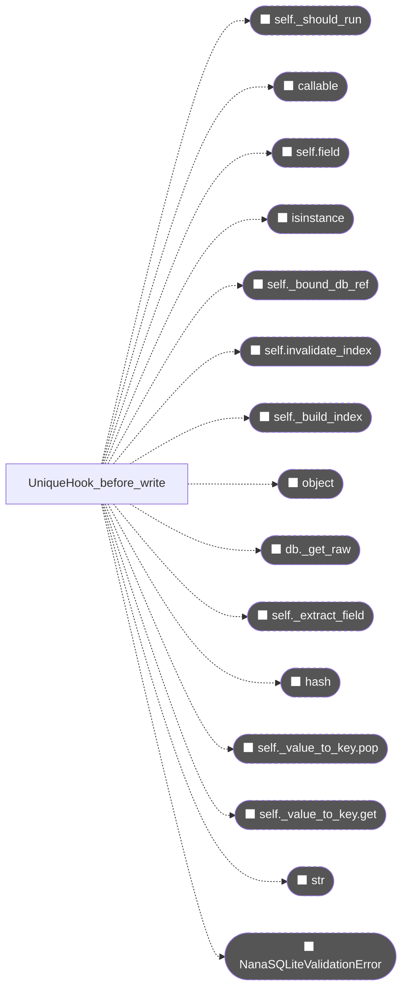


---

#### C144 🔴 `NanaSQLite.__init__`

> `core.py` L153-L488 | cc=41 | taint=T→.

**シグネチャ**:
```
NanaSQLite.__init__(self, db_path, table, bulk_load, optimize, cache_size_mb, strict_sql_validation, validator, coerce, v2_mode, v2_config) -> ?  [cc=41] [T→.]
```

**呼び出しグラフ**:
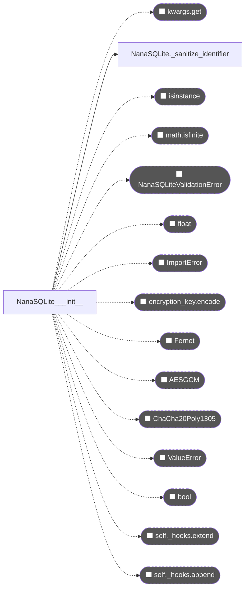


---

#### C160 🔴 `NanaSQLite._validate_expression`

> `core.py` L700-L829 | cc=33 | taint=T→.

**シグネチャ**:
```
NanaSQLite._validate_expression(self, expr, strict, allowed, forbidden, override_allowed, context) -> None  [cc=33] [T→.]
```

**呼び出しグラフ**:
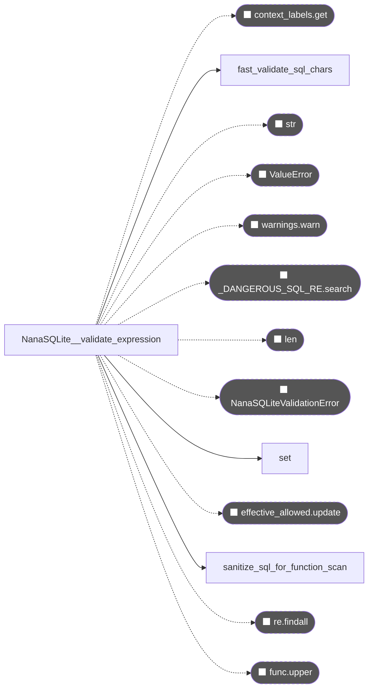


---

#### C204 🔴 `NanaSQLite.restore`

> `core.py` L1949-L2129 | cc=30 | taint=T→.

**シグネチャ**:
```
NanaSQLite.restore(self, src_path) -> None  [cc=30] [T→.]
```

**呼び出しグラフ**:
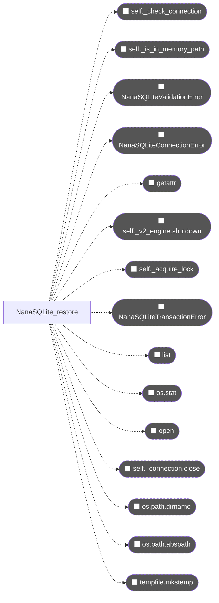


---

#### C276 🔴 `sanitize_sql_for_function_scan`

> `sql_utils.py` L23-L175 | cc=29 | taint=T→T
> 呼び出し元: `NanaSQLite._validate_expression`

**シグネチャ**:
```
sanitize_sql_for_function_scan(sql) -> str  [cc=29] [T→T]
```

**呼び出しグラフ**:
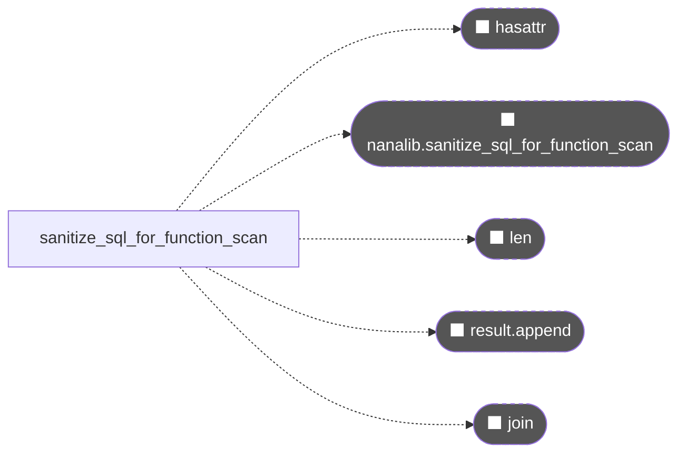


---

#### C196 🔴 `NanaSQLite.batch_update`

> `core.py` L1571-L1668 | cc=25 | taint=.→.

**シグネチャ**:
```
NanaSQLite.batch_update(self, mapping) -> None  [cc=25] [.→.]
```

**呼び出しグラフ**:
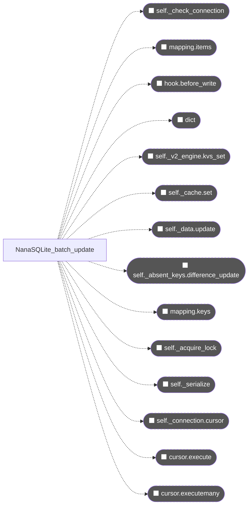


---

#### C081 🔴 `AsyncNanaSQLite._shared_query_impl`

> `async_core.py` L1689-L1785 | cc=24 | taint=T→T

**シグネチャ**:
```
AsyncNanaSQLite._shared_query_impl(self, table_name, columns, where, parameters, order_by, limit, offset, group_by, strict_sql_validation, allowed_sql_functions, forbidden_sql_functions, override_allowed) -> list[dict]  [cc=24] [T→T]
```

**呼び出しグラフ**:
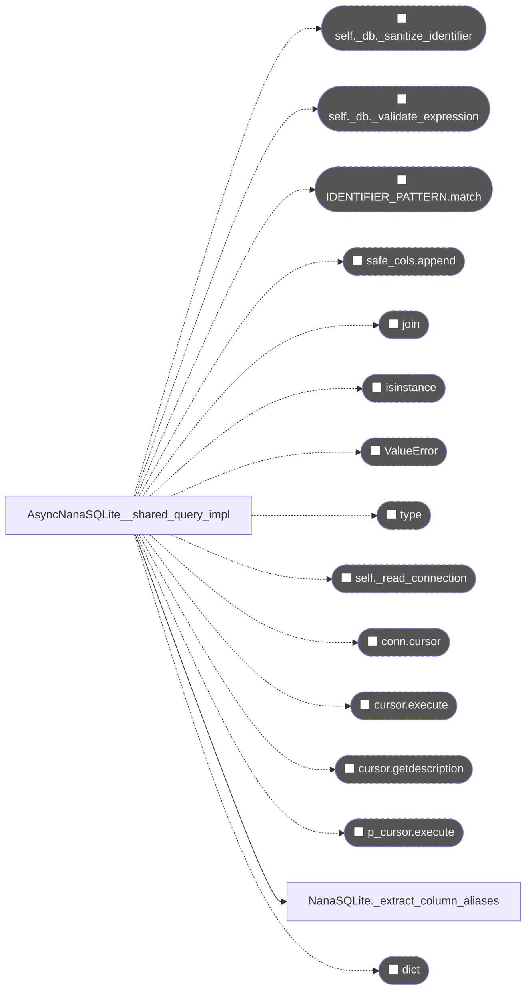


---

#### C198 🔴 `NanaSQLite.batch_delete`

> `core.py` L1762-L1832 | cc=21 | taint=.→.

**シグネチャ**:
```
NanaSQLite.batch_delete(self, keys) -> None  [cc=21] [.→.]
```

**呼び出しグラフ**:
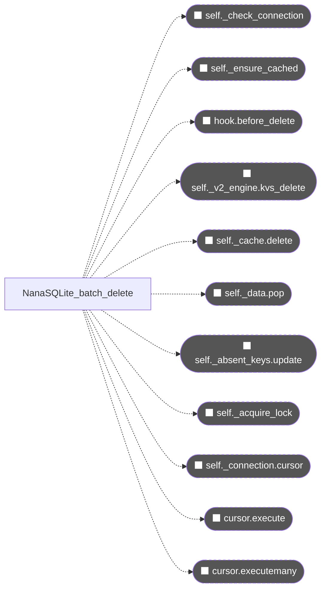


---

#### C234 🔴 `NanaSQLite.query_with_pagination`

> `core.py` L3050-L3196 | cc=21 | taint=T→T

**シグネチャ**:
```
NanaSQLite.query_with_pagination(self, table_name, columns, where, parameters, order_by, limit, offset, group_by, strict_sql_validation, allowed_sql_functions, forbidden_sql_functions, override_allowed) -> list[dict]  [cc=21] [T→T]
```

**呼び出しグラフ**:
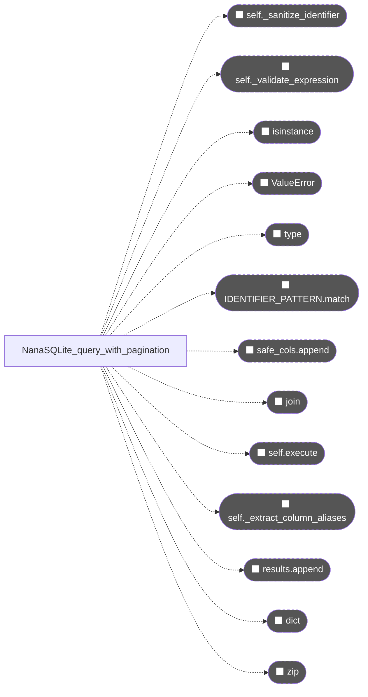


---

#### C197 🔴 `NanaSQLite.batch_update_partial`

> `core.py` L1670-L1760 | cc=18 | taint=.→T

**シグネチャ**:
```
NanaSQLite.batch_update_partial(self, mapping) -> dict[str, str]  [cc=18] [.→T]
```

**呼び出しグラフ**:
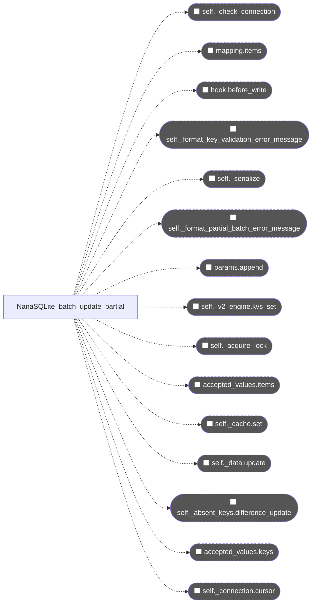


---

#### C307 🔴 `V2Engine._process_all_strict_tasks`

> `v2_engine.py` L392-L449 | cc=18 | taint=.→.

**シグネチャ**:
```
V2Engine._process_all_strict_tasks(self) -> None  [cc=18] [.→.]
```

**呼び出しグラフ**:
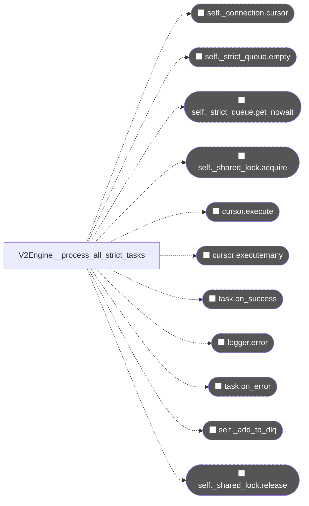


---

#### C203 🔴 `NanaSQLite.backup`

> `core.py` L1878-L1947 | cc=13 | taint=T→.

**シグネチャ**:
```
NanaSQLite.backup(self, dest_path) -> None  [cc=13] [T→.]
```

**呼び出しグラフ**:
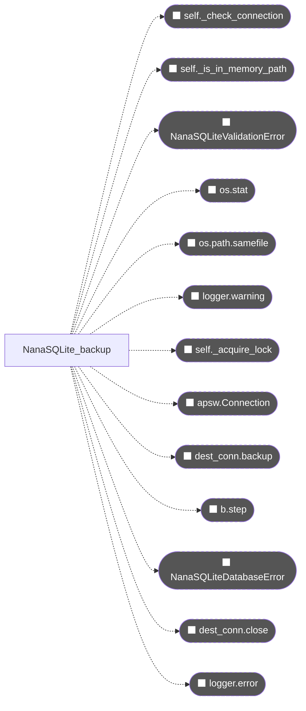


---

#### C277 🔴 `fast_validate_sql_chars`

> `sql_utils.py` L187-L215 | cc=5 | taint=T→.
> 呼び出し元: `NanaSQLite._validate_expression`

**シグネチャ**:
```
fast_validate_sql_chars(expr) -> bool  [cc=5] [T→.]
```

**呼び出しグラフ**:
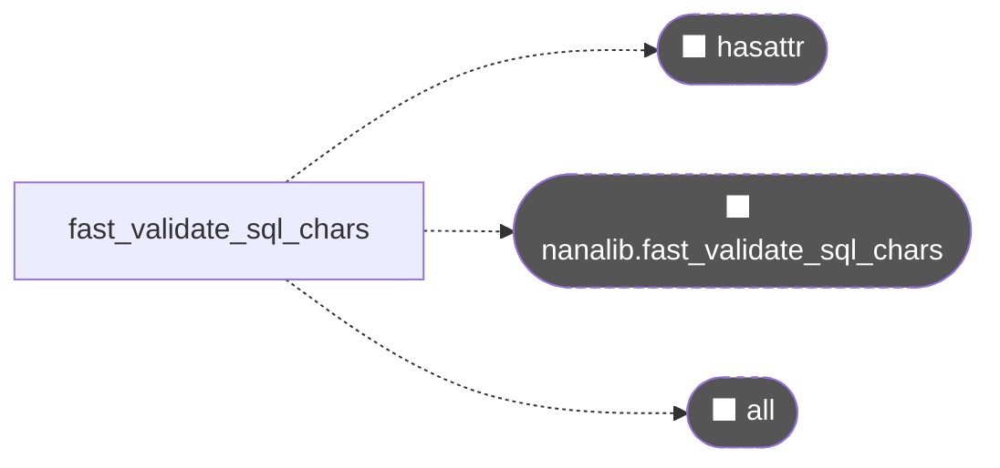


### 🟠 TIER-2 文脈依存 チャンク群


---

#### C231 🟠 `NanaSQLite.upsert`

> `core.py` L2892-L2978 | cc=17 | taint=T→T

**シグネチャ**:
```
NanaSQLite.upsert(self, table_name, data, conflict_columns) -> int | None  [cc=17] [T→T]
```

**呼び出しグラフ**:
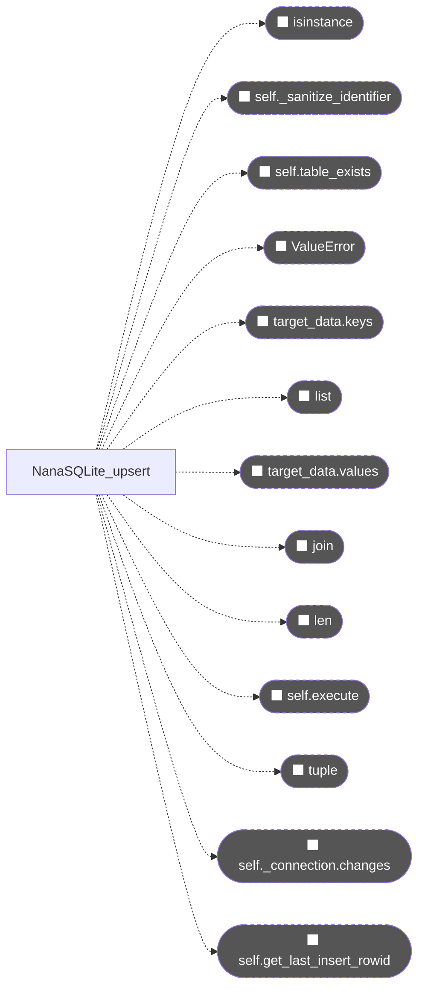


---

#### C220 🟠 `NanaSQLite.query`

> `core.py` L2512-L2640 | cc=16 | taint=T→T

**シグネチャ**:
```
NanaSQLite.query(self, table_name, columns, where, parameters, order_by, limit, strict_sql_validation, allowed_sql_functions, forbidden_sql_functions, override_allowed) -> list[dict]  [cc=16] [T→T]
```

**呼び出しグラフ**:
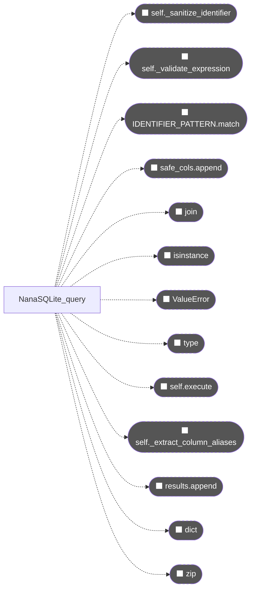


---

#### C183 🟠 `NanaSQLite.batch_get`

> `core.py` L1296-L1372 | cc=15 | taint=.→T

**シグネチャ**:
```
NanaSQLite.batch_get(self, keys) -> dict[str, Any]  [cc=15] [.→T]
```

**呼び出しグラフ**:
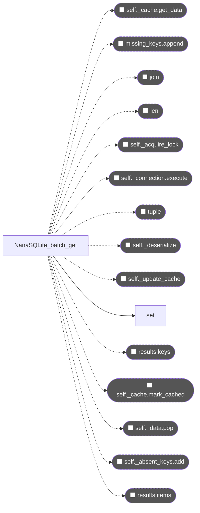


---

#### C184 🟠 `NanaSQLite.pop`

> `core.py` L1374-L1425 | cc=14 | taint=T→T

**シグネチャ**:
```
NanaSQLite.pop(self, key) -> Any  [cc=14] [T→T]
```

**呼び出しグラフ**:
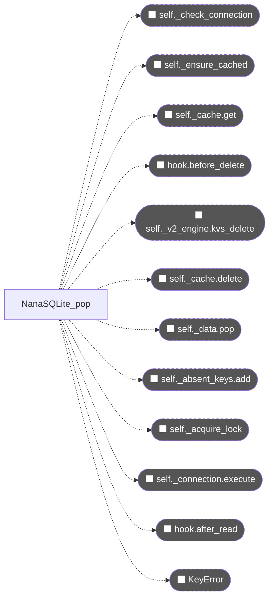


---

#### C246 🟠 `NanaSQLite.table`

> `core.py` L3514-L3637 | cc=14 | taint=T→.

**シグネチャ**:
```
NanaSQLite.table(self, table_name, cache_strategy, cache_size, cache_ttl, cache_persistence_ttl, validator, coerce, hooks, v2_enable_metrics) -> ?  [cc=14] [T→.]
```

**呼び出しグラフ**:
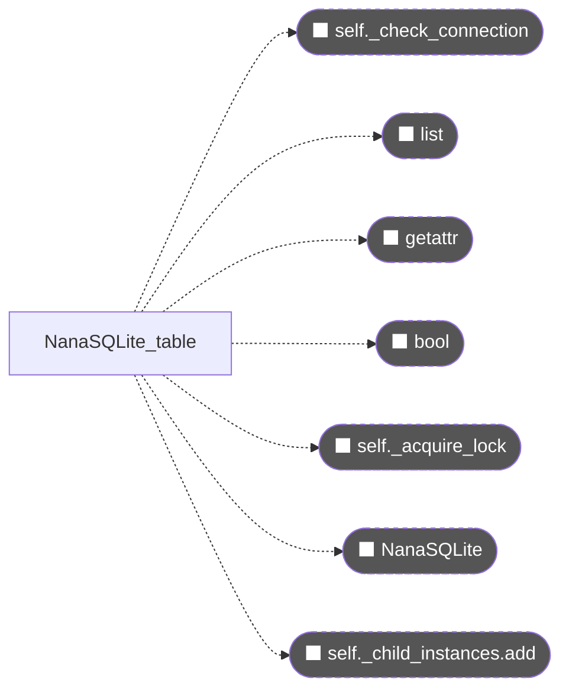


---

#### C169 🟠 `NanaSQLite._ensure_cached`

> `core.py` L959-L1014 | cc=13 | taint=T→.

**シグネチャ**:
```
NanaSQLite._ensure_cached(self, key) -> bool  [cc=13] [T→.]
```

**呼び出しグラフ**:
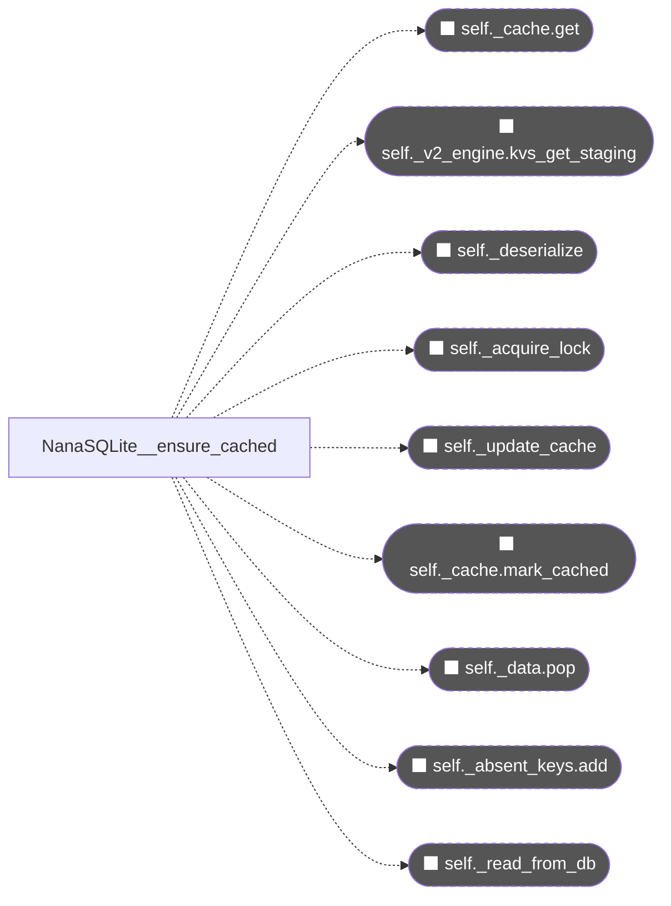


---

#### C252 🟠 `BaseHook._compile_re2`

> `hooks.py` L85-L173 | cc=13 | taint=.→T

**シグネチャ**:
```
BaseHook._compile_re2(self, pattern, re_fallback, flags) -> Any  [cc=13] [.→T]
```

**呼び出しグラフ**:
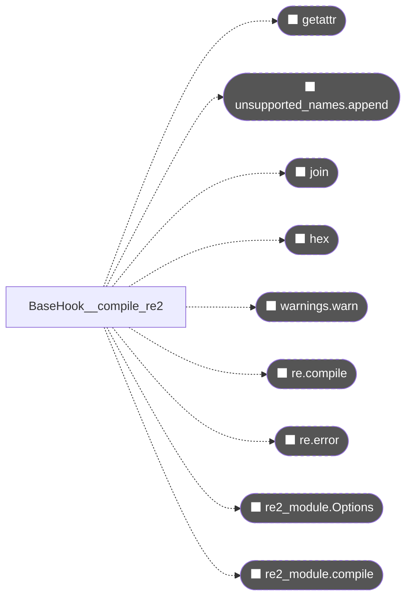


---

#### C306 🟠 `V2Engine._process_kvs_chunk`

> `v2_engine.py` L343-L390 | cc=13 | taint=.→.

**シグネチャ**:
```
V2Engine._process_kvs_chunk(self, kvs_chunk) -> None  [cc=13] [.→.]
```

**呼び出しグラフ**:
```mermaid
graph LR
    EXT_append(["⬛ append"]):::external
    V2Engine__process_kvs_chunk -.-> EXT_append
    EXT_self__connection_cursor(["⬛ self._connection.cursor"]):::external
    V2Engine__process_kvs_chunk -.-> EXT_self__connection_cursor
    EXT_self__shared_lock_acquire(["⬛ self._shared_lock.acquire"]):::external
    V2Engine__process_kvs_chunk -.-> EXT_self__shared_lock_acquire
    EXT_cursor_execute(["⬛ cursor.execute"]):::external
    V2Engine__process_kvs_chunk -.-> EXT_cursor_execute
    EXT_table_ops_items(["⬛ table_ops.items"]):::external
    V2Engine__process_kvs_chunk -.-> EXT_table_ops_items
    EXT_cursor_executemany(["⬛ cursor.executemany"]):::external
    V2Engine__process_kvs_chunk -.-> EXT_cursor_executemany
    EXT_len(["⬛ len"]):::external
    V2Engine__process_kvs_chunk -.-> EXT_len
    EXT_self__shared_lock_release(["⬛ self._shared_lock.release"]):::external
    V2Engine__process_kvs_chunk -.-> EXT_self__shared_lock_release
    classDef external fill:#555,color:#fff,stroke-dasharray:4
```


---

#### C069 🟠 `AsyncNanaSQLite.close`

> `async_core.py` L1367-L1421 | cc=11 | taint=.→.

**シグネチャ**:
```
AsyncNanaSQLite.close(self) -> None  [cc=11] [.→.]
```

**呼び出しグラフ**:
```mermaid
graph LR
    EXT_asyncio_get_running_loop(["⬛ asyncio.get_running_loop"]):::external
    AsyncNanaSQLite_close -.-> EXT_asyncio_get_running_loop
    EXT_loop_run_in_executor(["⬛ loop.run_in_executor"]):::external
    AsyncNanaSQLite_close -.-> EXT_loop_run_in_executor
    EXT_child__mark_parent_closed(["⬛ child._mark_parent_closed"]):::external
    AsyncNanaSQLite_close -.-> EXT_child__mark_parent_closed
    EXT_self__child_instances_clear(["⬛ self._child_instances.clear"]):::external
    AsyncNanaSQLite_close -.-> EXT_self__child_instances_clear
    EXT_self__read_pool_get_nowait(["⬛ self._read_pool.get_nowait"]):::external
    AsyncNanaSQLite_close -.-> EXT_self__read_pool_get_nowait
    EXT_conn_close(["⬛ conn.close"]):::external
    AsyncNanaSQLite_close -.-> EXT_conn_close
    EXT_logging_getLogger_warning(["⬛ logging.getLogger.warning"]):::external
    AsyncNanaSQLite_close -.-> EXT_logging_getLogger_warning
    EXT_logging_getLogger(["⬛ logging.getLogger"]):::external
    AsyncNanaSQLite_close -.-> EXT_logging_getLogger
    classDef external fill:#555,color:#fff,stroke-dasharray:4
```


---

#### C265 🟠 `UniqueHook.before_delete`

> `hooks.py` L513-L548 | cc=11 | taint=T→.

**シグネチャ**:
```
UniqueHook.before_delete(self, db, key) -> None  [cc=11] [T→.]
```

**呼び出しグラフ**:
```mermaid
graph LR
    EXT_self__bound_db_ref(["⬛ self._bound_db_ref"]):::external
    UniqueHook_before_delete -.-> EXT_self__bound_db_ref
    EXT_self_invalidate_index(["⬛ self.invalidate_index"]):::external
    UniqueHook_before_delete -.-> EXT_self_invalidate_index
    EXT_self__should_run(["⬛ self._should_run"]):::external
    UniqueHook_before_delete -.-> EXT_self__should_run
    EXT_object(["⬛ object"]):::external
    UniqueHook_before_delete -.-> EXT_object
    EXT_db__get_raw(["⬛ db._get_raw"]):::external
    UniqueHook_before_delete -.-> EXT_db__get_raw
    EXT_self__extract_field(["⬛ self._extract_field"]):::external
    UniqueHook_before_delete -.-> EXT_self__extract_field
    EXT_self__value_to_key_pop(["⬛ self._value_to_key.pop"]):::external
    UniqueHook_before_delete -.-> EXT_self__value_to_key_pop
    classDef external fill:#555,color:#fff,stroke-dasharray:4
```


---

#### C163 🟠 `NanaSQLite._deserialize`

> `core.py` L869-L914 | cc=10 | taint=T→T

**シグネチャ**:
```
NanaSQLite._deserialize(self, value) -> Any  [cc=10] [T→T]
```

**呼び出しグラフ**:
```mermaid
graph LR
    EXT_self__fernet_decrypt_decode(["⬛ self._fernet.decrypt.decode"]):::external
    NanaSQLite__deserialize -.-> EXT_self__fernet_decrypt_decode
    EXT_self__fernet_decrypt(["⬛ self._fernet.decrypt"]):::external
    NanaSQLite__deserialize -.-> EXT_self__fernet_decrypt
    EXT_orjson_loads(["⬛ orjson.loads"]):::external
    NanaSQLite__deserialize -.-> EXT_orjson_loads
    EXT_json_loads(["⬛ json.loads"]):::external
    NanaSQLite__deserialize -.-> EXT_json_loads
    EXT_isinstance(["⬛ isinstance"]):::external
    NanaSQLite__deserialize -.-> EXT_isinstance
    EXT_logger_warning(["⬛ logger.warning"]):::external
    NanaSQLite__deserialize -.-> EXT_logger_warning
    EXT_len(["⬛ len"]):::external
    NanaSQLite__deserialize -.-> EXT_len
    EXT_NanaSQLiteDatabaseError(["⬛ NanaSQLiteDatabaseError"]):::external
    NanaSQLite__deserialize -.-> EXT_NanaSQLiteDatabaseError
    EXT_self__aead_decrypt_decode(["⬛ self._aead.decrypt.decode"]):::external
    NanaSQLite__deserialize -.-> EXT_self__aead_decrypt_decode
    EXT_self__aead_decrypt(["⬛ self._aead.decrypt"]):::external
    NanaSQLite__deserialize -.-> EXT_self__aead_decrypt
    classDef external fill:#555,color:#fff,stroke-dasharray:4
```


---

#### C170 🟠 `NanaSQLite.__getitem__`

> `core.py` L1018-L1055 | cc=10 | taint=T→T

**シグネチャ**:
```
NanaSQLite.__getitem__(self, key) -> Any  [cc=10] [T→T]
```

**呼び出しグラフ**:
```mermaid
graph LR
    EXT_self__ensure_cached(["⬛ self._ensure_cached"]):::external
    NanaSQLite___getitem__ -.-> EXT_self__ensure_cached
    EXT_KeyError(["⬛ KeyError"]):::external
    NanaSQLite___getitem__ -.-> EXT_KeyError
    EXT_self__cache_get(["⬛ self._cache.get"]):::external
    NanaSQLite___getitem__ -.-> EXT_self__cache_get
    EXT_hook_after_read(["⬛ hook.after_read"]):::external
    NanaSQLite___getitem__ -.-> EXT_hook_after_read
    classDef external fill:#555,color:#fff,stroke-dasharray:4
```


---

#### C172 🟠 `NanaSQLite.__delitem__`

> `core.py` L1092-L1124 | cc=10 | taint=T→.

**シグネチャ**:
```
NanaSQLite.__delitem__(self, key) -> None  [cc=10] [T→.]
```

**呼び出しグラフ**:
```mermaid
graph LR
    EXT_self__check_connection(["⬛ self._check_connection"]):::external
    NanaSQLite___delitem__ -.-> EXT_self__check_connection
    EXT_self__ensure_cached(["⬛ self._ensure_cached"]):::external
    NanaSQLite___delitem__ -.-> EXT_self__ensure_cached
    EXT_KeyError(["⬛ KeyError"]):::external
    NanaSQLite___delitem__ -.-> EXT_KeyError
    EXT_hook_before_delete(["⬛ hook.before_delete"]):::external
    NanaSQLite___delitem__ -.-> EXT_hook_before_delete
    EXT_self__v2_engine_kvs_delete(["⬛ self._v2_engine.kvs_delete"]):::external
    NanaSQLite___delitem__ -.-> EXT_self__v2_engine_kvs_delete
    EXT_self__cache_delete(["⬛ self._cache.delete"]):::external
    NanaSQLite___delitem__ -.-> EXT_self__cache_delete
    EXT_self__data_pop(["⬛ self._data.pop"]):::external
    NanaSQLite___delitem__ -.-> EXT_self__data_pop
    EXT_self__absent_keys_add(["⬛ self._absent_keys.add"]):::external
    NanaSQLite___delitem__ -.-> EXT_self__absent_keys_add
    EXT_self__acquire_lock(["⬛ self._acquire_lock"]):::external
    NanaSQLite___delitem__ -.-> EXT_self__acquire_lock
    EXT_self__connection_execute(["⬛ self._connection.execute"]):::external
    NanaSQLite___delitem__ -.-> EXT_self__connection_execute
    classDef external fill:#555,color:#fff,stroke-dasharray:4
```


---

#### C180 🟠 `NanaSQLite.get`

> `core.py` L1197-L1227 | cc=10 | taint=T→T

**シグネチャ**:
```
NanaSQLite.get(self, key, default) -> Any  [cc=10] [T→T]
```

**呼び出しグラフ**:
```mermaid
graph LR
    EXT_self__ensure_cached(["⬛ self._ensure_cached"]):::external
    NanaSQLite_get -.-> EXT_self__ensure_cached
    EXT_self__cache_get(["⬛ self._cache.get"]):::external
    NanaSQLite_get -.-> EXT_self__cache_get
    EXT_hook_after_read(["⬛ hook.after_read"]):::external
    NanaSQLite_get -.-> EXT_hook_after_read
    classDef external fill:#555,color:#fff,stroke-dasharray:4
```


---

#### C282 🟠 `ExpiringDict._check_expiry`

> `utils.py` L131-L165 | cc=10 | taint=T→.

**シグネチャ**:
```
ExpiringDict._check_expiry(self, key) -> bool  [cc=10] [T→.]
```

**呼び出しグラフ**:
```mermaid
graph LR
    EXT_self__exptimes_get(["⬛ self._exptimes.get"]):::external
    ExpiringDict__check_expiry -.-> EXT_self__exptimes_get
    EXT_time_time(["⬛ time.time"]):::external
    ExpiringDict__check_expiry -.-> EXT_time_time
    EXT_self__data_pop(["⬛ self._data.pop"]):::external
    ExpiringDict__check_expiry -.-> EXT_self__data_pop
    EXT_self__exptimes_pop(["⬛ self._exptimes.pop"]):::external
    ExpiringDict__check_expiry -.-> EXT_self__exptimes_pop
    EXT_logger_debug(["⬛ logger.debug"]):::external
    ExpiringDict__check_expiry -.-> EXT_logger_debug
    EXT_self__on_expire(["⬛ self._on_expire"]):::external
    ExpiringDict__check_expiry -.-> EXT_self__on_expire
    EXT_logger_error(["⬛ logger.error"]):::external
    ExpiringDict__check_expiry -.-> EXT_logger_error
    classDef external fill:#555,color:#fff,stroke-dasharray:4
```


---

#### C313 🟠 `V2Engine.shutdown`

> `v2_engine.py` L543-L593 | cc=10 | taint=.→.

**シグネチャ**:
```
V2Engine.shutdown(self) -> None  [cc=10] [.→.]
```

**呼び出しグラフ**:
```mermaid
graph LR
    EXT_self__flush_event_set(["⬛ self._flush_event.set"]):::external
    V2Engine_shutdown -.-> EXT_self__flush_event_set
    EXT_contextlib_suppress(["⬛ contextlib.suppress"]):::external
    V2Engine_shutdown -.-> EXT_contextlib_suppress
    EXT_atexit_unregister(["⬛ atexit.unregister"]):::external
    V2Engine_shutdown -.-> EXT_atexit_unregister
    EXT_self__worker_shutdown(["⬛ self._worker.shutdown"]):::external
    V2Engine_shutdown -.-> EXT_self__worker_shutdown
    EXT_logger_warning(["⬛ logger.warning"]):::external
    V2Engine_shutdown -.-> EXT_logger_warning
    EXT_self__perform_flush(["⬛ self._perform_flush"]):::external
    V2Engine_shutdown -.-> EXT_self__perform_flush
    EXT_logger_error(["⬛ logger.error"]):::external
    V2Engine_shutdown -.-> EXT_logger_error
    EXT_self__strict_queue_empty(["⬛ self._strict_queue.empty"]):::external
    V2Engine_shutdown -.-> EXT_self__strict_queue_empty
    EXT_NanaSQLiteClosedError(["⬛ NanaSQLiteClosedError"]):::external
    V2Engine_shutdown -.-> EXT_NanaSQLiteClosedError
    EXT_self__strict_queue_get_nowait(["⬛ self._strict_queue.get_nowait"]):::external
    V2Engine_shutdown -.-> EXT_self__strict_queue_get_nowait
    EXT_task_on_error(["⬛ task.on_error"]):::external
    V2Engine_shutdown -.-> EXT_task_on_error
    classDef external fill:#555,color:#fff,stroke-dasharray:4
```


---

#### C139 🟠 `create_cache`

> `cache.py` L308-L334 | cc=9 | taint=.→T
> 呼び出し元: `NanaSQLite.__init__`

**シグネチャ**:
```
create_cache(strategy, size, ttl, on_expire) -> CacheStrategy  [cc=9] [.→T]
```

**呼び出しグラフ**:
```mermaid
graph LR
    EXT_isinstance(["⬛ isinstance"]):::external
    create_cache -.-> EXT_isinstance
    EXT_ValueError(["⬛ ValueError"]):::external
    create_cache -.-> EXT_ValueError
    EXT_logger_info(["⬛ logger.info"]):::external
    create_cache -.-> EXT_logger_info
    EXT_FastLRUCache(["⬛ FastLRUCache"]):::external
    create_cache -.-> EXT_FastLRUCache
    EXT_logger_warning(["⬛ logger.warning"]):::external
    create_cache -.-> EXT_logger_warning
    EXT_StdLRUCache(["⬛ StdLRUCache"]):::external
    create_cache -.-> EXT_StdLRUCache
    EXT_TTLCache(["⬛ TTLCache"]):::external
    create_cache -.-> EXT_TTLCache
    EXT_UnboundedCache(["⬛ UnboundedCache"]):::external
    create_cache -.-> EXT_UnboundedCache
    classDef external fill:#555,color:#fff,stroke-dasharray:4
```


---

#### C181 🟠 `NanaSQLite._get_raw`

> `core.py` L1229-L1254 | cc=9 | taint=T→T

**シグネチャ**:
```
NanaSQLite._get_raw(self, key, default) -> Any  [cc=9] [T→T]
```

**呼び出しグラフ**:
```mermaid
graph LR
    EXT_self__ensure_cached(["⬛ self._ensure_cached"]):::external
    NanaSQLite__get_raw -.-> EXT_self__ensure_cached
    EXT_self__data_get(["⬛ self._data.get"]):::external
    NanaSQLite__get_raw -.-> EXT_self__data_get
    EXT_self__cache_get(["⬛ self._cache.get"]):::external
    NanaSQLite__get_raw -.-> EXT_self__cache_get
    classDef external fill:#555,color:#fff,stroke-dasharray:4
```


---

#### C205 🟠 `NanaSQLite.close`

> `core.py` L2131-L2173 | cc=9 | taint=.→.

**シグネチャ**:
```
NanaSQLite.close(self) -> None  [cc=9] [.→.]
```

**呼び出しグラフ**:
```mermaid
graph LR
    EXT_NanaSQLiteTransactionError(["⬛ NanaSQLiteTransactionError"]):::external
    NanaSQLite_close -.-> EXT_NanaSQLiteTransactionError
    EXT_child__mark_parent_closed(["⬛ child._mark_parent_closed"]):::external
    NanaSQLite_close -.-> EXT_child__mark_parent_closed
    EXT_self__child_instances_clear(["⬛ self._child_instances.clear"]):::external
    NanaSQLite_close -.-> EXT_self__child_instances_clear
    EXT_self__v2_engine_shutdown(["⬛ self._v2_engine.shutdown"]):::external
    NanaSQLite_close -.-> EXT_self__v2_engine_shutdown
    EXT_warnings_warn(["⬛ warnings.warn"]):::external
    NanaSQLite_close -.-> EXT_warnings_warn
    EXT_self__cache_clear(["⬛ self._cache.clear"]):::external
    NanaSQLite_close -.-> EXT_self__cache_clear
    EXT_self__connection_close(["⬛ self._connection.close"]):::external
    NanaSQLite_close -.-> EXT_self__connection_close
    classDef external fill:#555,color:#fff,stroke-dasharray:4
```


---

#### C210 🟠 `NanaSQLite.execute`

> `core.py` L2259-L2334 | cc=9 | taint=T→T

**シグネチャ**:
```
NanaSQLite.execute(self, sql, parameters) -> apsw.Cursor  [cc=9] [T→T]
```

**呼び出しグラフ**:
```mermaid
graph LR
    EXT_self__check_connection(["⬛ self._check_connection"]):::external
    NanaSQLite_execute -.-> EXT_self__check_connection
    EXT_sql_strip_upper(["⬛ sql.strip.upper"]):::external
    NanaSQLite_execute -.-> EXT_sql_strip_upper
    EXT_sql_strip(["⬛ sql.strip"]):::external
    NanaSQLite_execute -.-> EXT_sql_strip
    EXT__sql_stripped_startswith(["⬛ _sql_stripped.startswith"]):::external
    NanaSQLite_execute -.-> EXT__sql_stripped_startswith
    EXT_threading_Event(["⬛ threading.Event"]):::external
    NanaSQLite_execute -.-> EXT_threading_Event
    EXT_event_set(["⬛ event.set"]):::external
    NanaSQLite_execute -.-> EXT_event_set
    EXT_self__v2_engine_enqueue_strict_task(["⬛ self._v2_engine.enqueue_strict_task"]):::external
    NanaSQLite_execute -.-> EXT_self__v2_engine_enqueue_strict_task
    EXT_event_wait(["⬛ event.wait"]):::external
    NanaSQLite_execute -.-> EXT_event_wait
    EXT_NanaSQLiteDatabaseError(["⬛ NanaSQLiteDatabaseError"]):::external
    NanaSQLite_execute -.-> EXT_NanaSQLiteDatabaseError
    EXT_self__acquire_lock(["⬛ self._acquire_lock"]):::external
    NanaSQLite_execute -.-> EXT_self__acquire_lock
    EXT_self__connection_cursor(["⬛ self._connection.cursor"]):::external
    NanaSQLite_execute -.-> EXT_self__connection_cursor
    EXT_self__connection_execute(["⬛ self._connection.execute"]):::external
    NanaSQLite_execute -.-> EXT_self__connection_execute
    classDef external fill:#555,color:#fff,stroke-dasharray:4
```


---

#### C286 🟠 `ExpiringDict.__getitem__`

> `utils.py` L207-L234 | cc=9 | taint=T→T

**シグネチャ**:
```
ExpiringDict.__getitem__(self, key) -> Any  [cc=9] [T→T]
```

**呼び出しグラフ**:
```mermaid
graph LR
    EXT_time_time(["⬛ time.time"]):::external
    ExpiringDict___getitem__ -.-> EXT_time_time
    EXT_self__data_pop(["⬛ self._data.pop"]):::external
    ExpiringDict___getitem__ -.-> EXT_self__data_pop
    EXT_self__exptimes_pop(["⬛ self._exptimes.pop"]):::external
    ExpiringDict___getitem__ -.-> EXT_self__exptimes_pop
    EXT_self__on_expire(["⬛ self._on_expire"]):::external
    ExpiringDict___getitem__ -.-> EXT_self__on_expire
    EXT_logger_error(["⬛ logger.error"]):::external
    ExpiringDict___getitem__ -.-> EXT_logger_error
    EXT_KeyError(["⬛ KeyError"]):::external
    ExpiringDict___getitem__ -.-> EXT_KeyError
    classDef external fill:#555,color:#fff,stroke-dasharray:4
```


---

#### C308 🟠 `V2Engine._recover_chunk_via_dlq`

> `v2_engine.py` L451-L483 | cc=9 | taint=.→.

**シグネチャ**:
```
V2Engine._recover_chunk_via_dlq(self, failed_kvs_chunk) -> None  [cc=9] [.→.]
```

**呼び出しグラフ**:
```mermaid
graph LR
    EXT_self__connection_cursor(["⬛ self._connection.cursor"]):::external
    V2Engine__recover_chunk_via_dlq -.-> EXT_self__connection_cursor
    EXT_self__shared_lock_acquire(["⬛ self._shared_lock.acquire"]):::external
    V2Engine__recover_chunk_via_dlq -.-> EXT_self__shared_lock_acquire
    EXT_cursor_execute(["⬛ cursor.execute"]):::external
    V2Engine__recover_chunk_via_dlq -.-> EXT_cursor_execute
    EXT_self__add_to_dlq(["⬛ self._add_to_dlq"]):::external
    V2Engine__recover_chunk_via_dlq -.-> EXT_self__add_to_dlq
    EXT_self__shared_lock_release(["⬛ self._shared_lock.release"]):::external
    V2Engine__recover_chunk_via_dlq -.-> EXT_self__shared_lock_release
    classDef external fill:#555,color:#fff,stroke-dasharray:4
```


---

#### C005 🟠 `AsyncNanaSQLite._ensure_initialized`

> `async_core.py` L240-L314 | cc=8 | taint=.→.

**シグネチャ**:
```
AsyncNanaSQLite._ensure_initialized(self) -> None  [cc=8] [.→.]
```

**呼び出しグラフ**:
```mermaid
graph LR
    EXT_getattr(["⬛ getattr"]):::external
    AsyncNanaSQLite__ensure_initialized -.-> EXT_getattr
    EXT_NanaSQLiteClosedError(["⬛ NanaSQLiteClosedError"]):::external
    AsyncNanaSQLite__ensure_initialized -.-> EXT_NanaSQLiteClosedError
    EXT_asyncio_Lock(["⬛ asyncio.Lock"]):::external
    AsyncNanaSQLite__ensure_initialized -.-> EXT_asyncio_Lock
    EXT_asyncio_get_running_loop(["⬛ asyncio.get_running_loop"]):::external
    AsyncNanaSQLite__ensure_initialized -.-> EXT_asyncio_get_running_loop
    EXT_loop_run_in_executor(["⬛ loop.run_in_executor"]):::external
    AsyncNanaSQLite__ensure_initialized -.-> EXT_loop_run_in_executor
    EXT_NanaSQLite(["⬛ NanaSQLite"]):::external
    AsyncNanaSQLite__ensure_initialized -.-> EXT_NanaSQLite
    EXT_queue_Queue(["⬛ queue.Queue"]):::external
    AsyncNanaSQLite__ensure_initialized -.-> EXT_queue_Queue
    EXT_range(["⬛ range"]):::external
    AsyncNanaSQLite__ensure_initialized -.-> EXT_range
    EXT_apsw_Connection(["⬛ apsw.Connection"]):::external
    AsyncNanaSQLite__ensure_initialized -.-> EXT_apsw_Connection
    EXT_conn_cursor(["⬛ conn.cursor"]):::external
    AsyncNanaSQLite__ensure_initialized -.-> EXT_conn_cursor
    EXT_c_execute(["⬛ c.execute"]):::external
    AsyncNanaSQLite__ensure_initialized -.-> EXT_c_execute
    EXT_self__read_pool_put(["⬛ self._read_pool.put"]):::external
    AsyncNanaSQLite__ensure_initialized -.-> EXT_self__read_pool_put
    classDef external fill:#555,color:#fff,stroke-dasharray:4
```


---

#### C192 🟠 `NanaSQLite.setdefault`

> `core.py` L1493-L1522 | cc=8 | taint=T→T

**シグネチャ**:
```
NanaSQLite.setdefault(self, key, default) -> Any  [cc=8] [T→T]
```

**呼び出しグラフ**:
```mermaid
graph LR
    EXT_self__ensure_cached(["⬛ self._ensure_cached"]):::external
    NanaSQLite_setdefault -.-> EXT_self__ensure_cached
    EXT_self__cache_get(["⬛ self._cache.get"]):::external
    NanaSQLite_setdefault -.-> EXT_self__cache_get
    EXT_hook_after_read(["⬛ hook.after_read"]):::external
    NanaSQLite_setdefault -.-> EXT_hook_after_read
    classDef external fill:#555,color:#fff,stroke-dasharray:4
```


---

#### C209 🟠 `NanaSQLite.get_model`

> `core.py` L2218-L2255 | cc=8 | taint=T→T

**シグネチャ**:
```
NanaSQLite.get_model(self, key, model_class) -> Any  [cc=8] [T→T]
```

**呼び出しグラフ**:
```mermaid
graph LR
    EXT_isinstance(["⬛ isinstance"]):::external
    NanaSQLite_get_model -.-> EXT_isinstance
    EXT_ValueError(["⬛ ValueError"]):::external
    NanaSQLite_get_model -.-> EXT_ValueError
    EXT_model_class(["⬛ model_class"]):::external
    NanaSQLite_get_model -.-> EXT_model_class
    classDef external fill:#555,color:#fff,stroke-dasharray:4
```


---

#### C218 🟠 `NanaSQLite.create_table`

> `core.py` L2430-L2481 | cc=8 | taint=T→.

**シグネチャ**:
```
NanaSQLite.create_table(self, table_name, columns, if_not_exists, primary_key) -> None  [cc=8] [T→.]
```

**呼び出しグラフ**:
```mermaid
graph LR
    EXT_self__sanitize_identifier(["⬛ self._sanitize_identifier"]):::external
    NanaSQLite_create_table -.-> EXT_self__sanitize_identifier
    EXT_columns_items(["⬛ columns.items"]):::external
    NanaSQLite_create_table -.-> EXT_columns_items
    EXT_str(["⬛ str"]):::external
    NanaSQLite_create_table -.-> EXT_str
    EXT_re_match(["⬛ re.match"]):::external
    NanaSQLite_create_table -.-> EXT_re_match
    EXT_NanaSQLiteValidationError(["⬛ NanaSQLiteValidationError"]):::external
    NanaSQLite_create_table -.-> EXT_NanaSQLiteValidationError
    EXT_column_defs_append(["⬛ column_defs.append"]):::external
    NanaSQLite_create_table -.-> EXT_column_defs_append
    EXT_any(["⬛ any"]):::external
    NanaSQLite_create_table -.-> EXT_any
    EXT_primary_key_upper(["⬛ primary_key.upper"]):::external
    NanaSQLite_create_table -.-> EXT_primary_key_upper
    EXT_col_upper(["⬛ col.upper"]):::external
    NanaSQLite_create_table -.-> EXT_col_upper
    EXT_join(["⬛ join"]):::external
    NanaSQLite_create_table -.-> EXT_join
    EXT_self_execute(["⬛ self.execute"]):::external
    NanaSQLite_create_table -.-> EXT_self_execute
    classDef external fill:#555,color:#fff,stroke-dasharray:4
```


---

#### C267 🟠 `ForeignKeyHook.before_write`

> `hooks.py` L570-L589 | cc=8 | taint=T→T

**シグネチャ**:
```
ForeignKeyHook.before_write(self, db, key, value) -> Any  [cc=8] [T→T]
```

**呼び出しグラフ**:
```mermaid
graph LR
    EXT_self__should_run(["⬛ self._should_run"]):::external
    ForeignKeyHook_before_write -.-> EXT_self__should_run
    EXT_callable(["⬛ callable"]):::external
    ForeignKeyHook_before_write -.-> EXT_callable
    EXT_self_field(["⬛ self.field"]):::external
    ForeignKeyHook_before_write -.-> EXT_self_field
    EXT_isinstance(["⬛ isinstance"]):::external
    ForeignKeyHook_before_write -.-> EXT_isinstance
    EXT_str(["⬛ str"]):::external
    ForeignKeyHook_before_write -.-> EXT_str
    EXT__logger_warning(["⬛ _logger.warning"]):::external
    ForeignKeyHook_before_write -.-> EXT__logger_warning
    EXT_NanaSQLiteValidationError(["⬛ NanaSQLiteValidationError"]):::external
    ForeignKeyHook_before_write -.-> EXT_NanaSQLiteValidationError
    classDef external fill:#555,color:#fff,stroke-dasharray:4
```


---

#### C271 🟠 `PydanticHook.before_write`

> `hooks.py` L634-L654 | cc=8 | taint=T→T

**シグネチャ**:
```
PydanticHook.before_write(self, db, key, value) -> Any  [cc=8] [T→T]
```

**呼び出しグラフ**:
```mermaid
graph LR
    EXT_self__should_run(["⬛ self._should_run"]):::external
    PydanticHook_before_write -.-> EXT_self__should_run
    EXT_isinstance(["⬛ isinstance"]):::external
    PydanticHook_before_write -.-> EXT_isinstance
    EXT_hasattr(["⬛ hasattr"]):::external
    PydanticHook_before_write -.-> EXT_hasattr
    EXT_value_model_dump(["⬛ value.model_dump"]):::external
    PydanticHook_before_write -.-> EXT_value_model_dump
    EXT_value_dict(["⬛ value.dict"]):::external
    PydanticHook_before_write -.-> EXT_value_dict
    EXT_self_model_class_model_validate(["⬛ self.model_class.model_validate"]):::external
    PydanticHook_before_write -.-> EXT_self_model_class_model_validate
    EXT_model_model_dump(["⬛ model.model_dump"]):::external
    PydanticHook_before_write -.-> EXT_model_model_dump
    EXT_self_model_class_parse_obj(["⬛ self.model_class.parse_obj"]):::external
    PydanticHook_before_write -.-> EXT_self_model_class_parse_obj
    EXT_model_dict(["⬛ model.dict"]):::external
    PydanticHook_before_write -.-> EXT_model_dict
    EXT__logger_error(["⬛ _logger.error"]):::external
    PydanticHook_before_write -.-> EXT__logger_error
    EXT_NanaSQLiteValidationError(["⬛ NanaSQLiteValidationError"]):::external
    PydanticHook_before_write -.-> EXT_NanaSQLiteValidationError
    classDef external fill:#555,color:#fff,stroke-dasharray:4
```


---

#### C280 🟠 `ExpiringDict._scheduler_loop`

> `utils.py` L77-L106 | cc=8 | taint=.→.

**シグネチャ**:
```
ExpiringDict._scheduler_loop(self) -> None  [cc=8] [.→.]
```

**呼び出しグラフ**:
```mermaid
graph LR
    EXT_time_time(["⬛ time.time"]):::external
    ExpiringDict__scheduler_loop -.-> EXT_time_time
    EXT_self__exptimes_items(["⬛ self._exptimes.items"]):::external
    ExpiringDict__scheduler_loop -.-> EXT_self__exptimes_items
    EXT_expired_keys_append(["⬛ expired_keys.append"]):::external
    ExpiringDict__scheduler_loop -.-> EXT_expired_keys_append
    EXT_next(["⬛ next"]):::external
    ExpiringDict__scheduler_loop -.-> EXT_next
    EXT_iter(["⬛ iter"]):::external
    ExpiringDict__scheduler_loop -.-> EXT_iter
    EXT_self__exptimes_values(["⬛ self._exptimes.values"]):::external
    ExpiringDict__scheduler_loop -.-> EXT_self__exptimes_values
    EXT_min(["⬛ min"]):::external
    ExpiringDict__scheduler_loop -.-> EXT_min
    EXT_self__evict(["⬛ self._evict"]):::external
    ExpiringDict__scheduler_loop -.-> EXT_self__evict
    EXT_self__stop_event_wait(["⬛ self._stop_event.wait"]):::external
    ExpiringDict__scheduler_loop -.-> EXT_self__stop_event_wait
    classDef external fill:#555,color:#fff,stroke-dasharray:4
```


---

#### C162 🟠 `NanaSQLite._serialize`

> `core.py` L837-L867 | cc=7 | taint=T→T

**シグネチャ**:
```
NanaSQLite._serialize(self, value) -> bytes | str  [cc=7] [T→T]
```

**呼び出しグラフ**:
```mermaid
graph LR
    EXT_orjson_dumps(["⬛ orjson.dumps"]):::external
    NanaSQLite__serialize -.-> EXT_orjson_dumps
    EXT_data_decode(["⬛ data.decode"]):::external
    NanaSQLite__serialize -.-> EXT_data_decode
    EXT_json_dumps(["⬛ json.dumps"]):::external
    NanaSQLite__serialize -.-> EXT_json_dumps
    EXT_json_str_encode(["⬛ json_str.encode"]):::external
    NanaSQLite__serialize -.-> EXT_json_str_encode
    EXT_self__fernet_encrypt(["⬛ self._fernet.encrypt"]):::external
    NanaSQLite__serialize -.-> EXT_self__fernet_encrypt
    EXT_os_urandom(["⬛ os.urandom"]):::external
    NanaSQLite__serialize -.-> EXT_os_urandom
    EXT_self__aead_encrypt(["⬛ self._aead.encrypt"]):::external
    NanaSQLite__serialize -.-> EXT_self__aead_encrypt
    classDef external fill:#555,color:#fff,stroke-dasharray:4
```


---

#### C240 🟠 `NanaSQLite.pragma`

> `core.py` L3300-L3366 | cc=7 | taint=T→T

**シグネチャ**:
```
NanaSQLite.pragma(self, pragma_name, value) -> Any  [cc=7] [T→T]
```

**呼び出しグラフ**:
```mermaid
graph LR
    EXT_ValueError(["⬛ ValueError"]):::external
    NanaSQLite_pragma -.-> EXT_ValueError
    EXT_join(["⬛ join"]):::external
    NanaSQLite_pragma -.-> EXT_join
    EXT_sorted(["⬛ sorted"]):::external
    NanaSQLite_pragma -.-> EXT_sorted
    EXT_self_execute(["⬛ self.execute"]):::external
    NanaSQLite_pragma -.-> EXT_self_execute
    EXT_cursor_fetchone(["⬛ cursor.fetchone"]):::external
    NanaSQLite_pragma -.-> EXT_cursor_fetchone
    EXT_isinstance(["⬛ isinstance"]):::external
    NanaSQLite_pragma -.-> EXT_isinstance
    EXT_type(["⬛ type"]):::external
    NanaSQLite_pragma -.-> EXT_type
    EXT_re_match(["⬛ re.match"]):::external
    NanaSQLite_pragma -.-> EXT_re_match
    EXT_str(["⬛ str"]):::external
    NanaSQLite_pragma -.-> EXT_str
    classDef external fill:#555,color:#fff,stroke-dasharray:4
```


---

#### C147 🟠 `NanaSQLite._sanitize_identifier`

> `core.py` L523-L563 | cc=6 | taint=T→T
> 呼び出し元: `NanaSQLite.__init__`

**シグネチャ**:
```
NanaSQLite._sanitize_identifier(identifier) -> str  [cc=6] [T→T]
```

**呼び出しグラフ**:
```mermaid
graph LR
    EXT_NanaSQLiteValidationError(["⬛ NanaSQLiteValidationError"]):::external
    NanaSQLite__sanitize_identifier -.-> EXT_NanaSQLiteValidationError
    EXT_identifier_startswith(["⬛ identifier.startswith"]):::external
    NanaSQLite__sanitize_identifier -.-> EXT_identifier_startswith
    EXT_identifier_endswith(["⬛ identifier.endswith"]):::external
    NanaSQLite__sanitize_identifier -.-> EXT_identifier_endswith
    EXT_len(["⬛ len"]):::external
    NanaSQLite__sanitize_identifier -.-> EXT_len
    EXT_IDENTIFIER_PATTERN_match(["⬛ IDENTIFIER_PATTERN.match"]):::external
    NanaSQLite__sanitize_identifier -.-> EXT_IDENTIFIER_PATTERN_match
    EXT_lru_cache(["⬛ lru_cache"]):::external
    NanaSQLite__sanitize_identifier -.-> EXT_lru_cache
    classDef external fill:#555,color:#fff,stroke-dasharray:4
```


---

#### C213 🟠 `NanaSQLite.execute_many`

> `core.py` L2336-L2389 | cc=5 | taint=T→.

**シグネチャ**:
```
NanaSQLite.execute_many(self, sql, parameters_list) -> None  [cc=5] [T→.]
```

**呼び出しグラフ**:
```mermaid
graph LR
    EXT_self__check_connection(["⬛ self._check_connection"]):::external
    NanaSQLite_execute_many -.-> EXT_self__check_connection
    EXT_threading_Event(["⬛ threading.Event"]):::external
    NanaSQLite_execute_many -.-> EXT_threading_Event
    EXT_event_set(["⬛ event.set"]):::external
    NanaSQLite_execute_many -.-> EXT_event_set
    EXT_self__v2_engine_enqueue_strict_task(["⬛ self._v2_engine.enqueue_strict_task"]):::external
    NanaSQLite_execute_many -.-> EXT_self__v2_engine_enqueue_strict_task
    EXT_event_wait(["⬛ event.wait"]):::external
    NanaSQLite_execute_many -.-> EXT_event_wait
    EXT_NanaSQLiteDatabaseError(["⬛ NanaSQLiteDatabaseError"]):::external
    NanaSQLite_execute_many -.-> EXT_NanaSQLiteDatabaseError
    EXT_self__acquire_lock(["⬛ self._acquire_lock"]):::external
    NanaSQLite_execute_many -.-> EXT_self__acquire_lock
    EXT_self__connection_cursor(["⬛ self._connection.cursor"]):::external
    NanaSQLite_execute_many -.-> EXT_self__connection_cursor
    EXT_cursor_execute(["⬛ cursor.execute"]):::external
    NanaSQLite_execute_many -.-> EXT_cursor_execute
    EXT_cursor_executemany(["⬛ cursor.executemany"]):::external
    NanaSQLite_execute_many -.-> EXT_cursor_executemany
    classDef external fill:#555,color:#fff,stroke-dasharray:4
```


---

#### C187 🟠 `NanaSQLite.get_dlq`

> `core.py` L1443-L1450 | cc=3 | taint=.→T

**シグネチャ**:
```
NanaSQLite.get_dlq(self) -> list[dict[str, Any]]  [cc=3] [.→T]
```

**呼び出しグラフ**:
```mermaid
graph LR
    EXT_self__v2_engine_get_dlq(["⬛ self._v2_engine.get_dlq"]):::external
    NanaSQLite_get_dlq -.-> EXT_self__v2_engine_get_dlq
    classDef external fill:#555,color:#fff,stroke-dasharray:4
```


---

#### C297 🟠 `V2Engine._add_to_dlq`

> `v2_engine.py` L180-L194 | cc=2 | taint=.→.

**シグネチャ**:
```
V2Engine._add_to_dlq(self, error_msg, item) -> None  [cc=2] [.→.]
```

**呼び出しグラフ**:
```mermaid
graph LR
    EXT_self_dlq_append(["⬛ self.dlq.append"]):::external
    V2Engine__add_to_dlq -.-> EXT_self_dlq_append
    EXT_DLQEntry(["⬛ DLQEntry"]):::external
    V2Engine__add_to_dlq -.-> EXT_DLQEntry
    EXT_time_time(["⬛ time.time"]):::external
    V2Engine__add_to_dlq -.-> EXT_time_time
    EXT_logger_error(["⬛ logger.error"]):::external
    V2Engine__add_to_dlq -.-> EXT_logger_error
    classDef external fill:#555,color:#fff,stroke-dasharray:4
```


---

#### C309 🟠 `V2Engine.get_dlq`

> `v2_engine.py` L485-L499 | cc=2 | taint=.→T

**シグネチャ**:
```
V2Engine.get_dlq(self) -> list[dict[str, Any]]  [cc=2] [.→T]
```

**呼び出しグラフ**:
```mermaid
graph LR
    classDef external fill:#555,color:#fff,stroke-dasharray:4
```


### 🟡 TIER-3 参考 チャンク群


---

#### C171 🟡 `NanaSQLite.__setitem__`

> `core.py` L1057-L1090 | cc=7 | taint=T→.

**シグネチャ**:
```
NanaSQLite.__setitem__(self, key, value) -> None  [cc=7] [T→.]
```

**呼び出しグラフ**:
```mermaid
graph LR
    EXT_self__check_connection(["⬛ self._check_connection"]):::external
    NanaSQLite___setitem__ -.-> EXT_self__check_connection
    EXT_hook_before_write(["⬛ hook.before_write"]):::external
    NanaSQLite___setitem__ -.-> EXT_hook_before_write
    EXT_self__v2_engine_kvs_set(["⬛ self._v2_engine.kvs_set"]):::external
    NanaSQLite___setitem__ -.-> EXT_self__v2_engine_kvs_set
    EXT_self__update_cache(["⬛ self._update_cache"]):::external
    NanaSQLite___setitem__ -.-> EXT_self__update_cache
    EXT_self__acquire_lock(["⬛ self._acquire_lock"]):::external
    NanaSQLite___setitem__ -.-> EXT_self__acquire_lock
    EXT_self__serialize(["⬛ self._serialize"]):::external
    NanaSQLite___setitem__ -.-> EXT_self__serialize
    EXT_self__connection_execute(["⬛ self._connection.execute"]):::external
    NanaSQLite___setitem__ -.-> EXT_self__connection_execute
    classDef external fill:#555,color:#fff,stroke-dasharray:4
```


---

#### C173 🟡 `NanaSQLite.__contains__`

> `core.py` L1126-L1157 | cc=7 | taint=T→.

**シグネチャ**:
```
NanaSQLite.__contains__(self, key) -> bool  [cc=7] [T→.]
```

**呼び出しグラフ**:
```mermaid
graph LR
    EXT_self__cache_get(["⬛ self._cache.get"]):::external
    NanaSQLite___contains__ -.-> EXT_self__cache_get
    EXT_self__acquire_lock(["⬛ self._acquire_lock"]):::external
    NanaSQLite___contains__ -.-> EXT_self__acquire_lock
    EXT_self__connection_execute(["⬛ self._connection.execute"]):::external
    NanaSQLite___contains__ -.-> EXT_self__connection_execute
    EXT_cursor_fetchone(["⬛ cursor.fetchone"]):::external
    NanaSQLite___contains__ -.-> EXT_cursor_fetchone
    EXT_self__absent_keys_add(["⬛ self._absent_keys.add"]):::external
    NanaSQLite___contains__ -.-> EXT_self__absent_keys_add
    classDef external fill:#555,color:#fff,stroke-dasharray:4
```


---

#### C225 🟡 `NanaSQLite.alter_table_add_column`

> `core.py` L2706-L2740 | cc=7 | taint=T→.

**シグネチャ**:
```
NanaSQLite.alter_table_add_column(self, table_name, column_name, column_type, default) -> None  [cc=7] [T→.]
```

**呼び出しグラフ**:
```mermaid
graph LR
    EXT_self__sanitize_identifier(["⬛ self._sanitize_identifier"]):::external
    NanaSQLite_alter_table_add_column -.-> EXT_self__sanitize_identifier
    EXT_re_match(["⬛ re.match"]):::external
    NanaSQLite_alter_table_add_column -.-> EXT_re_match
    EXT_ValueError(["⬛ ValueError"]):::external
    NanaSQLite_alter_table_add_column -.-> EXT_ValueError
    EXT_isinstance(["⬛ isinstance"]):::external
    NanaSQLite_alter_table_add_column -.-> EXT_isinstance
    EXT_stripped_startswith(["⬛ stripped.startswith"]):::external
    NanaSQLite_alter_table_add_column -.-> EXT_stripped_startswith
    EXT_stripped_endswith(["⬛ stripped.endswith"]):::external
    NanaSQLite_alter_table_add_column -.-> EXT_stripped_endswith
    EXT_len(["⬛ len"]):::external
    NanaSQLite_alter_table_add_column -.-> EXT_len
    EXT_stripped_replace(["⬛ stripped.replace"]):::external
    NanaSQLite_alter_table_add_column -.-> EXT_stripped_replace
    EXT_self_execute(["⬛ self.execute"]):::external
    NanaSQLite_alter_table_add_column -.-> EXT_self_execute
    classDef external fill:#555,color:#fff,stroke-dasharray:4
```


---

#### C292 🟡 `ExpiringDict.clear`

> `utils.py` L264-L287 | cc=7 | taint=.→.

**シグネチャ**:
```
ExpiringDict.clear(self) -> None  [cc=7] [.→.]
```

**呼び出しグラフ**:
```mermaid
graph LR
    EXT_tuple(["⬛ tuple"]):::external
    ExpiringDict_clear -.-> EXT_tuple
    EXT_self__cancel_timer(["⬛ self._cancel_timer"]):::external
    ExpiringDict_clear -.-> EXT_self__cancel_timer
    EXT_self__data_clear(["⬛ self._data.clear"]):::external
    ExpiringDict_clear -.-> EXT_self__data_clear
    EXT_self__exptimes_clear(["⬛ self._exptimes.clear"]):::external
    ExpiringDict_clear -.-> EXT_self__exptimes_clear
    EXT_self__stop_event_set(["⬛ self._stop_event.set"]):::external
    ExpiringDict_clear -.-> EXT_self__stop_event_set
    EXT_self__scheduler_thread_is_alive(["⬛ self._scheduler_thread.is_alive"]):::external
    ExpiringDict_clear -.-> EXT_self__scheduler_thread_is_alive
    EXT_threading_current_thread(["⬛ threading.current_thread"]):::external
    ExpiringDict_clear -.-> EXT_threading_current_thread
    EXT_self__scheduler_thread_join(["⬛ self._scheduler_thread.join"]):::external
    ExpiringDict_clear -.-> EXT_self__scheduler_thread_join
    EXT_logger_warning(["⬛ logger.warning"]):::external
    ExpiringDict_clear -.-> EXT_logger_warning
    EXT_self__stop_event_clear(["⬛ self._stop_event.clear"]):::external
    ExpiringDict_clear -.-> EXT_self__stop_event_clear
    EXT_self__start_scheduler(["⬛ self._start_scheduler"]):::external
    ExpiringDict_clear -.-> EXT_self__start_scheduler
    classDef external fill:#555,color:#fff,stroke-dasharray:4
```


---

#### C310 🟡 `V2Engine.retry_dlq`

> `v2_engine.py` L501-L524 | cc=7 | taint=.→.

**シグネチャ**:
```
V2Engine.retry_dlq(self) -> None  [cc=7] [.→.]
```

**呼び出しグラフ**:
```mermaid
graph LR
    EXT_list(["⬛ list"]):::external
    V2Engine_retry_dlq -.-> EXT_list
    EXT_self_dlq_clear(["⬛ self.dlq.clear"]):::external
    V2Engine_retry_dlq -.-> EXT_self_dlq_clear
    EXT_isinstance(["⬛ isinstance"]):::external
    V2Engine_retry_dlq -.-> EXT_isinstance
    EXT_self__strict_queue_put(["⬛ self._strict_queue.put"]):::external
    V2Engine_retry_dlq -.-> EXT_self__strict_queue_put
    EXT_len(["⬛ len"]):::external
    V2Engine_retry_dlq -.-> EXT_len
    EXT_logger_warning(["⬛ logger.warning"]):::external
    V2Engine_retry_dlq -.-> EXT_logger_warning
    EXT_self__check_auto_flush(["⬛ self._check_auto_flush"]):::external
    V2Engine_retry_dlq -.-> EXT_self__check_auto_flush
    classDef external fill:#555,color:#fff,stroke-dasharray:4
```


---

#### C193 🟡 `NanaSQLite.load_all`

> `core.py` L1526-L1544 | cc=6 | taint=.→.

**シグネチャ**:
```
NanaSQLite.load_all(self) -> None  [cc=6] [.→.]
```

**呼び出しグラフ**:
```mermaid
graph LR
    EXT_self__v2_engine_flush(["⬛ self._v2_engine.flush"]):::external
    NanaSQLite_load_all -.-> EXT_self__v2_engine_flush
    EXT_self__acquire_lock(["⬛ self._acquire_lock"]):::external
    NanaSQLite_load_all -.-> EXT_self__acquire_lock
    EXT_self__connection_execute(["⬛ self._connection.execute"]):::external
    NanaSQLite_load_all -.-> EXT_self__connection_execute
    EXT_list(["⬛ list"]):::external
    NanaSQLite_load_all -.-> EXT_list
    EXT_self__cache_set(["⬛ self._cache.set"]):::external
    NanaSQLite_load_all -.-> EXT_self__cache_set
    EXT_self__deserialize(["⬛ self._deserialize"]):::external
    NanaSQLite_load_all -.-> EXT_self__deserialize
    EXT_self__absent_keys_clear(["⬛ self._absent_keys.clear"]):::external
    NanaSQLite_load_all -.-> EXT_self__absent_keys_clear
    classDef external fill:#555,color:#fff,stroke-dasharray:4
```


---

#### C251 🟡 `BaseHook.__init__`

> `hooks.py` L47-L83 | cc=6 | taint=.→.

**シグネチャ**:
```
BaseHook.__init__(self, key_pattern, key_filter, re_fallback) -> ?  [cc=6] [.→.]
```

**呼び出しグラフ**:
```mermaid
graph LR
    EXT_isinstance(["⬛ isinstance"]):::external
    BaseHook___init__ -.-> EXT_isinstance
    EXT_self__compile_re2(["⬛ self._compile_re2"]):::external
    BaseHook___init__ -.-> EXT_self__compile_re2
    EXT_self__validate_regex_pattern(["⬛ self._validate_regex_pattern"]):::external
    BaseHook___init__ -.-> EXT_self__validate_regex_pattern
    EXT_re_compile(["⬛ re.compile"]):::external
    BaseHook___init__ -.-> EXT_re_compile
    classDef external fill:#555,color:#fff,stroke-dasharray:4
```


---

#### C263 🟡 `UniqueHook._build_index`

> `hooks.py` L329-L361 | cc=6 | taint=.→.

**シグネチャ**:
```
UniqueHook._build_index(self, db) -> None  [cc=6] [.→.]
```

**呼び出しグラフ**:
```mermaid
graph LR
    EXT_self__value_to_key_clear(["⬛ self._value_to_key.clear"]):::external
    UniqueHook__build_index -.-> EXT_self__value_to_key_clear
    EXT_self__duplicate_field_values_clear(["⬛ self._duplicate_field_values.clear"]):::external
    UniqueHook__build_index -.-> EXT_self__duplicate_field_values_clear
    EXT_db_items(["⬛ db.items"]):::external
    UniqueHook__build_index -.-> EXT_db_items
    EXT_self__extract_field(["⬛ self._extract_field"]):::external
    UniqueHook__build_index -.-> EXT_self__extract_field
    EXT_self__duplicate_field_values_add(["⬛ self._duplicate_field_values.add"]):::external
    UniqueHook__build_index -.-> EXT_self__duplicate_field_values_add
    EXT_weakref_ref(["⬛ weakref.ref"]):::external
    UniqueHook__build_index -.-> EXT_weakref_ref
    classDef external fill:#555,color:#fff,stroke-dasharray:4
```


---

#### C281 🟡 `ExpiringDict._evict`

> `utils.py` L108-L129 | cc=6 | taint=T→.

**シグネチャ**:
```
ExpiringDict._evict(self, key) -> None  [cc=6] [T→.]
```

**呼び出しグラフ**:
```mermaid
graph LR
    EXT_self__data_pop(["⬛ self._data.pop"]):::external
    ExpiringDict__evict -.-> EXT_self__data_pop
    EXT_self__exptimes_pop(["⬛ self._exptimes.pop"]):::external
    ExpiringDict__evict -.-> EXT_self__exptimes_pop
    EXT_logger_debug(["⬛ logger.debug"]):::external
    ExpiringDict__evict -.-> EXT_logger_debug
    EXT_self__on_expire(["⬛ self._on_expire"]):::external
    ExpiringDict__evict -.-> EXT_self__on_expire
    EXT_logger_error(["⬛ logger.error"]):::external
    ExpiringDict__evict -.-> EXT_logger_error
    classDef external fill:#555,color:#fff,stroke-dasharray:4
```


---

#### C303 🟡 `V2Engine.flush`

> `v2_engine.py` L268-L291 | cc=6 | taint=.→.

**シグネチャ**:
```
V2Engine.flush(self, wait) -> None  [cc=6] [.→.]
```

**呼び出しグラフ**:
```mermaid
graph LR
    EXT_self__flush_event_set(["⬛ self._flush_event.set"]):::external
    V2Engine_flush -.-> EXT_self__flush_event_set
    EXT_self__flush_pending_acquire(["⬛ self._flush_pending.acquire"]):::external
    V2Engine_flush -.-> EXT_self__flush_pending_acquire
    EXT_self__worker_submit(["⬛ self._worker.submit"]):::external
    V2Engine_flush -.-> EXT_self__worker_submit
    EXT_future_result(["⬛ future.result"]):::external
    V2Engine_flush -.-> EXT_future_result
    EXT_self__worker_submit_result(["⬛ self._worker.submit.result"]):::external
    V2Engine_flush -.-> EXT_self__worker_submit_result
    classDef external fill:#555,color:#fff,stroke-dasharray:4
```


---

#### C305 🟡 `V2Engine._perform_flush`

> `v2_engine.py` L300-L341 | cc=6 | taint=.→.

**シグネチャ**:
```
V2Engine._perform_flush(self) -> None  [cc=6] [.→.]
```

**呼び出しグラフ**:
```mermaid
graph LR
    EXT_time_time(["⬛ time.time"]):::external
    V2Engine__perform_flush -.-> EXT_time_time
    EXT_list(["⬛ list"]):::external
    V2Engine__perform_flush -.-> EXT_list
    EXT_current_buffer_items(["⬛ current_buffer.items"]):::external
    V2Engine__perform_flush -.-> EXT_current_buffer_items
    EXT_len(["⬛ len"]):::external
    V2Engine__perform_flush -.-> EXT_len
    EXT_range(["⬛ range"]):::external
    V2Engine__perform_flush -.-> EXT_range
    EXT_self__process_kvs_chunk(["⬛ self._process_kvs_chunk"]):::external
    V2Engine__perform_flush -.-> EXT_self__process_kvs_chunk
    EXT_logger_warning(["⬛ logger.warning"]):::external
    V2Engine__perform_flush -.-> EXT_logger_warning
    EXT_self__recover_chunk_via_dlq(["⬛ self._recover_chunk_via_dlq"]):::external
    V2Engine__perform_flush -.-> EXT_self__recover_chunk_via_dlq
    EXT_self__process_all_strict_tasks(["⬛ self._process_all_strict_tasks"]):::external
    V2Engine__perform_flush -.-> EXT_self__process_all_strict_tasks
    classDef external fill:#555,color:#fff,stroke-dasharray:4
```


---

#### C097 🟡 `UnboundedCache.set`

> `cache.py` L102-L111 | cc=5 | taint=T→.
> 呼び出し元: `UnboundedCache.__init__`, `TTLCache.__init__`, `NanaSQLite.__init__`, `NanaSQLite._validate_expression`, `NanaSQLite.batch_get` 他1件

**シグネチャ**:
```
UnboundedCache.set(self, key, value) -> None  [cc=5] [T→.]
```

**呼び出しグラフ**:
```mermaid
graph LR
    EXT_len(["⬛ len"]):::external
    UnboundedCache_set -.-> EXT_len
    EXT_next(["⬛ next"]):::external
    UnboundedCache_set -.-> EXT_next
    EXT_iter(["⬛ iter"]):::external
    UnboundedCache_set -.-> EXT_iter
    EXT_self__cached_keys_discard(["⬛ self._cached_keys.discard"]):::external
    UnboundedCache_set -.-> EXT_self__cached_keys_discard
    EXT_self__cached_keys_add(["⬛ self._cached_keys.add"]):::external
    UnboundedCache_set -.-> EXT_self__cached_keys_add
    classDef external fill:#555,color:#fff,stroke-dasharray:4
```


---

#### C130 🟡 `TTLCache.set`

> `cache.py` L268-L276 | cc=5 | taint=T→.
> 呼び出し元: `UnboundedCache.__init__`, `TTLCache.__init__`, `NanaSQLite.__init__`, `NanaSQLite._validate_expression`, `NanaSQLite.batch_get` 他1件

**シグネチャ**:
```
TTLCache.set(self, key, value) -> None  [cc=5] [T→.]
```

**呼び出しグラフ**:
```mermaid
graph LR
    EXT_len(["⬛ len"]):::external
    TTLCache_set -.-> EXT_len
    EXT_next(["⬛ next"]):::external
    TTLCache_set -.-> EXT_next
    EXT_iter(["⬛ iter"]):::external
    TTLCache_set -.-> EXT_iter
    EXT_self__cached_keys_discard(["⬛ self._cached_keys.discard"]):::external
    TTLCache_set -.-> EXT_self__cached_keys_discard
    EXT_self__cached_keys_add(["⬛ self._cached_keys.add"]):::external
    TTLCache_set -.-> EXT_self__cached_keys_add
    classDef external fill:#555,color:#fff,stroke-dasharray:4
```


---

#### C168 🟡 `NanaSQLite._update_cache`

> `core.py` L944-L957 | cc=5 | taint=T→.

**シグネチャ**:
```
NanaSQLite._update_cache(self, key, value) -> None  [cc=5] [T→.]
```

**呼び出しグラフ**:
```mermaid
graph LR
    EXT_self__cache_set(["⬛ self._cache.set"]):::external
    NanaSQLite__update_cache -.-> EXT_self__cache_set
    EXT_self__absent_keys_discard(["⬛ self._absent_keys.discard"]):::external
    NanaSQLite__update_cache -.-> EXT_self__absent_keys_discard
    classDef external fill:#555,color:#fff,stroke-dasharray:4
```


---

#### C182 🟡 `NanaSQLite.get_fresh`

> `core.py` L1256-L1294 | cc=5 | taint=T→T

**シグネチャ**:
```
NanaSQLite.get_fresh(self, key, default) -> Any  [cc=5] [T→T]
```

**呼び出しグラフ**:
```mermaid
graph LR
    EXT_self__read_from_db(["⬛ self._read_from_db"]):::external
    NanaSQLite_get_fresh -.-> EXT_self__read_from_db
    EXT_self__acquire_lock(["⬛ self._acquire_lock"]):::external
    NanaSQLite_get_fresh -.-> EXT_self__acquire_lock
    EXT_self__update_cache(["⬛ self._update_cache"]):::external
    NanaSQLite_get_fresh -.-> EXT_self__update_cache
    EXT_hook_after_read(["⬛ hook.after_read"]):::external
    NanaSQLite_get_fresh -.-> EXT_hook_after_read
    EXT_self__cache_delete(["⬛ self._cache.delete"]):::external
    NanaSQLite_get_fresh -.-> EXT_self__cache_delete
    EXT_self__data_pop(["⬛ self._data.pop"]):::external
    NanaSQLite_get_fresh -.-> EXT_self__data_pop
    EXT_self__absent_keys_add(["⬛ self._absent_keys.add"]):::external
    NanaSQLite_get_fresh -.-> EXT_self__absent_keys_add
    classDef external fill:#555,color:#fff,stroke-dasharray:4
```


---

#### C227 🟡 `NanaSQLite.list_indexes`

> `core.py` L2774-L2801 | cc=5 | taint=T→T

**シグネチャ**:
```
NanaSQLite.list_indexes(self, table_name) -> list[dict]  [cc=5] [T→T]
```

**呼び出しグラフ**:
```mermaid
graph LR
    EXT_self_execute(["⬛ self.execute"]):::external
    NanaSQLite_list_indexes -.-> EXT_self_execute
    EXT_startswith(["⬛ startswith"]):::external
    NanaSQLite_list_indexes -.-> EXT_startswith
    EXT_indexes_append(["⬛ indexes.append"]):::external
    NanaSQLite_list_indexes -.-> EXT_indexes_append
    classDef external fill:#555,color:#fff,stroke-dasharray:4
```


---

#### C238 🟡 `NanaSQLite.import_from_dict_list`

> `core.py` L3248-L3285 | cc=5 | taint=T→.

**シグネチャ**:
```
NanaSQLite.import_from_dict_list(self, table_name, data_list) -> int  [cc=5] [T→.]
```

**呼び出しグラフ**:
```mermaid
graph LR
    EXT_self__sanitize_identifier(["⬛ self._sanitize_identifier"]):::external
    NanaSQLite_import_from_dict_list -.-> EXT_self__sanitize_identifier
    EXT_list(["⬛ list"]):::external
    NanaSQLite_import_from_dict_list -.-> EXT_list
    NanaSQLite_import_from_dict_list --> keys["keys"]
    EXT_join(["⬛ join"]):::external
    NanaSQLite_import_from_dict_list -.-> EXT_join
    EXT_len(["⬛ len"]):::external
    NanaSQLite_import_from_dict_list -.-> EXT_len
    EXT_data_get(["⬛ data.get"]):::external
    NanaSQLite_import_from_dict_list -.-> EXT_data_get
    EXT_parameters_list_append(["⬛ parameters_list.append"]):::external
    NanaSQLite_import_from_dict_list -.-> EXT_parameters_list_append
    EXT_tuple(["⬛ tuple"]):::external
    NanaSQLite_import_from_dict_list -.-> EXT_tuple
    EXT_self_execute_many(["⬛ self.execute_many"]):::external
    NanaSQLite_import_from_dict_list -.-> EXT_self_execute_many
    classDef external fill:#555,color:#fff,stroke-dasharray:4
```


---

#### C254 🟡 `BaseHook._should_run`

> `hooks.py` L197-L203 | cc=5 | taint=T→.

**シグネチャ**:
```
BaseHook._should_run(self, key) -> bool  [cc=5] [T→.]
```

**呼び出しグラフ**:
```mermaid
graph LR
    EXT_self__key_regex_search(["⬛ self._key_regex.search"]):::external
    BaseHook__should_run -.-> EXT_self__key_regex_search
    EXT_self__key_filter(["⬛ self._key_filter"]):::external
    BaseHook__should_run -.-> EXT_self__key_filter
    classDef external fill:#555,color:#fff,stroke-dasharray:4
```


---

#### C269 🟡 `ValidkitHook.before_write`

> `hooks.py` L611-L624 | cc=5 | taint=T→T

**シグネチャ**:
```
ValidkitHook.before_write(self, db, key, value) -> Any  [cc=5] [T→T]
```

**呼び出しグラフ**:
```mermaid
graph LR
    EXT_self__should_run(["⬛ self._should_run"]):::external
    ValidkitHook_before_write -.-> EXT_self__should_run
    EXT_self__validate_func(["⬛ self._validate_func"]):::external
    ValidkitHook_before_write -.-> EXT_self__validate_func
    EXT_isinstance(["⬛ isinstance"]):::external
    ValidkitHook_before_write -.-> EXT_isinstance
    EXT__logger_error(["⬛ _logger.error"]):::external
    ValidkitHook_before_write -.-> EXT__logger_error
    EXT_NanaSQLiteValidationError(["⬛ NanaSQLiteValidationError"]):::external
    ValidkitHook_before_write -.-> EXT_NanaSQLiteValidationError
    classDef external fill:#555,color:#fff,stroke-dasharray:4
```


---

#### C272 🟡 `PydanticHook.after_read`

> `hooks.py` L656-L668 | cc=5 | taint=T→T

**シグネチャ**:
```
PydanticHook.after_read(self, db, key, value) -> Any  [cc=5] [T→T]
```

**呼び出しグラフ**:
```mermaid
graph LR
    EXT_self__should_run(["⬛ self._should_run"]):::external
    PydanticHook_after_read -.-> EXT_self__should_run
    EXT_hasattr(["⬛ hasattr"]):::external
    PydanticHook_after_read -.-> EXT_hasattr
    EXT_self_model_class_model_validate(["⬛ self.model_class.model_validate"]):::external
    PydanticHook_after_read -.-> EXT_self_model_class_model_validate
    EXT_self_model_class_parse_obj(["⬛ self.model_class.parse_obj"]):::external
    PydanticHook_after_read -.-> EXT_self_model_class_parse_obj
    EXT__logger_debug(["⬛ _logger.debug"]):::external
    PydanticHook_after_read -.-> EXT__logger_debug
    classDef external fill:#555,color:#fff,stroke-dasharray:4
```


---

#### C293 🟡 `ExpiringDict.__del__`

> `utils.py` L289-L299 | cc=5 | taint=.→.

**シグネチャ**:
```
ExpiringDict.__del__(self) -> ?  [cc=5] [.→.]
```

**呼び出しグラフ**:
```mermaid
graph LR
    EXT_self__stop_event_set(["⬛ self._stop_event.set"]):::external
    ExpiringDict___del__ -.-> EXT_self__stop_event_set
    EXT_self__scheduler_thread_is_alive(["⬛ self._scheduler_thread.is_alive"]):::external
    ExpiringDict___del__ -.-> EXT_self__scheduler_thread_is_alive
    EXT_threading_current_thread(["⬛ threading.current_thread"]):::external
    ExpiringDict___del__ -.-> EXT_threading_current_thread
    EXT_self__scheduler_thread_join(["⬛ self._scheduler_thread.join"]):::external
    ExpiringDict___del__ -.-> EXT_self__scheduler_thread_join
    classDef external fill:#555,color:#fff,stroke-dasharray:4
```


---

#### C073 🟡 `AsyncNanaSQLite.table`

> `async_core.py` L1453-L1556 | cc=4 | taint=T→T

**シグネチャ**:
```
AsyncNanaSQLite.table(self, table_name, validator, coerce, hooks) -> AsyncNanaSQLite  [cc=4] [T→T]
```

**呼び出しグラフ**:
```mermaid
graph LR
    EXT_self__ensure_initialized(["⬛ self._ensure_initialized"]):::external
    AsyncNanaSQLite_table -.-> EXT_self__ensure_initialized
    EXT_asyncio_get_running_loop(["⬛ asyncio.get_running_loop"]):::external
    AsyncNanaSQLite_table -.-> EXT_asyncio_get_running_loop
    EXT_loop_run_in_executor(["⬛ loop.run_in_executor"]):::external
    AsyncNanaSQLite_table -.-> EXT_loop_run_in_executor
    EXT_self__db_table(["⬛ self._db.table"]):::external
    AsyncNanaSQLite_table -.-> EXT_self__db_table
    EXT_object___new__(["⬛ object.__new__"]):::external
    AsyncNanaSQLite_table -.-> EXT_object___new__
    EXT_bool(["⬛ bool"]):::external
    AsyncNanaSQLite_table -.-> EXT_bool
    EXT_getattr(["⬛ getattr"]):::external
    AsyncNanaSQLite_table -.-> EXT_getattr
    EXT_weakref_WeakSet(["⬛ weakref.WeakSet"]):::external
    AsyncNanaSQLite_table -.-> EXT_weakref_WeakSet
    EXT_self__child_instances_add(["⬛ self._child_instances.add"]):::external
    AsyncNanaSQLite_table -.-> EXT_self__child_instances_add
    classDef external fill:#555,color:#fff,stroke-dasharray:4
```


---

#### C150 🟡 `NanaSQLite._extract_column_aliases`

> `core.py` L586-L601 | cc=4 | taint=T→T
> 呼び出し元: `AsyncNanaSQLite._shared_query_impl`

**シグネチャ**:
```
NanaSQLite._extract_column_aliases(columns) -> list[str]  [cc=4] [T→T]
```

**呼び出しグラフ**:
```mermaid
graph LR
    EXT_col_split(["⬛ col.split"]):::external
    NanaSQLite__extract_column_aliases -.-> EXT_col_split
    EXT_len(["⬛ len"]):::external
    NanaSQLite__extract_column_aliases -.-> EXT_len
    EXT_lower(["⬛ lower"]):::external
    NanaSQLite__extract_column_aliases -.-> EXT_lower
    EXT_strip_strip_strip(["⬛ strip.strip.strip"]):::external
    NanaSQLite__extract_column_aliases -.-> EXT_strip_strip_strip
    EXT_strip_strip(["⬛ strip.strip"]):::external
    NanaSQLite__extract_column_aliases -.-> EXT_strip_strip
    EXT_strip(["⬛ strip"]):::external
    NanaSQLite__extract_column_aliases -.-> EXT_strip
    EXT_col_names_append(["⬛ col_names.append"]):::external
    NanaSQLite__extract_column_aliases -.-> EXT_col_names_append
    EXT_col_strip_strip_strip(["⬛ col.strip.strip.strip"]):::external
    NanaSQLite__extract_column_aliases -.-> EXT_col_strip_strip_strip
    EXT_col_strip_strip(["⬛ col.strip.strip"]):::external
    NanaSQLite__extract_column_aliases -.-> EXT_col_strip_strip
    EXT_col_strip(["⬛ col.strip"]):::external
    NanaSQLite__extract_column_aliases -.-> EXT_col_strip
    classDef external fill:#555,color:#fff,stroke-dasharray:4
```


---

#### C185 🟡 `NanaSQLite.update`

> `core.py` L1427-L1433 | cc=4 | taint=.→.

**シグネチャ**:
```
NanaSQLite.update(self, mapping) -> None  [cc=4] [.→.]
```

**呼び出しグラフ**:
```mermaid
graph LR
    EXT_mapping_items(["⬛ mapping.items"]):::external
    NanaSQLite_update -.-> EXT_mapping_items
    EXT_kwargs_items(["⬛ kwargs.items"]):::external
    NanaSQLite_update -.-> EXT_kwargs_items
    classDef external fill:#555,color:#fff,stroke-dasharray:4
```


---

#### C191 🟡 `NanaSQLite.clear`

> `core.py` L1477-L1491 | cc=4 | taint=.→.

**シグネチャ**:
```
NanaSQLite.clear(self) -> None  [cc=4] [.→.]
```

**呼び出しグラフ**:
```mermaid
graph LR
    EXT_self__check_connection(["⬛ self._check_connection"]):::external
    NanaSQLite_clear -.-> EXT_self__check_connection
    EXT_self__v2_engine_flush(["⬛ self._v2_engine.flush"]):::external
    NanaSQLite_clear -.-> EXT_self__v2_engine_flush
    EXT_self__acquire_lock(["⬛ self._acquire_lock"]):::external
    NanaSQLite_clear -.-> EXT_self__acquire_lock
    EXT_self__connection_execute(["⬛ self._connection.execute"]):::external
    NanaSQLite_clear -.-> EXT_self__connection_execute
    EXT_self__cache_clear(["⬛ self._cache.clear"]):::external
    NanaSQLite_clear -.-> EXT_self__cache_clear
    EXT_self__absent_keys_clear(["⬛ self._absent_keys.clear"]):::external
    NanaSQLite_clear -.-> EXT_self__absent_keys_clear
    classDef external fill:#555,color:#fff,stroke-dasharray:4
```


---

#### C219 🟡 `NanaSQLite.create_index`

> `core.py` L2483-L2510 | cc=4 | taint=T→.

**シグネチャ**:
```
NanaSQLite.create_index(self, index_name, table_name, columns, unique, if_not_exists) -> None  [cc=4] [T→.]
```

**呼び出しグラフ**:
```mermaid
graph LR
    EXT_self__sanitize_identifier(["⬛ self._sanitize_identifier"]):::external
    NanaSQLite_create_index -.-> EXT_self__sanitize_identifier
    EXT_join(["⬛ join"]):::external
    NanaSQLite_create_index -.-> EXT_join
    EXT_self_execute(["⬛ self.execute"]):::external
    NanaSQLite_create_index -.-> EXT_self_execute
    classDef external fill:#555,color:#fff,stroke-dasharray:4
```


---

#### C241 🟡 `NanaSQLite.begin_transaction`

> `core.py` L3370-L3419 | cc=4 | taint=.→.

**シグネチャ**:
```
NanaSQLite.begin_transaction(self) -> None  [cc=4] [.→.]
```

**呼び出しグラフ**:
```mermaid
graph LR
    EXT_self__check_connection(["⬛ self._check_connection"]):::external
    NanaSQLite_begin_transaction -.-> EXT_self__check_connection
    EXT_NanaSQLiteTransactionError(["⬛ NanaSQLiteTransactionError"]):::external
    NanaSQLite_begin_transaction -.-> EXT_NanaSQLiteTransactionError
    EXT_self__acquire_lock(["⬛ self._acquire_lock"]):::external
    NanaSQLite_begin_transaction -.-> EXT_self__acquire_lock
    EXT_self__connection_execute(["⬛ self._connection.execute"]):::external
    NanaSQLite_begin_transaction -.-> EXT_self__connection_execute
    EXT_NanaSQLiteDatabaseError(["⬛ NanaSQLiteDatabaseError"]):::external
    NanaSQLite_begin_transaction -.-> EXT_NanaSQLiteDatabaseError
    classDef external fill:#555,color:#fff,stroke-dasharray:4
```


---

#### C283 🟡 `ExpiringDict.__setitem__`

> `utils.py` L167-L183 | cc=4 | taint=T→.

**シグネチャ**:
```
ExpiringDict.__setitem__(self, key, value) -> None  [cc=4] [T→.]
```

**呼び出しグラフ**:
```mermaid
graph LR
    EXT_time_time(["⬛ time.time"]):::external
    ExpiringDict___setitem__ -.-> EXT_time_time
    EXT_self__cancel_timer(["⬛ self._cancel_timer"]):::external
    ExpiringDict___setitem__ -.-> EXT_self__cancel_timer
    EXT_self__set_timer(["⬛ self._set_timer"]):::external
    ExpiringDict___setitem__ -.-> EXT_self__set_timer
    classDef external fill:#555,color:#fff,stroke-dasharray:4
```


---

#### C294 🟡 `V2Engine.__init__`

> `v2_engine.py` L88-L160 | cc=4 | taint=T→.

**シグネチャ**:
```
V2Engine.__init__(self, connection, table_name, flush_mode, flush_interval, flush_count, max_chunk_size, serialize_func, enable_metrics, shared_lock) -> ?  [cc=4] [T→.]
```

**呼び出しグラフ**:
```mermaid
graph LR
    EXT_ValueError(["⬛ ValueError"]):::external
    V2Engine___init__ -.-> EXT_ValueError
    EXT_threading_Lock(["⬛ threading.Lock"]):::external
    V2Engine___init__ -.-> EXT_threading_Lock
    EXT_queue_PriorityQueue(["⬛ queue.PriorityQueue"]):::external
    V2Engine___init__ -.-> EXT_queue_PriorityQueue
    EXT_itertools_count(["⬛ itertools.count"]):::external
    V2Engine___init__ -.-> EXT_itertools_count
    EXT_ThreadPoolExecutor(["⬛ ThreadPoolExecutor"]):::external
    V2Engine___init__ -.-> EXT_ThreadPoolExecutor
    EXT_threading_Event(["⬛ threading.Event"]):::external
    V2Engine___init__ -.-> EXT_threading_Event
    EXT_self__start_timer(["⬛ self._start_timer"]):::external
    V2Engine___init__ -.-> EXT_self__start_timer
    EXT_atexit_register(["⬛ atexit.register"]):::external
    V2Engine___init__ -.-> EXT_atexit_register
    classDef external fill:#555,color:#fff,stroke-dasharray:4
```


---

#### C295 🟡 `V2Engine._start_timer`

> `v2_engine.py` L162-L178 | cc=4 | taint=.→.

**シグネチャ**:
```
V2Engine._start_timer(self) -> None  [cc=4] [.→.]
```

**呼び出しグラフ**:
```mermaid
graph LR
    EXT_self__flush_event_wait(["⬛ self._flush_event.wait"]):::external
    V2Engine__start_timer -.-> EXT_self__flush_event_wait
    EXT_self_flush(["⬛ self.flush"]):::external
    V2Engine__start_timer -.-> EXT_self_flush
    EXT_self__flush_event_clear(["⬛ self._flush_event.clear"]):::external
    V2Engine__start_timer -.-> EXT_self__flush_event_clear
    EXT_threading_Thread(["⬛ threading.Thread"]):::external
    V2Engine__start_timer -.-> EXT_threading_Thread
    EXT_self__timer_thread_start(["⬛ self._timer_thread.start"]):::external
    V2Engine__start_timer -.-> EXT_self__timer_thread_start
    classDef external fill:#555,color:#fff,stroke-dasharray:4
```


---

#### C296 🟡 `V2Engine._timer_loop`

> `v2_engine.py` L165-L175 | cc=4 | taint=.→.

**シグネチャ**:
```
V2Engine._timer_loop() -> None  [cc=4] [.→.]
```

**呼び出しグラフ**:
```mermaid
graph LR
    EXT_self__flush_event_wait(["⬛ self._flush_event.wait"]):::external
    V2Engine__timer_loop -.-> EXT_self__flush_event_wait
    EXT_self_flush(["⬛ self.flush"]):::external
    V2Engine__timer_loop -.-> EXT_self_flush
    EXT_self__flush_event_clear(["⬛ self._flush_event.clear"]):::external
    V2Engine__timer_loop -.-> EXT_self__flush_event_clear
    classDef external fill:#555,color:#fff,stroke-dasharray:4
```


---

#### C301 🟡 `V2Engine._check_auto_flush`

> `v2_engine.py` L223-L231 | cc=4 | taint=.→.

**シグネチャ**:
```
V2Engine._check_auto_flush(self) -> None  [cc=4] [.→.]
```

**呼び出しグラフ**:
```mermaid
graph LR
    EXT_self_flush(["⬛ self.flush"]):::external
    V2Engine__check_auto_flush -.-> EXT_self_flush
    classDef external fill:#555,color:#fff,stroke-dasharray:4
```


### ⬜ SKIP 読まなくてよい チャンク群


---

#### C000 ⬜ `AsyncNanaSQLite.__init__`

> `async_core.py` L101-L203 | cc=3 | taint=T→.

**シグネチャ**:
```
AsyncNanaSQLite.__init__(self, db_path, table, bulk_load, optimize, cache_size_mb, max_workers, strict_sql_validation, validator, coerce, v2_mode, v2_config) -> None  [cc=3] [T→.]
```

**呼び出しグラフ**:
```mermaid
graph LR
    EXT_kwargs_get(["⬛ kwargs.get"]):::external
    AsyncNanaSQLite___init__ -.-> EXT_kwargs_get
    EXT_bool(["⬛ bool"]):::external
    AsyncNanaSQLite___init__ -.-> EXT_bool
    EXT_weakref_WeakSet(["⬛ weakref.WeakSet"]):::external
    AsyncNanaSQLite___init__ -.-> EXT_weakref_WeakSet
    EXT_ThreadPoolExecutor(["⬛ ThreadPoolExecutor"]):::external
    AsyncNanaSQLite___init__ -.-> EXT_ThreadPoolExecutor
    classDef external fill:#555,color:#fff,stroke-dasharray:4
```


---

#### C004 ⬜ `AsyncNanaSQLite.add_hook`

> `async_core.py` L226-L238 | cc=3 | taint=.→.

**シグネチャ**:
```
AsyncNanaSQLite.add_hook(self, hook) -> None  [cc=3] [.→.]
```

**呼び出しグラフ**:
```mermaid
graph LR
    EXT_self__run_in_executor(["⬛ self._run_in_executor"]):::external
    AsyncNanaSQLite_add_hook -.-> EXT_self__run_in_executor
    EXT_hasattr(["⬛ hasattr"]):::external
    AsyncNanaSQLite_add_hook -.-> EXT_hasattr
    EXT_self__hooks_raw_append(["⬛ self._hooks_raw.append"]):::external
    AsyncNanaSQLite_add_hook -.-> EXT_self__hooks_raw_append
    classDef external fill:#555,color:#fff,stroke-dasharray:4
```


---

#### C117 ⬜ `FastLRUCache.__init__`

> `cache.py` L204-L207 | cc=3 | taint=.→.

**シグネチャ**:
```
FastLRUCache.__init__(self, max_size) -> ?  [cc=3] [.→.]
```

**呼び出しグラフ**:
```mermaid
graph LR
    EXT_ImportError(["⬛ ImportError"]):::external
    FastLRUCache___init__ -.-> EXT_ImportError
    EXT__FAST_LRU(["⬛ _FAST_LRU"]):::external
    FastLRUCache___init__ -.-> EXT__FAST_LRU
    classDef external fill:#555,color:#fff,stroke-dasharray:4
```


---

#### C154 ⬜ `NanaSQLite._validator`

> `core.py` L651-L656 | cc=3 | taint=.→T

**シグネチャ**:
```
NanaSQLite._validator(self) -> Any  [cc=3] [.→T]
```

**呼び出しグラフ**:
```mermaid
graph LR
    EXT_getattr(["⬛ getattr"]):::external
    NanaSQLite__validator -.-> EXT_getattr
    classDef external fill:#555,color:#fff,stroke-dasharray:4
```


---

#### C155 ⬜ `NanaSQLite._coerce`

> `core.py` L659-L664 | cc=3 | taint=.→.

**シグネチャ**:
```
NanaSQLite._coerce(self) -> bool  [cc=3] [.→.]
```

**呼び出しグラフ**:
```mermaid
graph LR
    EXT_getattr(["⬛ getattr"]):::external
    NanaSQLite__coerce -.-> EXT_getattr
    classDef external fill:#555,color:#fff,stroke-dasharray:4
```


---

#### C156 ⬜ `NanaSQLite._check_connection`

> `core.py` L666-L680 | cc=3 | taint=.→.

**シグネチャ**:
```
NanaSQLite._check_connection(self) -> None  [cc=3] [.→.]
```

**呼び出しグラフ**:
```mermaid
graph LR
    EXT_NanaSQLiteClosedError(["⬛ NanaSQLiteClosedError"]):::external
    NanaSQLite__check_connection -.-> EXT_NanaSQLiteClosedError
    classDef external fill:#555,color:#fff,stroke-dasharray:4
```


---

#### C178 ⬜ `NanaSQLite.values`

> `core.py` L1178-L1186 | cc=3 | taint=.→T

**シグネチャ**:
```
NanaSQLite.values(self) -> list  [cc=3] [.→T]
```

**呼び出しグラフ**:
```mermaid
graph LR
    EXT_self__check_connection(["⬛ self._check_connection"]):::external
    NanaSQLite_values -.-> EXT_self__check_connection
    EXT_self_load_all(["⬛ self.load_all"]):::external
    NanaSQLite_values -.-> EXT_self_load_all
    EXT_list(["⬛ list"]):::external
    NanaSQLite_values -.-> EXT_list
    EXT_self__data_values(["⬛ self._data.values"]):::external
    NanaSQLite_values -.-> EXT_self__data_values
    EXT_self__cache_get_data_values(["⬛ self._cache.get_data.values"]):::external
    NanaSQLite_values -.-> EXT_self__cache_get_data_values
    EXT_self__cache_get_data(["⬛ self._cache.get_data"]):::external
    NanaSQLite_values -.-> EXT_self__cache_get_data
    classDef external fill:#555,color:#fff,stroke-dasharray:4
```


---

#### C179 ⬜ `NanaSQLite.items`

> `core.py` L1188-L1195 | cc=3 | taint=.→T

**シグネチャ**:
```
NanaSQLite.items(self) -> list  [cc=3] [.→T]
```

**呼び出しグラフ**:
```mermaid
graph LR
    EXT_self__check_connection(["⬛ self._check_connection"]):::external
    NanaSQLite_items -.-> EXT_self__check_connection
    EXT_self_load_all(["⬛ self.load_all"]):::external
    NanaSQLite_items -.-> EXT_self_load_all
    EXT_list(["⬛ list"]):::external
    NanaSQLite_items -.-> EXT_list
    EXT_self__data_items(["⬛ self._data.items"]):::external
    NanaSQLite_items -.-> EXT_self__data_items
    EXT_self__cache_get_data_items(["⬛ self._cache.get_data.items"]):::external
    NanaSQLite_items -.-> EXT_self__cache_get_data_items
    EXT_self__cache_get_data(["⬛ self._cache.get_data"]):::external
    NanaSQLite_items -.-> EXT_self__cache_get_data
    classDef external fill:#555,color:#fff,stroke-dasharray:4
```


---

#### C186 ⬜ `NanaSQLite.flush`

> `core.py` L1435-L1441 | cc=3 | taint=.→.

**シグネチャ**:
```
NanaSQLite.flush(self, wait) -> None  [cc=3] [.→.]
```

**呼び出しグラフ**:
```mermaid
graph LR
    EXT_self__v2_engine_flush(["⬛ self._v2_engine.flush"]):::external
    NanaSQLite_flush -.-> EXT_self__v2_engine_flush
    classDef external fill:#555,color:#fff,stroke-dasharray:4
```


---

#### C188 ⬜ `NanaSQLite.retry_dlq`

> `core.py` L1452-L1458 | cc=3 | taint=.→.

**シグネチャ**:
```
NanaSQLite.retry_dlq(self) -> None  [cc=3] [.→.]
```

**呼び出しグラフ**:
```mermaid
graph LR
    EXT_self__v2_engine_retry_dlq(["⬛ self._v2_engine.retry_dlq"]):::external
    NanaSQLite_retry_dlq -.-> EXT_self__v2_engine_retry_dlq
    classDef external fill:#555,color:#fff,stroke-dasharray:4
```


---

#### C189 ⬜ `NanaSQLite.clear_dlq`

> `core.py` L1460-L1466 | cc=3 | taint=.→.

**シグネチャ**:
```
NanaSQLite.clear_dlq(self) -> None  [cc=3] [.→.]
```

**呼び出しグラフ**:
```mermaid
graph LR
    EXT_self__v2_engine_clear_dlq(["⬛ self._v2_engine.clear_dlq"]):::external
    NanaSQLite_clear_dlq -.-> EXT_self__v2_engine_clear_dlq
    classDef external fill:#555,color:#fff,stroke-dasharray:4
```


---

#### C190 ⬜ `NanaSQLite.get_v2_metrics`

> `core.py` L1468-L1475 | cc=3 | taint=.→T

**シグネチャ**:
```
NanaSQLite.get_v2_metrics(self) -> dict[str, Any]  [cc=3] [.→T]
```

**呼び出しグラフ**:
```mermaid
graph LR
    EXT_self__v2_engine_get_metrics(["⬛ self._v2_engine.get_metrics"]):::external
    NanaSQLite_get_v2_metrics -.-> EXT_self__v2_engine_get_metrics
    classDef external fill:#555,color:#fff,stroke-dasharray:4
```


---

#### C194 ⬜ `NanaSQLite.refresh`

> `core.py` L1546-L1562 | cc=3 | taint=T→.

**シグネチャ**:
```
NanaSQLite.refresh(self, key) -> None  [cc=3] [T→.]
```

**呼び出しグラフ**:
```mermaid
graph LR
    EXT_self__data_pop(["⬛ self._data.pop"]):::external
    NanaSQLite_refresh -.-> EXT_self__data_pop
    EXT_self__absent_keys_discard(["⬛ self._absent_keys.discard"]):::external
    NanaSQLite_refresh -.-> EXT_self__absent_keys_discard
    EXT_self__cache_invalidate(["⬛ self._cache.invalidate"]):::external
    NanaSQLite_refresh -.-> EXT_self__cache_invalidate
    EXT_self__ensure_cached(["⬛ self._ensure_cached"]):::external
    NanaSQLite_refresh -.-> EXT_self__ensure_cached
    EXT_self_clear_cache(["⬛ self.clear_cache"]):::external
    NanaSQLite_refresh -.-> EXT_self_clear_cache
    classDef external fill:#555,color:#fff,stroke-dasharray:4
```


---

#### C195 ⬜ `NanaSQLite.is_cached`

> `core.py` L1564-L1569 | cc=3 | taint=T→.

**シグネチャ**:
```
NanaSQLite.is_cached(self, key) -> bool  [cc=3] [T→.]
```

**呼び出しグラフ**:
```mermaid
graph LR
    EXT_self__cache_is_cached(["⬛ self._cache.is_cached"]):::external
    NanaSQLite_is_cached -.-> EXT_self__cache_is_cached
    classDef external fill:#555,color:#fff,stroke-dasharray:4
```


---

#### C199 ⬜ `NanaSQLite.to_dict`

> `core.py` L1834-L1849 | cc=3 | taint=.→T

**シグネチャ**:
```
NanaSQLite.to_dict(self) -> dict  [cc=3] [.→T]
```

**呼び出しグラフ**:
```mermaid
graph LR
    EXT_self__check_connection(["⬛ self._check_connection"]):::external
    NanaSQLite_to_dict -.-> EXT_self__check_connection
    EXT_self_load_all(["⬛ self.load_all"]):::external
    NanaSQLite_to_dict -.-> EXT_self_load_all
    EXT_dict(["⬛ dict"]):::external
    NanaSQLite_to_dict -.-> EXT_dict
    EXT_self__data_items(["⬛ self._data.items"]):::external
    NanaSQLite_to_dict -.-> EXT_self__data_items
    classDef external fill:#555,color:#fff,stroke-dasharray:4
```


---

#### C202 ⬜ `NanaSQLite._delete_from_db_on_expire`

> `core.py` L1866-L1876 | cc=3 | taint=T→.

**シグネチャ**:
```
NanaSQLite._delete_from_db_on_expire(self, key) -> None  [cc=3] [T→.]
```

**呼び出しグラフ**:
```mermaid
graph LR
    EXT_self__connection_execute(["⬛ self._connection.execute"]):::external
    NanaSQLite__delete_from_db_on_expire -.-> EXT_self__connection_execute
    EXT_logger_error(["⬛ logger.error"]):::external
    NanaSQLite__delete_from_db_on_expire -.-> EXT_logger_error
    classDef external fill:#555,color:#fff,stroke-dasharray:4
```


---

#### C208 ⬜ `NanaSQLite.set_model`

> `core.py` L2186-L2216 | cc=3 | taint=T→.

**シグネチャ**:
```
NanaSQLite.set_model(self, key, model) -> None  [cc=3] [T→.]
```

**呼び出しグラフ**:
```mermaid
graph LR
    EXT_hasattr(["⬛ hasattr"]):::external
    NanaSQLite_set_model -.-> EXT_hasattr
    EXT_model_model_dump(["⬛ model.model_dump"]):::external
    NanaSQLite_set_model -.-> EXT_model_model_dump
    EXT_TypeError(["⬛ TypeError"]):::external
    NanaSQLite_set_model -.-> EXT_TypeError
    EXT_type(["⬛ type"]):::external
    NanaSQLite_set_model -.-> EXT_type
    classDef external fill:#555,color:#fff,stroke-dasharray:4
```


---

#### C226 ⬜ `NanaSQLite.get_table_schema`

> `core.py` L2742-L2772 | cc=3 | taint=T→T

**シグネチャ**:
```
NanaSQLite.get_table_schema(self, table_name) -> list[dict]  [cc=3] [T→T]
```

**呼び出しグラフ**:
```mermaid
graph LR
    EXT_self__sanitize_identifier(["⬛ self._sanitize_identifier"]):::external
    NanaSQLite_get_table_schema -.-> EXT_self__sanitize_identifier
    EXT_self_execute(["⬛ self.execute"]):::external
    NanaSQLite_get_table_schema -.-> EXT_self_execute
    EXT_columns_append(["⬛ columns.append"]):::external
    NanaSQLite_get_table_schema -.-> EXT_columns_append
    EXT_bool(["⬛ bool"]):::external
    NanaSQLite_get_table_schema -.-> EXT_bool
    classDef external fill:#555,color:#fff,stroke-dasharray:4
```


---

#### C229 ⬜ `NanaSQLite.sql_update`

> `core.py` L2834-L2868 | cc=3 | taint=T→.

**シグネチャ**:
```
NanaSQLite.sql_update(self, table_name, data, where, parameters) -> int  [cc=3] [T→.]
```

**呼び出しグラフ**:
```mermaid
graph LR
    EXT_self__sanitize_identifier(["⬛ self._sanitize_identifier"]):::external
    NanaSQLite_sql_update -.-> EXT_self__sanitize_identifier
    EXT_data_keys(["⬛ data.keys"]):::external
    NanaSQLite_sql_update -.-> EXT_data_keys
    EXT_join(["⬛ join"]):::external
    NanaSQLite_sql_update -.-> EXT_join
    EXT_list(["⬛ list"]):::external
    NanaSQLite_sql_update -.-> EXT_list
    EXT_data_values(["⬛ data.values"]):::external
    NanaSQLite_sql_update -.-> EXT_data_values
    EXT_self__validate_expression(["⬛ self._validate_expression"]):::external
    NanaSQLite_sql_update -.-> EXT_self__validate_expression
    EXT_values_extend(["⬛ values.extend"]):::external
    NanaSQLite_sql_update -.-> EXT_values_extend
    EXT_self_execute(["⬛ self.execute"]):::external
    NanaSQLite_sql_update -.-> EXT_self_execute
    EXT_tuple(["⬛ tuple"]):::external
    NanaSQLite_sql_update -.-> EXT_tuple
    EXT_self__connection_changes(["⬛ self._connection.changes"]):::external
    NanaSQLite_sql_update -.-> EXT_self__connection_changes
    classDef external fill:#555,color:#fff,stroke-dasharray:4
```


---

#### C232 ⬜ `NanaSQLite.count`

> `core.py` L2980-L3021 | cc=3 | taint=T→.

**シグネチャ**:
```
NanaSQLite.count(self, table_name, where, parameters, strict_sql_validation, allowed_sql_functions, forbidden_sql_functions, override_allowed) -> int  [cc=3] [T→.]
```

**呼び出しグラフ**:
```mermaid
graph LR
    EXT_self__sanitize_identifier(["⬛ self._sanitize_identifier"]):::external
    NanaSQLite_count -.-> EXT_self__sanitize_identifier
    EXT_self__validate_expression(["⬛ self._validate_expression"]):::external
    NanaSQLite_count -.-> EXT_self__validate_expression
    EXT_self_execute(["⬛ self.execute"]):::external
    NanaSQLite_count -.-> EXT_self_execute
    EXT_cursor_fetchone(["⬛ cursor.fetchone"]):::external
    NanaSQLite_count -.-> EXT_cursor_fetchone
    classDef external fill:#555,color:#fff,stroke-dasharray:4
```


---

#### C242 ⬜ `NanaSQLite.commit`

> `core.py` L3421-L3448 | cc=3 | taint=.→.

**シグネチャ**:
```
NanaSQLite.commit(self) -> None  [cc=3] [.→.]
```

**呼び出しグラフ**:
```mermaid
graph LR
    EXT_self__check_connection(["⬛ self._check_connection"]):::external
    NanaSQLite_commit -.-> EXT_self__check_connection
    EXT_NanaSQLiteTransactionError(["⬛ NanaSQLiteTransactionError"]):::external
    NanaSQLite_commit -.-> EXT_NanaSQLiteTransactionError
    EXT_self__acquire_lock(["⬛ self._acquire_lock"]):::external
    NanaSQLite_commit -.-> EXT_self__acquire_lock
    EXT_self__connection_execute(["⬛ self._connection.execute"]):::external
    NanaSQLite_commit -.-> EXT_self__connection_execute
    EXT_NanaSQLiteDatabaseError(["⬛ NanaSQLiteDatabaseError"]):::external
    NanaSQLite_commit -.-> EXT_NanaSQLiteDatabaseError
    classDef external fill:#555,color:#fff,stroke-dasharray:4
```


---

#### C243 ⬜ `NanaSQLite.rollback`

> `core.py` L3450-L3479 | cc=3 | taint=.→.

**シグネチャ**:
```
NanaSQLite.rollback(self) -> None  [cc=3] [.→.]
```

**呼び出しグラフ**:
```mermaid
graph LR
    EXT_self__check_connection(["⬛ self._check_connection"]):::external
    NanaSQLite_rollback -.-> EXT_self__check_connection
    EXT_NanaSQLiteTransactionError(["⬛ NanaSQLiteTransactionError"]):::external
    NanaSQLite_rollback -.-> EXT_NanaSQLiteTransactionError
    EXT_self__acquire_lock(["⬛ self._acquire_lock"]):::external
    NanaSQLite_rollback -.-> EXT_self__acquire_lock
    EXT_self__connection_execute(["⬛ self._connection.execute"]):::external
    NanaSQLite_rollback -.-> EXT_self__connection_execute
    EXT_NanaSQLiteDatabaseError(["⬛ NanaSQLiteDatabaseError"]):::external
    NanaSQLite_rollback -.-> EXT_NanaSQLiteDatabaseError
    classDef external fill:#555,color:#fff,stroke-dasharray:4
```


---

#### C253 ⬜ `BaseHook._validate_regex_pattern`

> `hooks.py` L175-L195 | cc=3 | taint=.→.

**シグネチャ**:
```
BaseHook._validate_regex_pattern(self, pattern) -> None  [cc=3] [.→.]
```

**呼び出しグラフ**:
```mermaid
graph LR
    EXT_re_search(["⬛ re.search"]):::external
    BaseHook__validate_regex_pattern -.-> EXT_re_search
    EXT_NanaSQLiteValidationError(["⬛ NanaSQLiteValidationError"]):::external
    BaseHook__validate_regex_pattern -.-> EXT_NanaSQLiteValidationError
    classDef external fill:#555,color:#fff,stroke-dasharray:4
```


---

#### C259 ⬜ `CheckHook.before_write`

> `hooks.py` L237-L242 | cc=3 | taint=T→T

**シグネチャ**:
```
CheckHook.before_write(self, db, key, value) -> Any  [cc=3] [T→T]
```

**呼び出しグラフ**:
```mermaid
graph LR
    EXT_self__should_run(["⬛ self._should_run"]):::external
    CheckHook_before_write -.-> EXT_self__should_run
    EXT_self_check_func(["⬛ self.check_func"]):::external
    CheckHook_before_write -.-> EXT_self_check_func
    EXT_NanaSQLiteValidationError(["⬛ NanaSQLiteValidationError"]):::external
    CheckHook_before_write -.-> EXT_NanaSQLiteValidationError
    classDef external fill:#555,color:#fff,stroke-dasharray:4
```


---

#### C262 ⬜ `UniqueHook._extract_field`

> `hooks.py` L321-L327 | cc=3 | taint=T→T

**シグネチャ**:
```
UniqueHook._extract_field(self, key, value) -> Any  [cc=3] [T→T]
```

**呼び出しグラフ**:
```mermaid
graph LR
    EXT_callable(["⬛ callable"]):::external
    UniqueHook__extract_field -.-> EXT_callable
    EXT_self_field(["⬛ self.field"]):::external
    UniqueHook__extract_field -.-> EXT_self_field
    EXT_isinstance(["⬛ isinstance"]):::external
    UniqueHook__extract_field -.-> EXT_isinstance
    EXT_value_get(["⬛ value.get"]):::external
    UniqueHook__extract_field -.-> EXT_value_get
    classDef external fill:#555,color:#fff,stroke-dasharray:4
```


---

#### C285 ⬜ `ExpiringDict._cancel_timer`

> `utils.py` L198-L205 | cc=3 | taint=T→.

**シグネチャ**:
```
ExpiringDict._cancel_timer(self, key) -> None  [cc=3] [T→.]
```

**呼び出しグラフ**:
```mermaid
graph LR
    EXT_cancel(["⬛ cancel"]):::external
    ExpiringDict__cancel_timer -.-> EXT_cancel
    classDef external fill:#555,color:#fff,stroke-dasharray:4
```


---

#### C288 ⬜ `ExpiringDict.__iter__`

> `utils.py` L243-L248 | cc=3 | taint=.→T

**シグネチャ**:
```
ExpiringDict.__iter__(self) -> Iterator[str]  [cc=3] [.→T]
```

**呼び出しグラフ**:
```mermaid
graph LR
    EXT_list(["⬛ list"]):::external
    ExpiringDict___iter__ -.-> EXT_list
    EXT_self__check_expiry(["⬛ self._check_expiry"]):::external
    ExpiringDict___iter__ -.-> EXT_self__check_expiry
    classDef external fill:#555,color:#fff,stroke-dasharray:4
```


---

#### C290 ⬜ `ExpiringDict.__contains__`

> `utils.py` L255-L258 | cc=3 | taint=T→.

**シグネチャ**:
```
ExpiringDict.__contains__(self, key) -> bool  [cc=3] [T→.]
```

**呼び出しグラフ**:
```mermaid
graph LR
    EXT_isinstance(["⬛ isinstance"]):::external
    ExpiringDict___contains__ -.-> EXT_isinstance
    EXT_self__check_expiry(["⬛ self._check_expiry"]):::external
    ExpiringDict___contains__ -.-> EXT_self__check_expiry
    classDef external fill:#555,color:#fff,stroke-dasharray:4
```


---

#### C001 ⬜ `AsyncNanaSQLite._validator`

> `async_core.py` L206-L210 | cc=2 | taint=.→T

**シグネチャ**:
```
AsyncNanaSQLite._validator(self) -> Any  [cc=2] [.→T]
```

**呼び出しグラフ**:
```mermaid
graph LR
    EXT_getattr(["⬛ getattr"]):::external
    AsyncNanaSQLite__validator -.-> EXT_getattr
    classDef external fill:#555,color:#fff,stroke-dasharray:4
```


---

#### C002 ⬜ `AsyncNanaSQLite._coerce`

> `async_core.py` L213-L217 | cc=2 | taint=.→.

**シグネチャ**:
```
AsyncNanaSQLite._coerce(self) -> bool  [cc=2] [.→.]
```

**呼び出しグラフ**:
```mermaid
graph LR
    EXT_getattr(["⬛ getattr"]):::external
    AsyncNanaSQLite__coerce -.-> EXT_getattr
    classDef external fill:#555,color:#fff,stroke-dasharray:4
```


---

#### C003 ⬜ `AsyncNanaSQLite._hooks`

> `async_core.py` L220-L224 | cc=2 | taint=.→T

**シグネチャ**:
```
AsyncNanaSQLite._hooks(self) -> list[NanaHook]  [cc=2] [.→T]
```

**呼び出しグラフ**:
```mermaid
graph LR
    EXT_getattr(["⬛ getattr"]):::external
    AsyncNanaSQLite__hooks -.-> EXT_getattr
    classDef external fill:#555,color:#fff,stroke-dasharray:4
```


---

#### C006 ⬜ `AsyncNanaSQLite._init_pool_connection`

> `async_core.py` L296-L312 | cc=2 | taint=.→.

**シグネチャ**:
```
AsyncNanaSQLite._init_pool_connection() -> ?  [cc=2] [.→.]
```

**呼び出しグラフ**:
```mermaid
graph LR
    EXT_range(["⬛ range"]):::external
    AsyncNanaSQLite__init_pool_connection -.-> EXT_range
    EXT_apsw_Connection(["⬛ apsw.Connection"]):::external
    AsyncNanaSQLite__init_pool_connection -.-> EXT_apsw_Connection
    EXT_conn_cursor(["⬛ conn.cursor"]):::external
    AsyncNanaSQLite__init_pool_connection -.-> EXT_conn_cursor
    EXT_c_execute(["⬛ c.execute"]):::external
    AsyncNanaSQLite__init_pool_connection -.-> EXT_c_execute
    EXT_self__read_pool_put(["⬛ self._read_pool.put"]):::external
    AsyncNanaSQLite__init_pool_connection -.-> EXT_self__read_pool_put
    classDef external fill:#555,color:#fff,stroke-dasharray:4
```


---

#### C007 ⬜ `AsyncNanaSQLite._read_connection`

> `async_core.py` L317-L333 | cc=2 | taint=.→.

**シグネチャ**:
```
AsyncNanaSQLite._read_connection(self) -> ?  [cc=2] [.→.]
```

**呼び出しグラフ**:
```mermaid
graph LR
    EXT_pool_get(["⬛ pool.get"]):::external
    AsyncNanaSQLite__read_connection -.-> EXT_pool_get
    EXT_pool_put(["⬛ pool.put"]):::external
    AsyncNanaSQLite__read_connection -.-> EXT_pool_put
    classDef external fill:#555,color:#fff,stroke-dasharray:4
```


---

#### C012 ⬜ `AsyncNanaSQLite.acontains`

> `async_core.py` L394-L412 | cc=2 | taint=T→.

**シグネチャ**:
```
AsyncNanaSQLite.acontains(self, key) -> bool  [cc=2] [T→.]
```

**呼び出しグラフ**:
```mermaid
graph LR
    EXT_self__ensure_initialized(["⬛ self._ensure_initialized"]):::external
    AsyncNanaSQLite_acontains -.-> EXT_self__ensure_initialized
    EXT_RuntimeError(["⬛ RuntimeError"]):::external
    AsyncNanaSQLite_acontains -.-> EXT_RuntimeError
    EXT_asyncio_get_running_loop(["⬛ asyncio.get_running_loop"]):::external
    AsyncNanaSQLite_acontains -.-> EXT_asyncio_get_running_loop
    EXT_loop_run_in_executor(["⬛ loop.run_in_executor"]):::external
    AsyncNanaSQLite_acontains -.-> EXT_loop_run_in_executor
    classDef external fill:#555,color:#fff,stroke-dasharray:4
```


---

#### C067 ⬜ `AsyncNanaSQLite.aclear_cache`

> `async_core.py` L1352-L1361 | cc=2 | taint=.→.

**シグネチャ**:
```
AsyncNanaSQLite.aclear_cache(self) -> None  [cc=2] [.→.]
```

**呼び出しグラフ**:
```mermaid
graph LR
    EXT_asyncio_get_running_loop(["⬛ asyncio.get_running_loop"]):::external
    AsyncNanaSQLite_aclear_cache -.-> EXT_asyncio_get_running_loop
    EXT_loop_run_in_executor(["⬛ loop.run_in_executor"]):::external
    AsyncNanaSQLite_aclear_cache -.-> EXT_loop_run_in_executor
    classDef external fill:#555,color:#fff,stroke-dasharray:4
```


---

#### C070 ⬜ `AsyncNanaSQLite._mark_parent_closed`

> `async_core.py` L1423-L1430 | cc=2 | taint=.→.

**シグネチャ**:
```
AsyncNanaSQLite._mark_parent_closed(self) -> None  [cc=2] [.→.]
```

**呼び出しグラフ**:
```mermaid
graph LR
    EXT_child__mark_parent_closed(["⬛ child._mark_parent_closed"]):::external
    AsyncNanaSQLite__mark_parent_closed -.-> EXT_child__mark_parent_closed
    EXT_self__child_instances_clear(["⬛ self._child_instances.clear"]):::external
    AsyncNanaSQLite__mark_parent_closed -.-> EXT_self__child_instances_clear
    classDef external fill:#555,color:#fff,stroke-dasharray:4
```


---

#### C071 ⬜ `AsyncNanaSQLite.__repr__`

> `async_core.py` L1432-L1434 | cc=2 | taint=.→T

**シグネチャ**:
```
AsyncNanaSQLite.__repr__(self) -> str  [cc=2] [.→T]
```

**呼び出しグラフ**:
```mermaid
graph LR
    classDef external fill:#555,color:#fff,stroke-dasharray:4
```


---

#### C084 ⬜ `_AsyncTransactionContext.__aexit__`

> `async_core.py` L1809-L1814 | cc=2 | taint=.→.

**シグネチャ**:
```
_AsyncTransactionContext.__aexit__(self, exc_type, exc_val, exc_tb) -> ?  [cc=2] [.→.]
```

**呼び出しグラフ**:
```mermaid
graph LR
    EXT_self_db_commit(["⬛ self.db.commit"]):::external
    _AsyncTransactionContext___aexit__ -.-> EXT_self_db_commit
    EXT_self_db_rollback(["⬛ self.db.rollback"]):::external
    _AsyncTransactionContext___aexit__ -.-> EXT_self_db_rollback
    classDef external fill:#555,color:#fff,stroke-dasharray:4
```


---

#### C098 ⬜ `UnboundedCache.delete`

> `cache.py` L113-L119 | cc=2 | taint=T→.

**シグネチャ**:
```
UnboundedCache.delete(self, key) -> None  [cc=2] [T→.]
```

**呼び出しグラフ**:
```mermaid
graph LR
    EXT_self__cached_keys_discard(["⬛ self._cached_keys.discard"]):::external
    UnboundedCache_delete -.-> EXT_self__cached_keys_discard
    classDef external fill:#555,color:#fff,stroke-dasharray:4
```


---

#### C099 ⬜ `UnboundedCache.invalidate`

> `cache.py` L121-L124 | cc=2 | taint=T→.

**シグネチャ**:
```
UnboundedCache.invalidate(self, key) -> None  [cc=2] [T→.]
```

**呼び出しグラフ**:
```mermaid
graph LR
    EXT_self__cached_keys_discard(["⬛ self._cached_keys.discard"]):::external
    UnboundedCache_invalidate -.-> EXT_self__cached_keys_discard
    classDef external fill:#555,color:#fff,stroke-dasharray:4
```


---

#### C107 ⬜ `StdLRUCache.get`

> `cache.py` L159-L163 | cc=2 | taint=T→T

**シグネチャ**:
```
StdLRUCache.get(self, key) -> Any | None  [cc=2] [T→T]
```

**呼び出しグラフ**:
```mermaid
graph LR
    EXT_self__data_move_to_end(["⬛ self._data.move_to_end"]):::external
    StdLRUCache_get -.-> EXT_self__data_move_to_end
    classDef external fill:#555,color:#fff,stroke-dasharray:4
```


---

#### C108 ⬜ `StdLRUCache.set`

> `cache.py` L165-L169 | cc=2 | taint=T→.
> 呼び出し元: `UnboundedCache.__init__`, `TTLCache.__init__`, `NanaSQLite.__init__`, `NanaSQLite._validate_expression`, `NanaSQLite.batch_get` 他1件

**シグネチャ**:
```
StdLRUCache.set(self, key, value) -> None  [cc=2] [T→.]
```

**呼び出しグラフ**:
```mermaid
graph LR
    EXT_self__data_move_to_end(["⬛ self._data.move_to_end"]):::external
    StdLRUCache_set -.-> EXT_self__data_move_to_end
    EXT_len(["⬛ len"]):::external
    StdLRUCache_set -.-> EXT_len
    EXT_self__data_popitem(["⬛ self._data.popitem"]):::external
    StdLRUCache_set -.-> EXT_self__data_popitem
    classDef external fill:#555,color:#fff,stroke-dasharray:4
```


---

#### C109 ⬜ `StdLRUCache.delete`

> `cache.py` L171-L173 | cc=2 | taint=T→.

**シグネチャ**:
```
StdLRUCache.delete(self, key) -> None  [cc=2] [T→.]
```

**呼び出しグラフ**:
```mermaid
graph LR
    classDef external fill:#555,color:#fff,stroke-dasharray:4
```


---

#### C120 ⬜ `FastLRUCache.delete`

> `cache.py` L215-L217 | cc=2 | taint=T→.

**シグネチャ**:
```
FastLRUCache.delete(self, key) -> None  [cc=2] [T→.]
```

**呼び出しグラフ**:
```mermaid
graph LR
    classDef external fill:#555,color:#fff,stroke-dasharray:4
```


---

#### C131 ⬜ `TTLCache.delete`

> `cache.py` L278-L281 | cc=2 | taint=T→.

**シグネチャ**:
```
TTLCache.delete(self, key) -> None  [cc=2] [T→.]
```

**呼び出しグラフ**:
```mermaid
graph LR
    EXT_self__cached_keys_discard(["⬛ self._cached_keys.discard"]):::external
    TTLCache_delete -.-> EXT_self__cached_keys_discard
    classDef external fill:#555,color:#fff,stroke-dasharray:4
```


---

#### C134 ⬜ `TTLCache.is_cached`

> `cache.py` L290-L292 | cc=2 | taint=T→.

**シグネチャ**:
```
TTLCache.is_cached(self, key) -> bool  [cc=2] [T→.]
```

**呼び出しグラフ**:
```mermaid
graph LR
    classDef external fill:#555,color:#fff,stroke-dasharray:4
```


---

#### C142 ⬜ `_TimedLockContext.__enter__`

> `core.py` L123-L126 | cc=2 | taint=.→T

**シグネチャ**:
```
_TimedLockContext.__enter__(self) -> _TimedLockContext  [cc=2] [.→T]
```

**呼び出しグラフ**:
```mermaid
graph LR
    EXT_self__lock_acquire(["⬛ self._lock.acquire"]):::external
    _TimedLockContext___enter__ -.-> EXT_self__lock_acquire
    EXT_NanaSQLiteLockError(["⬛ NanaSQLiteLockError"]):::external
    _TimedLockContext___enter__ -.-> EXT_NanaSQLiteLockError
    classDef external fill:#555,color:#fff,stroke-dasharray:4
```


---

#### C145 ⬜ `NanaSQLite._expire_callback`

> `core.py` L356-L362 | cc=2 | taint=T→.

**シグネチャ**:
```
NanaSQLite._expire_callback(key, value) -> None  [cc=2] [T→.]
```

**呼び出しグラフ**:
```mermaid
graph LR
    EXT_self__delete_from_db_on_expire(["⬛ self._delete_from_db_on_expire"]):::external
    NanaSQLite__expire_callback -.-> EXT_self__delete_from_db_on_expire
    EXT_logger_error(["⬛ logger.error"]):::external
    NanaSQLite__expire_callback -.-> EXT_logger_error
    classDef external fill:#555,color:#fff,stroke-dasharray:4
```


---

#### C148 ⬜ `NanaSQLite.add_hook`

> `core.py` L565-L576 | cc=2 | taint=.→.

**シグネチャ**:
```
NanaSQLite.add_hook(self, hook) -> None  [cc=2] [.→.]
```

**呼び出しグラフ**:
```mermaid
graph LR
    EXT_hasattr(["⬛ hasattr"]):::external
    NanaSQLite_add_hook -.-> EXT_hasattr
    EXT_self__hooks_append(["⬛ self._hooks.append"]):::external
    NanaSQLite_add_hook -.-> EXT_self__hooks_append
    classDef external fill:#555,color:#fff,stroke-dasharray:4
```


---

#### C149 ⬜ `NanaSQLite._is_in_memory_path`

> `core.py` L581-L583 | cc=2 | taint=T→.

**シグネチャ**:
```
NanaSQLite._is_in_memory_path(path) -> bool  [cc=2] [T→.]
```

**呼び出しグラフ**:
```mermaid
graph LR
    EXT_path_startswith(["⬛ path.startswith"]):::external
    NanaSQLite__is_in_memory_path -.-> EXT_path_startswith
    classDef external fill:#555,color:#fff,stroke-dasharray:4
```


---

#### C151 ⬜ `NanaSQLite._acquire_lock`

> `core.py` L603-L616 | cc=2 | taint=.→T

**シグネチャ**:
```
NanaSQLite._acquire_lock(self) -> threading.RLock | _TimedLockContext  [cc=2] [.→T]
```

**呼び出しグラフ**:
```mermaid
graph LR
    EXT__TimedLockContext(["⬛ _TimedLockContext"]):::external
    NanaSQLite__acquire_lock -.-> EXT__TimedLockContext
    classDef external fill:#555,color:#fff,stroke-dasharray:4
```


---

#### C153 ⬜ `NanaSQLite.__eq__`

> `core.py` L628-L648 | cc=2 | taint=.→.

**シグネチャ**:
```
NanaSQLite.__eq__(self, other) -> ?  [cc=2] [.→.]
```

**呼び出しグラフ**:
```mermaid
graph LR
    EXT_isinstance(["⬛ isinstance"]):::external
    NanaSQLite___eq__ -.-> EXT_isinstance
    EXT_self__check_connection(["⬛ self._check_connection"]):::external
    NanaSQLite___eq__ -.-> EXT_self__check_connection
    EXT_dict(["⬛ dict"]):::external
    NanaSQLite___eq__ -.-> EXT_dict
    EXT_self_items(["⬛ self.items"]):::external
    NanaSQLite___eq__ -.-> EXT_self_items
    EXT_other_items(["⬛ other.items"]):::external
    NanaSQLite___eq__ -.-> EXT_other_items
    classDef external fill:#555,color:#fff,stroke-dasharray:4
```


---

#### C165 ⬜ `NanaSQLite._read_from_db`

> `core.py` L922-L929 | cc=2 | taint=T→T

**シグネチャ**:
```
NanaSQLite._read_from_db(self, key) -> Any  [cc=2] [T→T]
```

**呼び出しグラフ**:
```mermaid
graph LR
    EXT_self__acquire_lock(["⬛ self._acquire_lock"]):::external
    NanaSQLite__read_from_db -.-> EXT_self__acquire_lock
    EXT_self__connection_execute(["⬛ self._connection.execute"]):::external
    NanaSQLite__read_from_db -.-> EXT_self__connection_execute
    EXT_cursor_fetchone(["⬛ cursor.fetchone"]):::external
    NanaSQLite__read_from_db -.-> EXT_cursor_fetchone
    EXT_self__deserialize(["⬛ self._deserialize"]):::external
    NanaSQLite__read_from_db -.-> EXT_self__deserialize
    classDef external fill:#555,color:#fff,stroke-dasharray:4
```


---

#### C167 ⬜ `NanaSQLite._get_all_keys_from_db`

> `core.py` L936-L942 | cc=2 | taint=.→T

**シグネチャ**:
```
NanaSQLite._get_all_keys_from_db(self) -> list[str]  [cc=2] [.→T]
```

**呼び出しグラフ**:
```mermaid
graph LR
    EXT_self__acquire_lock(["⬛ self._acquire_lock"]):::external
    NanaSQLite__get_all_keys_from_db -.-> EXT_self__acquire_lock
    EXT_self__connection_execute(["⬛ self._connection.execute"]):::external
    NanaSQLite__get_all_keys_from_db -.-> EXT_self__connection_execute
    classDef external fill:#555,color:#fff,stroke-dasharray:4
```


---

#### C201 ⬜ `NanaSQLite.clear_cache`

> `core.py` L1855-L1864 | cc=2 | taint=.→.

**シグネチャ**:
```
NanaSQLite.clear_cache(self) -> None  [cc=2] [.→.]
```

**呼び出しグラフ**:
```mermaid
graph LR
    EXT_self__cache_clear(["⬛ self._cache.clear"]):::external
    NanaSQLite_clear_cache -.-> EXT_self__cache_clear
    EXT_self__absent_keys_clear(["⬛ self._absent_keys.clear"]):::external
    NanaSQLite_clear_cache -.-> EXT_self__absent_keys_clear
    classDef external fill:#555,color:#fff,stroke-dasharray:4
```


---

#### C222 ⬜ `NanaSQLite.list_tables`

> `core.py` L2659-L2671 | cc=2 | taint=.→T

**シグネチャ**:
```
NanaSQLite.list_tables(self) -> list[str]  [cc=2] [.→T]
```

**呼び出しグラフ**:
```mermaid
graph LR
    EXT_self_execute(["⬛ self.execute"]):::external
    NanaSQLite_list_tables -.-> EXT_self_execute
    classDef external fill:#555,color:#fff,stroke-dasharray:4
```


---

#### C223 ⬜ `NanaSQLite.drop_table`

> `core.py` L2673-L2688 | cc=2 | taint=T→.

**シグネチャ**:
```
NanaSQLite.drop_table(self, table_name, if_exists) -> None  [cc=2] [T→.]
```

**呼び出しグラフ**:
```mermaid
graph LR
    EXT_self__sanitize_identifier(["⬛ self._sanitize_identifier"]):::external
    NanaSQLite_drop_table -.-> EXT_self__sanitize_identifier
    EXT_self_execute(["⬛ self.execute"]):::external
    NanaSQLite_drop_table -.-> EXT_self_execute
    classDef external fill:#555,color:#fff,stroke-dasharray:4
```


---

#### C224 ⬜ `NanaSQLite.drop_index`

> `core.py` L2690-L2704 | cc=2 | taint=.→.

**シグネチャ**:
```
NanaSQLite.drop_index(self, index_name, if_exists) -> None  [cc=2] [.→.]
```

**呼び出しグラフ**:
```mermaid
graph LR
    EXT_self__sanitize_identifier(["⬛ self._sanitize_identifier"]):::external
    NanaSQLite_drop_index -.-> EXT_self__sanitize_identifier
    EXT_self_execute(["⬛ self.execute"]):::external
    NanaSQLite_drop_index -.-> EXT_self_execute
    classDef external fill:#555,color:#fff,stroke-dasharray:4
```


---

#### C228 ⬜ `NanaSQLite.sql_insert`

> `core.py` L2805-L2832 | cc=2 | taint=T→.

**シグネチャ**:
```
NanaSQLite.sql_insert(self, table_name, data) -> int  [cc=2] [T→.]
```

**呼び出しグラフ**:
```mermaid
graph LR
    EXT_self__sanitize_identifier(["⬛ self._sanitize_identifier"]):::external
    NanaSQLite_sql_insert -.-> EXT_self__sanitize_identifier
    EXT_data_keys(["⬛ data.keys"]):::external
    NanaSQLite_sql_insert -.-> EXT_data_keys
    EXT_list(["⬛ list"]):::external
    NanaSQLite_sql_insert -.-> EXT_list
    EXT_data_values(["⬛ data.values"]):::external
    NanaSQLite_sql_insert -.-> EXT_data_values
    EXT_join(["⬛ join"]):::external
    NanaSQLite_sql_insert -.-> EXT_join
    EXT_len(["⬛ len"]):::external
    NanaSQLite_sql_insert -.-> EXT_len
    EXT_self_execute(["⬛ self.execute"]):::external
    NanaSQLite_sql_insert -.-> EXT_self_execute
    EXT_tuple(["⬛ tuple"]):::external
    NanaSQLite_sql_insert -.-> EXT_tuple
    EXT_self_get_last_insert_rowid(["⬛ self.get_last_insert_rowid"]):::external
    NanaSQLite_sql_insert -.-> EXT_self_get_last_insert_rowid
    classDef external fill:#555,color:#fff,stroke-dasharray:4
```


---

#### C235 ⬜ `NanaSQLite.vacuum`

> `core.py` L3200-L3217 | cc=2 | taint=.→.

**シグネチャ**:
```
NanaSQLite.vacuum(self) -> None  [cc=2] [.→.]
```

**呼び出しグラフ**:
```mermaid
graph LR
    EXT_self__check_connection(["⬛ self._check_connection"]):::external
    NanaSQLite_vacuum -.-> EXT_self__check_connection
    EXT_self__acquire_lock(["⬛ self._acquire_lock"]):::external
    NanaSQLite_vacuum -.-> EXT_self__acquire_lock
    EXT_self__connection_execute(["⬛ self._connection.execute"]):::external
    NanaSQLite_vacuum -.-> EXT_self__connection_execute
    EXT_NanaSQLiteDatabaseError(["⬛ NanaSQLiteDatabaseError"]):::external
    NanaSQLite_vacuum -.-> EXT_NanaSQLiteDatabaseError
    classDef external fill:#555,color:#fff,stroke-dasharray:4
```


---

#### C249 ⬜ `_TransactionContext.__exit__`

> `core.py` L3650-L3655 | cc=2 | taint=.→.

**シグネチャ**:
```
_TransactionContext.__exit__(self, exc_type, exc_val, exc_tb) -> ?  [cc=2] [.→.]
```

**呼び出しグラフ**:
```mermaid
graph LR
    EXT_self_db_commit(["⬛ self.db.commit"]):::external
    _TransactionContext___exit__ -.-> EXT_self_db_commit
    EXT_self_db_rollback(["⬛ self.db.rollback"]):::external
    _TransactionContext___exit__ -.-> EXT_self_db_rollback
    classDef external fill:#555,color:#fff,stroke-dasharray:4
```


---

#### C268 ⬜ `ValidkitHook.__init__`

> `hooks.py` L597-L609 | cc=2 | taint=.→.

**シグネチャ**:
```
ValidkitHook.__init__(self, schema, coerce) -> ?  [cc=2] [.→.]
```

**呼び出しグラフ**:
```mermaid
graph LR
    EXT_super___init__(["⬛ super.__init__"]):::external
    ValidkitHook___init__ -.-> EXT_super___init__
    EXT_super(["⬛ super"]):::external
    ValidkitHook___init__ -.-> EXT_super
    EXT_ImportError(["⬛ ImportError"]):::external
    ValidkitHook___init__ -.-> EXT_ImportError
    classDef external fill:#555,color:#fff,stroke-dasharray:4
```


---

#### C278 ⬜ `ExpiringDict.__init__`

> `utils.py` L38-L65 | cc=2 | taint=.→.

**シグネチャ**:
```
ExpiringDict.__init__(self, expiration_time, mode, on_expire) -> ?  [cc=2] [.→.]
```

**呼び出しグラフ**:
```mermaid
graph LR
    EXT_threading_Event(["⬛ threading.Event"]):::external
    ExpiringDict___init__ -.-> EXT_threading_Event
    EXT_threading_RLock(["⬛ threading.RLock"]):::external
    ExpiringDict___init__ -.-> EXT_threading_RLock
    EXT_self__start_scheduler(["⬛ self._start_scheduler"]):::external
    ExpiringDict___init__ -.-> EXT_self__start_scheduler
    classDef external fill:#555,color:#fff,stroke-dasharray:4
```


---

#### C279 ⬜ `ExpiringDict._start_scheduler`

> `utils.py` L67-L75 | cc=2 | taint=.→.

**シグネチャ**:
```
ExpiringDict._start_scheduler(self) -> None  [cc=2] [.→.]
```

**呼び出しグラフ**:
```mermaid
graph LR
    EXT_self__stop_event_clear(["⬛ self._stop_event.clear"]):::external
    ExpiringDict__start_scheduler -.-> EXT_self__stop_event_clear
    EXT_threading_Thread(["⬛ threading.Thread"]):::external
    ExpiringDict__start_scheduler -.-> EXT_threading_Thread
    EXT_self__scheduler_thread_start(["⬛ self._scheduler_thread.start"]):::external
    ExpiringDict__start_scheduler -.-> EXT_self__scheduler_thread_start
    classDef external fill:#555,color:#fff,stroke-dasharray:4
```


---

#### C284 ⬜ `ExpiringDict._set_timer`

> `utils.py` L185-L196 | cc=2 | taint=T→.

**シグネチャ**:
```
ExpiringDict._set_timer(self, key) -> None  [cc=2] [T→.]
```

**呼び出しグラフ**:
```mermaid
graph LR
    EXT_asyncio_get_running_loop(["⬛ asyncio.get_running_loop"]):::external
    ExpiringDict__set_timer -.-> EXT_asyncio_get_running_loop
    EXT_loop_call_later(["⬛ loop.call_later"]):::external
    ExpiringDict__set_timer -.-> EXT_loop_call_later
    EXT_threading_Timer(["⬛ threading.Timer"]):::external
    ExpiringDict__set_timer -.-> EXT_threading_Timer
    EXT_timer_start(["⬛ timer.start"]):::external
    ExpiringDict__set_timer -.-> EXT_timer_start
    classDef external fill:#555,color:#fff,stroke-dasharray:4
```


---

#### C287 ⬜ `ExpiringDict.__delitem__`

> `utils.py` L236-L241 | cc=2 | taint=T→.

**シグネチャ**:
```
ExpiringDict.__delitem__(self, key) -> None  [cc=2] [T→.]
```

**呼び出しグラフ**:
```mermaid
graph LR
    EXT_self__cancel_timer(["⬛ self._cancel_timer"]):::external
    ExpiringDict___delitem__ -.-> EXT_self__cancel_timer
    classDef external fill:#555,color:#fff,stroke-dasharray:4
```


---

#### C312 ⬜ `V2Engine.get_metrics`

> `v2_engine.py` L531-L541 | cc=2 | taint=.→T

**シグネチャ**:
```
V2Engine.get_metrics(self) -> dict[str, Any]  [cc=2] [.→T]
```

**呼び出しグラフ**:
```mermaid
graph LR
    EXT_self__metrics_copy(["⬛ self._metrics.copy"]):::external
    V2Engine_get_metrics -.-> EXT_self__metrics_copy
    EXT_self__strict_queue_qsize(["⬛ self._strict_queue.qsize"]):::external
    V2Engine_get_metrics -.-> EXT_self__strict_queue_qsize
    classDef external fill:#555,color:#fff,stroke-dasharray:4
```


---

#### C008 ⬜ `AsyncNanaSQLite._run_in_executor`

> `async_core.py` L335-L339 | cc=1 | taint=.→.

**シグネチャ**:
```
AsyncNanaSQLite._run_in_executor(self, func) -> ?  [cc=1] [.→.]
```

**呼び出しグラフ**:
```mermaid
graph LR
    EXT_self__ensure_initialized(["⬛ self._ensure_initialized"]):::external
    AsyncNanaSQLite__run_in_executor -.-> EXT_self__ensure_initialized
    EXT_asyncio_get_running_loop(["⬛ asyncio.get_running_loop"]):::external
    AsyncNanaSQLite__run_in_executor -.-> EXT_asyncio_get_running_loop
    EXT_loop_run_in_executor(["⬛ loop.run_in_executor"]):::external
    AsyncNanaSQLite__run_in_executor -.-> EXT_loop_run_in_executor
    classDef external fill:#555,color:#fff,stroke-dasharray:4
```


---

#### C009 ⬜ `AsyncNanaSQLite.aget`

> `async_core.py` L343-L360 | cc=1 | taint=T→T

**シグネチャ**:
```
AsyncNanaSQLite.aget(self, key, default) -> Any  [cc=1] [T→T]
```

**呼び出しグラフ**:
```mermaid
graph LR
    EXT_self__ensure_initialized(["⬛ self._ensure_initialized"]):::external
    AsyncNanaSQLite_aget -.-> EXT_self__ensure_initialized
    EXT_asyncio_get_running_loop(["⬛ asyncio.get_running_loop"]):::external
    AsyncNanaSQLite_aget -.-> EXT_asyncio_get_running_loop
    EXT_loop_run_in_executor(["⬛ loop.run_in_executor"]):::external
    AsyncNanaSQLite_aget -.-> EXT_loop_run_in_executor
    classDef external fill:#555,color:#fff,stroke-dasharray:4
```


---

#### C010 ⬜ `AsyncNanaSQLite.aset`

> `async_core.py` L362-L375 | cc=1 | taint=T→.

**シグネチャ**:
```
AsyncNanaSQLite.aset(self, key, value) -> None  [cc=1] [T→.]
```

**呼び出しグラフ**:
```mermaid
graph LR
    EXT_self__ensure_initialized(["⬛ self._ensure_initialized"]):::external
    AsyncNanaSQLite_aset -.-> EXT_self__ensure_initialized
    EXT_asyncio_get_running_loop(["⬛ asyncio.get_running_loop"]):::external
    AsyncNanaSQLite_aset -.-> EXT_asyncio_get_running_loop
    EXT_loop_run_in_executor(["⬛ loop.run_in_executor"]):::external
    AsyncNanaSQLite_aset -.-> EXT_loop_run_in_executor
    classDef external fill:#555,color:#fff,stroke-dasharray:4
```


---

#### C011 ⬜ `AsyncNanaSQLite.adelete`

> `async_core.py` L377-L392 | cc=1 | taint=T→.

**シグネチャ**:
```
AsyncNanaSQLite.adelete(self, key) -> None  [cc=1] [T→.]
```

**呼び出しグラフ**:
```mermaid
graph LR
    EXT_self__ensure_initialized(["⬛ self._ensure_initialized"]):::external
    AsyncNanaSQLite_adelete -.-> EXT_self__ensure_initialized
    EXT_asyncio_get_running_loop(["⬛ asyncio.get_running_loop"]):::external
    AsyncNanaSQLite_adelete -.-> EXT_asyncio_get_running_loop
    EXT_loop_run_in_executor(["⬛ loop.run_in_executor"]):::external
    AsyncNanaSQLite_adelete -.-> EXT_loop_run_in_executor
    classDef external fill:#555,color:#fff,stroke-dasharray:4
```


---

#### C013 ⬜ `AsyncNanaSQLite.alen`

> `async_core.py` L414-L426 | cc=1 | taint=.→.

**シグネチャ**:
```
AsyncNanaSQLite.alen(self) -> int  [cc=1] [.→.]
```

**呼び出しグラフ**:
```mermaid
graph LR
    EXT_self__ensure_initialized(["⬛ self._ensure_initialized"]):::external
    AsyncNanaSQLite_alen -.-> EXT_self__ensure_initialized
    EXT_asyncio_get_running_loop(["⬛ asyncio.get_running_loop"]):::external
    AsyncNanaSQLite_alen -.-> EXT_asyncio_get_running_loop
    EXT_loop_run_in_executor(["⬛ loop.run_in_executor"]):::external
    AsyncNanaSQLite_alen -.-> EXT_loop_run_in_executor
    classDef external fill:#555,color:#fff,stroke-dasharray:4
```


---

#### C014 ⬜ `AsyncNanaSQLite.akeys`

> `async_core.py` L428-L440 | cc=1 | taint=.→T

**シグネチャ**:
```
AsyncNanaSQLite.akeys(self) -> list[str]  [cc=1] [.→T]
```

**呼び出しグラフ**:
```mermaid
graph LR
    EXT_self__ensure_initialized(["⬛ self._ensure_initialized"]):::external
    AsyncNanaSQLite_akeys -.-> EXT_self__ensure_initialized
    EXT_asyncio_get_running_loop(["⬛ asyncio.get_running_loop"]):::external
    AsyncNanaSQLite_akeys -.-> EXT_asyncio_get_running_loop
    EXT_loop_run_in_executor(["⬛ loop.run_in_executor"]):::external
    AsyncNanaSQLite_akeys -.-> EXT_loop_run_in_executor
    classDef external fill:#555,color:#fff,stroke-dasharray:4
```


---

#### C015 ⬜ `AsyncNanaSQLite.avalues`

> `async_core.py` L442-L454 | cc=1 | taint=.→T

**シグネチャ**:
```
AsyncNanaSQLite.avalues(self) -> list[Any]  [cc=1] [.→T]
```

**呼び出しグラフ**:
```mermaid
graph LR
    EXT_self__ensure_initialized(["⬛ self._ensure_initialized"]):::external
    AsyncNanaSQLite_avalues -.-> EXT_self__ensure_initialized
    EXT_asyncio_get_running_loop(["⬛ asyncio.get_running_loop"]):::external
    AsyncNanaSQLite_avalues -.-> EXT_asyncio_get_running_loop
    EXT_loop_run_in_executor(["⬛ loop.run_in_executor"]):::external
    AsyncNanaSQLite_avalues -.-> EXT_loop_run_in_executor
    classDef external fill:#555,color:#fff,stroke-dasharray:4
```


---

#### C016 ⬜ `AsyncNanaSQLite.aitems`

> `async_core.py` L456-L468 | cc=1 | taint=.→T

**シグネチャ**:
```
AsyncNanaSQLite.aitems(self) -> list[tuple[str, Any]]  [cc=1] [.→T]
```

**呼び出しグラフ**:
```mermaid
graph LR
    EXT_self__ensure_initialized(["⬛ self._ensure_initialized"]):::external
    AsyncNanaSQLite_aitems -.-> EXT_self__ensure_initialized
    EXT_asyncio_get_running_loop(["⬛ asyncio.get_running_loop"]):::external
    AsyncNanaSQLite_aitems -.-> EXT_asyncio_get_running_loop
    EXT_loop_run_in_executor(["⬛ loop.run_in_executor"]):::external
    AsyncNanaSQLite_aitems -.-> EXT_loop_run_in_executor
    classDef external fill:#555,color:#fff,stroke-dasharray:4
```


---

#### C017 ⬜ `AsyncNanaSQLite.apop`

> `async_core.py` L470-L487 | cc=1 | taint=T→T

**シグネチャ**:
```
AsyncNanaSQLite.apop(self, key) -> Any  [cc=1] [T→T]
```

**呼び出しグラフ**:
```mermaid
graph LR
    EXT_self__ensure_initialized(["⬛ self._ensure_initialized"]):::external
    AsyncNanaSQLite_apop -.-> EXT_self__ensure_initialized
    EXT_asyncio_get_running_loop(["⬛ asyncio.get_running_loop"]):::external
    AsyncNanaSQLite_apop -.-> EXT_asyncio_get_running_loop
    EXT_loop_run_in_executor(["⬛ loop.run_in_executor"]):::external
    AsyncNanaSQLite_apop -.-> EXT_loop_run_in_executor
    classDef external fill:#555,color:#fff,stroke-dasharray:4
```


---

#### C018 ⬜ `AsyncNanaSQLite.aupdate`

> `async_core.py` L489-L508 | cc=1 | taint=.→.

**シグネチャ**:
```
AsyncNanaSQLite.aupdate(self, mapping) -> None  [cc=1] [.→.]
```

**呼び出しグラフ**:
```mermaid
graph LR
    EXT_self__ensure_initialized(["⬛ self._ensure_initialized"]):::external
    AsyncNanaSQLite_aupdate -.-> EXT_self__ensure_initialized
    EXT_asyncio_get_running_loop(["⬛ asyncio.get_running_loop"]):::external
    AsyncNanaSQLite_aupdate -.-> EXT_asyncio_get_running_loop
    EXT_self__db_update(["⬛ self._db.update"]):::external
    AsyncNanaSQLite_aupdate -.-> EXT_self__db_update
    EXT_loop_run_in_executor(["⬛ loop.run_in_executor"]):::external
    AsyncNanaSQLite_aupdate -.-> EXT_loop_run_in_executor
    classDef external fill:#555,color:#fff,stroke-dasharray:4
```


---

#### C019 ⬜ `AsyncNanaSQLite.update_wrapper`

> `async_core.py` L505-L506 | cc=1 | taint=.→.

**シグネチャ**:
```
AsyncNanaSQLite.update_wrapper() -> ?  [cc=1] [.→.]
```

**呼び出しグラフ**:
```mermaid
graph LR
    EXT_self__db_update(["⬛ self._db.update"]):::external
    AsyncNanaSQLite_update_wrapper -.-> EXT_self__db_update
    classDef external fill:#555,color:#fff,stroke-dasharray:4
```


---

#### C020 ⬜ `AsyncNanaSQLite.aflush`

> `async_core.py` L510-L525 | cc=1 | taint=.→.

**シグネチャ**:
```
AsyncNanaSQLite.aflush(self, wait) -> None  [cc=1] [.→.]
```

**呼び出しグラフ**:
```mermaid
graph LR
    EXT_self__ensure_initialized(["⬛ self._ensure_initialized"]):::external
    AsyncNanaSQLite_aflush -.-> EXT_self__ensure_initialized
    EXT_asyncio_get_running_loop(["⬛ asyncio.get_running_loop"]):::external
    AsyncNanaSQLite_aflush -.-> EXT_asyncio_get_running_loop
    EXT_self__db_flush(["⬛ self._db.flush"]):::external
    AsyncNanaSQLite_aflush -.-> EXT_self__db_flush
    EXT_loop_run_in_executor(["⬛ loop.run_in_executor"]):::external
    AsyncNanaSQLite_aflush -.-> EXT_loop_run_in_executor
    classDef external fill:#555,color:#fff,stroke-dasharray:4
```


---

#### C021 ⬜ `AsyncNanaSQLite._flush_wrapper`

> `async_core.py` L522-L523 | cc=1 | taint=.→.

**シグネチャ**:
```
AsyncNanaSQLite._flush_wrapper() -> ?  [cc=1] [.→.]
```

**呼び出しグラフ**:
```mermaid
graph LR
    EXT_self__db_flush(["⬛ self._db.flush"]):::external
    AsyncNanaSQLite__flush_wrapper -.-> EXT_self__db_flush
    classDef external fill:#555,color:#fff,stroke-dasharray:4
```


---

#### C022 ⬜ `AsyncNanaSQLite.aclear`

> `async_core.py` L527-L536 | cc=1 | taint=.→.

**シグネチャ**:
```
AsyncNanaSQLite.aclear(self) -> None  [cc=1] [.→.]
```

**呼び出しグラフ**:
```mermaid
graph LR
    EXT_self__ensure_initialized(["⬛ self._ensure_initialized"]):::external
    AsyncNanaSQLite_aclear -.-> EXT_self__ensure_initialized
    EXT_asyncio_get_running_loop(["⬛ asyncio.get_running_loop"]):::external
    AsyncNanaSQLite_aclear -.-> EXT_asyncio_get_running_loop
    EXT_loop_run_in_executor(["⬛ loop.run_in_executor"]):::external
    AsyncNanaSQLite_aclear -.-> EXT_loop_run_in_executor
    classDef external fill:#555,color:#fff,stroke-dasharray:4
```


---

#### C023 ⬜ `AsyncNanaSQLite.aget_dlq`

> `async_core.py` L540-L550 | cc=1 | taint=.→T

**シグネチャ**:
```
AsyncNanaSQLite.aget_dlq(self) -> list[dict[str, Any]]  [cc=1] [.→T]
```

**呼び出しグラフ**:
```mermaid
graph LR
    EXT_self__ensure_initialized(["⬛ self._ensure_initialized"]):::external
    AsyncNanaSQLite_aget_dlq -.-> EXT_self__ensure_initialized
    EXT_asyncio_get_running_loop(["⬛ asyncio.get_running_loop"]):::external
    AsyncNanaSQLite_aget_dlq -.-> EXT_asyncio_get_running_loop
    EXT_loop_run_in_executor(["⬛ loop.run_in_executor"]):::external
    AsyncNanaSQLite_aget_dlq -.-> EXT_loop_run_in_executor
    classDef external fill:#555,color:#fff,stroke-dasharray:4
```


---

#### C024 ⬜ `AsyncNanaSQLite.aretry_dlq`

> `async_core.py` L552-L562 | cc=1 | taint=.→.

**シグネチャ**:
```
AsyncNanaSQLite.aretry_dlq(self) -> None  [cc=1] [.→.]
```

**呼び出しグラフ**:
```mermaid
graph LR
    EXT_self__ensure_initialized(["⬛ self._ensure_initialized"]):::external
    AsyncNanaSQLite_aretry_dlq -.-> EXT_self__ensure_initialized
    EXT_asyncio_get_running_loop(["⬛ asyncio.get_running_loop"]):::external
    AsyncNanaSQLite_aretry_dlq -.-> EXT_asyncio_get_running_loop
    EXT_loop_run_in_executor(["⬛ loop.run_in_executor"]):::external
    AsyncNanaSQLite_aretry_dlq -.-> EXT_loop_run_in_executor
    classDef external fill:#555,color:#fff,stroke-dasharray:4
```


---

#### C025 ⬜ `AsyncNanaSQLite.aclear_dlq`

> `async_core.py` L564-L574 | cc=1 | taint=.→.

**シグネチャ**:
```
AsyncNanaSQLite.aclear_dlq(self) -> None  [cc=1] [.→.]
```

**呼び出しグラフ**:
```mermaid
graph LR
    EXT_self__ensure_initialized(["⬛ self._ensure_initialized"]):::external
    AsyncNanaSQLite_aclear_dlq -.-> EXT_self__ensure_initialized
    EXT_asyncio_get_running_loop(["⬛ asyncio.get_running_loop"]):::external
    AsyncNanaSQLite_aclear_dlq -.-> EXT_asyncio_get_running_loop
    EXT_loop_run_in_executor(["⬛ loop.run_in_executor"]):::external
    AsyncNanaSQLite_aclear_dlq -.-> EXT_loop_run_in_executor
    classDef external fill:#555,color:#fff,stroke-dasharray:4
```


---

#### C026 ⬜ `AsyncNanaSQLite.aget_v2_metrics`

> `async_core.py` L576-L587 | cc=1 | taint=.→T

**シグネチャ**:
```
AsyncNanaSQLite.aget_v2_metrics(self) -> dict[str, Any]  [cc=1] [.→T]
```

**呼び出しグラフ**:
```mermaid
graph LR
    EXT_self__ensure_initialized(["⬛ self._ensure_initialized"]):::external
    AsyncNanaSQLite_aget_v2_metrics -.-> EXT_self__ensure_initialized
    EXT_asyncio_get_running_loop(["⬛ asyncio.get_running_loop"]):::external
    AsyncNanaSQLite_aget_v2_metrics -.-> EXT_asyncio_get_running_loop
    EXT_loop_run_in_executor(["⬛ loop.run_in_executor"]):::external
    AsyncNanaSQLite_aget_v2_metrics -.-> EXT_loop_run_in_executor
    classDef external fill:#555,color:#fff,stroke-dasharray:4
```


---

#### C027 ⬜ `AsyncNanaSQLite.asetdefault`

> `async_core.py` L589-L605 | cc=1 | taint=T→T

**シグネチャ**:
```
AsyncNanaSQLite.asetdefault(self, key, default) -> Any  [cc=1] [T→T]
```

**呼び出しグラフ**:
```mermaid
graph LR
    EXT_self__ensure_initialized(["⬛ self._ensure_initialized"]):::external
    AsyncNanaSQLite_asetdefault -.-> EXT_self__ensure_initialized
    EXT_asyncio_get_running_loop(["⬛ asyncio.get_running_loop"]):::external
    AsyncNanaSQLite_asetdefault -.-> EXT_asyncio_get_running_loop
    EXT_loop_run_in_executor(["⬛ loop.run_in_executor"]):::external
    AsyncNanaSQLite_asetdefault -.-> EXT_loop_run_in_executor
    classDef external fill:#555,color:#fff,stroke-dasharray:4
```


---

#### C028 ⬜ `AsyncNanaSQLite.aupsert`

> `async_core.py` L607-L629 | cc=1 | taint=T→.

**シグネチャ**:
```
AsyncNanaSQLite.aupsert(self, table_name, data) -> None  [cc=1] [T→.]
```

**呼び出しグラフ**:
```mermaid
graph LR
    EXT_self__ensure_initialized(["⬛ self._ensure_initialized"]):::external
    AsyncNanaSQLite_aupsert -.-> EXT_self__ensure_initialized
    EXT_asyncio_get_running_loop(["⬛ asyncio.get_running_loop"]):::external
    AsyncNanaSQLite_aupsert -.-> EXT_asyncio_get_running_loop
    EXT_functools_partial(["⬛ functools.partial"]):::external
    AsyncNanaSQLite_aupsert -.-> EXT_functools_partial
    EXT_loop_run_in_executor(["⬛ loop.run_in_executor"]):::external
    AsyncNanaSQLite_aupsert -.-> EXT_loop_run_in_executor
    classDef external fill:#555,color:#fff,stroke-dasharray:4
```


---

#### C029 ⬜ `AsyncNanaSQLite.load_all`

> `async_core.py` L636-L645 | cc=1 | taint=.→.

**シグネチャ**:
```
AsyncNanaSQLite.load_all(self) -> None  [cc=1] [.→.]
```

**呼び出しグラフ**:
```mermaid
graph LR
    EXT_self__ensure_initialized(["⬛ self._ensure_initialized"]):::external
    AsyncNanaSQLite_load_all -.-> EXT_self__ensure_initialized
    EXT_asyncio_get_running_loop(["⬛ asyncio.get_running_loop"]):::external
    AsyncNanaSQLite_load_all -.-> EXT_asyncio_get_running_loop
    EXT_loop_run_in_executor(["⬛ loop.run_in_executor"]):::external
    AsyncNanaSQLite_load_all -.-> EXT_loop_run_in_executor
    classDef external fill:#555,color:#fff,stroke-dasharray:4
```


---

#### C030 ⬜ `AsyncNanaSQLite.refresh`

> `async_core.py` L647-L660 | cc=1 | taint=T→.

**シグネチャ**:
```
AsyncNanaSQLite.refresh(self, key) -> None  [cc=1] [T→.]
```

**呼び出しグラフ**:
```mermaid
graph LR
    EXT_self__ensure_initialized(["⬛ self._ensure_initialized"]):::external
    AsyncNanaSQLite_refresh -.-> EXT_self__ensure_initialized
    EXT_asyncio_get_running_loop(["⬛ asyncio.get_running_loop"]):::external
    AsyncNanaSQLite_refresh -.-> EXT_asyncio_get_running_loop
    EXT_loop_run_in_executor(["⬛ loop.run_in_executor"]):::external
    AsyncNanaSQLite_refresh -.-> EXT_loop_run_in_executor
    classDef external fill:#555,color:#fff,stroke-dasharray:4
```


---

#### C031 ⬜ `AsyncNanaSQLite.is_cached`

> `async_core.py` L662-L677 | cc=1 | taint=T→.

**シグネチャ**:
```
AsyncNanaSQLite.is_cached(self, key) -> bool  [cc=1] [T→.]
```

**呼び出しグラフ**:
```mermaid
graph LR
    EXT_self__ensure_initialized(["⬛ self._ensure_initialized"]):::external
    AsyncNanaSQLite_is_cached -.-> EXT_self__ensure_initialized
    EXT_asyncio_get_running_loop(["⬛ asyncio.get_running_loop"]):::external
    AsyncNanaSQLite_is_cached -.-> EXT_asyncio_get_running_loop
    EXT_loop_run_in_executor(["⬛ loop.run_in_executor"]):::external
    AsyncNanaSQLite_is_cached -.-> EXT_loop_run_in_executor
    classDef external fill:#555,color:#fff,stroke-dasharray:4
```


---

#### C032 ⬜ `AsyncNanaSQLite.batch_update`

> `async_core.py` L679-L695 | cc=1 | taint=.→.

**シグネチャ**:
```
AsyncNanaSQLite.batch_update(self, mapping) -> None  [cc=1] [.→.]
```

**呼び出しグラフ**:
```mermaid
graph LR
    EXT_self__ensure_initialized(["⬛ self._ensure_initialized"]):::external
    AsyncNanaSQLite_batch_update -.-> EXT_self__ensure_initialized
    EXT_asyncio_get_running_loop(["⬛ asyncio.get_running_loop"]):::external
    AsyncNanaSQLite_batch_update -.-> EXT_asyncio_get_running_loop
    EXT_loop_run_in_executor(["⬛ loop.run_in_executor"]):::external
    AsyncNanaSQLite_batch_update -.-> EXT_loop_run_in_executor
    classDef external fill:#555,color:#fff,stroke-dasharray:4
```


---

#### C033 ⬜ `AsyncNanaSQLite.batch_update_partial`

> `async_core.py` L697-L712 | cc=1 | taint=.→T

**シグネチャ**:
```
AsyncNanaSQLite.batch_update_partial(self, mapping) -> dict[str, str]  [cc=1] [.→T]
```

**呼び出しグラフ**:
```mermaid
graph LR
    EXT_self__ensure_initialized(["⬛ self._ensure_initialized"]):::external
    AsyncNanaSQLite_batch_update_partial -.-> EXT_self__ensure_initialized
    EXT_asyncio_get_running_loop(["⬛ asyncio.get_running_loop"]):::external
    AsyncNanaSQLite_batch_update_partial -.-> EXT_asyncio_get_running_loop
    EXT_loop_run_in_executor(["⬛ loop.run_in_executor"]):::external
    AsyncNanaSQLite_batch_update_partial -.-> EXT_loop_run_in_executor
    classDef external fill:#555,color:#fff,stroke-dasharray:4
```


---

#### C034 ⬜ `AsyncNanaSQLite.batch_delete`

> `async_core.py` L714-L726 | cc=1 | taint=.→.

**シグネチャ**:
```
AsyncNanaSQLite.batch_delete(self, keys) -> None  [cc=1] [.→.]
```

**呼び出しグラフ**:
```mermaid
graph LR
    EXT_self__ensure_initialized(["⬛ self._ensure_initialized"]):::external
    AsyncNanaSQLite_batch_delete -.-> EXT_self__ensure_initialized
    EXT_asyncio_get_running_loop(["⬛ asyncio.get_running_loop"]):::external
    AsyncNanaSQLite_batch_delete -.-> EXT_asyncio_get_running_loop
    EXT_loop_run_in_executor(["⬛ loop.run_in_executor"]):::external
    AsyncNanaSQLite_batch_delete -.-> EXT_loop_run_in_executor
    classDef external fill:#555,color:#fff,stroke-dasharray:4
```


---

#### C035 ⬜ `AsyncNanaSQLite.to_dict`

> `async_core.py` L728-L740 | cc=1 | taint=.→T

**シグネチャ**:
```
AsyncNanaSQLite.to_dict(self) -> dict  [cc=1] [.→T]
```

**呼び出しグラフ**:
```mermaid
graph LR
    EXT_self__ensure_initialized(["⬛ self._ensure_initialized"]):::external
    AsyncNanaSQLite_to_dict -.-> EXT_self__ensure_initialized
    EXT_asyncio_get_running_loop(["⬛ asyncio.get_running_loop"]):::external
    AsyncNanaSQLite_to_dict -.-> EXT_asyncio_get_running_loop
    EXT_loop_run_in_executor(["⬛ loop.run_in_executor"]):::external
    AsyncNanaSQLite_to_dict -.-> EXT_loop_run_in_executor
    classDef external fill:#555,color:#fff,stroke-dasharray:4
```


---

#### C036 ⬜ `AsyncNanaSQLite.copy`

> `async_core.py` L742-L754 | cc=1 | taint=.→T

**シグネチャ**:
```
AsyncNanaSQLite.copy(self) -> dict  [cc=1] [.→T]
```

**呼び出しグラフ**:
```mermaid
graph LR
    EXT_self__ensure_initialized(["⬛ self._ensure_initialized"]):::external
    AsyncNanaSQLite_copy -.-> EXT_self__ensure_initialized
    EXT_asyncio_get_running_loop(["⬛ asyncio.get_running_loop"]):::external
    AsyncNanaSQLite_copy -.-> EXT_asyncio_get_running_loop
    EXT_loop_run_in_executor(["⬛ loop.run_in_executor"]):::external
    AsyncNanaSQLite_copy -.-> EXT_loop_run_in_executor
    classDef external fill:#555,color:#fff,stroke-dasharray:4
```


---

#### C037 ⬜ `AsyncNanaSQLite.get_fresh`

> `async_core.py` L756-L772 | cc=1 | taint=T→T

**シグネチャ**:
```
AsyncNanaSQLite.get_fresh(self, key, default) -> Any  [cc=1] [T→T]
```

**呼び出しグラフ**:
```mermaid
graph LR
    EXT_self__ensure_initialized(["⬛ self._ensure_initialized"]):::external
    AsyncNanaSQLite_get_fresh -.-> EXT_self__ensure_initialized
    EXT_asyncio_get_running_loop(["⬛ asyncio.get_running_loop"]):::external
    AsyncNanaSQLite_get_fresh -.-> EXT_asyncio_get_running_loop
    EXT_loop_run_in_executor(["⬛ loop.run_in_executor"]):::external
    AsyncNanaSQLite_get_fresh -.-> EXT_loop_run_in_executor
    classDef external fill:#555,color:#fff,stroke-dasharray:4
```


---

#### C038 ⬜ `AsyncNanaSQLite.abatch_get`

> `async_core.py` L774-L789 | cc=1 | taint=.→T

**シグネチャ**:
```
AsyncNanaSQLite.abatch_get(self, keys) -> dict[str, Any]  [cc=1] [.→T]
```

**呼び出しグラフ**:
```mermaid
graph LR
    EXT_self__ensure_initialized(["⬛ self._ensure_initialized"]):::external
    AsyncNanaSQLite_abatch_get -.-> EXT_self__ensure_initialized
    EXT_asyncio_get_running_loop(["⬛ asyncio.get_running_loop"]):::external
    AsyncNanaSQLite_abatch_get -.-> EXT_asyncio_get_running_loop
    EXT_loop_run_in_executor(["⬛ loop.run_in_executor"]):::external
    AsyncNanaSQLite_abatch_get -.-> EXT_loop_run_in_executor
    classDef external fill:#555,color:#fff,stroke-dasharray:4
```


---

#### C039 ⬜ `AsyncNanaSQLite.set_model`

> `async_core.py` L793-L811 | cc=1 | taint=T→.

**シグネチャ**:
```
AsyncNanaSQLite.set_model(self, key, model) -> None  [cc=1] [T→.]
```

**呼び出しグラフ**:
```mermaid
graph LR
    EXT_self__ensure_initialized(["⬛ self._ensure_initialized"]):::external
    AsyncNanaSQLite_set_model -.-> EXT_self__ensure_initialized
    EXT_asyncio_get_running_loop(["⬛ asyncio.get_running_loop"]):::external
    AsyncNanaSQLite_set_model -.-> EXT_asyncio_get_running_loop
    EXT_loop_run_in_executor(["⬛ loop.run_in_executor"]):::external
    AsyncNanaSQLite_set_model -.-> EXT_loop_run_in_executor
    classDef external fill:#555,color:#fff,stroke-dasharray:4
```


---

#### C040 ⬜ `AsyncNanaSQLite.get_model`

> `async_core.py` L813-L829 | cc=1 | taint=T→T

**シグネチャ**:
```
AsyncNanaSQLite.get_model(self, key, model_class) -> Any  [cc=1] [T→T]
```

**呼び出しグラフ**:
```mermaid
graph LR
    EXT_self__ensure_initialized(["⬛ self._ensure_initialized"]):::external
    AsyncNanaSQLite_get_model -.-> EXT_self__ensure_initialized
    EXT_asyncio_get_running_loop(["⬛ asyncio.get_running_loop"]):::external
    AsyncNanaSQLite_get_model -.-> EXT_asyncio_get_running_loop
    EXT_loop_run_in_executor(["⬛ loop.run_in_executor"]):::external
    AsyncNanaSQLite_get_model -.-> EXT_loop_run_in_executor
    classDef external fill:#555,color:#fff,stroke-dasharray:4
```


---

#### C041 ⬜ `AsyncNanaSQLite.execute`

> `async_core.py` L833-L849 | cc=1 | taint=T→T

**シグネチャ**:
```
AsyncNanaSQLite.execute(self, sql, parameters) -> Any  [cc=1] [T→T]
```

**呼び出しグラフ**:
```mermaid
graph LR
    EXT_self__ensure_initialized(["⬛ self._ensure_initialized"]):::external
    AsyncNanaSQLite_execute -.-> EXT_self__ensure_initialized
    EXT_asyncio_get_running_loop(["⬛ asyncio.get_running_loop"]):::external
    AsyncNanaSQLite_execute -.-> EXT_asyncio_get_running_loop
    EXT_loop_run_in_executor(["⬛ loop.run_in_executor"]):::external
    AsyncNanaSQLite_execute -.-> EXT_loop_run_in_executor
    classDef external fill:#555,color:#fff,stroke-dasharray:4
```


---

#### C042 ⬜ `AsyncNanaSQLite.execute_many`

> `async_core.py` L851-L867 | cc=1 | taint=T→.

**シグネチャ**:
```
AsyncNanaSQLite.execute_many(self, sql, parameters_list) -> None  [cc=1] [T→.]
```

**呼び出しグラフ**:
```mermaid
graph LR
    EXT_self__ensure_initialized(["⬛ self._ensure_initialized"]):::external
    AsyncNanaSQLite_execute_many -.-> EXT_self__ensure_initialized
    EXT_asyncio_get_running_loop(["⬛ asyncio.get_running_loop"]):::external
    AsyncNanaSQLite_execute_many -.-> EXT_asyncio_get_running_loop
    EXT_loop_run_in_executor(["⬛ loop.run_in_executor"]):::external
    AsyncNanaSQLite_execute_many -.-> EXT_loop_run_in_executor
    classDef external fill:#555,color:#fff,stroke-dasharray:4
```


---

#### C043 ⬜ `AsyncNanaSQLite.fetch_one`

> `async_core.py` L869-L891 | cc=1 | taint=T→T

**シグネチャ**:
```
AsyncNanaSQLite.fetch_one(self, sql, parameters) -> tuple | None  [cc=1] [T→T]
```

**呼び出しグラフ**:
```mermaid
graph LR
    EXT_self__ensure_initialized(["⬛ self._ensure_initialized"]):::external
    AsyncNanaSQLite_fetch_one -.-> EXT_self__ensure_initialized
    EXT_self__read_connection(["⬛ self._read_connection"]):::external
    AsyncNanaSQLite_fetch_one -.-> EXT_self__read_connection
    EXT_conn_execute(["⬛ conn.execute"]):::external
    AsyncNanaSQLite_fetch_one -.-> EXT_conn_execute
    EXT_cursor_fetchone(["⬛ cursor.fetchone"]):::external
    AsyncNanaSQLite_fetch_one -.-> EXT_cursor_fetchone
    EXT_asyncio_get_running_loop(["⬛ asyncio.get_running_loop"]):::external
    AsyncNanaSQLite_fetch_one -.-> EXT_asyncio_get_running_loop
    EXT_loop_run_in_executor(["⬛ loop.run_in_executor"]):::external
    AsyncNanaSQLite_fetch_one -.-> EXT_loop_run_in_executor
    classDef external fill:#555,color:#fff,stroke-dasharray:4
```


---

#### C044 ⬜ `AsyncNanaSQLite._fetch_one_impl`

> `async_core.py` L885-L888 | cc=1 | taint=.→.

**シグネチャ**:
```
AsyncNanaSQLite._fetch_one_impl() -> ?  [cc=1] [.→.]
```

**呼び出しグラフ**:
```mermaid
graph LR
    EXT_self__read_connection(["⬛ self._read_connection"]):::external
    AsyncNanaSQLite__fetch_one_impl -.-> EXT_self__read_connection
    EXT_conn_execute(["⬛ conn.execute"]):::external
    AsyncNanaSQLite__fetch_one_impl -.-> EXT_conn_execute
    EXT_cursor_fetchone(["⬛ cursor.fetchone"]):::external
    AsyncNanaSQLite__fetch_one_impl -.-> EXT_cursor_fetchone
    classDef external fill:#555,color:#fff,stroke-dasharray:4
```


---

#### C045 ⬜ `AsyncNanaSQLite.fetch_all`

> `async_core.py` L893-L915 | cc=1 | taint=T→T

**シグネチャ**:
```
AsyncNanaSQLite.fetch_all(self, sql, parameters) -> list[tuple]  [cc=1] [T→T]
```

**呼び出しグラフ**:
```mermaid
graph LR
    EXT_self__ensure_initialized(["⬛ self._ensure_initialized"]):::external
    AsyncNanaSQLite_fetch_all -.-> EXT_self__ensure_initialized
    EXT_self__read_connection(["⬛ self._read_connection"]):::external
    AsyncNanaSQLite_fetch_all -.-> EXT_self__read_connection
    EXT_conn_execute(["⬛ conn.execute"]):::external
    AsyncNanaSQLite_fetch_all -.-> EXT_conn_execute
    EXT_list(["⬛ list"]):::external
    AsyncNanaSQLite_fetch_all -.-> EXT_list
    EXT_asyncio_get_running_loop(["⬛ asyncio.get_running_loop"]):::external
    AsyncNanaSQLite_fetch_all -.-> EXT_asyncio_get_running_loop
    EXT_loop_run_in_executor(["⬛ loop.run_in_executor"]):::external
    AsyncNanaSQLite_fetch_all -.-> EXT_loop_run_in_executor
    classDef external fill:#555,color:#fff,stroke-dasharray:4
```


---

#### C046 ⬜ `AsyncNanaSQLite._fetch_all_impl`

> `async_core.py` L909-L912 | cc=1 | taint=.→.

**シグネチャ**:
```
AsyncNanaSQLite._fetch_all_impl() -> ?  [cc=1] [.→.]
```

**呼び出しグラフ**:
```mermaid
graph LR
    EXT_self__read_connection(["⬛ self._read_connection"]):::external
    AsyncNanaSQLite__fetch_all_impl -.-> EXT_self__read_connection
    EXT_conn_execute(["⬛ conn.execute"]):::external
    AsyncNanaSQLite__fetch_all_impl -.-> EXT_conn_execute
    EXT_list(["⬛ list"]):::external
    AsyncNanaSQLite__fetch_all_impl -.-> EXT_list
    classDef external fill:#555,color:#fff,stroke-dasharray:4
```


---

#### C047 ⬜ `AsyncNanaSQLite.create_table`

> `async_core.py` L919-L942 | cc=1 | taint=T→.

**シグネチャ**:
```
AsyncNanaSQLite.create_table(self, table_name, columns, if_not_exists, primary_key) -> None  [cc=1] [T→.]
```

**呼び出しグラフ**:
```mermaid
graph LR
    EXT_self__ensure_initialized(["⬛ self._ensure_initialized"]):::external
    AsyncNanaSQLite_create_table -.-> EXT_self__ensure_initialized
    EXT_asyncio_get_running_loop(["⬛ asyncio.get_running_loop"]):::external
    AsyncNanaSQLite_create_table -.-> EXT_asyncio_get_running_loop
    EXT_loop_run_in_executor(["⬛ loop.run_in_executor"]):::external
    AsyncNanaSQLite_create_table -.-> EXT_loop_run_in_executor
    classDef external fill:#555,color:#fff,stroke-dasharray:4
```


---

#### C048 ⬜ `AsyncNanaSQLite.create_index`

> `async_core.py` L944-L964 | cc=1 | taint=T→.

**シグネチャ**:
```
AsyncNanaSQLite.create_index(self, index_name, table_name, columns, unique, if_not_exists) -> None  [cc=1] [T→.]
```

**呼び出しグラフ**:
```mermaid
graph LR
    EXT_self__ensure_initialized(["⬛ self._ensure_initialized"]):::external
    AsyncNanaSQLite_create_index -.-> EXT_self__ensure_initialized
    EXT_asyncio_get_running_loop(["⬛ asyncio.get_running_loop"]):::external
    AsyncNanaSQLite_create_index -.-> EXT_asyncio_get_running_loop
    EXT_loop_run_in_executor(["⬛ loop.run_in_executor"]):::external
    AsyncNanaSQLite_create_index -.-> EXT_loop_run_in_executor
    classDef external fill:#555,color:#fff,stroke-dasharray:4
```


---

#### C049 ⬜ `AsyncNanaSQLite.query`

> `async_core.py` L966-L1025 | cc=1 | taint=T→T

**シグネチャ**:
```
AsyncNanaSQLite.query(self, table_name, columns, where, parameters, order_by, limit, strict_sql_validation, allowed_sql_functions, forbidden_sql_functions, override_allowed) -> list[dict]  [cc=1] [T→T]
```

**呼び出しグラフ**:
```mermaid
graph LR
    EXT_self__ensure_initialized(["⬛ self._ensure_initialized"]):::external
    AsyncNanaSQLite_query -.-> EXT_self__ensure_initialized
    EXT_asyncio_get_running_loop(["⬛ asyncio.get_running_loop"]):::external
    AsyncNanaSQLite_query -.-> EXT_asyncio_get_running_loop
    EXT_loop_run_in_executor(["⬛ loop.run_in_executor"]):::external
    AsyncNanaSQLite_query -.-> EXT_loop_run_in_executor
    classDef external fill:#555,color:#fff,stroke-dasharray:4
```


---

#### C050 ⬜ `AsyncNanaSQLite.query_with_pagination`

> `async_core.py` L1027-L1091 | cc=1 | taint=T→T

**シグネチャ**:
```
AsyncNanaSQLite.query_with_pagination(self, table_name, columns, where, parameters, order_by, limit, offset, group_by, strict_sql_validation, allowed_sql_functions, forbidden_sql_functions, override_allowed) -> list[dict]  [cc=1] [T→T]
```

**呼び出しグラフ**:
```mermaid
graph LR
    EXT_self__ensure_initialized(["⬛ self._ensure_initialized"]):::external
    AsyncNanaSQLite_query_with_pagination -.-> EXT_self__ensure_initialized
    EXT_asyncio_get_running_loop(["⬛ asyncio.get_running_loop"]):::external
    AsyncNanaSQLite_query_with_pagination -.-> EXT_asyncio_get_running_loop
    EXT_loop_run_in_executor(["⬛ loop.run_in_executor"]):::external
    AsyncNanaSQLite_query_with_pagination -.-> EXT_loop_run_in_executor
    classDef external fill:#555,color:#fff,stroke-dasharray:4
```


---

#### C051 ⬜ `AsyncNanaSQLite.table_exists`

> `async_core.py` L1093-L1108 | cc=1 | taint=T→.

**シグネチャ**:
```
AsyncNanaSQLite.table_exists(self, table_name) -> bool  [cc=1] [T→.]
```

**呼び出しグラフ**:
```mermaid
graph LR
    EXT_self__ensure_initialized(["⬛ self._ensure_initialized"]):::external
    AsyncNanaSQLite_table_exists -.-> EXT_self__ensure_initialized
    EXT_asyncio_get_running_loop(["⬛ asyncio.get_running_loop"]):::external
    AsyncNanaSQLite_table_exists -.-> EXT_asyncio_get_running_loop
    EXT_loop_run_in_executor(["⬛ loop.run_in_executor"]):::external
    AsyncNanaSQLite_table_exists -.-> EXT_loop_run_in_executor
    classDef external fill:#555,color:#fff,stroke-dasharray:4
```


---

#### C052 ⬜ `AsyncNanaSQLite.list_tables`

> `async_core.py` L1110-L1122 | cc=1 | taint=.→T

**シグネチャ**:
```
AsyncNanaSQLite.list_tables(self) -> list[str]  [cc=1] [.→T]
```

**呼び出しグラフ**:
```mermaid
graph LR
    EXT_self__ensure_initialized(["⬛ self._ensure_initialized"]):::external
    AsyncNanaSQLite_list_tables -.-> EXT_self__ensure_initialized
    EXT_asyncio_get_running_loop(["⬛ asyncio.get_running_loop"]):::external
    AsyncNanaSQLite_list_tables -.-> EXT_asyncio_get_running_loop
    EXT_loop_run_in_executor(["⬛ loop.run_in_executor"]):::external
    AsyncNanaSQLite_list_tables -.-> EXT_loop_run_in_executor
    classDef external fill:#555,color:#fff,stroke-dasharray:4
```


---

#### C053 ⬜ `AsyncNanaSQLite.drop_table`

> `async_core.py` L1124-L1137 | cc=1 | taint=T→.

**シグネチャ**:
```
AsyncNanaSQLite.drop_table(self, table_name, if_exists) -> None  [cc=1] [T→.]
```

**呼び出しグラフ**:
```mermaid
graph LR
    EXT_self__ensure_initialized(["⬛ self._ensure_initialized"]):::external
    AsyncNanaSQLite_drop_table -.-> EXT_self__ensure_initialized
    EXT_asyncio_get_running_loop(["⬛ asyncio.get_running_loop"]):::external
    AsyncNanaSQLite_drop_table -.-> EXT_asyncio_get_running_loop
    EXT_loop_run_in_executor(["⬛ loop.run_in_executor"]):::external
    AsyncNanaSQLite_drop_table -.-> EXT_loop_run_in_executor
    classDef external fill:#555,color:#fff,stroke-dasharray:4
```


---

#### C054 ⬜ `AsyncNanaSQLite.drop_index`

> `async_core.py` L1139-L1152 | cc=1 | taint=.→.

**シグネチャ**:
```
AsyncNanaSQLite.drop_index(self, index_name, if_exists) -> None  [cc=1] [.→.]
```

**呼び出しグラフ**:
```mermaid
graph LR
    EXT_self__ensure_initialized(["⬛ self._ensure_initialized"]):::external
    AsyncNanaSQLite_drop_index -.-> EXT_self__ensure_initialized
    EXT_asyncio_get_running_loop(["⬛ asyncio.get_running_loop"]):::external
    AsyncNanaSQLite_drop_index -.-> EXT_asyncio_get_running_loop
    EXT_loop_run_in_executor(["⬛ loop.run_in_executor"]):::external
    AsyncNanaSQLite_drop_index -.-> EXT_loop_run_in_executor
    classDef external fill:#555,color:#fff,stroke-dasharray:4
```


---

#### C055 ⬜ `AsyncNanaSQLite.sql_insert`

> `async_core.py` L1154-L1174 | cc=1 | taint=T→.

**シグネチャ**:
```
AsyncNanaSQLite.sql_insert(self, table_name, data) -> int  [cc=1] [T→.]
```

**呼び出しグラフ**:
```mermaid
graph LR
    EXT_self__ensure_initialized(["⬛ self._ensure_initialized"]):::external
    AsyncNanaSQLite_sql_insert -.-> EXT_self__ensure_initialized
    EXT_asyncio_get_running_loop(["⬛ asyncio.get_running_loop"]):::external
    AsyncNanaSQLite_sql_insert -.-> EXT_asyncio_get_running_loop
    EXT_loop_run_in_executor(["⬛ loop.run_in_executor"]):::external
    AsyncNanaSQLite_sql_insert -.-> EXT_loop_run_in_executor
    classDef external fill:#555,color:#fff,stroke-dasharray:4
```


---

#### C056 ⬜ `AsyncNanaSQLite.sql_update`

> `async_core.py` L1176-L1198 | cc=1 | taint=T→.

**シグネチャ**:
```
AsyncNanaSQLite.sql_update(self, table_name, data, where, parameters) -> int  [cc=1] [T→.]
```

**呼び出しグラフ**:
```mermaid
graph LR
    EXT_self__ensure_initialized(["⬛ self._ensure_initialized"]):::external
    AsyncNanaSQLite_sql_update -.-> EXT_self__ensure_initialized
    EXT_asyncio_get_running_loop(["⬛ asyncio.get_running_loop"]):::external
    AsyncNanaSQLite_sql_update -.-> EXT_asyncio_get_running_loop
    EXT_loop_run_in_executor(["⬛ loop.run_in_executor"]):::external
    AsyncNanaSQLite_sql_update -.-> EXT_loop_run_in_executor
    classDef external fill:#555,color:#fff,stroke-dasharray:4
```


---

#### C057 ⬜ `AsyncNanaSQLite.sql_delete`

> `async_core.py` L1200-L1217 | cc=1 | taint=T→.

**シグネチャ**:
```
AsyncNanaSQLite.sql_delete(self, table_name, where, parameters) -> int  [cc=1] [T→.]
```

**呼び出しグラフ**:
```mermaid
graph LR
    EXT_self__ensure_initialized(["⬛ self._ensure_initialized"]):::external
    AsyncNanaSQLite_sql_delete -.-> EXT_self__ensure_initialized
    EXT_asyncio_get_running_loop(["⬛ asyncio.get_running_loop"]):::external
    AsyncNanaSQLite_sql_delete -.-> EXT_asyncio_get_running_loop
    EXT_loop_run_in_executor(["⬛ loop.run_in_executor"]):::external
    AsyncNanaSQLite_sql_delete -.-> EXT_loop_run_in_executor
    classDef external fill:#555,color:#fff,stroke-dasharray:4
```


---

#### C058 ⬜ `AsyncNanaSQLite.count`

> `async_core.py` L1219-L1259 | cc=1 | taint=T→.

**シグネチャ**:
```
AsyncNanaSQLite.count(self, table_name, where, parameters, strict_sql_validation, allowed_sql_functions, forbidden_sql_functions, override_allowed) -> int  [cc=1] [T→.]
```

**呼び出しグラフ**:
```mermaid
graph LR
    EXT_self__ensure_initialized(["⬛ self._ensure_initialized"]):::external
    AsyncNanaSQLite_count -.-> EXT_self__ensure_initialized
    EXT_asyncio_get_running_loop(["⬛ asyncio.get_running_loop"]):::external
    AsyncNanaSQLite_count -.-> EXT_asyncio_get_running_loop
    EXT_loop_run_in_executor(["⬛ loop.run_in_executor"]):::external
    AsyncNanaSQLite_count -.-> EXT_loop_run_in_executor
    classDef external fill:#555,color:#fff,stroke-dasharray:4
```


---

#### C059 ⬜ `AsyncNanaSQLite.vacuum`

> `async_core.py` L1261-L1270 | cc=1 | taint=.→.

**シグネチャ**:
```
AsyncNanaSQLite.vacuum(self) -> None  [cc=1] [.→.]
```

**呼び出しグラフ**:
```mermaid
graph LR
    EXT_self__ensure_initialized(["⬛ self._ensure_initialized"]):::external
    AsyncNanaSQLite_vacuum -.-> EXT_self__ensure_initialized
    EXT_asyncio_get_running_loop(["⬛ asyncio.get_running_loop"]):::external
    AsyncNanaSQLite_vacuum -.-> EXT_asyncio_get_running_loop
    EXT_loop_run_in_executor(["⬛ loop.run_in_executor"]):::external
    AsyncNanaSQLite_vacuum -.-> EXT_loop_run_in_executor
    classDef external fill:#555,color:#fff,stroke-dasharray:4
```


---

#### C060 ⬜ `AsyncNanaSQLite.begin_transaction`

> `async_core.py` L1274-L1289 | cc=1 | taint=.→.

**シグネチャ**:
```
AsyncNanaSQLite.begin_transaction(self) -> None  [cc=1] [.→.]
```

**呼び出しグラフ**:
```mermaid
graph LR
    EXT_self__ensure_initialized(["⬛ self._ensure_initialized"]):::external
    AsyncNanaSQLite_begin_transaction -.-> EXT_self__ensure_initialized
    EXT_asyncio_get_running_loop(["⬛ asyncio.get_running_loop"]):::external
    AsyncNanaSQLite_begin_transaction -.-> EXT_asyncio_get_running_loop
    EXT_loop_run_in_executor(["⬛ loop.run_in_executor"]):::external
    AsyncNanaSQLite_begin_transaction -.-> EXT_loop_run_in_executor
    classDef external fill:#555,color:#fff,stroke-dasharray:4
```


---

#### C061 ⬜ `AsyncNanaSQLite.commit`

> `async_core.py` L1291-L1300 | cc=1 | taint=.→.

**シグネチャ**:
```
AsyncNanaSQLite.commit(self) -> None  [cc=1] [.→.]
```

**呼び出しグラフ**:
```mermaid
graph LR
    EXT_self__ensure_initialized(["⬛ self._ensure_initialized"]):::external
    AsyncNanaSQLite_commit -.-> EXT_self__ensure_initialized
    EXT_asyncio_get_running_loop(["⬛ asyncio.get_running_loop"]):::external
    AsyncNanaSQLite_commit -.-> EXT_asyncio_get_running_loop
    EXT_loop_run_in_executor(["⬛ loop.run_in_executor"]):::external
    AsyncNanaSQLite_commit -.-> EXT_loop_run_in_executor
    classDef external fill:#555,color:#fff,stroke-dasharray:4
```


---

#### C062 ⬜ `AsyncNanaSQLite.rollback`

> `async_core.py` L1302-L1311 | cc=1 | taint=.→.

**シグネチャ**:
```
AsyncNanaSQLite.rollback(self) -> None  [cc=1] [.→.]
```

**呼び出しグラフ**:
```mermaid
graph LR
    EXT_self__ensure_initialized(["⬛ self._ensure_initialized"]):::external
    AsyncNanaSQLite_rollback -.-> EXT_self__ensure_initialized
    EXT_asyncio_get_running_loop(["⬛ asyncio.get_running_loop"]):::external
    AsyncNanaSQLite_rollback -.-> EXT_asyncio_get_running_loop
    EXT_loop_run_in_executor(["⬛ loop.run_in_executor"]):::external
    AsyncNanaSQLite_rollback -.-> EXT_loop_run_in_executor
    classDef external fill:#555,color:#fff,stroke-dasharray:4
```


---

#### C063 ⬜ `AsyncNanaSQLite.in_transaction`

> `async_core.py` L1313-L1326 | cc=1 | taint=.→.

**シグネチャ**:
```
AsyncNanaSQLite.in_transaction(self) -> bool  [cc=1] [.→.]
```

**呼び出しグラフ**:
```mermaid
graph LR
    EXT_self__ensure_initialized(["⬛ self._ensure_initialized"]):::external
    AsyncNanaSQLite_in_transaction -.-> EXT_self__ensure_initialized
    EXT_asyncio_get_running_loop(["⬛ asyncio.get_running_loop"]):::external
    AsyncNanaSQLite_in_transaction -.-> EXT_asyncio_get_running_loop
    EXT_loop_run_in_executor(["⬛ loop.run_in_executor"]):::external
    AsyncNanaSQLite_in_transaction -.-> EXT_loop_run_in_executor
    classDef external fill:#555,color:#fff,stroke-dasharray:4
```


---

#### C064 ⬜ `AsyncNanaSQLite.transaction`

> `async_core.py` L1328-L1338 | cc=1 | taint=.→.

**シグネチャ**:
```
AsyncNanaSQLite.transaction(self) -> ?  [cc=1] [.→.]
```

**呼び出しグラフ**:
```mermaid
graph LR
    EXT__AsyncTransactionContext(["⬛ _AsyncTransactionContext"]):::external
    AsyncNanaSQLite_transaction -.-> EXT__AsyncTransactionContext
    classDef external fill:#555,color:#fff,stroke-dasharray:4
```


---

#### C065 ⬜ `AsyncNanaSQLite.__aenter__`

> `async_core.py` L1342-L1345 | cc=1 | taint=.→.

**シグネチャ**:
```
AsyncNanaSQLite.__aenter__(self) -> ?  [cc=1] [.→.]
```

**呼び出しグラフ**:
```mermaid
graph LR
    EXT_self__ensure_initialized(["⬛ self._ensure_initialized"]):::external
    AsyncNanaSQLite___aenter__ -.-> EXT_self__ensure_initialized
    classDef external fill:#555,color:#fff,stroke-dasharray:4
```


---

#### C066 ⬜ `AsyncNanaSQLite.__aexit__`

> `async_core.py` L1347-L1350 | cc=1 | taint=.→.

**シグネチャ**:
```
AsyncNanaSQLite.__aexit__(self, exc_type, exc_val, exc_tb) -> ?  [cc=1] [.→.]
```

**呼び出しグラフ**:
```mermaid
graph LR
    EXT_self_close(["⬛ self.close"]):::external
    AsyncNanaSQLite___aexit__ -.-> EXT_self_close
    classDef external fill:#555,color:#fff,stroke-dasharray:4
```


---

#### C068 ⬜ `AsyncNanaSQLite.clear_cache`

> `async_core.py` L1363-L1365 | cc=1 | taint=.→.

**シグネチャ**:
```
AsyncNanaSQLite.clear_cache(self) -> None  [cc=1] [.→.]
```

**呼び出しグラフ**:
```mermaid
graph LR
    EXT_self_aclear_cache(["⬛ self.aclear_cache"]):::external
    AsyncNanaSQLite_clear_cache -.-> EXT_self_aclear_cache
    classDef external fill:#555,color:#fff,stroke-dasharray:4
```


---

#### C072 ⬜ `AsyncNanaSQLite.sync_db`

> `async_core.py` L1439-L1451 | cc=1 | taint=.→T

**シグネチャ**:
```
AsyncNanaSQLite.sync_db(self) -> NanaSQLite | None  [cc=1] [.→T]
```

**呼び出しグラフ**:
```mermaid
graph LR
    classDef external fill:#555,color:#fff,stroke-dasharray:4
```


---

#### C074 ⬜ `AsyncNanaSQLite.abackup`

> `async_core.py` L1577-L1586 | cc=1 | taint=.→.

**シグネチャ**:
```
AsyncNanaSQLite.abackup(self, target_path) -> None  [cc=1] [.→.]
```

**呼び出しグラフ**:
```mermaid
graph LR
    EXT_self__ensure_initialized(["⬛ self._ensure_initialized"]):::external
    AsyncNanaSQLite_abackup -.-> EXT_self__ensure_initialized
    EXT_asyncio_get_running_loop(["⬛ asyncio.get_running_loop"]):::external
    AsyncNanaSQLite_abackup -.-> EXT_asyncio_get_running_loop
    EXT_loop_run_in_executor(["⬛ loop.run_in_executor"]):::external
    AsyncNanaSQLite_abackup -.-> EXT_loop_run_in_executor
    classDef external fill:#555,color:#fff,stroke-dasharray:4
```


---

#### C075 ⬜ `AsyncNanaSQLite.arestore`

> `async_core.py` L1588-L1597 | cc=1 | taint=.→.

**シグネチャ**:
```
AsyncNanaSQLite.arestore(self, source_path) -> None  [cc=1] [.→.]
```

**呼び出しグラフ**:
```mermaid
graph LR
    EXT_self__ensure_initialized(["⬛ self._ensure_initialized"]):::external
    AsyncNanaSQLite_arestore -.-> EXT_self__ensure_initialized
    EXT_asyncio_get_running_loop(["⬛ asyncio.get_running_loop"]):::external
    AsyncNanaSQLite_arestore -.-> EXT_asyncio_get_running_loop
    EXT_loop_run_in_executor(["⬛ loop.run_in_executor"]):::external
    AsyncNanaSQLite_arestore -.-> EXT_loop_run_in_executor
    classDef external fill:#555,color:#fff,stroke-dasharray:4
```


---

#### C076 ⬜ `AsyncNanaSQLite.apragma`

> `async_core.py` L1599-L1612 | cc=1 | taint=T→T

**シグネチャ**:
```
AsyncNanaSQLite.apragma(self, pragma_name, value) -> Any  [cc=1] [T→T]
```

**呼び出しグラフ**:
```mermaid
graph LR
    EXT_self__ensure_initialized(["⬛ self._ensure_initialized"]):::external
    AsyncNanaSQLite_apragma -.-> EXT_self__ensure_initialized
    EXT_asyncio_get_running_loop(["⬛ asyncio.get_running_loop"]):::external
    AsyncNanaSQLite_apragma -.-> EXT_asyncio_get_running_loop
    EXT_loop_run_in_executor(["⬛ loop.run_in_executor"]):::external
    AsyncNanaSQLite_apragma -.-> EXT_loop_run_in_executor
    classDef external fill:#555,color:#fff,stroke-dasharray:4
```


---

#### C077 ⬜ `AsyncNanaSQLite.aget_table_schema`

> `async_core.py` L1614-L1626 | cc=1 | taint=T→T

**シグネチャ**:
```
AsyncNanaSQLite.aget_table_schema(self, table_name) -> list[dict]  [cc=1] [T→T]
```

**呼び出しグラフ**:
```mermaid
graph LR
    EXT_self__ensure_initialized(["⬛ self._ensure_initialized"]):::external
    AsyncNanaSQLite_aget_table_schema -.-> EXT_self__ensure_initialized
    EXT_asyncio_get_running_loop(["⬛ asyncio.get_running_loop"]):::external
    AsyncNanaSQLite_aget_table_schema -.-> EXT_asyncio_get_running_loop
    EXT_loop_run_in_executor(["⬛ loop.run_in_executor"]):::external
    AsyncNanaSQLite_aget_table_schema -.-> EXT_loop_run_in_executor
    classDef external fill:#555,color:#fff,stroke-dasharray:4
```


---

#### C078 ⬜ `AsyncNanaSQLite.alist_indexes`

> `async_core.py` L1628-L1640 | cc=1 | taint=T→T

**シグネチャ**:
```
AsyncNanaSQLite.alist_indexes(self, table_name) -> list[str]  [cc=1] [T→T]
```

**呼び出しグラフ**:
```mermaid
graph LR
    EXT_self__ensure_initialized(["⬛ self._ensure_initialized"]):::external
    AsyncNanaSQLite_alist_indexes -.-> EXT_self__ensure_initialized
    EXT_asyncio_get_running_loop(["⬛ asyncio.get_running_loop"]):::external
    AsyncNanaSQLite_alist_indexes -.-> EXT_asyncio_get_running_loop
    EXT_loop_run_in_executor(["⬛ loop.run_in_executor"]):::external
    AsyncNanaSQLite_alist_indexes -.-> EXT_loop_run_in_executor
    classDef external fill:#555,color:#fff,stroke-dasharray:4
```


---

#### C079 ⬜ `AsyncNanaSQLite.aalter_table_add_column`

> `async_core.py` L1642-L1655 | cc=1 | taint=T→.

**シグネチャ**:
```
AsyncNanaSQLite.aalter_table_add_column(self, table_name, column_name, column_type) -> None  [cc=1] [T→.]
```

**呼び出しグラフ**:
```mermaid
graph LR
    EXT_self__ensure_initialized(["⬛ self._ensure_initialized"]):::external
    AsyncNanaSQLite_aalter_table_add_column -.-> EXT_self__ensure_initialized
    EXT_asyncio_get_running_loop(["⬛ asyncio.get_running_loop"]):::external
    AsyncNanaSQLite_aalter_table_add_column -.-> EXT_asyncio_get_running_loop
    EXT_loop_run_in_executor(["⬛ loop.run_in_executor"]):::external
    AsyncNanaSQLite_aalter_table_add_column -.-> EXT_loop_run_in_executor
    classDef external fill:#555,color:#fff,stroke-dasharray:4
```


---

#### C080 ⬜ `AsyncNanaSQLite.aupsert`

> `async_core.py` L1657-L1673 | cc=1 | taint=T→T

**シグネチャ**:
```
AsyncNanaSQLite.aupsert(self, table_name, data, conflict_columns) -> int | None  [cc=1] [T→T]
```

**呼び出しグラフ**:
```mermaid
graph LR
    EXT_self__ensure_initialized(["⬛ self._ensure_initialized"]):::external
    AsyncNanaSQLite_aupsert -.-> EXT_self__ensure_initialized
    EXT_asyncio_get_running_loop(["⬛ asyncio.get_running_loop"]):::external
    AsyncNanaSQLite_aupsert -.-> EXT_asyncio_get_running_loop
    EXT_loop_run_in_executor(["⬛ loop.run_in_executor"]):::external
    AsyncNanaSQLite_aupsert -.-> EXT_loop_run_in_executor
    classDef external fill:#555,color:#fff,stroke-dasharray:4
```


---

#### C082 ⬜ `_AsyncTransactionContext.__init__`

> `async_core.py` L1802-L1803 | cc=1 | taint=.→.

**シグネチャ**:
```
_AsyncTransactionContext.__init__(self, db) -> ?  [cc=1] [.→.]
```

**呼び出しグラフ**:
```mermaid
graph LR
    classDef external fill:#555,color:#fff,stroke-dasharray:4
```


---

#### C083 ⬜ `_AsyncTransactionContext.__aenter__`

> `async_core.py` L1805-L1807 | cc=1 | taint=.→.

**シグネチャ**:
```
_AsyncTransactionContext.__aenter__(self) -> ?  [cc=1] [.→.]
```

**呼び出しグラフ**:
```mermaid
graph LR
    EXT_self_db_begin_transaction(["⬛ self.db.begin_transaction"]):::external
    _AsyncTransactionContext___aenter__ -.-> EXT_self_db_begin_transaction
    classDef external fill:#555,color:#fff,stroke-dasharray:4
```


---

#### C085 ⬜ `CacheStrategy.get`

> `cache.py` L46-L47 | cc=1 | taint=T→T

**シグネチャ**:
```
CacheStrategy.get(self, key) -> Any | None  [cc=1] [T→T]
```

**呼び出しグラフ**:
```mermaid
graph LR
    classDef external fill:#555,color:#fff,stroke-dasharray:4
```


---

#### C086 ⬜ `CacheStrategy.set`

> `cache.py` L50-L51 | cc=1 | taint=T→.
> 呼び出し元: `UnboundedCache.__init__`, `TTLCache.__init__`, `NanaSQLite.__init__`, `NanaSQLite._validate_expression`, `NanaSQLite.batch_get` 他1件

**シグネチャ**:
```
CacheStrategy.set(self, key, value) -> None  [cc=1] [T→.]
```

**呼び出しグラフ**:
```mermaid
graph LR
    classDef external fill:#555,color:#fff,stroke-dasharray:4
```


---

#### C087 ⬜ `CacheStrategy.delete`

> `cache.py` L54-L55 | cc=1 | taint=T→.

**シグネチャ**:
```
CacheStrategy.delete(self, key) -> None  [cc=1] [T→.]
```

**呼び出しグラフ**:
```mermaid
graph LR
    classDef external fill:#555,color:#fff,stroke-dasharray:4
```


---

#### C088 ⬜ `CacheStrategy.invalidate`

> `cache.py` L58-L59 | cc=1 | taint=T→.

**シグネチャ**:
```
CacheStrategy.invalidate(self, key) -> None  [cc=1] [T→.]
```

**呼び出しグラフ**:
```mermaid
graph LR
    classDef external fill:#555,color:#fff,stroke-dasharray:4
```


---

#### C089 ⬜ `CacheStrategy.contains`

> `cache.py` L62-L63 | cc=1 | taint=T→.

**シグネチャ**:
```
CacheStrategy.contains(self, key) -> bool  [cc=1] [T→.]
```

**呼び出しグラフ**:
```mermaid
graph LR
    classDef external fill:#555,color:#fff,stroke-dasharray:4
```


---

#### C090 ⬜ `CacheStrategy.mark_cached`

> `cache.py` L66-L67 | cc=1 | taint=T→.

**シグネチャ**:
```
CacheStrategy.mark_cached(self, key) -> None  [cc=1] [T→.]
```

**呼び出しグラフ**:
```mermaid
graph LR
    classDef external fill:#555,color:#fff,stroke-dasharray:4
```


---

#### C091 ⬜ `CacheStrategy.is_cached`

> `cache.py` L70-L71 | cc=1 | taint=T→.

**シグネチャ**:
```
CacheStrategy.is_cached(self, key) -> bool  [cc=1] [T→.]
```

**呼び出しグラフ**:
```mermaid
graph LR
    classDef external fill:#555,color:#fff,stroke-dasharray:4
```


---

#### C092 ⬜ `CacheStrategy.clear`

> `cache.py` L74-L75 | cc=1 | taint=.→.

**シグネチャ**:
```
CacheStrategy.clear(self) -> None  [cc=1] [.→.]
```

**呼び出しグラフ**:
```mermaid
graph LR
    classDef external fill:#555,color:#fff,stroke-dasharray:4
```


---

#### C093 ⬜ `CacheStrategy.get_data`

> `cache.py` L78-L79 | cc=1 | taint=.→T

**シグネチャ**:
```
CacheStrategy.get_data(self) -> MutableMapping[str, Any]  [cc=1] [.→T]
```

**呼び出しグラフ**:
```mermaid
graph LR
    classDef external fill:#555,color:#fff,stroke-dasharray:4
```


---

#### C094 ⬜ `CacheStrategy.size`

> `cache.py` L83-L84 | cc=1 | taint=.→.

**シグネチャ**:
```
CacheStrategy.size(self) -> int  [cc=1] [.→.]
```

**呼び出しグラフ**:
```mermaid
graph LR
    classDef external fill:#555,color:#fff,stroke-dasharray:4
```


---

#### C095 ⬜ `UnboundedCache.__init__`

> `cache.py` L94-L97 | cc=1 | taint=.→.

**シグネチャ**:
```
UnboundedCache.__init__(self, max_size) -> ?  [cc=1] [.→.]
```

**呼び出しグラフ**:
```mermaid
graph LR
    UnboundedCache___init__ --> set["set"]
    classDef external fill:#555,color:#fff,stroke-dasharray:4
```


---

#### C096 ⬜ `UnboundedCache.get`

> `cache.py` L99-L100 | cc=1 | taint=T→T

**シグネチャ**:
```
UnboundedCache.get(self, key) -> Any | None  [cc=1] [T→T]
```

**呼び出しグラフ**:
```mermaid
graph LR
    EXT_self__data_get(["⬛ self._data.get"]):::external
    UnboundedCache_get -.-> EXT_self__data_get
    classDef external fill:#555,color:#fff,stroke-dasharray:4
```


---

#### C100 ⬜ `UnboundedCache.contains`

> `cache.py` L126-L127 | cc=1 | taint=T→.

**シグネチャ**:
```
UnboundedCache.contains(self, key) -> bool  [cc=1] [T→.]
```

**呼び出しグラフ**:
```mermaid
graph LR
    classDef external fill:#555,color:#fff,stroke-dasharray:4
```


---

#### C101 ⬜ `UnboundedCache.mark_cached`

> `cache.py` L129-L130 | cc=1 | taint=T→.

**シグネチャ**:
```
UnboundedCache.mark_cached(self, key) -> None  [cc=1] [T→.]
```

**呼び出しグラフ**:
```mermaid
graph LR
    EXT_self__cached_keys_add(["⬛ self._cached_keys.add"]):::external
    UnboundedCache_mark_cached -.-> EXT_self__cached_keys_add
    classDef external fill:#555,color:#fff,stroke-dasharray:4
```


---

#### C102 ⬜ `UnboundedCache.is_cached`

> `cache.py` L132-L133 | cc=1 | taint=T→.

**シグネチャ**:
```
UnboundedCache.is_cached(self, key) -> bool  [cc=1] [T→.]
```

**呼び出しグラフ**:
```mermaid
graph LR
    classDef external fill:#555,color:#fff,stroke-dasharray:4
```


---

#### C103 ⬜ `UnboundedCache.clear`

> `cache.py` L135-L137 | cc=1 | taint=.→.

**シグネチャ**:
```
UnboundedCache.clear(self) -> None  [cc=1] [.→.]
```

**呼び出しグラフ**:
```mermaid
graph LR
    EXT_self__data_clear(["⬛ self._data.clear"]):::external
    UnboundedCache_clear -.-> EXT_self__data_clear
    EXT_self__cached_keys_clear(["⬛ self._cached_keys.clear"]):::external
    UnboundedCache_clear -.-> EXT_self__cached_keys_clear
    classDef external fill:#555,color:#fff,stroke-dasharray:4
```


---

#### C104 ⬜ `UnboundedCache.get_data`

> `cache.py` L139-L140 | cc=1 | taint=.→T

**シグネチャ**:
```
UnboundedCache.get_data(self) -> MutableMapping[str, Any]  [cc=1] [.→T]
```

**呼び出しグラフ**:
```mermaid
graph LR
    classDef external fill:#555,color:#fff,stroke-dasharray:4
```


---

#### C105 ⬜ `UnboundedCache.size`

> `cache.py` L143-L144 | cc=1 | taint=.→.

**シグネチャ**:
```
UnboundedCache.size(self) -> int  [cc=1] [.→.]
```

**呼び出しグラフ**:
```mermaid
graph LR
    EXT_len(["⬛ len"]):::external
    UnboundedCache_size -.-> EXT_len
    classDef external fill:#555,color:#fff,stroke-dasharray:4
```


---

#### C106 ⬜ `StdLRUCache.__init__`

> `cache.py` L153-L155 | cc=1 | taint=.→.

**シグネチャ**:
```
StdLRUCache.__init__(self, max_size) -> ?  [cc=1] [.→.]
```

**呼び出しグラフ**:
```mermaid
graph LR
    EXT_OrderedDict(["⬛ OrderedDict"]):::external
    StdLRUCache___init__ -.-> EXT_OrderedDict
    classDef external fill:#555,color:#fff,stroke-dasharray:4
```


---

#### C110 ⬜ `StdLRUCache.invalidate`

> `cache.py` L175-L176 | cc=1 | taint=T→.

**シグネチャ**:
```
StdLRUCache.invalidate(self, key) -> None  [cc=1] [T→.]
```

**呼び出しグラフ**:
```mermaid
graph LR
    EXT_self_delete(["⬛ self.delete"]):::external
    StdLRUCache_invalidate -.-> EXT_self_delete
    classDef external fill:#555,color:#fff,stroke-dasharray:4
```


---

#### C111 ⬜ `StdLRUCache.contains`

> `cache.py` L178-L179 | cc=1 | taint=T→.

**シグネチャ**:
```
StdLRUCache.contains(self, key) -> bool  [cc=1] [T→.]
```

**呼び出しグラフ**:
```mermaid
graph LR
    classDef external fill:#555,color:#fff,stroke-dasharray:4
```


---

#### C112 ⬜ `StdLRUCache.mark_cached`

> `cache.py` L181-L183 | cc=1 | taint=T→.

**シグネチャ**:
```
StdLRUCache.mark_cached(self, key) -> None  [cc=1] [T→.]
```

**呼び出しグラフ**:
```mermaid
graph LR
    EXT_self_set(["⬛ self.set"]):::external
    StdLRUCache_mark_cached -.-> EXT_self_set
    classDef external fill:#555,color:#fff,stroke-dasharray:4
```


---

#### C113 ⬜ `StdLRUCache.is_cached`

> `cache.py` L185-L186 | cc=1 | taint=T→.

**シグネチャ**:
```
StdLRUCache.is_cached(self, key) -> bool  [cc=1] [T→.]
```

**呼び出しグラフ**:
```mermaid
graph LR
    classDef external fill:#555,color:#fff,stroke-dasharray:4
```


---

#### C114 ⬜ `StdLRUCache.clear`

> `cache.py` L188-L189 | cc=1 | taint=.→.

**シグネチャ**:
```
StdLRUCache.clear(self) -> None  [cc=1] [.→.]
```

**呼び出しグラフ**:
```mermaid
graph LR
    EXT_self__data_clear(["⬛ self._data.clear"]):::external
    StdLRUCache_clear -.-> EXT_self__data_clear
    classDef external fill:#555,color:#fff,stroke-dasharray:4
```


---

#### C115 ⬜ `StdLRUCache.get_data`

> `cache.py` L191-L192 | cc=1 | taint=.→T

**シグネチャ**:
```
StdLRUCache.get_data(self) -> MutableMapping[str, Any]  [cc=1] [.→T]
```

**呼び出しグラフ**:
```mermaid
graph LR
    classDef external fill:#555,color:#fff,stroke-dasharray:4
```


---

#### C116 ⬜ `StdLRUCache.size`

> `cache.py` L195-L196 | cc=1 | taint=.→.

**シグネチャ**:
```
StdLRUCache.size(self) -> int  [cc=1] [.→.]
```

**呼び出しグラフ**:
```mermaid
graph LR
    EXT_len(["⬛ len"]):::external
    StdLRUCache_size -.-> EXT_len
    classDef external fill:#555,color:#fff,stroke-dasharray:4
```


---

#### C118 ⬜ `FastLRUCache.get`

> `cache.py` L209-L210 | cc=1 | taint=T→T

**シグネチャ**:
```
FastLRUCache.get(self, key) -> Any | None  [cc=1] [T→T]
```

**呼び出しグラフ**:
```mermaid
graph LR
    EXT_self__data_get(["⬛ self._data.get"]):::external
    FastLRUCache_get -.-> EXT_self__data_get
    classDef external fill:#555,color:#fff,stroke-dasharray:4
```


---

#### C119 ⬜ `FastLRUCache.set`

> `cache.py` L212-L213 | cc=1 | taint=T→.
> 呼び出し元: `UnboundedCache.__init__`, `TTLCache.__init__`, `NanaSQLite.__init__`, `NanaSQLite._validate_expression`, `NanaSQLite.batch_get` 他1件

**シグネチャ**:
```
FastLRUCache.set(self, key, value) -> None  [cc=1] [T→.]
```

**呼び出しグラフ**:
```mermaid
graph LR
    classDef external fill:#555,color:#fff,stroke-dasharray:4
```


---

#### C121 ⬜ `FastLRUCache.invalidate`

> `cache.py` L219-L220 | cc=1 | taint=T→.

**シグネチャ**:
```
FastLRUCache.invalidate(self, key) -> None  [cc=1] [T→.]
```

**呼び出しグラフ**:
```mermaid
graph LR
    EXT_self_delete(["⬛ self.delete"]):::external
    FastLRUCache_invalidate -.-> EXT_self_delete
    classDef external fill:#555,color:#fff,stroke-dasharray:4
```


---

#### C122 ⬜ `FastLRUCache.contains`

> `cache.py` L222-L223 | cc=1 | taint=T→.

**シグネチャ**:
```
FastLRUCache.contains(self, key) -> bool  [cc=1] [T→.]
```

**呼び出しグラフ**:
```mermaid
graph LR
    classDef external fill:#555,color:#fff,stroke-dasharray:4
```


---

#### C123 ⬜ `FastLRUCache.mark_cached`

> `cache.py` L225-L226 | cc=1 | taint=T→.

**シグネチャ**:
```
FastLRUCache.mark_cached(self, key) -> None  [cc=1] [T→.]
```

**呼び出しグラフ**:
```mermaid
graph LR
    EXT_self_set(["⬛ self.set"]):::external
    FastLRUCache_mark_cached -.-> EXT_self_set
    classDef external fill:#555,color:#fff,stroke-dasharray:4
```


---

#### C124 ⬜ `FastLRUCache.is_cached`

> `cache.py` L228-L229 | cc=1 | taint=T→.

**シグネチャ**:
```
FastLRUCache.is_cached(self, key) -> bool  [cc=1] [T→.]
```

**呼び出しグラフ**:
```mermaid
graph LR
    classDef external fill:#555,color:#fff,stroke-dasharray:4
```


---

#### C125 ⬜ `FastLRUCache.clear`

> `cache.py` L231-L232 | cc=1 | taint=.→.

**シグネチャ**:
```
FastLRUCache.clear(self) -> None  [cc=1] [.→.]
```

**呼び出しグラフ**:
```mermaid
graph LR
    EXT_self__data_clear(["⬛ self._data.clear"]):::external
    FastLRUCache_clear -.-> EXT_self__data_clear
    classDef external fill:#555,color:#fff,stroke-dasharray:4
```


---

#### C126 ⬜ `FastLRUCache.get_data`

> `cache.py` L234-L236 | cc=1 | taint=.→T

**シグネチャ**:
```
FastLRUCache.get_data(self) -> MutableMapping[str, Any]  [cc=1] [.→T]
```

**呼び出しグラフ**:
```mermaid
graph LR
    classDef external fill:#555,color:#fff,stroke-dasharray:4
```


---

#### C127 ⬜ `FastLRUCache.size`

> `cache.py` L239-L240 | cc=1 | taint=.→.

**シグネチャ**:
```
FastLRUCache.size(self) -> int  [cc=1] [.→.]
```

**呼び出しグラフ**:
```mermaid
graph LR
    EXT_len(["⬛ len"]):::external
    FastLRUCache_size -.-> EXT_len
    classDef external fill:#555,color:#fff,stroke-dasharray:4
```


---

#### C128 ⬜ `TTLCache.__init__`

> `cache.py` L248-L263 | cc=1 | taint=.→.

**シグネチャ**:
```
TTLCache.__init__(self, ttl, max_size, on_expire) -> ?  [cc=1] [.→.]
```

**呼び出しグラフ**:
```mermaid
graph LR
    EXT_ExpiringDict(["⬛ ExpiringDict"]):::external
    TTLCache___init__ -.-> EXT_ExpiringDict
    TTLCache___init__ --> set["set"]
    classDef external fill:#555,color:#fff,stroke-dasharray:4
```


---

#### C129 ⬜ `TTLCache.get`

> `cache.py` L265-L266 | cc=1 | taint=T→T

**シグネチャ**:
```
TTLCache.get(self, key) -> Any | None  [cc=1] [T→T]
```

**呼び出しグラフ**:
```mermaid
graph LR
    EXT_self__data_get(["⬛ self._data.get"]):::external
    TTLCache_get -.-> EXT_self__data_get
    classDef external fill:#555,color:#fff,stroke-dasharray:4
```


---

#### C132 ⬜ `TTLCache.clear`

> `cache.py` L283-L285 | cc=1 | taint=.→.

**シグネチャ**:
```
TTLCache.clear(self) -> None  [cc=1] [.→.]
```

**呼び出しグラフ**:
```mermaid
graph LR
    EXT_self__data_clear(["⬛ self._data.clear"]):::external
    TTLCache_clear -.-> EXT_self__data_clear
    EXT_self__cached_keys_clear(["⬛ self._cached_keys.clear"]):::external
    TTLCache_clear -.-> EXT_self__cached_keys_clear
    classDef external fill:#555,color:#fff,stroke-dasharray:4
```


---

#### C133 ⬜ `TTLCache.mark_cached`

> `cache.py` L287-L288 | cc=1 | taint=T→.

**シグネチャ**:
```
TTLCache.mark_cached(self, key) -> None  [cc=1] [T→.]
```

**呼び出しグラフ**:
```mermaid
graph LR
    EXT_self_set(["⬛ self.set"]):::external
    TTLCache_mark_cached -.-> EXT_self_set
    classDef external fill:#555,color:#fff,stroke-dasharray:4
```


---

#### C135 ⬜ `TTLCache.invalidate`

> `cache.py` L294-L295 | cc=1 | taint=T→.

**シグネチャ**:
```
TTLCache.invalidate(self, key) -> None  [cc=1] [T→.]
```

**呼び出しグラフ**:
```mermaid
graph LR
    EXT_self_delete(["⬛ self.delete"]):::external
    TTLCache_invalidate -.-> EXT_self_delete
    classDef external fill:#555,color:#fff,stroke-dasharray:4
```


---

#### C136 ⬜ `TTLCache.contains`

> `cache.py` L297-L298 | cc=1 | taint=T→.

**シグネチャ**:
```
TTLCache.contains(self, key) -> bool  [cc=1] [T→.]
```

**呼び出しグラフ**:
```mermaid
graph LR
    classDef external fill:#555,color:#fff,stroke-dasharray:4
```


---

#### C137 ⬜ `TTLCache.size`

> `cache.py` L301-L302 | cc=1 | taint=.→.

**シグネチャ**:
```
TTLCache.size(self) -> int  [cc=1] [.→.]
```

**呼び出しグラフ**:
```mermaid
graph LR
    EXT_len(["⬛ len"]):::external
    TTLCache_size -.-> EXT_len
    classDef external fill:#555,color:#fff,stroke-dasharray:4
```


---

#### C138 ⬜ `TTLCache.get_data`

> `cache.py` L304-L305 | cc=1 | taint=.→T

**シグネチャ**:
```
TTLCache.get_data(self) -> MutableMapping[str, Any]  [cc=1] [.→T]
```

**呼び出しグラフ**:
```mermaid
graph LR
    classDef external fill:#555,color:#fff,stroke-dasharray:4
```


---

#### C140 ⬜ `validkit_validate`

> `compat.py` L31-L36 | cc=1 | taint=.→.

**シグネチャ**:
```
validkit_validate() -> None  [cc=1] [.→.]
```

**呼び出しグラフ**:
```mermaid
graph LR
    EXT_ImportError(["⬛ ImportError"]):::external
    validkit_validate -.-> EXT_ImportError
    classDef external fill:#555,color:#fff,stroke-dasharray:4
```


---

#### C141 ⬜ `_TimedLockContext.__init__`

> `core.py` L119-L121 | cc=1 | taint=.→.

**シグネチャ**:
```
_TimedLockContext.__init__(self, lock, timeout) -> None  [cc=1] [.→.]
```

**呼び出しグラフ**:
```mermaid
graph LR
    classDef external fill:#555,color:#fff,stroke-dasharray:4
```


---

#### C143 ⬜ `_TimedLockContext.__exit__`

> `core.py` L128-L129 | cc=1 | taint=.→.

**シグネチャ**:
```
_TimedLockContext.__exit__(self) -> None  [cc=1] [.→.]
```

**呼び出しグラフ**:
```mermaid
graph LR
    EXT_self__lock_release(["⬛ self._lock.release"]):::external
    _TimedLockContext___exit__ -.-> EXT_self__lock_release
    classDef external fill:#555,color:#fff,stroke-dasharray:4
```


---

#### C146 ⬜ `NanaSQLite._apply_optimizations`

> `core.py` L490-L519 | cc=1 | taint=.→.

**シグネチャ**:
```
NanaSQLite._apply_optimizations(self, cache_size_mb) -> None  [cc=1] [.→.]
```

**呼び出しグラフ**:
```mermaid
graph LR
    EXT_self__connection_cursor(["⬛ self._connection.cursor"]):::external
    NanaSQLite__apply_optimizations -.-> EXT_self__connection_cursor
    EXT_cursor_execute(["⬛ cursor.execute"]):::external
    NanaSQLite__apply_optimizations -.-> EXT_cursor_execute
    classDef external fill:#555,color:#fff,stroke-dasharray:4
```


---

#### C152 ⬜ `NanaSQLite.__hash__`

> `core.py` L618-L626 | cc=1 | taint=.→.

**シグネチャ**:
```
NanaSQLite.__hash__(self) -> ?  [cc=1] [.→.]
```

**呼び出しグラフ**:
```mermaid
graph LR
    EXT_id(["⬛ id"]):::external
    NanaSQLite___hash__ -.-> EXT_id
    classDef external fill:#555,color:#fff,stroke-dasharray:4
```


---

#### C157 ⬜ `NanaSQLite._format_key_validation_error_message`

> `core.py` L682-L687 | cc=1 | taint=T→T

**シグネチャ**:
```
NanaSQLite._format_key_validation_error_message(self, key, exc) -> str  [cc=1] [T→T]
```

**呼び出しグラフ**:
```mermaid
graph LR
    classDef external fill:#555,color:#fff,stroke-dasharray:4
```


---

#### C158 ⬜ `NanaSQLite._format_partial_batch_error_message`

> `core.py` L689-L694 | cc=1 | taint=T→T

**シグネチャ**:
```
NanaSQLite._format_partial_batch_error_message(self, key, exc) -> str  [cc=1] [T→T]
```

**呼び出しグラフ**:
```mermaid
graph LR
    classDef external fill:#555,color:#fff,stroke-dasharray:4
```


---

#### C159 ⬜ `NanaSQLite._raise_key_validation_error`

> `core.py` L696-L698 | cc=1 | taint=T→.

**シグネチャ**:
```
NanaSQLite._raise_key_validation_error(self, key, exc) -> None  [cc=1] [T→.]
```

**呼び出しグラフ**:
```mermaid
graph LR
    EXT_NanaSQLiteValidationError(["⬛ NanaSQLiteValidationError"]):::external
    NanaSQLite__raise_key_validation_error -.-> EXT_NanaSQLiteValidationError
    EXT_self__format_key_validation_error_message(["⬛ self._format_key_validation_error_message"]):::external
    NanaSQLite__raise_key_validation_error -.-> EXT_self__format_key_validation_error_message
    classDef external fill:#555,color:#fff,stroke-dasharray:4
```


---

#### C161 ⬜ `NanaSQLite._mark_parent_closed`

> `core.py` L831-L835 | cc=1 | taint=.→.

**シグネチャ**:
```
NanaSQLite._mark_parent_closed(self) -> None  [cc=1] [.→.]
```

**呼び出しグラフ**:
```mermaid
graph LR
    classDef external fill:#555,color:#fff,stroke-dasharray:4
```


---

#### C164 ⬜ `NanaSQLite._write_to_db`

> `core.py` L916-L920 | cc=1 | taint=T→.

**シグネチャ**:
```
NanaSQLite._write_to_db(self, key, value) -> None  [cc=1] [T→.]
```

**呼び出しグラフ**:
```mermaid
graph LR
    EXT_self__serialize(["⬛ self._serialize"]):::external
    NanaSQLite__write_to_db -.-> EXT_self__serialize
    EXT_self__acquire_lock(["⬛ self._acquire_lock"]):::external
    NanaSQLite__write_to_db -.-> EXT_self__acquire_lock
    EXT_self__connection_execute(["⬛ self._connection.execute"]):::external
    NanaSQLite__write_to_db -.-> EXT_self__connection_execute
    classDef external fill:#555,color:#fff,stroke-dasharray:4
```


---

#### C166 ⬜ `NanaSQLite._delete_from_db`

> `core.py` L931-L934 | cc=1 | taint=T→.

**シグネチャ**:
```
NanaSQLite._delete_from_db(self, key) -> None  [cc=1] [T→.]
```

**呼び出しグラフ**:
```mermaid
graph LR
    EXT_self__acquire_lock(["⬛ self._acquire_lock"]):::external
    NanaSQLite__delete_from_db -.-> EXT_self__acquire_lock
    EXT_self__connection_execute(["⬛ self._connection.execute"]):::external
    NanaSQLite__delete_from_db -.-> EXT_self__connection_execute
    classDef external fill:#555,color:#fff,stroke-dasharray:4
```


---

#### C174 ⬜ `NanaSQLite.__len__`

> `core.py` L1159-L1163 | cc=1 | taint=.→.

**シグネチャ**:
```
NanaSQLite.__len__(self) -> int  [cc=1] [.→.]
```

**呼び出しグラフ**:
```mermaid
graph LR
    EXT_self__acquire_lock(["⬛ self._acquire_lock"]):::external
    NanaSQLite___len__ -.-> EXT_self__acquire_lock
    EXT_self__connection_execute(["⬛ self._connection.execute"]):::external
    NanaSQLite___len__ -.-> EXT_self__connection_execute
    EXT_cursor_fetchone(["⬛ cursor.fetchone"]):::external
    NanaSQLite___len__ -.-> EXT_cursor_fetchone
    classDef external fill:#555,color:#fff,stroke-dasharray:4
```


---

#### C175 ⬜ `NanaSQLite.__iter__`

> `core.py` L1165-L1167 | cc=1 | taint=.→T

**シグネチャ**:
```
NanaSQLite.__iter__(self) -> Iterator[str]  [cc=1] [.→T]
```

**呼び出しグラフ**:
```mermaid
graph LR
    EXT_iter(["⬛ iter"]):::external
    NanaSQLite___iter__ -.-> EXT_iter
    EXT_self_keys(["⬛ self.keys"]):::external
    NanaSQLite___iter__ -.-> EXT_self_keys
    classDef external fill:#555,color:#fff,stroke-dasharray:4
```


---

#### C176 ⬜ `NanaSQLite.__repr__`

> `core.py` L1169-L1170 | cc=1 | taint=.→T

**シグネチャ**:
```
NanaSQLite.__repr__(self) -> str  [cc=1] [.→T]
```

**呼び出しグラフ**:
```mermaid
graph LR
    classDef external fill:#555,color:#fff,stroke-dasharray:4
```


---

#### C177 ⬜ `NanaSQLite.keys`

> `core.py` L1174-L1176 | cc=1 | taint=.→T
> 呼び出し元: `NanaSQLite.import_from_dict_list`

**シグネチャ**:
```
NanaSQLite.keys(self) -> list  [cc=1] [.→T]
```

**呼び出しグラフ**:
```mermaid
graph LR
    EXT_self__get_all_keys_from_db(["⬛ self._get_all_keys_from_db"]):::external
    NanaSQLite_keys -.-> EXT_self__get_all_keys_from_db
    classDef external fill:#555,color:#fff,stroke-dasharray:4
```


---

#### C200 ⬜ `NanaSQLite.copy`

> `core.py` L1851-L1853 | cc=1 | taint=.→T

**シグネチャ**:
```
NanaSQLite.copy(self) -> dict  [cc=1] [.→T]
```

**呼び出しグラフ**:
```mermaid
graph LR
    EXT_self_to_dict(["⬛ self.to_dict"]):::external
    NanaSQLite_copy -.-> EXT_self_to_dict
    classDef external fill:#555,color:#fff,stroke-dasharray:4
```


---

#### C206 ⬜ `NanaSQLite.__enter__`

> `core.py` L2175-L2177 | cc=1 | taint=.→.

**シグネチャ**:
```
NanaSQLite.__enter__(self) -> ?  [cc=1] [.→.]
```

**呼び出しグラフ**:
```mermaid
graph LR
    classDef external fill:#555,color:#fff,stroke-dasharray:4
```


---

#### C207 ⬜ `NanaSQLite.__exit__`

> `core.py` L2179-L2182 | cc=1 | taint=.→.

**シグネチャ**:
```
NanaSQLite.__exit__(self, exc_type, exc_val, exc_tb) -> ?  [cc=1] [.→.]
```

**呼び出しグラフ**:
```mermaid
graph LR
    EXT_self_close(["⬛ self.close"]):::external
    NanaSQLite___exit__ -.-> EXT_self_close
    classDef external fill:#555,color:#fff,stroke-dasharray:4
```


---

#### C211 ⬜ `NanaSQLite._on_error`

> `core.py` L2308-L2311 | cc=1 | taint=.→.

**シグネチャ**:
```
NanaSQLite._on_error(e) -> None  [cc=1] [.→.]
```

**呼び出しグラフ**:
```mermaid
graph LR
    EXT_event_set(["⬛ event.set"]):::external
    NanaSQLite__on_error -.-> EXT_event_set
    classDef external fill:#555,color:#fff,stroke-dasharray:4
```


---

#### C212 ⬜ `NanaSQLite._on_success`

> `core.py` L2313-L2314 | cc=1 | taint=.→.

**シグネチャ**:
```
NanaSQLite._on_success() -> None  [cc=1] [.→.]
```

**呼び出しグラフ**:
```mermaid
graph LR
    EXT_event_set(["⬛ event.set"]):::external
    NanaSQLite__on_success -.-> EXT_event_set
    classDef external fill:#555,color:#fff,stroke-dasharray:4
```


---

#### C214 ⬜ `NanaSQLite._on_error`

> `core.py` L2360-L2363 | cc=1 | taint=.→.

**シグネチャ**:
```
NanaSQLite._on_error(e) -> None  [cc=1] [.→.]
```

**呼び出しグラフ**:
```mermaid
graph LR
    EXT_event_set(["⬛ event.set"]):::external
    NanaSQLite__on_error -.-> EXT_event_set
    classDef external fill:#555,color:#fff,stroke-dasharray:4
```


---

#### C215 ⬜ `NanaSQLite._on_success`

> `core.py` L2365-L2366 | cc=1 | taint=.→.

**シグネチャ**:
```
NanaSQLite._on_success() -> None  [cc=1] [.→.]
```

**呼び出しグラフ**:
```mermaid
graph LR
    EXT_event_set(["⬛ event.set"]):::external
    NanaSQLite__on_success -.-> EXT_event_set
    classDef external fill:#555,color:#fff,stroke-dasharray:4
```


---

#### C216 ⬜ `NanaSQLite.fetch_one`

> `core.py` L2391-L2407 | cc=1 | taint=T→T

**シグネチャ**:
```
NanaSQLite.fetch_one(self, sql, parameters) -> tuple | None  [cc=1] [T→T]
```

**呼び出しグラフ**:
```mermaid
graph LR
    EXT_self_execute(["⬛ self.execute"]):::external
    NanaSQLite_fetch_one -.-> EXT_self_execute
    EXT_cursor_fetchone(["⬛ cursor.fetchone"]):::external
    NanaSQLite_fetch_one -.-> EXT_cursor_fetchone
    classDef external fill:#555,color:#fff,stroke-dasharray:4
```


---

#### C217 ⬜ `NanaSQLite.fetch_all`

> `core.py` L2409-L2426 | cc=1 | taint=T→T

**シグネチャ**:
```
NanaSQLite.fetch_all(self, sql, parameters) -> list[tuple]  [cc=1] [T→T]
```

**呼び出しグラフ**:
```mermaid
graph LR
    EXT_self_execute(["⬛ self.execute"]):::external
    NanaSQLite_fetch_all -.-> EXT_self_execute
    EXT_cursor_fetchall(["⬛ cursor.fetchall"]):::external
    NanaSQLite_fetch_all -.-> EXT_cursor_fetchall
    classDef external fill:#555,color:#fff,stroke-dasharray:4
```


---

#### C221 ⬜ `NanaSQLite.table_exists`

> `core.py` L2642-L2657 | cc=1 | taint=T→.

**シグネチャ**:
```
NanaSQLite.table_exists(self, table_name) -> bool  [cc=1] [T→.]
```

**呼び出しグラフ**:
```mermaid
graph LR
    EXT_self_execute(["⬛ self.execute"]):::external
    NanaSQLite_table_exists -.-> EXT_self_execute
    EXT_cursor_fetchone(["⬛ cursor.fetchone"]):::external
    NanaSQLite_table_exists -.-> EXT_cursor_fetchone
    classDef external fill:#555,color:#fff,stroke-dasharray:4
```


---

#### C230 ⬜ `NanaSQLite.sql_delete`

> `core.py` L2870-L2890 | cc=1 | taint=T→.

**シグネチャ**:
```
NanaSQLite.sql_delete(self, table_name, where, parameters) -> int  [cc=1] [T→.]
```

**呼び出しグラフ**:
```mermaid
graph LR
    EXT_self__sanitize_identifier(["⬛ self._sanitize_identifier"]):::external
    NanaSQLite_sql_delete -.-> EXT_self__sanitize_identifier
    EXT_self__validate_expression(["⬛ self._validate_expression"]):::external
    NanaSQLite_sql_delete -.-> EXT_self__validate_expression
    EXT_self_execute(["⬛ self.execute"]):::external
    NanaSQLite_sql_delete -.-> EXT_self_execute
    EXT_self__connection_changes(["⬛ self._connection.changes"]):::external
    NanaSQLite_sql_delete -.-> EXT_self__connection_changes
    classDef external fill:#555,color:#fff,stroke-dasharray:4
```


---

#### C233 ⬜ `NanaSQLite.exists`

> `core.py` L3023-L3046 | cc=1 | taint=T→.

**シグネチャ**:
```
NanaSQLite.exists(self, table_name, where, parameters) -> bool  [cc=1] [T→.]
```

**呼び出しグラフ**:
```mermaid
graph LR
    EXT_self__sanitize_identifier(["⬛ self._sanitize_identifier"]):::external
    NanaSQLite_exists -.-> EXT_self__sanitize_identifier
    EXT_self__validate_expression(["⬛ self._validate_expression"]):::external
    NanaSQLite_exists -.-> EXT_self__validate_expression
    EXT_self_execute(["⬛ self.execute"]):::external
    NanaSQLite_exists -.-> EXT_self_execute
    EXT_bool(["⬛ bool"]):::external
    NanaSQLite_exists -.-> EXT_bool
    EXT_cursor_fetchone(["⬛ cursor.fetchone"]):::external
    NanaSQLite_exists -.-> EXT_cursor_fetchone
    classDef external fill:#555,color:#fff,stroke-dasharray:4
```


---

#### C236 ⬜ `NanaSQLite.get_db_size`

> `core.py` L3219-L3231 | cc=1 | taint=.→.

**シグネチャ**:
```
NanaSQLite.get_db_size(self) -> int  [cc=1] [.→.]
```

**呼び出しグラフ**:
```mermaid
graph LR
    EXT_os_path_getsize(["⬛ os.path.getsize"]):::external
    NanaSQLite_get_db_size -.-> EXT_os_path_getsize
    classDef external fill:#555,color:#fff,stroke-dasharray:4
```


---

#### C237 ⬜ `NanaSQLite.export_table_to_dict`

> `core.py` L3233-L3246 | cc=1 | taint=T→T

**シグネチャ**:
```
NanaSQLite.export_table_to_dict(self, table_name) -> list[dict]  [cc=1] [T→T]
```

**呼び出しグラフ**:
```mermaid
graph LR
    EXT_self_query_with_pagination(["⬛ self.query_with_pagination"]):::external
    NanaSQLite_export_table_to_dict -.-> EXT_self_query_with_pagination
    classDef external fill:#555,color:#fff,stroke-dasharray:4
```


---

#### C239 ⬜ `NanaSQLite.get_last_insert_rowid`

> `core.py` L3287-L3298 | cc=1 | taint=.→.

**シグネチャ**:
```
NanaSQLite.get_last_insert_rowid(self) -> int  [cc=1] [.→.]
```

**呼び出しグラフ**:
```mermaid
graph LR
    EXT_self__connection_last_insert_rowid(["⬛ self._connection.last_insert_rowid"]):::external
    NanaSQLite_get_last_insert_rowid -.-> EXT_self__connection_last_insert_rowid
    classDef external fill:#555,color:#fff,stroke-dasharray:4
```


---

#### C244 ⬜ `NanaSQLite.in_transaction`

> `core.py` L3481-L3494 | cc=1 | taint=.→.

**シグネチャ**:
```
NanaSQLite.in_transaction(self) -> bool  [cc=1] [.→.]
```

**呼び出しグラフ**:
```mermaid
graph LR
    classDef external fill:#555,color:#fff,stroke-dasharray:4
```


---

#### C245 ⬜ `NanaSQLite.transaction`

> `core.py` L3496-L3512 | cc=1 | taint=.→.

**シグネチャ**:
```
NanaSQLite.transaction(self) -> ?  [cc=1] [.→.]
```

**呼び出しグラフ**:
```mermaid
graph LR
    EXT__TransactionContext(["⬛ _TransactionContext"]):::external
    NanaSQLite_transaction -.-> EXT__TransactionContext
    classDef external fill:#555,color:#fff,stroke-dasharray:4
```


---

#### C247 ⬜ `_TransactionContext.__init__`

> `core.py` L3643-L3644 | cc=1 | taint=.→.

**シグネチャ**:
```
_TransactionContext.__init__(self, db) -> ?  [cc=1] [.→.]
```

**呼び出しグラフ**:
```mermaid
graph LR
    classDef external fill:#555,color:#fff,stroke-dasharray:4
```


---

#### C248 ⬜ `_TransactionContext.__enter__`

> `core.py` L3646-L3648 | cc=1 | taint=.→.

**シグネチャ**:
```
_TransactionContext.__enter__(self) -> ?  [cc=1] [.→.]
```

**呼び出しグラフ**:
```mermaid
graph LR
    EXT_self_db_begin_transaction(["⬛ self.db.begin_transaction"]):::external
    _TransactionContext___enter__ -.-> EXT_self_db_begin_transaction
    classDef external fill:#555,color:#fff,stroke-dasharray:4
```


---

#### C250 ⬜ `NanaSQLiteDatabaseError.__init__`

> `exceptions.py` L44-L46 | cc=1 | taint=.→.

**シグネチャ**:
```
NanaSQLiteDatabaseError.__init__(self, message, original_error) -> ?  [cc=1] [.→.]
```

**呼び出しグラフ**:
```mermaid
graph LR
    EXT_super___init__(["⬛ super.__init__"]):::external
    NanaSQLiteDatabaseError___init__ -.-> EXT_super___init__
    EXT_super(["⬛ super"]):::external
    NanaSQLiteDatabaseError___init__ -.-> EXT_super
    classDef external fill:#555,color:#fff,stroke-dasharray:4
```


---

#### C255 ⬜ `BaseHook.before_write`

> `hooks.py` L205-L209 | cc=1 | taint=T→T

**シグネチャ**:
```
BaseHook.before_write(self, db, key, value) -> Any  [cc=1] [T→T]
```

**呼び出しグラフ**:
```mermaid
graph LR
    classDef external fill:#555,color:#fff,stroke-dasharray:4
```


---

#### C256 ⬜ `BaseHook.after_read`

> `hooks.py` L211-L215 | cc=1 | taint=T→T

**シグネチャ**:
```
BaseHook.after_read(self, db, key, value) -> Any  [cc=1] [T→T]
```

**呼び出しグラフ**:
```mermaid
graph LR
    classDef external fill:#555,color:#fff,stroke-dasharray:4
```


---

#### C257 ⬜ `BaseHook.before_delete`

> `hooks.py` L217-L221 | cc=1 | taint=T→.

**シグネチャ**:
```
BaseHook.before_delete(self, db, key) -> None  [cc=1] [T→.]
```

**呼び出しグラフ**:
```mermaid
graph LR
    classDef external fill:#555,color:#fff,stroke-dasharray:4
```


---

#### C258 ⬜ `CheckHook.__init__`

> `hooks.py` L227-L235 | cc=1 | taint=.→.

**シグネチャ**:
```
CheckHook.__init__(self, check_func, error_msg) -> ?  [cc=1] [.→.]
```

**呼び出しグラフ**:
```mermaid
graph LR
    EXT_super___init__(["⬛ super.__init__"]):::external
    CheckHook___init__ -.-> EXT_super___init__
    EXT_super(["⬛ super"]):::external
    CheckHook___init__ -.-> EXT_super
    classDef external fill:#555,color:#fff,stroke-dasharray:4
```


---

#### C260 ⬜ `UniqueHook.__init__`

> `hooks.py` L289-L306 | cc=1 | taint=.→.

**シグネチャ**:
```
UniqueHook.__init__(self, field, use_index) -> ?  [cc=1] [.→.]
```

**呼び出しグラフ**:
```mermaid
graph LR
    EXT_super___init__(["⬛ super.__init__"]):::external
    UniqueHook___init__ -.-> EXT_super___init__
    EXT_super(["⬛ super"]):::external
    UniqueHook___init__ -.-> EXT_super
    UniqueHook___init__ --> set["set"]
    EXT_threading_RLock(["⬛ threading.RLock"]):::external
    UniqueHook___init__ -.-> EXT_threading_RLock
    classDef external fill:#555,color:#fff,stroke-dasharray:4
```


---

#### C261 ⬜ `UniqueHook.invalidate_index`

> `hooks.py` L308-L319 | cc=1 | taint=.→.

**シグネチャ**:
```
UniqueHook.invalidate_index(self) -> None  [cc=1] [.→.]
```

**呼び出しグラフ**:
```mermaid
graph LR
    EXT_self__value_to_key_clear(["⬛ self._value_to_key.clear"]):::external
    UniqueHook_invalidate_index -.-> EXT_self__value_to_key_clear
    EXT_self__duplicate_field_values_clear(["⬛ self._duplicate_field_values.clear"]):::external
    UniqueHook_invalidate_index -.-> EXT_self__duplicate_field_values_clear
    classDef external fill:#555,color:#fff,stroke-dasharray:4
```


---

#### C266 ⬜ `ForeignKeyHook.__init__`

> `hooks.py` L565-L568 | cc=1 | taint=.→.

**シグネチャ**:
```
ForeignKeyHook.__init__(self, field, target_db) -> ?  [cc=1] [.→.]
```

**呼び出しグラフ**:
```mermaid
graph LR
    EXT_super___init__(["⬛ super.__init__"]):::external
    ForeignKeyHook___init__ -.-> EXT_super___init__
    EXT_super(["⬛ super"]):::external
    ForeignKeyHook___init__ -.-> EXT_super
    classDef external fill:#555,color:#fff,stroke-dasharray:4
```


---

#### C270 ⬜ `PydanticHook.__init__`

> `hooks.py` L630-L632 | cc=1 | taint=.→.

**シグネチャ**:
```
PydanticHook.__init__(self, model_class) -> ?  [cc=1] [.→.]
```

**呼び出しグラフ**:
```mermaid
graph LR
    EXT_super___init__(["⬛ super.__init__"]):::external
    PydanticHook___init__ -.-> EXT_super___init__
    EXT_super(["⬛ super"]):::external
    PydanticHook___init__ -.-> EXT_super
    classDef external fill:#555,color:#fff,stroke-dasharray:4
```


---

#### C273 ⬜ `NanaHook.before_write`

> `protocols.py` L11-L13 | cc=1 | taint=T→T

**シグネチャ**:
```
NanaHook.before_write(self, db, key, value) -> Any  [cc=1] [T→T]
```

**呼び出しグラフ**:
```mermaid
graph LR
    classDef external fill:#555,color:#fff,stroke-dasharray:4
```


---

#### C274 ⬜ `NanaHook.after_read`

> `protocols.py` L15-L17 | cc=1 | taint=T→T

**シグネチャ**:
```
NanaHook.after_read(self, db, key, value) -> Any  [cc=1] [T→T]
```

**呼び出しグラフ**:
```mermaid
graph LR
    classDef external fill:#555,color:#fff,stroke-dasharray:4
```


---

#### C275 ⬜ `NanaHook.before_delete`

> `protocols.py` L19-L21 | cc=1 | taint=T→.

**シグネチャ**:
```
NanaHook.before_delete(self, db, key) -> None  [cc=1] [T→.]
```

**呼び出しグラフ**:
```mermaid
graph LR
    classDef external fill:#555,color:#fff,stroke-dasharray:4
```


---

#### C289 ⬜ `ExpiringDict.__len__`

> `utils.py` L250-L253 | cc=1 | taint=.→.

**シグネチャ**:
```
ExpiringDict.__len__(self) -> int  [cc=1] [.→.]
```

**呼び出しグラフ**:
```mermaid
graph LR
    EXT_len(["⬛ len"]):::external
    ExpiringDict___len__ -.-> EXT_len
    classDef external fill:#555,color:#fff,stroke-dasharray:4
```


---

#### C291 ⬜ `ExpiringDict.set_on_expire_callback`

> `utils.py` L260-L262 | cc=1 | taint=.→.

**シグネチャ**:
```
ExpiringDict.set_on_expire_callback(self, callback) -> None  [cc=1] [.→.]
```

**呼び出しグラフ**:
```mermaid
graph LR
    classDef external fill:#555,color:#fff,stroke-dasharray:4
```


---

#### C298 ⬜ `V2Engine.kvs_set`

> `v2_engine.py` L198-L208 | cc=1 | taint=T→.

**シグネチャ**:
```
V2Engine.kvs_set(self, table_name, key, value) -> None  [cc=1] [T→.]
```

**呼び出しグラフ**:
```mermaid
graph LR
    EXT_self__serialize(["⬛ self._serialize"]):::external
    V2Engine_kvs_set -.-> EXT_self__serialize
    EXT_self__check_auto_flush(["⬛ self._check_auto_flush"]):::external
    V2Engine_kvs_set -.-> EXT_self__check_auto_flush
    classDef external fill:#555,color:#fff,stroke-dasharray:4
```


---

#### C299 ⬜ `V2Engine.kvs_delete`

> `v2_engine.py` L210-L216 | cc=1 | taint=T→.

**シグネチャ**:
```
V2Engine.kvs_delete(self, table_name, key) -> None  [cc=1] [T→.]
```

**呼び出しグラフ**:
```mermaid
graph LR
    EXT_self__check_auto_flush(["⬛ self._check_auto_flush"]):::external
    V2Engine_kvs_delete -.-> EXT_self__check_auto_flush
    classDef external fill:#555,color:#fff,stroke-dasharray:4
```


---

#### C300 ⬜ `V2Engine.kvs_get_staging`

> `v2_engine.py` L218-L221 | cc=1 | taint=T→T

**シグネチャ**:
```
V2Engine.kvs_get_staging(self, table_name, key) -> dict[str, Any] | None  [cc=1] [T→T]
```

**呼び出しグラフ**:
```mermaid
graph LR
    EXT_self__staging_buffer_get(["⬛ self._staging_buffer.get"]):::external
    V2Engine_kvs_get_staging -.-> EXT_self__staging_buffer_get
    classDef external fill:#555,color:#fff,stroke-dasharray:4
```


---

#### C302 ⬜ `V2Engine.enqueue_strict_task`

> `v2_engine.py` L235-L264 | cc=1 | taint=T→.

**シグネチャ**:
```
V2Engine.enqueue_strict_task(self, task_type, sql, parameters, priority, on_success, on_error) -> None  [cc=1] [T→.]
```

**呼び出しグラフ**:
```mermaid
graph LR
    EXT_StrictTask(["⬛ StrictTask"]):::external
    V2Engine_enqueue_strict_task -.-> EXT_StrictTask
    EXT_next(["⬛ next"]):::external
    V2Engine_enqueue_strict_task -.-> EXT_next
    EXT_self__strict_queue_put(["⬛ self._strict_queue.put"]):::external
    V2Engine_enqueue_strict_task -.-> EXT_self__strict_queue_put
    EXT_self_flush(["⬛ self.flush"]):::external
    V2Engine_enqueue_strict_task -.-> EXT_self_flush
    classDef external fill:#555,color:#fff,stroke-dasharray:4
```


---

#### C304 ⬜ `V2Engine._run_flush`

> `v2_engine.py` L293-L298 | cc=1 | taint=.→.

**シグネチャ**:
```
V2Engine._run_flush(self) -> None  [cc=1] [.→.]
```

**呼び出しグラフ**:
```mermaid
graph LR
    EXT_self__flush_pending_release(["⬛ self._flush_pending.release"]):::external
    V2Engine__run_flush -.-> EXT_self__flush_pending_release
    EXT_self__perform_flush(["⬛ self._perform_flush"]):::external
    V2Engine__run_flush -.-> EXT_self__perform_flush
    classDef external fill:#555,color:#fff,stroke-dasharray:4
```


---

#### C311 ⬜ `V2Engine.clear_dlq`

> `v2_engine.py` L526-L529 | cc=1 | taint=.→.

**シグネチャ**:
```
V2Engine.clear_dlq(self) -> None  [cc=1] [.→.]
```

**呼び出しグラフ**:
```mermaid
graph LR
    EXT_self_dlq_clear(["⬛ self.dlq.clear"]):::external
    V2Engine_clear_dlq -.-> EXT_self_dlq_clear
    classDef external fill:#555,color:#fff,stroke-dasharray:4
```


---

## [OUTPUT] — 統合レポートの出力フォーマット

> AIはこのフォーマットで統合レポートを1本出力すること。

---

### 🔍 発見サマリーテーブル

| ID | 関数 | カテゴリ | 深刻度 | CWE | BLINDカテゴリ |
|:---|:---|:---|:---:|:---|:---:|
| F-001 | `xxx` | SQLインジェクション | 🔴 CRITICAL | CWE-89 | - |
| F-002 | `xxx` | TOCTOU | 🟠 HIGH | CWE-367 | B1 |

---

### 📋 発見詳細（上位5件）

#### FINDING-001

**関数**: `xxx` (ChunkID: Cxxx)
**深刻度**: CRITICAL / HIGH / MEDIUM / LOW
**カテゴリ**: SQLi / TOCTOU / 情報漏洩 / 暗号化不備 / 状態不整合
**CWE**: CWE-xxx

**攻撃シナリオ**:
```
Step 1: 攻撃者が xxx を呼び出す
Step 2: xxx が xxx の状態を利用して
Step 3: xxx が実行される
Step 4: 結果として xxx が達成される
```

**根本原因**:
```
問題のある呼び出し: xxx → xxx
ガード条件の欠落: xxx
```

**修正方針**:
```python
# 修正前（問題）
def xxx(self, input):
    self.execute(f"SELECT * FROM {input}")   # 直接埋め込み

# 修正後
def xxx(self, input):
    safe = self._sanitize_identifier(input)
    self.execute("SELECT * FROM ?", (safe,))
```

**副作用リスク**: xxx への影響、後方互換性 xxx

---

### 🕳️ BLINDカテゴリへのコメント

| カテゴリ | AIによる評価 | 深刻度 |
|:---|:---|:---:|
| B1: V2Engine×キャッシュ競合 | （推論結果） | ? |
| B2: Hookチェーンの原子性 | （推論結果） | ? |
| B3: WeakrefのGCハザード | （推論結果） | ? |
| B4: lru_cache汚染 | （推論結果） | ? |
| B5: Thread×asyncio混在 | （推論結果） | ? |
| B6: DLQ情報漏洩 | （推論結果） | ? |
| B7: atexit競合 | （推論結果） | ? |

---

### 📌 追加調査推奨箇所

```
AIが判断できなかった箇所（ソースコード確認が必要）:
  1. xxx → 理由: シグネチャのみでは判断不能
  2. xxx → 理由: 外部ライブラリの実装が不明
```

---
*Security Report v6 AI-Native | generated: 2026-04-30 18:35:22*