# Python セキュリティ構造マップ v5 (チャンク分析版)

> 対象: `D:\data-backup\code\コード保存\NanaSQLite\src\nanasqlite` — 11 ファイル / 311 チャンク / 311 関数

> ⚠️ このレポートはソースコードを含みません。

## 📊 サマリー

| 項目 | 値 |
|:---|---:|
| 解析ファイル | 11 |
| チャンク数 | 311 |
| 関数数 | 311 |
| クラス数 | 32 |
| テイントフロー CRITICAL | 🔴 120 |
| テイントフロー HIGH | 🟠 40 |
| クロスチャンクフロー | 🔗 0 |
| 静的指摘 | 13 |
| 脆弱パッケージ | ⚠️ 0 |
| 推定総トークン | ~1555 |

---
## 🗂️ チャンク索引

| Chunk | 関数数 | CRITICAL | HIGH | Cross | 代表関数 |
|:---|:---:|:---:|:---:|:---:|:---|
| `C000` | 1 | - | - | - | `AsyncNanaSQLite.__init__` |
| `C001` | 1 | - | - | - | `AsyncNanaSQLite._validator` |
| `C002` | 1 | - | - | - | `AsyncNanaSQLite._coerce` |
| `C003` | 1 | - | - | - | `AsyncNanaSQLite._hooks` |
| `C004` | 1 | - | - | - | `AsyncNanaSQLite.add_hook` |
| `C005` | 1 | - | - | - | `AsyncNanaSQLite._ensure_initialized` |
| `C006` | 1 | - | - | - | `AsyncNanaSQLite._init_pool_connection` |
| `C007` | 1 | - | - | - | `AsyncNanaSQLite._read_connection` |
| `C008` | 1 | - | - | - | `AsyncNanaSQLite._run_in_executor` |
| `C009` | 1 | - | - | - | `AsyncNanaSQLite.aget` |
| `C010` | 1 | - | - | - | `AsyncNanaSQLite.aset` |
| `C011` | 1 | - | - | - | `AsyncNanaSQLite.adelete` |
| `C012` | 1 | - | - | - | `AsyncNanaSQLite.acontains` |
| `C013` | 1 | - | - | - | `AsyncNanaSQLite.alen` |
| `C014` | 1 | - | - | - | `AsyncNanaSQLite.akeys` |
| `C015` | 1 | - | - | - | `AsyncNanaSQLite.avalues` |
| `C016` | 1 | - | - | - | `AsyncNanaSQLite.aitems` |
| `C017` | 1 | - | - | - | `AsyncNanaSQLite.apop` |
| `C018` | 1 | - | - | - | `AsyncNanaSQLite.aupdate` |
| `C019` | 1 | - | - | - | `AsyncNanaSQLite.update_wrapper` |
| `C020` | 1 | - | - | - | `AsyncNanaSQLite.aflush` |
| `C021` | 1 | - | - | - | `AsyncNanaSQLite._flush_wrapper` |
| `C022` | 1 | - | - | - | `AsyncNanaSQLite.aclear` |
| `C023` | 1 | - | - | - | `AsyncNanaSQLite.aget_dlq` |
| `C024` | 1 | - | - | - | `AsyncNanaSQLite.aretry_dlq` |
| `C025` | 1 | - | - | - | `AsyncNanaSQLite.aclear_dlq` |
| `C026` | 1 | - | - | - | `AsyncNanaSQLite.aget_v2_metrics` |
| `C027` | 1 | - | - | - | `AsyncNanaSQLite.asetdefault` |
| `C028` | 1 | - | - | - | `AsyncNanaSQLite.aupsert` |
| `C029` | 1 | - | - | - | `AsyncNanaSQLite.load_all` |
| `C030` | 1 | - | - | - | `AsyncNanaSQLite.refresh` |
| `C031` | 1 | - | - | - | `AsyncNanaSQLite.is_cached` |
| `C032` | 1 | - | - | - | `AsyncNanaSQLite.batch_update` |
| `C033` | 1 | - | - | - | `AsyncNanaSQLite.batch_update_partial` |
| `C034` | 1 | - | - | - | `AsyncNanaSQLite.batch_delete` |
| `C035` | 1 | - | - | - | `AsyncNanaSQLite.to_dict` |
| `C036` | 1 | - | - | - | `AsyncNanaSQLite.copy` |
| `C037` | 1 | - | - | - | `AsyncNanaSQLite.get_fresh` |
| `C038` | 1 | - | - | - | `AsyncNanaSQLite.abatch_get` |
| `C039` | 1 | - | - | - | `AsyncNanaSQLite.set_model` |
| `C040` | 1 | - | - | - | `AsyncNanaSQLite.get_model` |
| `C041` | 1 | - | - | - | `AsyncNanaSQLite.execute` |
| `C042` | 1 | - | - | - | `AsyncNanaSQLite.execute_many` |
| `C043` | 1 | - | - | - | `AsyncNanaSQLite.fetch_one` |
| `C044` | 1 | - | - | - | `AsyncNanaSQLite._fetch_one_impl` |
| `C045` | 1 | - | - | - | `AsyncNanaSQLite.fetch_all` |
| `C046` | 1 | - | - | - | `AsyncNanaSQLite._fetch_all_impl` |
| `C047` | 1 | - | - | - | `AsyncNanaSQLite.create_table` |
| `C048` | 1 | - | - | - | `AsyncNanaSQLite.create_index` |
| `C049` | 1 | - | - | - | `AsyncNanaSQLite.query` |
| `C050` | 1 | - | - | - | `AsyncNanaSQLite.query_with_pagination` |
| `C051` | 1 | - | - | - | `AsyncNanaSQLite.table_exists` |
| `C052` | 1 | - | - | - | `AsyncNanaSQLite.list_tables` |
| `C053` | 1 | - | - | - | `AsyncNanaSQLite.drop_table` |
| `C054` | 1 | - | - | - | `AsyncNanaSQLite.drop_index` |
| `C055` | 1 | - | - | - | `AsyncNanaSQLite.sql_insert` |
| `C056` | 1 | - | - | - | `AsyncNanaSQLite.sql_update` |
| `C057` | 1 | - | - | - | `AsyncNanaSQLite.sql_delete` |
| `C058` | 1 | - | - | - | `AsyncNanaSQLite.count` |
| `C059` | 1 | - | - | - | `AsyncNanaSQLite.vacuum` |
| `C060` | 1 | - | - | - | `AsyncNanaSQLite.begin_transaction` |
| `C061` | 1 | - | - | - | `AsyncNanaSQLite.commit` |
| `C062` | 1 | - | - | - | `AsyncNanaSQLite.rollback` |
| `C063` | 1 | - | - | - | `AsyncNanaSQLite.in_transaction` |
| `C064` | 1 | - | - | - | `AsyncNanaSQLite.transaction` |
| `C065` | 1 | - | - | - | `AsyncNanaSQLite.__aenter__` |
| `C066` | 1 | - | - | - | `AsyncNanaSQLite.__aexit__` |
| `C067` | 1 | - | - | - | `AsyncNanaSQLite.aclear_cache` |
| `C068` | 1 | - | - | - | `AsyncNanaSQLite.clear_cache` |
| `C069` | 1 | - | - | - | `AsyncNanaSQLite.close` |
| `C070` | 1 | - | - | - | `AsyncNanaSQLite._mark_parent_closed` |
| `C071` | 1 | - | - | - | `AsyncNanaSQLite.__repr__` |
| `C072` | 1 | - | - | - | `AsyncNanaSQLite.sync_db` |
| `C073` | 1 | - | - | - | `AsyncNanaSQLite.table` |
| `C074` | 1 | - | - | - | `AsyncNanaSQLite.abackup` |
| `C075` | 1 | - | - | - | `AsyncNanaSQLite.arestore` |
| `C076` | 1 | - | - | - | `AsyncNanaSQLite.apragma` |
| `C077` | 1 | - | - | - | `AsyncNanaSQLite.aget_table_schema` |
| `C078` | 1 | - | - | - | `AsyncNanaSQLite.alist_indexes` |
| `C079` | 1 | - | - | - | `AsyncNanaSQLite.aalter_table_add_column` |
| `C080` | 1 | - | - | - | `NanaSQLite._extract_column_aliases` |
| `C081` | 1 | - | - | - | `AsyncNanaSQLite._shared_query_impl` |
| `C082` | 1 | - | - | - | `_AsyncTransactionContext.__init__` |
| `C083` | 1 | - | - | - | `_AsyncTransactionContext.__aenter__` |
| `C084` | 1 | - | - | - | `_AsyncTransactionContext.__aexit__` |
| `C085` | 1 | - | - | - | `CacheStrategy.get` |
| `C086` | 1 | - | - | - | `CacheStrategy.set` |
| `C087` | 1 | - | - | - | `CacheStrategy.delete` |
| `C088` | 1 | - | - | - | `CacheStrategy.invalidate` |
| `C089` | 1 | - | - | - | `CacheStrategy.contains` |
| `C090` | 1 | - | - | - | `CacheStrategy.mark_cached` |
| `C091` | 1 | - | - | - | `CacheStrategy.is_cached` |
| `C092` | 1 | - | - | - | `CacheStrategy.clear` |
| `C093` | 1 | - | - | - | `CacheStrategy.get_data` |
| `C094` | 1 | - | - | - | `CacheStrategy.size` |
| `C095` | 1 | - | - | - | `UnboundedCache.__init__` |
| `C096` | 1 | - | - | - | `UnboundedCache.get` |
| `C097` | 1 | - | - | - | `UnboundedCache.set` |
| `C098` | 1 | - | - | - | `UnboundedCache.delete` |
| `C099` | 1 | - | - | - | `UnboundedCache.invalidate` |
| `C100` | 1 | - | - | - | `UnboundedCache.contains` |
| `C101` | 1 | - | - | - | `UnboundedCache.mark_cached` |
| `C102` | 1 | - | - | - | `UnboundedCache.is_cached` |
| `C103` | 1 | - | - | - | `UnboundedCache.clear` |
| `C104` | 1 | - | - | - | `UnboundedCache.get_data` |
| `C105` | 1 | - | - | - | `UnboundedCache.size` |
| `C106` | 1 | - | - | - | `StdLRUCache.__init__` |
| `C107` | 1 | - | - | - | `StdLRUCache.get` |
| `C108` | 1 | - | - | - | `StdLRUCache.set` |
| `C109` | 1 | - | - | - | `StdLRUCache.delete` |
| `C110` | 1 | - | - | - | `StdLRUCache.invalidate` |
| `C111` | 1 | - | - | - | `StdLRUCache.contains` |
| `C112` | 1 | - | - | - | `StdLRUCache.mark_cached` |
| `C113` | 1 | - | - | - | `StdLRUCache.is_cached` |
| `C114` | 1 | - | - | - | `StdLRUCache.clear` |
| `C115` | 1 | - | - | - | `StdLRUCache.get_data` |
| `C116` | 1 | - | - | - | `StdLRUCache.size` |
| `C117` | 1 | - | - | - | `FastLRUCache.__init__` |
| `C118` | 1 | - | - | - | `FastLRUCache.get` |
| `C119` | 1 | - | - | - | `FastLRUCache.set` |
| `C120` | 1 | - | - | - | `FastLRUCache.delete` |
| `C121` | 1 | - | - | - | `FastLRUCache.invalidate` |
| `C122` | 1 | - | - | - | `FastLRUCache.contains` |
| `C123` | 1 | - | - | - | `FastLRUCache.mark_cached` |
| `C124` | 1 | - | - | - | `FastLRUCache.is_cached` |
| `C125` | 1 | - | - | - | `FastLRUCache.clear` |
| `C126` | 1 | - | - | - | `FastLRUCache.get_data` |
| `C127` | 1 | - | - | - | `FastLRUCache.size` |
| `C128` | 1 | - | - | - | `TTLCache.__init__` |
| `C129` | 1 | - | - | - | `TTLCache.get` |
| `C130` | 1 | - | - | - | `TTLCache.set` |
| `C131` | 1 | - | - | - | `TTLCache.delete` |
| `C132` | 1 | - | - | - | `TTLCache.clear` |
| `C133` | 1 | - | - | - | `TTLCache.mark_cached` |
| `C134` | 1 | - | - | - | `TTLCache.is_cached` |
| `C135` | 1 | - | - | - | `TTLCache.invalidate` |
| `C136` | 1 | - | - | - | `TTLCache.contains` |
| `C137` | 1 | - | - | - | `TTLCache.size` |
| `C138` | 1 | - | - | - | `TTLCache.get_data` |
| `C139` | 1 | - | - | - | `create_cache` |
| `C140` | 1 | - | - | - | `validkit_validate` |
| `C141` | 1 | - | - | - | `_TimedLockContext.__init__` |
| `C142` | 1 | - | - | - | `_TimedLockContext.__enter__` |
| `C143` | 1 | - | - | - | `_TimedLockContext.__exit__` |
| `C144` | 1 | - | - | - | `NanaSQLite._sanitize_identifier` |
| `C145` | 1 | - | - | - | `NanaSQLite.__init__` |
| `C146` | 1 | - | - | - | `NanaSQLite._expire_callback` |
| `C147` | 1 | - | - | - | `NanaSQLite._apply_optimizations` |
| `C148` | 1 | - | - | - | `NanaSQLite.add_hook` |
| `C149` | 1 | - | - | - | `NanaSQLite._is_in_memory_path` |
| `C150` | 1 | - | - | - | `NanaSQLite._acquire_lock` |
| `C151` | 1 | - | - | - | `NanaSQLite.__hash__` |
| `C152` | 1 | - | - | - | `NanaSQLite.__eq__` |
| `C153` | 1 | - | - | - | `NanaSQLite._validator` |
| `C154` | 1 | - | - | - | `NanaSQLite._coerce` |
| `C155` | 1 | - | - | - | `NanaSQLite._check_connection` |
| `C156` | 1 | - | - | - | `NanaSQLite._format_key_validation_error_message` |
| `C157` | 1 | - | - | - | `NanaSQLite._format_partial_batch_error_message` |
| `C158` | 1 | - | - | - | `NanaSQLite._raise_key_validation_error` |
| `C159` | 1 | - | - | - | `sanitize_sql_for_function_scan` |
| `C160` | 1 | - | - | - | `fast_validate_sql_chars` |
| `C161` | 1 | - | - | - | `NanaSQLite._validate_expression` |
| `C162` | 1 | - | - | - | `NanaSQLite._mark_parent_closed` |
| `C163` | 1 | - | - | - | `NanaSQLite._serialize` |
| `C164` | 1 | - | - | - | `NanaSQLite._deserialize` |
| `C165` | 1 | - | - | - | `NanaSQLite._write_to_db` |
| `C166` | 1 | - | - | - | `NanaSQLite._read_from_db` |
| `C167` | 1 | - | - | - | `NanaSQLite._delete_from_db` |
| `C168` | 1 | - | - | - | `NanaSQLite._get_all_keys_from_db` |
| `C169` | 1 | - | - | - | `NanaSQLite._update_cache` |
| `C170` | 1 | - | - | - | `NanaSQLite._ensure_cached` |
| `C171` | 1 | - | - | - | `NanaSQLite.__getitem__` |
| `C172` | 1 | - | - | - | `NanaSQLite.__setitem__` |
| `C173` | 1 | - | - | - | `NanaSQLite.__delitem__` |
| `C174` | 1 | - | - | - | `NanaSQLite.__contains__` |
| `C175` | 1 | - | - | - | `NanaSQLite.__len__` |
| `C176` | 1 | - | - | - | `NanaSQLite.__iter__` |
| `C177` | 1 | - | - | - | `NanaSQLite.__repr__` |
| `C178` | 1 | - | - | - | `NanaSQLite.keys` |
| `C179` | 1 | - | - | - | `NanaSQLite.values` |
| `C180` | 1 | - | - | - | `NanaSQLite.items` |
| `C181` | 1 | - | - | - | `NanaSQLite.get` |
| `C182` | 1 | - | - | - | `NanaSQLite._get_raw` |
| `C183` | 1 | - | - | - | `NanaSQLite.get_fresh` |
| `C184` | 1 | - | - | - | `NanaSQLite.batch_get` |
| `C185` | 1 | - | - | - | `NanaSQLite.pop` |
| `C186` | 1 | - | - | - | `NanaSQLite.update` |
| `C187` | 1 | - | - | - | `NanaSQLite.flush` |
| `C188` | 1 | - | - | - | `NanaSQLite.get_dlq` |
| `C189` | 1 | - | - | - | `NanaSQLite.retry_dlq` |
| `C190` | 1 | - | - | - | `NanaSQLite.clear_dlq` |
| `C191` | 1 | - | - | - | `NanaSQLite.get_v2_metrics` |
| `C192` | 1 | - | - | - | `NanaSQLite.clear` |
| `C193` | 1 | - | - | - | `NanaSQLite.setdefault` |
| `C194` | 1 | - | - | - | `NanaSQLite.load_all` |
| `C195` | 1 | - | - | - | `NanaSQLite.refresh` |
| `C196` | 1 | - | - | - | `NanaSQLite.is_cached` |
| `C197` | 1 | - | - | - | `NanaSQLite.batch_update` |
| `C198` | 1 | - | - | - | `NanaSQLite.batch_update_partial` |
| `C199` | 1 | - | - | - | `NanaSQLite.batch_delete` |
| `C200` | 1 | - | - | - | `NanaSQLite.to_dict` |
| `C201` | 1 | - | - | - | `NanaSQLite.copy` |
| `C202` | 1 | - | - | - | `NanaSQLite.clear_cache` |
| `C203` | 1 | - | - | - | `NanaSQLite._delete_from_db_on_expire` |
| `C204` | 1 | - | - | - | `NanaSQLite.backup` |
| `C205` | 1 | - | - | - | `NanaSQLite.restore` |
| `C206` | 1 | - | - | - | `NanaSQLite.close` |
| `C207` | 1 | - | - | - | `NanaSQLite.__enter__` |
| `C208` | 1 | - | - | - | `NanaSQLite.__exit__` |
| `C209` | 1 | - | - | - | `NanaSQLite.set_model` |
| `C210` | 1 | - | - | - | `NanaSQLite.get_model` |
| `C211` | 1 | - | - | - | `NanaSQLite.execute` |
| `C212` | 1 | - | - | - | `NanaSQLite._on_error` |
| `C213` | 1 | - | - | - | `NanaSQLite._on_success` |
| `C214` | 1 | - | - | - | `NanaSQLite.execute_many` |
| `C215` | 1 | - | - | - | `NanaSQLite.fetch_one` |
| `C216` | 1 | - | - | - | `NanaSQLite.fetch_all` |
| `C217` | 1 | - | - | - | `NanaSQLite.create_table` |
| `C218` | 1 | - | - | - | `NanaSQLite.create_index` |
| `C219` | 1 | - | - | - | `NanaSQLite.query` |
| `C220` | 1 | - | - | - | `NanaSQLite.table_exists` |
| `C221` | 1 | - | - | - | `NanaSQLite.list_tables` |
| `C222` | 1 | - | - | - | `NanaSQLite.drop_table` |
| `C223` | 1 | - | - | - | `NanaSQLite.drop_index` |
| `C224` | 1 | - | - | - | `NanaSQLite.alter_table_add_column` |
| `C225` | 1 | - | - | - | `NanaSQLite.get_table_schema` |
| `C226` | 1 | - | - | - | `NanaSQLite.list_indexes` |
| `C227` | 1 | - | - | - | `NanaSQLite.sql_insert` |
| `C228` | 1 | - | - | - | `NanaSQLite.sql_update` |
| `C229` | 1 | - | - | - | `NanaSQLite.sql_delete` |
| `C230` | 1 | - | - | - | `NanaSQLite.upsert` |
| `C231` | 1 | - | - | - | `NanaSQLite.count` |
| `C232` | 1 | - | - | - | `NanaSQLite.exists` |
| `C233` | 1 | - | - | - | `NanaSQLite.query_with_pagination` |
| `C234` | 1 | - | - | - | `NanaSQLite.vacuum` |
| `C235` | 1 | - | - | - | `NanaSQLite.get_db_size` |
| `C236` | 1 | - | - | - | `NanaSQLite.export_table_to_dict` |
| `C237` | 1 | - | - | - | `NanaSQLite.import_from_dict_list` |
| `C238` | 1 | - | - | - | `NanaSQLite.get_last_insert_rowid` |
| `C239` | 1 | - | - | - | `NanaSQLite.pragma` |
| `C240` | 1 | - | - | - | `NanaSQLite.begin_transaction` |
| `C241` | 1 | - | - | - | `NanaSQLite.commit` |
| `C242` | 1 | - | - | - | `NanaSQLite.rollback` |
| `C243` | 1 | - | - | - | `NanaSQLite.in_transaction` |
| `C244` | 1 | - | - | - | `NanaSQLite.transaction` |
| `C245` | 1 | - | - | - | `NanaSQLite.table` |
| `C246` | 1 | - | - | - | `_TransactionContext.__init__` |
| `C247` | 1 | - | - | - | `_TransactionContext.__enter__` |
| `C248` | 1 | - | - | - | `_TransactionContext.__exit__` |
| `C249` | 1 | - | - | - | `NanaSQLiteDatabaseError.__init__` |
| `C250` | 1 | - | - | - | `BaseHook.__init__` |
| `C251` | 1 | - | - | - | `BaseHook._compile_re2` |
| `C252` | 1 | - | - | - | `BaseHook._validate_regex_pattern` |
| `C253` | 1 | - | - | - | `BaseHook._should_run` |
| `C254` | 1 | - | - | - | `BaseHook.before_write` |
| `C255` | 1 | - | - | - | `BaseHook.after_read` |
| `C256` | 1 | - | - | - | `BaseHook.before_delete` |
| `C257` | 1 | - | - | - | `CheckHook.__init__` |
| `C258` | 1 | - | - | - | `CheckHook.before_write` |
| `C259` | 1 | - | - | - | `UniqueHook.__init__` |
| `C260` | 1 | - | - | - | `UniqueHook.invalidate_index` |
| `C261` | 1 | - | - | - | `UniqueHook._extract_field` |
| `C262` | 1 | - | - | - | `UniqueHook._build_index` |
| `C263` | 1 | - | - | - | `UniqueHook.before_write` |
| `C264` | 1 | - | - | - | `UniqueHook.before_delete` |
| `C265` | 1 | - | - | - | `ForeignKeyHook.__init__` |
| `C266` | 1 | - | - | - | `ForeignKeyHook.before_write` |
| `C267` | 1 | - | - | - | `ValidkitHook.__init__` |
| `C268` | 1 | - | - | - | `ValidkitHook.before_write` |
| `C269` | 1 | - | - | - | `PydanticHook.__init__` |
| `C270` | 1 | - | - | - | `PydanticHook.before_write` |
| `C271` | 1 | - | - | - | `PydanticHook.after_read` |
| `C272` | 1 | - | - | - | `NanaHook.before_write` |
| `C273` | 1 | - | - | - | `NanaHook.after_read` |
| `C274` | 1 | - | - | - | `NanaHook.before_delete` |
| `C275` | 1 | - | - | - | `ExpiringDict.__init__` |
| `C276` | 1 | - | - | - | `ExpiringDict._start_scheduler` |
| `C277` | 1 | - | - | - | `ExpiringDict._scheduler_loop` |
| `C278` | 1 | - | - | - | `ExpiringDict._evict` |
| `C279` | 1 | - | - | - | `ExpiringDict._check_expiry` |
| `C280` | 1 | - | - | - | `ExpiringDict.__setitem__` |
| `C281` | 1 | - | - | - | `ExpiringDict._set_timer` |
| `C282` | 1 | - | - | - | `ExpiringDict._cancel_timer` |
| `C283` | 1 | - | - | - | `ExpiringDict.__getitem__` |
| `C284` | 1 | - | - | - | `ExpiringDict.__delitem__` |
| `C285` | 1 | - | - | - | `ExpiringDict.__iter__` |
| `C286` | 1 | - | - | - | `ExpiringDict.__len__` |
| `C287` | 1 | - | - | - | `ExpiringDict.__contains__` |
| `C288` | 1 | - | - | - | `ExpiringDict.set_on_expire_callback` |
| `C289` | 1 | - | - | - | `ExpiringDict.clear` |
| `C290` | 1 | - | - | - | `ExpiringDict.__del__` |
| `C291` | 1 | - | - | - | `V2Engine.__init__` |
| `C292` | 1 | - | - | - | `V2Engine._start_timer` |
| `C293` | 1 | - | - | - | `V2Engine._timer_loop` |
| `C294` | 1 | - | - | - | `V2Engine._add_to_dlq` |
| `C295` | 1 | - | - | - | `V2Engine.kvs_set` |
| `C296` | 1 | - | - | - | `V2Engine.kvs_delete` |
| `C297` | 1 | - | - | - | `V2Engine.kvs_get_staging` |
| `C298` | 1 | - | - | - | `V2Engine._check_auto_flush` |
| `C299` | 1 | - | - | - | `V2Engine.enqueue_strict_task` |
| `C300` | 1 | - | - | - | `V2Engine.flush` |
| `C301` | 1 | - | - | - | `V2Engine._run_flush` |
| `C302` | 1 | - | - | - | `V2Engine._perform_flush` |
| `C303` | 1 | - | - | - | `V2Engine._process_kvs_chunk` |
| `C304` | 1 | - | - | - | `V2Engine._process_all_strict_tasks` |
| `C305` | 1 | - | - | - | `V2Engine._recover_chunk_via_dlq` |
| `C306` | 1 | - | - | - | `V2Engine.get_dlq` |
| `C307` | 1 | - | - | - | `V2Engine.retry_dlq` |
| `C308` | 1 | - | - | - | `V2Engine.clear_dlq` |
| `C309` | 1 | - | - | - | `V2Engine.get_metrics` |
| `C310` | 1 | - | - | - | `V2Engine.shutdown` |

---
# 📦 チャンク別AI分析セクション

> 以下の各チャンクを**個別に**AIへ送信してください。

## Chunk C000  [1 関数]
> 🔴 CRITICAL: 0  🟠 HIGH: 0  🔗 Cross-chunk: 0  ~30 tokens

### A. 関数シグネチャ

```
# func_id (args) -> return  [cyclo] [taint_in?→taint_out?]
AsyncNanaSQLite.__init__(self, db_path, table, bulk_load, optimize, cache_size_mb, max_workers, strict_sql_validation, validator, coerce, v2_mode, v2_config) -> None  [cc=3] [.→.]
```

### B. 呼び出しグラフ (チャンク内)

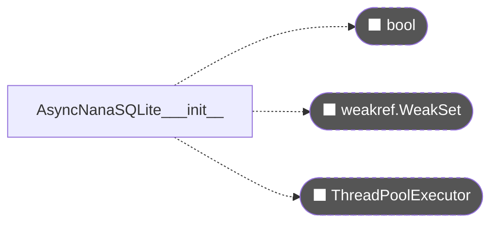

### E. AIタスク (このチャンク専用)

```
あなたはセキュリティ専門家です。以下の構造データのみで分析してください。

1. セクションA〜Cを精査し、潜在的リスクを優先度付きで列挙してください。

## 出力形式
- CRITICAL→HIGH→MEDIUM の順
- 各リスク: 根拠(セクション参照) / 悪用シナリオ / 修正骨格
- チャンクID: C000 を各発見に付記すること
```

---

## Chunk C001  [1 関数]
> 🔴 CRITICAL: 0  🟠 HIGH: 0  🔗 Cross-chunk: 0  ~32 tokens

### A. 関数シグネチャ

```
# func_id (args) -> return  [cyclo] [taint_in?→taint_out?]
AsyncNanaSQLite._validator(self) -> Any  [cc=2] [.→.]
```

### B. 呼び出しグラフ (チャンク内)

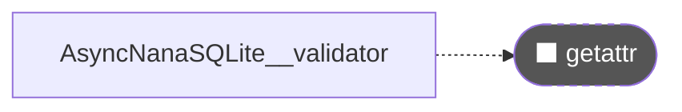

### E. AIタスク (このチャンク専用)

```
あなたはセキュリティ専門家です。以下の構造データのみで分析してください。

1. セクションA〜Cを精査し、潜在的リスクを優先度付きで列挙してください。

## 出力形式
- CRITICAL→HIGH→MEDIUM の順
- 各リスク: 根拠(セクション参照) / 悪用シナリオ / 修正骨格
- チャンクID: C001 を各発見に付記すること
```

---

## Chunk C002  [1 関数]
> 🔴 CRITICAL: 0  🟠 HIGH: 0  🔗 Cross-chunk: 0  ~28 tokens

### A. 関数シグネチャ

```
# func_id (args) -> return  [cyclo] [taint_in?→taint_out?]
AsyncNanaSQLite._coerce(self) -> bool  [cc=2] [.→.]
```

### B. 呼び出しグラフ (チャンク内)

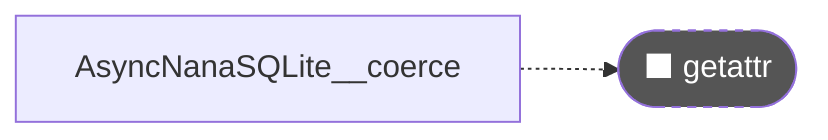

### E. AIタスク (このチャンク専用)

```
あなたはセキュリティ専門家です。以下の構造データのみで分析してください。

1. セクションA〜Cを精査し、潜在的リスクを優先度付きで列挙してください。

## 出力形式
- CRITICAL→HIGH→MEDIUM の順
- 各リスク: 根拠(セクション参照) / 悪用シナリオ / 修正骨格
- チャンクID: C002 を各発見に付記すること
```

---

## Chunk C003  [1 関数]
> 🔴 CRITICAL: 0  🟠 HIGH: 0  🔗 Cross-chunk: 0  ~27 tokens

### A. 関数シグネチャ

```
# func_id (args) -> return  [cyclo] [taint_in?→taint_out?]
AsyncNanaSQLite._hooks(self) -> list[NanaHook]  [cc=2] [.→.]
```

### B. 呼び出しグラフ (チャンク内)

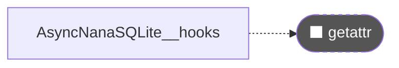

### E. AIタスク (このチャンク専用)

```
あなたはセキュリティ専門家です。以下の構造データのみで分析してください。

1. セクションA〜Cを精査し、潜在的リスクを優先度付きで列挙してください。

## 出力形式
- CRITICAL→HIGH→MEDIUM の順
- 各リスク: 根拠(セクション参照) / 悪用シナリオ / 修正骨格
- チャンクID: C003 を各発見に付記すること
```

---

## Chunk C004  [1 関数]
> 🔴 CRITICAL: 0  🟠 HIGH: 0  🔗 Cross-chunk: 0  ~30 tokens

### A. 関数シグネチャ

```
# func_id (args) -> return  [cyclo] [taint_in?→taint_out?]
AsyncNanaSQLite.add_hook(self, hook) -> None  [cc=3] [.→.]
```

### B. 呼び出しグラフ (チャンク内)


### E. AIタスク (このチャンク専用)

```
あなたはセキュリティ専門家です。以下の構造データのみで分析してください。

1. セクションA〜Cを精査し、潜在的リスクを優先度付きで列挙してください。

## 出力形式
- CRITICAL→HIGH→MEDIUM の順
- 各リスク: 根拠(セクション参照) / 悪用シナリオ / 修正骨格
- チャンクID: C004 を各発見に付記すること
```

---

## Chunk C005  [1 関数]
> 🔴 CRITICAL: 0  🟠 HIGH: 0  🔗 Cross-chunk: 0  ~43 tokens

### A. 関数シグネチャ

```
# func_id (args) -> return  [cyclo] [taint_in?→taint_out?]
AsyncNanaSQLite._ensure_initialized(self) -> None  [cc=8] [.→.]
```

### B. 呼び出しグラフ (チャンク内)

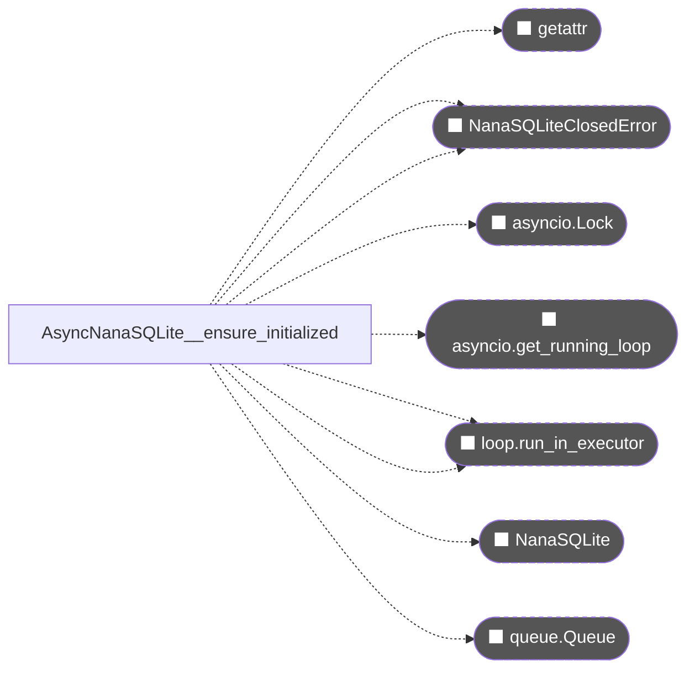

### E. AIタスク (このチャンク専用)

```
あなたはセキュリティ専門家です。以下の構造データのみで分析してください。

3. 🟡 高複雑度関数 `AsyncNanaSQLite._ensure_initialized` (cc≥8) に潜む認証バイパス・ロジックバグを推論してください。

## 出力形式
- CRITICAL→HIGH→MEDIUM の順
- 各リスク: 根拠(セクション参照) / 悪用シナリオ / 修正骨格
- チャンクID: C005 を各発見に付記すること
```

---

## Chunk C006  [1 関数]
> 🔴 CRITICAL: 0  🟠 HIGH: 0  🔗 Cross-chunk: 0  ~46 tokens

### A. 関数シグネチャ

```
# func_id (args) -> return  [cyclo] [taint_in?→taint_out?]
AsyncNanaSQLite._init_pool_connection() -> ?  [cc=2] [.→.]
```

### B. 呼び出しグラフ (チャンク内)

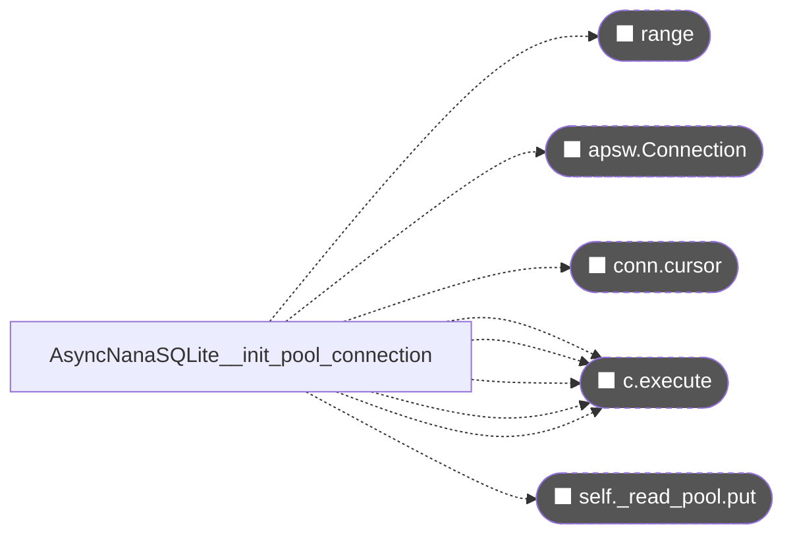

### E. AIタスク (このチャンク専用)

```
あなたはセキュリティ専門家です。以下の構造データのみで分析してください。

1. セクションA〜Cを精査し、潜在的リスクを優先度付きで列挙してください。

## 出力形式
- CRITICAL→HIGH→MEDIUM の順
- 各リスク: 根拠(セクション参照) / 悪用シナリオ / 修正骨格
- チャンクID: C006 を各発見に付記すること
```

---

## Chunk C007  [1 関数]
> 🔴 CRITICAL: 0  🟠 HIGH: 0  🔗 Cross-chunk: 0  ~40 tokens

### A. 関数シグネチャ

```
# func_id (args) -> return  [cyclo] [taint_in?→taint_out?]
AsyncNanaSQLite._read_connection(self) -> ?  [cc=2] [.→.]
```

### B. 呼び出しグラフ (チャンク内)


### E. AIタスク (このチャンク専用)

```
あなたはセキュリティ専門家です。以下の構造データのみで分析してください。

1. セクションA〜Cを精査し、潜在的リスクを優先度付きで列挙してください。

## 出力形式
- CRITICAL→HIGH→MEDIUM の順
- 各リスク: 根拠(セクション参照) / 悪用シナリオ / 修正骨格
- チャンクID: C007 を各発見に付記すること
```

---

## Chunk C008  [1 関数]
> 🔴 CRITICAL: 0  🟠 HIGH: 0  🔗 Cross-chunk: 0  ~40 tokens

### A. 関数シグネチャ

```
# func_id (args) -> return  [cyclo] [taint_in?→taint_out?]
AsyncNanaSQLite._run_in_executor(self, func) -> ?  [cc=1] [.→.]
```

### B. 呼び出しグラフ (チャンク内)

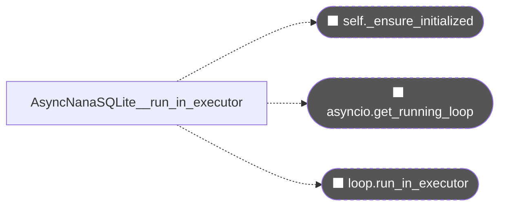

### E. AIタスク (このチャンク専用)

```
あなたはセキュリティ専門家です。以下の構造データのみで分析してください。

1. セクションA〜Cを精査し、潜在的リスクを優先度付きで列挙してください。

## 出力形式
- CRITICAL→HIGH→MEDIUM の順
- 各リスク: 根拠(セクション参照) / 悪用シナリオ / 修正骨格
- チャンクID: C008 を各発見に付記すること
```

---

## Chunk C009  [1 関数]
> 🔴 CRITICAL: 0  🟠 HIGH: 0  🔗 Cross-chunk: 0  ~25 tokens

### A. 関数シグネチャ

```
# func_id (args) -> return  [cyclo] [taint_in?→taint_out?]
AsyncNanaSQLite.aget(self, key, default) -> Any  [cc=1] [.→.]
```

### B. 呼び出しグラフ (チャンク内)

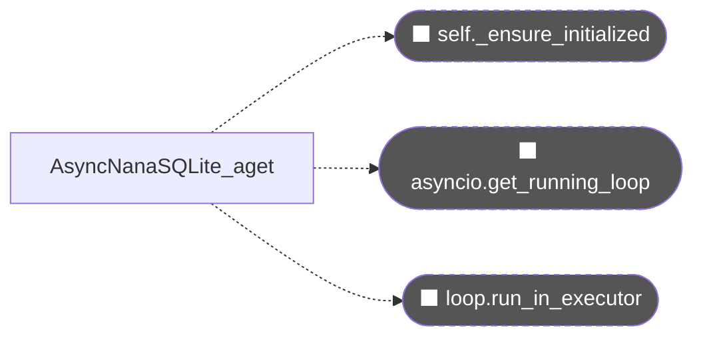

### E. AIタスク (このチャンク専用)

```
あなたはセキュリティ専門家です。以下の構造データのみで分析してください。

1. セクションA〜Cを精査し、潜在的リスクを優先度付きで列挙してください。

## 出力形式
- CRITICAL→HIGH→MEDIUM の順
- 各リスク: 根拠(セクション参照) / 悪用シナリオ / 修正骨格
- チャンクID: C009 を各発見に付記すること
```

---

## Chunk C010  [1 関数]
> 🔴 CRITICAL: 0  🟠 HIGH: 0  🔗 Cross-chunk: 0  ~25 tokens

### A. 関数シグネチャ

```
# func_id (args) -> return  [cyclo] [taint_in?→taint_out?]
AsyncNanaSQLite.aset(self, key, value) -> None  [cc=1] [.→.]
```

### B. 呼び出しグラフ (チャンク内)

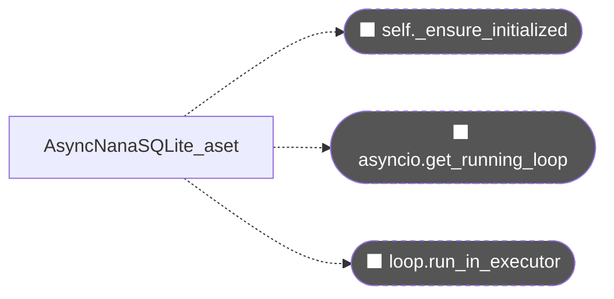

### E. AIタスク (このチャンク専用)

```
あなたはセキュリティ専門家です。以下の構造データのみで分析してください。

1. セクションA〜Cを精査し、潜在的リスクを優先度付きで列挙してください。

## 出力形式
- CRITICAL→HIGH→MEDIUM の順
- 各リスク: 根拠(セクション参照) / 悪用シナリオ / 修正骨格
- チャンクID: C010 を各発見に付記すること
```

---

## Chunk C011  [1 関数]
> 🔴 CRITICAL: 0  🟠 HIGH: 0  🔗 Cross-chunk: 0  ~28 tokens

### A. 関数シグネチャ

```
# func_id (args) -> return  [cyclo] [taint_in?→taint_out?]
AsyncNanaSQLite.adelete(self, key) -> None  [cc=1] [.→.]
```

### B. 呼び出しグラフ (チャンク内)

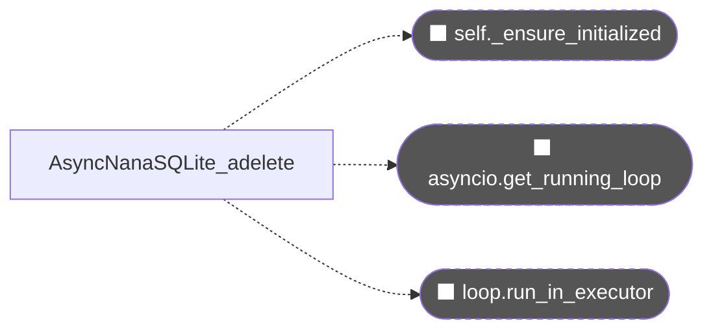

### E. AIタスク (このチャンク専用)

```
あなたはセキュリティ専門家です。以下の構造データのみで分析してください。

1. セクションA〜Cを精査し、潜在的リスクを優先度付きで列挙してください。

## 出力形式
- CRITICAL→HIGH→MEDIUM の順
- 各リスク: 根拠(セクション参照) / 悪用シナリオ / 修正骨格
- チャンクID: C011 を各発見に付記すること
```

---

## Chunk C012  [1 関数]
> 🔴 CRITICAL: 0  🟠 HIGH: 0  🔗 Cross-chunk: 0  ~31 tokens

### A. 関数シグネチャ

```
# func_id (args) -> return  [cyclo] [taint_in?→taint_out?]
AsyncNanaSQLite.acontains(self, key) -> bool  [cc=2] [.→.]
```

### B. 呼び出しグラフ (チャンク内)

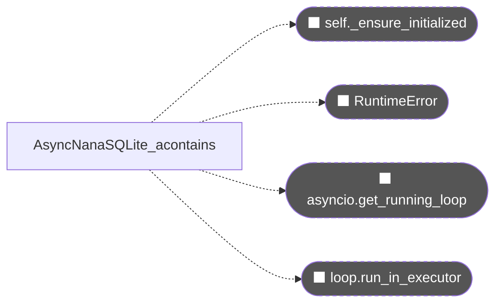

### E. AIタスク (このチャンク専用)

```
あなたはセキュリティ専門家です。以下の構造データのみで分析してください。

1. セクションA〜Cを精査し、潜在的リスクを優先度付きで列挙してください。

## 出力形式
- CRITICAL→HIGH→MEDIUM の順
- 各リスク: 根拠(セクション参照) / 悪用シナリオ / 修正骨格
- チャンクID: C012 を各発見に付記すること
```

---

## Chunk C013  [1 関数]
> 🔴 CRITICAL: 0  🟠 HIGH: 0  🔗 Cross-chunk: 0  ~25 tokens

### A. 関数シグネチャ

```
# func_id (args) -> return  [cyclo] [taint_in?→taint_out?]
AsyncNanaSQLite.alen(self) -> int  [cc=1] [.→.]
```

### B. 呼び出しグラフ (チャンク内)


### E. AIタスク (このチャンク専用)

```
あなたはセキュリティ専門家です。以下の構造データのみで分析してください。

1. セクションA〜Cを精査し、潜在的リスクを優先度付きで列挙してください。

## 出力形式
- CRITICAL→HIGH→MEDIUM の順
- 各リスク: 根拠(セクション参照) / 悪用シナリオ / 修正骨格
- チャンクID: C013 を各発見に付記すること
```

---

## Chunk C014  [1 関数]
> 🔴 CRITICAL: 0  🟠 HIGH: 0  🔗 Cross-chunk: 0  ~26 tokens

### A. 関数シグネチャ

```
# func_id (args) -> return  [cyclo] [taint_in?→taint_out?]
AsyncNanaSQLite.akeys(self) -> list[str]  [cc=1] [.→.]
```

### B. 呼び出しグラフ (チャンク内)

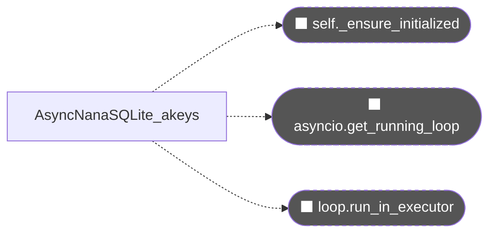

### E. AIタスク (このチャンク専用)

```
あなたはセキュリティ専門家です。以下の構造データのみで分析してください。

1. セクションA〜Cを精査し、潜在的リスクを優先度付きで列挙してください。

## 出力形式
- CRITICAL→HIGH→MEDIUM の順
- 各リスク: 根拠(セクション参照) / 悪用シナリオ / 修正骨格
- チャンクID: C014 を各発見に付記すること
```

---

## Chunk C015  [1 関数]
> 🔴 CRITICAL: 0  🟠 HIGH: 0  🔗 Cross-chunk: 0  ~28 tokens

### A. 関数シグネチャ

```
# func_id (args) -> return  [cyclo] [taint_in?→taint_out?]
AsyncNanaSQLite.avalues(self) -> list[Any]  [cc=1] [.→.]
```

### B. 呼び出しグラフ (チャンク内)

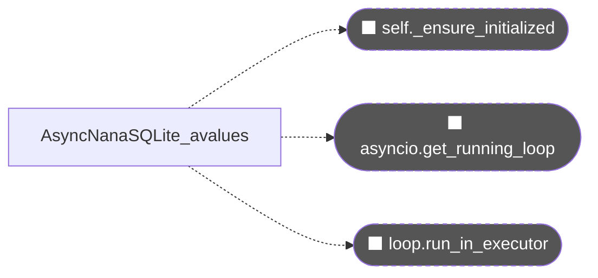

### E. AIタスク (このチャンク専用)

```
あなたはセキュリティ専門家です。以下の構造データのみで分析してください。

1. セクションA〜Cを精査し、潜在的リスクを優先度付きで列挙してください。

## 出力形式
- CRITICAL→HIGH→MEDIUM の順
- 各リスク: 根拠(セクション参照) / 悪用シナリオ / 修正骨格
- チャンクID: C015 を各発見に付記すること
```

---

## Chunk C016  [1 関数]
> 🔴 CRITICAL: 0  🟠 HIGH: 0  🔗 Cross-chunk: 0  ~27 tokens

### A. 関数シグネチャ

```
# func_id (args) -> return  [cyclo] [taint_in?→taint_out?]
AsyncNanaSQLite.aitems(self) -> list[tuple[str, Any]]  [cc=1] [.→.]
```

### B. 呼び出しグラフ (チャンク内)

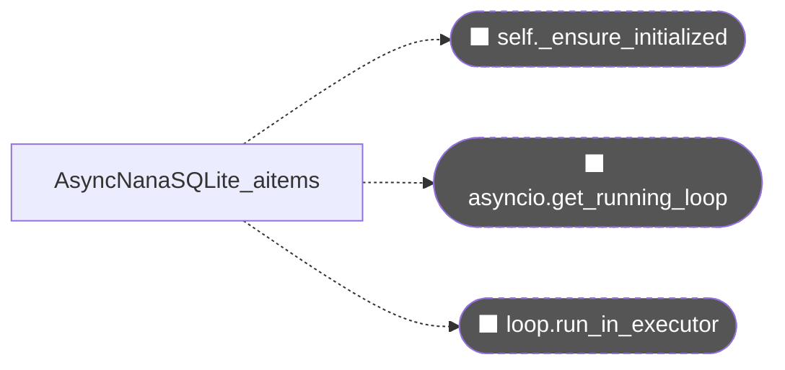

### E. AIタスク (このチャンク専用)

```
あなたはセキュリティ専門家です。以下の構造データのみで分析してください。

1. セクションA〜Cを精査し、潜在的リスクを優先度付きで列挙してください。

## 出力形式
- CRITICAL→HIGH→MEDIUM の順
- 各リスク: 根拠(セクション参照) / 悪用シナリオ / 修正骨格
- チャンクID: C016 を各発見に付記すること
```

---

## Chunk C017  [1 関数]
> 🔴 CRITICAL: 0  🟠 HIGH: 0  🔗 Cross-chunk: 0  ~25 tokens

### A. 関数シグネチャ

```
# func_id (args) -> return  [cyclo] [taint_in?→taint_out?]
AsyncNanaSQLite.apop(self, key) -> Any  [cc=1] [.→.]
```

### B. 呼び出しグラフ (チャンク内)

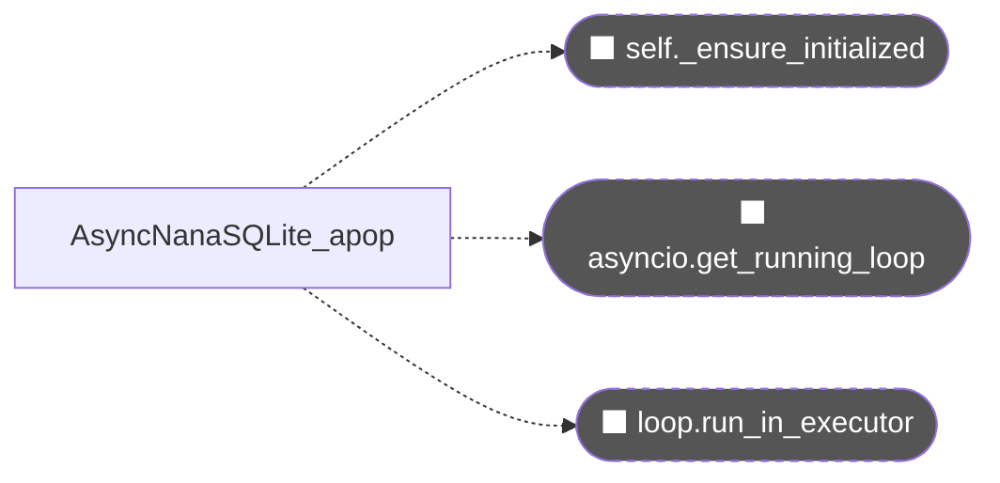

### E. AIタスク (このチャンク専用)

```
あなたはセキュリティ専門家です。以下の構造データのみで分析してください。

1. セクションA〜Cを精査し、潜在的リスクを優先度付きで列挙してください。

## 出力形式
- CRITICAL→HIGH→MEDIUM の順
- 各リスク: 根拠(セクション参照) / 悪用シナリオ / 修正骨格
- チャンクID: C017 を各発見に付記すること
```

---

## Chunk C018  [1 関数]
> 🔴 CRITICAL: 0  🟠 HIGH: 0  🔗 Cross-chunk: 0  ~28 tokens

### A. 関数シグネチャ

```
# func_id (args) -> return  [cyclo] [taint_in?→taint_out?]
AsyncNanaSQLite.aupdate(self, mapping) -> None  [cc=1] [.→.]
```

### B. 呼び出しグラフ (チャンク内)

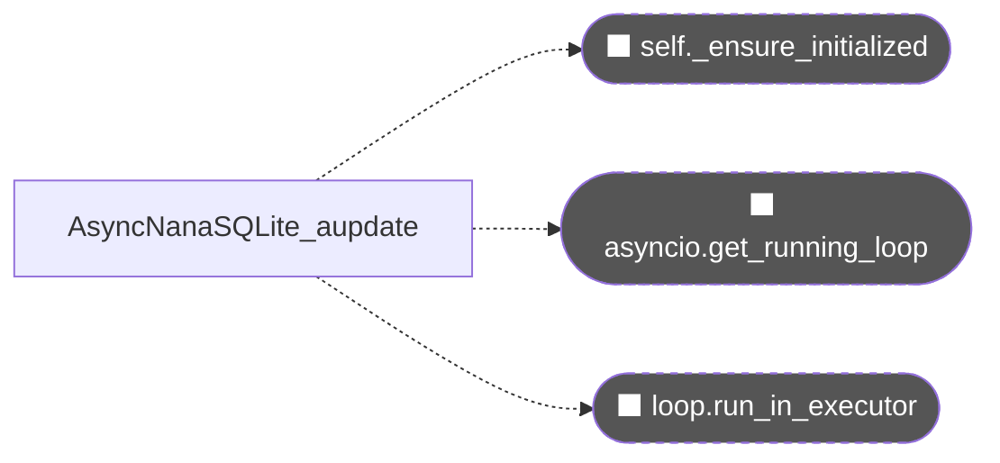

### E. AIタスク (このチャンク専用)

```
あなたはセキュリティ専門家です。以下の構造データのみで分析してください。

1. セクションA〜Cを精査し、潜在的リスクを優先度付きで列挙してください。

## 出力形式
- CRITICAL→HIGH→MEDIUM の順
- 各リスク: 根拠(セクション参照) / 悪用シナリオ / 修正骨格
- チャンクID: C018 を各発見に付記すること
```

---

## Chunk C019  [1 関数]
> 🔴 CRITICAL: 0  🟠 HIGH: 0  🔗 Cross-chunk: 0  ~37 tokens

### A. 関数シグネチャ

```
# func_id (args) -> return  [cyclo] [taint_in?→taint_out?]
AsyncNanaSQLite.update_wrapper() -> ?  [cc=1] [.→.]
```

### B. 呼び出しグラフ (チャンク内)

```mermaid
graph LR
    classDef external fill:#555,color:#fff,stroke-dasharray:4
```

### E. AIタスク (このチャンク専用)

```
あなたはセキュリティ専門家です。以下の構造データのみで分析してください。

1. セクションA〜Cを精査し、潜在的リスクを優先度付きで列挙してください。

## 出力形式
- CRITICAL→HIGH→MEDIUM の順
- 各リスク: 根拠(セクション参照) / 悪用シナリオ / 修正骨格
- チャンクID: C019 を各発見に付記すること
```

---

## Chunk C020  [1 関数]
> 🔴 CRITICAL: 0  🟠 HIGH: 0  🔗 Cross-chunk: 0  ~27 tokens

### A. 関数シグネチャ

```
# func_id (args) -> return  [cyclo] [taint_in?→taint_out?]
AsyncNanaSQLite.aflush(self, wait) -> None  [cc=1] [.→.]
```

### B. 呼び出しグラフ (チャンク内)

```mermaid
graph LR
    EXT_self__ensure_initialized(["⬛ self._ensure_initialized"]):::external
    AsyncNanaSQLite_aflush -.-> EXT_self__ensure_initialized
    EXT_asyncio_get_running_loop(["⬛ asyncio.get_running_loop"]):::external
    AsyncNanaSQLite_aflush -.-> EXT_asyncio_get_running_loop
    EXT_loop_run_in_executor(["⬛ loop.run_in_executor"]):::external
    AsyncNanaSQLite_aflush -.-> EXT_loop_run_in_executor
    classDef external fill:#555,color:#fff,stroke-dasharray:4
```

### E. AIタスク (このチャンク専用)

```
あなたはセキュリティ専門家です。以下の構造データのみで分析してください。

1. セクションA〜Cを精査し、潜在的リスクを優先度付きで列挙してください。

## 出力形式
- CRITICAL→HIGH→MEDIUM の順
- 各リスク: 根拠(セクション参照) / 悪用シナリオ / 修正骨格
- チャンクID: C020 を各発見に付記すること
```

---

## Chunk C021  [1 関数]
> 🔴 CRITICAL: 0  🟠 HIGH: 0  🔗 Cross-chunk: 0  ~37 tokens

### A. 関数シグネチャ

```
# func_id (args) -> return  [cyclo] [taint_in?→taint_out?]
AsyncNanaSQLite._flush_wrapper() -> ?  [cc=1] [.→.]
```

### B. 呼び出しグラフ (チャンク内)

```mermaid
graph LR
    EXT_self__db_flush(["⬛ self._db.flush"]):::external
    AsyncNanaSQLite__flush_wrapper -.-> EXT_self__db_flush
    classDef external fill:#555,color:#fff,stroke-dasharray:4
```

### E. AIタスク (このチャンク専用)

```
あなたはセキュリティ専門家です。以下の構造データのみで分析してください。

1. セクションA〜Cを精査し、潜在的リスクを優先度付きで列挙してください。

## 出力形式
- CRITICAL→HIGH→MEDIUM の順
- 各リスク: 根拠(セクション参照) / 悪用シナリオ / 修正骨格
- チャンクID: C021 を各発見に付記すること
```

---

## Chunk C022  [1 関数]
> 🔴 CRITICAL: 0  🟠 HIGH: 0  🔗 Cross-chunk: 0  ~27 tokens

### A. 関数シグネチャ

```
# func_id (args) -> return  [cyclo] [taint_in?→taint_out?]
AsyncNanaSQLite.aclear(self) -> None  [cc=1] [.→.]
```

### B. 呼び出しグラフ (チャンク内)

```mermaid
graph LR
    EXT_self__ensure_initialized(["⬛ self._ensure_initialized"]):::external
    AsyncNanaSQLite_aclear -.-> EXT_self__ensure_initialized
    EXT_asyncio_get_running_loop(["⬛ asyncio.get_running_loop"]):::external
    AsyncNanaSQLite_aclear -.-> EXT_asyncio_get_running_loop
    EXT_loop_run_in_executor(["⬛ loop.run_in_executor"]):::external
    AsyncNanaSQLite_aclear -.-> EXT_loop_run_in_executor
    classDef external fill:#555,color:#fff,stroke-dasharray:4
```

### E. AIタスク (このチャンク専用)

```
あなたはセキュリティ専門家です。以下の構造データのみで分析してください。

1. セクションA〜Cを精査し、潜在的リスクを優先度付きで列挙してください。

## 出力形式
- CRITICAL→HIGH→MEDIUM の順
- 各リスク: 根拠(セクション参照) / 悪用シナリオ / 修正骨格
- チャンクID: C022 を各発見に付記すること
```

---

## Chunk C023  [1 関数]
> 🔴 CRITICAL: 0  🟠 HIGH: 0  🔗 Cross-chunk: 0  ~30 tokens

### A. 関数シグネチャ

```
# func_id (args) -> return  [cyclo] [taint_in?→taint_out?]
AsyncNanaSQLite.aget_dlq(self) -> list[dict[str, Any]]  [cc=1] [.→.]
```

### B. 呼び出しグラフ (チャンク内)

```mermaid
graph LR
    EXT_self__ensure_initialized(["⬛ self._ensure_initialized"]):::external
    AsyncNanaSQLite_aget_dlq -.-> EXT_self__ensure_initialized
    EXT_asyncio_get_running_loop(["⬛ asyncio.get_running_loop"]):::external
    AsyncNanaSQLite_aget_dlq -.-> EXT_asyncio_get_running_loop
    EXT_loop_run_in_executor(["⬛ loop.run_in_executor"]):::external
    AsyncNanaSQLite_aget_dlq -.-> EXT_loop_run_in_executor
    classDef external fill:#555,color:#fff,stroke-dasharray:4
```

### E. AIタスク (このチャンク専用)

```
あなたはセキュリティ専門家です。以下の構造データのみで分析してください。

1. セクションA〜Cを精査し、潜在的リスクを優先度付きで列挙してください。

## 出力形式
- CRITICAL→HIGH→MEDIUM の順
- 各リスク: 根拠(セクション参照) / 悪用シナリオ / 修正骨格
- チャンクID: C023 を各発見に付記すること
```

---

## Chunk C024  [1 関数]
> 🔴 CRITICAL: 0  🟠 HIGH: 0  🔗 Cross-chunk: 0  ~32 tokens

### A. 関数シグネチャ

```
# func_id (args) -> return  [cyclo] [taint_in?→taint_out?]
AsyncNanaSQLite.aretry_dlq(self) -> None  [cc=1] [.→.]
```

### B. 呼び出しグラフ (チャンク内)

```mermaid
graph LR
    EXT_self__ensure_initialized(["⬛ self._ensure_initialized"]):::external
    AsyncNanaSQLite_aretry_dlq -.-> EXT_self__ensure_initialized
    EXT_asyncio_get_running_loop(["⬛ asyncio.get_running_loop"]):::external
    AsyncNanaSQLite_aretry_dlq -.-> EXT_asyncio_get_running_loop
    EXT_loop_run_in_executor(["⬛ loop.run_in_executor"]):::external
    AsyncNanaSQLite_aretry_dlq -.-> EXT_loop_run_in_executor
    classDef external fill:#555,color:#fff,stroke-dasharray:4
```

### E. AIタスク (このチャンク専用)

```
あなたはセキュリティ専門家です。以下の構造データのみで分析してください。

1. セクションA〜Cを精査し、潜在的リスクを優先度付きで列挙してください。

## 出力形式
- CRITICAL→HIGH→MEDIUM の順
- 各リスク: 根拠(セクション参照) / 悪用シナリオ / 修正骨格
- チャンクID: C024 を各発見に付記すること
```

---

## Chunk C025  [1 関数]
> 🔴 CRITICAL: 0  🟠 HIGH: 0  🔗 Cross-chunk: 0  ~32 tokens

### A. 関数シグネチャ

```
# func_id (args) -> return  [cyclo] [taint_in?→taint_out?]
AsyncNanaSQLite.aclear_dlq(self) -> None  [cc=1] [.→.]
```

### B. 呼び出しグラフ (チャンク内)

```mermaid
graph LR
    EXT_self__ensure_initialized(["⬛ self._ensure_initialized"]):::external
    AsyncNanaSQLite_aclear_dlq -.-> EXT_self__ensure_initialized
    EXT_asyncio_get_running_loop(["⬛ asyncio.get_running_loop"]):::external
    AsyncNanaSQLite_aclear_dlq -.-> EXT_asyncio_get_running_loop
    EXT_loop_run_in_executor(["⬛ loop.run_in_executor"]):::external
    AsyncNanaSQLite_aclear_dlq -.-> EXT_loop_run_in_executor
    classDef external fill:#555,color:#fff,stroke-dasharray:4
```

### E. AIタスク (このチャンク専用)

```
あなたはセキュリティ専門家です。以下の構造データのみで分析してください。

1. セクションA〜Cを精査し、潜在的リスクを優先度付きで列挙してください。

## 出力形式
- CRITICAL→HIGH→MEDIUM の順
- 各リスク: 根拠(セクション参照) / 悪用シナリオ / 修正骨格
- チャンクID: C025 を各発見に付記すること
```

---

## Chunk C026  [1 関数]
> 🔴 CRITICAL: 0  🟠 HIGH: 0  🔗 Cross-chunk: 0  ~38 tokens

### A. 関数シグネチャ

```
# func_id (args) -> return  [cyclo] [taint_in?→taint_out?]
AsyncNanaSQLite.aget_v2_metrics(self) -> dict[str, Any]  [cc=1] [.→.]
```

### B. 呼び出しグラフ (チャンク内)

```mermaid
graph LR
    EXT_self__ensure_initialized(["⬛ self._ensure_initialized"]):::external
    AsyncNanaSQLite_aget_v2_metrics -.-> EXT_self__ensure_initialized
    EXT_asyncio_get_running_loop(["⬛ asyncio.get_running_loop"]):::external
    AsyncNanaSQLite_aget_v2_metrics -.-> EXT_asyncio_get_running_loop
    EXT_loop_run_in_executor(["⬛ loop.run_in_executor"]):::external
    AsyncNanaSQLite_aget_v2_metrics -.-> EXT_loop_run_in_executor
    classDef external fill:#555,color:#fff,stroke-dasharray:4
```

### E. AIタスク (このチャンク専用)

```
あなたはセキュリティ専門家です。以下の構造データのみで分析してください。

1. セクションA〜Cを精査し、潜在的リスクを優先度付きで列挙してください。

## 出力形式
- CRITICAL→HIGH→MEDIUM の順
- 各リスク: 根拠(セクション参照) / 悪用シナリオ / 修正骨格
- チャンクID: C026 を各発見に付記すること
```

---

## Chunk C027  [1 関数]
> 🔴 CRITICAL: 0  🟠 HIGH: 0  🔗 Cross-chunk: 0  ~33 tokens

### A. 関数シグネチャ

```
# func_id (args) -> return  [cyclo] [taint_in?→taint_out?]
AsyncNanaSQLite.asetdefault(self, key, default) -> Any  [cc=1] [.→.]
```

### B. 呼び出しグラフ (チャンク内)

```mermaid
graph LR
    EXT_self__ensure_initialized(["⬛ self._ensure_initialized"]):::external
    AsyncNanaSQLite_asetdefault -.-> EXT_self__ensure_initialized
    EXT_asyncio_get_running_loop(["⬛ asyncio.get_running_loop"]):::external
    AsyncNanaSQLite_asetdefault -.-> EXT_asyncio_get_running_loop
    EXT_loop_run_in_executor(["⬛ loop.run_in_executor"]):::external
    AsyncNanaSQLite_asetdefault -.-> EXT_loop_run_in_executor
    classDef external fill:#555,color:#fff,stroke-dasharray:4
```

### E. AIタスク (このチャンク専用)

```
あなたはセキュリティ専門家です。以下の構造データのみで分析してください。

1. セクションA〜Cを精査し、潜在的リスクを優先度付きで列挙してください。

## 出力形式
- CRITICAL→HIGH→MEDIUM の順
- 各リスク: 根拠(セクション参照) / 悪用シナリオ / 修正骨格
- チャンクID: C027 を各発見に付記すること
```

---

## Chunk C028  [1 関数]
> 🔴 CRITICAL: 0  🟠 HIGH: 0  🔗 Cross-chunk: 0  ~28 tokens

### A. 関数シグネチャ

```
# func_id (args) -> return  [cyclo] [taint_in?→taint_out?]
AsyncNanaSQLite.aupsert(self, table_name, data, conflict_columns) -> int | None  [cc=1] [.→.]
```

### B. 呼び出しグラフ (チャンク内)

```mermaid
graph LR
    EXT_self__ensure_initialized(["⬛ self._ensure_initialized"]):::external
    AsyncNanaSQLite_aupsert -.-> EXT_self__ensure_initialized
    EXT_asyncio_get_running_loop(["⬛ asyncio.get_running_loop"]):::external
    AsyncNanaSQLite_aupsert -.-> EXT_asyncio_get_running_loop
    EXT_functools_partial(["⬛ functools.partial"]):::external
    AsyncNanaSQLite_aupsert -.-> EXT_functools_partial
    EXT_loop_run_in_executor(["⬛ loop.run_in_executor"]):::external
    AsyncNanaSQLite_aupsert -.-> EXT_loop_run_in_executor
    AsyncNanaSQLite_aupsert -.-> EXT_self__ensure_initialized
    AsyncNanaSQLite_aupsert -.-> EXT_asyncio_get_running_loop
    AsyncNanaSQLite_aupsert -.-> EXT_loop_run_in_executor
    classDef external fill:#555,color:#fff,stroke-dasharray:4
```

### E. AIタスク (このチャンク専用)

```
あなたはセキュリティ専門家です。以下の構造データのみで分析してください。

1. セクションA〜Cを精査し、潜在的リスクを優先度付きで列挙してください。

## 出力形式
- CRITICAL→HIGH→MEDIUM の順
- 各リスク: 根拠(セクション参照) / 悪用シナリオ / 修正骨格
- チャンクID: C028 を各発見に付記すること
```

---

## Chunk C029  [1 関数]
> 🔴 CRITICAL: 0  🟠 HIGH: 0  🔗 Cross-chunk: 0  ~30 tokens

### A. 関数シグネチャ

```
# func_id (args) -> return  [cyclo] [taint_in?→taint_out?]
AsyncNanaSQLite.load_all(self) -> None  [cc=1] [.→.]
```

### B. 呼び出しグラフ (チャンク内)

```mermaid
graph LR
    EXT_self__ensure_initialized(["⬛ self._ensure_initialized"]):::external
    AsyncNanaSQLite_load_all -.-> EXT_self__ensure_initialized
    EXT_asyncio_get_running_loop(["⬛ asyncio.get_running_loop"]):::external
    AsyncNanaSQLite_load_all -.-> EXT_asyncio_get_running_loop
    EXT_loop_run_in_executor(["⬛ loop.run_in_executor"]):::external
    AsyncNanaSQLite_load_all -.-> EXT_loop_run_in_executor
    classDef external fill:#555,color:#fff,stroke-dasharray:4
```

### E. AIタスク (このチャンク専用)

```
あなたはセキュリティ専門家です。以下の構造データのみで分析してください。

1. セクションA〜Cを精査し、潜在的リスクを優先度付きで列挙してください。

## 出力形式
- CRITICAL→HIGH→MEDIUM の順
- 各リスク: 根拠(セクション参照) / 悪用シナリオ / 修正骨格
- チャンクID: C029 を各発見に付記すること
```

---

## Chunk C030  [1 関数]
> 🔴 CRITICAL: 0  🟠 HIGH: 0  🔗 Cross-chunk: 0  ~28 tokens

### A. 関数シグネチャ

```
# func_id (args) -> return  [cyclo] [taint_in?→taint_out?]
AsyncNanaSQLite.refresh(self, key) -> None  [cc=1] [.→.]
```

### B. 呼び出しグラフ (チャンク内)

```mermaid
graph LR
    EXT_self__ensure_initialized(["⬛ self._ensure_initialized"]):::external
    AsyncNanaSQLite_refresh -.-> EXT_self__ensure_initialized
    EXT_asyncio_get_running_loop(["⬛ asyncio.get_running_loop"]):::external
    AsyncNanaSQLite_refresh -.-> EXT_asyncio_get_running_loop
    EXT_loop_run_in_executor(["⬛ loop.run_in_executor"]):::external
    AsyncNanaSQLite_refresh -.-> EXT_loop_run_in_executor
    classDef external fill:#555,color:#fff,stroke-dasharray:4
```

### E. AIタスク (このチャンク専用)

```
あなたはセキュリティ専門家です。以下の構造データのみで分析してください。

1. セクションA〜Cを精査し、潜在的リスクを優先度付きで列挙してください。

## 出力形式
- CRITICAL→HIGH→MEDIUM の順
- 各リスク: 根拠(セクション参照) / 悪用シナリオ / 修正骨格
- チャンクID: C030 を各発見に付記すること
```

---

## Chunk C031  [1 関数]
> 🔴 CRITICAL: 0  🟠 HIGH: 0  🔗 Cross-chunk: 0  ~31 tokens

### A. 関数シグネチャ

```
# func_id (args) -> return  [cyclo] [taint_in?→taint_out?]
AsyncNanaSQLite.is_cached(self, key) -> bool  [cc=1] [.→.]
```

### B. 呼び出しグラフ (チャンク内)

```mermaid
graph LR
    EXT_self__ensure_initialized(["⬛ self._ensure_initialized"]):::external
    AsyncNanaSQLite_is_cached -.-> EXT_self__ensure_initialized
    EXT_asyncio_get_running_loop(["⬛ asyncio.get_running_loop"]):::external
    AsyncNanaSQLite_is_cached -.-> EXT_asyncio_get_running_loop
    EXT_loop_run_in_executor(["⬛ loop.run_in_executor"]):::external
    AsyncNanaSQLite_is_cached -.-> EXT_loop_run_in_executor
    classDef external fill:#555,color:#fff,stroke-dasharray:4
```

### E. AIタスク (このチャンク専用)

```
あなたはセキュリティ専門家です。以下の構造データのみで分析してください。

1. セクションA〜Cを精査し、潜在的リスクを優先度付きで列挙してください。

## 出力形式
- CRITICAL→HIGH→MEDIUM の順
- 各リスク: 根拠(セクション参照) / 悪用シナリオ / 修正骨格
- チャンクID: C031 を各発見に付記すること
```

---

## Chunk C032  [1 関数]
> 🔴 CRITICAL: 0  🟠 HIGH: 0  🔗 Cross-chunk: 0  ~35 tokens

### A. 関数シグネチャ

```
# func_id (args) -> return  [cyclo] [taint_in?→taint_out?]
AsyncNanaSQLite.batch_update(self, mapping) -> None  [cc=1] [.→.]
```

### B. 呼び出しグラフ (チャンク内)

```mermaid
graph LR
    EXT_self__ensure_initialized(["⬛ self._ensure_initialized"]):::external
    AsyncNanaSQLite_batch_update -.-> EXT_self__ensure_initialized
    EXT_asyncio_get_running_loop(["⬛ asyncio.get_running_loop"]):::external
    AsyncNanaSQLite_batch_update -.-> EXT_asyncio_get_running_loop
    EXT_loop_run_in_executor(["⬛ loop.run_in_executor"]):::external
    AsyncNanaSQLite_batch_update -.-> EXT_loop_run_in_executor
    classDef external fill:#555,color:#fff,stroke-dasharray:4
```

### E. AIタスク (このチャンク専用)

```
あなたはセキュリティ専門家です。以下の構造データのみで分析してください。

1. セクションA〜Cを精査し、潜在的リスクを優先度付きで列挙してください。

## 出力形式
- CRITICAL→HIGH→MEDIUM の順
- 各リスク: 根拠(セクション参照) / 悪用シナリオ / 修正骨格
- チャンクID: C032 を各発見に付記すること
```

---

## Chunk C033  [1 関数]
> 🔴 CRITICAL: 0  🟠 HIGH: 0  🔗 Cross-chunk: 0  ~45 tokens

### A. 関数シグネチャ

```
# func_id (args) -> return  [cyclo] [taint_in?→taint_out?]
AsyncNanaSQLite.batch_update_partial(self, mapping) -> dict[str, str]  [cc=1] [.→.]
```

### B. 呼び出しグラフ (チャンク内)

```mermaid
graph LR
    EXT_self__ensure_initialized(["⬛ self._ensure_initialized"]):::external
    AsyncNanaSQLite_batch_update_partial -.-> EXT_self__ensure_initialized
    EXT_asyncio_get_running_loop(["⬛ asyncio.get_running_loop"]):::external
    AsyncNanaSQLite_batch_update_partial -.-> EXT_asyncio_get_running_loop
    EXT_loop_run_in_executor(["⬛ loop.run_in_executor"]):::external
    AsyncNanaSQLite_batch_update_partial -.-> EXT_loop_run_in_executor
    classDef external fill:#555,color:#fff,stroke-dasharray:4
```

### E. AIタスク (このチャンク専用)

```
あなたはセキュリティ専門家です。以下の構造データのみで分析してください。

1. セクションA〜Cを精査し、潜在的リスクを優先度付きで列挙してください。

## 出力形式
- CRITICAL→HIGH→MEDIUM の順
- 各リスク: 根拠(セクション参照) / 悪用シナリオ / 修正骨格
- チャンクID: C033 を各発見に付記すること
```

---

## Chunk C034  [1 関数]
> 🔴 CRITICAL: 0  🟠 HIGH: 0  🔗 Cross-chunk: 0  ~35 tokens

### A. 関数シグネチャ

```
# func_id (args) -> return  [cyclo] [taint_in?→taint_out?]
AsyncNanaSQLite.batch_delete(self, keys) -> None  [cc=1] [.→.]
```

### B. 呼び出しグラフ (チャンク内)

```mermaid
graph LR
    EXT_self__ensure_initialized(["⬛ self._ensure_initialized"]):::external
    AsyncNanaSQLite_batch_delete -.-> EXT_self__ensure_initialized
    EXT_asyncio_get_running_loop(["⬛ asyncio.get_running_loop"]):::external
    AsyncNanaSQLite_batch_delete -.-> EXT_asyncio_get_running_loop
    EXT_loop_run_in_executor(["⬛ loop.run_in_executor"]):::external
    AsyncNanaSQLite_batch_delete -.-> EXT_loop_run_in_executor
    classDef external fill:#555,color:#fff,stroke-dasharray:4
```

### E. AIタスク (このチャンク専用)

```
あなたはセキュリティ専門家です。以下の構造データのみで分析してください。

1. セクションA〜Cを精査し、潜在的リスクを優先度付きで列挙してください。

## 出力形式
- CRITICAL→HIGH→MEDIUM の順
- 各リスク: 根拠(セクション参照) / 悪用シナリオ / 修正骨格
- チャンクID: C034 を各発見に付記すること
```

---

## Chunk C035  [1 関数]
> 🔴 CRITICAL: 0  🟠 HIGH: 0  🔗 Cross-chunk: 0  ~28 tokens

### A. 関数シグネチャ

```
# func_id (args) -> return  [cyclo] [taint_in?→taint_out?]
AsyncNanaSQLite.to_dict(self) -> dict  [cc=1] [.→.]
```

### B. 呼び出しグラフ (チャンク内)

```mermaid
graph LR
    EXT_self__ensure_initialized(["⬛ self._ensure_initialized"]):::external
    AsyncNanaSQLite_to_dict -.-> EXT_self__ensure_initialized
    EXT_asyncio_get_running_loop(["⬛ asyncio.get_running_loop"]):::external
    AsyncNanaSQLite_to_dict -.-> EXT_asyncio_get_running_loop
    EXT_loop_run_in_executor(["⬛ loop.run_in_executor"]):::external
    AsyncNanaSQLite_to_dict -.-> EXT_loop_run_in_executor
    classDef external fill:#555,color:#fff,stroke-dasharray:4
```

### E. AIタスク (このチャンク専用)

```
あなたはセキュリティ専門家です。以下の構造データのみで分析してください。

1. セクションA〜Cを精査し、潜在的リスクを優先度付きで列挙してください。

## 出力形式
- CRITICAL→HIGH→MEDIUM の順
- 各リスク: 根拠(セクション参照) / 悪用シナリオ / 修正骨格
- チャンクID: C035 を各発見に付記すること
```

---

## Chunk C036  [1 関数]
> 🔴 CRITICAL: 0  🟠 HIGH: 0  🔗 Cross-chunk: 0  ~25 tokens

### A. 関数シグネチャ

```
# func_id (args) -> return  [cyclo] [taint_in?→taint_out?]
AsyncNanaSQLite.copy(self) -> dict  [cc=1] [.→.]
```

### B. 呼び出しグラフ (チャンク内)

```mermaid
graph LR
    EXT_self__ensure_initialized(["⬛ self._ensure_initialized"]):::external
    AsyncNanaSQLite_copy -.-> EXT_self__ensure_initialized
    EXT_asyncio_get_running_loop(["⬛ asyncio.get_running_loop"]):::external
    AsyncNanaSQLite_copy -.-> EXT_asyncio_get_running_loop
    EXT_loop_run_in_executor(["⬛ loop.run_in_executor"]):::external
    AsyncNanaSQLite_copy -.-> EXT_loop_run_in_executor
    classDef external fill:#555,color:#fff,stroke-dasharray:4
```

### E. AIタスク (このチャンク専用)

```
あなたはセキュリティ専門家です。以下の構造データのみで分析してください。

1. セクションA〜Cを精査し、潜在的リスクを優先度付きで列挙してください。

## 出力形式
- CRITICAL→HIGH→MEDIUM の順
- 各リスク: 根拠(セクション参照) / 悪用シナリオ / 修正骨格
- チャンクID: C036 を各発見に付記すること
```

---

## Chunk C037  [1 関数]
> 🔴 CRITICAL: 0  🟠 HIGH: 0  🔗 Cross-chunk: 0  ~31 tokens

### A. 関数シグネチャ

```
# func_id (args) -> return  [cyclo] [taint_in?→taint_out?]
AsyncNanaSQLite.get_fresh(self, key, default) -> Any  [cc=1] [.→.]
```

### B. 呼び出しグラフ (チャンク内)

```mermaid
graph LR
    EXT_self__ensure_initialized(["⬛ self._ensure_initialized"]):::external
    AsyncNanaSQLite_get_fresh -.-> EXT_self__ensure_initialized
    EXT_asyncio_get_running_loop(["⬛ asyncio.get_running_loop"]):::external
    AsyncNanaSQLite_get_fresh -.-> EXT_asyncio_get_running_loop
    EXT_loop_run_in_executor(["⬛ loop.run_in_executor"]):::external
    AsyncNanaSQLite_get_fresh -.-> EXT_loop_run_in_executor
    classDef external fill:#555,color:#fff,stroke-dasharray:4
```

### E. AIタスク (このチャンク専用)

```
あなたはセキュリティ専門家です。以下の構造データのみで分析してください。

1. セクションA〜Cを精査し、潜在的リスクを優先度付きで列挙してください。

## 出力形式
- CRITICAL→HIGH→MEDIUM の順
- 各リスク: 根拠(セクション参照) / 悪用シナリオ / 修正骨格
- チャンクID: C037 を各発見に付記すること
```

---

## Chunk C038  [1 関数]
> 🔴 CRITICAL: 0  🟠 HIGH: 0  🔗 Cross-chunk: 0  ~32 tokens

### A. 関数シグネチャ

```
# func_id (args) -> return  [cyclo] [taint_in?→taint_out?]
AsyncNanaSQLite.abatch_get(self, keys) -> dict[str, Any]  [cc=1] [.→.]
```

### B. 呼び出しグラフ (チャンク内)

```mermaid
graph LR
    EXT_self__ensure_initialized(["⬛ self._ensure_initialized"]):::external
    AsyncNanaSQLite_abatch_get -.-> EXT_self__ensure_initialized
    EXT_asyncio_get_running_loop(["⬛ asyncio.get_running_loop"]):::external
    AsyncNanaSQLite_abatch_get -.-> EXT_asyncio_get_running_loop
    EXT_loop_run_in_executor(["⬛ loop.run_in_executor"]):::external
    AsyncNanaSQLite_abatch_get -.-> EXT_loop_run_in_executor
    classDef external fill:#555,color:#fff,stroke-dasharray:4
```

### E. AIタスク (このチャンク専用)

```
あなたはセキュリティ専門家です。以下の構造データのみで分析してください。

1. セクションA〜Cを精査し、潜在的リスクを優先度付きで列挙してください。

## 出力形式
- CRITICAL→HIGH→MEDIUM の順
- 各リスク: 根拠(セクション参照) / 悪用シナリオ / 修正骨格
- チャンクID: C038 を各発見に付記すること
```

---

## Chunk C039  [1 関数]
> 🔴 CRITICAL: 0  🟠 HIGH: 0  🔗 Cross-chunk: 0  ~31 tokens

### A. 関数シグネチャ

```
# func_id (args) -> return  [cyclo] [taint_in?→taint_out?]
AsyncNanaSQLite.set_model(self, key, model) -> None  [cc=1] [.→.]
```

### B. 呼び出しグラフ (チャンク内)

```mermaid
graph LR
    EXT_self__ensure_initialized(["⬛ self._ensure_initialized"]):::external
    AsyncNanaSQLite_set_model -.-> EXT_self__ensure_initialized
    EXT_asyncio_get_running_loop(["⬛ asyncio.get_running_loop"]):::external
    AsyncNanaSQLite_set_model -.-> EXT_asyncio_get_running_loop
    EXT_loop_run_in_executor(["⬛ loop.run_in_executor"]):::external
    AsyncNanaSQLite_set_model -.-> EXT_loop_run_in_executor
    classDef external fill:#555,color:#fff,stroke-dasharray:4
```

### E. AIタスク (このチャンク専用)

```
あなたはセキュリティ専門家です。以下の構造データのみで分析してください。

1. セクションA〜Cを精査し、潜在的リスクを優先度付きで列挙してください。

## 出力形式
- CRITICAL→HIGH→MEDIUM の順
- 各リスク: 根拠(セクション参照) / 悪用シナリオ / 修正骨格
- チャンクID: C039 を各発見に付記すること
```

---

## Chunk C040  [1 関数]
> 🔴 CRITICAL: 0  🟠 HIGH: 0  🔗 Cross-chunk: 0  ~31 tokens

### A. 関数シグネチャ

```
# func_id (args) -> return  [cyclo] [taint_in?→taint_out?]
AsyncNanaSQLite.get_model(self, key, model_class) -> Any  [cc=1] [.→.]
```

### B. 呼び出しグラフ (チャンク内)

```mermaid
graph LR
    EXT_self__ensure_initialized(["⬛ self._ensure_initialized"]):::external
    AsyncNanaSQLite_get_model -.-> EXT_self__ensure_initialized
    EXT_asyncio_get_running_loop(["⬛ asyncio.get_running_loop"]):::external
    AsyncNanaSQLite_get_model -.-> EXT_asyncio_get_running_loop
    EXT_loop_run_in_executor(["⬛ loop.run_in_executor"]):::external
    AsyncNanaSQLite_get_model -.-> EXT_loop_run_in_executor
    classDef external fill:#555,color:#fff,stroke-dasharray:4
```

### E. AIタスク (このチャンク専用)

```
あなたはセキュリティ専門家です。以下の構造データのみで分析してください。

1. セクションA〜Cを精査し、潜在的リスクを優先度付きで列挙してください。

## 出力形式
- CRITICAL→HIGH→MEDIUM の順
- 各リスク: 根拠(セクション参照) / 悪用シナリオ / 修正骨格
- チャンクID: C040 を各発見に付記すること
```

---

## Chunk C041  [1 関数]
> 🔴 CRITICAL: 0  🟠 HIGH: 0  🔗 Cross-chunk: 0  ~28 tokens

### A. 関数シグネチャ

```
# func_id (args) -> return  [cyclo] [taint_in?→taint_out?]
AsyncNanaSQLite.execute(self, sql, parameters) -> Any  [cc=1] [.→.]
```

### B. 呼び出しグラフ (チャンク内)

```mermaid
graph LR
    EXT_self__ensure_initialized(["⬛ self._ensure_initialized"]):::external
    AsyncNanaSQLite_execute -.-> EXT_self__ensure_initialized
    EXT_asyncio_get_running_loop(["⬛ asyncio.get_running_loop"]):::external
    AsyncNanaSQLite_execute -.-> EXT_asyncio_get_running_loop
    EXT_loop_run_in_executor(["⬛ loop.run_in_executor"]):::external
    AsyncNanaSQLite_execute -.-> EXT_loop_run_in_executor
    classDef external fill:#555,color:#fff,stroke-dasharray:4
```

### E. AIタスク (このチャンク専用)

```
あなたはセキュリティ専門家です。以下の構造データのみで分析してください。

1. セクションA〜Cを精査し、潜在的リスクを優先度付きで列挙してください。

## 出力形式
- CRITICAL→HIGH→MEDIUM の順
- 各リスク: 根拠(セクション参照) / 悪用シナリオ / 修正骨格
- チャンクID: C041 を各発見に付記すること
```

---

## Chunk C042  [1 関数]
> 🔴 CRITICAL: 0  🟠 HIGH: 0  🔗 Cross-chunk: 0  ~35 tokens

### A. 関数シグネチャ

```
# func_id (args) -> return  [cyclo] [taint_in?→taint_out?]
AsyncNanaSQLite.execute_many(self, sql, parameters_list) -> None  [cc=1] [.→.]
```

### B. 呼び出しグラフ (チャンク内)

```mermaid
graph LR
    EXT_self__ensure_initialized(["⬛ self._ensure_initialized"]):::external
    AsyncNanaSQLite_execute_many -.-> EXT_self__ensure_initialized
    EXT_asyncio_get_running_loop(["⬛ asyncio.get_running_loop"]):::external
    AsyncNanaSQLite_execute_many -.-> EXT_asyncio_get_running_loop
    EXT_loop_run_in_executor(["⬛ loop.run_in_executor"]):::external
    AsyncNanaSQLite_execute_many -.-> EXT_loop_run_in_executor
    classDef external fill:#555,color:#fff,stroke-dasharray:4
```

### E. AIタスク (このチャンク専用)

```
あなたはセキュリティ専門家です。以下の構造データのみで分析してください。

1. セクションA〜Cを精査し、潜在的リスクを優先度付きで列挙してください。

## 出力形式
- CRITICAL→HIGH→MEDIUM の順
- 各リスク: 根拠(セクション参照) / 悪用シナリオ / 修正骨格
- チャンクID: C042 を各発見に付記すること
```

---

## Chunk C043  [1 関数]
> 🔴 CRITICAL: 0  🟠 HIGH: 0  🔗 Cross-chunk: 0  ~31 tokens

### A. 関数シグネチャ

```
# func_id (args) -> return  [cyclo] [taint_in?→taint_out?]
AsyncNanaSQLite.fetch_one(self, sql, parameters) -> tuple | None  [cc=1] [.→.]
```

### B. 呼び出しグラフ (チャンク内)

```mermaid
graph LR
    EXT_self__ensure_initialized(["⬛ self._ensure_initialized"]):::external
    AsyncNanaSQLite_fetch_one -.-> EXT_self__ensure_initialized
    EXT_asyncio_get_running_loop(["⬛ asyncio.get_running_loop"]):::external
    AsyncNanaSQLite_fetch_one -.-> EXT_asyncio_get_running_loop
    EXT_loop_run_in_executor(["⬛ loop.run_in_executor"]):::external
    AsyncNanaSQLite_fetch_one -.-> EXT_loop_run_in_executor
    classDef external fill:#555,color:#fff,stroke-dasharray:4
```

### E. AIタスク (このチャンク専用)

```
あなたはセキュリティ専門家です。以下の構造データのみで分析してください。

1. セクションA〜Cを精査し、潜在的リスクを優先度付きで列挙してください。

## 出力形式
- CRITICAL→HIGH→MEDIUM の順
- 各リスク: 根拠(セクション参照) / 悪用シナリオ / 修正骨格
- チャンクID: C043 を各発見に付記すること
```

---

## Chunk C044  [1 関数]
> 🔴 CRITICAL: 0  🟠 HIGH: 0  🔗 Cross-chunk: 0  ~38 tokens

### A. 関数シグネチャ

```
# func_id (args) -> return  [cyclo] [taint_in?→taint_out?]
AsyncNanaSQLite._fetch_one_impl() -> ?  [cc=1] [.→.]
```

### B. 呼び出しグラフ (チャンク内)

```mermaid
graph LR
    EXT_self__read_connection(["⬛ self._read_connection"]):::external
    AsyncNanaSQLite__fetch_one_impl -.-> EXT_self__read_connection
    EXT_conn_execute(["⬛ conn.execute"]):::external
    AsyncNanaSQLite__fetch_one_impl -.-> EXT_conn_execute
    EXT_cursor_fetchone(["⬛ cursor.fetchone"]):::external
    AsyncNanaSQLite__fetch_one_impl -.-> EXT_cursor_fetchone
    classDef external fill:#555,color:#fff,stroke-dasharray:4
```

### E. AIタスク (このチャンク専用)

```
あなたはセキュリティ専門家です。以下の構造データのみで分析してください。

1. セクションA〜Cを精査し、潜在的リスクを優先度付きで列挙してください。

## 出力形式
- CRITICAL→HIGH→MEDIUM の順
- 各リスク: 根拠(セクション参照) / 悪用シナリオ / 修正骨格
- チャンクID: C044 を各発見に付記すること
```

---

## Chunk C045  [1 関数]
> 🔴 CRITICAL: 0  🟠 HIGH: 0  🔗 Cross-chunk: 0  ~31 tokens

### A. 関数シグネチャ

```
# func_id (args) -> return  [cyclo] [taint_in?→taint_out?]
AsyncNanaSQLite.fetch_all(self, sql, parameters) -> list[tuple]  [cc=1] [.→.]
```

### B. 呼び出しグラフ (チャンク内)

```mermaid
graph LR
    EXT_self__ensure_initialized(["⬛ self._ensure_initialized"]):::external
    AsyncNanaSQLite_fetch_all -.-> EXT_self__ensure_initialized
    EXT_asyncio_get_running_loop(["⬛ asyncio.get_running_loop"]):::external
    AsyncNanaSQLite_fetch_all -.-> EXT_asyncio_get_running_loop
    EXT_loop_run_in_executor(["⬛ loop.run_in_executor"]):::external
    AsyncNanaSQLite_fetch_all -.-> EXT_loop_run_in_executor
    classDef external fill:#555,color:#fff,stroke-dasharray:4
```

### E. AIタスク (このチャンク専用)

```
あなたはセキュリティ専門家です。以下の構造データのみで分析してください。

1. セクションA〜Cを精査し、潜在的リスクを優先度付きで列挙してください。

## 出力形式
- CRITICAL→HIGH→MEDIUM の順
- 各リスク: 根拠(セクション参照) / 悪用シナリオ / 修正骨格
- チャンクID: C045 を各発見に付記すること
```

---

## Chunk C046  [1 関数]
> 🔴 CRITICAL: 0  🟠 HIGH: 0  🔗 Cross-chunk: 0  ~38 tokens

### A. 関数シグネチャ

```
# func_id (args) -> return  [cyclo] [taint_in?→taint_out?]
AsyncNanaSQLite._fetch_all_impl() -> ?  [cc=1] [.→.]
```

### B. 呼び出しグラフ (チャンク内)

```mermaid
graph LR
    EXT_self__read_connection(["⬛ self._read_connection"]):::external
    AsyncNanaSQLite__fetch_all_impl -.-> EXT_self__read_connection
    EXT_conn_execute(["⬛ conn.execute"]):::external
    AsyncNanaSQLite__fetch_all_impl -.-> EXT_conn_execute
    classDef external fill:#555,color:#fff,stroke-dasharray:4
```

### E. AIタスク (このチャンク専用)

```
あなたはセキュリティ専門家です。以下の構造データのみで分析してください。

1. セクションA〜Cを精査し、潜在的リスクを優先度付きで列挙してください。

## 出力形式
- CRITICAL→HIGH→MEDIUM の順
- 各リスク: 根拠(セクション参照) / 悪用シナリオ / 修正骨格
- チャンクID: C046 を各発見に付記すること
```

---

## Chunk C047  [1 関数]
> 🔴 CRITICAL: 0  🟠 HIGH: 0  🔗 Cross-chunk: 0  ~35 tokens

### A. 関数シグネチャ

```
# func_id (args) -> return  [cyclo] [taint_in?→taint_out?]
AsyncNanaSQLite.create_table(self, table_name, columns, if_not_exists, primary_key) -> None  [cc=1] [.→.]
```

### B. 呼び出しグラフ (チャンク内)

```mermaid
graph LR
    EXT_self__ensure_initialized(["⬛ self._ensure_initialized"]):::external
    AsyncNanaSQLite_create_table -.-> EXT_self__ensure_initialized
    EXT_asyncio_get_running_loop(["⬛ asyncio.get_running_loop"]):::external
    AsyncNanaSQLite_create_table -.-> EXT_asyncio_get_running_loop
    EXT_loop_run_in_executor(["⬛ loop.run_in_executor"]):::external
    AsyncNanaSQLite_create_table -.-> EXT_loop_run_in_executor
    classDef external fill:#555,color:#fff,stroke-dasharray:4
```

### E. AIタスク (このチャンク専用)

```
あなたはセキュリティ専門家です。以下の構造データのみで分析してください。

1. セクションA〜Cを精査し、潜在的リスクを優先度付きで列挙してください。

## 出力形式
- CRITICAL→HIGH→MEDIUM の順
- 各リスク: 根拠(セクション参照) / 悪用シナリオ / 修正骨格
- チャンクID: C047 を各発見に付記すること
```

---

## Chunk C048  [1 関数]
> 🔴 CRITICAL: 0  🟠 HIGH: 0  🔗 Cross-chunk: 0  ~35 tokens

### A. 関数シグネチャ

```
# func_id (args) -> return  [cyclo] [taint_in?→taint_out?]
AsyncNanaSQLite.create_index(self, index_name, table_name, columns, unique, if_not_exists) -> None  [cc=1] [.→.]
```

### B. 呼び出しグラフ (チャンク内)

```mermaid
graph LR
    EXT_self__ensure_initialized(["⬛ self._ensure_initialized"]):::external
    AsyncNanaSQLite_create_index -.-> EXT_self__ensure_initialized
    EXT_asyncio_get_running_loop(["⬛ asyncio.get_running_loop"]):::external
    AsyncNanaSQLite_create_index -.-> EXT_asyncio_get_running_loop
    EXT_loop_run_in_executor(["⬛ loop.run_in_executor"]):::external
    AsyncNanaSQLite_create_index -.-> EXT_loop_run_in_executor
    classDef external fill:#555,color:#fff,stroke-dasharray:4
```

### E. AIタスク (このチャンク専用)

```
あなたはセキュリティ専門家です。以下の構造データのみで分析してください。

1. セクションA〜Cを精査し、潜在的リスクを優先度付きで列挙してください。

## 出力形式
- CRITICAL→HIGH→MEDIUM の順
- 各リスク: 根拠(セクション参照) / 悪用シナリオ / 修正骨格
- チャンクID: C048 を各発見に付記すること
```

---

## Chunk C049  [1 関数]
> 🔴 CRITICAL: 0  🟠 HIGH: 0  🔗 Cross-chunk: 0  ~26 tokens

### A. 関数シグネチャ

```
# func_id (args) -> return  [cyclo] [taint_in?→taint_out?]
AsyncNanaSQLite.query(self, table_name, columns, where, parameters, order_by, limit, strict_sql_validation, allowed_sql_functions, forbidden_sql_functions, override_allowed) -> list[dict]  [cc=1] [.→.]
```

### B. 呼び出しグラフ (チャンク内)

```mermaid
graph LR
    EXT_self__ensure_initialized(["⬛ self._ensure_initialized"]):::external
    AsyncNanaSQLite_query -.-> EXT_self__ensure_initialized
    EXT_asyncio_get_running_loop(["⬛ asyncio.get_running_loop"]):::external
    AsyncNanaSQLite_query -.-> EXT_asyncio_get_running_loop
    EXT_loop_run_in_executor(["⬛ loop.run_in_executor"]):::external
    AsyncNanaSQLite_query -.-> EXT_loop_run_in_executor
    classDef external fill:#555,color:#fff,stroke-dasharray:4
```

### E. AIタスク (このチャンク専用)

```
あなたはセキュリティ専門家です。以下の構造データのみで分析してください。

1. セクションA〜Cを精査し、潜在的リスクを優先度付きで列挙してください。

## 出力形式
- CRITICAL→HIGH→MEDIUM の順
- 各リスク: 根拠(セクション参照) / 悪用シナリオ / 修正骨格
- チャンクID: C049 を各発見に付記すること
```

---

## Chunk C050  [1 関数]
> 🔴 CRITICAL: 0  🟠 HIGH: 0  🔗 Cross-chunk: 0  ~46 tokens

### A. 関数シグネチャ

```
# func_id (args) -> return  [cyclo] [taint_in?→taint_out?]
AsyncNanaSQLite.query_with_pagination(self, table_name, columns, where, parameters, order_by, limit, offset, group_by, strict_sql_validation, allowed_sql_functions, forbidden_sql_functions, override_allowed) -> list[dict]  [cc=1] [.→.]
```

### B. 呼び出しグラフ (チャンク内)

```mermaid
graph LR
    EXT_self__ensure_initialized(["⬛ self._ensure_initialized"]):::external
    AsyncNanaSQLite_query_with_pagination -.-> EXT_self__ensure_initialized
    EXT_asyncio_get_running_loop(["⬛ asyncio.get_running_loop"]):::external
    AsyncNanaSQLite_query_with_pagination -.-> EXT_asyncio_get_running_loop
    EXT_loop_run_in_executor(["⬛ loop.run_in_executor"]):::external
    AsyncNanaSQLite_query_with_pagination -.-> EXT_loop_run_in_executor
    classDef external fill:#555,color:#fff,stroke-dasharray:4
```

### E. AIタスク (このチャンク専用)

```
あなたはセキュリティ専門家です。以下の構造データのみで分析してください。

1. セクションA〜Cを精査し、潜在的リスクを優先度付きで列挙してください。

## 出力形式
- CRITICAL→HIGH→MEDIUM の順
- 各リスク: 根拠(セクション参照) / 悪用シナリオ / 修正骨格
- チャンクID: C050 を各発見に付記すること
```

---

## Chunk C051  [1 関数]
> 🔴 CRITICAL: 0  🟠 HIGH: 0  🔗 Cross-chunk: 0  ~35 tokens

### A. 関数シグネチャ

```
# func_id (args) -> return  [cyclo] [taint_in?→taint_out?]
AsyncNanaSQLite.table_exists(self, table_name) -> bool  [cc=1] [.→.]
```

### B. 呼び出しグラフ (チャンク内)

```mermaid
graph LR
    EXT_self__ensure_initialized(["⬛ self._ensure_initialized"]):::external
    AsyncNanaSQLite_table_exists -.-> EXT_self__ensure_initialized
    EXT_asyncio_get_running_loop(["⬛ asyncio.get_running_loop"]):::external
    AsyncNanaSQLite_table_exists -.-> EXT_asyncio_get_running_loop
    EXT_loop_run_in_executor(["⬛ loop.run_in_executor"]):::external
    AsyncNanaSQLite_table_exists -.-> EXT_loop_run_in_executor
    classDef external fill:#555,color:#fff,stroke-dasharray:4
```

### E. AIタスク (このチャンク専用)

```
あなたはセキュリティ専門家です。以下の構造データのみで分析してください。

1. セクションA〜Cを精査し、潜在的リスクを優先度付きで列挙してください。

## 出力形式
- CRITICAL→HIGH→MEDIUM の順
- 各リスク: 根拠(セクション参照) / 悪用シナリオ / 修正骨格
- チャンクID: C051 を各発見に付記すること
```

---

## Chunk C052  [1 関数]
> 🔴 CRITICAL: 0  🟠 HIGH: 0  🔗 Cross-chunk: 0  ~33 tokens

### A. 関数シグネチャ

```
# func_id (args) -> return  [cyclo] [taint_in?→taint_out?]
AsyncNanaSQLite.list_tables(self) -> list[str]  [cc=1] [.→.]
```

### B. 呼び出しグラフ (チャンク内)

```mermaid
graph LR
    EXT_self__ensure_initialized(["⬛ self._ensure_initialized"]):::external
    AsyncNanaSQLite_list_tables -.-> EXT_self__ensure_initialized
    EXT_asyncio_get_running_loop(["⬛ asyncio.get_running_loop"]):::external
    AsyncNanaSQLite_list_tables -.-> EXT_asyncio_get_running_loop
    EXT_loop_run_in_executor(["⬛ loop.run_in_executor"]):::external
    AsyncNanaSQLite_list_tables -.-> EXT_loop_run_in_executor
    classDef external fill:#555,color:#fff,stroke-dasharray:4
```

### E. AIタスク (このチャンク専用)

```
あなたはセキュリティ専門家です。以下の構造データのみで分析してください。

1. セクションA〜Cを精査し、潜在的リスクを優先度付きで列挙してください。

## 出力形式
- CRITICAL→HIGH→MEDIUM の順
- 各リスク: 根拠(セクション参照) / 悪用シナリオ / 修正骨格
- チャンクID: C052 を各発見に付記すること
```

---

## Chunk C053  [1 関数]
> 🔴 CRITICAL: 0  🟠 HIGH: 0  🔗 Cross-chunk: 0  ~32 tokens

### A. 関数シグネチャ

```
# func_id (args) -> return  [cyclo] [taint_in?→taint_out?]
AsyncNanaSQLite.drop_table(self, table_name, if_exists) -> None  [cc=1] [.→.]
```

### B. 呼び出しグラフ (チャンク内)

```mermaid
graph LR
    EXT_self__ensure_initialized(["⬛ self._ensure_initialized"]):::external
    AsyncNanaSQLite_drop_table -.-> EXT_self__ensure_initialized
    EXT_asyncio_get_running_loop(["⬛ asyncio.get_running_loop"]):::external
    AsyncNanaSQLite_drop_table -.-> EXT_asyncio_get_running_loop
    EXT_loop_run_in_executor(["⬛ loop.run_in_executor"]):::external
    AsyncNanaSQLite_drop_table -.-> EXT_loop_run_in_executor
    classDef external fill:#555,color:#fff,stroke-dasharray:4
```

### E. AIタスク (このチャンク専用)

```
あなたはセキュリティ専門家です。以下の構造データのみで分析してください。

1. セクションA〜Cを精査し、潜在的リスクを優先度付きで列挙してください。

## 出力形式
- CRITICAL→HIGH→MEDIUM の順
- 各リスク: 根拠(セクション参照) / 悪用シナリオ / 修正骨格
- チャンクID: C053 を各発見に付記すること
```

---

## Chunk C054  [1 関数]
> 🔴 CRITICAL: 0  🟠 HIGH: 0  🔗 Cross-chunk: 0  ~32 tokens

### A. 関数シグネチャ

```
# func_id (args) -> return  [cyclo] [taint_in?→taint_out?]
AsyncNanaSQLite.drop_index(self, index_name, if_exists) -> None  [cc=1] [.→.]
```

### B. 呼び出しグラフ (チャンク内)

```mermaid
graph LR
    EXT_self__ensure_initialized(["⬛ self._ensure_initialized"]):::external
    AsyncNanaSQLite_drop_index -.-> EXT_self__ensure_initialized
    EXT_asyncio_get_running_loop(["⬛ asyncio.get_running_loop"]):::external
    AsyncNanaSQLite_drop_index -.-> EXT_asyncio_get_running_loop
    EXT_loop_run_in_executor(["⬛ loop.run_in_executor"]):::external
    AsyncNanaSQLite_drop_index -.-> EXT_loop_run_in_executor
    classDef external fill:#555,color:#fff,stroke-dasharray:4
```

### E. AIタスク (このチャンク専用)

```
あなたはセキュリティ専門家です。以下の構造データのみで分析してください。

1. セクションA〜Cを精査し、潜在的リスクを優先度付きで列挙してください。

## 出力形式
- CRITICAL→HIGH→MEDIUM の順
- 各リスク: 根拠(セクション参照) / 悪用シナリオ / 修正骨格
- チャンクID: C054 を各発見に付記すること
```

---

## Chunk C055  [1 関数]
> 🔴 CRITICAL: 0  🟠 HIGH: 0  🔗 Cross-chunk: 0  ~32 tokens

### A. 関数シグネチャ

```
# func_id (args) -> return  [cyclo] [taint_in?→taint_out?]
AsyncNanaSQLite.sql_insert(self, table_name, data) -> int  [cc=1] [.→.]
```

### B. 呼び出しグラフ (チャンク内)

```mermaid
graph LR
    EXT_self__ensure_initialized(["⬛ self._ensure_initialized"]):::external
    AsyncNanaSQLite_sql_insert -.-> EXT_self__ensure_initialized
    EXT_asyncio_get_running_loop(["⬛ asyncio.get_running_loop"]):::external
    AsyncNanaSQLite_sql_insert -.-> EXT_asyncio_get_running_loop
    EXT_loop_run_in_executor(["⬛ loop.run_in_executor"]):::external
    AsyncNanaSQLite_sql_insert -.-> EXT_loop_run_in_executor
    classDef external fill:#555,color:#fff,stroke-dasharray:4
```

### E. AIタスク (このチャンク専用)

```
あなたはセキュリティ専門家です。以下の構造データのみで分析してください。

1. セクションA〜Cを精査し、潜在的リスクを優先度付きで列挙してください。

## 出力形式
- CRITICAL→HIGH→MEDIUM の順
- 各リスク: 根拠(セクション参照) / 悪用シナリオ / 修正骨格
- チャンクID: C055 を各発見に付記すること
```

---

## Chunk C056  [1 関数]
> 🔴 CRITICAL: 0  🟠 HIGH: 0  🔗 Cross-chunk: 0  ~32 tokens

### A. 関数シグネチャ

```
# func_id (args) -> return  [cyclo] [taint_in?→taint_out?]
AsyncNanaSQLite.sql_update(self, table_name, data, where, parameters) -> int  [cc=1] [.→.]
```

### B. 呼び出しグラフ (チャンク内)

```mermaid
graph LR
    EXT_self__ensure_initialized(["⬛ self._ensure_initialized"]):::external
    AsyncNanaSQLite_sql_update -.-> EXT_self__ensure_initialized
    EXT_asyncio_get_running_loop(["⬛ asyncio.get_running_loop"]):::external
    AsyncNanaSQLite_sql_update -.-> EXT_asyncio_get_running_loop
    EXT_loop_run_in_executor(["⬛ loop.run_in_executor"]):::external
    AsyncNanaSQLite_sql_update -.-> EXT_loop_run_in_executor
    classDef external fill:#555,color:#fff,stroke-dasharray:4
```

### E. AIタスク (このチャンク専用)

```
あなたはセキュリティ専門家です。以下の構造データのみで分析してください。

1. セクションA〜Cを精査し、潜在的リスクを優先度付きで列挙してください。

## 出力形式
- CRITICAL→HIGH→MEDIUM の順
- 各リスク: 根拠(セクション参照) / 悪用シナリオ / 修正骨格
- チャンクID: C056 を各発見に付記すること
```

---

## Chunk C057  [1 関数]
> 🔴 CRITICAL: 0  🟠 HIGH: 0  🔗 Cross-chunk: 0  ~32 tokens

### A. 関数シグネチャ

```
# func_id (args) -> return  [cyclo] [taint_in?→taint_out?]
AsyncNanaSQLite.sql_delete(self, table_name, where, parameters) -> int  [cc=1] [.→.]
```

### B. 呼び出しグラフ (チャンク内)

```mermaid
graph LR
    EXT_self__ensure_initialized(["⬛ self._ensure_initialized"]):::external
    AsyncNanaSQLite_sql_delete -.-> EXT_self__ensure_initialized
    EXT_asyncio_get_running_loop(["⬛ asyncio.get_running_loop"]):::external
    AsyncNanaSQLite_sql_delete -.-> EXT_asyncio_get_running_loop
    EXT_loop_run_in_executor(["⬛ loop.run_in_executor"]):::external
    AsyncNanaSQLite_sql_delete -.-> EXT_loop_run_in_executor
    classDef external fill:#555,color:#fff,stroke-dasharray:4
```

### E. AIタスク (このチャンク専用)

```
あなたはセキュリティ専門家です。以下の構造データのみで分析してください。

1. セクションA〜Cを精査し、潜在的リスクを優先度付きで列挙してください。

## 出力形式
- CRITICAL→HIGH→MEDIUM の順
- 各リスク: 根拠(セクション参照) / 悪用シナリオ / 修正骨格
- チャンクID: C057 を各発見に付記すること
```

---

## Chunk C058  [1 関数]
> 🔴 CRITICAL: 0  🟠 HIGH: 0  🔗 Cross-chunk: 0  ~26 tokens

### A. 関数シグネチャ

```
# func_id (args) -> return  [cyclo] [taint_in?→taint_out?]
AsyncNanaSQLite.count(self, table_name, where, parameters, strict_sql_validation, allowed_sql_functions, forbidden_sql_functions, override_allowed) -> int  [cc=1] [.→.]
```

### B. 呼び出しグラフ (チャンク内)

```mermaid
graph LR
    EXT_self__ensure_initialized(["⬛ self._ensure_initialized"]):::external
    AsyncNanaSQLite_count -.-> EXT_self__ensure_initialized
    EXT_asyncio_get_running_loop(["⬛ asyncio.get_running_loop"]):::external
    AsyncNanaSQLite_count -.-> EXT_asyncio_get_running_loop
    EXT_loop_run_in_executor(["⬛ loop.run_in_executor"]):::external
    AsyncNanaSQLite_count -.-> EXT_loop_run_in_executor
    classDef external fill:#555,color:#fff,stroke-dasharray:4
```

### E. AIタスク (このチャンク専用)

```
あなたはセキュリティ専門家です。以下の構造データのみで分析してください。

1. セクションA〜Cを精査し、潜在的リスクを優先度付きで列挙してください。

## 出力形式
- CRITICAL→HIGH→MEDIUM の順
- 各リスク: 根拠(セクション参照) / 悪用シナリオ / 修正骨格
- チャンクID: C058 を各発見に付記すること
```

---

## Chunk C059  [1 関数]
> 🔴 CRITICAL: 0  🟠 HIGH: 0  🔗 Cross-chunk: 0  ~27 tokens

### A. 関数シグネチャ

```
# func_id (args) -> return  [cyclo] [taint_in?→taint_out?]
AsyncNanaSQLite.vacuum(self) -> None  [cc=1] [.→.]
```

### B. 呼び出しグラフ (チャンク内)

```mermaid
graph LR
    EXT_self__ensure_initialized(["⬛ self._ensure_initialized"]):::external
    AsyncNanaSQLite_vacuum -.-> EXT_self__ensure_initialized
    EXT_asyncio_get_running_loop(["⬛ asyncio.get_running_loop"]):::external
    AsyncNanaSQLite_vacuum -.-> EXT_asyncio_get_running_loop
    EXT_loop_run_in_executor(["⬛ loop.run_in_executor"]):::external
    AsyncNanaSQLite_vacuum -.-> EXT_loop_run_in_executor
    classDef external fill:#555,color:#fff,stroke-dasharray:4
```

### E. AIタスク (このチャンク専用)

```
あなたはセキュリティ専門家です。以下の構造データのみで分析してください。

1. セクションA〜Cを精査し、潜在的リスクを優先度付きで列挙してください。

## 出力形式
- CRITICAL→HIGH→MEDIUM の順
- 各リスク: 根拠(セクション参照) / 悪用シナリオ / 修正骨格
- チャンクID: C059 を各発見に付記すること
```

---

## Chunk C060  [1 関数]
> 🔴 CRITICAL: 0  🟠 HIGH: 0  🔗 Cross-chunk: 0  ~41 tokens

### A. 関数シグネチャ

```
# func_id (args) -> return  [cyclo] [taint_in?→taint_out?]
AsyncNanaSQLite.begin_transaction(self) -> None  [cc=1] [.→.]
```

### B. 呼び出しグラフ (チャンク内)

```mermaid
graph LR
    EXT_self__ensure_initialized(["⬛ self._ensure_initialized"]):::external
    AsyncNanaSQLite_begin_transaction -.-> EXT_self__ensure_initialized
    EXT_asyncio_get_running_loop(["⬛ asyncio.get_running_loop"]):::external
    AsyncNanaSQLite_begin_transaction -.-> EXT_asyncio_get_running_loop
    EXT_loop_run_in_executor(["⬛ loop.run_in_executor"]):::external
    AsyncNanaSQLite_begin_transaction -.-> EXT_loop_run_in_executor
    classDef external fill:#555,color:#fff,stroke-dasharray:4
```

### E. AIタスク (このチャンク専用)

```
あなたはセキュリティ専門家です。以下の構造データのみで分析してください。

1. セクションA〜Cを精査し、潜在的リスクを優先度付きで列挙してください。

## 出力形式
- CRITICAL→HIGH→MEDIUM の順
- 各リスク: 根拠(セクション参照) / 悪用シナリオ / 修正骨格
- チャンクID: C060 を各発見に付記すること
```

---

## Chunk C061  [1 関数]
> 🔴 CRITICAL: 0  🟠 HIGH: 0  🔗 Cross-chunk: 0  ~27 tokens

### A. 関数シグネチャ

```
# func_id (args) -> return  [cyclo] [taint_in?→taint_out?]
AsyncNanaSQLite.commit(self) -> None  [cc=1] [.→.]
```

### B. 呼び出しグラフ (チャンク内)

```mermaid
graph LR
    EXT_self__ensure_initialized(["⬛ self._ensure_initialized"]):::external
    AsyncNanaSQLite_commit -.-> EXT_self__ensure_initialized
    EXT_asyncio_get_running_loop(["⬛ asyncio.get_running_loop"]):::external
    AsyncNanaSQLite_commit -.-> EXT_asyncio_get_running_loop
    EXT_loop_run_in_executor(["⬛ loop.run_in_executor"]):::external
    AsyncNanaSQLite_commit -.-> EXT_loop_run_in_executor
    classDef external fill:#555,color:#fff,stroke-dasharray:4
```

### E. AIタスク (このチャンク専用)

```
あなたはセキュリティ専門家です。以下の構造データのみで分析してください。

1. セクションA〜Cを精査し、潜在的リスクを優先度付きで列挙してください。

## 出力形式
- CRITICAL→HIGH→MEDIUM の順
- 各リスク: 根拠(セクション参照) / 悪用シナリオ / 修正骨格
- チャンクID: C061 を各発見に付記すること
```

---

## Chunk C062  [1 関数]
> 🔴 CRITICAL: 0  🟠 HIGH: 0  🔗 Cross-chunk: 0  ~30 tokens

### A. 関数シグネチャ

```
# func_id (args) -> return  [cyclo] [taint_in?→taint_out?]
AsyncNanaSQLite.rollback(self) -> None  [cc=1] [.→.]
```

### B. 呼び出しグラフ (チャンク内)

```mermaid
graph LR
    EXT_self__ensure_initialized(["⬛ self._ensure_initialized"]):::external
    AsyncNanaSQLite_rollback -.-> EXT_self__ensure_initialized
    EXT_asyncio_get_running_loop(["⬛ asyncio.get_running_loop"]):::external
    AsyncNanaSQLite_rollback -.-> EXT_asyncio_get_running_loop
    EXT_loop_run_in_executor(["⬛ loop.run_in_executor"]):::external
    AsyncNanaSQLite_rollback -.-> EXT_loop_run_in_executor
    classDef external fill:#555,color:#fff,stroke-dasharray:4
```

### E. AIタスク (このチャンク専用)

```
あなたはセキュリティ専門家です。以下の構造データのみで分析してください。

1. セクションA〜Cを精査し、潜在的リスクを優先度付きで列挙してください。

## 出力形式
- CRITICAL→HIGH→MEDIUM の順
- 各リスク: 根拠(セクション参照) / 悪用シナリオ / 修正骨格
- チャンクID: C062 を各発見に付記すること
```

---

## Chunk C063  [1 関数]
> 🔴 CRITICAL: 0  🟠 HIGH: 0  🔗 Cross-chunk: 0  ~37 tokens

### A. 関数シグネチャ

```
# func_id (args) -> return  [cyclo] [taint_in?→taint_out?]
AsyncNanaSQLite.in_transaction(self) -> bool  [cc=1] [.→.]
```

### B. 呼び出しグラフ (チャンク内)

```mermaid
graph LR
    EXT_self__ensure_initialized(["⬛ self._ensure_initialized"]):::external
    AsyncNanaSQLite_in_transaction -.-> EXT_self__ensure_initialized
    EXT_asyncio_get_running_loop(["⬛ asyncio.get_running_loop"]):::external
    AsyncNanaSQLite_in_transaction -.-> EXT_asyncio_get_running_loop
    EXT_loop_run_in_executor(["⬛ loop.run_in_executor"]):::external
    AsyncNanaSQLite_in_transaction -.-> EXT_loop_run_in_executor
    classDef external fill:#555,color:#fff,stroke-dasharray:4
```

### E. AIタスク (このチャンク専用)

```
あなたはセキュリティ専門家です。以下の構造データのみで分析してください。

1. セクションA〜Cを精査し、潜在的リスクを優先度付きで列挙してください。

## 出力形式
- CRITICAL→HIGH→MEDIUM の順
- 各リスク: 根拠(セクション参照) / 悪用シナリオ / 修正骨格
- チャンクID: C063 を各発見に付記すること
```

---

## Chunk C064  [1 関数]
> 🔴 CRITICAL: 0  🟠 HIGH: 0  🔗 Cross-chunk: 0  ~33 tokens

### A. 関数シグネチャ

```
# func_id (args) -> return  [cyclo] [taint_in?→taint_out?]
AsyncNanaSQLite.transaction(self) -> ?  [cc=1] [.→.]
```

### B. 呼び出しグラフ (チャンク内)

```mermaid
graph LR
    EXT__AsyncTransactionContext(["⬛ _AsyncTransactionContext"]):::external
    AsyncNanaSQLite_transaction -.-> EXT__AsyncTransactionContext
    classDef external fill:#555,color:#fff,stroke-dasharray:4
```

### E. AIタスク (このチャンク専用)

```
あなたはセキュリティ専門家です。以下の構造データのみで分析してください。

1. セクションA〜Cを精査し、潜在的リスクを優先度付きで列挙してください。

## 出力形式
- CRITICAL→HIGH→MEDIUM の順
- 各リスク: 根拠(セクション参照) / 悪用シナリオ / 修正骨格
- チャンクID: C064 を各発見に付記すること
```

---

## Chunk C065  [1 関数]
> 🔴 CRITICAL: 0  🟠 HIGH: 0  🔗 Cross-chunk: 0  ~32 tokens

### A. 関数シグネチャ

```
# func_id (args) -> return  [cyclo] [taint_in?→taint_out?]
AsyncNanaSQLite.__aenter__(self) -> ?  [cc=1] [.→.]
```

### B. 呼び出しグラフ (チャンク内)

```mermaid
graph LR
    EXT_self__ensure_initialized(["⬛ self._ensure_initialized"]):::external
    AsyncNanaSQLite___aenter__ -.-> EXT_self__ensure_initialized
    classDef external fill:#555,color:#fff,stroke-dasharray:4
```

### E. AIタスク (このチャンク専用)

```
あなたはセキュリティ専門家です。以下の構造データのみで分析してください。

1. セクションA〜Cを精査し、潜在的リスクを優先度付きで列挙してください。

## 出力形式
- CRITICAL→HIGH→MEDIUM の順
- 各リスク: 根拠(セクション参照) / 悪用シナリオ / 修正骨格
- チャンクID: C065 を各発見に付記すること
```

---

## Chunk C066  [1 関数]
> 🔴 CRITICAL: 0  🟠 HIGH: 0  🔗 Cross-chunk: 0  ~31 tokens

### A. 関数シグネチャ

```
# func_id (args) -> return  [cyclo] [taint_in?→taint_out?]
AsyncNanaSQLite.__aexit__(self, exc_type, exc_val, exc_tb) -> ?  [cc=1] [.→.]
```

### B. 呼び出しグラフ (チャンク内)

```mermaid
graph LR
    EXT_self_close(["⬛ self.close"]):::external
    AsyncNanaSQLite___aexit__ -.-> EXT_self_close
    classDef external fill:#555,color:#fff,stroke-dasharray:4
```

### E. AIタスク (このチャンク専用)

```
あなたはセキュリティ専門家です。以下の構造データのみで分析してください。

1. セクションA〜Cを精査し、潜在的リスクを優先度付きで列挙してください。

## 出力形式
- CRITICAL→HIGH→MEDIUM の順
- 各リスク: 根拠(セクション参照) / 悪用シナリオ / 修正骨格
- チャンクID: C066 を各発見に付記すること
```

---

## Chunk C067  [1 関数]
> 🔴 CRITICAL: 0  🟠 HIGH: 0  🔗 Cross-chunk: 0  ~35 tokens

### A. 関数シグネチャ

```
# func_id (args) -> return  [cyclo] [taint_in?→taint_out?]
AsyncNanaSQLite.aclear_cache(self) -> None  [cc=2] [.→.]
```

### B. 呼び出しグラフ (チャンク内)

```mermaid
graph LR
    EXT_asyncio_get_running_loop(["⬛ asyncio.get_running_loop"]):::external
    AsyncNanaSQLite_aclear_cache -.-> EXT_asyncio_get_running_loop
    EXT_loop_run_in_executor(["⬛ loop.run_in_executor"]):::external
    AsyncNanaSQLite_aclear_cache -.-> EXT_loop_run_in_executor
    classDef external fill:#555,color:#fff,stroke-dasharray:4
```

### E. AIタスク (このチャンク専用)

```
あなたはセキュリティ専門家です。以下の構造データのみで分析してください。

1. セクションA〜Cを精査し、潜在的リスクを優先度付きで列挙してください。

## 出力形式
- CRITICAL→HIGH→MEDIUM の順
- 各リスク: 根拠(セクション参照) / 悪用シナリオ / 修正骨格
- チャンクID: C067 を各発見に付記すること
```

---

## Chunk C068  [1 関数]
> 🔴 CRITICAL: 0  🟠 HIGH: 0  🔗 Cross-chunk: 0  ~33 tokens

### A. 関数シグネチャ

```
# func_id (args) -> return  [cyclo] [taint_in?→taint_out?]
AsyncNanaSQLite.clear_cache(self) -> None  [cc=1] [.→.]
```

### B. 呼び出しグラフ (チャンク内)

```mermaid
graph LR
    EXT_self_aclear_cache(["⬛ self.aclear_cache"]):::external
    AsyncNanaSQLite_clear_cache -.-> EXT_self_aclear_cache
    classDef external fill:#555,color:#fff,stroke-dasharray:4
```

### E. AIタスク (このチャンク専用)

```
あなたはセキュリティ専門家です。以下の構造データのみで分析してください。

1. セクションA〜Cを精査し、潜在的リスクを優先度付きで列挙してください。

## 出力形式
- CRITICAL→HIGH→MEDIUM の順
- 各リスク: 根拠(セクション参照) / 悪用シナリオ / 修正骨格
- チャンクID: C068 を各発見に付記すること
```

---

## Chunk C069  [1 関数]
> 🔴 CRITICAL: 0  🟠 HIGH: 0  🔗 Cross-chunk: 0  ~26 tokens

### A. 関数シグネチャ

```
# func_id (args) -> return  [cyclo] [taint_in?→taint_out?]
AsyncNanaSQLite.close(self) -> None  [cc=11] [.→.]
```

### B. 呼び出しグラフ (チャンク内)

```mermaid
graph LR
    EXT_asyncio_get_running_loop(["⬛ asyncio.get_running_loop"]):::external
    AsyncNanaSQLite_close -.-> EXT_asyncio_get_running_loop
    EXT_loop_run_in_executor(["⬛ loop.run_in_executor"]):::external
    AsyncNanaSQLite_close -.-> EXT_loop_run_in_executor
    EXT_child__mark_parent_closed(["⬛ child._mark_parent_closed"]):::external
    AsyncNanaSQLite_close -.-> EXT_child__mark_parent_closed
    EXT_self__child_instances_clear(["⬛ self._child_instances.clear"]):::external
    AsyncNanaSQLite_close -.-> EXT_self__child_instances_clear
    EXT_self__read_pool_get_nowait(["⬛ self._read_pool.get_nowait"]):::external
    AsyncNanaSQLite_close -.-> EXT_self__read_pool_get_nowait
    EXT_conn_close(["⬛ conn.close"]):::external
    AsyncNanaSQLite_close -.-> EXT_conn_close
    EXT_logging_getLogger___name____warning(["⬛ logging.getLogger(__name__).warning"]):::external
    AsyncNanaSQLite_close -.-> EXT_logging_getLogger___name____warning
    EXT_logging_getLogger(["⬛ logging.getLogger"]):::external
    AsyncNanaSQLite_close -.-> EXT_logging_getLogger
    AsyncNanaSQLite_close -.-> EXT_logging_getLogger___name____warning
    AsyncNanaSQLite_close -.-> EXT_logging_getLogger
    AsyncNanaSQLite_close -.-> EXT_asyncio_get_running_loop
    AsyncNanaSQLite_close -.-> EXT_loop_run_in_executor
    classDef external fill:#555,color:#fff,stroke-dasharray:4
```

### E. AIタスク (このチャンク専用)

```
あなたはセキュリティ専門家です。以下の構造データのみで分析してください。

3. 🟡 高複雑度関数 `AsyncNanaSQLite.close` (cc≥8) に潜む認証バイパス・ロジックバグを推論してください。

## 出力形式
- CRITICAL→HIGH→MEDIUM の順
- 各リスク: 根拠(セクション参照) / 悪用シナリオ / 修正骨格
- チャンクID: C069 を各発見に付記すること
```

---

## Chunk C070  [1 関数]
> 🔴 CRITICAL: 0  🟠 HIGH: 0  🔗 Cross-chunk: 0  ~43 tokens

### A. 関数シグネチャ

```
# func_id (args) -> return  [cyclo] [taint_in?→taint_out?]
AsyncNanaSQLite._mark_parent_closed(self) -> None  [cc=2] [.→.]
```

### B. 呼び出しグラフ (チャンク内)

```mermaid
graph LR
    EXT_child__mark_parent_closed(["⬛ child._mark_parent_closed"]):::external
    AsyncNanaSQLite__mark_parent_closed -.-> EXT_child__mark_parent_closed
    EXT_self__child_instances_clear(["⬛ self._child_instances.clear"]):::external
    AsyncNanaSQLite__mark_parent_closed -.-> EXT_self__child_instances_clear
    classDef external fill:#555,color:#fff,stroke-dasharray:4
```

### E. AIタスク (このチャンク専用)

```
あなたはセキュリティ専門家です。以下の構造データのみで分析してください。

1. セクションA〜Cを精査し、潜在的リスクを優先度付きで列挙してください。

## 出力形式
- CRITICAL→HIGH→MEDIUM の順
- 各リスク: 根拠(セクション参照) / 悪用シナリオ / 修正骨格
- チャンクID: C070 を各発見に付記すること
```

---

## Chunk C071  [1 関数]
> 🔴 CRITICAL: 0  🟠 HIGH: 0  🔗 Cross-chunk: 0  ~30 tokens

### A. 関数シグネチャ

```
# func_id (args) -> return  [cyclo] [taint_in?→taint_out?]
AsyncNanaSQLite.__repr__(self) -> str  [cc=1] [.→.]
```

### B. 呼び出しグラフ (チャンク内)

```mermaid
graph LR
    classDef external fill:#555,color:#fff,stroke-dasharray:4
```

### E. AIタスク (このチャンク専用)

```
あなたはセキュリティ専門家です。以下の構造データのみで分析してください。

1. セクションA〜Cを精査し、潜在的リスクを優先度付きで列挙してください。

## 出力形式
- CRITICAL→HIGH→MEDIUM の順
- 各リスク: 根拠(セクション参照) / 悪用シナリオ / 修正骨格
- チャンクID: C071 を各発見に付記すること
```

---

## Chunk C072  [1 関数]
> 🔴 CRITICAL: 0  🟠 HIGH: 0  🔗 Cross-chunk: 0  ~28 tokens

### A. 関数シグネチャ

```
# func_id (args) -> return  [cyclo] [taint_in?→taint_out?]
AsyncNanaSQLite.sync_db(self) -> NanaSQLite | None  [cc=1] [.→.]
```

### B. 呼び出しグラフ (チャンク内)

```mermaid
graph LR
    classDef external fill:#555,color:#fff,stroke-dasharray:4
```

### E. AIタスク (このチャンク専用)

```
あなたはセキュリティ専門家です。以下の構造データのみで分析してください。

1. セクションA〜Cを精査し、潜在的リスクを優先度付きで列挙してください。

## 出力形式
- CRITICAL→HIGH→MEDIUM の順
- 各リスク: 根拠(セクション参照) / 悪用シナリオ / 修正骨格
- チャンクID: C072 を各発見に付記すること
```

---

## Chunk C073  [1 関数]
> 🔴 CRITICAL: 0  🟠 HIGH: 0  🔗 Cross-chunk: 0  ~26 tokens

### A. 関数シグネチャ

```
# func_id (args) -> return  [cyclo] [taint_in?→taint_out?]
AsyncNanaSQLite.table(self, table_name, validator, coerce, hooks) -> AsyncNanaSQLite  [cc=1] [.→.]
```

### B. 呼び出しグラフ (チャンク内)

```mermaid
graph LR
    EXT_self__ensure_initialized(["⬛ self._ensure_initialized"]):::external
    AsyncNanaSQLite_table -.-> EXT_self__ensure_initialized
    EXT_asyncio_get_running_loop(["⬛ asyncio.get_running_loop"]):::external
    AsyncNanaSQLite_table -.-> EXT_asyncio_get_running_loop
    EXT_loop_run_in_executor(["⬛ loop.run_in_executor"]):::external
    AsyncNanaSQLite_table -.-> EXT_loop_run_in_executor
    EXT_self__db_table(["⬛ self._db.table"]):::external
    AsyncNanaSQLite_table -.-> EXT_self__db_table
    EXT_object___new__(["⬛ object.__new__"]):::external
    AsyncNanaSQLite_table -.-> EXT_object___new__
    EXT_bool(["⬛ bool"]):::external
    AsyncNanaSQLite_table -.-> EXT_bool
    EXT_getattr(["⬛ getattr"]):::external
    AsyncNanaSQLite_table -.-> EXT_getattr
    AsyncNanaSQLite_table -.-> EXT_getattr
    AsyncNanaSQLite_table -.-> EXT_getattr
    AsyncNanaSQLite_table -.-> EXT_getattr
    AsyncNanaSQLite_table -.-> EXT_getattr
    AsyncNanaSQLite_table -.-> EXT_getattr
    EXT_weakref_WeakSet(["⬛ weakref.WeakSet"]):::external
    AsyncNanaSQLite_table -.-> EXT_weakref_WeakSet
    classDef external fill:#555,color:#fff,stroke-dasharray:4
```

### E. AIタスク (このチャンク専用)

```
あなたはセキュリティ専門家です。以下の構造データのみで分析してください。

1. セクションA〜Cを精査し、潜在的リスクを優先度付きで列挙してください。

## 出力形式
- CRITICAL→HIGH→MEDIUM の順
- 各リスク: 根拠(セクション参照) / 悪用シナリオ / 修正骨格
- チャンクID: C073 を各発見に付記すること
```

---

## Chunk C074  [1 関数]
> 🔴 CRITICAL: 0  🟠 HIGH: 0  🔗 Cross-chunk: 0  ~28 tokens

### A. 関数シグネチャ

```
# func_id (args) -> return  [cyclo] [taint_in?→taint_out?]
AsyncNanaSQLite.abackup(self, target_path) -> None  [cc=1] [.→.]
```

### B. 呼び出しグラフ (チャンク内)

```mermaid
graph LR
    EXT_self__ensure_initialized(["⬛ self._ensure_initialized"]):::external
    AsyncNanaSQLite_abackup -.-> EXT_self__ensure_initialized
    EXT_asyncio_get_running_loop(["⬛ asyncio.get_running_loop"]):::external
    AsyncNanaSQLite_abackup -.-> EXT_asyncio_get_running_loop
    EXT_loop_run_in_executor(["⬛ loop.run_in_executor"]):::external
    AsyncNanaSQLite_abackup -.-> EXT_loop_run_in_executor
    classDef external fill:#555,color:#fff,stroke-dasharray:4
```

### E. AIタスク (このチャンク専用)

```
あなたはセキュリティ専門家です。以下の構造データのみで分析してください。

1. セクションA〜Cを精査し、潜在的リスクを優先度付きで列挙してください。

## 出力形式
- CRITICAL→HIGH→MEDIUM の順
- 各リスク: 根拠(セクション参照) / 悪用シナリオ / 修正骨格
- チャンクID: C074 を各発見に付記すること
```

---

## Chunk C075  [1 関数]
> 🔴 CRITICAL: 0  🟠 HIGH: 0  🔗 Cross-chunk: 0  ~30 tokens

### A. 関数シグネチャ

```
# func_id (args) -> return  [cyclo] [taint_in?→taint_out?]
AsyncNanaSQLite.arestore(self, source_path) -> None  [cc=1] [.→.]
```

### B. 呼び出しグラフ (チャンク内)

```mermaid
graph LR
    EXT_self__ensure_initialized(["⬛ self._ensure_initialized"]):::external
    AsyncNanaSQLite_arestore -.-> EXT_self__ensure_initialized
    EXT_asyncio_get_running_loop(["⬛ asyncio.get_running_loop"]):::external
    AsyncNanaSQLite_arestore -.-> EXT_asyncio_get_running_loop
    EXT_loop_run_in_executor(["⬛ loop.run_in_executor"]):::external
    AsyncNanaSQLite_arestore -.-> EXT_loop_run_in_executor
    classDef external fill:#555,color:#fff,stroke-dasharray:4
```

### E. AIタスク (このチャンク専用)

```
あなたはセキュリティ専門家です。以下の構造データのみで分析してください。

1. セクションA〜Cを精査し、潜在的リスクを優先度付きで列挙してください。

## 出力形式
- CRITICAL→HIGH→MEDIUM の順
- 各リスク: 根拠(セクション参照) / 悪用シナリオ / 修正骨格
- チャンクID: C075 を各発見に付記すること
```

---

## Chunk C076  [1 関数]
> 🔴 CRITICAL: 0  🟠 HIGH: 0  🔗 Cross-chunk: 0  ~28 tokens

### A. 関数シグネチャ

```
# func_id (args) -> return  [cyclo] [taint_in?→taint_out?]
AsyncNanaSQLite.apragma(self, pragma_name, value) -> Any  [cc=1] [.→.]
```

### B. 呼び出しグラフ (チャンク内)

```mermaid
graph LR
    EXT_self__ensure_initialized(["⬛ self._ensure_initialized"]):::external
    AsyncNanaSQLite_apragma -.-> EXT_self__ensure_initialized
    EXT_asyncio_get_running_loop(["⬛ asyncio.get_running_loop"]):::external
    AsyncNanaSQLite_apragma -.-> EXT_asyncio_get_running_loop
    EXT_loop_run_in_executor(["⬛ loop.run_in_executor"]):::external
    AsyncNanaSQLite_apragma -.-> EXT_loop_run_in_executor
    classDef external fill:#555,color:#fff,stroke-dasharray:4
```

### E. AIタスク (このチャンク専用)

```
あなたはセキュリティ専門家です。以下の構造データのみで分析してください。

1. セクションA〜Cを精査し、潜在的リスクを優先度付きで列挙してください。

## 出力形式
- CRITICAL→HIGH→MEDIUM の順
- 各リスク: 根拠(セクション参照) / 悪用シナリオ / 修正骨格
- チャンクID: C076 を各発見に付記すること
```

---

## Chunk C077  [1 関数]
> 🔴 CRITICAL: 0  🟠 HIGH: 0  🔗 Cross-chunk: 0  ~41 tokens

### A. 関数シグネチャ

```
# func_id (args) -> return  [cyclo] [taint_in?→taint_out?]
AsyncNanaSQLite.aget_table_schema(self, table_name) -> list[dict]  [cc=1] [.→.]
```

### B. 呼び出しグラフ (チャンク内)

```mermaid
graph LR
    EXT_self__ensure_initialized(["⬛ self._ensure_initialized"]):::external
    AsyncNanaSQLite_aget_table_schema -.-> EXT_self__ensure_initialized
    EXT_asyncio_get_running_loop(["⬛ asyncio.get_running_loop"]):::external
    AsyncNanaSQLite_aget_table_schema -.-> EXT_asyncio_get_running_loop
    EXT_loop_run_in_executor(["⬛ loop.run_in_executor"]):::external
    AsyncNanaSQLite_aget_table_schema -.-> EXT_loop_run_in_executor
    classDef external fill:#555,color:#fff,stroke-dasharray:4
```

### E. AIタスク (このチャンク専用)

```
あなたはセキュリティ専門家です。以下の構造データのみで分析してください。

1. セクションA〜Cを精査し、潜在的リスクを優先度付きで列挙してください。

## 出力形式
- CRITICAL→HIGH→MEDIUM の順
- 各リスク: 根拠(セクション参照) / 悪用シナリオ / 修正骨格
- チャンクID: C077 を各発見に付記すること
```

---

## Chunk C078  [1 関数]
> 🔴 CRITICAL: 0  🟠 HIGH: 0  🔗 Cross-chunk: 0  ~36 tokens

### A. 関数シグネチャ

```
# func_id (args) -> return  [cyclo] [taint_in?→taint_out?]
AsyncNanaSQLite.alist_indexes(self, table_name) -> list[str]  [cc=1] [.→.]
```

### B. 呼び出しグラフ (チャンク内)

```mermaid
graph LR
    EXT_self__ensure_initialized(["⬛ self._ensure_initialized"]):::external
    AsyncNanaSQLite_alist_indexes -.-> EXT_self__ensure_initialized
    EXT_asyncio_get_running_loop(["⬛ asyncio.get_running_loop"]):::external
    AsyncNanaSQLite_alist_indexes -.-> EXT_asyncio_get_running_loop
    EXT_loop_run_in_executor(["⬛ loop.run_in_executor"]):::external
    AsyncNanaSQLite_alist_indexes -.-> EXT_loop_run_in_executor
    classDef external fill:#555,color:#fff,stroke-dasharray:4
```

### E. AIタスク (このチャンク専用)

```
あなたはセキュリティ専門家です。以下の構造データのみで分析してください。

1. セクションA〜Cを精査し、潜在的リスクを優先度付きで列挙してください。

## 出力形式
- CRITICAL→HIGH→MEDIUM の順
- 各リスク: 根拠(セクション参照) / 悪用シナリオ / 修正骨格
- チャンクID: C078 を各発見に付記すること
```

---

## Chunk C079  [1 関数]
> 🔴 CRITICAL: 0  🟠 HIGH: 0  🔗 Cross-chunk: 0  ~48 tokens

### A. 関数シグネチャ

```
# func_id (args) -> return  [cyclo] [taint_in?→taint_out?]
AsyncNanaSQLite.aalter_table_add_column(self, table_name, column_name, column_type) -> None  [cc=1] [.→.]
```

### B. 呼び出しグラフ (チャンク内)

```mermaid
graph LR
    EXT_self__ensure_initialized(["⬛ self._ensure_initialized"]):::external
    AsyncNanaSQLite_aalter_table_add_column -.-> EXT_self__ensure_initialized
    EXT_asyncio_get_running_loop(["⬛ asyncio.get_running_loop"]):::external
    AsyncNanaSQLite_aalter_table_add_column -.-> EXT_asyncio_get_running_loop
    EXT_loop_run_in_executor(["⬛ loop.run_in_executor"]):::external
    AsyncNanaSQLite_aalter_table_add_column -.-> EXT_loop_run_in_executor
    classDef external fill:#555,color:#fff,stroke-dasharray:4
```

### E. AIタスク (このチャンク専用)

```
あなたはセキュリティ専門家です。以下の構造データのみで分析してください。

1. セクションA〜Cを精査し、潜在的リスクを優先度付きで列挙してください。

## 出力形式
- CRITICAL→HIGH→MEDIUM の順
- 各リスク: 根拠(セクション参照) / 悪用シナリオ / 修正骨格
- チャンクID: C079 を各発見に付記すること
```

---

## Chunk C080  [1 関数]
> 🔴 CRITICAL: 0  🟠 HIGH: 0  🔗 Cross-chunk: 0  ~42 tokens

### A. 関数シグネチャ

```
# func_id (args) -> return  [cyclo] [taint_in?→taint_out?]
NanaSQLite._extract_column_aliases(columns) -> list[str]  [cc=4] [.→.]
```

### B. 呼び出しグラフ (チャンク内)

```mermaid
graph LR
    EXT_parts__2__lower(["⬛ parts[-2].lower"]):::external
    NanaSQLite__extract_column_aliases -.-> EXT_parts__2__lower
    EXT_parts__1__strip___strip______strip(["⬛ parts[-1].strip().strip('"').strip"]):::external
    NanaSQLite__extract_column_aliases -.-> EXT_parts__1__strip___strip______strip
    EXT_parts__1__strip___strip(["⬛ parts[-1].strip().strip"]):::external
    NanaSQLite__extract_column_aliases -.-> EXT_parts__1__strip___strip
    EXT_parts__1__strip(["⬛ parts[-1].strip"]):::external
    NanaSQLite__extract_column_aliases -.-> EXT_parts__1__strip
    EXT_col_strip___strip______strip(["⬛ col.strip().strip('"').strip"]):::external
    NanaSQLite__extract_column_aliases -.-> EXT_col_strip___strip______strip
    EXT_col_strip___strip(["⬛ col.strip().strip"]):::external
    NanaSQLite__extract_column_aliases -.-> EXT_col_strip___strip
    EXT_col_strip(["⬛ col.strip"]):::external
    NanaSQLite__extract_column_aliases -.-> EXT_col_strip
    classDef external fill:#555,color:#fff,stroke-dasharray:4
```

### E. AIタスク (このチャンク専用)

```
あなたはセキュリティ専門家です。以下の構造データのみで分析してください。

1. セクションA〜Cを精査し、潜在的リスクを優先度付きで列挙してください。

## 出力形式
- CRITICAL→HIGH→MEDIUM の順
- 各リスク: 根拠(セクション参照) / 悪用シナリオ / 修正骨格
- チャンクID: C080 を各発見に付記すること
```

---

## Chunk C081  [1 関数]
> 🔴 CRITICAL: 0  🟠 HIGH: 0  🔗 Cross-chunk: 0  ~42 tokens

### A. 関数シグネチャ

```
# func_id (args) -> return  [cyclo] [taint_in?→taint_out?]
AsyncNanaSQLite._shared_query_impl(self, table_name, columns, where, parameters, order_by, limit, offset, group_by, strict_sql_validation, allowed_sql_functions, forbidden_sql_functions, override_allowed) -> list[dict]  [cc=20] [.→.]
```

### B. 呼び出しグラフ (チャンク内)

```mermaid
graph LR
    EXT_self__db__sanitize_identifier(["⬛ self._db._sanitize_identifier"]):::external
    AsyncNanaSQLite__shared_query_impl -.-> EXT_self__db__sanitize_identifier
    EXT_self__db__validate_expression(["⬛ self._db._validate_expression"]):::external
    AsyncNanaSQLite__shared_query_impl -.-> EXT_self__db__validate_expression
    AsyncNanaSQLite__shared_query_impl -.-> EXT_self__db__validate_expression
    AsyncNanaSQLite__shared_query_impl -.-> EXT_self__db__validate_expression
    AsyncNanaSQLite__shared_query_impl -.-> EXT_self__db__validate_expression
    EXT_IDENTIFIER_PATTERN_match(["⬛ IDENTIFIER_PATTERN.match"]):::external
    AsyncNanaSQLite__shared_query_impl -.-> EXT_IDENTIFIER_PATTERN_match
    AsyncNanaSQLite__shared_query_impl -.-> EXT_self__db__sanitize_identifier
    EXT_ValueError(["⬛ ValueError"]):::external
    AsyncNanaSQLite__shared_query_impl -.-> EXT_ValueError
    EXT_type(["⬛ type"]):::external
    AsyncNanaSQLite__shared_query_impl -.-> EXT_type
    AsyncNanaSQLite__shared_query_impl -.-> EXT_ValueError
    AsyncNanaSQLite__shared_query_impl -.-> EXT_ValueError
    AsyncNanaSQLite__shared_query_impl -.-> EXT_type
    AsyncNanaSQLite__shared_query_impl -.-> EXT_ValueError
    EXT_self__read_connection(["⬛ self._read_connection"]):::external
    AsyncNanaSQLite__shared_query_impl -.-> EXT_self__read_connection
    EXT_conn_cursor(["⬛ conn.cursor"]):::external
    AsyncNanaSQLite__shared_query_impl -.-> EXT_conn_cursor
    EXT_cursor_execute(["⬛ cursor.execute"]):::external
    AsyncNanaSQLite__shared_query_impl -.-> EXT_cursor_execute
    EXT_cursor_getdescription(["⬛ cursor.getdescription"]):::external
    AsyncNanaSQLite__shared_query_impl -.-> EXT_cursor_getdescription
    AsyncNanaSQLite__shared_query_impl -.-> EXT_conn_cursor
    EXT_p_cursor_execute(["⬛ p_cursor.execute"]):::external
    AsyncNanaSQLite__shared_query_impl -.-> EXT_p_cursor_execute
    EXT_NanaSQLite__extract_column_aliases(["⬛ NanaSQLite._extract_column_aliases"]):::external
    AsyncNanaSQLite__shared_query_impl -.-> EXT_NanaSQLite__extract_column_aliases
    EXT_zip(["⬛ zip"]):::external
    AsyncNanaSQLite__shared_query_impl -.-> EXT_zip
    EXT_NanaSQLiteDatabaseError(["⬛ NanaSQLiteDatabaseError"]):::external
    AsyncNanaSQLite__shared_query_impl -.-> EXT_NanaSQLiteDatabaseError
    classDef external fill:#555,color:#fff,stroke-dasharray:4
```

### E. AIタスク (このチャンク専用)

```
あなたはセキュリティ専門家です。以下の構造データのみで分析してください。

3. 🟡 高複雑度関数 `AsyncNanaSQLite._shared_query_impl` (cc≥8) に潜む認証バイパス・ロジックバグを推論してください。

## 出力形式
- CRITICAL→HIGH→MEDIUM の順
- 各リスク: 根拠(セクション参照) / 悪用シナリオ / 修正骨格
- チャンクID: C081 を各発見に付記すること
```

---

## Chunk C082  [1 関数]
> 🔴 CRITICAL: 0  🟠 HIGH: 0  🔗 Cross-chunk: 0  ~41 tokens

### A. 関数シグネチャ

```
# func_id (args) -> return  [cyclo] [taint_in?→taint_out?]
_AsyncTransactionContext.__init__(self, db) -> ?  [cc=1] [.→.]
```

### B. 呼び出しグラフ (チャンク内)

```mermaid
graph LR
    classDef external fill:#555,color:#fff,stroke-dasharray:4
```

### E. AIタスク (このチャンク専用)

```
あなたはセキュリティ専門家です。以下の構造データのみで分析してください。

1. セクションA〜Cを精査し、潜在的リスクを優先度付きで列挙してください。

## 出力形式
- CRITICAL→HIGH→MEDIUM の順
- 各リスク: 根拠(セクション参照) / 悪用シナリオ / 修正骨格
- チャンクID: C082 を各発見に付記すること
```

---

## Chunk C083  [1 関数]
> 🔴 CRITICAL: 0  🟠 HIGH: 0  🔗 Cross-chunk: 0  ~43 tokens

### A. 関数シグネチャ

```
# func_id (args) -> return  [cyclo] [taint_in?→taint_out?]
_AsyncTransactionContext.__aenter__(self) -> ?  [cc=1] [.→.]
```

### B. 呼び出しグラフ (チャンク内)

```mermaid
graph LR
    EXT_self_db_begin_transaction(["⬛ self.db.begin_transaction"]):::external
    _AsyncTransactionContext___aenter__ -.-> EXT_self_db_begin_transaction
    classDef external fill:#555,color:#fff,stroke-dasharray:4
```

### E. AIタスク (このチャンク専用)

```
あなたはセキュリティ専門家です。以下の構造データのみで分析してください。

1. セクションA〜Cを精査し、潜在的リスクを優先度付きで列挙してください。

## 出力形式
- CRITICAL→HIGH→MEDIUM の順
- 各リスク: 根拠(セクション参照) / 悪用シナリオ / 修正骨格
- チャンクID: C083 を各発見に付記すること
```

---

## Chunk C084  [1 関数]
> 🔴 CRITICAL: 0  🟠 HIGH: 0  🔗 Cross-chunk: 0  ~42 tokens

### A. 関数シグネチャ

```
# func_id (args) -> return  [cyclo] [taint_in?→taint_out?]
_AsyncTransactionContext.__aexit__(self, exc_type, exc_val, exc_tb) -> ?  [cc=2] [.→.]
```

### B. 呼び出しグラフ (チャンク内)

```mermaid
graph LR
    EXT_self_db_commit(["⬛ self.db.commit"]):::external
    _AsyncTransactionContext___aexit__ -.-> EXT_self_db_commit
    EXT_self_db_rollback(["⬛ self.db.rollback"]):::external
    _AsyncTransactionContext___aexit__ -.-> EXT_self_db_rollback
    classDef external fill:#555,color:#fff,stroke-dasharray:4
```

### E. AIタスク (このチャンク専用)

```
あなたはセキュリティ専門家です。以下の構造データのみで分析してください。

1. セクションA〜Cを精査し、潜在的リスクを優先度付きで列挙してください。

## 出力形式
- CRITICAL→HIGH→MEDIUM の順
- 各リスク: 根拠(セクション参照) / 悪用シナリオ / 修正骨格
- チャンクID: C084 を各発見に付記すること
```

---

## Chunk C085  [1 関数]
> 🔴 CRITICAL: 0  🟠 HIGH: 0  🔗 Cross-chunk: 0  ~21 tokens

### A. 関数シグネチャ

```
# func_id (args) -> return  [cyclo] [taint_in?→taint_out?]
CacheStrategy.get(self, key) -> Any | None  [cc=1] [.→.]
```

### B. 呼び出しグラフ (チャンク内)

```mermaid
graph LR
    classDef external fill:#555,color:#fff,stroke-dasharray:4
```

### E. AIタスク (このチャンク専用)

```
あなたはセキュリティ専門家です。以下の構造データのみで分析してください。

1. セクションA〜Cを精査し、潜在的リスクを優先度付きで列挙してください。

## 出力形式
- CRITICAL→HIGH→MEDIUM の順
- 各リスク: 根拠(セクション参照) / 悪用シナリオ / 修正骨格
- チャンクID: C085 を各発見に付記すること
```

---

## Chunk C086  [1 関数]
> 🔴 CRITICAL: 0  🟠 HIGH: 0  🔗 Cross-chunk: 0  ~21 tokens

### A. 関数シグネチャ

```
# func_id (args) -> return  [cyclo] [taint_in?→taint_out?]
CacheStrategy.set(self, key, value) -> None  [cc=1] [.→.]
```

### B. 呼び出しグラフ (チャンク内)

```mermaid
graph LR
    classDef external fill:#555,color:#fff,stroke-dasharray:4
```

### E. AIタスク (このチャンク専用)

```
あなたはセキュリティ専門家です。以下の構造データのみで分析してください。

1. セクションA〜Cを精査し、潜在的リスクを優先度付きで列挙してください。

## 出力形式
- CRITICAL→HIGH→MEDIUM の順
- 各リスク: 根拠(セクション参照) / 悪用シナリオ / 修正骨格
- チャンクID: C086 を各発見に付記すること
```

---

## Chunk C087  [1 関数]
> 🔴 CRITICAL: 0  🟠 HIGH: 0  🔗 Cross-chunk: 0  ~25 tokens

### A. 関数シグネチャ

```
# func_id (args) -> return  [cyclo] [taint_in?→taint_out?]
CacheStrategy.delete(self, key) -> None  [cc=1] [.→.]
```

### B. 呼び出しグラフ (チャンク内)

```mermaid
graph LR
    classDef external fill:#555,color:#fff,stroke-dasharray:4
```

### E. AIタスク (このチャンク専用)

```
あなたはセキュリティ専門家です。以下の構造データのみで分析してください。

1. セクションA〜Cを精査し、潜在的リスクを優先度付きで列挙してください。

## 出力形式
- CRITICAL→HIGH→MEDIUM の順
- 各リスク: 根拠(セクション参照) / 悪用シナリオ / 修正骨格
- チャンクID: C087 を各発見に付記すること
```

---

## Chunk C088  [1 関数]
> 🔴 CRITICAL: 0  🟠 HIGH: 0  🔗 Cross-chunk: 0  ~30 tokens

### A. 関数シグネチャ

```
# func_id (args) -> return  [cyclo] [taint_in?→taint_out?]
CacheStrategy.invalidate(self, key) -> None  [cc=1] [.→.]
```

### B. 呼び出しグラフ (チャンク内)

```mermaid
graph LR
    classDef external fill:#555,color:#fff,stroke-dasharray:4
```

### E. AIタスク (このチャンク専用)

```
あなたはセキュリティ専門家です。以下の構造データのみで分析してください。

1. セクションA〜Cを精査し、潜在的リスクを優先度付きで列挙してください。

## 出力形式
- CRITICAL→HIGH→MEDIUM の順
- 各リスク: 根拠(セクション参照) / 悪用シナリオ / 修正骨格
- チャンクID: C088 を各発見に付記すること
```

---

## Chunk C089  [1 関数]
> 🔴 CRITICAL: 0  🟠 HIGH: 0  🔗 Cross-chunk: 0  ~27 tokens

### A. 関数シグネチャ

```
# func_id (args) -> return  [cyclo] [taint_in?→taint_out?]
CacheStrategy.contains(self, key) -> bool  [cc=1] [.→.]
```

### B. 呼び出しグラフ (チャンク内)

```mermaid
graph LR
    classDef external fill:#555,color:#fff,stroke-dasharray:4
```

### E. AIタスク (このチャンク専用)

```
あなたはセキュリティ専門家です。以下の構造データのみで分析してください。

1. セクションA〜Cを精査し、潜在的リスクを優先度付きで列挙してください。

## 出力形式
- CRITICAL→HIGH→MEDIUM の順
- 各リスク: 根拠(セクション参照) / 悪用シナリオ / 修正骨格
- チャンクID: C089 を各発見に付記すること
```

---

## Chunk C090  [1 関数]
> 🔴 CRITICAL: 0  🟠 HIGH: 0  🔗 Cross-chunk: 0  ~31 tokens

### A. 関数シグネチャ

```
# func_id (args) -> return  [cyclo] [taint_in?→taint_out?]
CacheStrategy.mark_cached(self, key) -> None  [cc=1] [.→.]
```

### B. 呼び出しグラフ (チャンク内)

```mermaid
graph LR
    classDef external fill:#555,color:#fff,stroke-dasharray:4
```

### E. AIタスク (このチャンク専用)

```
あなたはセキュリティ専門家です。以下の構造データのみで分析してください。

1. セクションA〜Cを精査し、潜在的リスクを優先度付きで列挙してください。

## 出力形式
- CRITICAL→HIGH→MEDIUM の順
- 各リスク: 根拠(セクション参照) / 悪用シナリオ / 修正骨格
- チャンクID: C090 を各発見に付記すること
```

---

## Chunk C091  [1 関数]
> 🔴 CRITICAL: 0  🟠 HIGH: 0  🔗 Cross-chunk: 0  ~28 tokens

### A. 関数シグネチャ

```
# func_id (args) -> return  [cyclo] [taint_in?→taint_out?]
CacheStrategy.is_cached(self, key) -> bool  [cc=1] [.→.]
```

### B. 呼び出しグラフ (チャンク内)

```mermaid
graph LR
    classDef external fill:#555,color:#fff,stroke-dasharray:4
```

### E. AIタスク (このチャンク専用)

```
あなたはセキュリティ専門家です。以下の構造データのみで分析してください。

1. セクションA〜Cを精査し、潜在的リスクを優先度付きで列挙してください。

## 出力形式
- CRITICAL→HIGH→MEDIUM の順
- 各リスク: 根拠(セクション参照) / 悪用シナリオ / 修正骨格
- チャンクID: C091 を各発見に付記すること
```

---

## Chunk C092  [1 関数]
> 🔴 CRITICAL: 0  🟠 HIGH: 0  🔗 Cross-chunk: 0  ~23 tokens

### A. 関数シグネチャ

```
# func_id (args) -> return  [cyclo] [taint_in?→taint_out?]
CacheStrategy.clear(self) -> None  [cc=1] [.→.]
```

### B. 呼び出しグラフ (チャンク内)

```mermaid
graph LR
    classDef external fill:#555,color:#fff,stroke-dasharray:4
```

### E. AIタスク (このチャンク専用)

```
あなたはセキュリティ専門家です。以下の構造データのみで分析してください。

1. セクションA〜Cを精査し、潜在的リスクを優先度付きで列挙してください。

## 出力形式
- CRITICAL→HIGH→MEDIUM の順
- 各リスク: 根拠(セクション参照) / 悪用シナリオ / 修正骨格
- チャンクID: C092 を各発見に付記すること
```

---

## Chunk C093  [1 関数]
> 🔴 CRITICAL: 0  🟠 HIGH: 0  🔗 Cross-chunk: 0  ~27 tokens

### A. 関数シグネチャ

```
# func_id (args) -> return  [cyclo] [taint_in?→taint_out?]
CacheStrategy.get_data(self) -> MutableMapping[str, Any]  [cc=1] [.→.]
```

### B. 呼び出しグラフ (チャンク内)

```mermaid
graph LR
    classDef external fill:#555,color:#fff,stroke-dasharray:4
```

### E. AIタスク (このチャンク専用)

```
あなたはセキュリティ専門家です。以下の構造データのみで分析してください。

1. セクションA〜Cを精査し、潜在的リスクを優先度付きで列挙してください。

## 出力形式
- CRITICAL→HIGH→MEDIUM の順
- 各リスク: 根拠(セクション参照) / 悪用シナリオ / 修正骨格
- チャンクID: C093 を各発見に付記すること
```

---

## Chunk C094  [1 関数]
> 🔴 CRITICAL: 0  🟠 HIGH: 0  🔗 Cross-chunk: 0  ~22 tokens

### A. 関数シグネチャ

```
# func_id (args) -> return  [cyclo] [taint_in?→taint_out?]
CacheStrategy.size(self) -> int  [cc=1] [.→.]
```

### B. 呼び出しグラフ (チャンク内)

```mermaid
graph LR
    classDef external fill:#555,color:#fff,stroke-dasharray:4
```

### E. AIタスク (このチャンク専用)

```
あなたはセキュリティ専門家です。以下の構造データのみで分析してください。

1. セクションA〜Cを精査し、潜在的リスクを優先度付きで列挙してください。

## 出力形式
- CRITICAL→HIGH→MEDIUM の順
- 各リスク: 根拠(セクション参照) / 悪用シナリオ / 修正骨格
- チャンクID: C094 を各発見に付記すること
```

---

## Chunk C095  [1 関数]
> 🔴 CRITICAL: 0  🟠 HIGH: 0  🔗 Cross-chunk: 0  ~28 tokens

### A. 関数シグネチャ

```
# func_id (args) -> return  [cyclo] [taint_in?→taint_out?]
UnboundedCache.__init__(self, max_size) -> ?  [cc=1] [.→.]
```

### B. 呼び出しグラフ (チャンク内)

```mermaid
graph LR
    classDef external fill:#555,color:#fff,stroke-dasharray:4
```

### E. AIタスク (このチャンク専用)

```
あなたはセキュリティ専門家です。以下の構造データのみで分析してください。

1. セクションA〜Cを精査し、潜在的リスクを優先度付きで列挙してください。

## 出力形式
- CRITICAL→HIGH→MEDIUM の順
- 各リスク: 根拠(セクション参照) / 悪用シナリオ / 修正骨格
- チャンクID: C095 を各発見に付記すること
```

---

## Chunk C096  [1 関数]
> 🔴 CRITICAL: 0  🟠 HIGH: 0  🔗 Cross-chunk: 0  ~22 tokens

### A. 関数シグネチャ

```
# func_id (args) -> return  [cyclo] [taint_in?→taint_out?]
UnboundedCache.get(self, key) -> Any | None  [cc=1] [.→.]
```

### B. 呼び出しグラフ (チャンク内)

```mermaid
graph LR
    classDef external fill:#555,color:#fff,stroke-dasharray:4
```

### E. AIタスク (このチャンク専用)

```
あなたはセキュリティ専門家です。以下の構造データのみで分析してください。

1. セクションA〜Cを精査し、潜在的リスクを優先度付きで列挙してください。

## 出力形式
- CRITICAL→HIGH→MEDIUM の順
- 各リスク: 根拠(セクション参照) / 悪用シナリオ / 修正骨格
- チャンクID: C096 を各発見に付記すること
```

---

## Chunk C097  [1 関数]
> 🔴 CRITICAL: 0  🟠 HIGH: 0  🔗 Cross-chunk: 0  ~22 tokens

### A. 関数シグネチャ

```
# func_id (args) -> return  [cyclo] [taint_in?→taint_out?]
UnboundedCache.set(self, key, value) -> None  [cc=5] [.→.]
```

### B. 呼び出しグラフ (チャンク内)

```mermaid
graph LR
    EXT_next(["⬛ next"]):::external
    UnboundedCache_set -.-> EXT_next
    EXT_iter(["⬛ iter"]):::external
    UnboundedCache_set -.-> EXT_iter
    EXT_self__cached_keys_discard(["⬛ self._cached_keys.discard"]):::external
    UnboundedCache_set -.-> EXT_self__cached_keys_discard
    classDef external fill:#555,color:#fff,stroke-dasharray:4
```

### E. AIタスク (このチャンク専用)

```
あなたはセキュリティ専門家です。以下の構造データのみで分析してください。

1. セクションA〜Cを精査し、潜在的リスクを優先度付きで列挙してください。

## 出力形式
- CRITICAL→HIGH→MEDIUM の順
- 各リスク: 根拠(セクション参照) / 悪用シナリオ / 修正骨格
- チャンクID: C097 を各発見に付記すること
```

---

## Chunk C098  [1 関数]
> 🔴 CRITICAL: 0  🟠 HIGH: 0  🔗 Cross-chunk: 0  ~26 tokens

### A. 関数シグネチャ

```
# func_id (args) -> return  [cyclo] [taint_in?→taint_out?]
UnboundedCache.delete(self, key) -> None  [cc=2] [.→.]
```

### B. 呼び出しグラフ (チャンク内)

```mermaid
graph LR
    EXT_self__cached_keys_discard(["⬛ self._cached_keys.discard"]):::external
    UnboundedCache_delete -.-> EXT_self__cached_keys_discard
    classDef external fill:#555,color:#fff,stroke-dasharray:4
```

### E. AIタスク (このチャンク専用)

```
あなたはセキュリティ専門家です。以下の構造データのみで分析してください。

1. セクションA〜Cを精査し、潜在的リスクを優先度付きで列挙してください。

## 出力形式
- CRITICAL→HIGH→MEDIUM の順
- 各リスク: 根拠(セクション参照) / 悪用シナリオ / 修正骨格
- チャンクID: C098 を各発見に付記すること
```

---

## Chunk C099  [1 関数]
> 🔴 CRITICAL: 0  🟠 HIGH: 0  🔗 Cross-chunk: 0  ~31 tokens

### A. 関数シグネチャ

```
# func_id (args) -> return  [cyclo] [taint_in?→taint_out?]
UnboundedCache.invalidate(self, key) -> None  [cc=2] [.→.]
```

### B. 呼び出しグラフ (チャンク内)

```mermaid
graph LR
    EXT_self__cached_keys_discard(["⬛ self._cached_keys.discard"]):::external
    UnboundedCache_invalidate -.-> EXT_self__cached_keys_discard
    classDef external fill:#555,color:#fff,stroke-dasharray:4
```

### E. AIタスク (このチャンク専用)

```
あなたはセキュリティ専門家です。以下の構造データのみで分析してください。

1. セクションA〜Cを精査し、潜在的リスクを優先度付きで列挙してください。

## 出力形式
- CRITICAL→HIGH→MEDIUM の順
- 各リスク: 根拠(セクション参照) / 悪用シナリオ / 修正骨格
- チャンクID: C099 を各発見に付記すること
```

---

## Chunk C100  [1 関数]
> 🔴 CRITICAL: 0  🟠 HIGH: 0  🔗 Cross-chunk: 0  ~28 tokens

### A. 関数シグネチャ

```
# func_id (args) -> return  [cyclo] [taint_in?→taint_out?]
UnboundedCache.contains(self, key) -> bool  [cc=1] [.→.]
```

### B. 呼び出しグラフ (チャンク内)

```mermaid
graph LR
    classDef external fill:#555,color:#fff,stroke-dasharray:4
```

### E. AIタスク (このチャンク専用)

```
あなたはセキュリティ専門家です。以下の構造データのみで分析してください。

1. セクションA〜Cを精査し、潜在的リスクを優先度付きで列挙してください。

## 出力形式
- CRITICAL→HIGH→MEDIUM の順
- 各リスク: 根拠(セクション参照) / 悪用シナリオ / 修正骨格
- チャンクID: C100 を各発見に付記すること
```

---

## Chunk C101  [1 関数]
> 🔴 CRITICAL: 0  🟠 HIGH: 0  🔗 Cross-chunk: 0  ~32 tokens

### A. 関数シグネチャ

```
# func_id (args) -> return  [cyclo] [taint_in?→taint_out?]
UnboundedCache.mark_cached(self, key) -> None  [cc=1] [.→.]
```

### B. 呼び出しグラフ (チャンク内)

```mermaid
graph LR
    classDef external fill:#555,color:#fff,stroke-dasharray:4
```

### E. AIタスク (このチャンク専用)

```
あなたはセキュリティ専門家です。以下の構造データのみで分析してください。

1. セクションA〜Cを精査し、潜在的リスクを優先度付きで列挙してください。

## 出力形式
- CRITICAL→HIGH→MEDIUM の順
- 各リスク: 根拠(セクション参照) / 悪用シナリオ / 修正骨格
- チャンクID: C101 を各発見に付記すること
```

---

## Chunk C102  [1 関数]
> 🔴 CRITICAL: 0  🟠 HIGH: 0  🔗 Cross-chunk: 0  ~30 tokens

### A. 関数シグネチャ

```
# func_id (args) -> return  [cyclo] [taint_in?→taint_out?]
UnboundedCache.is_cached(self, key) -> bool  [cc=1] [.→.]
```

### B. 呼び出しグラフ (チャンク内)

```mermaid
graph LR
    classDef external fill:#555,color:#fff,stroke-dasharray:4
```

### E. AIタスク (このチャンク専用)

```
あなたはセキュリティ専門家です。以下の構造データのみで分析してください。

1. セクションA〜Cを精査し、潜在的リスクを優先度付きで列挙してください。

## 出力形式
- CRITICAL→HIGH→MEDIUM の順
- 各リスク: 根拠(セクション参照) / 悪用シナリオ / 修正骨格
- チャンクID: C102 を各発見に付記すること
```

---

## Chunk C103  [1 関数]
> 🔴 CRITICAL: 0  🟠 HIGH: 0  🔗 Cross-chunk: 0  ~25 tokens

### A. 関数シグネチャ

```
# func_id (args) -> return  [cyclo] [taint_in?→taint_out?]
UnboundedCache.clear(self) -> None  [cc=1] [.→.]
```

### B. 呼び出しグラフ (チャンク内)

```mermaid
graph LR
    EXT_self__data_clear(["⬛ self._data.clear"]):::external
    UnboundedCache_clear -.-> EXT_self__data_clear
    EXT_self__cached_keys_clear(["⬛ self._cached_keys.clear"]):::external
    UnboundedCache_clear -.-> EXT_self__cached_keys_clear
    classDef external fill:#555,color:#fff,stroke-dasharray:4
```

### E. AIタスク (このチャンク専用)

```
あなたはセキュリティ専門家です。以下の構造データのみで分析してください。

1. セクションA〜Cを精査し、潜在的リスクを優先度付きで列挙してください。

## 出力形式
- CRITICAL→HIGH→MEDIUM の順
- 各リスク: 根拠(セクション参照) / 悪用シナリオ / 修正骨格
- チャンクID: C103 を各発見に付記すること
```

---

## Chunk C104  [1 関数]
> 🔴 CRITICAL: 0  🟠 HIGH: 0  🔗 Cross-chunk: 0  ~28 tokens

### A. 関数シグネチャ

```
# func_id (args) -> return  [cyclo] [taint_in?→taint_out?]
UnboundedCache.get_data(self) -> MutableMapping[str, Any]  [cc=1] [.→.]
```

### B. 呼び出しグラフ (チャンク内)

```mermaid
graph LR
    classDef external fill:#555,color:#fff,stroke-dasharray:4
```

### E. AIタスク (このチャンク専用)

```
あなたはセキュリティ専門家です。以下の構造データのみで分析してください。

1. セクションA〜Cを精査し、潜在的リスクを優先度付きで列挙してください。

## 出力形式
- CRITICAL→HIGH→MEDIUM の順
- 各リスク: 根拠(セクション参照) / 悪用シナリオ / 修正骨格
- チャンクID: C104 を各発見に付記すること
```

---

## Chunk C105  [1 関数]
> 🔴 CRITICAL: 0  🟠 HIGH: 0  🔗 Cross-chunk: 0  ~23 tokens

### A. 関数シグネチャ

```
# func_id (args) -> return  [cyclo] [taint_in?→taint_out?]
UnboundedCache.size(self) -> int  [cc=1] [.→.]
```

### B. 呼び出しグラフ (チャンク内)

```mermaid
graph LR
    classDef external fill:#555,color:#fff,stroke-dasharray:4
```

### E. AIタスク (このチャンク専用)

```
あなたはセキュリティ専門家です。以下の構造データのみで分析してください。

1. セクションA〜Cを精査し、潜在的リスクを優先度付きで列挙してください。

## 出力形式
- CRITICAL→HIGH→MEDIUM の順
- 各リスク: 根拠(セクション参照) / 悪用シナリオ / 修正骨格
- チャンクID: C105 を各発見に付記すること
```

---

## Chunk C106  [1 関数]
> 🔴 CRITICAL: 0  🟠 HIGH: 0  🔗 Cross-chunk: 0  ~25 tokens

### A. 関数シグネチャ

```
# func_id (args) -> return  [cyclo] [taint_in?→taint_out?]
StdLRUCache.__init__(self, max_size) -> ?  [cc=1] [.→.]
```

### B. 呼び出しグラフ (チャンク内)

```mermaid
graph LR
    EXT_OrderedDict(["⬛ OrderedDict"]):::external
    StdLRUCache___init__ -.-> EXT_OrderedDict
    classDef external fill:#555,color:#fff,stroke-dasharray:4
```

### E. AIタスク (このチャンク専用)

```
あなたはセキュリティ専門家です。以下の構造データのみで分析してください。

1. セクションA〜Cを精査し、潜在的リスクを優先度付きで列挙してください。

## 出力形式
- CRITICAL→HIGH→MEDIUM の順
- 各リスク: 根拠(セクション参照) / 悪用シナリオ / 修正骨格
- チャンクID: C106 を各発見に付記すること
```

---

## Chunk C107  [1 関数]
> 🔴 CRITICAL: 0  🟠 HIGH: 0  🔗 Cross-chunk: 0  ~18 tokens

### A. 関数シグネチャ

```
# func_id (args) -> return  [cyclo] [taint_in?→taint_out?]
StdLRUCache.get(self, key) -> Any | None  [cc=2] [.→.]
```

### B. 呼び出しグラフ (チャンク内)

```mermaid
graph LR
    EXT_self__data_move_to_end(["⬛ self._data.move_to_end"]):::external
    StdLRUCache_get -.-> EXT_self__data_move_to_end
    classDef external fill:#555,color:#fff,stroke-dasharray:4
```

### E. AIタスク (このチャンク専用)

```
あなたはセキュリティ専門家です。以下の構造データのみで分析してください。

1. セクションA〜Cを精査し、潜在的リスクを優先度付きで列挙してください。

## 出力形式
- CRITICAL→HIGH→MEDIUM の順
- 各リスク: 根拠(セクション参照) / 悪用シナリオ / 修正骨格
- チャンクID: C107 を各発見に付記すること
```

---

## Chunk C108  [1 関数]
> 🔴 CRITICAL: 0  🟠 HIGH: 0  🔗 Cross-chunk: 0  ~18 tokens

### A. 関数シグネチャ

```
# func_id (args) -> return  [cyclo] [taint_in?→taint_out?]
StdLRUCache.set(self, key, value) -> None  [cc=2] [.→.]
```

### B. 呼び出しグラフ (チャンク内)

```mermaid
graph LR
    EXT_self__data_move_to_end(["⬛ self._data.move_to_end"]):::external
    StdLRUCache_set -.-> EXT_self__data_move_to_end
    EXT_self__data_popitem(["⬛ self._data.popitem"]):::external
    StdLRUCache_set -.-> EXT_self__data_popitem
    classDef external fill:#555,color:#fff,stroke-dasharray:4
```

### E. AIタスク (このチャンク専用)

```
あなたはセキュリティ専門家です。以下の構造データのみで分析してください。

1. セクションA〜Cを精査し、潜在的リスクを優先度付きで列挙してください。

## 出力形式
- CRITICAL→HIGH→MEDIUM の順
- 各リスク: 根拠(セクション参照) / 悪用シナリオ / 修正骨格
- チャンクID: C108 を各発見に付記すること
```

---

## Chunk C109  [1 関数]
> 🔴 CRITICAL: 0  🟠 HIGH: 0  🔗 Cross-chunk: 0  ~22 tokens

### A. 関数シグネチャ

```
# func_id (args) -> return  [cyclo] [taint_in?→taint_out?]
StdLRUCache.delete(self, key) -> None  [cc=2] [.→.]
```

### B. 呼び出しグラフ (チャンク内)

```mermaid
graph LR
    classDef external fill:#555,color:#fff,stroke-dasharray:4
```

### E. AIタスク (このチャンク専用)

```
あなたはセキュリティ専門家です。以下の構造データのみで分析してください。

1. セクションA〜Cを精査し、潜在的リスクを優先度付きで列挙してください。

## 出力形式
- CRITICAL→HIGH→MEDIUM の順
- 各リスク: 根拠(セクション参照) / 悪用シナリオ / 修正骨格
- チャンクID: C109 を各発見に付記すること
```

---

## Chunk C110  [1 関数]
> 🔴 CRITICAL: 0  🟠 HIGH: 0  🔗 Cross-chunk: 0  ~27 tokens

### A. 関数シグネチャ

```
# func_id (args) -> return  [cyclo] [taint_in?→taint_out?]
StdLRUCache.invalidate(self, key) -> None  [cc=1] [.→.]
```

### B. 呼び出しグラフ (チャンク内)

```mermaid
graph LR
    EXT_self_delete(["⬛ self.delete"]):::external
    StdLRUCache_invalidate -.-> EXT_self_delete
    classDef external fill:#555,color:#fff,stroke-dasharray:4
```

### E. AIタスク (このチャンク専用)

```
あなたはセキュリティ専門家です。以下の構造データのみで分析してください。

1. セクションA〜Cを精査し、潜在的リスクを優先度付きで列挙してください。

## 出力形式
- CRITICAL→HIGH→MEDIUM の順
- 各リスク: 根拠(セクション参照) / 悪用シナリオ / 修正骨格
- チャンクID: C110 を各発見に付記すること
```

---

## Chunk C111  [1 関数]
> 🔴 CRITICAL: 0  🟠 HIGH: 0  🔗 Cross-chunk: 0  ~25 tokens

### A. 関数シグネチャ

```
# func_id (args) -> return  [cyclo] [taint_in?→taint_out?]
StdLRUCache.contains(self, key) -> bool  [cc=1] [.→.]
```

### B. 呼び出しグラフ (チャンク内)

```mermaid
graph LR
    classDef external fill:#555,color:#fff,stroke-dasharray:4
```

### E. AIタスク (このチャンク専用)

```
あなたはセキュリティ専門家です。以下の構造データのみで分析してください。

1. セクションA〜Cを精査し、潜在的リスクを優先度付きで列挙してください。

## 出力形式
- CRITICAL→HIGH→MEDIUM の順
- 各リスク: 根拠(セクション参照) / 悪用シナリオ / 修正骨格
- チャンクID: C111 を各発見に付記すること
```

---

## Chunk C112  [1 関数]
> 🔴 CRITICAL: 0  🟠 HIGH: 0  🔗 Cross-chunk: 0  ~28 tokens

### A. 関数シグネチャ

```
# func_id (args) -> return  [cyclo] [taint_in?→taint_out?]
StdLRUCache.mark_cached(self, key) -> None  [cc=1] [.→.]
```

### B. 呼び出しグラフ (チャンク内)

```mermaid
graph LR
    classDef external fill:#555,color:#fff,stroke-dasharray:4
```

### E. AIタスク (このチャンク専用)

```
あなたはセキュリティ専門家です。以下の構造データのみで分析してください。

1. セクションA〜Cを精査し、潜在的リスクを優先度付きで列挙してください。

## 出力形式
- CRITICAL→HIGH→MEDIUM の順
- 各リスク: 根拠(セクション参照) / 悪用シナリオ / 修正骨格
- チャンクID: C112 を各発見に付記すること
```

---

## Chunk C113  [1 関数]
> 🔴 CRITICAL: 0  🟠 HIGH: 0  🔗 Cross-chunk: 0  ~26 tokens

### A. 関数シグネチャ

```
# func_id (args) -> return  [cyclo] [taint_in?→taint_out?]
StdLRUCache.is_cached(self, key) -> bool  [cc=1] [.→.]
```

### B. 呼び出しグラフ (チャンク内)

```mermaid
graph LR
    classDef external fill:#555,color:#fff,stroke-dasharray:4
```

### E. AIタスク (このチャンク専用)

```
あなたはセキュリティ専門家です。以下の構造データのみで分析してください。

1. セクションA〜Cを精査し、潜在的リスクを優先度付きで列挙してください。

## 出力形式
- CRITICAL→HIGH→MEDIUM の順
- 各リスク: 根拠(セクション参照) / 悪用シナリオ / 修正骨格
- チャンクID: C113 を各発見に付記すること
```

---

## Chunk C114  [1 関数]
> 🔴 CRITICAL: 0  🟠 HIGH: 0  🔗 Cross-chunk: 0  ~21 tokens

### A. 関数シグネチャ

```
# func_id (args) -> return  [cyclo] [taint_in?→taint_out?]
StdLRUCache.clear(self) -> None  [cc=1] [.→.]
```

### B. 呼び出しグラフ (チャンク内)

```mermaid
graph LR
    EXT_self__data_clear(["⬛ self._data.clear"]):::external
    StdLRUCache_clear -.-> EXT_self__data_clear
    classDef external fill:#555,color:#fff,stroke-dasharray:4
```

### E. AIタスク (このチャンク専用)

```
あなたはセキュリティ専門家です。以下の構造データのみで分析してください。

1. セクションA〜Cを精査し、潜在的リスクを優先度付きで列挙してください。

## 出力形式
- CRITICAL→HIGH→MEDIUM の順
- 各リスク: 根拠(セクション参照) / 悪用シナリオ / 修正骨格
- チャンクID: C114 を各発見に付記すること
```

---

## Chunk C115  [1 関数]
> 🔴 CRITICAL: 0  🟠 HIGH: 0  🔗 Cross-chunk: 0  ~25 tokens

### A. 関数シグネチャ

```
# func_id (args) -> return  [cyclo] [taint_in?→taint_out?]
StdLRUCache.get_data(self) -> MutableMapping[str, Any]  [cc=1] [.→.]
```

### B. 呼び出しグラフ (チャンク内)

```mermaid
graph LR
    classDef external fill:#555,color:#fff,stroke-dasharray:4
```

### E. AIタスク (このチャンク専用)

```
あなたはセキュリティ専門家です。以下の構造データのみで分析してください。

1. セクションA〜Cを精査し、潜在的リスクを優先度付きで列挙してください。

## 出力形式
- CRITICAL→HIGH→MEDIUM の順
- 各リスク: 根拠(セクション参照) / 悪用シナリオ / 修正骨格
- チャンクID: C115 を各発見に付記すること
```

---

## Chunk C116  [1 関数]
> 🔴 CRITICAL: 0  🟠 HIGH: 0  🔗 Cross-chunk: 0  ~20 tokens

### A. 関数シグネチャ

```
# func_id (args) -> return  [cyclo] [taint_in?→taint_out?]
StdLRUCache.size(self) -> int  [cc=1] [.→.]
```

### B. 呼び出しグラフ (チャンク内)

```mermaid
graph LR
    classDef external fill:#555,color:#fff,stroke-dasharray:4
```

### E. AIタスク (このチャンク専用)

```
あなたはセキュリティ専門家です。以下の構造データのみで分析してください。

1. セクションA〜Cを精査し、潜在的リスクを優先度付きで列挙してください。

## 出力形式
- CRITICAL→HIGH→MEDIUM の順
- 各リスク: 根拠(セクション参照) / 悪用シナリオ / 修正骨格
- チャンクID: C116 を各発見に付記すること
```

---

## Chunk C117  [1 関数]
> 🔴 CRITICAL: 0  🟠 HIGH: 0  🔗 Cross-chunk: 0  ~26 tokens

### A. 関数シグネチャ

```
# func_id (args) -> return  [cyclo] [taint_in?→taint_out?]
FastLRUCache.__init__(self, max_size) -> ?  [cc=3] [.→.]
```

### B. 呼び出しグラフ (チャンク内)

```mermaid
graph LR
    EXT_ImportError(["⬛ ImportError"]):::external
    FastLRUCache___init__ -.-> EXT_ImportError
    EXT__FAST_LRU(["⬛ _FAST_LRU"]):::external
    FastLRUCache___init__ -.-> EXT__FAST_LRU
    classDef external fill:#555,color:#fff,stroke-dasharray:4
```

### E. AIタスク (このチャンク専用)

```
あなたはセキュリティ専門家です。以下の構造データのみで分析してください。

1. セクションA〜Cを精査し、潜在的リスクを優先度付きで列挙してください。

## 出力形式
- CRITICAL→HIGH→MEDIUM の順
- 各リスク: 根拠(セクション参照) / 悪用シナリオ / 修正骨格
- チャンクID: C117 を各発見に付記すること
```

---

## Chunk C118  [1 関数]
> 🔴 CRITICAL: 0  🟠 HIGH: 0  🔗 Cross-chunk: 0  ~20 tokens

### A. 関数シグネチャ

```
# func_id (args) -> return  [cyclo] [taint_in?→taint_out?]
FastLRUCache.get(self, key) -> Any | None  [cc=1] [.→.]
```

### B. 呼び出しグラフ (チャンク内)

```mermaid
graph LR
    classDef external fill:#555,color:#fff,stroke-dasharray:4
```

### E. AIタスク (このチャンク専用)

```
あなたはセキュリティ専門家です。以下の構造データのみで分析してください。

1. セクションA〜Cを精査し、潜在的リスクを優先度付きで列挙してください。

## 出力形式
- CRITICAL→HIGH→MEDIUM の順
- 各リスク: 根拠(セクション参照) / 悪用シナリオ / 修正骨格
- チャンクID: C118 を各発見に付記すること
```

---

## Chunk C119  [1 関数]
> 🔴 CRITICAL: 0  🟠 HIGH: 0  🔗 Cross-chunk: 0  ~20 tokens

### A. 関数シグネチャ

```
# func_id (args) -> return  [cyclo] [taint_in?→taint_out?]
FastLRUCache.set(self, key, value) -> None  [cc=1] [.→.]
```

### B. 呼び出しグラフ (チャンク内)

```mermaid
graph LR
    classDef external fill:#555,color:#fff,stroke-dasharray:4
```

### E. AIタスク (このチャンク専用)

```
あなたはセキュリティ専門家です。以下の構造データのみで分析してください。

1. セクションA〜Cを精査し、潜在的リスクを優先度付きで列挙してください。

## 出力形式
- CRITICAL→HIGH→MEDIUM の順
- 各リスク: 根拠(セクション参照) / 悪用シナリオ / 修正骨格
- チャンクID: C119 を各発見に付記すること
```

---

## Chunk C120  [1 関数]
> 🔴 CRITICAL: 0  🟠 HIGH: 0  🔗 Cross-chunk: 0  ~23 tokens

### A. 関数シグネチャ

```
# func_id (args) -> return  [cyclo] [taint_in?→taint_out?]
FastLRUCache.delete(self, key) -> None  [cc=2] [.→.]
```

### B. 呼び出しグラフ (チャンク内)

```mermaid
graph LR
    classDef external fill:#555,color:#fff,stroke-dasharray:4
```

### E. AIタスク (このチャンク専用)

```
あなたはセキュリティ専門家です。以下の構造データのみで分析してください。

1. セクションA〜Cを精査し、潜在的リスクを優先度付きで列挙してください。

## 出力形式
- CRITICAL→HIGH→MEDIUM の順
- 各リスク: 根拠(セクション参照) / 悪用シナリオ / 修正骨格
- チャンクID: C120 を各発見に付記すること
```

---

## Chunk C121  [1 関数]
> 🔴 CRITICAL: 0  🟠 HIGH: 0  🔗 Cross-chunk: 0  ~28 tokens

### A. 関数シグネチャ

```
# func_id (args) -> return  [cyclo] [taint_in?→taint_out?]
FastLRUCache.invalidate(self, key) -> None  [cc=1] [.→.]
```

### B. 呼び出しグラフ (チャンク内)

```mermaid
graph LR
    EXT_self_delete(["⬛ self.delete"]):::external
    FastLRUCache_invalidate -.-> EXT_self_delete
    classDef external fill:#555,color:#fff,stroke-dasharray:4
```

### E. AIタスク (このチャンク専用)

```
あなたはセキュリティ専門家です。以下の構造データのみで分析してください。

1. セクションA〜Cを精査し、潜在的リスクを優先度付きで列挙してください。

## 出力形式
- CRITICAL→HIGH→MEDIUM の順
- 各リスク: 根拠(セクション参照) / 悪用シナリオ / 修正骨格
- チャンクID: C121 を各発見に付記すること
```

---

## Chunk C122  [1 関数]
> 🔴 CRITICAL: 0  🟠 HIGH: 0  🔗 Cross-chunk: 0  ~26 tokens

### A. 関数シグネチャ

```
# func_id (args) -> return  [cyclo] [taint_in?→taint_out?]
FastLRUCache.contains(self, key) -> bool  [cc=1] [.→.]
```

### B. 呼び出しグラフ (チャンク内)

```mermaid
graph LR
    classDef external fill:#555,color:#fff,stroke-dasharray:4
```

### E. AIタスク (このチャンク専用)

```
あなたはセキュリティ専門家です。以下の構造データのみで分析してください。

1. セクションA〜Cを精査し、潜在的リスクを優先度付きで列挙してください。

## 出力形式
- CRITICAL→HIGH→MEDIUM の順
- 各リスク: 根拠(セクション参照) / 悪用シナリオ / 修正骨格
- チャンクID: C122 を各発見に付記すること
```

---

## Chunk C123  [1 関数]
> 🔴 CRITICAL: 0  🟠 HIGH: 0  🔗 Cross-chunk: 0  ~30 tokens

### A. 関数シグネチャ

```
# func_id (args) -> return  [cyclo] [taint_in?→taint_out?]
FastLRUCache.mark_cached(self, key) -> None  [cc=1] [.→.]
```

### B. 呼び出しグラフ (チャンク内)

```mermaid
graph LR
    classDef external fill:#555,color:#fff,stroke-dasharray:4
```

### E. AIタスク (このチャンク専用)

```
あなたはセキュリティ専門家です。以下の構造データのみで分析してください。

1. セクションA〜Cを精査し、潜在的リスクを優先度付きで列挙してください。

## 出力形式
- CRITICAL→HIGH→MEDIUM の順
- 各リスク: 根拠(セクション参照) / 悪用シナリオ / 修正骨格
- チャンクID: C123 を各発見に付記すること
```

---

## Chunk C124  [1 関数]
> 🔴 CRITICAL: 0  🟠 HIGH: 0  🔗 Cross-chunk: 0  ~27 tokens

### A. 関数シグネチャ

```
# func_id (args) -> return  [cyclo] [taint_in?→taint_out?]
FastLRUCache.is_cached(self, key) -> bool  [cc=1] [.→.]
```

### B. 呼び出しグラフ (チャンク内)

```mermaid
graph LR
    classDef external fill:#555,color:#fff,stroke-dasharray:4
```

### E. AIタスク (このチャンク専用)

```
あなたはセキュリティ専門家です。以下の構造データのみで分析してください。

1. セクションA〜Cを精査し、潜在的リスクを優先度付きで列挙してください。

## 出力形式
- CRITICAL→HIGH→MEDIUM の順
- 各リスク: 根拠(セクション参照) / 悪用シナリオ / 修正骨格
- チャンクID: C124 を各発見に付記すること
```

---

## Chunk C125  [1 関数]
> 🔴 CRITICAL: 0  🟠 HIGH: 0  🔗 Cross-chunk: 0  ~22 tokens

### A. 関数シグネチャ

```
# func_id (args) -> return  [cyclo] [taint_in?→taint_out?]
FastLRUCache.clear(self) -> None  [cc=1] [.→.]
```

### B. 呼び出しグラフ (チャンク内)

```mermaid
graph LR
    EXT_self__data_clear(["⬛ self._data.clear"]):::external
    FastLRUCache_clear -.-> EXT_self__data_clear
    classDef external fill:#555,color:#fff,stroke-dasharray:4
```

### E. AIタスク (このチャンク専用)

```
あなたはセキュリティ専門家です。以下の構造データのみで分析してください。

1. セクションA〜Cを精査し、潜在的リスクを優先度付きで列挙してください。

## 出力形式
- CRITICAL→HIGH→MEDIUM の順
- 各リスク: 根拠(セクション参照) / 悪用シナリオ / 修正骨格
- チャンクID: C125 を各発見に付記すること
```

---

## Chunk C126  [1 関数]
> 🔴 CRITICAL: 0  🟠 HIGH: 0  🔗 Cross-chunk: 0  ~26 tokens

### A. 関数シグネチャ

```
# func_id (args) -> return  [cyclo] [taint_in?→taint_out?]
FastLRUCache.get_data(self) -> MutableMapping[str, Any]  [cc=1] [.→.]
```

### B. 呼び出しグラフ (チャンク内)

```mermaid
graph LR
    classDef external fill:#555,color:#fff,stroke-dasharray:4
```

### E. AIタスク (このチャンク専用)

```
あなたはセキュリティ専門家です。以下の構造データのみで分析してください。

1. セクションA〜Cを精査し、潜在的リスクを優先度付きで列挙してください。

## 出力形式
- CRITICAL→HIGH→MEDIUM の順
- 各リスク: 根拠(セクション参照) / 悪用シナリオ / 修正骨格
- チャンクID: C126 を各発見に付記すること
```

---

## Chunk C127  [1 関数]
> 🔴 CRITICAL: 0  🟠 HIGH: 0  🔗 Cross-chunk: 0  ~21 tokens

### A. 関数シグネチャ

```
# func_id (args) -> return  [cyclo] [taint_in?→taint_out?]
FastLRUCache.size(self) -> int  [cc=1] [.→.]
```

### B. 呼び出しグラフ (チャンク内)

```mermaid
graph LR
    classDef external fill:#555,color:#fff,stroke-dasharray:4
```

### E. AIタスク (このチャンク専用)

```
あなたはセキュリティ専門家です。以下の構造データのみで分析してください。

1. セクションA〜Cを精査し、潜在的リスクを優先度付きで列挙してください。

## 出力形式
- CRITICAL→HIGH→MEDIUM の順
- 各リスク: 根拠(セクション参照) / 悪用シナリオ / 修正骨格
- チャンクID: C127 を各発見に付記すること
```

---

## Chunk C128  [1 関数]
> 🔴 CRITICAL: 0  🟠 HIGH: 0  🔗 Cross-chunk: 0  ~21 tokens

### A. 関数シグネチャ

```
# func_id (args) -> return  [cyclo] [taint_in?→taint_out?]
TTLCache.__init__(self, ttl, max_size, on_expire) -> ?  [cc=1] [.→.]
```

### B. 呼び出しグラフ (チャンク内)

```mermaid
graph LR
    EXT_ExpiringDict(["⬛ ExpiringDict"]):::external
    TTLCache___init__ -.-> EXT_ExpiringDict
    classDef external fill:#555,color:#fff,stroke-dasharray:4
```

### E. AIタスク (このチャンク専用)

```
あなたはセキュリティ専門家です。以下の構造データのみで分析してください。

1. セクションA〜Cを精査し、潜在的リスクを優先度付きで列挙してください。

## 出力形式
- CRITICAL→HIGH→MEDIUM の順
- 各リスク: 根拠(セクション参照) / 悪用シナリオ / 修正骨格
- チャンクID: C128 を各発見に付記すること
```

---

## Chunk C129  [1 関数]
> 🔴 CRITICAL: 0  🟠 HIGH: 0  🔗 Cross-chunk: 0  ~15 tokens

### A. 関数シグネチャ

```
# func_id (args) -> return  [cyclo] [taint_in?→taint_out?]
TTLCache.get(self, key) -> Any | None  [cc=1] [.→.]
```

### B. 呼び出しグラフ (チャンク内)

```mermaid
graph LR
    classDef external fill:#555,color:#fff,stroke-dasharray:4
```

### E. AIタスク (このチャンク専用)

```
あなたはセキュリティ専門家です。以下の構造データのみで分析してください。

1. セクションA〜Cを精査し、潜在的リスクを優先度付きで列挙してください。

## 出力形式
- CRITICAL→HIGH→MEDIUM の順
- 各リスク: 根拠(セクション参照) / 悪用シナリオ / 修正骨格
- チャンクID: C129 を各発見に付記すること
```

---

## Chunk C130  [1 関数]
> 🔴 CRITICAL: 0  🟠 HIGH: 0  🔗 Cross-chunk: 0  ~15 tokens

### A. 関数シグネチャ

```
# func_id (args) -> return  [cyclo] [taint_in?→taint_out?]
TTLCache.set(self, key, value) -> None  [cc=5] [.→.]
```

### B. 呼び出しグラフ (チャンク内)

```mermaid
graph LR
    EXT_next(["⬛ next"]):::external
    TTLCache_set -.-> EXT_next
    EXT_iter(["⬛ iter"]):::external
    TTLCache_set -.-> EXT_iter
    EXT_self__cached_keys_discard(["⬛ self._cached_keys.discard"]):::external
    TTLCache_set -.-> EXT_self__cached_keys_discard
    classDef external fill:#555,color:#fff,stroke-dasharray:4
```

### E. AIタスク (このチャンク専用)

```
あなたはセキュリティ専門家です。以下の構造データのみで分析してください。

1. セクションA〜Cを精査し、潜在的リスクを優先度付きで列挙してください。

## 出力形式
- CRITICAL→HIGH→MEDIUM の順
- 各リスク: 根拠(セクション参照) / 悪用シナリオ / 修正骨格
- チャンクID: C130 を各発見に付記すること
```

---

## Chunk C131  [1 関数]
> 🔴 CRITICAL: 0  🟠 HIGH: 0  🔗 Cross-chunk: 0  ~18 tokens

### A. 関数シグネチャ

```
# func_id (args) -> return  [cyclo] [taint_in?→taint_out?]
TTLCache.delete(self, key) -> None  [cc=2] [.→.]
```

### B. 呼び出しグラフ (チャンク内)

```mermaid
graph LR
    EXT_self__cached_keys_discard(["⬛ self._cached_keys.discard"]):::external
    TTLCache_delete -.-> EXT_self__cached_keys_discard
    classDef external fill:#555,color:#fff,stroke-dasharray:4
```

### E. AIタスク (このチャンク専用)

```
あなたはセキュリティ専門家です。以下の構造データのみで分析してください。

1. セクションA〜Cを精査し、潜在的リスクを優先度付きで列挙してください。

## 出力形式
- CRITICAL→HIGH→MEDIUM の順
- 各リスク: 根拠(セクション参照) / 悪用シナリオ / 修正骨格
- チャンクID: C131 を各発見に付記すること
```

---

## Chunk C132  [1 関数]
> 🔴 CRITICAL: 0  🟠 HIGH: 0  🔗 Cross-chunk: 0  ~17 tokens

### A. 関数シグネチャ

```
# func_id (args) -> return  [cyclo] [taint_in?→taint_out?]
TTLCache.clear(self) -> None  [cc=1] [.→.]
```

### B. 呼び出しグラフ (チャンク内)

```mermaid
graph LR
    EXT_self__data_clear(["⬛ self._data.clear"]):::external
    TTLCache_clear -.-> EXT_self__data_clear
    EXT_self__cached_keys_clear(["⬛ self._cached_keys.clear"]):::external
    TTLCache_clear -.-> EXT_self__cached_keys_clear
    classDef external fill:#555,color:#fff,stroke-dasharray:4
```

### E. AIタスク (このチャンク専用)

```
あなたはセキュリティ専門家です。以下の構造データのみで分析してください。

1. セクションA〜Cを精査し、潜在的リスクを優先度付きで列挙してください。

## 出力形式
- CRITICAL→HIGH→MEDIUM の順
- 各リスク: 根拠(セクション参照) / 悪用シナリオ / 修正骨格
- チャンクID: C132 を各発見に付記すること
```

---

## Chunk C133  [1 関数]
> 🔴 CRITICAL: 0  🟠 HIGH: 0  🔗 Cross-chunk: 0  ~25 tokens

### A. 関数シグネチャ

```
# func_id (args) -> return  [cyclo] [taint_in?→taint_out?]
TTLCache.mark_cached(self, key) -> None  [cc=1] [.→.]
```

### B. 呼び出しグラフ (チャンク内)

```mermaid
graph LR
    classDef external fill:#555,color:#fff,stroke-dasharray:4
```

### E. AIタスク (このチャンク専用)

```
あなたはセキュリティ専門家です。以下の構造データのみで分析してください。

1. セクションA〜Cを精査し、潜在的リスクを優先度付きで列挙してください。

## 出力形式
- CRITICAL→HIGH→MEDIUM の順
- 各リスク: 根拠(セクション参照) / 悪用シナリオ / 修正骨格
- チャンクID: C133 を各発見に付記すること
```

---

## Chunk C134  [1 関数]
> 🔴 CRITICAL: 0  🟠 HIGH: 0  🔗 Cross-chunk: 0  ~22 tokens

### A. 関数シグネチャ

```
# func_id (args) -> return  [cyclo] [taint_in?→taint_out?]
TTLCache.is_cached(self, key) -> bool  [cc=2] [.→.]
```

### B. 呼び出しグラフ (チャンク内)

```mermaid
graph LR
    classDef external fill:#555,color:#fff,stroke-dasharray:4
```

### E. AIタスク (このチャンク専用)

```
あなたはセキュリティ専門家です。以下の構造データのみで分析してください。

1. セクションA〜Cを精査し、潜在的リスクを優先度付きで列挙してください。

## 出力形式
- CRITICAL→HIGH→MEDIUM の順
- 各リスク: 根拠(セクション参照) / 悪用シナリオ / 修正骨格
- チャンクID: C134 を各発見に付記すること
```

---

## Chunk C135  [1 関数]
> 🔴 CRITICAL: 0  🟠 HIGH: 0  🔗 Cross-chunk: 0  ~23 tokens

### A. 関数シグネチャ

```
# func_id (args) -> return  [cyclo] [taint_in?→taint_out?]
TTLCache.invalidate(self, key) -> None  [cc=1] [.→.]
```

### B. 呼び出しグラフ (チャンク内)

```mermaid
graph LR
    EXT_self_delete(["⬛ self.delete"]):::external
    TTLCache_invalidate -.-> EXT_self_delete
    classDef external fill:#555,color:#fff,stroke-dasharray:4
```

### E. AIタスク (このチャンク専用)

```
あなたはセキュリティ専門家です。以下の構造データのみで分析してください。

1. セクションA〜Cを精査し、潜在的リスクを優先度付きで列挙してください。

## 出力形式
- CRITICAL→HIGH→MEDIUM の順
- 各リスク: 根拠(セクション参照) / 悪用シナリオ / 修正骨格
- チャンクID: C135 を各発見に付記すること
```

---

## Chunk C136  [1 関数]
> 🔴 CRITICAL: 0  🟠 HIGH: 0  🔗 Cross-chunk: 0  ~21 tokens

### A. 関数シグネチャ

```
# func_id (args) -> return  [cyclo] [taint_in?→taint_out?]
TTLCache.contains(self, key) -> bool  [cc=1] [.→.]
```

### B. 呼び出しグラフ (チャンク内)

```mermaid
graph LR
    classDef external fill:#555,color:#fff,stroke-dasharray:4
```

### E. AIタスク (このチャンク専用)

```
あなたはセキュリティ専門家です。以下の構造データのみで分析してください。

1. セクションA〜Cを精査し、潜在的リスクを優先度付きで列挙してください。

## 出力形式
- CRITICAL→HIGH→MEDIUM の順
- 各リスク: 根拠(セクション参照) / 悪用シナリオ / 修正骨格
- チャンクID: C136 を各発見に付記すること
```

---

## Chunk C137  [1 関数]
> 🔴 CRITICAL: 0  🟠 HIGH: 0  🔗 Cross-chunk: 0  ~16 tokens

### A. 関数シグネチャ

```
# func_id (args) -> return  [cyclo] [taint_in?→taint_out?]
TTLCache.size(self) -> int  [cc=1] [.→.]
```

### B. 呼び出しグラフ (チャンク内)

```mermaid
graph LR
    classDef external fill:#555,color:#fff,stroke-dasharray:4
```

### E. AIタスク (このチャンク専用)

```
あなたはセキュリティ専門家です。以下の構造データのみで分析してください。

1. セクションA〜Cを精査し、潜在的リスクを優先度付きで列挙してください。

## 出力形式
- CRITICAL→HIGH→MEDIUM の順
- 各リスク: 根拠(セクション参照) / 悪用シナリオ / 修正骨格
- チャンクID: C137 を各発見に付記すること
```

---

## Chunk C138  [1 関数]
> 🔴 CRITICAL: 0  🟠 HIGH: 0  🔗 Cross-chunk: 0  ~21 tokens

### A. 関数シグネチャ

```
# func_id (args) -> return  [cyclo] [taint_in?→taint_out?]
TTLCache.get_data(self) -> MutableMapping[str, Any]  [cc=1] [.→.]
```

### B. 呼び出しグラフ (チャンク内)

```mermaid
graph LR
    classDef external fill:#555,color:#fff,stroke-dasharray:4
```

### E. AIタスク (このチャンク専用)

```
あなたはセキュリティ専門家です。以下の構造データのみで分析してください。

1. セクションA〜Cを精査し、潜在的リスクを優先度付きで列挙してください。

## 出力形式
- CRITICAL→HIGH→MEDIUM の順
- 各リスク: 根拠(セクション参照) / 悪用シナリオ / 修正骨格
- チャンクID: C138 を各発見に付記すること
```

---

## Chunk C139  [1 関数]
> 🔴 CRITICAL: 0  🟠 HIGH: 0  🔗 Cross-chunk: 0  ~15 tokens

### A. 関数シグネチャ

```
# func_id (args) -> return  [cyclo] [taint_in?→taint_out?]
create_cache(strategy, size, ttl, on_expire) -> CacheStrategy  [cc=9] [T_IN→T_OUT]
```

### B. 呼び出しグラフ (チャンク内)

```mermaid
graph LR
    EXT_ValueError(["⬛ ValueError"]):::external
    create_cache -.-> EXT_ValueError
    EXT_logger_info(["⬛ logger.info"]):::external
    create_cache -.-> EXT_logger_info
    EXT_FastLRUCache(["⬛ FastLRUCache"]):::external
    create_cache -.-> EXT_FastLRUCache
    EXT_logger_warning(["⬛ logger.warning"]):::external
    create_cache -.-> EXT_logger_warning
    EXT_StdLRUCache(["⬛ StdLRUCache"]):::external
    create_cache -.-> EXT_StdLRUCache
    create_cache -.-> EXT_ValueError
    EXT_TTLCache(["⬛ TTLCache"]):::external
    create_cache -.-> EXT_TTLCache
    EXT_UnboundedCache(["⬛ UnboundedCache"]):::external
    create_cache -.-> EXT_UnboundedCache
    classDef external fill:#555,color:#fff,stroke-dasharray:4
```

### D. チャンク境界サマリー


**このチャンクが外部に汚染を伝播させる可能性のある関数:**
- `create_cache` — sinks: []

### E. AIタスク (このチャンク専用)

```
あなたはセキュリティ専門家です。以下の構造データのみで分析してください。

3. 🟡 高複雑度関数 `create_cache` (cc≥8) に潜む認証バイパス・ロジックバグを推論してください。

## 出力形式
- CRITICAL→HIGH→MEDIUM の順
- 各リスク: 根拠(セクション参照) / 悪用シナリオ / 修正骨格
- チャンクID: C139 を各発見に付記すること
```

---

## Chunk C140  [1 関数]
> 🔴 CRITICAL: 0  🟠 HIGH: 0  🔗 Cross-chunk: 0  ~21 tokens

### A. 関数シグネチャ

```
# func_id (args) -> return  [cyclo] [taint_in?→taint_out?]
validkit_validate() -> None  [cc=1] [.→.]
```

### B. 呼び出しグラフ (チャンク内)

```mermaid
graph LR
    EXT_ImportError(["⬛ ImportError"]):::external
    validkit_validate -.-> EXT_ImportError
    classDef external fill:#555,color:#fff,stroke-dasharray:4
```

### E. AIタスク (このチャンク専用)

```
あなたはセキュリティ専門家です。以下の構造データのみで分析してください。

1. セクションA〜Cを精査し、潜在的リスクを優先度付きで列挙してください。

## 出力形式
- CRITICAL→HIGH→MEDIUM の順
- 各リスク: 根拠(セクション参照) / 悪用シナリオ / 修正骨格
- チャンクID: C140 を各発見に付記すること
```

---

## Chunk C141  [1 関数]
> 🔴 CRITICAL: 0  🟠 HIGH: 0  🔗 Cross-chunk: 0  ~32 tokens

### A. 関数シグネチャ

```
# func_id (args) -> return  [cyclo] [taint_in?→taint_out?]
_TimedLockContext.__init__(self, lock, timeout) -> None  [cc=1] [.→.]
```

### B. 呼び出しグラフ (チャンク内)

```mermaid
graph LR
    classDef external fill:#555,color:#fff,stroke-dasharray:4
```

### E. AIタスク (このチャンク専用)

```
あなたはセキュリティ専門家です。以下の構造データのみで分析してください。

1. セクションA〜Cを精査し、潜在的リスクを優先度付きで列挙してください。

## 出力形式
- CRITICAL→HIGH→MEDIUM の順
- 各リスク: 根拠(セクション参照) / 悪用シナリオ / 修正骨格
- チャンクID: C141 を各発見に付記すること
```

---

## Chunk C142  [1 関数]
> 🔴 CRITICAL: 0  🟠 HIGH: 0  🔗 Cross-chunk: 0  ~33 tokens

### A. 関数シグネチャ

```
# func_id (args) -> return  [cyclo] [taint_in?→taint_out?]
_TimedLockContext.__enter__(self) -> _TimedLockContext  [cc=2] [.→.]
```

### B. 呼び出しグラフ (チャンク内)

```mermaid
graph LR
    EXT_self__lock_acquire(["⬛ self._lock.acquire"]):::external
    _TimedLockContext___enter__ -.-> EXT_self__lock_acquire
    EXT_NanaSQLiteLockError(["⬛ NanaSQLiteLockError"]):::external
    _TimedLockContext___enter__ -.-> EXT_NanaSQLiteLockError
    classDef external fill:#555,color:#fff,stroke-dasharray:4
```

### E. AIタスク (このチャンク専用)

```
あなたはセキュリティ専門家です。以下の構造データのみで分析してください。

1. セクションA〜Cを精査し、潜在的リスクを優先度付きで列挙してください。

## 出力形式
- CRITICAL→HIGH→MEDIUM の順
- 各リスク: 根拠(セクション参照) / 悪用シナリオ / 修正骨格
- チャンクID: C142 を各発見に付記すること
```

---

## Chunk C143  [1 関数]
> 🔴 CRITICAL: 0  🟠 HIGH: 0  🔗 Cross-chunk: 0  ~32 tokens

### A. 関数シグネチャ

```
# func_id (args) -> return  [cyclo] [taint_in?→taint_out?]
_TimedLockContext.__exit__(self) -> None  [cc=1] [.→.]
```

### B. 呼び出しグラフ (チャンク内)

```mermaid
graph LR
    EXT_self__lock_release(["⬛ self._lock.release"]):::external
    _TimedLockContext___exit__ -.-> EXT_self__lock_release
    classDef external fill:#555,color:#fff,stroke-dasharray:4
```

### E. AIタスク (このチャンク専用)

```
あなたはセキュリティ専門家です。以下の構造データのみで分析してください。

1. セクションA〜Cを精査し、潜在的リスクを優先度付きで列挙してください。

## 出力形式
- CRITICAL→HIGH→MEDIUM の順
- 各リスク: 根拠(セクション参照) / 悪用シナリオ / 修正骨格
- チャンクID: C143 を各発見に付記すること
```

---

## Chunk C144  [1 関数]
> 🔴 CRITICAL: 0  🟠 HIGH: 0  🔗 Cross-chunk: 0  ~38 tokens

### A. 関数シグネチャ

```
# func_id (args) -> return  [cyclo] [taint_in?→taint_out?]
NanaSQLite._sanitize_identifier(identifier) -> str  [cc=6] [.→.]
```

### B. 呼び出しグラフ (チャンク内)

```mermaid
graph LR
    EXT_NanaSQLiteValidationError(["⬛ NanaSQLiteValidationError"]):::external
    NanaSQLite__sanitize_identifier -.-> EXT_NanaSQLiteValidationError
    EXT_identifier_startswith(["⬛ identifier.startswith"]):::external
    NanaSQLite__sanitize_identifier -.-> EXT_identifier_startswith
    EXT_identifier_endswith(["⬛ identifier.endswith"]):::external
    NanaSQLite__sanitize_identifier -.-> EXT_identifier_endswith
    EXT_IDENTIFIER_PATTERN_match(["⬛ IDENTIFIER_PATTERN.match"]):::external
    NanaSQLite__sanitize_identifier -.-> EXT_IDENTIFIER_PATTERN_match
    NanaSQLite__sanitize_identifier -.-> EXT_NanaSQLiteValidationError
    EXT_lru_cache(["⬛ lru_cache"]):::external
    NanaSQLite__sanitize_identifier -.-> EXT_lru_cache
    classDef external fill:#555,color:#fff,stroke-dasharray:4
```

### E. AIタスク (このチャンク専用)

```
あなたはセキュリティ専門家です。以下の構造データのみで分析してください。

1. セクションA〜Cを精査し、潜在的リスクを優先度付きで列挙してください。

## 出力形式
- CRITICAL→HIGH→MEDIUM の順
- 各リスク: 根拠(セクション参照) / 悪用シナリオ / 修正骨格
- チャンクID: C144 を各発見に付記すること
```

---

## Chunk C145  [1 関数]
> 🔴 CRITICAL: 0  🟠 HIGH: 0  🔗 Cross-chunk: 0  ~23 tokens

### A. 関数シグネチャ

```
# func_id (args) -> return  [cyclo] [taint_in?→taint_out?]
NanaSQLite.__init__(self, db_path, table, bulk_load, optimize, cache_size_mb, strict_sql_validation, validator, coerce, v2_mode, v2_config) -> ?  [cc=39] [.→.]
```

### B. 呼び出しグラフ (チャンク内)

```mermaid
graph LR
    EXT_NanaSQLite__sanitize_identifier(["⬛ NanaSQLite._sanitize_identifier"]):::external
    NanaSQLite___init__ -.-> EXT_NanaSQLite__sanitize_identifier
    EXT_math_isfinite(["⬛ math.isfinite"]):::external
    NanaSQLite___init__ -.-> EXT_math_isfinite
    EXT_NanaSQLiteValidationError(["⬛ NanaSQLiteValidationError"]):::external
    NanaSQLite___init__ -.-> EXT_NanaSQLiteValidationError
    EXT_float(["⬛ float"]):::external
    NanaSQLite___init__ -.-> EXT_float
    EXT_ImportError(["⬛ ImportError"]):::external
    NanaSQLite___init__ -.-> EXT_ImportError
    EXT_encryption_key_encode(["⬛ encryption_key.encode"]):::external
    NanaSQLite___init__ -.-> EXT_encryption_key_encode
    EXT_Fernet(["⬛ Fernet"]):::external
    NanaSQLite___init__ -.-> EXT_Fernet
    EXT_AESGCM(["⬛ AESGCM"]):::external
    NanaSQLite___init__ -.-> EXT_AESGCM
    EXT_ChaCha20Poly1305(["⬛ ChaCha20Poly1305"]):::external
    NanaSQLite___init__ -.-> EXT_ChaCha20Poly1305
    EXT_ValueError(["⬛ ValueError"]):::external
    NanaSQLite___init__ -.-> EXT_ValueError
    EXT_bool(["⬛ bool"]):::external
    NanaSQLite___init__ -.-> EXT_bool
    NanaSQLite___init__ -.-> EXT_bool
    EXT_self__hooks_extend(["⬛ self._hooks.extend"]):::external
    NanaSQLite___init__ -.-> EXT_self__hooks_extend
    EXT_ValidkitHook(["⬛ ValidkitHook"]):::external
    NanaSQLite___init__ -.-> EXT_ValidkitHook
    NanaSQLite___init__ -.-> EXT_bool
    EXT_multiprocessing_current_process(["⬛ multiprocessing.current_process"]):::external
    NanaSQLite___init__ -.-> EXT_multiprocessing_current_process
    EXT_getattr(["⬛ getattr"]):::external
    NanaSQLite___init__ -.-> EXT_getattr
    EXT_os_getpid(["⬛ os.getpid"]):::external
    NanaSQLite___init__ -.-> EXT_os_getpid
    EXT_getattr_os___getppid___lambda__None_(["⬛ getattr(os, 'getppid', lambda: None)"]):::external
    NanaSQLite___init__ -.-> EXT_getattr_os___getppid___lambda__None_
    NanaSQLite___init__ -.-> EXT_getattr
    EXT_proc_name_lower(["⬛ proc_name.lower"]):::external
    NanaSQLite___init__ -.-> EXT_proc_name_lower
    EXT_warnings_warn(["⬛ warnings.warn"]):::external
    NanaSQLite___init__ -.-> EXT_warnings_warn
    EXT_create_cache(["⬛ create_cache"]):::external
    NanaSQLite___init__ -.-> EXT_create_cache
    EXT_self__cache_get_data(["⬛ self._cache.get_data"]):::external
    NanaSQLite___init__ -.-> EXT_self__cache_get_data
    NanaSQLite___init__ -.-> EXT_bool
    EXT_weakref_WeakSet(["⬛ weakref.WeakSet"]):::external
    NanaSQLite___init__ -.-> EXT_weakref_WeakSet
    EXT_threading_RLock(["⬛ threading.RLock"]):::external
    NanaSQLite___init__ -.-> EXT_threading_RLock
    EXT_apsw_Connection(["⬛ apsw.Connection"]):::external
    NanaSQLite___init__ -.-> EXT_apsw_Connection
    EXT_NanaSQLiteConnectionError(["⬛ NanaSQLiteConnectionError"]):::external
    NanaSQLite___init__ -.-> EXT_NanaSQLiteConnectionError
    NanaSQLite___init__ -.-> EXT_threading_RLock
    EXT_self__apply_optimizations(["⬛ self._apply_optimizations"]):::external
    NanaSQLite___init__ -.-> EXT_self__apply_optimizations
    EXT_self__acquire_lock(["⬛ self._acquire_lock"]):::external
    NanaSQLite___init__ -.-> EXT_self__acquire_lock
    EXT_self__connection_execute(["⬛ self._connection.execute"]):::external
    NanaSQLite___init__ -.-> EXT_self__connection_execute
    EXT_self__is_in_memory_path(["⬛ self._is_in_memory_path"]):::external
    NanaSQLite___init__ -.-> EXT_self__is_in_memory_path
    EXT_os_stat(["⬛ os.stat"]):::external
    NanaSQLite___init__ -.-> EXT_os_stat
    EXT_V2Engine(["⬛ V2Engine"]):::external
    NanaSQLite___init__ -.-> EXT_V2Engine
    EXT_self_load_all(["⬛ self.load_all"]):::external
    NanaSQLite___init__ -.-> EXT_self_load_all
    classDef external fill:#555,color:#fff,stroke-dasharray:4
```

### D. チャンク境界サマリー

**このチャンクが呼び出す、汚染戻り値を持つ外部関数:**
- `create_cache` — sources: []

### E. AIタスク (このチャンク専用)

```
あなたはセキュリティ専門家です。以下の構造データのみで分析してください。

3. 🟡 高複雑度関数 `NanaSQLite.__init__` (cc≥8) に潜む認証バイパス・ロジックバグを推論してください。

## 出力形式
- CRITICAL→HIGH→MEDIUM の順
- 各リスク: 根拠(セクション参照) / 悪用シナリオ / 修正骨格
- チャンクID: C145 を各発見に付記すること
```

---

## Chunk C146  [1 関数]
> 🔴 CRITICAL: 0  🟠 HIGH: 0  🔗 Cross-chunk: 0  ~33 tokens

### A. 関数シグネチャ

```
# func_id (args) -> return  [cyclo] [taint_in?→taint_out?]
NanaSQLite._expire_callback(key, value) -> None  [cc=2] [.→.]
```

### B. 呼び出しグラフ (チャンク内)

```mermaid
graph LR
    EXT_self__delete_from_db_on_expire(["⬛ self._delete_from_db_on_expire"]):::external
    NanaSQLite__expire_callback -.-> EXT_self__delete_from_db_on_expire
    EXT_logger_error(["⬛ logger.error"]):::external
    NanaSQLite__expire_callback -.-> EXT_logger_error
    classDef external fill:#555,color:#fff,stroke-dasharray:4
```

### E. AIタスク (このチャンク専用)

```
あなたはセキュリティ専門家です。以下の構造データのみで分析してください。

1. セクションA〜Cを精査し、潜在的リスクを優先度付きで列挙してください。

## 出力形式
- CRITICAL→HIGH→MEDIUM の順
- 各リスク: 根拠(セクション参照) / 悪用シナリオ / 修正骨格
- チャンクID: C146 を各発見に付記すること
```

---

## Chunk C147  [1 関数]
> 🔴 CRITICAL: 0  🟠 HIGH: 0  🔗 Cross-chunk: 0  ~38 tokens

### A. 関数シグネチャ

```
# func_id (args) -> return  [cyclo] [taint_in?→taint_out?]
NanaSQLite._apply_optimizations(self, cache_size_mb) -> None  [cc=1] [.→.]
```

### B. 呼び出しグラフ (チャンク内)

```mermaid
graph LR
    EXT_self__connection_cursor(["⬛ self._connection.cursor"]):::external
    NanaSQLite__apply_optimizations -.-> EXT_self__connection_cursor
    EXT_cursor_execute(["⬛ cursor.execute"]):::external
    NanaSQLite__apply_optimizations -.-> EXT_cursor_execute
    NanaSQLite__apply_optimizations -.-> EXT_cursor_execute
    NanaSQLite__apply_optimizations -.-> EXT_cursor_execute
    NanaSQLite__apply_optimizations -.-> EXT_cursor_execute
    NanaSQLite__apply_optimizations -.-> EXT_cursor_execute
    NanaSQLite__apply_optimizations -.-> EXT_cursor_execute
    classDef external fill:#555,color:#fff,stroke-dasharray:4
```

### E. AIタスク (このチャンク専用)

```
あなたはセキュリティ専門家です。以下の構造データのみで分析してください。

1. セクションA〜Cを精査し、潜在的リスクを優先度付きで列挙してください。

## 出力形式
- CRITICAL→HIGH→MEDIUM の順
- 各リスク: 根拠(セクション参照) / 悪用シナリオ / 修正骨格
- チャンクID: C147 を各発見に付記すること
```

---

## Chunk C148  [1 関数]
> 🔴 CRITICAL: 0  🟠 HIGH: 0  🔗 Cross-chunk: 0  ~23 tokens

### A. 関数シグネチャ

```
# func_id (args) -> return  [cyclo] [taint_in?→taint_out?]
NanaSQLite.add_hook(self, hook) -> None  [cc=2] [.→.]
```

### B. 呼び出しグラフ (チャンク内)

```mermaid
graph LR
    classDef external fill:#555,color:#fff,stroke-dasharray:4
```

### E. AIタスク (このチャンク専用)

```
あなたはセキュリティ専門家です。以下の構造データのみで分析してください。

1. セクションA〜Cを精査し、潜在的リスクを優先度付きで列挙してください。

## 出力形式
- CRITICAL→HIGH→MEDIUM の順
- 各リスク: 根拠(セクション参照) / 悪用シナリオ / 修正骨格
- チャンクID: C148 を各発見に付記すること
```

---

## Chunk C149  [1 関数]
> 🔴 CRITICAL: 0  🟠 HIGH: 0  🔗 Cross-chunk: 0  ~36 tokens

### A. 関数シグネチャ

```
# func_id (args) -> return  [cyclo] [taint_in?→taint_out?]
NanaSQLite._is_in_memory_path(path) -> bool  [cc=2] [.→.]
```

### B. 呼び出しグラフ (チャンク内)

```mermaid
graph LR
    EXT_path_startswith(["⬛ path.startswith"]):::external
    NanaSQLite__is_in_memory_path -.-> EXT_path_startswith
    classDef external fill:#555,color:#fff,stroke-dasharray:4
```

### E. AIタスク (このチャンク専用)

```
あなたはセキュリティ専門家です。以下の構造データのみで分析してください。

1. セクションA〜Cを精査し、潜在的リスクを優先度付きで列挙してください。

## 出力形式
- CRITICAL→HIGH→MEDIUM の順
- 各リスク: 根拠(セクション参照) / 悪用シナリオ / 修正骨格
- チャンクID: C149 を各発見に付記すること
```

---

## Chunk C150  [1 関数]
> 🔴 CRITICAL: 0  🟠 HIGH: 0  🔗 Cross-chunk: 0  ~30 tokens

### A. 関数シグネチャ

```
# func_id (args) -> return  [cyclo] [taint_in?→taint_out?]
NanaSQLite._acquire_lock(self) -> threading.RLock | _TimedLockContext  [cc=2] [.→.]
```

### B. 呼び出しグラフ (チャンク内)

```mermaid
graph LR
    EXT__TimedLockContext(["⬛ _TimedLockContext"]):::external
    NanaSQLite__acquire_lock -.-> EXT__TimedLockContext
    classDef external fill:#555,color:#fff,stroke-dasharray:4
```

### E. AIタスク (このチャンク専用)

```
あなたはセキュリティ専門家です。以下の構造データのみで分析してください。

1. セクションA〜Cを精査し、潜在的リスクを優先度付きで列挙してください。

## 出力形式
- CRITICAL→HIGH→MEDIUM の順
- 各リスク: 根拠(セクション参照) / 悪用シナリオ / 修正骨格
- チャンクID: C150 を各発見に付記すること
```

---

## Chunk C151  [1 関数]
> 🔴 CRITICAL: 0  🟠 HIGH: 0  🔗 Cross-chunk: 0  ~23 tokens

### A. 関数シグネチャ

```
# func_id (args) -> return  [cyclo] [taint_in?→taint_out?]
NanaSQLite.__hash__(self) -> ?  [cc=1] [.→.]
```

### B. 呼び出しグラフ (チャンク内)

```mermaid
graph LR
    EXT_id(["⬛ id"]):::external
    NanaSQLite___hash__ -.-> EXT_id
    classDef external fill:#555,color:#fff,stroke-dasharray:4
```

### E. AIタスク (このチャンク専用)

```
あなたはセキュリティ専門家です。以下の構造データのみで分析してください。

1. セクションA〜Cを精査し、潜在的リスクを優先度付きで列挙してください。

## 出力形式
- CRITICAL→HIGH→MEDIUM の順
- 各リスク: 根拠(セクション参照) / 悪用シナリオ / 修正骨格
- チャンクID: C151 を各発見に付記すること
```

---

## Chunk C152  [1 関数]
> 🔴 CRITICAL: 0  🟠 HIGH: 0  🔗 Cross-chunk: 0  ~21 tokens

### A. 関数シグネチャ

```
# func_id (args) -> return  [cyclo] [taint_in?→taint_out?]
NanaSQLite.__eq__(self, other) -> ?  [cc=2] [.→.]
```

### B. 呼び出しグラフ (チャンク内)

```mermaid
graph LR
    EXT_self__check_connection(["⬛ self._check_connection"]):::external
    NanaSQLite___eq__ -.-> EXT_self__check_connection
    classDef external fill:#555,color:#fff,stroke-dasharray:4
```

### E. AIタスク (このチャンク専用)

```
あなたはセキュリティ専門家です。以下の構造データのみで分析してください。

1. セクションA〜Cを精査し、潜在的リスクを優先度付きで列挙してください。

## 出力形式
- CRITICAL→HIGH→MEDIUM の順
- 各リスク: 根拠(セクション参照) / 悪用シナリオ / 修正骨格
- チャンクID: C152 を各発見に付記すること
```

---

## Chunk C153  [1 関数]
> 🔴 CRITICAL: 0  🟠 HIGH: 0  🔗 Cross-chunk: 0  ~26 tokens

### A. 関数シグネチャ

```
# func_id (args) -> return  [cyclo] [taint_in?→taint_out?]
NanaSQLite._validator(self) -> Any  [cc=3] [.→.]
```

### B. 呼び出しグラフ (チャンク内)

```mermaid
graph LR
    EXT_getattr(["⬛ getattr"]):::external
    NanaSQLite__validator -.-> EXT_getattr
    NanaSQLite__validator -.-> EXT_getattr
    classDef external fill:#555,color:#fff,stroke-dasharray:4
```

### E. AIタスク (このチャンク専用)

```
あなたはセキュリティ専門家です。以下の構造データのみで分析してください。

1. セクションA〜Cを精査し、潜在的リスクを優先度付きで列挙してください。

## 出力形式
- CRITICAL→HIGH→MEDIUM の順
- 各リスク: 根拠(セクション参照) / 悪用シナリオ / 修正骨格
- チャンクID: C153 を各発見に付記すること
```

---

## Chunk C154  [1 関数]
> 🔴 CRITICAL: 0  🟠 HIGH: 0  🔗 Cross-chunk: 0  ~22 tokens

### A. 関数シグネチャ

```
# func_id (args) -> return  [cyclo] [taint_in?→taint_out?]
NanaSQLite._coerce(self) -> bool  [cc=3] [.→.]
```

### B. 呼び出しグラフ (チャンク内)

```mermaid
graph LR
    EXT_getattr(["⬛ getattr"]):::external
    NanaSQLite__coerce -.-> EXT_getattr
    NanaSQLite__coerce -.-> EXT_getattr
    classDef external fill:#555,color:#fff,stroke-dasharray:4
```

### E. AIタスク (このチャンク専用)

```
あなたはセキュリティ専門家です。以下の構造データのみで分析してください。

1. セクションA〜Cを精査し、潜在的リスクを優先度付きで列挙してください。

## 出力形式
- CRITICAL→HIGH→MEDIUM の順
- 各リスク: 根拠(セクション参照) / 悪用シナリオ / 修正骨格
- チャンクID: C154 を各発見に付記すること
```

---

## Chunk C155  [1 関数]
> 🔴 CRITICAL: 0  🟠 HIGH: 0  🔗 Cross-chunk: 0  ~35 tokens

### A. 関数シグネチャ

```
# func_id (args) -> return  [cyclo] [taint_in?→taint_out?]
NanaSQLite._check_connection(self) -> None  [cc=3] [.→.]
```

### B. 呼び出しグラフ (チャンク内)

```mermaid
graph LR
    EXT_NanaSQLiteClosedError(["⬛ NanaSQLiteClosedError"]):::external
    NanaSQLite__check_connection -.-> EXT_NanaSQLiteClosedError
    NanaSQLite__check_connection -.-> EXT_NanaSQLiteClosedError
    classDef external fill:#555,color:#fff,stroke-dasharray:4
```

### E. AIタスク (このチャンク専用)

```
あなたはセキュリティ専門家です。以下の構造データのみで分析してください。

1. セクションA〜Cを精査し、潜在的リスクを優先度付きで列挙してください。

## 出力形式
- CRITICAL→HIGH→MEDIUM の順
- 各リスク: 根拠(セクション参照) / 悪用シナリオ / 修正骨格
- チャンクID: C155 を各発見に付記すること
```

---

## Chunk C156  [1 関数]
> 🔴 CRITICAL: 0  🟠 HIGH: 0  🔗 Cross-chunk: 0  ~58 tokens

### A. 関数シグネチャ

```
# func_id (args) -> return  [cyclo] [taint_in?→taint_out?]
NanaSQLite._format_key_validation_error_message(self, key, exc) -> str  [cc=1] [.→.]
```

### B. 呼び出しグラフ (チャンク内)

```mermaid
graph LR
    classDef external fill:#555,color:#fff,stroke-dasharray:4
```

### E. AIタスク (このチャンク専用)

```
あなたはセキュリティ専門家です。以下の構造データのみで分析してください。

1. セクションA〜Cを精査し、潜在的リスクを優先度付きで列挙してください。

## 出力形式
- CRITICAL→HIGH→MEDIUM の順
- 各リスク: 根拠(セクション参照) / 悪用シナリオ / 修正骨格
- チャンクID: C156 を各発見に付記すること
```

---

## Chunk C157  [1 関数]
> 🔴 CRITICAL: 0  🟠 HIGH: 0  🔗 Cross-chunk: 0  ~57 tokens

### A. 関数シグネチャ

```
# func_id (args) -> return  [cyclo] [taint_in?→taint_out?]
NanaSQLite._format_partial_batch_error_message(self, key, exc) -> str  [cc=1] [.→.]
```

### B. 呼び出しグラフ (チャンク内)

```mermaid
graph LR
    classDef external fill:#555,color:#fff,stroke-dasharray:4
```

### E. AIタスク (このチャンク専用)

```
あなたはセキュリティ専門家です。以下の構造データのみで分析してください。

1. セクションA〜Cを精査し、潜在的リスクを優先度付きで列挙してください。

## 出力形式
- CRITICAL→HIGH→MEDIUM の順
- 各リスク: 根拠(セクション参照) / 悪用シナリオ / 修正骨格
- チャンクID: C157 を各発見に付記すること
```

---

## Chunk C158  [1 関数]
> 🔴 CRITICAL: 0  🟠 HIGH: 0  🔗 Cross-chunk: 0  ~47 tokens

### A. 関数シグネチャ

```
# func_id (args) -> return  [cyclo] [taint_in?→taint_out?]
NanaSQLite._raise_key_validation_error(self, key, exc) -> None  [cc=1] [.→.]
```

### B. 呼び出しグラフ (チャンク内)

```mermaid
graph LR
    EXT_NanaSQLiteValidationError(["⬛ NanaSQLiteValidationError"]):::external
    NanaSQLite__raise_key_validation_error -.-> EXT_NanaSQLiteValidationError
    EXT_self__format_key_validation_error_message(["⬛ self._format_key_validation_error_message"]):::external
    NanaSQLite__raise_key_validation_error -.-> EXT_self__format_key_validation_error_message
    classDef external fill:#555,color:#fff,stroke-dasharray:4
```

### E. AIタスク (このチャンク専用)

```
あなたはセキュリティ専門家です。以下の構造データのみで分析してください。

1. セクションA〜Cを精査し、潜在的リスクを優先度付きで列挙してください。

## 出力形式
- CRITICAL→HIGH→MEDIUM の順
- 各リスク: 根拠(セクション参照) / 悪用シナリオ / 修正骨格
- チャンクID: C158 を各発見に付記すること
```

---

## Chunk C159  [1 関数]
> 🔴 CRITICAL: 0  🟠 HIGH: 0  🔗 Cross-chunk: 0  ~37 tokens

### A. 関数シグネチャ

```
# func_id (args) -> return  [cyclo] [taint_in?→taint_out?]
sanitize_sql_for_function_scan(sql) -> str  [cc=29] [T_IN→T_OUT]
```

### B. 呼び出しグラフ (チャンク内)

```mermaid
graph LR
    EXT_nanalib_sanitize_sql_for_function_scan(["⬛ nanalib.sanitize_sql_for_function_scan"]):::external
    sanitize_sql_for_function_scan -.-> EXT_nanalib_sanitize_sql_for_function_scan
    classDef external fill:#555,color:#fff,stroke-dasharray:4
```

### D. チャンク境界サマリー


**このチャンクが外部に汚染を伝播させる可能性のある関数:**
- `sanitize_sql_for_function_scan` — sinks: []

### E. AIタスク (このチャンク専用)

```
あなたはセキュリティ専門家です。以下の構造データのみで分析してください。

3. 🟡 高複雑度関数 `sanitize_sql_for_function_scan` (cc≥8) に潜む認証バイパス・ロジックバグを推論してください。

## 出力形式
- CRITICAL→HIGH→MEDIUM の順
- 各リスク: 根拠(セクション参照) / 悪用シナリオ / 修正骨格
- チャンクID: C159 を各発見に付記すること
```

---

## Chunk C160  [1 関数]
> 🔴 CRITICAL: 0  🟠 HIGH: 0  🔗 Cross-chunk: 0  ~28 tokens

### A. 関数シグネチャ

```
# func_id (args) -> return  [cyclo] [taint_in?→taint_out?]
fast_validate_sql_chars(expr) -> bool  [cc=4] [T_IN→T_OUT]
```

### B. 呼び出しグラフ (チャンク内)

```mermaid
graph LR
    EXT_nanalib_fast_validate_sql_chars(["⬛ nanalib.fast_validate_sql_chars"]):::external
    fast_validate_sql_chars -.-> EXT_nanalib_fast_validate_sql_chars
    EXT_all(["⬛ all"]):::external
    fast_validate_sql_chars -.-> EXT_all
    classDef external fill:#555,color:#fff,stroke-dasharray:4
```

### D. チャンク境界サマリー


**このチャンクが外部に汚染を伝播させる可能性のある関数:**
- `fast_validate_sql_chars` — sinks: []

### E. AIタスク (このチャンク専用)

```
あなたはセキュリティ専門家です。以下の構造データのみで分析してください。

1. セクションA〜Cを精査し、潜在的リスクを優先度付きで列挙してください。

## 出力形式
- CRITICAL→HIGH→MEDIUM の順
- 各リスク: 根拠(セクション参照) / 悪用シナリオ / 修正骨格
- チャンクID: C160 を各発見に付記すること
```

---

## Chunk C161  [1 関数]
> 🔴 CRITICAL: 0  🟠 HIGH: 0  🔗 Cross-chunk: 0  ~38 tokens

### A. 関数シグネチャ

```
# func_id (args) -> return  [cyclo] [taint_in?→taint_out?]
NanaSQLite._validate_expression(self, expr, strict, allowed, forbidden, override_allowed, context) -> None  [cc=32] [.→.]
```

### B. 呼び出しグラフ (チャンク内)

```mermaid
graph LR
    EXT_fast_validate_sql_chars(["⬛ fast_validate_sql_chars"]):::external
    NanaSQLite__validate_expression -.-> EXT_fast_validate_sql_chars
    EXT_ValueError(["⬛ ValueError"]):::external
    NanaSQLite__validate_expression -.-> EXT_ValueError
    EXT_warnings_warn(["⬛ warnings.warn"]):::external
    NanaSQLite__validate_expression -.-> EXT_warnings_warn
    EXT__DANGEROUS_SQL_RE_search(["⬛ _DANGEROUS_SQL_RE.search"]):::external
    NanaSQLite__validate_expression -.-> EXT__DANGEROUS_SQL_RE_search
    NanaSQLite__validate_expression -.-> EXT_ValueError
    NanaSQLite__validate_expression -.-> EXT_warnings_warn
    EXT_NanaSQLiteValidationError(["⬛ NanaSQLiteValidationError"]):::external
    NanaSQLite__validate_expression -.-> EXT_NanaSQLiteValidationError
    NanaSQLite__validate_expression -.-> EXT_warnings_warn
    NanaSQLite__validate_expression -.-> EXT_NanaSQLiteValidationError
    NanaSQLite__validate_expression -.-> EXT_warnings_warn
    EXT_sanitize_sql_for_function_scan(["⬛ sanitize_sql_for_function_scan"]):::external
    NanaSQLite__validate_expression -.-> EXT_sanitize_sql_for_function_scan
    EXT_re_findall(["⬛ re.findall"]):::external
    NanaSQLite__validate_expression -.-> EXT_re_findall
    EXT_func_upper(["⬛ func.upper"]):::external
    NanaSQLite__validate_expression -.-> EXT_func_upper
    NanaSQLite__validate_expression -.-> EXT_NanaSQLiteValidationError
    NanaSQLite__validate_expression -.-> EXT_warnings_warn
    NanaSQLite__validate_expression -.-> EXT_NanaSQLiteValidationError
    NanaSQLite__validate_expression -.-> EXT_warnings_warn
    classDef external fill:#555,color:#fff,stroke-dasharray:4
```

### D. チャンク境界サマリー

**このチャンクが呼び出す、汚染戻り値を持つ外部関数:**
- `sanitize_sql_for_function_scan` — sources: []
- `fast_validate_sql_chars` — sources: []

### E. AIタスク (このチャンク専用)

```
あなたはセキュリティ専門家です。以下の構造データのみで分析してください。

3. 🟡 高複雑度関数 `NanaSQLite._validate_expression` (cc≥8) に潜む認証バイパス・ロジックバグを推論してください。

## 出力形式
- CRITICAL→HIGH→MEDIUM の順
- 各リスク: 根拠(セクション参照) / 悪用シナリオ / 修正骨格
- チャンクID: C161 を各発見に付記すること
```

---

## Chunk C162  [1 関数]
> 🔴 CRITICAL: 0  🟠 HIGH: 0  🔗 Cross-chunk: 0  ~37 tokens

### A. 関数シグネチャ

```
# func_id (args) -> return  [cyclo] [taint_in?→taint_out?]
NanaSQLite._mark_parent_closed(self) -> None  [cc=1] [.→.]
```

### B. 呼び出しグラフ (チャンク内)

```mermaid
graph LR
    classDef external fill:#555,color:#fff,stroke-dasharray:4
```

### E. AIタスク (このチャンク専用)

```
あなたはセキュリティ専門家です。以下の構造データのみで分析してください。

1. セクションA〜Cを精査し、潜在的リスクを優先度付きで列挙してください。

## 出力形式
- CRITICAL→HIGH→MEDIUM の順
- 各リスク: 根拠(セクション参照) / 悪用シナリオ / 修正骨格
- チャンクID: C162 を各発見に付記すること
```

---

## Chunk C163  [1 関数]
> 🔴 CRITICAL: 0  🟠 HIGH: 0  🔗 Cross-chunk: 0  ~26 tokens

### A. 関数シグネチャ

```
# func_id (args) -> return  [cyclo] [taint_in?→taint_out?]
NanaSQLite._serialize(self, value) -> bytes | str  [cc=7] [.→.]
```

### B. 呼び出しグラフ (チャンク内)

```mermaid
graph LR
    EXT_orjson_dumps(["⬛ orjson.dumps"]):::external
    NanaSQLite__serialize -.-> EXT_orjson_dumps
    EXT_data_decode(["⬛ data.decode"]):::external
    NanaSQLite__serialize -.-> EXT_data_decode
    EXT_json_dumps(["⬛ json.dumps"]):::external
    NanaSQLite__serialize -.-> EXT_json_dumps
    EXT_json_str_encode(["⬛ json_str.encode"]):::external
    NanaSQLite__serialize -.-> EXT_json_str_encode
    EXT_self__fernet_encrypt(["⬛ self._fernet.encrypt"]):::external
    NanaSQLite__serialize -.-> EXT_self__fernet_encrypt
    EXT_os_urandom(["⬛ os.urandom"]):::external
    NanaSQLite__serialize -.-> EXT_os_urandom
    EXT_self__aead_encrypt(["⬛ self._aead.encrypt"]):::external
    NanaSQLite__serialize -.-> EXT_self__aead_encrypt
    NanaSQLite__serialize -.-> EXT_data_decode
    classDef external fill:#555,color:#fff,stroke-dasharray:4
```

### E. AIタスク (このチャンク専用)

```
あなたはセキュリティ専門家です。以下の構造データのみで分析してください。

1. セクションA〜Cを精査し、潜在的リスクを優先度付きで列挙してください。

## 出力形式
- CRITICAL→HIGH→MEDIUM の順
- 各リスク: 根拠(セクション参照) / 悪用シナリオ / 修正骨格
- チャンクID: C163 を各発見に付記すること
```

---

## Chunk C164  [1 関数]
> 🔴 CRITICAL: 0  🟠 HIGH: 0  🔗 Cross-chunk: 0  ~28 tokens

### A. 関数シグネチャ

```
# func_id (args) -> return  [cyclo] [taint_in?→taint_out?]
NanaSQLite._deserialize(self, value) -> Any  [cc=10] [.→.]
```

### B. 呼び出しグラフ (チャンク内)

```mermaid
graph LR
    EXT_self__fernet_decrypt_value__decode(["⬛ self._fernet.decrypt(value).decode"]):::external
    NanaSQLite__deserialize -.-> EXT_self__fernet_decrypt_value__decode
    EXT_self__fernet_decrypt(["⬛ self._fernet.decrypt"]):::external
    NanaSQLite__deserialize -.-> EXT_self__fernet_decrypt
    EXT_orjson_loads(["⬛ orjson.loads"]):::external
    NanaSQLite__deserialize -.-> EXT_orjson_loads
    EXT_json_loads(["⬛ json.loads"]):::external
    NanaSQLite__deserialize -.-> EXT_json_loads
    EXT_logger_warning(["⬛ logger.warning"]):::external
    NanaSQLite__deserialize -.-> EXT_logger_warning
    NanaSQLite__deserialize -.-> EXT_orjson_loads
    NanaSQLite__deserialize -.-> EXT_json_loads
    EXT_NanaSQLiteDatabaseError(["⬛ NanaSQLiteDatabaseError"]):::external
    NanaSQLite__deserialize -.-> EXT_NanaSQLiteDatabaseError
    EXT_self__aead_decrypt_nonce__ciphertext__None__decode(["⬛ self._aead.decrypt(nonce, ciphertext, None).decode"]):::external
    NanaSQLite__deserialize -.-> EXT_self__aead_decrypt_nonce__ciphertext__None__decode
    EXT_self__aead_decrypt(["⬛ self._aead.decrypt"]):::external
    NanaSQLite__deserialize -.-> EXT_self__aead_decrypt
    NanaSQLite__deserialize -.-> EXT_NanaSQLiteDatabaseError
    NanaSQLite__deserialize -.-> EXT_orjson_loads
    NanaSQLite__deserialize -.-> EXT_json_loads
    NanaSQLite__deserialize -.-> EXT_orjson_loads
    NanaSQLite__deserialize -.-> EXT_json_loads
    classDef external fill:#555,color:#fff,stroke-dasharray:4
```

### E. AIタスク (このチャンク専用)

```
あなたはセキュリティ専門家です。以下の構造データのみで分析してください。

3. 🟡 高複雑度関数 `NanaSQLite._deserialize` (cc≥8) に潜む認証バイパス・ロジックバグを推論してください。

## 出力形式
- CRITICAL→HIGH→MEDIUM の順
- 各リスク: 根拠(セクション参照) / 悪用シナリオ / 修正骨格
- チャンクID: C164 を各発見に付記すること
```

---

## Chunk C165  [1 関数]
> 🔴 CRITICAL: 0  🟠 HIGH: 0  🔗 Cross-chunk: 0  ~28 tokens

### A. 関数シグネチャ

```
# func_id (args) -> return  [cyclo] [taint_in?→taint_out?]
NanaSQLite._write_to_db(self, key, value) -> None  [cc=1] [.→.]
```

### B. 呼び出しグラフ (チャンク内)

```mermaid
graph LR
    EXT_self__serialize(["⬛ self._serialize"]):::external
    NanaSQLite__write_to_db -.-> EXT_self__serialize
    EXT_self__acquire_lock(["⬛ self._acquire_lock"]):::external
    NanaSQLite__write_to_db -.-> EXT_self__acquire_lock
    EXT_self__connection_execute(["⬛ self._connection.execute"]):::external
    NanaSQLite__write_to_db -.-> EXT_self__connection_execute
    classDef external fill:#555,color:#fff,stroke-dasharray:4
```

### E. AIタスク (このチャンク専用)

```
あなたはセキュリティ専門家です。以下の構造データのみで分析してください。

1. セクションA〜Cを精査し、潜在的リスクを優先度付きで列挙してください。

## 出力形式
- CRITICAL→HIGH→MEDIUM の順
- 各リスク: 根拠(セクション参照) / 悪用シナリオ / 修正骨格
- チャンクID: C165 を各発見に付記すること
```

---

## Chunk C166  [1 関数]
> 🔴 CRITICAL: 0  🟠 HIGH: 0  🔗 Cross-chunk: 0  ~30 tokens

### A. 関数シグネチャ

```
# func_id (args) -> return  [cyclo] [taint_in?→taint_out?]
NanaSQLite._read_from_db(self, key) -> Any  [cc=2] [.→.]
```

### B. 呼び出しグラフ (チャンク内)

```mermaid
graph LR
    EXT_self__acquire_lock(["⬛ self._acquire_lock"]):::external
    NanaSQLite__read_from_db -.-> EXT_self__acquire_lock
    EXT_self__connection_execute(["⬛ self._connection.execute"]):::external
    NanaSQLite__read_from_db -.-> EXT_self__connection_execute
    EXT_cursor_fetchone(["⬛ cursor.fetchone"]):::external
    NanaSQLite__read_from_db -.-> EXT_cursor_fetchone
    EXT_self__deserialize(["⬛ self._deserialize"]):::external
    NanaSQLite__read_from_db -.-> EXT_self__deserialize
    classDef external fill:#555,color:#fff,stroke-dasharray:4
```

### E. AIタスク (このチャンク専用)

```
あなたはセキュリティ専門家です。以下の構造データのみで分析してください。

1. セクションA〜Cを精査し、潜在的リスクを優先度付きで列挙してください。

## 出力形式
- CRITICAL→HIGH→MEDIUM の順
- 各リスク: 根拠(セクション参照) / 悪用シナリオ / 修正骨格
- チャンクID: C166 を各発見に付記すること
```

---

## Chunk C167  [1 関数]
> 🔴 CRITICAL: 0  🟠 HIGH: 0  🔗 Cross-chunk: 0  ~32 tokens

### A. 関数シグネチャ

```
# func_id (args) -> return  [cyclo] [taint_in?→taint_out?]
NanaSQLite._delete_from_db(self, key) -> None  [cc=1] [.→.]
```

### B. 呼び出しグラフ (チャンク内)

```mermaid
graph LR
    EXT_self__acquire_lock(["⬛ self._acquire_lock"]):::external
    NanaSQLite__delete_from_db -.-> EXT_self__acquire_lock
    EXT_self__connection_execute(["⬛ self._connection.execute"]):::external
    NanaSQLite__delete_from_db -.-> EXT_self__connection_execute
    classDef external fill:#555,color:#fff,stroke-dasharray:4
```

### E. AIタスク (このチャンク専用)

```
あなたはセキュリティ専門家です。以下の構造データのみで分析してください。

1. セクションA〜Cを精査し、潜在的リスクを優先度付きで列挙してください。

## 出力形式
- CRITICAL→HIGH→MEDIUM の順
- 各リスク: 根拠(セクション参照) / 悪用シナリオ / 修正骨格
- チャンクID: C167 を各発見に付記すること
```

---

## Chunk C168  [1 関数]
> 🔴 CRITICAL: 0  🟠 HIGH: 0  🔗 Cross-chunk: 0  ~40 tokens

### A. 関数シグネチャ

```
# func_id (args) -> return  [cyclo] [taint_in?→taint_out?]
NanaSQLite._get_all_keys_from_db(self) -> list[str]  [cc=1] [.→.]
```

### B. 呼び出しグラフ (チャンク内)

```mermaid
graph LR
    EXT_self__acquire_lock(["⬛ self._acquire_lock"]):::external
    NanaSQLite__get_all_keys_from_db -.-> EXT_self__acquire_lock
    EXT_self__connection_execute(["⬛ self._connection.execute"]):::external
    NanaSQLite__get_all_keys_from_db -.-> EXT_self__connection_execute
    classDef external fill:#555,color:#fff,stroke-dasharray:4
```

### E. AIタスク (このチャンク専用)

```
あなたはセキュリティ専門家です。以下の構造データのみで分析してください。

1. セクションA〜Cを精査し、潜在的リスクを優先度付きで列挙してください。

## 出力形式
- CRITICAL→HIGH→MEDIUM の順
- 各リスク: 根拠(セクション参照) / 悪用シナリオ / 修正骨格
- チャンクID: C168 を各発見に付記すること
```

---

## Chunk C169  [1 関数]
> 🔴 CRITICAL: 0  🟠 HIGH: 0  🔗 Cross-chunk: 0  ~30 tokens

### A. 関数シグネチャ

```
# func_id (args) -> return  [cyclo] [taint_in?→taint_out?]
NanaSQLite._update_cache(self, key, value) -> None  [cc=5] [.→.]
```

### B. 呼び出しグラフ (チャンク内)

```mermaid
graph LR
    EXT_self__absent_keys_discard(["⬛ self._absent_keys.discard"]):::external
    NanaSQLite__update_cache -.-> EXT_self__absent_keys_discard
    NanaSQLite__update_cache -.-> EXT_self__absent_keys_discard
    classDef external fill:#555,color:#fff,stroke-dasharray:4
```

### E. AIタスク (このチャンク専用)

```
あなたはセキュリティ専門家です。以下の構造データのみで分析してください。

1. セクションA〜Cを精査し、潜在的リスクを優先度付きで列挙してください。

## 出力形式
- CRITICAL→HIGH→MEDIUM の順
- 各リスク: 根拠(セクション参照) / 悪用シナリオ / 修正骨格
- チャンクID: C169 を各発見に付記すること
```

---

## Chunk C170  [1 関数]
> 🔴 CRITICAL: 0  🟠 HIGH: 0  🔗 Cross-chunk: 0  ~31 tokens

### A. 関数シグネチャ

```
# func_id (args) -> return  [cyclo] [taint_in?→taint_out?]
NanaSQLite._ensure_cached(self, key) -> bool  [cc=13] [.→.]
```

### B. 呼び出しグラフ (チャンク内)

```mermaid
graph LR
    EXT_self__v2_engine_kvs_get_staging(["⬛ self._v2_engine.kvs_get_staging"]):::external
    NanaSQLite__ensure_cached -.-> EXT_self__v2_engine_kvs_get_staging
    EXT_self__deserialize(["⬛ self._deserialize"]):::external
    NanaSQLite__ensure_cached -.-> EXT_self__deserialize
    EXT_self__acquire_lock(["⬛ self._acquire_lock"]):::external
    NanaSQLite__ensure_cached -.-> EXT_self__acquire_lock
    EXT_self__update_cache(["⬛ self._update_cache"]):::external
    NanaSQLite__ensure_cached -.-> EXT_self__update_cache
    NanaSQLite__ensure_cached -.-> EXT_self__acquire_lock
    EXT_self__cache_mark_cached(["⬛ self._cache.mark_cached"]):::external
    NanaSQLite__ensure_cached -.-> EXT_self__cache_mark_cached
    EXT_self__read_from_db(["⬛ self._read_from_db"]):::external
    NanaSQLite__ensure_cached -.-> EXT_self__read_from_db
    NanaSQLite__ensure_cached -.-> EXT_self__acquire_lock
    NanaSQLite__ensure_cached -.-> EXT_self__update_cache
    NanaSQLite__ensure_cached -.-> EXT_self__acquire_lock
    NanaSQLite__ensure_cached -.-> EXT_self__cache_mark_cached
    classDef external fill:#555,color:#fff,stroke-dasharray:4
```

### E. AIタスク (このチャンク専用)

```
あなたはセキュリティ専門家です。以下の構造データのみで分析してください。

3. 🟡 高複雑度関数 `NanaSQLite._ensure_cached` (cc≥8) に潜む認証バイパス・ロジックバグを推論してください。

## 出力形式
- CRITICAL→HIGH→MEDIUM の順
- 各リスク: 根拠(セクション参照) / 悪用シナリオ / 修正骨格
- チャンクID: C170 を各発見に付記すること
```

---

## Chunk C171  [1 関数]
> 🔴 CRITICAL: 0  🟠 HIGH: 0  🔗 Cross-chunk: 0  ~27 tokens

### A. 関数シグネチャ

```
# func_id (args) -> return  [cyclo] [taint_in?→taint_out?]
NanaSQLite.__getitem__(self, key) -> Any  [cc=10] [.→.]
```

### B. 呼び出しグラフ (チャンク内)

```mermaid
graph LR
    EXT_self__ensure_cached(["⬛ self._ensure_cached"]):::external
    NanaSQLite___getitem__ -.-> EXT_self__ensure_cached
    EXT_KeyError(["⬛ KeyError"]):::external
    NanaSQLite___getitem__ -.-> EXT_KeyError
    NanaSQLite___getitem__ -.-> EXT_KeyError
    NanaSQLite___getitem__ -.-> EXT_self__ensure_cached
    NanaSQLite___getitem__ -.-> EXT_KeyError
    EXT_hook_after_read(["⬛ hook.after_read"]):::external
    NanaSQLite___getitem__ -.-> EXT_hook_after_read
    classDef external fill:#555,color:#fff,stroke-dasharray:4
```

### E. AIタスク (このチャンク専用)

```
あなたはセキュリティ専門家です。以下の構造データのみで分析してください。

3. 🟡 高複雑度関数 `NanaSQLite.__getitem__` (cc≥8) に潜む認証バイパス・ロジックバグを推論してください。

## 出力形式
- CRITICAL→HIGH→MEDIUM の順
- 各リスク: 根拠(セクション参照) / 悪用シナリオ / 修正骨格
- チャンクID: C171 を各発見に付記すること
```

---

## Chunk C172  [1 関数]
> 🔴 CRITICAL: 0  🟠 HIGH: 0  🔗 Cross-chunk: 0  ~27 tokens

### A. 関数シグネチャ

```
# func_id (args) -> return  [cyclo] [taint_in?→taint_out?]
NanaSQLite.__setitem__(self, key, value) -> None  [cc=7] [.→.]
```

### B. 呼び出しグラフ (チャンク内)

```mermaid
graph LR
    EXT_self__check_connection(["⬛ self._check_connection"]):::external
    NanaSQLite___setitem__ -.-> EXT_self__check_connection
    EXT_hook_before_write(["⬛ hook.before_write"]):::external
    NanaSQLite___setitem__ -.-> EXT_hook_before_write
    EXT_self__v2_engine_kvs_set(["⬛ self._v2_engine.kvs_set"]):::external
    NanaSQLite___setitem__ -.-> EXT_self__v2_engine_kvs_set
    EXT_self__update_cache(["⬛ self._update_cache"]):::external
    NanaSQLite___setitem__ -.-> EXT_self__update_cache
    EXT_self__acquire_lock(["⬛ self._acquire_lock"]):::external
    NanaSQLite___setitem__ -.-> EXT_self__acquire_lock
    NanaSQLite___setitem__ -.-> EXT_hook_before_write
    EXT_self__serialize(["⬛ self._serialize"]):::external
    NanaSQLite___setitem__ -.-> EXT_self__serialize
    EXT_self__connection_execute(["⬛ self._connection.execute"]):::external
    NanaSQLite___setitem__ -.-> EXT_self__connection_execute
    NanaSQLite___setitem__ -.-> EXT_self__update_cache
    classDef external fill:#555,color:#fff,stroke-dasharray:4
```

### E. AIタスク (このチャンク専用)

```
あなたはセキュリティ専門家です。以下の構造データのみで分析してください。

1. セクションA〜Cを精査し、潜在的リスクを優先度付きで列挙してください。

## 出力形式
- CRITICAL→HIGH→MEDIUM の順
- 各リスク: 根拠(セクション参照) / 悪用シナリオ / 修正骨格
- チャンクID: C172 を各発見に付記すること
```

---

## Chunk C173  [1 関数]
> 🔴 CRITICAL: 0  🟠 HIGH: 0  🔗 Cross-chunk: 0  ~27 tokens

### A. 関数シグネチャ

```
# func_id (args) -> return  [cyclo] [taint_in?→taint_out?]
NanaSQLite.__delitem__(self, key) -> None  [cc=10] [.→.]
```

### B. 呼び出しグラフ (チャンク内)

```mermaid
graph LR
    EXT_self__check_connection(["⬛ self._check_connection"]):::external
    NanaSQLite___delitem__ -.-> EXT_self__check_connection
    EXT_self__ensure_cached(["⬛ self._ensure_cached"]):::external
    NanaSQLite___delitem__ -.-> EXT_self__ensure_cached
    EXT_KeyError(["⬛ KeyError"]):::external
    NanaSQLite___delitem__ -.-> EXT_KeyError
    EXT_hook_before_delete(["⬛ hook.before_delete"]):::external
    NanaSQLite___delitem__ -.-> EXT_hook_before_delete
    EXT_self__v2_engine_kvs_delete(["⬛ self._v2_engine.kvs_delete"]):::external
    NanaSQLite___delitem__ -.-> EXT_self__v2_engine_kvs_delete
    EXT_self__cache_delete(["⬛ self._cache.delete"]):::external
    NanaSQLite___delitem__ -.-> EXT_self__cache_delete
    EXT_self__acquire_lock(["⬛ self._acquire_lock"]):::external
    NanaSQLite___delitem__ -.-> EXT_self__acquire_lock
    NanaSQLite___delitem__ -.-> EXT_hook_before_delete
    EXT_self__connection_execute(["⬛ self._connection.execute"]):::external
    NanaSQLite___delitem__ -.-> EXT_self__connection_execute
    NanaSQLite___delitem__ -.-> EXT_self__cache_delete
    classDef external fill:#555,color:#fff,stroke-dasharray:4
```

### E. AIタスク (このチャンク専用)

```
あなたはセキュリティ専門家です。以下の構造データのみで分析してください。

3. 🟡 高複雑度関数 `NanaSQLite.__delitem__` (cc≥8) に潜む認証バイパス・ロジックバグを推論してください。

## 出力形式
- CRITICAL→HIGH→MEDIUM の順
- 各リスク: 根拠(セクション参照) / 悪用シナリオ / 修正骨格
- チャンクID: C173 を各発見に付記すること
```

---

## Chunk C174  [1 関数]
> 🔴 CRITICAL: 0  🟠 HIGH: 0  🔗 Cross-chunk: 0  ~28 tokens

### A. 関数シグネチャ

```
# func_id (args) -> return  [cyclo] [taint_in?→taint_out?]
NanaSQLite.__contains__(self, key) -> bool  [cc=7] [.→.]
```

### B. 呼び出しグラフ (チャンク内)

```mermaid
graph LR
    EXT_self__acquire_lock(["⬛ self._acquire_lock"]):::external
    NanaSQLite___contains__ -.-> EXT_self__acquire_lock
    EXT_self__connection_execute(["⬛ self._connection.execute"]):::external
    NanaSQLite___contains__ -.-> EXT_self__connection_execute
    EXT_cursor_fetchone(["⬛ cursor.fetchone"]):::external
    NanaSQLite___contains__ -.-> EXT_cursor_fetchone
    classDef external fill:#555,color:#fff,stroke-dasharray:4
```

### E. AIタスク (このチャンク専用)

```
あなたはセキュリティ専門家です。以下の構造データのみで分析してください。

1. セクションA〜Cを精査し、潜在的リスクを優先度付きで列挙してください。

## 出力形式
- CRITICAL→HIGH→MEDIUM の順
- 各リスク: 根拠(セクション参照) / 悪用シナリオ / 修正骨格
- チャンクID: C174 を各発見に付記すること
```

---

## Chunk C175  [1 関数]
> 🔴 CRITICAL: 0  🟠 HIGH: 0  🔗 Cross-chunk: 0  ~22 tokens

### A. 関数シグネチャ

```
# func_id (args) -> return  [cyclo] [taint_in?→taint_out?]
NanaSQLite.__len__(self) -> int  [cc=1] [.→.]
```

### B. 呼び出しグラフ (チャンク内)

```mermaid
graph LR
    EXT_self__acquire_lock(["⬛ self._acquire_lock"]):::external
    NanaSQLite___len__ -.-> EXT_self__acquire_lock
    EXT_self__connection_execute(["⬛ self._connection.execute"]):::external
    NanaSQLite___len__ -.-> EXT_self__connection_execute
    EXT_cursor_fetchone(["⬛ cursor.fetchone"]):::external
    NanaSQLite___len__ -.-> EXT_cursor_fetchone
    classDef external fill:#555,color:#fff,stroke-dasharray:4
```

### E. AIタスク (このチャンク専用)

```
あなたはセキュリティ専門家です。以下の構造データのみで分析してください。

1. セクションA〜Cを精査し、潜在的リスクを優先度付きで列挙してください。

## 出力形式
- CRITICAL→HIGH→MEDIUM の順
- 各リスク: 根拠(セクション参照) / 悪用シナリオ / 修正骨格
- チャンクID: C175 を各発見に付記すること
```

---

## Chunk C176  [1 関数]
> 🔴 CRITICAL: 0  🟠 HIGH: 0  🔗 Cross-chunk: 0  ~23 tokens

### A. 関数シグネチャ

```
# func_id (args) -> return  [cyclo] [taint_in?→taint_out?]
NanaSQLite.__iter__(self) -> Iterator[str]  [cc=1] [.→.]
```

### B. 呼び出しグラフ (チャンク内)

```mermaid
graph LR
    EXT_iter(["⬛ iter"]):::external
    NanaSQLite___iter__ -.-> EXT_iter
    classDef external fill:#555,color:#fff,stroke-dasharray:4
```

### E. AIタスク (このチャンク専用)

```
あなたはセキュリティ専門家です。以下の構造データのみで分析してください。

1. セクションA〜Cを精査し、潜在的リスクを優先度付きで列挙してください。

## 出力形式
- CRITICAL→HIGH→MEDIUM の順
- 各リスク: 根拠(セクション参照) / 悪用シナリオ / 修正骨格
- チャンクID: C176 を各発見に付記すること
```

---

## Chunk C177  [1 関数]
> 🔴 CRITICAL: 0  🟠 HIGH: 0  🔗 Cross-chunk: 0  ~23 tokens

### A. 関数シグネチャ

```
# func_id (args) -> return  [cyclo] [taint_in?→taint_out?]
NanaSQLite.__repr__(self) -> str  [cc=1] [.→.]
```

### B. 呼び出しグラフ (チャンク内)

```mermaid
graph LR
    classDef external fill:#555,color:#fff,stroke-dasharray:4
```

### E. AIタスク (このチャンク専用)

```
あなたはセキュリティ専門家です。以下の構造データのみで分析してください。

1. セクションA〜Cを精査し、潜在的リスクを優先度付きで列挙してください。

## 出力形式
- CRITICAL→HIGH→MEDIUM の順
- 各リスク: 根拠(セクション参照) / 悪用シナリオ / 修正骨格
- チャンクID: C177 を各発見に付記すること
```

---

## Chunk C178  [1 関数]
> 🔴 CRITICAL: 0  🟠 HIGH: 0  🔗 Cross-chunk: 0  ~18 tokens

### A. 関数シグネチャ

```
# func_id (args) -> return  [cyclo] [taint_in?→taint_out?]
NanaSQLite.keys(self) -> list  [cc=1] [.→.]
```

### B. 呼び出しグラフ (チャンク内)

```mermaid
graph LR
    EXT_self__get_all_keys_from_db(["⬛ self._get_all_keys_from_db"]):::external
    NanaSQLite_keys -.-> EXT_self__get_all_keys_from_db
    classDef external fill:#555,color:#fff,stroke-dasharray:4
```

### E. AIタスク (このチャンク専用)

```
あなたはセキュリティ専門家です。以下の構造データのみで分析してください。

1. セクションA〜Cを精査し、潜在的リスクを優先度付きで列挙してください。

## 出力形式
- CRITICAL→HIGH→MEDIUM の順
- 各リスク: 根拠(セクション参照) / 悪用シナリオ / 修正骨格
- チャンクID: C178 を各発見に付記すること
```

---

## Chunk C179  [1 関数]
> 🔴 CRITICAL: 0  🟠 HIGH: 0  🔗 Cross-chunk: 0  ~21 tokens

### A. 関数シグネチャ

```
# func_id (args) -> return  [cyclo] [taint_in?→taint_out?]
NanaSQLite.values(self) -> list  [cc=2] [.→.]
```

### B. 呼び出しグラフ (チャンク内)

```mermaid
graph LR
    EXT_self__check_connection(["⬛ self._check_connection"]):::external
    NanaSQLite_values -.-> EXT_self__check_connection
    EXT_self_load_all(["⬛ self.load_all"]):::external
    NanaSQLite_values -.-> EXT_self_load_all
    EXT_self__cache_get_data(["⬛ self._cache.get_data"]):::external
    NanaSQLite_values -.-> EXT_self__cache_get_data
    classDef external fill:#555,color:#fff,stroke-dasharray:4
```

### E. AIタスク (このチャンク専用)

```
あなたはセキュリティ専門家です。以下の構造データのみで分析してください。

1. セクションA〜Cを精査し、潜在的リスクを優先度付きで列挙してください。

## 出力形式
- CRITICAL→HIGH→MEDIUM の順
- 各リスク: 根拠(セクション参照) / 悪用シナリオ / 修正骨格
- チャンクID: C179 を各発見に付記すること
```

---

## Chunk C180  [1 関数]
> 🔴 CRITICAL: 0  🟠 HIGH: 0  🔗 Cross-chunk: 0  ~20 tokens

### A. 関数シグネチャ

```
# func_id (args) -> return  [cyclo] [taint_in?→taint_out?]
NanaSQLite.items(self) -> list  [cc=2] [.→.]
```

### B. 呼び出しグラフ (チャンク内)

```mermaid
graph LR
    EXT_self__check_connection(["⬛ self._check_connection"]):::external
    NanaSQLite_items -.-> EXT_self__check_connection
    EXT_self_load_all(["⬛ self.load_all"]):::external
    NanaSQLite_items -.-> EXT_self_load_all
    EXT_self__cache_get_data(["⬛ self._cache.get_data"]):::external
    NanaSQLite_items -.-> EXT_self__cache_get_data
    classDef external fill:#555,color:#fff,stroke-dasharray:4
```

### E. AIタスク (このチャンク専用)

```
あなたはセキュリティ専門家です。以下の構造データのみで分析してください。

1. セクションA〜Cを精査し、潜在的リスクを優先度付きで列挙してください。

## 出力形式
- CRITICAL→HIGH→MEDIUM の順
- 各リスク: 根拠(セクション参照) / 悪用シナリオ / 修正骨格
- チャンクID: C180 を各発見に付記すること
```

---

## Chunk C181  [1 関数]
> 🔴 CRITICAL: 0  🟠 HIGH: 0  🔗 Cross-chunk: 0  ~17 tokens

### A. 関数シグネチャ

```
# func_id (args) -> return  [cyclo] [taint_in?→taint_out?]
NanaSQLite.get(self, key, default) -> Any  [cc=10] [.→.]
```

### B. 呼び出しグラフ (チャンク内)

```mermaid
graph LR
    EXT_self__ensure_cached(["⬛ self._ensure_cached"]):::external
    NanaSQLite_get -.-> EXT_self__ensure_cached
    NanaSQLite_get -.-> EXT_self__ensure_cached
    EXT_hook_after_read(["⬛ hook.after_read"]):::external
    NanaSQLite_get -.-> EXT_hook_after_read
    classDef external fill:#555,color:#fff,stroke-dasharray:4
```

### E. AIタスク (このチャンク専用)

```
あなたはセキュリティ専門家です。以下の構造データのみで分析してください。

3. 🟡 高複雑度関数 `NanaSQLite.get` (cc≥8) に潜む認証バイパス・ロジックバグを推論してください。

## 出力形式
- CRITICAL→HIGH→MEDIUM の順
- 各リスク: 根拠(セクション参照) / 悪用シナリオ / 修正骨格
- チャンクID: C181 を各発見に付記すること
```

---

## Chunk C182  [1 関数]
> 🔴 CRITICAL: 0  🟠 HIGH: 0  🔗 Cross-chunk: 0  ~23 tokens

### A. 関数シグネチャ

```
# func_id (args) -> return  [cyclo] [taint_in?→taint_out?]
NanaSQLite._get_raw(self, key, default) -> Any  [cc=7] [.→.]
```

### B. 呼び出しグラフ (チャンク内)

```mermaid
graph LR
    EXT_self__ensure_cached(["⬛ self._ensure_cached"]):::external
    NanaSQLite__get_raw -.-> EXT_self__ensure_cached
    NanaSQLite__get_raw -.-> EXT_self__ensure_cached
    classDef external fill:#555,color:#fff,stroke-dasharray:4
```

### E. AIタスク (このチャンク専用)

```
あなたはセキュリティ専門家です。以下の構造データのみで分析してください。

1. セクションA〜Cを精査し、潜在的リスクを優先度付きで列挙してください。

## 出力形式
- CRITICAL→HIGH→MEDIUM の順
- 各リスク: 根拠(セクション参照) / 悪用シナリオ / 修正骨格
- チャンクID: C182 を各発見に付記すること
```

---

## Chunk C183  [1 関数]
> 🔴 CRITICAL: 0  🟠 HIGH: 0  🔗 Cross-chunk: 0  ~25 tokens

### A. 関数シグネチャ

```
# func_id (args) -> return  [cyclo] [taint_in?→taint_out?]
NanaSQLite.get_fresh(self, key, default) -> Any  [cc=5] [.→.]
```

### B. 呼び出しグラフ (チャンク内)

```mermaid
graph LR
    EXT_self__read_from_db(["⬛ self._read_from_db"]):::external
    NanaSQLite_get_fresh -.-> EXT_self__read_from_db
    EXT_self__acquire_lock(["⬛ self._acquire_lock"]):::external
    NanaSQLite_get_fresh -.-> EXT_self__acquire_lock
    EXT_self__update_cache(["⬛ self._update_cache"]):::external
    NanaSQLite_get_fresh -.-> EXT_self__update_cache
    EXT_hook_after_read(["⬛ hook.after_read"]):::external
    NanaSQLite_get_fresh -.-> EXT_hook_after_read
    NanaSQLite_get_fresh -.-> EXT_self__acquire_lock
    EXT_self__cache_delete(["⬛ self._cache.delete"]):::external
    NanaSQLite_get_fresh -.-> EXT_self__cache_delete
    classDef external fill:#555,color:#fff,stroke-dasharray:4
```

### E. AIタスク (このチャンク専用)

```
あなたはセキュリティ専門家です。以下の構造データのみで分析してください。

1. セクションA〜Cを精査し、潜在的リスクを優先度付きで列挙してください。

## 出力形式
- CRITICAL→HIGH→MEDIUM の順
- 各リスク: 根拠(セクション参照) / 悪用シナリオ / 修正骨格
- チャンクID: C183 を各発見に付記すること
```

---

## Chunk C184  [1 関数]
> 🔴 CRITICAL: 0  🟠 HIGH: 0  🔗 Cross-chunk: 0  ~25 tokens

### A. 関数シグネチャ

```
# func_id (args) -> return  [cyclo] [taint_in?→taint_out?]
NanaSQLite.batch_get(self, keys) -> dict[str, Any]  [cc=15] [.→.]
```

### B. 呼び出しグラフ (チャンク内)

```mermaid
graph LR
    EXT_self__cache_get_data(["⬛ self._cache.get_data"]):::external
    NanaSQLite_batch_get -.-> EXT_self__cache_get_data
    EXT_self__acquire_lock(["⬛ self._acquire_lock"]):::external
    NanaSQLite_batch_get -.-> EXT_self__acquire_lock
    EXT_self__connection_execute(["⬛ self._connection.execute"]):::external
    NanaSQLite_batch_get -.-> EXT_self__connection_execute
    EXT_tuple(["⬛ tuple"]):::external
    NanaSQLite_batch_get -.-> EXT_tuple
    EXT_self__deserialize(["⬛ self._deserialize"]):::external
    NanaSQLite_batch_get -.-> EXT_self__deserialize
    EXT_self__update_cache(["⬛ self._update_cache"]):::external
    NanaSQLite_batch_get -.-> EXT_self__update_cache
    EXT_self__cache_mark_cached(["⬛ self._cache.mark_cached"]):::external
    NanaSQLite_batch_get -.-> EXT_self__cache_mark_cached
    EXT_hook_after_read(["⬛ hook.after_read"]):::external
    NanaSQLite_batch_get -.-> EXT_hook_after_read
    classDef external fill:#555,color:#fff,stroke-dasharray:4
```

### E. AIタスク (このチャンク専用)

```
あなたはセキュリティ専門家です。以下の構造データのみで分析してください。

3. 🟡 高複雑度関数 `NanaSQLite.batch_get` (cc≥8) に潜む認証バイパス・ロジックバグを推論してください。

## 出力形式
- CRITICAL→HIGH→MEDIUM の順
- 各リスク: 根拠(セクション参照) / 悪用シナリオ / 修正骨格
- チャンクID: C184 を各発見に付記すること
```

---

## Chunk C185  [1 関数]
> 🔴 CRITICAL: 0  🟠 HIGH: 0  🔗 Cross-chunk: 0  ~17 tokens

### A. 関数シグネチャ

```
# func_id (args) -> return  [cyclo] [taint_in?→taint_out?]
NanaSQLite.pop(self, key) -> Any  [cc=14] [.→.]
```

### B. 呼び出しグラフ (チャンク内)

```mermaid
graph LR
    EXT_self__check_connection(["⬛ self._check_connection"]):::external
    NanaSQLite_pop -.-> EXT_self__check_connection
    EXT_self__ensure_cached(["⬛ self._ensure_cached"]):::external
    NanaSQLite_pop -.-> EXT_self__ensure_cached
    EXT_hook_before_delete(["⬛ hook.before_delete"]):::external
    NanaSQLite_pop -.-> EXT_hook_before_delete
    EXT_self__v2_engine_kvs_delete(["⬛ self._v2_engine.kvs_delete"]):::external
    NanaSQLite_pop -.-> EXT_self__v2_engine_kvs_delete
    EXT_self__cache_delete(["⬛ self._cache.delete"]):::external
    NanaSQLite_pop -.-> EXT_self__cache_delete
    EXT_self__acquire_lock(["⬛ self._acquire_lock"]):::external
    NanaSQLite_pop -.-> EXT_self__acquire_lock
    NanaSQLite_pop -.-> EXT_hook_before_delete
    EXT_self__connection_execute(["⬛ self._connection.execute"]):::external
    NanaSQLite_pop -.-> EXT_self__connection_execute
    NanaSQLite_pop -.-> EXT_self__cache_delete
    EXT_hook_after_read(["⬛ hook.after_read"]):::external
    NanaSQLite_pop -.-> EXT_hook_after_read
    EXT_KeyError(["⬛ KeyError"]):::external
    NanaSQLite_pop -.-> EXT_KeyError
    classDef external fill:#555,color:#fff,stroke-dasharray:4
```

### E. AIタスク (このチャンク専用)

```
あなたはセキュリティ専門家です。以下の構造データのみで分析してください。

3. 🟡 高複雑度関数 `NanaSQLite.pop` (cc≥8) に潜む認証バイパス・ロジックバグを推論してください。

## 出力形式
- CRITICAL→HIGH→MEDIUM の順
- 各リスク: 根拠(セクション参照) / 悪用シナリオ / 修正骨格
- チャンクID: C185 を各発見に付記すること
```

---

## Chunk C186  [1 関数]
> 🔴 CRITICAL: 0  🟠 HIGH: 0  🔗 Cross-chunk: 0  ~21 tokens

### A. 関数シグネチャ

```
# func_id (args) -> return  [cyclo] [taint_in?→taint_out?]
NanaSQLite.update(self, mapping) -> None  [cc=4] [.→.]
```

### B. 呼び出しグラフ (チャンク内)

```mermaid
graph LR
    classDef external fill:#555,color:#fff,stroke-dasharray:4
```

### E. AIタスク (このチャンク専用)

```
あなたはセキュリティ専門家です。以下の構造データのみで分析してください。

1. セクションA〜Cを精査し、潜在的リスクを優先度付きで列挙してください。

## 出力形式
- CRITICAL→HIGH→MEDIUM の順
- 各リスク: 根拠(セクション参照) / 悪用シナリオ / 修正骨格
- チャンクID: C186 を各発見に付記すること
```

---

## Chunk C187  [1 関数]
> 🔴 CRITICAL: 0  🟠 HIGH: 0  🔗 Cross-chunk: 0  ~20 tokens

### A. 関数シグネチャ

```
# func_id (args) -> return  [cyclo] [taint_in?→taint_out?]
NanaSQLite.flush(self, wait) -> None  [cc=3] [.→.]
```

### B. 呼び出しグラフ (チャンク内)

```mermaid
graph LR
    EXT_self__v2_engine_flush(["⬛ self._v2_engine.flush"]):::external
    NanaSQLite_flush -.-> EXT_self__v2_engine_flush
    classDef external fill:#555,color:#fff,stroke-dasharray:4
```

### E. AIタスク (このチャンク専用)

```
あなたはセキュリティ専門家です。以下の構造データのみで分析してください。

1. セクションA〜Cを精査し、潜在的リスクを優先度付きで列挙してください。

## 出力形式
- CRITICAL→HIGH→MEDIUM の順
- 各リスク: 根拠(セクション参照) / 悪用シナリオ / 修正骨格
- チャンクID: C187 を各発見に付記すること
```

---

## Chunk C188  [1 関数]
> 🔴 CRITICAL: 0  🟠 HIGH: 0  🔗 Cross-chunk: 0  ~22 tokens

### A. 関数シグネチャ

```
# func_id (args) -> return  [cyclo] [taint_in?→taint_out?]
NanaSQLite.get_dlq(self) -> list[dict[str, Any]]  [cc=3] [.→.]
```

### B. 呼び出しグラフ (チャンク内)

```mermaid
graph LR
    EXT_self__v2_engine_get_dlq(["⬛ self._v2_engine.get_dlq"]):::external
    NanaSQLite_get_dlq -.-> EXT_self__v2_engine_get_dlq
    classDef external fill:#555,color:#fff,stroke-dasharray:4
```

### E. AIタスク (このチャンク専用)

```
あなたはセキュリティ専門家です。以下の構造データのみで分析してください。

1. セクションA〜Cを精査し、潜在的リスクを優先度付きで列挙してください。

## 出力形式
- CRITICAL→HIGH→MEDIUM の順
- 各リスク: 根拠(セクション参照) / 悪用シナリオ / 修正骨格
- チャンクID: C188 を各発見に付記すること
```

---

## Chunk C189  [1 関数]
> 🔴 CRITICAL: 0  🟠 HIGH: 0  🔗 Cross-chunk: 0  ~25 tokens

### A. 関数シグネチャ

```
# func_id (args) -> return  [cyclo] [taint_in?→taint_out?]
NanaSQLite.retry_dlq(self) -> None  [cc=3] [.→.]
```

### B. 呼び出しグラフ (チャンク内)

```mermaid
graph LR
    EXT_self__v2_engine_retry_dlq(["⬛ self._v2_engine.retry_dlq"]):::external
    NanaSQLite_retry_dlq -.-> EXT_self__v2_engine_retry_dlq
    classDef external fill:#555,color:#fff,stroke-dasharray:4
```

### E. AIタスク (このチャンク専用)

```
あなたはセキュリティ専門家です。以下の構造データのみで分析してください。

1. セクションA〜Cを精査し、潜在的リスクを優先度付きで列挙してください。

## 出力形式
- CRITICAL→HIGH→MEDIUM の順
- 各リスク: 根拠(セクション参照) / 悪用シナリオ / 修正骨格
- チャンクID: C189 を各発見に付記すること
```

---

## Chunk C190  [1 関数]
> 🔴 CRITICAL: 0  🟠 HIGH: 0  🔗 Cross-chunk: 0  ~25 tokens

### A. 関数シグネチャ

```
# func_id (args) -> return  [cyclo] [taint_in?→taint_out?]
NanaSQLite.clear_dlq(self) -> None  [cc=3] [.→.]
```

### B. 呼び出しグラフ (チャンク内)

```mermaid
graph LR
    EXT_self__v2_engine_clear_dlq(["⬛ self._v2_engine.clear_dlq"]):::external
    NanaSQLite_clear_dlq -.-> EXT_self__v2_engine_clear_dlq
    classDef external fill:#555,color:#fff,stroke-dasharray:4
```

### E. AIタスク (このチャンク専用)

```
あなたはセキュリティ専門家です。以下の構造データのみで分析してください。

1. セクションA〜Cを精査し、潜在的リスクを優先度付きで列挙してください。

## 出力形式
- CRITICAL→HIGH→MEDIUM の順
- 各リスク: 根拠(セクション参照) / 悪用シナリオ / 修正骨格
- チャンクID: C190 を各発見に付記すること
```

---

## Chunk C191  [1 関数]
> 🔴 CRITICAL: 0  🟠 HIGH: 0  🔗 Cross-chunk: 0  ~31 tokens

### A. 関数シグネチャ

```
# func_id (args) -> return  [cyclo] [taint_in?→taint_out?]
NanaSQLite.get_v2_metrics(self) -> dict[str, Any]  [cc=3] [.→.]
```

### B. 呼び出しグラフ (チャンク内)

```mermaid
graph LR
    EXT_self__v2_engine_get_metrics(["⬛ self._v2_engine.get_metrics"]):::external
    NanaSQLite_get_v2_metrics -.-> EXT_self__v2_engine_get_metrics
    classDef external fill:#555,color:#fff,stroke-dasharray:4
```

### E. AIタスク (このチャンク専用)

```
あなたはセキュリティ専門家です。以下の構造データのみで分析してください。

1. セクションA〜Cを精査し、潜在的リスクを優先度付きで列挙してください。

## 出力形式
- CRITICAL→HIGH→MEDIUM の順
- 各リスク: 根拠(セクション参照) / 悪用シナリオ / 修正骨格
- チャンクID: C191 を各発見に付記すること
```

---

## Chunk C192  [1 関数]
> 🔴 CRITICAL: 0  🟠 HIGH: 0  🔗 Cross-chunk: 0  ~20 tokens

### A. 関数シグネチャ

```
# func_id (args) -> return  [cyclo] [taint_in?→taint_out?]
NanaSQLite.clear(self) -> None  [cc=4] [.→.]
```

### B. 呼び出しグラフ (チャンク内)

```mermaid
graph LR
    EXT_self__check_connection(["⬛ self._check_connection"]):::external
    NanaSQLite_clear -.-> EXT_self__check_connection
    EXT_self__v2_engine_flush(["⬛ self._v2_engine.flush"]):::external
    NanaSQLite_clear -.-> EXT_self__v2_engine_flush
    EXT_self__acquire_lock(["⬛ self._acquire_lock"]):::external
    NanaSQLite_clear -.-> EXT_self__acquire_lock
    EXT_self__connection_execute(["⬛ self._connection.execute"]):::external
    NanaSQLite_clear -.-> EXT_self__connection_execute
    EXT_self__cache_clear(["⬛ self._cache.clear"]):::external
    NanaSQLite_clear -.-> EXT_self__cache_clear
    EXT_self__absent_keys_clear(["⬛ self._absent_keys.clear"]):::external
    NanaSQLite_clear -.-> EXT_self__absent_keys_clear
    classDef external fill:#555,color:#fff,stroke-dasharray:4
```

### E. AIタスク (このチャンク専用)

```
あなたはセキュリティ専門家です。以下の構造データのみで分析してください。

1. セクションA〜Cを精査し、潜在的リスクを優先度付きで列挙してください。

## 出力形式
- CRITICAL→HIGH→MEDIUM の順
- 各リスク: 根拠(セクション参照) / 悪用シナリオ / 修正骨格
- チャンクID: C192 を各発見に付記すること
```

---

## Chunk C193  [1 関数]
> 🔴 CRITICAL: 0  🟠 HIGH: 0  🔗 Cross-chunk: 0  ~26 tokens

### A. 関数シグネチャ

```
# func_id (args) -> return  [cyclo] [taint_in?→taint_out?]
NanaSQLite.setdefault(self, key, default) -> Any  [cc=8] [.→.]
```

### B. 呼び出しグラフ (チャンク内)

```mermaid
graph LR
    EXT_self__ensure_cached(["⬛ self._ensure_cached"]):::external
    NanaSQLite_setdefault -.-> EXT_self__ensure_cached
    EXT_hook_after_read(["⬛ hook.after_read"]):::external
    NanaSQLite_setdefault -.-> EXT_hook_after_read
    NanaSQLite_setdefault -.-> EXT_hook_after_read
    classDef external fill:#555,color:#fff,stroke-dasharray:4
```

### E. AIタスク (このチャンク専用)

```
あなたはセキュリティ専門家です。以下の構造データのみで分析してください。

3. 🟡 高複雑度関数 `NanaSQLite.setdefault` (cc≥8) に潜む認証バイパス・ロジックバグを推論してください。

## 出力形式
- CRITICAL→HIGH→MEDIUM の順
- 各リスク: 根拠(セクション参照) / 悪用シナリオ / 修正骨格
- チャンクID: C193 を各発見に付記すること
```

---

## Chunk C194  [1 関数]
> 🔴 CRITICAL: 0  🟠 HIGH: 0  🔗 Cross-chunk: 0  ~23 tokens

### A. 関数シグネチャ

```
# func_id (args) -> return  [cyclo] [taint_in?→taint_out?]
NanaSQLite.load_all(self) -> None  [cc=6] [.→.]
```

### B. 呼び出しグラフ (チャンク内)

```mermaid
graph LR
    EXT_self__v2_engine_flush(["⬛ self._v2_engine.flush"]):::external
    NanaSQLite_load_all -.-> EXT_self__v2_engine_flush
    EXT_self__acquire_lock(["⬛ self._acquire_lock"]):::external
    NanaSQLite_load_all -.-> EXT_self__acquire_lock
    EXT_self__connection_execute(["⬛ self._connection.execute"]):::external
    NanaSQLite_load_all -.-> EXT_self__connection_execute
    EXT_self__deserialize(["⬛ self._deserialize"]):::external
    NanaSQLite_load_all -.-> EXT_self__deserialize
    EXT_self__absent_keys_clear(["⬛ self._absent_keys.clear"]):::external
    NanaSQLite_load_all -.-> EXT_self__absent_keys_clear
    classDef external fill:#555,color:#fff,stroke-dasharray:4
```

### E. AIタスク (このチャンク専用)

```
あなたはセキュリティ専門家です。以下の構造データのみで分析してください。

1. セクションA〜Cを精査し、潜在的リスクを優先度付きで列挙してください。

## 出力形式
- CRITICAL→HIGH→MEDIUM の順
- 各リスク: 根拠(セクション参照) / 悪用シナリオ / 修正骨格
- チャンクID: C194 を各発見に付記すること
```

---

## Chunk C195  [1 関数]
> 🔴 CRITICAL: 0  🟠 HIGH: 0  🔗 Cross-chunk: 0  ~22 tokens

### A. 関数シグネチャ

```
# func_id (args) -> return  [cyclo] [taint_in?→taint_out?]
NanaSQLite.refresh(self, key) -> None  [cc=3] [.→.]
```

### B. 呼び出しグラフ (チャンク内)

```mermaid
graph LR
    EXT_self__absent_keys_discard(["⬛ self._absent_keys.discard"]):::external
    NanaSQLite_refresh -.-> EXT_self__absent_keys_discard
    EXT_self__cache_invalidate(["⬛ self._cache.invalidate"]):::external
    NanaSQLite_refresh -.-> EXT_self__cache_invalidate
    EXT_self__ensure_cached(["⬛ self._ensure_cached"]):::external
    NanaSQLite_refresh -.-> EXT_self__ensure_cached
    EXT_self_clear_cache(["⬛ self.clear_cache"]):::external
    NanaSQLite_refresh -.-> EXT_self_clear_cache
    classDef external fill:#555,color:#fff,stroke-dasharray:4
```

### E. AIタスク (このチャンク専用)

```
あなたはセキュリティ専門家です。以下の構造データのみで分析してください。

1. セクションA〜Cを精査し、潜在的リスクを優先度付きで列挙してください。

## 出力形式
- CRITICAL→HIGH→MEDIUM の順
- 各リスク: 根拠(セクション参照) / 悪用シナリオ / 修正骨格
- チャンクID: C195 を各発見に付記すること
```

---

## Chunk C196  [1 関数]
> 🔴 CRITICAL: 0  🟠 HIGH: 0  🔗 Cross-chunk: 0  ~25 tokens

### A. 関数シグネチャ

```
# func_id (args) -> return  [cyclo] [taint_in?→taint_out?]
NanaSQLite.is_cached(self, key) -> bool  [cc=3] [.→.]
```

### B. 呼び出しグラフ (チャンク内)

```mermaid
graph LR
    EXT_self__cache_is_cached(["⬛ self._cache.is_cached"]):::external
    NanaSQLite_is_cached -.-> EXT_self__cache_is_cached
    classDef external fill:#555,color:#fff,stroke-dasharray:4
```

### E. AIタスク (このチャンク専用)

```
あなたはセキュリティ専門家です。以下の構造データのみで分析してください。

1. セクションA〜Cを精査し、潜在的リスクを優先度付きで列挙してください。

## 出力形式
- CRITICAL→HIGH→MEDIUM の順
- 各リスク: 根拠(セクション参照) / 悪用シナリオ / 修正骨格
- チャンクID: C196 を各発見に付記すること
```

---

## Chunk C197  [1 関数]
> 🔴 CRITICAL: 0  🟠 HIGH: 0  🔗 Cross-chunk: 0  ~28 tokens

### A. 関数シグネチャ

```
# func_id (args) -> return  [cyclo] [taint_in?→taint_out?]
NanaSQLite.batch_update(self, mapping) -> None  [cc=24] [.→.]
```

### B. 呼び出しグラフ (チャンク内)

```mermaid
graph LR
    EXT_self__check_connection(["⬛ self._check_connection"]):::external
    NanaSQLite_batch_update -.-> EXT_self__check_connection
    EXT_hook_before_write(["⬛ hook.before_write"]):::external
    NanaSQLite_batch_update -.-> EXT_hook_before_write
    EXT_self__v2_engine_kvs_set(["⬛ self._v2_engine.kvs_set"]):::external
    NanaSQLite_batch_update -.-> EXT_self__v2_engine_kvs_set
    EXT_self__absent_keys_difference_update(["⬛ self._absent_keys.difference_update"]):::external
    NanaSQLite_batch_update -.-> EXT_self__absent_keys_difference_update
    EXT_self__acquire_lock(["⬛ self._acquire_lock"]):::external
    NanaSQLite_batch_update -.-> EXT_self__acquire_lock
    NanaSQLite_batch_update -.-> EXT_hook_before_write
    EXT_self__serialize(["⬛ self._serialize"]):::external
    NanaSQLite_batch_update -.-> EXT_self__serialize
    EXT_self__connection_cursor(["⬛ self._connection.cursor"]):::external
    NanaSQLite_batch_update -.-> EXT_self__connection_cursor
    EXT_cursor_execute(["⬛ cursor.execute"]):::external
    NanaSQLite_batch_update -.-> EXT_cursor_execute
    EXT_cursor_executemany(["⬛ cursor.executemany"]):::external
    NanaSQLite_batch_update -.-> EXT_cursor_executemany
    NanaSQLite_batch_update -.-> EXT_self__absent_keys_difference_update
    NanaSQLite_batch_update -.-> EXT_cursor_execute
    NanaSQLite_batch_update -.-> EXT_cursor_execute
    classDef external fill:#555,color:#fff,stroke-dasharray:4
```

### E. AIタスク (このチャンク専用)

```
あなたはセキュリティ専門家です。以下の構造データのみで分析してください。

3. 🟡 高複雑度関数 `NanaSQLite.batch_update` (cc≥8) に潜む認証バイパス・ロジックバグを推論してください。

## 出力形式
- CRITICAL→HIGH→MEDIUM の順
- 各リスク: 根拠(セクション参照) / 悪用シナリオ / 修正骨格
- チャンクID: C197 を各発見に付記すること
```

---

## Chunk C198  [1 関数]
> 🔴 CRITICAL: 0  🟠 HIGH: 0  🔗 Cross-chunk: 0  ~38 tokens

### A. 関数シグネチャ

```
# func_id (args) -> return  [cyclo] [taint_in?→taint_out?]
NanaSQLite.batch_update_partial(self, mapping) -> dict[str, str]  [cc=18] [.→.]
```

### B. 呼び出しグラフ (チャンク内)

```mermaid
graph LR
    EXT_self__check_connection(["⬛ self._check_connection"]):::external
    NanaSQLite_batch_update_partial -.-> EXT_self__check_connection
    EXT_hook_before_write(["⬛ hook.before_write"]):::external
    NanaSQLite_batch_update_partial -.-> EXT_hook_before_write
    EXT_self__format_key_validation_error_message(["⬛ self._format_key_validation_error_message"]):::external
    NanaSQLite_batch_update_partial -.-> EXT_self__format_key_validation_error_message
    EXT_self__serialize(["⬛ self._serialize"]):::external
    NanaSQLite_batch_update_partial -.-> EXT_self__serialize
    EXT_self__format_partial_batch_error_message(["⬛ self._format_partial_batch_error_message"]):::external
    NanaSQLite_batch_update_partial -.-> EXT_self__format_partial_batch_error_message
    EXT_self__v2_engine_kvs_set(["⬛ self._v2_engine.kvs_set"]):::external
    NanaSQLite_batch_update_partial -.-> EXT_self__v2_engine_kvs_set
    EXT_self__acquire_lock(["⬛ self._acquire_lock"]):::external
    NanaSQLite_batch_update_partial -.-> EXT_self__acquire_lock
    EXT_self__absent_keys_difference_update(["⬛ self._absent_keys.difference_update"]):::external
    NanaSQLite_batch_update_partial -.-> EXT_self__absent_keys_difference_update
    NanaSQLite_batch_update_partial -.-> EXT_self__acquire_lock
    EXT_self__connection_cursor(["⬛ self._connection.cursor"]):::external
    NanaSQLite_batch_update_partial -.-> EXT_self__connection_cursor
    EXT_cursor_execute(["⬛ cursor.execute"]):::external
    NanaSQLite_batch_update_partial -.-> EXT_cursor_execute
    EXT_cursor_executemany(["⬛ cursor.executemany"]):::external
    NanaSQLite_batch_update_partial -.-> EXT_cursor_executemany
    NanaSQLite_batch_update_partial -.-> EXT_self__absent_keys_difference_update
    NanaSQLite_batch_update_partial -.-> EXT_cursor_execute
    NanaSQLite_batch_update_partial -.-> EXT_cursor_execute
    classDef external fill:#555,color:#fff,stroke-dasharray:4
```

### E. AIタスク (このチャンク専用)

```
あなたはセキュリティ専門家です。以下の構造データのみで分析してください。

3. 🟡 高複雑度関数 `NanaSQLite.batch_update_partial` (cc≥8) に潜む認証バイパス・ロジックバグを推論してください。

## 出力形式
- CRITICAL→HIGH→MEDIUM の順
- 各リスク: 根拠(セクション参照) / 悪用シナリオ / 修正骨格
- チャンクID: C198 を各発見に付記すること
```

---

## Chunk C199  [1 関数]
> 🔴 CRITICAL: 0  🟠 HIGH: 0  🔗 Cross-chunk: 0  ~28 tokens

### A. 関数シグネチャ

```
# func_id (args) -> return  [cyclo] [taint_in?→taint_out?]
NanaSQLite.batch_delete(self, keys) -> None  [cc=20] [.→.]
```

### B. 呼び出しグラフ (チャンク内)

```mermaid
graph LR
    EXT_self__check_connection(["⬛ self._check_connection"]):::external
    NanaSQLite_batch_delete -.-> EXT_self__check_connection
    EXT_self__ensure_cached(["⬛ self._ensure_cached"]):::external
    NanaSQLite_batch_delete -.-> EXT_self__ensure_cached
    EXT_hook_before_delete(["⬛ hook.before_delete"]):::external
    NanaSQLite_batch_delete -.-> EXT_hook_before_delete
    EXT_self__v2_engine_kvs_delete(["⬛ self._v2_engine.kvs_delete"]):::external
    NanaSQLite_batch_delete -.-> EXT_self__v2_engine_kvs_delete
    EXT_self__cache_delete(["⬛ self._cache.delete"]):::external
    NanaSQLite_batch_delete -.-> EXT_self__cache_delete
    EXT_self__acquire_lock(["⬛ self._acquire_lock"]):::external
    NanaSQLite_batch_delete -.-> EXT_self__acquire_lock
    NanaSQLite_batch_delete -.-> EXT_self__ensure_cached
    NanaSQLite_batch_delete -.-> EXT_hook_before_delete
    EXT_self__connection_cursor(["⬛ self._connection.cursor"]):::external
    NanaSQLite_batch_delete -.-> EXT_self__connection_cursor
    EXT_cursor_execute(["⬛ cursor.execute"]):::external
    NanaSQLite_batch_delete -.-> EXT_cursor_execute
    EXT_cursor_executemany(["⬛ cursor.executemany"]):::external
    NanaSQLite_batch_delete -.-> EXT_cursor_executemany
    NanaSQLite_batch_delete -.-> EXT_self__cache_delete
    NanaSQLite_batch_delete -.-> EXT_cursor_execute
    NanaSQLite_batch_delete -.-> EXT_cursor_execute
    classDef external fill:#555,color:#fff,stroke-dasharray:4
```

### E. AIタスク (このチャンク専用)

```
あなたはセキュリティ専門家です。以下の構造データのみで分析してください。

3. 🟡 高複雑度関数 `NanaSQLite.batch_delete` (cc≥8) に潜む認証バイパス・ロジックバグを推論してください。

## 出力形式
- CRITICAL→HIGH→MEDIUM の順
- 各リスク: 根拠(セクション参照) / 悪用シナリオ / 修正骨格
- チャンクID: C199 を各発見に付記すること
```

---

## Chunk C200  [1 関数]
> 🔴 CRITICAL: 0  🟠 HIGH: 0  🔗 Cross-chunk: 0  ~22 tokens

### A. 関数シグネチャ

```
# func_id (args) -> return  [cyclo] [taint_in?→taint_out?]
NanaSQLite.to_dict(self) -> dict  [cc=2] [.→.]
```

### B. 呼び出しグラフ (チャンク内)

```mermaid
graph LR
    EXT_self__check_connection(["⬛ self._check_connection"]):::external
    NanaSQLite_to_dict -.-> EXT_self__check_connection
    EXT_self_load_all(["⬛ self.load_all"]):::external
    NanaSQLite_to_dict -.-> EXT_self_load_all
    classDef external fill:#555,color:#fff,stroke-dasharray:4
```

### E. AIタスク (このチャンク専用)

```
あなたはセキュリティ専門家です。以下の構造データのみで分析してください。

1. セクションA〜Cを精査し、潜在的リスクを優先度付きで列挙してください。

## 出力形式
- CRITICAL→HIGH→MEDIUM の順
- 各リスク: 根拠(セクション参照) / 悪用シナリオ / 修正骨格
- チャンクID: C200 を各発見に付記すること
```

---

## Chunk C201  [1 関数]
> 🔴 CRITICAL: 0  🟠 HIGH: 0  🔗 Cross-chunk: 0  ~18 tokens

### A. 関数シグネチャ

```
# func_id (args) -> return  [cyclo] [taint_in?→taint_out?]
NanaSQLite.copy(self) -> dict  [cc=1] [.→.]
```

### B. 呼び出しグラフ (チャンク内)

```mermaid
graph LR
    EXT_self_to_dict(["⬛ self.to_dict"]):::external
    NanaSQLite_copy -.-> EXT_self_to_dict
    classDef external fill:#555,color:#fff,stroke-dasharray:4
```

### E. AIタスク (このチャンク専用)

```
あなたはセキュリティ専門家です。以下の構造データのみで分析してください。

1. セクションA〜Cを精査し、潜在的リスクを優先度付きで列挙してください。

## 出力形式
- CRITICAL→HIGH→MEDIUM の順
- 各リスク: 根拠(セクション参照) / 悪用シナリオ / 修正骨格
- チャンクID: C201 を各発見に付記すること
```

---

## Chunk C202  [1 関数]
> 🔴 CRITICAL: 0  🟠 HIGH: 0  🔗 Cross-chunk: 0  ~27 tokens

### A. 関数シグネチャ

```
# func_id (args) -> return  [cyclo] [taint_in?→taint_out?]
NanaSQLite.clear_cache(self) -> None  [cc=2] [.→.]
```

### B. 呼び出しグラフ (チャンク内)

```mermaid
graph LR
    EXT_self__cache_clear(["⬛ self._cache.clear"]):::external
    NanaSQLite_clear_cache -.-> EXT_self__cache_clear
    EXT_self__absent_keys_clear(["⬛ self._absent_keys.clear"]):::external
    NanaSQLite_clear_cache -.-> EXT_self__absent_keys_clear
    classDef external fill:#555,color:#fff,stroke-dasharray:4
```

### E. AIタスク (このチャンク専用)

```
あなたはセキュリティ専門家です。以下の構造データのみで分析してください。

1. セクションA〜Cを精査し、潜在的リスクを優先度付きで列挙してください。

## 出力形式
- CRITICAL→HIGH→MEDIUM の順
- 各リスク: 根拠(セクション参照) / 悪用シナリオ / 修正骨格
- チャンクID: C202 を各発見に付記すること
```

---

## Chunk C203  [1 関数]
> 🔴 CRITICAL: 0  🟠 HIGH: 0  🔗 Cross-chunk: 0  ~45 tokens

### A. 関数シグネチャ

```
# func_id (args) -> return  [cyclo] [taint_in?→taint_out?]
NanaSQLite._delete_from_db_on_expire(self, key) -> None  [cc=3] [.→.]
```

### B. 呼び出しグラフ (チャンク内)

```mermaid
graph LR
    EXT_self__connection_execute(["⬛ self._connection.execute"]):::external
    NanaSQLite__delete_from_db_on_expire -.-> EXT_self__connection_execute
    EXT_logger_error(["⬛ logger.error"]):::external
    NanaSQLite__delete_from_db_on_expire -.-> EXT_logger_error
    classDef external fill:#555,color:#fff,stroke-dasharray:4
```

### E. AIタスク (このチャンク専用)

```
あなたはセキュリティ専門家です。以下の構造データのみで分析してください。

1. セクションA〜Cを精査し、潜在的リスクを優先度付きで列挙してください。

## 出力形式
- CRITICAL→HIGH→MEDIUM の順
- 各リスク: 根拠(セクション参照) / 悪用シナリオ / 修正骨格
- チャンクID: C203 を各発見に付記すること
```

---

## Chunk C204  [1 関数]
> 🔴 CRITICAL: 0  🟠 HIGH: 0  🔗 Cross-chunk: 0  ~21 tokens

### A. 関数シグネチャ

```
# func_id (args) -> return  [cyclo] [taint_in?→taint_out?]
NanaSQLite.backup(self, dest_path) -> None  [cc=13] [.→.]
```

### B. 呼び出しグラフ (チャンク内)

```mermaid
graph LR
    EXT_self__check_connection(["⬛ self._check_connection"]):::external
    NanaSQLite_backup -.-> EXT_self__check_connection
    EXT_self__is_in_memory_path(["⬛ self._is_in_memory_path"]):::external
    NanaSQLite_backup -.-> EXT_self__is_in_memory_path
    EXT_NanaSQLiteValidationError(["⬛ NanaSQLiteValidationError"]):::external
    NanaSQLite_backup -.-> EXT_NanaSQLiteValidationError
    EXT_os_stat(["⬛ os.stat"]):::external
    NanaSQLite_backup -.-> EXT_os_stat
    NanaSQLite_backup -.-> EXT_NanaSQLiteValidationError
    EXT_os_path_samefile(["⬛ os.path.samefile"]):::external
    NanaSQLite_backup -.-> EXT_os_path_samefile
    NanaSQLite_backup -.-> EXT_NanaSQLiteValidationError
    EXT_logger_warning(["⬛ logger.warning"]):::external
    NanaSQLite_backup -.-> EXT_logger_warning
    EXT_self__acquire_lock(["⬛ self._acquire_lock"]):::external
    NanaSQLite_backup -.-> EXT_self__acquire_lock
    EXT_apsw_Connection(["⬛ apsw.Connection"]):::external
    NanaSQLite_backup -.-> EXT_apsw_Connection
    EXT_dest_conn_backup(["⬛ dest_conn.backup"]):::external
    NanaSQLite_backup -.-> EXT_dest_conn_backup
    EXT_b_step(["⬛ b.step"]):::external
    NanaSQLite_backup -.-> EXT_b_step
    EXT_NanaSQLiteDatabaseError(["⬛ NanaSQLiteDatabaseError"]):::external
    NanaSQLite_backup -.-> EXT_NanaSQLiteDatabaseError
    EXT_dest_conn_close(["⬛ dest_conn.close"]):::external
    NanaSQLite_backup -.-> EXT_dest_conn_close
    EXT_logger_error(["⬛ logger.error"]):::external
    NanaSQLite_backup -.-> EXT_logger_error
    classDef external fill:#555,color:#fff,stroke-dasharray:4
```

### E. AIタスク (このチャンク専用)

```
あなたはセキュリティ専門家です。以下の構造データのみで分析してください。

3. 🟡 高複雑度関数 `NanaSQLite.backup` (cc≥8) に潜む認証バイパス・ロジックバグを推論してください。

## 出力形式
- CRITICAL→HIGH→MEDIUM の順
- 各リスク: 根拠(セクション参照) / 悪用シナリオ / 修正骨格
- チャンクID: C204 を各発見に付記すること
```

---

## Chunk C205  [1 関数]
> 🔴 CRITICAL: 0  🟠 HIGH: 0  🔗 Cross-chunk: 0  ~22 tokens

### A. 関数シグネチャ

```
# func_id (args) -> return  [cyclo] [taint_in?→taint_out?]
NanaSQLite.restore(self, src_path) -> None  [cc=30] [.→.]
```

### B. 呼び出しグラフ (チャンク内)

```mermaid
graph LR
    EXT_self__check_connection(["⬛ self._check_connection"]):::external
    NanaSQLite_restore -.-> EXT_self__check_connection
    EXT_self__is_in_memory_path(["⬛ self._is_in_memory_path"]):::external
    NanaSQLite_restore -.-> EXT_self__is_in_memory_path
    EXT_NanaSQLiteValidationError(["⬛ NanaSQLiteValidationError"]):::external
    NanaSQLite_restore -.-> EXT_NanaSQLiteValidationError
    EXT_NanaSQLiteConnectionError(["⬛ NanaSQLiteConnectionError"]):::external
    NanaSQLite_restore -.-> EXT_NanaSQLiteConnectionError
    EXT_getattr(["⬛ getattr"]):::external
    NanaSQLite_restore -.-> EXT_getattr
    EXT_self__v2_engine_shutdown(["⬛ self._v2_engine.shutdown"]):::external
    NanaSQLite_restore -.-> EXT_self__v2_engine_shutdown
    EXT_self__acquire_lock(["⬛ self._acquire_lock"]):::external
    NanaSQLite_restore -.-> EXT_self__acquire_lock
    EXT_NanaSQLiteTransactionError(["⬛ NanaSQLiteTransactionError"]):::external
    NanaSQLite_restore -.-> EXT_NanaSQLiteTransactionError
    EXT_os_stat(["⬛ os.stat"]):::external
    NanaSQLite_restore -.-> EXT_os_stat
    EXT_open(["⬛ open"]):::external
    NanaSQLite_restore -.-> EXT_open
    EXT_self__connection_close(["⬛ self._connection.close"]):::external
    NanaSQLite_restore -.-> EXT_self__connection_close
    EXT_os_path_dirname(["⬛ os.path.dirname"]):::external
    NanaSQLite_restore -.-> EXT_os_path_dirname
    EXT_os_path_abspath(["⬛ os.path.abspath"]):::external
    NanaSQLite_restore -.-> EXT_os_path_abspath
    EXT_tempfile_mkstemp(["⬛ tempfile.mkstemp"]):::external
    NanaSQLite_restore -.-> EXT_tempfile_mkstemp
    EXT_os_fdopen(["⬛ os.fdopen"]):::external
    NanaSQLite_restore -.-> EXT_os_fdopen
    EXT_shutil_copyfileobj(["⬛ shutil.copyfileobj"]):::external
    NanaSQLite_restore -.-> EXT_shutil_copyfileobj
    EXT_tmp_f_flush(["⬛ tmp_f.flush"]):::external
    NanaSQLite_restore -.-> EXT_tmp_f_flush
    EXT_os_fsync(["⬛ os.fsync"]):::external
    NanaSQLite_restore -.-> EXT_os_fsync
    EXT_tmp_f_fileno(["⬛ tmp_f.fileno"]):::external
    NanaSQLite_restore -.-> EXT_tmp_f_fileno
    EXT_os_chmod(["⬛ os.chmod"]):::external
    NanaSQLite_restore -.-> EXT_os_chmod
    EXT_stat_S_IMODE(["⬛ stat.S_IMODE"]):::external
    NanaSQLite_restore -.-> EXT_stat_S_IMODE
    EXT_logger_warning(["⬛ logger.warning"]):::external
    NanaSQLite_restore -.-> EXT_logger_warning
    NanaSQLite_restore -.-> EXT_stat_S_IMODE
    EXT_os_unlink(["⬛ os.unlink"]):::external
    NanaSQLite_restore -.-> EXT_os_unlink
    EXT_os_rename(["⬛ os.rename"]):::external
    NanaSQLite_restore -.-> EXT_os_rename
    NanaSQLite_restore -.-> EXT_logger_warning
    EXT_OSError(["⬛ OSError"]):::external
    NanaSQLite_restore -.-> EXT_OSError
    NanaSQLite_restore -.-> EXT_os_unlink
    NanaSQLite_restore -.-> EXT_logger_warning
    EXT_apsw_Connection(["⬛ apsw.Connection"]):::external
    NanaSQLite_restore -.-> EXT_apsw_Connection
    EXT_self__apply_optimizations(["⬛ self._apply_optimizations"]):::external
    NanaSQLite_restore -.-> EXT_self__apply_optimizations
    NanaSQLite_restore -.-> EXT_os_stat
    EXT_V2Engine(["⬛ V2Engine"]):::external
    NanaSQLite_restore -.-> EXT_V2Engine
    EXT_child__v2_engine_shutdown(["⬛ child._v2_engine.shutdown"]):::external
    NanaSQLite_restore -.-> EXT_child__v2_engine_shutdown
    NanaSQLite_restore -.-> EXT_V2Engine
    EXT_self_clear_cache(["⬛ self.clear_cache"]):::external
    NanaSQLite_restore -.-> EXT_self_clear_cache
    EXT_child_clear_cache(["⬛ child.clear_cache"]):::external
    NanaSQLite_restore -.-> EXT_child_clear_cache
    NanaSQLite_restore -.-> EXT_os_unlink
    EXT_logger_debug(["⬛ logger.debug"]):::external
    NanaSQLite_restore -.-> EXT_logger_debug
    NanaSQLite_restore -.-> EXT_apsw_Connection
    NanaSQLite_restore -.-> EXT_self__apply_optimizations
    NanaSQLite_restore -.-> EXT_self_clear_cache
    NanaSQLite_restore -.-> EXT_child_clear_cache
    EXT_child__mark_parent_closed(["⬛ child._mark_parent_closed"]):::external
    NanaSQLite_restore -.-> EXT_child__mark_parent_closed
    EXT_self__child_instances_clear(["⬛ self._child_instances.clear"]):::external
    NanaSQLite_restore -.-> EXT_self__child_instances_clear
    EXT_NanaSQLiteDatabaseError(["⬛ NanaSQLiteDatabaseError"]):::external
    NanaSQLite_restore -.-> EXT_NanaSQLiteDatabaseError
    classDef external fill:#555,color:#fff,stroke-dasharray:4
```

### E. AIタスク (このチャンク専用)

```
あなたはセキュリティ専門家です。以下の構造データのみで分析してください。

3. 🟡 高複雑度関数 `NanaSQLite.restore` (cc≥8) に潜む認証バイパス・ロジックバグを推論してください。

## 出力形式
- CRITICAL→HIGH→MEDIUM の順
- 各リスク: 根拠(セクション参照) / 悪用シナリオ / 修正骨格
- チャンクID: C205 を各発見に付記すること
```

---

## Chunk C206  [1 関数]
> 🔴 CRITICAL: 0  🟠 HIGH: 0  🔗 Cross-chunk: 0  ~20 tokens

### A. 関数シグネチャ

```
# func_id (args) -> return  [cyclo] [taint_in?→taint_out?]
NanaSQLite.close(self) -> None  [cc=9] [.→.]
```

### B. 呼び出しグラフ (チャンク内)

```mermaid
graph LR
    EXT_NanaSQLiteTransactionError(["⬛ NanaSQLiteTransactionError"]):::external
    NanaSQLite_close -.-> EXT_NanaSQLiteTransactionError
    EXT_child__mark_parent_closed(["⬛ child._mark_parent_closed"]):::external
    NanaSQLite_close -.-> EXT_child__mark_parent_closed
    EXT_self__child_instances_clear(["⬛ self._child_instances.clear"]):::external
    NanaSQLite_close -.-> EXT_self__child_instances_clear
    EXT_self__v2_engine_shutdown(["⬛ self._v2_engine.shutdown"]):::external
    NanaSQLite_close -.-> EXT_self__v2_engine_shutdown
    EXT_warnings_warn(["⬛ warnings.warn"]):::external
    NanaSQLite_close -.-> EXT_warnings_warn
    EXT_self__cache_clear(["⬛ self._cache.clear"]):::external
    NanaSQLite_close -.-> EXT_self__cache_clear
    EXT_self__connection_close(["⬛ self._connection.close"]):::external
    NanaSQLite_close -.-> EXT_self__connection_close
    NanaSQLite_close -.-> EXT_warnings_warn
    classDef external fill:#555,color:#fff,stroke-dasharray:4
```

### E. AIタスク (このチャンク専用)

```
あなたはセキュリティ専門家です。以下の構造データのみで分析してください。

3. 🟡 高複雑度関数 `NanaSQLite.close` (cc≥8) に潜む認証バイパス・ロジックバグを推論してください。

## 出力形式
- CRITICAL→HIGH→MEDIUM の順
- 各リスク: 根拠(セクション参照) / 悪用シナリオ / 修正骨格
- チャンクID: C206 を各発見に付記すること
```

---

## Chunk C207  [1 関数]
> 🔴 CRITICAL: 0  🟠 HIGH: 0  🔗 Cross-chunk: 0  ~25 tokens

### A. 関数シグネチャ

```
# func_id (args) -> return  [cyclo] [taint_in?→taint_out?]
NanaSQLite.__enter__(self) -> ?  [cc=1] [.→.]
```

### B. 呼び出しグラフ (チャンク内)

```mermaid
graph LR
    classDef external fill:#555,color:#fff,stroke-dasharray:4
```

### E. AIタスク (このチャンク専用)

```
あなたはセキュリティ専門家です。以下の構造データのみで分析してください。

1. セクションA〜Cを精査し、潜在的リスクを優先度付きで列挙してください。

## 出力形式
- CRITICAL→HIGH→MEDIUM の順
- 各リスク: 根拠(セクション参照) / 悪用シナリオ / 修正骨格
- チャンクID: C207 を各発見に付記すること
```

---

## Chunk C208  [1 関数]
> 🔴 CRITICAL: 0  🟠 HIGH: 0  🔗 Cross-chunk: 0  ~23 tokens

### A. 関数シグネチャ

```
# func_id (args) -> return  [cyclo] [taint_in?→taint_out?]
NanaSQLite.__exit__(self, exc_type, exc_val, exc_tb) -> ?  [cc=1] [.→.]
```

### B. 呼び出しグラフ (チャンク内)

```mermaid
graph LR
    EXT_self_close(["⬛ self.close"]):::external
    NanaSQLite___exit__ -.-> EXT_self_close
    classDef external fill:#555,color:#fff,stroke-dasharray:4
```

### E. AIタスク (このチャンク専用)

```
あなたはセキュリティ専門家です。以下の構造データのみで分析してください。

1. セクションA〜Cを精査し、潜在的リスクを優先度付きで列挙してください。

## 出力形式
- CRITICAL→HIGH→MEDIUM の順
- 各リスク: 根拠(セクション参照) / 悪用シナリオ / 修正骨格
- チャンクID: C208 を各発見に付記すること
```

---

## Chunk C209  [1 関数]
> 🔴 CRITICAL: 0  🟠 HIGH: 0  🔗 Cross-chunk: 0  ~25 tokens

### A. 関数シグネチャ

```
# func_id (args) -> return  [cyclo] [taint_in?→taint_out?]
NanaSQLite.set_model(self, key, model) -> None  [cc=3] [.→.]
```

### B. 呼び出しグラフ (チャンク内)

```mermaid
graph LR
    EXT_model_model_dump(["⬛ model.model_dump"]):::external
    NanaSQLite_set_model -.-> EXT_model_model_dump
    EXT_TypeError(["⬛ TypeError"]):::external
    NanaSQLite_set_model -.-> EXT_TypeError
    EXT_type(["⬛ type"]):::external
    NanaSQLite_set_model -.-> EXT_type
    NanaSQLite_set_model -.-> EXT_TypeError
    classDef external fill:#555,color:#fff,stroke-dasharray:4
```

### E. AIタスク (このチャンク専用)

```
あなたはセキュリティ専門家です。以下の構造データのみで分析してください。

1. セクションA〜Cを精査し、潜在的リスクを優先度付きで列挙してください。

## 出力形式
- CRITICAL→HIGH→MEDIUM の順
- 各リスク: 根拠(セクション参照) / 悪用シナリオ / 修正骨格
- チャンクID: C209 を各発見に付記すること
```

---

## Chunk C210  [1 関数]
> 🔴 CRITICAL: 0  🟠 HIGH: 0  🔗 Cross-chunk: 0  ~25 tokens

### A. 関数シグネチャ

```
# func_id (args) -> return  [cyclo] [taint_in?→taint_out?]
NanaSQLite.get_model(self, key, model_class) -> Any  [cc=8] [.→.]
```

### B. 呼び出しグラフ (チャンク内)

```mermaid
graph LR
    EXT_ValueError(["⬛ ValueError"]):::external
    NanaSQLite_get_model -.-> EXT_ValueError
    EXT_model_class(["⬛ model_class"]):::external
    NanaSQLite_get_model -.-> EXT_model_class
    NanaSQLite_get_model -.-> EXT_ValueError
    NanaSQLite_get_model -.-> EXT_model_class
    NanaSQLite_get_model -.-> EXT_ValueError
    NanaSQLite_get_model -.-> EXT_ValueError
    classDef external fill:#555,color:#fff,stroke-dasharray:4
```

### E. AIタスク (このチャンク専用)

```
あなたはセキュリティ専門家です。以下の構造データのみで分析してください。

3. 🟡 高複雑度関数 `NanaSQLite.get_model` (cc≥8) に潜む認証バイパス・ロジックバグを推論してください。

## 出力形式
- CRITICAL→HIGH→MEDIUM の順
- 各リスク: 根拠(セクション参照) / 悪用シナリオ / 修正骨格
- チャンクID: C210 を各発見に付記すること
```

---

## Chunk C211  [1 関数]
> 🔴 CRITICAL: 0  🟠 HIGH: 0  🔗 Cross-chunk: 0  ~22 tokens

### A. 関数シグネチャ

```
# func_id (args) -> return  [cyclo] [taint_in?→taint_out?]
NanaSQLite.execute(self, sql, parameters) -> apsw.Cursor  [cc=9] [.→.]
```

### B. 呼び出しグラフ (チャンク内)

```mermaid
graph LR
    EXT_self__check_connection(["⬛ self._check_connection"]):::external
    NanaSQLite_execute -.-> EXT_self__check_connection
    EXT_sql_strip___upper(["⬛ sql.strip().upper"]):::external
    NanaSQLite_execute -.-> EXT_sql_strip___upper
    EXT_sql_strip(["⬛ sql.strip"]):::external
    NanaSQLite_execute -.-> EXT_sql_strip
    EXT__sql_stripped_startswith(["⬛ _sql_stripped.startswith"]):::external
    NanaSQLite_execute -.-> EXT__sql_stripped_startswith
    NanaSQLite_execute -.-> EXT__sql_stripped_startswith
    NanaSQLite_execute -.-> EXT__sql_stripped_startswith
    EXT_threading_Event(["⬛ threading.Event"]):::external
    NanaSQLite_execute -.-> EXT_threading_Event
    EXT_self__v2_engine_enqueue_strict_task(["⬛ self._v2_engine.enqueue_strict_task"]):::external
    NanaSQLite_execute -.-> EXT_self__v2_engine_enqueue_strict_task
    EXT_event_wait(["⬛ event.wait"]):::external
    NanaSQLite_execute -.-> EXT_event_wait
    EXT_NanaSQLiteDatabaseError(["⬛ NanaSQLiteDatabaseError"]):::external
    NanaSQLite_execute -.-> EXT_NanaSQLiteDatabaseError
    EXT_self__acquire_lock(["⬛ self._acquire_lock"]):::external
    NanaSQLite_execute -.-> EXT_self__acquire_lock
    EXT_self__connection_cursor(["⬛ self._connection.cursor"]):::external
    NanaSQLite_execute -.-> EXT_self__connection_cursor
    NanaSQLite_execute -.-> EXT_self__acquire_lock
    EXT_self__connection_execute(["⬛ self._connection.execute"]):::external
    NanaSQLite_execute -.-> EXT_self__connection_execute
    NanaSQLite_execute -.-> EXT_self__connection_execute
    NanaSQLite_execute -.-> EXT_NanaSQLiteDatabaseError
    classDef external fill:#555,color:#fff,stroke-dasharray:4
```

### E. AIタスク (このチャンク専用)

```
あなたはセキュリティ専門家です。以下の構造データのみで分析してください。

3. 🟡 高複雑度関数 `NanaSQLite.execute` (cc≥8) に潜む認証バイパス・ロジックバグを推論してください。

## 出力形式
- CRITICAL→HIGH→MEDIUM の順
- 各リスク: 根拠(セクション参照) / 悪用シナリオ / 修正骨格
- チャンクID: C211 を各発見に付記すること
```

---

## Chunk C212  [1 関数]
> 🔴 CRITICAL: 0  🟠 HIGH: 0  🔗 Cross-chunk: 0  ~25 tokens

### A. 関数シグネチャ

```
# func_id (args) -> return  [cyclo] [taint_in?→taint_out?]
NanaSQLite._on_error(e) -> None  [cc=1] [.→.]
```

### B. 呼び出しグラフ (チャンク内)

```mermaid
graph LR
    classDef external fill:#555,color:#fff,stroke-dasharray:4
```

### E. AIタスク (このチャンク専用)

```
あなたはセキュリティ専門家です。以下の構造データのみで分析してください。

1. セクションA〜Cを精査し、潜在的リスクを優先度付きで列挙してください。

## 出力形式
- CRITICAL→HIGH→MEDIUM の順
- 各リスク: 根拠(セクション参照) / 悪用シナリオ / 修正骨格
- チャンクID: C212 を各発見に付記すること
```

---

## Chunk C213  [1 関数]
> 🔴 CRITICAL: 0  🟠 HIGH: 0  🔗 Cross-chunk: 0  ~27 tokens

### A. 関数シグネチャ

```
# func_id (args) -> return  [cyclo] [taint_in?→taint_out?]
NanaSQLite._on_success() -> None  [cc=1] [.→.]
```

### B. 呼び出しグラフ (チャンク内)

```mermaid
graph LR
    classDef external fill:#555,color:#fff,stroke-dasharray:4
```

### E. AIタスク (このチャンク専用)

```
あなたはセキュリティ専門家です。以下の構造データのみで分析してください。

1. セクションA〜Cを精査し、潜在的リスクを優先度付きで列挙してください。

## 出力形式
- CRITICAL→HIGH→MEDIUM の順
- 各リスク: 根拠(セクション参照) / 悪用シナリオ / 修正骨格
- チャンクID: C213 を各発見に付記すること
```

---

## Chunk C214  [1 関数]
> 🔴 CRITICAL: 0  🟠 HIGH: 0  🔗 Cross-chunk: 0  ~28 tokens

### A. 関数シグネチャ

```
# func_id (args) -> return  [cyclo] [taint_in?→taint_out?]
NanaSQLite.execute_many(self, sql, parameters_list) -> None  [cc=5] [.→.]
```

### B. 呼び出しグラフ (チャンク内)

```mermaid
graph LR
    EXT_self__check_connection(["⬛ self._check_connection"]):::external
    NanaSQLite_execute_many -.-> EXT_self__check_connection
    EXT_threading_Event(["⬛ threading.Event"]):::external
    NanaSQLite_execute_many -.-> EXT_threading_Event
    EXT_self__v2_engine_enqueue_strict_task(["⬛ self._v2_engine.enqueue_strict_task"]):::external
    NanaSQLite_execute_many -.-> EXT_self__v2_engine_enqueue_strict_task
    EXT_event_wait(["⬛ event.wait"]):::external
    NanaSQLite_execute_many -.-> EXT_event_wait
    EXT_NanaSQLiteDatabaseError(["⬛ NanaSQLiteDatabaseError"]):::external
    NanaSQLite_execute_many -.-> EXT_NanaSQLiteDatabaseError
    EXT_self__acquire_lock(["⬛ self._acquire_lock"]):::external
    NanaSQLite_execute_many -.-> EXT_self__acquire_lock
    EXT_self__connection_cursor(["⬛ self._connection.cursor"]):::external
    NanaSQLite_execute_many -.-> EXT_self__connection_cursor
    EXT_cursor_execute(["⬛ cursor.execute"]):::external
    NanaSQLite_execute_many -.-> EXT_cursor_execute
    EXT_cursor_executemany(["⬛ cursor.executemany"]):::external
    NanaSQLite_execute_many -.-> EXT_cursor_executemany
    NanaSQLite_execute_many -.-> EXT_cursor_execute
    NanaSQLite_execute_many -.-> EXT_cursor_execute
    classDef external fill:#555,color:#fff,stroke-dasharray:4
```

### E. AIタスク (このチャンク専用)

```
あなたはセキュリティ専門家です。以下の構造データのみで分析してください。

1. セクションA〜Cを精査し、潜在的リスクを優先度付きで列挙してください。

## 出力形式
- CRITICAL→HIGH→MEDIUM の順
- 各リスク: 根拠(セクション参照) / 悪用シナリオ / 修正骨格
- チャンクID: C214 を各発見に付記すること
```

---

## Chunk C215  [1 関数]
> 🔴 CRITICAL: 0  🟠 HIGH: 0  🔗 Cross-chunk: 0  ~25 tokens

### A. 関数シグネチャ

```
# func_id (args) -> return  [cyclo] [taint_in?→taint_out?]
NanaSQLite.fetch_one(self, sql, parameters) -> tuple | None  [cc=1] [.→.]
```

### B. 呼び出しグラフ (チャンク内)

```mermaid
graph LR
    EXT_self_execute(["⬛ self.execute"]):::external
    NanaSQLite_fetch_one -.-> EXT_self_execute
    EXT_cursor_fetchone(["⬛ cursor.fetchone"]):::external
    NanaSQLite_fetch_one -.-> EXT_cursor_fetchone
    classDef external fill:#555,color:#fff,stroke-dasharray:4
```

### E. AIタスク (このチャンク専用)

```
あなたはセキュリティ専門家です。以下の構造データのみで分析してください。

1. セクションA〜Cを精査し、潜在的リスクを優先度付きで列挙してください。

## 出力形式
- CRITICAL→HIGH→MEDIUM の順
- 各リスク: 根拠(セクション参照) / 悪用シナリオ / 修正骨格
- チャンクID: C215 を各発見に付記すること
```

---

## Chunk C216  [1 関数]
> 🔴 CRITICAL: 0  🟠 HIGH: 0  🔗 Cross-chunk: 0  ~25 tokens

### A. 関数シグネチャ

```
# func_id (args) -> return  [cyclo] [taint_in?→taint_out?]
NanaSQLite.fetch_all(self, sql, parameters) -> list[tuple]  [cc=1] [.→.]
```

### B. 呼び出しグラフ (チャンク内)

```mermaid
graph LR
    EXT_self_execute(["⬛ self.execute"]):::external
    NanaSQLite_fetch_all -.-> EXT_self_execute
    EXT_cursor_fetchall(["⬛ cursor.fetchall"]):::external
    NanaSQLite_fetch_all -.-> EXT_cursor_fetchall
    classDef external fill:#555,color:#fff,stroke-dasharray:4
```

### E. AIタスク (このチャンク専用)

```
あなたはセキュリティ専門家です。以下の構造データのみで分析してください。

1. セクションA〜Cを精査し、潜在的リスクを優先度付きで列挙してください。

## 出力形式
- CRITICAL→HIGH→MEDIUM の順
- 各リスク: 根拠(セクション参照) / 悪用シナリオ / 修正骨格
- チャンクID: C216 を各発見に付記すること
```

---

## Chunk C217  [1 関数]
> 🔴 CRITICAL: 0  🟠 HIGH: 0  🔗 Cross-chunk: 0  ~28 tokens

### A. 関数シグネチャ

```
# func_id (args) -> return  [cyclo] [taint_in?→taint_out?]
NanaSQLite.create_table(self, table_name, columns, if_not_exists, primary_key) -> None  [cc=6] [.→.]
```

### B. 呼び出しグラフ (チャンク内)

```mermaid
graph LR
    EXT_self__sanitize_identifier(["⬛ self._sanitize_identifier"]):::external
    NanaSQLite_create_table -.-> EXT_self__sanitize_identifier
    NanaSQLite_create_table -.-> EXT_self__sanitize_identifier
    EXT_re_match(["⬛ re.match"]):::external
    NanaSQLite_create_table -.-> EXT_re_match
    EXT_NanaSQLiteValidationError(["⬛ NanaSQLiteValidationError"]):::external
    NanaSQLite_create_table -.-> EXT_NanaSQLiteValidationError
    NanaSQLite_create_table -.-> EXT_self__sanitize_identifier
    EXT_any(["⬛ any"]):::external
    NanaSQLite_create_table -.-> EXT_any
    EXT_primary_key_upper(["⬛ primary_key.upper"]):::external
    NanaSQLite_create_table -.-> EXT_primary_key_upper
    EXT_col_upper(["⬛ col.upper"]):::external
    NanaSQLite_create_table -.-> EXT_col_upper
    NanaSQLite_create_table -.-> EXT_col_upper
    EXT_self_execute(["⬛ self.execute"]):::external
    NanaSQLite_create_table -.-> EXT_self_execute
    classDef external fill:#555,color:#fff,stroke-dasharray:4
```

### E. AIタスク (このチャンク専用)

```
あなたはセキュリティ専門家です。以下の構造データのみで分析してください。

1. セクションA〜Cを精査し、潜在的リスクを優先度付きで列挙してください。

## 出力形式
- CRITICAL→HIGH→MEDIUM の順
- 各リスク: 根拠(セクション参照) / 悪用シナリオ / 修正骨格
- チャンクID: C217 を各発見に付記すること
```

---

## Chunk C218  [1 関数]
> 🔴 CRITICAL: 0  🟠 HIGH: 0  🔗 Cross-chunk: 0  ~28 tokens

### A. 関数シグネチャ

```
# func_id (args) -> return  [cyclo] [taint_in?→taint_out?]
NanaSQLite.create_index(self, index_name, table_name, columns, unique, if_not_exists) -> None  [cc=1] [.→.]
```

### B. 呼び出しグラフ (チャンク内)

```mermaid
graph LR
    EXT_self__sanitize_identifier(["⬛ self._sanitize_identifier"]):::external
    NanaSQLite_create_index -.-> EXT_self__sanitize_identifier
    NanaSQLite_create_index -.-> EXT_self__sanitize_identifier
    NanaSQLite_create_index -.-> EXT_self__sanitize_identifier
    EXT_self_execute(["⬛ self.execute"]):::external
    NanaSQLite_create_index -.-> EXT_self_execute
    classDef external fill:#555,color:#fff,stroke-dasharray:4
```

### E. AIタスク (このチャンク専用)

```
あなたはセキュリティ専門家です。以下の構造データのみで分析してください。

1. セクションA〜Cを精査し、潜在的リスクを優先度付きで列挙してください。

## 出力形式
- CRITICAL→HIGH→MEDIUM の順
- 各リスク: 根拠(セクション参照) / 悪用シナリオ / 修正骨格
- チャンクID: C218 を各発見に付記すること
```

---

## Chunk C219  [1 関数]
> 🔴 CRITICAL: 0  🟠 HIGH: 0  🔗 Cross-chunk: 0  ~20 tokens

### A. 関数シグネチャ

```
# func_id (args) -> return  [cyclo] [taint_in?→taint_out?]
NanaSQLite.query(self, table_name, columns, where, parameters, order_by, limit, strict_sql_validation, allowed_sql_functions, forbidden_sql_functions, override_allowed) -> list[dict]  [cc=15] [.→.]
```

### B. 呼び出しグラフ (チャンク内)

```mermaid
graph LR
    EXT_self__sanitize_identifier(["⬛ self._sanitize_identifier"]):::external
    NanaSQLite_query -.-> EXT_self__sanitize_identifier
    EXT_self__validate_expression(["⬛ self._validate_expression"]):::external
    NanaSQLite_query -.-> EXT_self__validate_expression
    NanaSQLite_query -.-> EXT_self__validate_expression
    NanaSQLite_query -.-> EXT_self__validate_expression
    EXT_IDENTIFIER_PATTERN_match(["⬛ IDENTIFIER_PATTERN.match"]):::external
    NanaSQLite_query -.-> EXT_IDENTIFIER_PATTERN_match
    NanaSQLite_query -.-> EXT_self__sanitize_identifier
    EXT_ValueError(["⬛ ValueError"]):::external
    NanaSQLite_query -.-> EXT_ValueError
    EXT_type(["⬛ type"]):::external
    NanaSQLite_query -.-> EXT_type
    NanaSQLite_query -.-> EXT_ValueError
    EXT_self_execute(["⬛ self.execute"]):::external
    NanaSQLite_query -.-> EXT_self_execute
    NanaSQLite_query -.-> EXT_self_execute
    EXT_self__extract_column_aliases(["⬛ self._extract_column_aliases"]):::external
    NanaSQLite_query -.-> EXT_self__extract_column_aliases
    EXT_zip(["⬛ zip"]):::external
    NanaSQLite_query -.-> EXT_zip
    classDef external fill:#555,color:#fff,stroke-dasharray:4
```

### E. AIタスク (このチャンク専用)

```
あなたはセキュリティ専門家です。以下の構造データのみで分析してください。

3. 🟡 高複雑度関数 `NanaSQLite.query` (cc≥8) に潜む認証バイパス・ロジックバグを推論してください。

## 出力形式
- CRITICAL→HIGH→MEDIUM の順
- 各リスク: 根拠(セクション参照) / 悪用シナリオ / 修正骨格
- チャンクID: C219 を各発見に付記すること
```

---

## Chunk C220  [1 関数]
> 🔴 CRITICAL: 0  🟠 HIGH: 0  🔗 Cross-chunk: 0  ~28 tokens

### A. 関数シグネチャ

```
# func_id (args) -> return  [cyclo] [taint_in?→taint_out?]
NanaSQLite.table_exists(self, table_name) -> bool  [cc=1] [.→.]
```

### B. 呼び出しグラフ (チャンク内)

```mermaid
graph LR
    EXT_self_execute(["⬛ self.execute"]):::external
    NanaSQLite_table_exists -.-> EXT_self_execute
    EXT_cursor_fetchone(["⬛ cursor.fetchone"]):::external
    NanaSQLite_table_exists -.-> EXT_cursor_fetchone
    classDef external fill:#555,color:#fff,stroke-dasharray:4
```

### E. AIタスク (このチャンク専用)

```
あなたはセキュリティ専門家です。以下の構造データのみで分析してください。

1. セクションA〜Cを精査し、潜在的リスクを優先度付きで列挙してください。

## 出力形式
- CRITICAL→HIGH→MEDIUM の順
- 各リスク: 根拠(セクション参照) / 悪用シナリオ / 修正骨格
- チャンクID: C220 を各発見に付記すること
```

---

## Chunk C221  [1 関数]
> 🔴 CRITICAL: 0  🟠 HIGH: 0  🔗 Cross-chunk: 0  ~27 tokens

### A. 関数シグネチャ

```
# func_id (args) -> return  [cyclo] [taint_in?→taint_out?]
NanaSQLite.list_tables(self) -> list[str]  [cc=1] [.→.]
```

### B. 呼び出しグラフ (チャンク内)

```mermaid
graph LR
    EXT_self_execute(["⬛ self.execute"]):::external
    NanaSQLite_list_tables -.-> EXT_self_execute
    classDef external fill:#555,color:#fff,stroke-dasharray:4
```

### E. AIタスク (このチャンク専用)

```
あなたはセキュリティ専門家です。以下の構造データのみで分析してください。

1. セクションA〜Cを精査し、潜在的リスクを優先度付きで列挙してください。

## 出力形式
- CRITICAL→HIGH→MEDIUM の順
- 各リスク: 根拠(セクション参照) / 悪用シナリオ / 修正骨格
- チャンクID: C221 を各発見に付記すること
```

---

## Chunk C222  [1 関数]
> 🔴 CRITICAL: 0  🟠 HIGH: 0  🔗 Cross-chunk: 0  ~26 tokens

### A. 関数シグネチャ

```
# func_id (args) -> return  [cyclo] [taint_in?→taint_out?]
NanaSQLite.drop_table(self, table_name, if_exists) -> None  [cc=1] [.→.]
```

### B. 呼び出しグラフ (チャンク内)

```mermaid
graph LR
    EXT_self__sanitize_identifier(["⬛ self._sanitize_identifier"]):::external
    NanaSQLite_drop_table -.-> EXT_self__sanitize_identifier
    EXT_self_execute(["⬛ self.execute"]):::external
    NanaSQLite_drop_table -.-> EXT_self_execute
    classDef external fill:#555,color:#fff,stroke-dasharray:4
```

### E. AIタスク (このチャンク専用)

```
あなたはセキュリティ専門家です。以下の構造データのみで分析してください。

1. セクションA〜Cを精査し、潜在的リスクを優先度付きで列挙してください。

## 出力形式
- CRITICAL→HIGH→MEDIUM の順
- 各リスク: 根拠(セクション参照) / 悪用シナリオ / 修正骨格
- チャンクID: C222 を各発見に付記すること
```

---

## Chunk C223  [1 関数]
> 🔴 CRITICAL: 0  🟠 HIGH: 0  🔗 Cross-chunk: 0  ~26 tokens

### A. 関数シグネチャ

```
# func_id (args) -> return  [cyclo] [taint_in?→taint_out?]
NanaSQLite.drop_index(self, index_name, if_exists) -> None  [cc=1] [.→.]
```

### B. 呼び出しグラフ (チャンク内)

```mermaid
graph LR
    EXT_self__sanitize_identifier(["⬛ self._sanitize_identifier"]):::external
    NanaSQLite_drop_index -.-> EXT_self__sanitize_identifier
    EXT_self_execute(["⬛ self.execute"]):::external
    NanaSQLite_drop_index -.-> EXT_self_execute
    classDef external fill:#555,color:#fff,stroke-dasharray:4
```

### E. AIタスク (このチャンク専用)

```
あなたはセキュリティ専門家です。以下の構造データのみで分析してください。

1. セクションA〜Cを精査し、潜在的リスクを優先度付きで列挙してください。

## 出力形式
- CRITICAL→HIGH→MEDIUM の順
- 各リスク: 根拠(セクション参照) / 悪用シナリオ / 修正骨格
- チャンクID: C223 を各発見に付記すること
```

---

## Chunk C224  [1 関数]
> 🔴 CRITICAL: 0  🟠 HIGH: 0  🔗 Cross-chunk: 0  ~41 tokens

### A. 関数シグネチャ

```
# func_id (args) -> return  [cyclo] [taint_in?→taint_out?]
NanaSQLite.alter_table_add_column(self, table_name, column_name, column_type, default) -> None  [cc=7] [.→.]
```

### B. 呼び出しグラフ (チャンク内)

```mermaid
graph LR
    EXT_self__sanitize_identifier(["⬛ self._sanitize_identifier"]):::external
    NanaSQLite_alter_table_add_column -.-> EXT_self__sanitize_identifier
    NanaSQLite_alter_table_add_column -.-> EXT_self__sanitize_identifier
    EXT_re_match(["⬛ re.match"]):::external
    NanaSQLite_alter_table_add_column -.-> EXT_re_match
    EXT_ValueError(["⬛ ValueError"]):::external
    NanaSQLite_alter_table_add_column -.-> EXT_ValueError
    EXT_stripped_startswith(["⬛ stripped.startswith"]):::external
    NanaSQLite_alter_table_add_column -.-> EXT_stripped_startswith
    EXT_stripped_endswith(["⬛ stripped.endswith"]):::external
    NanaSQLite_alter_table_add_column -.-> EXT_stripped_endswith
    EXT_self_execute(["⬛ self.execute"]):::external
    NanaSQLite_alter_table_add_column -.-> EXT_self_execute
    classDef external fill:#555,color:#fff,stroke-dasharray:4
```

### E. AIタスク (このチャンク専用)

```
あなたはセキュリティ専門家です。以下の構造データのみで分析してください。

1. セクションA〜Cを精査し、潜在的リスクを優先度付きで列挙してください。

## 出力形式
- CRITICAL→HIGH→MEDIUM の順
- 各リスク: 根拠(セクション参照) / 悪用シナリオ / 修正骨格
- チャンクID: C224 を各発見に付記すること
```

---

## Chunk C225  [1 関数]
> 🔴 CRITICAL: 0  🟠 HIGH: 0  🔗 Cross-chunk: 0  ~33 tokens

### A. 関数シグネチャ

```
# func_id (args) -> return  [cyclo] [taint_in?→taint_out?]
NanaSQLite.get_table_schema(self, table_name) -> list[dict]  [cc=2] [.→.]
```

### B. 呼び出しグラフ (チャンク内)

```mermaid
graph LR
    EXT_self__sanitize_identifier(["⬛ self._sanitize_identifier"]):::external
    NanaSQLite_get_table_schema -.-> EXT_self__sanitize_identifier
    EXT_self_execute(["⬛ self.execute"]):::external
    NanaSQLite_get_table_schema -.-> EXT_self_execute
    EXT_bool(["⬛ bool"]):::external
    NanaSQLite_get_table_schema -.-> EXT_bool
    NanaSQLite_get_table_schema -.-> EXT_bool
    classDef external fill:#555,color:#fff,stroke-dasharray:4
```

### E. AIタスク (このチャンク専用)

```
あなたはセキュリティ専門家です。以下の構造データのみで分析してください。

1. セクションA〜Cを精査し、潜在的リスクを優先度付きで列挙してください。

## 出力形式
- CRITICAL→HIGH→MEDIUM の順
- 各リスク: 根拠(セクション参照) / 悪用シナリオ / 修正骨格
- チャンクID: C225 を各発見に付記すること
```

---

## Chunk C226  [1 関数]
> 🔴 CRITICAL: 0  🟠 HIGH: 0  🔗 Cross-chunk: 0  ~28 tokens

### A. 関数シグネチャ

```
# func_id (args) -> return  [cyclo] [taint_in?→taint_out?]
NanaSQLite.list_indexes(self, table_name) -> list[dict]  [cc=5] [.→.]
```

### B. 呼び出しグラフ (チャンク内)

```mermaid
graph LR
    EXT_self_execute(["⬛ self.execute"]):::external
    NanaSQLite_list_indexes -.-> EXT_self_execute
    NanaSQLite_list_indexes -.-> EXT_self_execute
    EXT_row_0__startswith(["⬛ row[0].startswith"]):::external
    NanaSQLite_list_indexes -.-> EXT_row_0__startswith
    classDef external fill:#555,color:#fff,stroke-dasharray:4
```

### E. AIタスク (このチャンク専用)

```
あなたはセキュリティ専門家です。以下の構造データのみで分析してください。

1. セクションA〜Cを精査し、潜在的リスクを優先度付きで列挙してください。

## 出力形式
- CRITICAL→HIGH→MEDIUM の順
- 各リスク: 根拠(セクション参照) / 悪用シナリオ / 修正骨格
- チャンクID: C226 を各発見に付記すること
```

---

## Chunk C227  [1 関数]
> 🔴 CRITICAL: 0  🟠 HIGH: 0  🔗 Cross-chunk: 0  ~26 tokens

### A. 関数シグネチャ

```
# func_id (args) -> return  [cyclo] [taint_in?→taint_out?]
NanaSQLite.sql_insert(self, table_name, data) -> int  [cc=1] [.→.]
```

### B. 呼び出しグラフ (チャンク内)

```mermaid
graph LR
    EXT_self__sanitize_identifier(["⬛ self._sanitize_identifier"]):::external
    NanaSQLite_sql_insert -.-> EXT_self__sanitize_identifier
    NanaSQLite_sql_insert -.-> EXT_self__sanitize_identifier
    EXT_self_execute(["⬛ self.execute"]):::external
    NanaSQLite_sql_insert -.-> EXT_self_execute
    EXT_tuple(["⬛ tuple"]):::external
    NanaSQLite_sql_insert -.-> EXT_tuple
    EXT_self_get_last_insert_rowid(["⬛ self.get_last_insert_rowid"]):::external
    NanaSQLite_sql_insert -.-> EXT_self_get_last_insert_rowid
    classDef external fill:#555,color:#fff,stroke-dasharray:4
```

### E. AIタスク (このチャンク専用)

```
あなたはセキュリティ専門家です。以下の構造データのみで分析してください。

1. セクションA〜Cを精査し、潜在的リスクを優先度付きで列挙してください。

## 出力形式
- CRITICAL→HIGH→MEDIUM の順
- 各リスク: 根拠(セクション参照) / 悪用シナリオ / 修正骨格
- チャンクID: C227 を各発見に付記すること
```

---

## Chunk C228  [1 関数]
> 🔴 CRITICAL: 0  🟠 HIGH: 0  🔗 Cross-chunk: 0  ~26 tokens

### A. 関数シグネチャ

```
# func_id (args) -> return  [cyclo] [taint_in?→taint_out?]
NanaSQLite.sql_update(self, table_name, data, where, parameters) -> int  [cc=2] [.→.]
```

### B. 呼び出しグラフ (チャンク内)

```mermaid
graph LR
    EXT_self__sanitize_identifier(["⬛ self._sanitize_identifier"]):::external
    NanaSQLite_sql_update -.-> EXT_self__sanitize_identifier
    NanaSQLite_sql_update -.-> EXT_self__sanitize_identifier
    EXT_self__validate_expression(["⬛ self._validate_expression"]):::external
    NanaSQLite_sql_update -.-> EXT_self__validate_expression
    EXT_values_extend(["⬛ values.extend"]):::external
    NanaSQLite_sql_update -.-> EXT_values_extend
    EXT_self_execute(["⬛ self.execute"]):::external
    NanaSQLite_sql_update -.-> EXT_self_execute
    EXT_tuple(["⬛ tuple"]):::external
    NanaSQLite_sql_update -.-> EXT_tuple
    EXT_self__connection_changes(["⬛ self._connection.changes"]):::external
    NanaSQLite_sql_update -.-> EXT_self__connection_changes
    classDef external fill:#555,color:#fff,stroke-dasharray:4
```

### E. AIタスク (このチャンク専用)

```
あなたはセキュリティ専門家です。以下の構造データのみで分析してください。

1. セクションA〜Cを精査し、潜在的リスクを優先度付きで列挙してください。

## 出力形式
- CRITICAL→HIGH→MEDIUM の順
- 各リスク: 根拠(セクション参照) / 悪用シナリオ / 修正骨格
- チャンクID: C228 を各発見に付記すること
```

---

## Chunk C229  [1 関数]
> 🔴 CRITICAL: 0  🟠 HIGH: 0  🔗 Cross-chunk: 0  ~26 tokens

### A. 関数シグネチャ

```
# func_id (args) -> return  [cyclo] [taint_in?→taint_out?]
NanaSQLite.sql_delete(self, table_name, where, parameters) -> int  [cc=1] [.→.]
```

### B. 呼び出しグラフ (チャンク内)

```mermaid
graph LR
    EXT_self__sanitize_identifier(["⬛ self._sanitize_identifier"]):::external
    NanaSQLite_sql_delete -.-> EXT_self__sanitize_identifier
    EXT_self__validate_expression(["⬛ self._validate_expression"]):::external
    NanaSQLite_sql_delete -.-> EXT_self__validate_expression
    EXT_self_execute(["⬛ self.execute"]):::external
    NanaSQLite_sql_delete -.-> EXT_self_execute
    EXT_self__connection_changes(["⬛ self._connection.changes"]):::external
    NanaSQLite_sql_delete -.-> EXT_self__connection_changes
    classDef external fill:#555,color:#fff,stroke-dasharray:4
```

### E. AIタスク (このチャンク専用)

```
あなたはセキュリティ専門家です。以下の構造データのみで分析してください。

1. セクションA〜Cを精査し、潜在的リスクを優先度付きで列挙してください。

## 出力形式
- CRITICAL→HIGH→MEDIUM の順
- 各リスク: 根拠(セクション参照) / 悪用シナリオ / 修正骨格
- チャンクID: C229 を各発見に付記すること
```

---

## Chunk C230  [1 関数]
> 🔴 CRITICAL: 0  🟠 HIGH: 0  🔗 Cross-chunk: 0  ~21 tokens

### A. 関数シグネチャ

```
# func_id (args) -> return  [cyclo] [taint_in?→taint_out?]
NanaSQLite.upsert(self, table_name, data, conflict_columns) -> int | None  [cc=14] [.→.]
```

### B. 呼び出しグラフ (チャンク内)

```mermaid
graph LR
    EXT_self__sanitize_identifier(["⬛ self._sanitize_identifier"]):::external
    NanaSQLite_upsert -.-> EXT_self__sanitize_identifier
    EXT_self_table_exists(["⬛ self.table_exists"]):::external
    NanaSQLite_upsert -.-> EXT_self_table_exists
    EXT_ValueError(["⬛ ValueError"]):::external
    NanaSQLite_upsert -.-> EXT_ValueError
    NanaSQLite_upsert -.-> EXT_ValueError
    NanaSQLite_upsert -.-> EXT_self__sanitize_identifier
    NanaSQLite_upsert -.-> EXT_self__sanitize_identifier
    NanaSQLite_upsert -.-> EXT_self__sanitize_identifier
    NanaSQLite_upsert -.-> EXT_self__sanitize_identifier
    NanaSQLite_upsert -.-> EXT_self__sanitize_identifier
    EXT_self_execute(["⬛ self.execute"]):::external
    NanaSQLite_upsert -.-> EXT_self_execute
    EXT_tuple(["⬛ tuple"]):::external
    NanaSQLite_upsert -.-> EXT_tuple
    EXT_self__connection_changes(["⬛ self._connection.changes"]):::external
    NanaSQLite_upsert -.-> EXT_self__connection_changes
    EXT_self_get_last_insert_rowid(["⬛ self.get_last_insert_rowid"]):::external
    NanaSQLite_upsert -.-> EXT_self_get_last_insert_rowid
    NanaSQLite_upsert -.-> EXT_self_execute
    NanaSQLite_upsert -.-> EXT_tuple
    NanaSQLite_upsert -.-> EXT_self_get_last_insert_rowid
    classDef external fill:#555,color:#fff,stroke-dasharray:4
```

### E. AIタスク (このチャンク専用)

```
あなたはセキュリティ専門家です。以下の構造データのみで分析してください。

3. 🟡 高複雑度関数 `NanaSQLite.upsert` (cc≥8) に潜む認証バイパス・ロジックバグを推論してください。

## 出力形式
- CRITICAL→HIGH→MEDIUM の順
- 各リスク: 根拠(セクション参照) / 悪用シナリオ / 修正骨格
- チャンクID: C230 を各発見に付記すること
```

---

## Chunk C231  [1 関数]
> 🔴 CRITICAL: 0  🟠 HIGH: 0  🔗 Cross-chunk: 0  ~20 tokens

### A. 関数シグネチャ

```
# func_id (args) -> return  [cyclo] [taint_in?→taint_out?]
NanaSQLite.count(self, table_name, where, parameters, strict_sql_validation, allowed_sql_functions, forbidden_sql_functions, override_allowed) -> int  [cc=3] [.→.]
```

### B. 呼び出しグラフ (チャンク内)

```mermaid
graph LR
    EXT_self__sanitize_identifier(["⬛ self._sanitize_identifier"]):::external
    NanaSQLite_count -.-> EXT_self__sanitize_identifier
    EXT_self__validate_expression(["⬛ self._validate_expression"]):::external
    NanaSQLite_count -.-> EXT_self__validate_expression
    EXT_self_execute(["⬛ self.execute"]):::external
    NanaSQLite_count -.-> EXT_self_execute
    EXT_cursor_fetchone(["⬛ cursor.fetchone"]):::external
    NanaSQLite_count -.-> EXT_cursor_fetchone
    classDef external fill:#555,color:#fff,stroke-dasharray:4
```

### E. AIタスク (このチャンク専用)

```
あなたはセキュリティ専門家です。以下の構造データのみで分析してください。

1. セクションA〜Cを精査し、潜在的リスクを優先度付きで列挙してください。

## 出力形式
- CRITICAL→HIGH→MEDIUM の順
- 各リスク: 根拠(セクション参照) / 悪用シナリオ / 修正骨格
- チャンクID: C231 を各発見に付記すること
```

---

## Chunk C232  [1 関数]
> 🔴 CRITICAL: 0  🟠 HIGH: 0  🔗 Cross-chunk: 0  ~21 tokens

### A. 関数シグネチャ

```
# func_id (args) -> return  [cyclo] [taint_in?→taint_out?]
NanaSQLite.exists(self, table_name, where, parameters) -> bool  [cc=1] [.→.]
```

### B. 呼び出しグラフ (チャンク内)

```mermaid
graph LR
    EXT_self__sanitize_identifier(["⬛ self._sanitize_identifier"]):::external
    NanaSQLite_exists -.-> EXT_self__sanitize_identifier
    EXT_self__validate_expression(["⬛ self._validate_expression"]):::external
    NanaSQLite_exists -.-> EXT_self__validate_expression
    EXT_self_execute(["⬛ self.execute"]):::external
    NanaSQLite_exists -.-> EXT_self_execute
    EXT_bool(["⬛ bool"]):::external
    NanaSQLite_exists -.-> EXT_bool
    EXT_cursor_fetchone(["⬛ cursor.fetchone"]):::external
    NanaSQLite_exists -.-> EXT_cursor_fetchone
    classDef external fill:#555,color:#fff,stroke-dasharray:4
```

### E. AIタスク (このチャンク専用)

```
あなたはセキュリティ専門家です。以下の構造データのみで分析してください。

1. セクションA〜Cを精査し、潜在的リスクを優先度付きで列挙してください。

## 出力形式
- CRITICAL→HIGH→MEDIUM の順
- 各リスク: 根拠(セクション参照) / 悪用シナリオ / 修正骨格
- チャンクID: C232 を各発見に付記すること
```

---

## Chunk C233  [1 関数]
> 🔴 CRITICAL: 0  🟠 HIGH: 0  🔗 Cross-chunk: 0  ~40 tokens

### A. 関数シグネチャ

```
# func_id (args) -> return  [cyclo] [taint_in?→taint_out?]
NanaSQLite.query_with_pagination(self, table_name, columns, where, parameters, order_by, limit, offset, group_by, strict_sql_validation, allowed_sql_functions, forbidden_sql_functions, override_allowed) -> list[dict]  [cc=20] [.→.]
```

### B. 呼び出しグラフ (チャンク内)

```mermaid
graph LR
    EXT_self__sanitize_identifier(["⬛ self._sanitize_identifier"]):::external
    NanaSQLite_query_with_pagination -.-> EXT_self__sanitize_identifier
    EXT_self__validate_expression(["⬛ self._validate_expression"]):::external
    NanaSQLite_query_with_pagination -.-> EXT_self__validate_expression
    NanaSQLite_query_with_pagination -.-> EXT_self__validate_expression
    NanaSQLite_query_with_pagination -.-> EXT_self__validate_expression
    NanaSQLite_query_with_pagination -.-> EXT_self__validate_expression
    EXT_ValueError(["⬛ ValueError"]):::external
    NanaSQLite_query_with_pagination -.-> EXT_ValueError
    EXT_type(["⬛ type"]):::external
    NanaSQLite_query_with_pagination -.-> EXT_type
    NanaSQLite_query_with_pagination -.-> EXT_ValueError
    NanaSQLite_query_with_pagination -.-> EXT_ValueError
    NanaSQLite_query_with_pagination -.-> EXT_type
    NanaSQLite_query_with_pagination -.-> EXT_ValueError
    EXT_IDENTIFIER_PATTERN_match(["⬛ IDENTIFIER_PATTERN.match"]):::external
    NanaSQLite_query_with_pagination -.-> EXT_IDENTIFIER_PATTERN_match
    NanaSQLite_query_with_pagination -.-> EXT_self__sanitize_identifier
    EXT_self_execute(["⬛ self.execute"]):::external
    NanaSQLite_query_with_pagination -.-> EXT_self_execute
    NanaSQLite_query_with_pagination -.-> EXT_self_execute
    EXT_self__extract_column_aliases(["⬛ self._extract_column_aliases"]):::external
    NanaSQLite_query_with_pagination -.-> EXT_self__extract_column_aliases
    EXT_zip(["⬛ zip"]):::external
    NanaSQLite_query_with_pagination -.-> EXT_zip
    classDef external fill:#555,color:#fff,stroke-dasharray:4
```

### E. AIタスク (このチャンク専用)

```
あなたはセキュリティ専門家です。以下の構造データのみで分析してください。

3. 🟡 高複雑度関数 `NanaSQLite.query_with_pagination` (cc≥8) に潜む認証バイパス・ロジックバグを推論してください。

## 出力形式
- CRITICAL→HIGH→MEDIUM の順
- 各リスク: 根拠(セクション参照) / 悪用シナリオ / 修正骨格
- チャンクID: C233 を各発見に付記すること
```

---

## Chunk C234  [1 関数]
> 🔴 CRITICAL: 0  🟠 HIGH: 0  🔗 Cross-chunk: 0  ~21 tokens

### A. 関数シグネチャ

```
# func_id (args) -> return  [cyclo] [taint_in?→taint_out?]
NanaSQLite.vacuum(self) -> None  [cc=2] [.→.]
```

### B. 呼び出しグラフ (チャンク内)

```mermaid
graph LR
    EXT_self__check_connection(["⬛ self._check_connection"]):::external
    NanaSQLite_vacuum -.-> EXT_self__check_connection
    EXT_self__acquire_lock(["⬛ self._acquire_lock"]):::external
    NanaSQLite_vacuum -.-> EXT_self__acquire_lock
    EXT_self__connection_execute(["⬛ self._connection.execute"]):::external
    NanaSQLite_vacuum -.-> EXT_self__connection_execute
    EXT_NanaSQLiteDatabaseError(["⬛ NanaSQLiteDatabaseError"]):::external
    NanaSQLite_vacuum -.-> EXT_NanaSQLiteDatabaseError
    classDef external fill:#555,color:#fff,stroke-dasharray:4
```

### E. AIタスク (このチャンク専用)

```
あなたはセキュリティ専門家です。以下の構造データのみで分析してください。

1. セクションA〜Cを精査し、潜在的リスクを優先度付きで列挙してください。

## 出力形式
- CRITICAL→HIGH→MEDIUM の順
- 各リスク: 根拠(セクション参照) / 悪用シナリオ / 修正骨格
- チャンクID: C234 を各発見に付記すること
```

---

## Chunk C235  [1 関数]
> 🔴 CRITICAL: 0  🟠 HIGH: 0  🔗 Cross-chunk: 0  ~27 tokens

### A. 関数シグネチャ

```
# func_id (args) -> return  [cyclo] [taint_in?→taint_out?]
NanaSQLite.get_db_size(self) -> int  [cc=1] [.→.]
```

### B. 呼び出しグラフ (チャンク内)

```mermaid
graph LR
    EXT_os_path_getsize(["⬛ os.path.getsize"]):::external
    NanaSQLite_get_db_size -.-> EXT_os_path_getsize
    classDef external fill:#555,color:#fff,stroke-dasharray:4
```

### E. AIタスク (このチャンク専用)

```
あなたはセキュリティ専門家です。以下の構造データのみで分析してください。

1. セクションA〜Cを精査し、潜在的リスクを優先度付きで列挙してください。

## 出力形式
- CRITICAL→HIGH→MEDIUM の順
- 各リスク: 根拠(セクション参照) / 悪用シナリオ / 修正骨格
- チャンクID: C235 を各発見に付記すること
```

---

## Chunk C236  [1 関数]
> 🔴 CRITICAL: 0  🟠 HIGH: 0  🔗 Cross-chunk: 0  ~38 tokens

### A. 関数シグネチャ

```
# func_id (args) -> return  [cyclo] [taint_in?→taint_out?]
NanaSQLite.export_table_to_dict(self, table_name) -> list[dict]  [cc=1] [.→.]
```

### B. 呼び出しグラフ (チャンク内)

```mermaid
graph LR
    EXT_self_query_with_pagination(["⬛ self.query_with_pagination"]):::external
    NanaSQLite_export_table_to_dict -.-> EXT_self_query_with_pagination
    classDef external fill:#555,color:#fff,stroke-dasharray:4
```

### E. AIタスク (このチャンク専用)

```
あなたはセキュリティ専門家です。以下の構造データのみで分析してください。

1. セクションA〜Cを精査し、潜在的リスクを優先度付きで列挙してください。

## 出力形式
- CRITICAL→HIGH→MEDIUM の順
- 各リスク: 根拠(セクション参照) / 悪用シナリオ / 修正骨格
- チャンクID: C236 を各発見に付記すること
```

---

## Chunk C237  [1 関数]
> 🔴 CRITICAL: 0  🟠 HIGH: 0  🔗 Cross-chunk: 0  ~40 tokens

### A. 関数シグネチャ

```
# func_id (args) -> return  [cyclo] [taint_in?→taint_out?]
NanaSQLite.import_from_dict_list(self, table_name, data_list) -> int  [cc=3] [.→.]
```

### B. 呼び出しグラフ (チャンク内)

```mermaid
graph LR
    EXT_self__sanitize_identifier(["⬛ self._sanitize_identifier"]):::external
    NanaSQLite_import_from_dict_list -.-> EXT_self__sanitize_identifier
    NanaSQLite_import_from_dict_list -.-> EXT_self__sanitize_identifier
    EXT_tuple(["⬛ tuple"]):::external
    NanaSQLite_import_from_dict_list -.-> EXT_tuple
    EXT_self_execute_many(["⬛ self.execute_many"]):::external
    NanaSQLite_import_from_dict_list -.-> EXT_self_execute_many
    classDef external fill:#555,color:#fff,stroke-dasharray:4
```

### E. AIタスク (このチャンク専用)

```
あなたはセキュリティ専門家です。以下の構造データのみで分析してください。

1. セクションA〜Cを精査し、潜在的リスクを優先度付きで列挙してください。

## 出力形式
- CRITICAL→HIGH→MEDIUM の順
- 各リスク: 根拠(セクション参照) / 悪用シナリオ / 修正骨格
- チャンクID: C237 を各発見に付記すること
```

---

## Chunk C238  [1 関数]
> 🔴 CRITICAL: 0  🟠 HIGH: 0  🔗 Cross-chunk: 0  ~40 tokens

### A. 関数シグネチャ

```
# func_id (args) -> return  [cyclo] [taint_in?→taint_out?]
NanaSQLite.get_last_insert_rowid(self) -> int  [cc=1] [.→.]
```

### B. 呼び出しグラフ (チャンク内)

```mermaid
graph LR
    EXT_self__connection_last_insert_rowid(["⬛ self._connection.last_insert_rowid"]):::external
    NanaSQLite_get_last_insert_rowid -.-> EXT_self__connection_last_insert_rowid
    classDef external fill:#555,color:#fff,stroke-dasharray:4
```

### E. AIタスク (このチャンク専用)

```
あなたはセキュリティ専門家です。以下の構造データのみで分析してください。

1. セクションA〜Cを精査し、潜在的リスクを優先度付きで列挙してください。

## 出力形式
- CRITICAL→HIGH→MEDIUM の順
- 各リスク: 根拠(セクション参照) / 悪用シナリオ / 修正骨格
- チャンクID: C238 を各発見に付記すること
```

---

## Chunk C239  [1 関数]
> 🔴 CRITICAL: 0  🟠 HIGH: 0  🔗 Cross-chunk: 0  ~21 tokens

### A. 関数シグネチャ

```
# func_id (args) -> return  [cyclo] [taint_in?→taint_out?]
NanaSQLite.pragma(self, pragma_name, value) -> Any  [cc=6] [.→.]
```

### B. 呼び出しグラフ (チャンク内)

```mermaid
graph LR
    EXT_ValueError(["⬛ ValueError"]):::external
    NanaSQLite_pragma -.-> EXT_ValueError
    EXT_self_execute(["⬛ self.execute"]):::external
    NanaSQLite_pragma -.-> EXT_self_execute
    EXT_cursor_fetchone(["⬛ cursor.fetchone"]):::external
    NanaSQLite_pragma -.-> EXT_cursor_fetchone
    NanaSQLite_pragma -.-> EXT_ValueError
    EXT_type(["⬛ type"]):::external
    NanaSQLite_pragma -.-> EXT_type
    EXT_re_match(["⬛ re.match"]):::external
    NanaSQLite_pragma -.-> EXT_re_match
    NanaSQLite_pragma -.-> EXT_ValueError
    NanaSQLite_pragma -.-> EXT_self_execute
    classDef external fill:#555,color:#fff,stroke-dasharray:4
```

### E. AIタスク (このチャンク専用)

```
あなたはセキュリティ専門家です。以下の構造データのみで分析してください。

1. セクションA〜Cを精査し、潜在的リスクを優先度付きで列挙してください。

## 出力形式
- CRITICAL→HIGH→MEDIUM の順
- 各リスク: 根拠(セクション参照) / 悪用シナリオ / 修正骨格
- チャンクID: C239 を各発見に付記すること
```

---

## Chunk C240  [1 関数]
> 🔴 CRITICAL: 0  🟠 HIGH: 0  🔗 Cross-chunk: 0  ~35 tokens

### A. 関数シグネチャ

```
# func_id (args) -> return  [cyclo] [taint_in?→taint_out?]
NanaSQLite.begin_transaction(self) -> None  [cc=4] [.→.]
```

### B. 呼び出しグラフ (チャンク内)

```mermaid
graph LR
    EXT_self__check_connection(["⬛ self._check_connection"]):::external
    NanaSQLite_begin_transaction -.-> EXT_self__check_connection
    EXT_NanaSQLiteTransactionError(["⬛ NanaSQLiteTransactionError"]):::external
    NanaSQLite_begin_transaction -.-> EXT_NanaSQLiteTransactionError
    NanaSQLite_begin_transaction -.-> EXT_NanaSQLiteTransactionError
    EXT_self__acquire_lock(["⬛ self._acquire_lock"]):::external
    NanaSQLite_begin_transaction -.-> EXT_self__acquire_lock
    EXT_self__connection_execute(["⬛ self._connection.execute"]):::external
    NanaSQLite_begin_transaction -.-> EXT_self__connection_execute
    EXT_NanaSQLiteDatabaseError(["⬛ NanaSQLiteDatabaseError"]):::external
    NanaSQLite_begin_transaction -.-> EXT_NanaSQLiteDatabaseError
    classDef external fill:#555,color:#fff,stroke-dasharray:4
```

### E. AIタスク (このチャンク専用)

```
あなたはセキュリティ専門家です。以下の構造データのみで分析してください。

1. セクションA〜Cを精査し、潜在的リスクを優先度付きで列挙してください。

## 出力形式
- CRITICAL→HIGH→MEDIUM の順
- 各リスク: 根拠(セクション参照) / 悪用シナリオ / 修正骨格
- チャンクID: C240 を各発見に付記すること
```

---

## Chunk C241  [1 関数]
> 🔴 CRITICAL: 0  🟠 HIGH: 0  🔗 Cross-chunk: 0  ~21 tokens

### A. 関数シグネチャ

```
# func_id (args) -> return  [cyclo] [taint_in?→taint_out?]
NanaSQLite.commit(self) -> None  [cc=3] [.→.]
```

### B. 呼び出しグラフ (チャンク内)

```mermaid
graph LR
    EXT_self__check_connection(["⬛ self._check_connection"]):::external
    NanaSQLite_commit -.-> EXT_self__check_connection
    EXT_NanaSQLiteTransactionError(["⬛ NanaSQLiteTransactionError"]):::external
    NanaSQLite_commit -.-> EXT_NanaSQLiteTransactionError
    EXT_self__acquire_lock(["⬛ self._acquire_lock"]):::external
    NanaSQLite_commit -.-> EXT_self__acquire_lock
    EXT_self__connection_execute(["⬛ self._connection.execute"]):::external
    NanaSQLite_commit -.-> EXT_self__connection_execute
    EXT_NanaSQLiteDatabaseError(["⬛ NanaSQLiteDatabaseError"]):::external
    NanaSQLite_commit -.-> EXT_NanaSQLiteDatabaseError
    classDef external fill:#555,color:#fff,stroke-dasharray:4
```

### E. AIタスク (このチャンク専用)

```
あなたはセキュリティ専門家です。以下の構造データのみで分析してください。

1. セクションA〜Cを精査し、潜在的リスクを優先度付きで列挙してください。

## 出力形式
- CRITICAL→HIGH→MEDIUM の順
- 各リスク: 根拠(セクション参照) / 悪用シナリオ / 修正骨格
- チャンクID: C241 を各発見に付記すること
```

---

## Chunk C242  [1 関数]
> 🔴 CRITICAL: 0  🟠 HIGH: 0  🔗 Cross-chunk: 0  ~23 tokens

### A. 関数シグネチャ

```
# func_id (args) -> return  [cyclo] [taint_in?→taint_out?]
NanaSQLite.rollback(self) -> None  [cc=3] [.→.]
```

### B. 呼び出しグラフ (チャンク内)

```mermaid
graph LR
    EXT_self__check_connection(["⬛ self._check_connection"]):::external
    NanaSQLite_rollback -.-> EXT_self__check_connection
    EXT_NanaSQLiteTransactionError(["⬛ NanaSQLiteTransactionError"]):::external
    NanaSQLite_rollback -.-> EXT_NanaSQLiteTransactionError
    EXT_self__acquire_lock(["⬛ self._acquire_lock"]):::external
    NanaSQLite_rollback -.-> EXT_self__acquire_lock
    EXT_self__connection_execute(["⬛ self._connection.execute"]):::external
    NanaSQLite_rollback -.-> EXT_self__connection_execute
    EXT_NanaSQLiteDatabaseError(["⬛ NanaSQLiteDatabaseError"]):::external
    NanaSQLite_rollback -.-> EXT_NanaSQLiteDatabaseError
    classDef external fill:#555,color:#fff,stroke-dasharray:4
```

### E. AIタスク (このチャンク専用)

```
あなたはセキュリティ専門家です。以下の構造データのみで分析してください。

1. セクションA〜Cを精査し、潜在的リスクを優先度付きで列挙してください。

## 出力形式
- CRITICAL→HIGH→MEDIUM の順
- 各リスク: 根拠(セクション参照) / 悪用シナリオ / 修正骨格
- チャンクID: C242 を各発見に付記すること
```

---

## Chunk C243  [1 関数]
> 🔴 CRITICAL: 0  🟠 HIGH: 0  🔗 Cross-chunk: 0  ~31 tokens

### A. 関数シグネチャ

```
# func_id (args) -> return  [cyclo] [taint_in?→taint_out?]
NanaSQLite.in_transaction(self) -> bool  [cc=1] [.→.]
```

### B. 呼び出しグラフ (チャンク内)

```mermaid
graph LR
    classDef external fill:#555,color:#fff,stroke-dasharray:4
```

### E. AIタスク (このチャンク専用)

```
あなたはセキュリティ専門家です。以下の構造データのみで分析してください。

1. セクションA〜Cを精査し、潜在的リスクを優先度付きで列挙してください。

## 出力形式
- CRITICAL→HIGH→MEDIUM の順
- 各リスク: 根拠(セクション参照) / 悪用シナリオ / 修正骨格
- チャンクID: C243 を各発見に付記すること
```

---

## Chunk C244  [1 関数]
> 🔴 CRITICAL: 0  🟠 HIGH: 0  🔗 Cross-chunk: 0  ~27 tokens

### A. 関数シグネチャ

```
# func_id (args) -> return  [cyclo] [taint_in?→taint_out?]
NanaSQLite.transaction(self) -> ?  [cc=1] [.→.]
```

### B. 呼び出しグラフ (チャンク内)

```mermaid
graph LR
    EXT__TransactionContext(["⬛ _TransactionContext"]):::external
    NanaSQLite_transaction -.-> EXT__TransactionContext
    classDef external fill:#555,color:#fff,stroke-dasharray:4
```

### E. AIタスク (このチャンク専用)

```
あなたはセキュリティ専門家です。以下の構造データのみで分析してください。

1. セクションA〜Cを精査し、潜在的リスクを優先度付きで列挙してください。

## 出力形式
- CRITICAL→HIGH→MEDIUM の順
- 各リスク: 根拠(セクション参照) / 悪用シナリオ / 修正骨格
- チャンクID: C244 を各発見に付記すること
```

---

## Chunk C245  [1 関数]
> 🔴 CRITICAL: 0  🟠 HIGH: 0  🔗 Cross-chunk: 0  ~20 tokens

### A. 関数シグネチャ

```
# func_id (args) -> return  [cyclo] [taint_in?→taint_out?]
NanaSQLite.table(self, table_name, cache_strategy, cache_size, cache_ttl, cache_persistence_ttl, validator, coerce, hooks, v2_enable_metrics) -> ?  [cc=5] [.→.]
```

### B. 呼び出しグラフ (チャンク内)

```mermaid
graph LR
    EXT_self__check_connection(["⬛ self._check_connection"]):::external
    NanaSQLite_table -.-> EXT_self__check_connection
    EXT_getattr(["⬛ getattr"]):::external
    NanaSQLite_table -.-> EXT_getattr
    EXT_bool(["⬛ bool"]):::external
    NanaSQLite_table -.-> EXT_bool
    NanaSQLite_table -.-> EXT_bool
    EXT_self__acquire_lock(["⬛ self._acquire_lock"]):::external
    NanaSQLite_table -.-> EXT_self__acquire_lock
    EXT_NanaSQLite(["⬛ NanaSQLite"]):::external
    NanaSQLite_table -.-> EXT_NanaSQLite
    classDef external fill:#555,color:#fff,stroke-dasharray:4
```

### E. AIタスク (このチャンク専用)

```
あなたはセキュリティ専門家です。以下の構造データのみで分析してください。

1. セクションA〜Cを精査し、潜在的リスクを優先度付きで列挙してください。

## 出力形式
- CRITICAL→HIGH→MEDIUM の順
- 各リスク: 根拠(セクション参照) / 悪用シナリオ / 修正骨格
- チャンクID: C245 を各発見に付記すること
```

---

## Chunk C246  [1 関数]
> 🔴 CRITICAL: 0  🟠 HIGH: 0  🔗 Cross-chunk: 0  ~35 tokens

### A. 関数シグネチャ

```
# func_id (args) -> return  [cyclo] [taint_in?→taint_out?]
_TransactionContext.__init__(self, db) -> ?  [cc=1] [.→.]
```

### B. 呼び出しグラフ (チャンク内)

```mermaid
graph LR
    classDef external fill:#555,color:#fff,stroke-dasharray:4
```

### E. AIタスク (このチャンク専用)

```
あなたはセキュリティ専門家です。以下の構造データのみで分析してください。

1. セクションA〜Cを精査し、潜在的リスクを優先度付きで列挙してください。

## 出力形式
- CRITICAL→HIGH→MEDIUM の順
- 各リスク: 根拠(セクション参照) / 悪用シナリオ / 修正骨格
- チャンクID: C246 を各発見に付記すること
```

---

## Chunk C247  [1 関数]
> 🔴 CRITICAL: 0  🟠 HIGH: 0  🔗 Cross-chunk: 0  ~36 tokens

### A. 関数シグネチャ

```
# func_id (args) -> return  [cyclo] [taint_in?→taint_out?]
_TransactionContext.__enter__(self) -> ?  [cc=1] [.→.]
```

### B. 呼び出しグラフ (チャンク内)

```mermaid
graph LR
    EXT_self_db_begin_transaction(["⬛ self.db.begin_transaction"]):::external
    _TransactionContext___enter__ -.-> EXT_self_db_begin_transaction
    classDef external fill:#555,color:#fff,stroke-dasharray:4
```

### E. AIタスク (このチャンク専用)

```
あなたはセキュリティ専門家です。以下の構造データのみで分析してください。

1. セクションA〜Cを精査し、潜在的リスクを優先度付きで列挙してください。

## 出力形式
- CRITICAL→HIGH→MEDIUM の順
- 各リスク: 根拠(セクション参照) / 悪用シナリオ / 修正骨格
- チャンクID: C247 を各発見に付記すること
```

---

## Chunk C248  [1 関数]
> 🔴 CRITICAL: 0  🟠 HIGH: 0  🔗 Cross-chunk: 0  ~35 tokens

### A. 関数シグネチャ

```
# func_id (args) -> return  [cyclo] [taint_in?→taint_out?]
_TransactionContext.__exit__(self, exc_type, exc_val, exc_tb) -> ?  [cc=2] [.→.]
```

### B. 呼び出しグラフ (チャンク内)

```mermaid
graph LR
    EXT_self_db_commit(["⬛ self.db.commit"]):::external
    _TransactionContext___exit__ -.-> EXT_self_db_commit
    EXT_self_db_rollback(["⬛ self.db.rollback"]):::external
    _TransactionContext___exit__ -.-> EXT_self_db_rollback
    classDef external fill:#555,color:#fff,stroke-dasharray:4
```

### E. AIタスク (このチャンク専用)

```
あなたはセキュリティ専門家です。以下の構造データのみで分析してください。

1. セクションA〜Cを精査し、潜在的リスクを優先度付きで列挙してください。

## 出力形式
- CRITICAL→HIGH→MEDIUM の順
- 各リスク: 根拠(セクション参照) / 悪用シナリオ / 修正骨格
- チャンクID: C248 を各発見に付記すること
```

---

## Chunk C249  [1 関数]
> 🔴 CRITICAL: 0  🟠 HIGH: 0  🔗 Cross-chunk: 0  ~40 tokens

### A. 関数シグネチャ

```
# func_id (args) -> return  [cyclo] [taint_in?→taint_out?]
NanaSQLiteDatabaseError.__init__(self, message, original_error) -> ?  [cc=1] [.→.]
```

### B. 呼び出しグラフ (チャンク内)

```mermaid
graph LR
    EXT_super_____init__(["⬛ super().__init__"]):::external
    NanaSQLiteDatabaseError___init__ -.-> EXT_super_____init__
    EXT_super(["⬛ super"]):::external
    NanaSQLiteDatabaseError___init__ -.-> EXT_super
    classDef external fill:#555,color:#fff,stroke-dasharray:4
```

### E. AIタスク (このチャンク専用)

```
あなたはセキュリティ専門家です。以下の構造データのみで分析してください。

1. セクションA〜Cを精査し、潜在的リスクを優先度付きで列挙してください。

## 出力形式
- CRITICAL→HIGH→MEDIUM の順
- 各リスク: 根拠(セクション参照) / 悪用シナリオ / 修正骨格
- チャンクID: C249 を各発見に付記すること
```

---

## Chunk C250  [1 関数]
> 🔴 CRITICAL: 0  🟠 HIGH: 0  🔗 Cross-chunk: 0  ~21 tokens

### A. 関数シグネチャ

```
# func_id (args) -> return  [cyclo] [taint_in?→taint_out?]
BaseHook.__init__(self, key_pattern, key_filter, re_fallback) -> ?  [cc=6] [.→.]
```

### B. 呼び出しグラフ (チャンク内)

```mermaid
graph LR
    EXT_self__compile_re2(["⬛ self._compile_re2"]):::external
    BaseHook___init__ -.-> EXT_self__compile_re2
    BaseHook___init__ -.-> EXT_self__compile_re2
    EXT_self__validate_regex_pattern(["⬛ self._validate_regex_pattern"]):::external
    BaseHook___init__ -.-> EXT_self__validate_regex_pattern
    EXT_re_compile(["⬛ re.compile"]):::external
    BaseHook___init__ -.-> EXT_re_compile
    BaseHook___init__ -.-> EXT_self__validate_regex_pattern
    classDef external fill:#555,color:#fff,stroke-dasharray:4
```

### E. AIタスク (このチャンク専用)

```
あなたはセキュリティ専門家です。以下の構造データのみで分析してください。

1. セクションA〜Cを精査し、潜在的リスクを優先度付きで列挙してください。

## 出力形式
- CRITICAL→HIGH→MEDIUM の順
- 各リスク: 根拠(セクション参照) / 悪用シナリオ / 修正骨格
- チャンクID: C250 を各発見に付記すること
```

---

## Chunk C251  [1 関数]
> 🔴 CRITICAL: 0  🟠 HIGH: 0  🔗 Cross-chunk: 0  ~26 tokens

### A. 関数シグネチャ

```
# func_id (args) -> return  [cyclo] [taint_in?→taint_out?]
BaseHook._compile_re2(self, pattern, re_fallback, flags) -> Any  [cc=12] [.→.]
```

### B. 呼び出しグラフ (チャンク内)

```mermaid
graph LR
    EXT_getattr(["⬛ getattr"]):::external
    BaseHook__compile_re2 -.-> EXT_getattr
    EXT_hex(["⬛ hex"]):::external
    BaseHook__compile_re2 -.-> EXT_hex
    EXT_warnings_warn(["⬛ warnings.warn"]):::external
    BaseHook__compile_re2 -.-> EXT_warnings_warn
    EXT_re_compile(["⬛ re.compile"]):::external
    BaseHook__compile_re2 -.-> EXT_re_compile
    EXT_re_error(["⬛ re.error"]):::external
    BaseHook__compile_re2 -.-> EXT_re_error
    EXT_re2_module_Options(["⬛ re2_module.Options"]):::external
    BaseHook__compile_re2 -.-> EXT_re2_module_Options
    EXT_re2_module_compile(["⬛ re2_module.compile"]):::external
    BaseHook__compile_re2 -.-> EXT_re2_module_compile
    BaseHook__compile_re2 -.-> EXT_warnings_warn
    BaseHook__compile_re2 -.-> EXT_re_compile
    classDef external fill:#555,color:#fff,stroke-dasharray:4
```

### E. AIタスク (このチャンク専用)

```
あなたはセキュリティ専門家です。以下の構造データのみで分析してください。

3. 🟡 高複雑度関数 `BaseHook._compile_re2` (cc≥8) に潜む認証バイパス・ロジックバグを推論してください。

## 出力形式
- CRITICAL→HIGH→MEDIUM の順
- 各リスク: 根拠(セクション参照) / 悪用シナリオ / 修正骨格
- チャンクID: C251 を各発見に付記すること
```

---

## Chunk C252  [1 関数]
> 🔴 CRITICAL: 0  🟠 HIGH: 0  🔗 Cross-chunk: 0  ~40 tokens

### A. 関数シグネチャ

```
# func_id (args) -> return  [cyclo] [taint_in?→taint_out?]
BaseHook._validate_regex_pattern(self, pattern) -> None  [cc=3] [.→.]
```

### B. 呼び出しグラフ (チャンク内)

```mermaid
graph LR
    EXT_re_search(["⬛ re.search"]):::external
    BaseHook__validate_regex_pattern -.-> EXT_re_search
    EXT_NanaSQLiteValidationError(["⬛ NanaSQLiteValidationError"]):::external
    BaseHook__validate_regex_pattern -.-> EXT_NanaSQLiteValidationError
    classDef external fill:#555,color:#fff,stroke-dasharray:4
```

### E. AIタスク (このチャンク専用)

```
あなたはセキュリティ専門家です。以下の構造データのみで分析してください。

1. セクションA〜Cを精査し、潜在的リスクを優先度付きで列挙してください。

## 出力形式
- CRITICAL→HIGH→MEDIUM の順
- 各リスク: 根拠(セクション参照) / 悪用シナリオ / 修正骨格
- チャンクID: C252 を各発見に付記すること
```

---

## Chunk C253  [1 関数]
> 🔴 CRITICAL: 0  🟠 HIGH: 0  🔗 Cross-chunk: 0  ~25 tokens

### A. 関数シグネチャ

```
# func_id (args) -> return  [cyclo] [taint_in?→taint_out?]
BaseHook._should_run(self, key) -> bool  [cc=5] [.→.]
```

### B. 呼び出しグラフ (チャンク内)

```mermaid
graph LR
    EXT_self__key_regex_search(["⬛ self._key_regex.search"]):::external
    BaseHook__should_run -.-> EXT_self__key_regex_search
    EXT_self__key_filter(["⬛ self._key_filter"]):::external
    BaseHook__should_run -.-> EXT_self__key_filter
    classDef external fill:#555,color:#fff,stroke-dasharray:4
```

### E. AIタスク (このチャンク専用)

```
あなたはセキュリティ専門家です。以下の構造データのみで分析してください。

1. セクションA〜Cを精査し、潜在的リスクを優先度付きで列挙してください。

## 出力形式
- CRITICAL→HIGH→MEDIUM の順
- 各リスク: 根拠(セクション参照) / 悪用シナリオ / 修正骨格
- チャンクID: C253 を各発見に付記すること
```

---

## Chunk C254  [1 関数]
> 🔴 CRITICAL: 0  🟠 HIGH: 0  🔗 Cross-chunk: 0  ~26 tokens

### A. 関数シグネチャ

```
# func_id (args) -> return  [cyclo] [taint_in?→taint_out?]
BaseHook.before_write(self, db, key, value) -> Any  [cc=1] [.→.]
```

### B. 呼び出しグラフ (チャンク内)

```mermaid
graph LR
    classDef external fill:#555,color:#fff,stroke-dasharray:4
```

### E. AIタスク (このチャンク専用)

```
あなたはセキュリティ専門家です。以下の構造データのみで分析してください。

1. セクションA〜Cを精査し、潜在的リスクを優先度付きで列挙してください。

## 出力形式
- CRITICAL→HIGH→MEDIUM の順
- 各リスク: 根拠(セクション参照) / 悪用シナリオ / 修正骨格
- チャンクID: C254 を各発見に付記すること
```

---

## Chunk C255  [1 関数]
> 🔴 CRITICAL: 0  🟠 HIGH: 0  🔗 Cross-chunk: 0  ~23 tokens

### A. 関数シグネチャ

```
# func_id (args) -> return  [cyclo] [taint_in?→taint_out?]
BaseHook.after_read(self, db, key, value) -> Any  [cc=1] [.→.]
```

### B. 呼び出しグラフ (チャンク内)

```mermaid
graph LR
    classDef external fill:#555,color:#fff,stroke-dasharray:4
```

### E. AIタスク (このチャンク専用)

```
あなたはセキュリティ専門家です。以下の構造データのみで分析してください。

1. セクションA〜Cを精査し、潜在的リスクを優先度付きで列挙してください。

## 出力形式
- CRITICAL→HIGH→MEDIUM の順
- 各リスク: 根拠(セクション参照) / 悪用シナリオ / 修正骨格
- チャンクID: C255 を各発見に付記すること
```

---

## Chunk C256  [1 関数]
> 🔴 CRITICAL: 0  🟠 HIGH: 0  🔗 Cross-chunk: 0  ~27 tokens

### A. 関数シグネチャ

```
# func_id (args) -> return  [cyclo] [taint_in?→taint_out?]
BaseHook.before_delete(self, db, key) -> None  [cc=1] [.→.]
```

### B. 呼び出しグラフ (チャンク内)

```mermaid
graph LR
    classDef external fill:#555,color:#fff,stroke-dasharray:4
```

### E. AIタスク (このチャンク専用)

```
あなたはセキュリティ専門家です。以下の構造データのみで分析してください。

1. セクションA〜Cを精査し、潜在的リスクを優先度付きで列挙してください。

## 出力形式
- CRITICAL→HIGH→MEDIUM の順
- 各リスク: 根拠(セクション参照) / 悪用シナリオ / 修正骨格
- チャンクID: C256 を各発見に付記すること
```

---

## Chunk C257  [1 関数]
> 🔴 CRITICAL: 0  🟠 HIGH: 0  🔗 Cross-chunk: 0  ~22 tokens

### A. 関数シグネチャ

```
# func_id (args) -> return  [cyclo] [taint_in?→taint_out?]
CheckHook.__init__(self, check_func, error_msg) -> ?  [cc=1] [.→.]
```

### B. 呼び出しグラフ (チャンク内)

```mermaid
graph LR
    EXT_super_____init__(["⬛ super().__init__"]):::external
    CheckHook___init__ -.-> EXT_super_____init__
    EXT_super(["⬛ super"]):::external
    CheckHook___init__ -.-> EXT_super
    classDef external fill:#555,color:#fff,stroke-dasharray:4
```

### E. AIタスク (このチャンク専用)

```
あなたはセキュリティ専門家です。以下の構造データのみで分析してください。

1. セクションA〜Cを精査し、潜在的リスクを優先度付きで列挙してください。

## 出力形式
- CRITICAL→HIGH→MEDIUM の順
- 各リスク: 根拠(セクション参照) / 悪用シナリオ / 修正骨格
- チャンクID: C257 を各発見に付記すること
```

---

## Chunk C258  [1 関数]
> 🔴 CRITICAL: 0  🟠 HIGH: 0  🔗 Cross-chunk: 0  ~27 tokens

### A. 関数シグネチャ

```
# func_id (args) -> return  [cyclo] [taint_in?→taint_out?]
CheckHook.before_write(self, db, key, value) -> Any  [cc=3] [.→.]
```

### B. 呼び出しグラフ (チャンク内)

```mermaid
graph LR
    EXT_self__should_run(["⬛ self._should_run"]):::external
    CheckHook_before_write -.-> EXT_self__should_run
    EXT_self_check_func(["⬛ self.check_func"]):::external
    CheckHook_before_write -.-> EXT_self_check_func
    EXT_NanaSQLiteValidationError(["⬛ NanaSQLiteValidationError"]):::external
    CheckHook_before_write -.-> EXT_NanaSQLiteValidationError
    classDef external fill:#555,color:#fff,stroke-dasharray:4
```

### E. AIタスク (このチャンク専用)

```
あなたはセキュリティ専門家です。以下の構造データのみで分析してください。

1. セクションA〜Cを精査し、潜在的リスクを優先度付きで列挙してください。

## 出力形式
- CRITICAL→HIGH→MEDIUM の順
- 各リスク: 根拠(セクション参照) / 悪用シナリオ / 修正骨格
- チャンクID: C258 を各発見に付記すること
```

---

## Chunk C259  [1 関数]
> 🔴 CRITICAL: 0  🟠 HIGH: 0  🔗 Cross-chunk: 0  ~23 tokens

### A. 関数シグネチャ

```
# func_id (args) -> return  [cyclo] [taint_in?→taint_out?]
UniqueHook.__init__(self, field, use_index) -> ?  [cc=1] [.→.]
```

### B. 呼び出しグラフ (チャンク内)

```mermaid
graph LR
    EXT_super_____init__(["⬛ super().__init__"]):::external
    UniqueHook___init__ -.-> EXT_super_____init__
    EXT_super(["⬛ super"]):::external
    UniqueHook___init__ -.-> EXT_super
    EXT_threading_RLock(["⬛ threading.RLock"]):::external
    UniqueHook___init__ -.-> EXT_threading_RLock
    classDef external fill:#555,color:#fff,stroke-dasharray:4
```

### E. AIタスク (このチャンク専用)

```
あなたはセキュリティ専門家です。以下の構造データのみで分析してください。

1. セクションA〜Cを精査し、潜在的リスクを優先度付きで列挙してください。

## 出力形式
- CRITICAL→HIGH→MEDIUM の順
- 各リスク: 根拠(セクション参照) / 悪用シナリオ / 修正骨格
- チャンクID: C259 を各発見に付記すること
```

---

## Chunk C260  [1 関数]
> 🔴 CRITICAL: 0  🟠 HIGH: 0  🔗 Cross-chunk: 0  ~33 tokens

### A. 関数シグネチャ

```
# func_id (args) -> return  [cyclo] [taint_in?→taint_out?]
UniqueHook.invalidate_index(self) -> None  [cc=1] [.→.]
```

### B. 呼び出しグラフ (チャンク内)

```mermaid
graph LR
    EXT_self__value_to_key_clear(["⬛ self._value_to_key.clear"]):::external
    UniqueHook_invalidate_index -.-> EXT_self__value_to_key_clear
    EXT_self__duplicate_field_values_clear(["⬛ self._duplicate_field_values.clear"]):::external
    UniqueHook_invalidate_index -.-> EXT_self__duplicate_field_values_clear
    classDef external fill:#555,color:#fff,stroke-dasharray:4
```

### E. AIタスク (このチャンク専用)

```
あなたはセキュリティ専門家です。以下の構造データのみで分析してください。

1. セクションA〜Cを精査し、潜在的リスクを優先度付きで列挙してください。

## 出力形式
- CRITICAL→HIGH→MEDIUM の順
- 各リスク: 根拠(セクション参照) / 悪用シナリオ / 修正骨格
- チャンクID: C260 を各発見に付記すること
```

---

## Chunk C261  [1 関数]
> 🔴 CRITICAL: 0  🟠 HIGH: 0  🔗 Cross-chunk: 0  ~31 tokens

### A. 関数シグネチャ

```
# func_id (args) -> return  [cyclo] [taint_in?→taint_out?]
UniqueHook._extract_field(self, key, value) -> Any  [cc=3] [.→.]
```

### B. 呼び出しグラフ (チャンク内)

```mermaid
graph LR
    EXT_callable(["⬛ callable"]):::external
    UniqueHook__extract_field -.-> EXT_callable
    EXT_self_field(["⬛ self.field"]):::external
    UniqueHook__extract_field -.-> EXT_self_field
    classDef external fill:#555,color:#fff,stroke-dasharray:4
```

### E. AIタスク (このチャンク専用)

```
あなたはセキュリティ専門家です。以下の構造データのみで分析してください。

1. セクションA〜Cを精査し、潜在的リスクを優先度付きで列挙してください。

## 出力形式
- CRITICAL→HIGH→MEDIUM の順
- 各リスク: 根拠(セクション参照) / 悪用シナリオ / 修正骨格
- チャンクID: C261 を各発見に付記すること
```

---

## Chunk C262  [1 関数]
> 🔴 CRITICAL: 0  🟠 HIGH: 0  🔗 Cross-chunk: 0  ~28 tokens

### A. 関数シグネチャ

```
# func_id (args) -> return  [cyclo] [taint_in?→taint_out?]
UniqueHook._build_index(self, db) -> None  [cc=6] [.→.]
```

### B. 呼び出しグラフ (チャンク内)

```mermaid
graph LR
    EXT_self__value_to_key_clear(["⬛ self._value_to_key.clear"]):::external
    UniqueHook__build_index -.-> EXT_self__value_to_key_clear
    EXT_self__duplicate_field_values_clear(["⬛ self._duplicate_field_values.clear"]):::external
    UniqueHook__build_index -.-> EXT_self__duplicate_field_values_clear
    EXT_self__extract_field(["⬛ self._extract_field"]):::external
    UniqueHook__build_index -.-> EXT_self__extract_field
    EXT_weakref_ref(["⬛ weakref.ref"]):::external
    UniqueHook__build_index -.-> EXT_weakref_ref
    classDef external fill:#555,color:#fff,stroke-dasharray:4
```

### E. AIタスク (このチャンク専用)

```
あなたはセキュリティ専門家です。以下の構造データのみで分析してください。

1. セクションA〜Cを精査し、潜在的リスクを優先度付きで列挙してください。

## 出力形式
- CRITICAL→HIGH→MEDIUM の順
- 各リスク: 根拠(セクション参照) / 悪用シナリオ / 修正骨格
- チャンクID: C262 を各発見に付記すること
```

---

## Chunk C263  [1 関数]
> 🔴 CRITICAL: 0  🟠 HIGH: 0  🔗 Cross-chunk: 0  ~28 tokens

### A. 関数シグネチャ

```
# func_id (args) -> return  [cyclo] [taint_in?→taint_out?]
UniqueHook.before_write(self, db, key, value) -> Any  [cc=41] [.→.]
```

### B. 呼び出しグラフ (チャンク内)

```mermaid
graph LR
    EXT_self__should_run(["⬛ self._should_run"]):::external
    UniqueHook_before_write -.-> EXT_self__should_run
    EXT_callable(["⬛ callable"]):::external
    UniqueHook_before_write -.-> EXT_callable
    EXT_self_field(["⬛ self.field"]):::external
    UniqueHook_before_write -.-> EXT_self_field
    EXT_self__bound_db_ref(["⬛ self._bound_db_ref"]):::external
    UniqueHook_before_write -.-> EXT_self__bound_db_ref
    EXT_self_invalidate_index(["⬛ self.invalidate_index"]):::external
    UniqueHook_before_write -.-> EXT_self_invalidate_index
    EXT_self__build_index(["⬛ self._build_index"]):::external
    UniqueHook_before_write -.-> EXT_self__build_index
    EXT_object(["⬛ object"]):::external
    UniqueHook_before_write -.-> EXT_object
    EXT_db__get_raw(["⬛ db._get_raw"]):::external
    UniqueHook_before_write -.-> EXT_db__get_raw
    EXT_self__extract_field(["⬛ self._extract_field"]):::external
    UniqueHook_before_write -.-> EXT_self__extract_field
    EXT_hash(["⬛ hash"]):::external
    UniqueHook_before_write -.-> EXT_hash
    UniqueHook_before_write -.-> EXT_object
    UniqueHook_before_write -.-> EXT_callable
    EXT_NanaSQLiteValidationError(["⬛ NanaSQLiteValidationError"]):::external
    UniqueHook_before_write -.-> EXT_NanaSQLiteValidationError
    EXT_type(["⬛ type"]):::external
    UniqueHook_before_write -.-> EXT_type
    UniqueHook_before_write -.-> EXT_self__extract_field
    UniqueHook_before_write -.-> EXT_callable
    EXT__logger_warning(["⬛ _logger.warning"]):::external
    UniqueHook_before_write -.-> EXT__logger_warning
    UniqueHook_before_write -.-> EXT_NanaSQLiteValidationError
    EXT_self__duplicate_field_values_discard(["⬛ self._duplicate_field_values.discard"]):::external
    UniqueHook_before_write -.-> EXT_self__duplicate_field_values_discard
    UniqueHook_before_write -.-> EXT_object
    UniqueHook_before_write -.-> EXT_callable
    UniqueHook_before_write -.-> EXT__logger_warning
    UniqueHook_before_write -.-> EXT_NanaSQLiteValidationError
    UniqueHook_before_write -.-> EXT_object
    UniqueHook_before_write -.-> EXT_callable
    UniqueHook_before_write -.-> EXT_self_field
    UniqueHook_before_write -.-> EXT_callable
    UniqueHook_before_write -.-> EXT__logger_warning
    UniqueHook_before_write -.-> EXT_NanaSQLiteValidationError
    classDef external fill:#555,color:#fff,stroke-dasharray:4
```

### E. AIタスク (このチャンク専用)

```
あなたはセキュリティ専門家です。以下の構造データのみで分析してください。

3. 🟡 高複雑度関数 `UniqueHook.before_write` (cc≥8) に潜む認証バイパス・ロジックバグを推論してください。

## 出力形式
- CRITICAL→HIGH→MEDIUM の順
- 各リスク: 根拠(セクション参照) / 悪用シナリオ / 修正骨格
- チャンクID: C263 を各発見に付記すること
```

---

## Chunk C264  [1 関数]
> 🔴 CRITICAL: 0  🟠 HIGH: 0  🔗 Cross-chunk: 0  ~30 tokens

### A. 関数シグネチャ

```
# func_id (args) -> return  [cyclo] [taint_in?→taint_out?]
UniqueHook.before_delete(self, db, key) -> None  [cc=11] [.→.]
```

### B. 呼び出しグラフ (チャンク内)

```mermaid
graph LR
    EXT_self__bound_db_ref(["⬛ self._bound_db_ref"]):::external
    UniqueHook_before_delete -.-> EXT_self__bound_db_ref
    EXT_self_invalidate_index(["⬛ self.invalidate_index"]):::external
    UniqueHook_before_delete -.-> EXT_self_invalidate_index
    EXT_self__should_run(["⬛ self._should_run"]):::external
    UniqueHook_before_delete -.-> EXT_self__should_run
    EXT_object(["⬛ object"]):::external
    UniqueHook_before_delete -.-> EXT_object
    EXT_db__get_raw(["⬛ db._get_raw"]):::external
    UniqueHook_before_delete -.-> EXT_db__get_raw
    EXT_self__extract_field(["⬛ self._extract_field"]):::external
    UniqueHook_before_delete -.-> EXT_self__extract_field
    UniqueHook_before_delete -.-> EXT_object
    classDef external fill:#555,color:#fff,stroke-dasharray:4
```

### E. AIタスク (このチャンク専用)

```
あなたはセキュリティ専門家です。以下の構造データのみで分析してください。

3. 🟡 高複雑度関数 `UniqueHook.before_delete` (cc≥8) に潜む認証バイパス・ロジックバグを推論してください。

## 出力形式
- CRITICAL→HIGH→MEDIUM の順
- 各リスク: 根拠(セクション参照) / 悪用シナリオ / 修正骨格
- チャンクID: C264 を各発見に付記すること
```

---

## Chunk C265  [1 関数]
> 🔴 CRITICAL: 0  🟠 HIGH: 0  🔗 Cross-chunk: 0  ~28 tokens

### A. 関数シグネチャ

```
# func_id (args) -> return  [cyclo] [taint_in?→taint_out?]
ForeignKeyHook.__init__(self, field, target_db) -> ?  [cc=1] [.→.]
```

### B. 呼び出しグラフ (チャンク内)

```mermaid
graph LR
    EXT_super_____init__(["⬛ super().__init__"]):::external
    ForeignKeyHook___init__ -.-> EXT_super_____init__
    EXT_super(["⬛ super"]):::external
    ForeignKeyHook___init__ -.-> EXT_super
    classDef external fill:#555,color:#fff,stroke-dasharray:4
```

### E. AIタスク (このチャンク専用)

```
あなたはセキュリティ専門家です。以下の構造データのみで分析してください。

1. セクションA〜Cを精査し、潜在的リスクを優先度付きで列挙してください。

## 出力形式
- CRITICAL→HIGH→MEDIUM の順
- 各リスク: 根拠(セクション参照) / 悪用シナリオ / 修正骨格
- チャンクID: C265 を各発見に付記すること
```

---

## Chunk C266  [1 関数]
> 🔴 CRITICAL: 0  🟠 HIGH: 0  🔗 Cross-chunk: 0  ~33 tokens

### A. 関数シグネチャ

```
# func_id (args) -> return  [cyclo] [taint_in?→taint_out?]
ForeignKeyHook.before_write(self, db, key, value) -> Any  [cc=7] [.→.]
```

### B. 呼び出しグラフ (チャンク内)

```mermaid
graph LR
    EXT_self__should_run(["⬛ self._should_run"]):::external
    ForeignKeyHook_before_write -.-> EXT_self__should_run
    EXT_callable(["⬛ callable"]):::external
    ForeignKeyHook_before_write -.-> EXT_callable
    EXT_self_field(["⬛ self.field"]):::external
    ForeignKeyHook_before_write -.-> EXT_self_field
    ForeignKeyHook_before_write -.-> EXT_callable
    EXT__logger_warning(["⬛ _logger.warning"]):::external
    ForeignKeyHook_before_write -.-> EXT__logger_warning
    EXT_NanaSQLiteValidationError(["⬛ NanaSQLiteValidationError"]):::external
    ForeignKeyHook_before_write -.-> EXT_NanaSQLiteValidationError
    classDef external fill:#555,color:#fff,stroke-dasharray:4
```

### E. AIタスク (このチャンク専用)

```
あなたはセキュリティ専門家です。以下の構造データのみで分析してください。

1. セクションA〜Cを精査し、潜在的リスクを優先度付きで列挙してください。

## 出力形式
- CRITICAL→HIGH→MEDIUM の順
- 各リスク: 根拠(セクション参照) / 悪用シナリオ / 修正骨格
- チャンクID: C266 を各発見に付記すること
```

---

## Chunk C267  [1 関数]
> 🔴 CRITICAL: 0  🟠 HIGH: 0  🔗 Cross-chunk: 0  ~26 tokens

### A. 関数シグネチャ

```
# func_id (args) -> return  [cyclo] [taint_in?→taint_out?]
ValidkitHook.__init__(self, schema, coerce) -> ?  [cc=2] [.→.]
```

### B. 呼び出しグラフ (チャンク内)

```mermaid
graph LR
    EXT_super_____init__(["⬛ super().__init__"]):::external
    ValidkitHook___init__ -.-> EXT_super_____init__
    EXT_super(["⬛ super"]):::external
    ValidkitHook___init__ -.-> EXT_super
    EXT_ImportError(["⬛ ImportError"]):::external
    ValidkitHook___init__ -.-> EXT_ImportError
    classDef external fill:#555,color:#fff,stroke-dasharray:4
```

### E. AIタスク (このチャンク専用)

```
あなたはセキュリティ専門家です。以下の構造データのみで分析してください。

1. セクションA〜Cを精査し、潜在的リスクを優先度付きで列挙してください。

## 出力形式
- CRITICAL→HIGH→MEDIUM の順
- 各リスク: 根拠(セクション参照) / 悪用シナリオ / 修正骨格
- チャンクID: C267 を各発見に付記すること
```

---

## Chunk C268  [1 関数]
> 🔴 CRITICAL: 0  🟠 HIGH: 0  🔗 Cross-chunk: 0  ~31 tokens

### A. 関数シグネチャ

```
# func_id (args) -> return  [cyclo] [taint_in?→taint_out?]
ValidkitHook.before_write(self, db, key, value) -> Any  [cc=5] [.→.]
```

### B. 呼び出しグラフ (チャンク内)

```mermaid
graph LR
    EXT_self__should_run(["⬛ self._should_run"]):::external
    ValidkitHook_before_write -.-> EXT_self__should_run
    EXT_self__validate_func(["⬛ self._validate_func"]):::external
    ValidkitHook_before_write -.-> EXT_self__validate_func
    ValidkitHook_before_write -.-> EXT_self__validate_func
    EXT__logger_error(["⬛ _logger.error"]):::external
    ValidkitHook_before_write -.-> EXT__logger_error
    EXT_NanaSQLiteValidationError(["⬛ NanaSQLiteValidationError"]):::external
    ValidkitHook_before_write -.-> EXT_NanaSQLiteValidationError
    classDef external fill:#555,color:#fff,stroke-dasharray:4
```

### E. AIタスク (このチャンク専用)

```
あなたはセキュリティ専門家です。以下の構造データのみで分析してください。

1. セクションA〜Cを精査し、潜在的リスクを優先度付きで列挙してください。

## 出力形式
- CRITICAL→HIGH→MEDIUM の順
- 各リスク: 根拠(セクション参照) / 悪用シナリオ / 修正骨格
- チャンクID: C268 を各発見に付記すること
```

---

## Chunk C269  [1 関数]
> 🔴 CRITICAL: 0  🟠 HIGH: 0  🔗 Cross-chunk: 0  ~26 tokens

### A. 関数シグネチャ

```
# func_id (args) -> return  [cyclo] [taint_in?→taint_out?]
PydanticHook.__init__(self, model_class) -> ?  [cc=1] [.→.]
```

### B. 呼び出しグラフ (チャンク内)

```mermaid
graph LR
    EXT_super_____init__(["⬛ super().__init__"]):::external
    PydanticHook___init__ -.-> EXT_super_____init__
    EXT_super(["⬛ super"]):::external
    PydanticHook___init__ -.-> EXT_super
    classDef external fill:#555,color:#fff,stroke-dasharray:4
```

### E. AIタスク (このチャンク専用)

```
あなたはセキュリティ専門家です。以下の構造データのみで分析してください。

1. セクションA〜Cを精査し、潜在的リスクを優先度付きで列挙してください。

## 出力形式
- CRITICAL→HIGH→MEDIUM の順
- 各リスク: 根拠(セクション参照) / 悪用シナリオ / 修正骨格
- チャンクID: C269 を各発見に付記すること
```

---

## Chunk C270  [1 関数]
> 🔴 CRITICAL: 0  🟠 HIGH: 0  🔗 Cross-chunk: 0  ~31 tokens

### A. 関数シグネチャ

```
# func_id (args) -> return  [cyclo] [taint_in?→taint_out?]
PydanticHook.before_write(self, db, key, value) -> Any  [cc=8] [.→.]
```

### B. 呼び出しグラフ (チャンク内)

```mermaid
graph LR
    EXT_self__should_run(["⬛ self._should_run"]):::external
    PydanticHook_before_write -.-> EXT_self__should_run
    EXT_value_model_dump(["⬛ value.model_dump"]):::external
    PydanticHook_before_write -.-> EXT_value_model_dump
    EXT_self_model_class_model_validate(["⬛ self.model_class.model_validate"]):::external
    PydanticHook_before_write -.-> EXT_self_model_class_model_validate
    EXT_model_model_dump(["⬛ model.model_dump"]):::external
    PydanticHook_before_write -.-> EXT_model_model_dump
    EXT_self_model_class_parse_obj(["⬛ self.model_class.parse_obj"]):::external
    PydanticHook_before_write -.-> EXT_self_model_class_parse_obj
    EXT__logger_error(["⬛ _logger.error"]):::external
    PydanticHook_before_write -.-> EXT__logger_error
    EXT_NanaSQLiteValidationError(["⬛ NanaSQLiteValidationError"]):::external
    PydanticHook_before_write -.-> EXT_NanaSQLiteValidationError
    classDef external fill:#555,color:#fff,stroke-dasharray:4
```

### E. AIタスク (このチャンク専用)

```
あなたはセキュリティ専門家です。以下の構造データのみで分析してください。

3. 🟡 高複雑度関数 `PydanticHook.before_write` (cc≥8) に潜む認証バイパス・ロジックバグを推論してください。

## 出力形式
- CRITICAL→HIGH→MEDIUM の順
- 各リスク: 根拠(セクション参照) / 悪用シナリオ / 修正骨格
- チャンクID: C270 を各発見に付記すること
```

---

## Chunk C271  [1 関数]
> 🔴 CRITICAL: 0  🟠 HIGH: 0  🔗 Cross-chunk: 0  ~28 tokens

### A. 関数シグネチャ

```
# func_id (args) -> return  [cyclo] [taint_in?→taint_out?]
PydanticHook.after_read(self, db, key, value) -> Any  [cc=5] [.→.]
```

### B. 呼び出しグラフ (チャンク内)

```mermaid
graph LR
    EXT_self__should_run(["⬛ self._should_run"]):::external
    PydanticHook_after_read -.-> EXT_self__should_run
    EXT_self_model_class_model_validate(["⬛ self.model_class.model_validate"]):::external
    PydanticHook_after_read -.-> EXT_self_model_class_model_validate
    EXT_self_model_class_parse_obj(["⬛ self.model_class.parse_obj"]):::external
    PydanticHook_after_read -.-> EXT_self_model_class_parse_obj
    EXT__logger_debug(["⬛ _logger.debug"]):::external
    PydanticHook_after_read -.-> EXT__logger_debug
    classDef external fill:#555,color:#fff,stroke-dasharray:4
```

### E. AIタスク (このチャンク専用)

```
あなたはセキュリティ専門家です。以下の構造データのみで分析してください。

1. セクションA〜Cを精査し、潜在的リスクを優先度付きで列挙してください。

## 出力形式
- CRITICAL→HIGH→MEDIUM の順
- 各リスク: 根拠(セクション参照) / 悪用シナリオ / 修正骨格
- チャンクID: C271 を各発見に付記すること
```

---

## Chunk C272  [1 関数]
> 🔴 CRITICAL: 0  🟠 HIGH: 0  🔗 Cross-chunk: 0  ~26 tokens

### A. 関数シグネチャ

```
# func_id (args) -> return  [cyclo] [taint_in?→taint_out?]
NanaHook.before_write(self, db, key, value) -> Any  [cc=1] [.→.]
```

### B. 呼び出しグラフ (チャンク内)

```mermaid
graph LR
    classDef external fill:#555,color:#fff,stroke-dasharray:4
```

### E. AIタスク (このチャンク専用)

```
あなたはセキュリティ専門家です。以下の構造データのみで分析してください。

1. セクションA〜Cを精査し、潜在的リスクを優先度付きで列挙してください。

## 出力形式
- CRITICAL→HIGH→MEDIUM の順
- 各リスク: 根拠(セクション参照) / 悪用シナリオ / 修正骨格
- チャンクID: C272 を各発見に付記すること
```

---

## Chunk C273  [1 関数]
> 🔴 CRITICAL: 0  🟠 HIGH: 0  🔗 Cross-chunk: 0  ~23 tokens

### A. 関数シグネチャ

```
# func_id (args) -> return  [cyclo] [taint_in?→taint_out?]
NanaHook.after_read(self, db, key, value) -> Any  [cc=1] [.→.]
```

### B. 呼び出しグラフ (チャンク内)

```mermaid
graph LR
    classDef external fill:#555,color:#fff,stroke-dasharray:4
```

### E. AIタスク (このチャンク専用)

```
あなたはセキュリティ専門家です。以下の構造データのみで分析してください。

1. セクションA〜Cを精査し、潜在的リスクを優先度付きで列挙してください。

## 出力形式
- CRITICAL→HIGH→MEDIUM の順
- 各リスク: 根拠(セクション参照) / 悪用シナリオ / 修正骨格
- チャンクID: C273 を各発見に付記すること
```

---

## Chunk C274  [1 関数]
> 🔴 CRITICAL: 0  🟠 HIGH: 0  🔗 Cross-chunk: 0  ~27 tokens

### A. 関数シグネチャ

```
# func_id (args) -> return  [cyclo] [taint_in?→taint_out?]
NanaHook.before_delete(self, db, key) -> None  [cc=1] [.→.]
```

### B. 呼び出しグラフ (チャンク内)

```mermaid
graph LR
    classDef external fill:#555,color:#fff,stroke-dasharray:4
```

### E. AIタスク (このチャンク専用)

```
あなたはセキュリティ専門家です。以下の構造データのみで分析してください。

1. セクションA〜Cを精査し、潜在的リスクを優先度付きで列挙してください。

## 出力形式
- CRITICAL→HIGH→MEDIUM の順
- 各リスク: 根拠(セクション参照) / 悪用シナリオ / 修正骨格
- チャンクID: C274 を各発見に付記すること
```

---

## Chunk C275  [1 関数]
> 🔴 CRITICAL: 0  🟠 HIGH: 0  🔗 Cross-chunk: 0  ~26 tokens

### A. 関数シグネチャ

```
# func_id (args) -> return  [cyclo] [taint_in?→taint_out?]
ExpiringDict.__init__(self, expiration_time, mode, on_expire) -> ?  [cc=2] [.→.]
```

### B. 呼び出しグラフ (チャンク内)

```mermaid
graph LR
    EXT_threading_Event(["⬛ threading.Event"]):::external
    ExpiringDict___init__ -.-> EXT_threading_Event
    EXT_threading_RLock(["⬛ threading.RLock"]):::external
    ExpiringDict___init__ -.-> EXT_threading_RLock
    EXT_self__start_scheduler(["⬛ self._start_scheduler"]):::external
    ExpiringDict___init__ -.-> EXT_self__start_scheduler
    classDef external fill:#555,color:#fff,stroke-dasharray:4
```

### E. AIタスク (このチャンク専用)

```
あなたはセキュリティ専門家です。以下の構造データのみで分析してください。

1. セクションA〜Cを精査し、潜在的リスクを優先度付きで列挙してください。

## 出力形式
- CRITICAL→HIGH→MEDIUM の順
- 各リスク: 根拠(セクション参照) / 悪用シナリオ / 修正骨格
- チャンクID: C275 を各発見に付記すること
```

---

## Chunk C276  [1 関数]
> 🔴 CRITICAL: 0  🟠 HIGH: 0  🔗 Cross-chunk: 0  ~36 tokens

### A. 関数シグネチャ

```
# func_id (args) -> return  [cyclo] [taint_in?→taint_out?]
ExpiringDict._start_scheduler(self) -> None  [cc=2] [.→.]
```

### B. 呼び出しグラフ (チャンク内)

```mermaid
graph LR
    EXT_self__stop_event_clear(["⬛ self._stop_event.clear"]):::external
    ExpiringDict__start_scheduler -.-> EXT_self__stop_event_clear
    EXT_threading_Thread(["⬛ threading.Thread"]):::external
    ExpiringDict__start_scheduler -.-> EXT_threading_Thread
    EXT_self__scheduler_thread_start(["⬛ self._scheduler_thread.start"]):::external
    ExpiringDict__start_scheduler -.-> EXT_self__scheduler_thread_start
    classDef external fill:#555,color:#fff,stroke-dasharray:4
```

### E. AIタスク (このチャンク専用)

```
あなたはセキュリティ専門家です。以下の構造データのみで分析してください。

1. セクションA〜Cを精査し、潜在的リスクを優先度付きで列挙してください。

## 出力形式
- CRITICAL→HIGH→MEDIUM の順
- 各リスク: 根拠(セクション参照) / 悪用シナリオ / 修正骨格
- チャンクID: C276 を各発見に付記すること
```

---

## Chunk C277  [1 関数]
> 🔴 CRITICAL: 0  🟠 HIGH: 0  🔗 Cross-chunk: 0  ~35 tokens

### A. 関数シグネチャ

```
# func_id (args) -> return  [cyclo] [taint_in?→taint_out?]
ExpiringDict._scheduler_loop(self) -> None  [cc=8] [.→.]
```

### B. 呼び出しグラフ (チャンク内)

```mermaid
graph LR
    EXT_time_time(["⬛ time.time"]):::external
    ExpiringDict__scheduler_loop -.-> EXT_time_time
    EXT_next(["⬛ next"]):::external
    ExpiringDict__scheduler_loop -.-> EXT_next
    EXT_iter(["⬛ iter"]):::external
    ExpiringDict__scheduler_loop -.-> EXT_iter
    EXT_min(["⬛ min"]):::external
    ExpiringDict__scheduler_loop -.-> EXT_min
    EXT_self__evict(["⬛ self._evict"]):::external
    ExpiringDict__scheduler_loop -.-> EXT_self__evict
    EXT_self__stop_event_wait(["⬛ self._stop_event.wait"]):::external
    ExpiringDict__scheduler_loop -.-> EXT_self__stop_event_wait
    classDef external fill:#555,color:#fff,stroke-dasharray:4
```

### E. AIタスク (このチャンク専用)

```
あなたはセキュリティ専門家です。以下の構造データのみで分析してください。

3. 🟡 高複雑度関数 `ExpiringDict._scheduler_loop` (cc≥8) に潜む認証バイパス・ロジックバグを推論してください。

## 出力形式
- CRITICAL→HIGH→MEDIUM の順
- 各リスク: 根拠(セクション参照) / 悪用シナリオ / 修正骨格
- チャンクID: C277 を各発見に付記すること
```

---

## Chunk C278  [1 関数]
> 🔴 CRITICAL: 0  🟠 HIGH: 0  🔗 Cross-chunk: 0  ~23 tokens

### A. 関数シグネチャ

```
# func_id (args) -> return  [cyclo] [taint_in?→taint_out?]
ExpiringDict._evict(self, key) -> None  [cc=6] [.→.]
```

### B. 呼び出しグラフ (チャンク内)

```mermaid
graph LR
    EXT_logger_debug(["⬛ logger.debug"]):::external
    ExpiringDict__evict -.-> EXT_logger_debug
    EXT_self__on_expire(["⬛ self._on_expire"]):::external
    ExpiringDict__evict -.-> EXT_self__on_expire
    EXT_logger_error(["⬛ logger.error"]):::external
    ExpiringDict__evict -.-> EXT_logger_error
    classDef external fill:#555,color:#fff,stroke-dasharray:4
```

### E. AIタスク (このチャンク専用)

```
あなたはセキュリティ専門家です。以下の構造データのみで分析してください。

1. セクションA〜Cを精査し、潜在的リスクを優先度付きで列挙してください。

## 出力形式
- CRITICAL→HIGH→MEDIUM の順
- 各リスク: 根拠(セクション参照) / 悪用シナリオ / 修正骨格
- チャンクID: C278 を各発見に付記すること
```

---

## Chunk C279  [1 関数]
> 🔴 CRITICAL: 0  🟠 HIGH: 0  🔗 Cross-chunk: 0  ~32 tokens

### A. 関数シグネチャ

```
# func_id (args) -> return  [cyclo] [taint_in?→taint_out?]
ExpiringDict._check_expiry(self, key) -> bool  [cc=10] [.→.]
```

### B. 呼び出しグラフ (チャンク内)

```mermaid
graph LR
    EXT_time_time(["⬛ time.time"]):::external
    ExpiringDict__check_expiry -.-> EXT_time_time
    EXT_logger_debug(["⬛ logger.debug"]):::external
    ExpiringDict__check_expiry -.-> EXT_logger_debug
    EXT_self__on_expire(["⬛ self._on_expire"]):::external
    ExpiringDict__check_expiry -.-> EXT_self__on_expire
    EXT_logger_error(["⬛ logger.error"]):::external
    ExpiringDict__check_expiry -.-> EXT_logger_error
    classDef external fill:#555,color:#fff,stroke-dasharray:4
```

### E. AIタスク (このチャンク専用)

```
あなたはセキュリティ専門家です。以下の構造データのみで分析してください。

3. 🟡 高複雑度関数 `ExpiringDict._check_expiry` (cc≥8) に潜む認証バイパス・ロジックバグを推論してください。

## 出力形式
- CRITICAL→HIGH→MEDIUM の順
- 各リスク: 根拠(セクション参照) / 悪用シナリオ / 修正骨格
- チャンクID: C279 を各発見に付記すること
```

---

## Chunk C280  [1 関数]
> 🔴 CRITICAL: 0  🟠 HIGH: 0  🔗 Cross-chunk: 0  ~30 tokens

### A. 関数シグネチャ

```
# func_id (args) -> return  [cyclo] [taint_in?→taint_out?]
ExpiringDict.__setitem__(self, key, value) -> None  [cc=4] [.→.]
```

### B. 呼び出しグラフ (チャンク内)

```mermaid
graph LR
    EXT_time_time(["⬛ time.time"]):::external
    ExpiringDict___setitem__ -.-> EXT_time_time
    EXT_self__cancel_timer(["⬛ self._cancel_timer"]):::external
    ExpiringDict___setitem__ -.-> EXT_self__cancel_timer
    EXT_self__set_timer(["⬛ self._set_timer"]):::external
    ExpiringDict___setitem__ -.-> EXT_self__set_timer
    classDef external fill:#555,color:#fff,stroke-dasharray:4
```

### E. AIタスク (このチャンク専用)

```
あなたはセキュリティ専門家です。以下の構造データのみで分析してください。

1. セクションA〜Cを精査し、潜在的リスクを優先度付きで列挙してください。

## 出力形式
- CRITICAL→HIGH→MEDIUM の順
- 各リスク: 根拠(セクション参照) / 悪用シナリオ / 修正骨格
- チャンクID: C280 を各発見に付記すること
```

---

## Chunk C281  [1 関数]
> 🔴 CRITICAL: 0  🟠 HIGH: 0  🔗 Cross-chunk: 0  ~28 tokens

### A. 関数シグネチャ

```
# func_id (args) -> return  [cyclo] [taint_in?→taint_out?]
ExpiringDict._set_timer(self, key) -> None  [cc=2] [.→.]
```

### B. 呼び出しグラフ (チャンク内)

```mermaid
graph LR
    EXT_asyncio_get_running_loop(["⬛ asyncio.get_running_loop"]):::external
    ExpiringDict__set_timer -.-> EXT_asyncio_get_running_loop
    EXT_loop_call_later(["⬛ loop.call_later"]):::external
    ExpiringDict__set_timer -.-> EXT_loop_call_later
    EXT_threading_Timer(["⬛ threading.Timer"]):::external
    ExpiringDict__set_timer -.-> EXT_threading_Timer
    EXT_timer_start(["⬛ timer.start"]):::external
    ExpiringDict__set_timer -.-> EXT_timer_start
    classDef external fill:#555,color:#fff,stroke-dasharray:4
```

### E. AIタスク (このチャンク専用)

```
あなたはセキュリティ専門家です。以下の構造データのみで分析してください。

1. セクションA〜Cを精査し、潜在的リスクを優先度付きで列挙してください。

## 出力形式
- CRITICAL→HIGH→MEDIUM の順
- 各リスク: 根拠(セクション参照) / 悪用シナリオ / 修正骨格
- チャンクID: C281 を各発見に付記すること
```

---

## Chunk C282  [1 関数]
> 🔴 CRITICAL: 0  🟠 HIGH: 0  🔗 Cross-chunk: 0  ~32 tokens

### A. 関数シグネチャ

```
# func_id (args) -> return  [cyclo] [taint_in?→taint_out?]
ExpiringDict._cancel_timer(self, key) -> None  [cc=3] [.→.]
```

### B. 呼び出しグラフ (チャンク内)

```mermaid
graph LR
    EXT_self__timers_key__cancel(["⬛ self._timers[key].cancel"]):::external
    ExpiringDict__cancel_timer -.-> EXT_self__timers_key__cancel
    EXT_self__async_tasks_key__cancel(["⬛ self._async_tasks[key].cancel"]):::external
    ExpiringDict__cancel_timer -.-> EXT_self__async_tasks_key__cancel
    classDef external fill:#555,color:#fff,stroke-dasharray:4
```

### E. AIタスク (このチャンク専用)

```
あなたはセキュリティ専門家です。以下の構造データのみで分析してください。

1. セクションA〜Cを精査し、潜在的リスクを優先度付きで列挙してください。

## 出力形式
- CRITICAL→HIGH→MEDIUM の順
- 各リスク: 根拠(セクション参照) / 悪用シナリオ / 修正骨格
- チャンクID: C282 を各発見に付記すること
```

---

## Chunk C283  [1 関数]
> 🔴 CRITICAL: 0  🟠 HIGH: 0  🔗 Cross-chunk: 0  ~30 tokens

### A. 関数シグネチャ

```
# func_id (args) -> return  [cyclo] [taint_in?→taint_out?]
ExpiringDict.__getitem__(self, key) -> Any  [cc=9] [.→.]
```

### B. 呼び出しグラフ (チャンク内)

```mermaid
graph LR
    EXT_time_time(["⬛ time.time"]):::external
    ExpiringDict___getitem__ -.-> EXT_time_time
    EXT_self__on_expire(["⬛ self._on_expire"]):::external
    ExpiringDict___getitem__ -.-> EXT_self__on_expire
    EXT_logger_error(["⬛ logger.error"]):::external
    ExpiringDict___getitem__ -.-> EXT_logger_error
    EXT_KeyError(["⬛ KeyError"]):::external
    ExpiringDict___getitem__ -.-> EXT_KeyError
    classDef external fill:#555,color:#fff,stroke-dasharray:4
```

### E. AIタスク (このチャンク専用)

```
あなたはセキュリティ専門家です。以下の構造データのみで分析してください。

3. 🟡 高複雑度関数 `ExpiringDict.__getitem__` (cc≥8) に潜む認証バイパス・ロジックバグを推論してください。

## 出力形式
- CRITICAL→HIGH→MEDIUM の順
- 各リスク: 根拠(セクション参照) / 悪用シナリオ / 修正骨格
- チャンクID: C283 を各発見に付記すること
```

---

## Chunk C284  [1 関数]
> 🔴 CRITICAL: 0  🟠 HIGH: 0  🔗 Cross-chunk: 0  ~30 tokens

### A. 関数シグネチャ

```
# func_id (args) -> return  [cyclo] [taint_in?→taint_out?]
ExpiringDict.__delitem__(self, key) -> None  [cc=2] [.→.]
```

### B. 呼び出しグラフ (チャンク内)

```mermaid
graph LR
    EXT_self__cancel_timer(["⬛ self._cancel_timer"]):::external
    ExpiringDict___delitem__ -.-> EXT_self__cancel_timer
    classDef external fill:#555,color:#fff,stroke-dasharray:4
```

### E. AIタスク (このチャンク専用)

```
あなたはセキュリティ専門家です。以下の構造データのみで分析してください。

1. セクションA〜Cを精査し、潜在的リスクを優先度付きで列挙してください。

## 出力形式
- CRITICAL→HIGH→MEDIUM の順
- 各リスク: 根拠(セクション参照) / 悪用シナリオ / 修正骨格
- チャンクID: C284 を各発見に付記すること
```

---

## Chunk C285  [1 関数]
> 🔴 CRITICAL: 0  🟠 HIGH: 0  🔗 Cross-chunk: 0  ~26 tokens

### A. 関数シグネチャ

```
# func_id (args) -> return  [cyclo] [taint_in?→taint_out?]
ExpiringDict.__iter__(self) -> Iterator[str]  [cc=3] [.→.]
```

### B. 呼び出しグラフ (チャンク内)

```mermaid
graph LR
    EXT_self__check_expiry(["⬛ self._check_expiry"]):::external
    ExpiringDict___iter__ -.-> EXT_self__check_expiry
    classDef external fill:#555,color:#fff,stroke-dasharray:4
```

### E. AIタスク (このチャンク専用)

```
あなたはセキュリティ専門家です。以下の構造データのみで分析してください。

1. セクションA〜Cを精査し、潜在的リスクを優先度付きで列挙してください。

## 出力形式
- CRITICAL→HIGH→MEDIUM の順
- 各リスク: 根拠(セクション参照) / 悪用シナリオ / 修正骨格
- チャンクID: C285 を各発見に付記すること
```

---

## Chunk C286  [1 関数]
> 🔴 CRITICAL: 0  🟠 HIGH: 0  🔗 Cross-chunk: 0  ~25 tokens

### A. 関数シグネチャ

```
# func_id (args) -> return  [cyclo] [taint_in?→taint_out?]
ExpiringDict.__len__(self) -> int  [cc=1] [.→.]
```

### B. 呼び出しグラフ (チャンク内)

```mermaid
graph LR
    classDef external fill:#555,color:#fff,stroke-dasharray:4
```

### E. AIタスク (このチャンク専用)

```
あなたはセキュリティ専門家です。以下の構造データのみで分析してください。

1. セクションA〜Cを精査し、潜在的リスクを優先度付きで列挙してください。

## 出力形式
- CRITICAL→HIGH→MEDIUM の順
- 各リスク: 根拠(セクション参照) / 悪用シナリオ / 修正骨格
- チャンクID: C286 を各発見に付記すること
```

---

## Chunk C287  [1 関数]
> 🔴 CRITICAL: 0  🟠 HIGH: 0  🔗 Cross-chunk: 0  ~31 tokens

### A. 関数シグネチャ

```
# func_id (args) -> return  [cyclo] [taint_in?→taint_out?]
ExpiringDict.__contains__(self, key) -> bool  [cc=3] [.→.]
```

### B. 呼び出しグラフ (チャンク内)

```mermaid
graph LR
    EXT_self__check_expiry(["⬛ self._check_expiry"]):::external
    ExpiringDict___contains__ -.-> EXT_self__check_expiry
    classDef external fill:#555,color:#fff,stroke-dasharray:4
```

### E. AIタスク (このチャンク専用)

```
あなたはセキュリティ専門家です。以下の構造データのみで分析してください。

1. セクションA〜Cを精査し、潜在的リスクを優先度付きで列挙してください。

## 出力形式
- CRITICAL→HIGH→MEDIUM の順
- 各リスク: 根拠(セクション参照) / 悪用シナリオ / 修正骨格
- チャンクID: C287 を各発見に付記すること
```

---

## Chunk C288  [1 関数]
> 🔴 CRITICAL: 0  🟠 HIGH: 0  🔗 Cross-chunk: 0  ~43 tokens

### A. 関数シグネチャ

```
# func_id (args) -> return  [cyclo] [taint_in?→taint_out?]
ExpiringDict.set_on_expire_callback(self, callback) -> None  [cc=1] [.→.]
```

### B. 呼び出しグラフ (チャンク内)

```mermaid
graph LR
    classDef external fill:#555,color:#fff,stroke-dasharray:4
```

### E. AIタスク (このチャンク専用)

```
あなたはセキュリティ専門家です。以下の構造データのみで分析してください。

1. セクションA〜Cを精査し、潜在的リスクを優先度付きで列挙してください。

## 出力形式
- CRITICAL→HIGH→MEDIUM の順
- 各リスク: 根拠(セクション参照) / 悪用シナリオ / 修正骨格
- チャンクID: C288 を各発見に付記すること
```

---

## Chunk C289  [1 関数]
> 🔴 CRITICAL: 0  🟠 HIGH: 0  🔗 Cross-chunk: 0  ~22 tokens

### A. 関数シグネチャ

```
# func_id (args) -> return  [cyclo] [taint_in?→taint_out?]
ExpiringDict.clear(self) -> None  [cc=7] [.→.]
```

### B. 呼び出しグラフ (チャンク内)

```mermaid
graph LR
    EXT_tuple(["⬛ tuple"]):::external
    ExpiringDict_clear -.-> EXT_tuple
    EXT_self__cancel_timer(["⬛ self._cancel_timer"]):::external
    ExpiringDict_clear -.-> EXT_self__cancel_timer
    EXT_self__data_clear(["⬛ self._data.clear"]):::external
    ExpiringDict_clear -.-> EXT_self__data_clear
    EXT_self__exptimes_clear(["⬛ self._exptimes.clear"]):::external
    ExpiringDict_clear -.-> EXT_self__exptimes_clear
    EXT_self__scheduler_thread_is_alive(["⬛ self._scheduler_thread.is_alive"]):::external
    ExpiringDict_clear -.-> EXT_self__scheduler_thread_is_alive
    EXT_threading_current_thread(["⬛ threading.current_thread"]):::external
    ExpiringDict_clear -.-> EXT_threading_current_thread
    ExpiringDict_clear -.-> EXT_self__scheduler_thread_is_alive
    EXT_logger_warning(["⬛ logger.warning"]):::external
    ExpiringDict_clear -.-> EXT_logger_warning
    EXT_self__stop_event_clear(["⬛ self._stop_event.clear"]):::external
    ExpiringDict_clear -.-> EXT_self__stop_event_clear
    EXT_self__start_scheduler(["⬛ self._start_scheduler"]):::external
    ExpiringDict_clear -.-> EXT_self__start_scheduler
    classDef external fill:#555,color:#fff,stroke-dasharray:4
```

### E. AIタスク (このチャンク専用)

```
あなたはセキュリティ専門家です。以下の構造データのみで分析してください。

1. セクションA〜Cを精査し、潜在的リスクを優先度付きで列挙してください。

## 出力形式
- CRITICAL→HIGH→MEDIUM の順
- 各リスク: 根拠(セクション参照) / 悪用シナリオ / 修正骨格
- チャンクID: C289 を各発見に付記すること
```

---

## Chunk C290  [1 関数]
> 🔴 CRITICAL: 0  🟠 HIGH: 0  🔗 Cross-chunk: 0  ~25 tokens

### A. 関数シグネチャ

```
# func_id (args) -> return  [cyclo] [taint_in?→taint_out?]
ExpiringDict.__del__(self) -> ?  [cc=5] [.→.]
```

### B. 呼び出しグラフ (チャンク内)

```mermaid
graph LR
    EXT_self__scheduler_thread_is_alive(["⬛ self._scheduler_thread.is_alive"]):::external
    ExpiringDict___del__ -.-> EXT_self__scheduler_thread_is_alive
    EXT_threading_current_thread(["⬛ threading.current_thread"]):::external
    ExpiringDict___del__ -.-> EXT_threading_current_thread
    classDef external fill:#555,color:#fff,stroke-dasharray:4
```

### E. AIタスク (このチャンク専用)

```
あなたはセキュリティ専門家です。以下の構造データのみで分析してください。

1. セクションA〜Cを精査し、潜在的リスクを優先度付きで列挙してください。

## 出力形式
- CRITICAL→HIGH→MEDIUM の順
- 各リスク: 根拠(セクション参照) / 悪用シナリオ / 修正骨格
- チャンクID: C290 を各発見に付記すること
```

---

## Chunk C291  [1 関数]
> 🔴 CRITICAL: 0  🟠 HIGH: 0  🔗 Cross-chunk: 0  ~21 tokens

### A. 関数シグネチャ

```
# func_id (args) -> return  [cyclo] [taint_in?→taint_out?]
V2Engine.__init__(self, connection, table_name, flush_mode, flush_interval, flush_count, max_chunk_size, serialize_func, enable_metrics, shared_lock) -> ?  [cc=3] [.→.]
```

### B. 呼び出しグラフ (チャンク内)

```mermaid
graph LR
    EXT_ValueError(["⬛ ValueError"]):::external
    V2Engine___init__ -.-> EXT_ValueError
    EXT_threading_Lock(["⬛ threading.Lock"]):::external
    V2Engine___init__ -.-> EXT_threading_Lock
    EXT_queue_PriorityQueue(["⬛ queue.PriorityQueue"]):::external
    V2Engine___init__ -.-> EXT_queue_PriorityQueue
    EXT_itertools_count(["⬛ itertools.count"]):::external
    V2Engine___init__ -.-> EXT_itertools_count
    V2Engine___init__ -.-> EXT_threading_Lock
    EXT_ThreadPoolExecutor(["⬛ ThreadPoolExecutor"]):::external
    V2Engine___init__ -.-> EXT_ThreadPoolExecutor
    EXT_threading_Event(["⬛ threading.Event"]):::external
    V2Engine___init__ -.-> EXT_threading_Event
    V2Engine___init__ -.-> EXT_threading_Lock
    V2Engine___init__ -.-> EXT_threading_Lock
    EXT_self__start_timer(["⬛ self._start_timer"]):::external
    V2Engine___init__ -.-> EXT_self__start_timer
    EXT_atexit_register(["⬛ atexit.register"]):::external
    V2Engine___init__ -.-> EXT_atexit_register
    classDef external fill:#555,color:#fff,stroke-dasharray:4
```

### E. AIタスク (このチャンク専用)

```
あなたはセキュリティ専門家です。以下の構造データのみで分析してください。

1. セクションA〜Cを精査し、潜在的リスクを優先度付きで列挙してください。

## 出力形式
- CRITICAL→HIGH→MEDIUM の順
- 各リスク: 根拠(セクション参照) / 悪用シナリオ / 修正骨格
- チャンクID: C291 を各発見に付記すること
```

---

## Chunk C292  [1 関数]
> 🔴 CRITICAL: 0  🟠 HIGH: 0  🔗 Cross-chunk: 0  ~26 tokens

### A. 関数シグネチャ

```
# func_id (args) -> return  [cyclo] [taint_in?→taint_out?]
V2Engine._start_timer(self) -> None  [cc=4] [.→.]
```

### B. 呼び出しグラフ (チャンク内)

```mermaid
graph LR
    EXT_threading_Thread(["⬛ threading.Thread"]):::external
    V2Engine__start_timer -.-> EXT_threading_Thread
    EXT_self__timer_thread_start(["⬛ self._timer_thread.start"]):::external
    V2Engine__start_timer -.-> EXT_self__timer_thread_start
    classDef external fill:#555,color:#fff,stroke-dasharray:4
```

### E. AIタスク (このチャンク専用)

```
あなたはセキュリティ専門家です。以下の構造データのみで分析してください。

1. セクションA〜Cを精査し、潜在的リスクを優先度付きで列挙してください。

## 出力形式
- CRITICAL→HIGH→MEDIUM の順
- 各リスク: 根拠(セクション参照) / 悪用シナリオ / 修正骨格
- チャンクID: C292 を各発見に付記すること
```

---

## Chunk C293  [1 関数]
> 🔴 CRITICAL: 0  🟠 HIGH: 0  🔗 Cross-chunk: 0  ~25 tokens

### A. 関数シグネチャ

```
# func_id (args) -> return  [cyclo] [taint_in?→taint_out?]
V2Engine._timer_loop() -> None  [cc=4] [.→.]
```

### B. 呼び出しグラフ (チャンク内)

```mermaid
graph LR
    EXT_self__flush_event_wait(["⬛ self._flush_event.wait"]):::external
    V2Engine__timer_loop -.-> EXT_self__flush_event_wait
    EXT_self_flush(["⬛ self.flush"]):::external
    V2Engine__timer_loop -.-> EXT_self_flush
    EXT_self__flush_event_clear(["⬛ self._flush_event.clear"]):::external
    V2Engine__timer_loop -.-> EXT_self__flush_event_clear
    classDef external fill:#555,color:#fff,stroke-dasharray:4
```

### E. AIタスク (このチャンク専用)

```
あなたはセキュリティ専門家です。以下の構造データのみで分析してください。

1. セクションA〜Cを精査し、潜在的リスクを優先度付きで列挙してください。

## 出力形式
- CRITICAL→HIGH→MEDIUM の順
- 各リスク: 根拠(セクション参照) / 悪用シナリオ / 修正骨格
- チャンクID: C293 を各発見に付記すること
```

---

## Chunk C294  [1 関数]
> 🔴 CRITICAL: 0  🟠 HIGH: 0  🔗 Cross-chunk: 0  ~25 tokens

### A. 関数シグネチャ

```
# func_id (args) -> return  [cyclo] [taint_in?→taint_out?]
V2Engine._add_to_dlq(self, error_msg, item) -> None  [cc=2] [.→.]
```

### B. 呼び出しグラフ (チャンク内)

```mermaid
graph LR
    EXT_DLQEntry(["⬛ DLQEntry"]):::external
    V2Engine__add_to_dlq -.-> EXT_DLQEntry
    EXT_time_time(["⬛ time.time"]):::external
    V2Engine__add_to_dlq -.-> EXT_time_time
    EXT_logger_error(["⬛ logger.error"]):::external
    V2Engine__add_to_dlq -.-> EXT_logger_error
    classDef external fill:#555,color:#fff,stroke-dasharray:4
```

### E. AIタスク (このチャンク専用)

```
あなたはセキュリティ専門家です。以下の構造データのみで分析してください。

1. セクションA〜Cを精査し、潜在的リスクを優先度付きで列挙してください。

## 出力形式
- CRITICAL→HIGH→MEDIUM の順
- 各リスク: 根拠(セクション参照) / 悪用シナリオ / 修正骨格
- チャンクID: C294 を各発見に付記すること
```

---

## Chunk C295  [1 関数]
> 🔴 CRITICAL: 0  🟠 HIGH: 0  🔗 Cross-chunk: 0  ~20 tokens

### A. 関数シグネチャ

```
# func_id (args) -> return  [cyclo] [taint_in?→taint_out?]
V2Engine.kvs_set(self, table_name, key, value) -> None  [cc=1] [.→.]
```

### B. 呼び出しグラフ (チャンク内)

```mermaid
graph LR
    EXT_self__serialize(["⬛ self._serialize"]):::external
    V2Engine_kvs_set -.-> EXT_self__serialize
    EXT_self__check_auto_flush(["⬛ self._check_auto_flush"]):::external
    V2Engine_kvs_set -.-> EXT_self__check_auto_flush
    classDef external fill:#555,color:#fff,stroke-dasharray:4
```

### E. AIタスク (このチャンク専用)

```
あなたはセキュリティ専門家です。以下の構造データのみで分析してください。

1. セクションA〜Cを精査し、潜在的リスクを優先度付きで列挙してください。

## 出力形式
- CRITICAL→HIGH→MEDIUM の順
- 各リスク: 根拠(セクション参照) / 悪用シナリオ / 修正骨格
- チャンクID: C295 を各発見に付記すること
```

---

## Chunk C296  [1 関数]
> 🔴 CRITICAL: 0  🟠 HIGH: 0  🔗 Cross-chunk: 0  ~23 tokens

### A. 関数シグネチャ

```
# func_id (args) -> return  [cyclo] [taint_in?→taint_out?]
V2Engine.kvs_delete(self, table_name, key) -> None  [cc=1] [.→.]
```

### B. 呼び出しグラフ (チャンク内)

```mermaid
graph LR
    EXT_self__check_auto_flush(["⬛ self._check_auto_flush"]):::external
    V2Engine_kvs_delete -.-> EXT_self__check_auto_flush
    classDef external fill:#555,color:#fff,stroke-dasharray:4
```

### E. AIタスク (このチャンク専用)

```
あなたはセキュリティ専門家です。以下の構造データのみで分析してください。

1. セクションA〜Cを精査し、潜在的リスクを優先度付きで列挙してください。

## 出力形式
- CRITICAL→HIGH→MEDIUM の順
- 各リスク: 根拠(セクション参照) / 悪用シナリオ / 修正骨格
- チャンクID: C296 を各発見に付記すること
```

---

## Chunk C297  [1 関数]
> 🔴 CRITICAL: 0  🟠 HIGH: 0  🔗 Cross-chunk: 0  ~30 tokens

### A. 関数シグネチャ

```
# func_id (args) -> return  [cyclo] [taint_in?→taint_out?]
V2Engine.kvs_get_staging(self, table_name, key) -> dict[str, Any] | None  [cc=1] [.→.]
```

### B. 呼び出しグラフ (チャンク内)

```mermaid
graph LR
    classDef external fill:#555,color:#fff,stroke-dasharray:4
```

### E. AIタスク (このチャンク専用)

```
あなたはセキュリティ専門家です。以下の構造データのみで分析してください。

1. セクションA〜Cを精査し、潜在的リスクを優先度付きで列挙してください。

## 出力形式
- CRITICAL→HIGH→MEDIUM の順
- 各リスク: 根拠(セクション参照) / 悪用シナリオ / 修正骨格
- チャンクID: C297 を各発見に付記すること
```

---

## Chunk C298  [1 関数]
> 🔴 CRITICAL: 0  🟠 HIGH: 0  🔗 Cross-chunk: 0  ~32 tokens

### A. 関数シグネチャ

```
# func_id (args) -> return  [cyclo] [taint_in?→taint_out?]
V2Engine._check_auto_flush(self) -> None  [cc=4] [.→.]
```

### B. 呼び出しグラフ (チャンク内)

```mermaid
graph LR
    EXT_self_flush(["⬛ self.flush"]):::external
    V2Engine__check_auto_flush -.-> EXT_self_flush
    V2Engine__check_auto_flush -.-> EXT_self_flush
    classDef external fill:#555,color:#fff,stroke-dasharray:4
```

### E. AIタスク (このチャンク専用)

```
あなたはセキュリティ専門家です。以下の構造データのみで分析してください。

1. セクションA〜Cを精査し、潜在的リスクを優先度付きで列挙してください。

## 出力形式
- CRITICAL→HIGH→MEDIUM の順
- 各リスク: 根拠(セクション参照) / 悪用シナリオ / 修正骨格
- チャンクID: C298 を各発見に付記すること
```

---

## Chunk C299  [1 関数]
> 🔴 CRITICAL: 0  🟠 HIGH: 0  🔗 Cross-chunk: 0  ~35 tokens

### A. 関数シグネチャ

```
# func_id (args) -> return  [cyclo] [taint_in?→taint_out?]
V2Engine.enqueue_strict_task(self, task_type, sql, parameters, priority, on_success, on_error) -> None  [cc=1] [.→.]
```

### B. 呼び出しグラフ (チャンク内)

```mermaid
graph LR
    EXT_StrictTask(["⬛ StrictTask"]):::external
    V2Engine_enqueue_strict_task -.-> EXT_StrictTask
    EXT_next(["⬛ next"]):::external
    V2Engine_enqueue_strict_task -.-> EXT_next
    EXT_self__strict_queue_put(["⬛ self._strict_queue.put"]):::external
    V2Engine_enqueue_strict_task -.-> EXT_self__strict_queue_put
    EXT_self_flush(["⬛ self.flush"]):::external
    V2Engine_enqueue_strict_task -.-> EXT_self_flush
    classDef external fill:#555,color:#fff,stroke-dasharray:4
```

### E. AIタスク (このチャンク専用)

```
あなたはセキュリティ専門家です。以下の構造データのみで分析してください。

1. セクションA〜Cを精査し、潜在的リスクを優先度付きで列挙してください。

## 出力形式
- CRITICAL→HIGH→MEDIUM の順
- 各リスク: 根拠(セクション参照) / 悪用シナリオ / 修正骨格
- チャンクID: C299 を各発見に付記すること
```

---

## Chunk C300  [1 関数]
> 🔴 CRITICAL: 0  🟠 HIGH: 0  🔗 Cross-chunk: 0  ~17 tokens

### A. 関数シグネチャ

```
# func_id (args) -> return  [cyclo] [taint_in?→taint_out?]
V2Engine.flush(self, wait) -> None  [cc=6] [.→.]
```

### B. 呼び出しグラフ (チャンク内)

```mermaid
graph LR
    EXT_self__flush_pending_acquire(["⬛ self._flush_pending.acquire"]):::external
    V2Engine_flush -.-> EXT_self__flush_pending_acquire
    EXT_self__worker_submit(["⬛ self._worker.submit"]):::external
    V2Engine_flush -.-> EXT_self__worker_submit
    EXT_future_result(["⬛ future.result"]):::external
    V2Engine_flush -.-> EXT_future_result
    EXT_self__worker_submit_lambda__None__result(["⬛ self._worker.submit(lambda: None).result"]):::external
    V2Engine_flush -.-> EXT_self__worker_submit_lambda__None__result
    V2Engine_flush -.-> EXT_self__worker_submit
    classDef external fill:#555,color:#fff,stroke-dasharray:4
```

### E. AIタスク (このチャンク専用)

```
あなたはセキュリティ専門家です。以下の構造データのみで分析してください。

1. セクションA〜Cを精査し、潜在的リスクを優先度付きで列挙してください。

## 出力形式
- CRITICAL→HIGH→MEDIUM の順
- 各リスク: 根拠(セクション参照) / 悪用シナリオ / 修正骨格
- チャンクID: C300 を各発見に付記すること
```

---

## Chunk C301  [1 関数]
> 🔴 CRITICAL: 0  🟠 HIGH: 0  🔗 Cross-chunk: 0  ~23 tokens

### A. 関数シグネチャ

```
# func_id (args) -> return  [cyclo] [taint_in?→taint_out?]
V2Engine._run_flush(self) -> None  [cc=1] [.→.]
```

### B. 呼び出しグラフ (チャンク内)

```mermaid
graph LR
    EXT_self__flush_pending_release(["⬛ self._flush_pending.release"]):::external
    V2Engine__run_flush -.-> EXT_self__flush_pending_release
    EXT_self__perform_flush(["⬛ self._perform_flush"]):::external
    V2Engine__run_flush -.-> EXT_self__perform_flush
    classDef external fill:#555,color:#fff,stroke-dasharray:4
```

### E. AIタスク (このチャンク専用)

```
あなたはセキュリティ専門家です。以下の構造データのみで分析してください。

1. セクションA〜Cを精査し、潜在的リスクを優先度付きで列挙してください。

## 出力形式
- CRITICAL→HIGH→MEDIUM の順
- 各リスク: 根拠(セクション参照) / 悪用シナリオ / 修正骨格
- チャンクID: C301 を各発見に付記すること
```

---

## Chunk C302  [1 関数]
> 🔴 CRITICAL: 0  🟠 HIGH: 0  🔗 Cross-chunk: 0  ~28 tokens

### A. 関数シグネチャ

```
# func_id (args) -> return  [cyclo] [taint_in?→taint_out?]
V2Engine._perform_flush(self) -> None  [cc=5] [.→.]
```

### B. 呼び出しグラフ (チャンク内)

```mermaid
graph LR
    EXT_time_time(["⬛ time.time"]):::external
    V2Engine__perform_flush -.-> EXT_time_time
    EXT_range(["⬛ range"]):::external
    V2Engine__perform_flush -.-> EXT_range
    EXT_self__process_kvs_chunk(["⬛ self._process_kvs_chunk"]):::external
    V2Engine__perform_flush -.-> EXT_self__process_kvs_chunk
    EXT_logger_warning(["⬛ logger.warning"]):::external
    V2Engine__perform_flush -.-> EXT_logger_warning
    EXT_self__recover_chunk_via_dlq(["⬛ self._recover_chunk_via_dlq"]):::external
    V2Engine__perform_flush -.-> EXT_self__recover_chunk_via_dlq
    EXT_self__process_all_strict_tasks(["⬛ self._process_all_strict_tasks"]):::external
    V2Engine__perform_flush -.-> EXT_self__process_all_strict_tasks
    V2Engine__perform_flush -.-> EXT_time_time
    V2Engine__perform_flush -.-> EXT_time_time
    classDef external fill:#555,color:#fff,stroke-dasharray:4
```

### E. AIタスク (このチャンク専用)

```
あなたはセキュリティ専門家です。以下の構造データのみで分析してください。

1. セクションA〜Cを精査し、潜在的リスクを優先度付きで列挙してください。

## 出力形式
- CRITICAL→HIGH→MEDIUM の順
- 各リスク: 根拠(セクション参照) / 悪用シナリオ / 修正骨格
- チャンクID: C302 を各発見に付記すること
```

---

## Chunk C303  [1 関数]
> 🔴 CRITICAL: 0  🟠 HIGH: 0  🔗 Cross-chunk: 0  ~33 tokens

### A. 関数シグネチャ

```
# func_id (args) -> return  [cyclo] [taint_in?→taint_out?]
V2Engine._process_kvs_chunk(self, kvs_chunk) -> None  [cc=13] [.→.]
```

### B. 呼び出しグラフ (チャンク内)

```mermaid
graph LR
    EXT_self__connection_cursor(["⬛ self._connection.cursor"]):::external
    V2Engine__process_kvs_chunk -.-> EXT_self__connection_cursor
    EXT_self__shared_lock_acquire(["⬛ self._shared_lock.acquire"]):::external
    V2Engine__process_kvs_chunk -.-> EXT_self__shared_lock_acquire
    EXT_cursor_execute(["⬛ cursor.execute"]):::external
    V2Engine__process_kvs_chunk -.-> EXT_cursor_execute
    EXT_cursor_executemany(["⬛ cursor.executemany"]):::external
    V2Engine__process_kvs_chunk -.-> EXT_cursor_executemany
    V2Engine__process_kvs_chunk -.-> EXT_cursor_executemany
    V2Engine__process_kvs_chunk -.-> EXT_cursor_execute
    V2Engine__process_kvs_chunk -.-> EXT_cursor_execute
    EXT_self__shared_lock_release(["⬛ self._shared_lock.release"]):::external
    V2Engine__process_kvs_chunk -.-> EXT_self__shared_lock_release
    classDef external fill:#555,color:#fff,stroke-dasharray:4
```

### E. AIタスク (このチャンク専用)

```
あなたはセキュリティ専門家です。以下の構造データのみで分析してください。

3. 🟡 高複雑度関数 `V2Engine._process_kvs_chunk` (cc≥8) に潜む認証バイパス・ロジックバグを推論してください。

## 出力形式
- CRITICAL→HIGH→MEDIUM の順
- 各リスク: 根拠(セクション参照) / 悪用シナリオ / 修正骨格
- チャンクID: C303 を各発見に付記すること
```

---

## Chunk C304  [1 関数]
> 🔴 CRITICAL: 0  🟠 HIGH: 0  🔗 Cross-chunk: 0  ~42 tokens

### A. 関数シグネチャ

```
# func_id (args) -> return  [cyclo] [taint_in?→taint_out?]
V2Engine._process_all_strict_tasks(self) -> None  [cc=18] [.→.]
```

### B. 呼び出しグラフ (チャンク内)

```mermaid
graph LR
    EXT_self__connection_cursor(["⬛ self._connection.cursor"]):::external
    V2Engine__process_all_strict_tasks -.-> EXT_self__connection_cursor
    EXT_self__strict_queue_empty(["⬛ self._strict_queue.empty"]):::external
    V2Engine__process_all_strict_tasks -.-> EXT_self__strict_queue_empty
    EXT_self__strict_queue_get_nowait(["⬛ self._strict_queue.get_nowait"]):::external
    V2Engine__process_all_strict_tasks -.-> EXT_self__strict_queue_get_nowait
    EXT_self__shared_lock_acquire(["⬛ self._shared_lock.acquire"]):::external
    V2Engine__process_all_strict_tasks -.-> EXT_self__shared_lock_acquire
    EXT_cursor_execute(["⬛ cursor.execute"]):::external
    V2Engine__process_all_strict_tasks -.-> EXT_cursor_execute
    V2Engine__process_all_strict_tasks -.-> EXT_cursor_execute
    V2Engine__process_all_strict_tasks -.-> EXT_cursor_execute
    EXT_cursor_executemany(["⬛ cursor.executemany"]):::external
    V2Engine__process_all_strict_tasks -.-> EXT_cursor_executemany
    V2Engine__process_all_strict_tasks -.-> EXT_cursor_execute
    EXT_task_on_success(["⬛ task.on_success"]):::external
    V2Engine__process_all_strict_tasks -.-> EXT_task_on_success
    EXT_logger_error(["⬛ logger.error"]):::external
    V2Engine__process_all_strict_tasks -.-> EXT_logger_error
    V2Engine__process_all_strict_tasks -.-> EXT_cursor_execute
    EXT_task_on_error(["⬛ task.on_error"]):::external
    V2Engine__process_all_strict_tasks -.-> EXT_task_on_error
    V2Engine__process_all_strict_tasks -.-> EXT_logger_error
    EXT_self__add_to_dlq(["⬛ self._add_to_dlq"]):::external
    V2Engine__process_all_strict_tasks -.-> EXT_self__add_to_dlq
    V2Engine__process_all_strict_tasks -.-> EXT_task_on_error
    V2Engine__process_all_strict_tasks -.-> EXT_logger_error
    V2Engine__process_all_strict_tasks -.-> EXT_self__add_to_dlq
    EXT_self__shared_lock_release(["⬛ self._shared_lock.release"]):::external
    V2Engine__process_all_strict_tasks -.-> EXT_self__shared_lock_release
    classDef external fill:#555,color:#fff,stroke-dasharray:4
```

### E. AIタスク (このチャンク専用)

```
あなたはセキュリティ専門家です。以下の構造データのみで分析してください。

3. 🟡 高複雑度関数 `V2Engine._process_all_strict_tasks` (cc≥8) に潜む認証バイパス・ロジックバグを推論してください。

## 出力形式
- CRITICAL→HIGH→MEDIUM の順
- 各リスク: 根拠(セクション参照) / 悪用シナリオ / 修正骨格
- チャンクID: C304 を各発見に付記すること
```

---

## Chunk C305  [1 関数]
> 🔴 CRITICAL: 0  🟠 HIGH: 0  🔗 Cross-chunk: 0  ~38 tokens

### A. 関数シグネチャ

```
# func_id (args) -> return  [cyclo] [taint_in?→taint_out?]
V2Engine._recover_chunk_via_dlq(self, failed_kvs_chunk) -> None  [cc=9] [.→.]
```

### B. 呼び出しグラフ (チャンク内)

```mermaid
graph LR
    EXT_self__connection_cursor(["⬛ self._connection.cursor"]):::external
    V2Engine__recover_chunk_via_dlq -.-> EXT_self__connection_cursor
    EXT_self__shared_lock_acquire(["⬛ self._shared_lock.acquire"]):::external
    V2Engine__recover_chunk_via_dlq -.-> EXT_self__shared_lock_acquire
    EXT_cursor_execute(["⬛ cursor.execute"]):::external
    V2Engine__recover_chunk_via_dlq -.-> EXT_cursor_execute
    V2Engine__recover_chunk_via_dlq -.-> EXT_cursor_execute
    V2Engine__recover_chunk_via_dlq -.-> EXT_cursor_execute
    V2Engine__recover_chunk_via_dlq -.-> EXT_cursor_execute
    V2Engine__recover_chunk_via_dlq -.-> EXT_cursor_execute
    EXT_self__add_to_dlq(["⬛ self._add_to_dlq"]):::external
    V2Engine__recover_chunk_via_dlq -.-> EXT_self__add_to_dlq
    EXT_self__shared_lock_release(["⬛ self._shared_lock.release"]):::external
    V2Engine__recover_chunk_via_dlq -.-> EXT_self__shared_lock_release
    classDef external fill:#555,color:#fff,stroke-dasharray:4
```

### E. AIタスク (このチャンク専用)

```
あなたはセキュリティ専門家です。以下の構造データのみで分析してください。

3. 🟡 高複雑度関数 `V2Engine._recover_chunk_via_dlq` (cc≥8) に潜む認証バイパス・ロジックバグを推論してください。

## 出力形式
- CRITICAL→HIGH→MEDIUM の順
- 各リスク: 根拠(セクション参照) / 悪用シナリオ / 修正骨格
- チャンクID: C305 を各発見に付記すること
```

---

## Chunk C306  [1 関数]
> 🔴 CRITICAL: 0  🟠 HIGH: 0  🔗 Cross-chunk: 0  ~20 tokens

### A. 関数シグネチャ

```
# func_id (args) -> return  [cyclo] [taint_in?→taint_out?]
V2Engine.get_dlq(self) -> list[dict[str, Any]]  [cc=1] [.→.]
```

### B. 呼び出しグラフ (チャンク内)

```mermaid
graph LR
    classDef external fill:#555,color:#fff,stroke-dasharray:4
```

### E. AIタスク (このチャンク専用)

```
あなたはセキュリティ専門家です。以下の構造データのみで分析してください。

1. セクションA〜Cを精査し、潜在的リスクを優先度付きで列挙してください。

## 出力形式
- CRITICAL→HIGH→MEDIUM の順
- 各リスク: 根拠(セクション参照) / 悪用シナリオ / 修正骨格
- チャンクID: C306 を各発見に付記すること
```

---

## Chunk C307  [1 関数]
> 🔴 CRITICAL: 0  🟠 HIGH: 0  🔗 Cross-chunk: 0  ~22 tokens

### A. 関数シグネチャ

```
# func_id (args) -> return  [cyclo] [taint_in?→taint_out?]
V2Engine.retry_dlq(self) -> None  [cc=7] [.→.]
```

### B. 呼び出しグラフ (チャンク内)

```mermaid
graph LR
    EXT_self_dlq_clear(["⬛ self.dlq.clear"]):::external
    V2Engine_retry_dlq -.-> EXT_self_dlq_clear
    EXT_self__strict_queue_put(["⬛ self._strict_queue.put"]):::external
    V2Engine_retry_dlq -.-> EXT_self__strict_queue_put
    EXT_logger_warning(["⬛ logger.warning"]):::external
    V2Engine_retry_dlq -.-> EXT_logger_warning
    EXT_self__check_auto_flush(["⬛ self._check_auto_flush"]):::external
    V2Engine_retry_dlq -.-> EXT_self__check_auto_flush
    classDef external fill:#555,color:#fff,stroke-dasharray:4
```

### E. AIタスク (このチャンク専用)

```
あなたはセキュリティ専門家です。以下の構造データのみで分析してください。

1. セクションA〜Cを精査し、潜在的リスクを優先度付きで列挙してください。

## 出力形式
- CRITICAL→HIGH→MEDIUM の順
- 各リスク: 根拠(セクション参照) / 悪用シナリオ / 修正骨格
- チャンクID: C307 を各発見に付記すること
```

---

## Chunk C308  [1 関数]
> 🔴 CRITICAL: 0  🟠 HIGH: 0  🔗 Cross-chunk: 0  ~22 tokens

### A. 関数シグネチャ

```
# func_id (args) -> return  [cyclo] [taint_in?→taint_out?]
V2Engine.clear_dlq(self) -> None  [cc=1] [.→.]
```

### B. 呼び出しグラフ (チャンク内)

```mermaid
graph LR
    EXT_self_dlq_clear(["⬛ self.dlq.clear"]):::external
    V2Engine_clear_dlq -.-> EXT_self_dlq_clear
    classDef external fill:#555,color:#fff,stroke-dasharray:4
```

### E. AIタスク (このチャンク専用)

```
あなたはセキュリティ専門家です。以下の構造データのみで分析してください。

1. セクションA〜Cを精査し、潜在的リスクを優先度付きで列挙してください。

## 出力形式
- CRITICAL→HIGH→MEDIUM の順
- 各リスク: 根拠(セクション参照) / 悪用シナリオ / 修正骨格
- チャンクID: C308 を各発見に付記すること
```

---

## Chunk C309  [1 関数]
> 🔴 CRITICAL: 0  🟠 HIGH: 0  🔗 Cross-chunk: 0  ~25 tokens

### A. 関数シグネチャ

```
# func_id (args) -> return  [cyclo] [taint_in?→taint_out?]
V2Engine.get_metrics(self) -> dict[str, Any]  [cc=2] [.→.]
```

### B. 呼び出しグラフ (チャンク内)

```mermaid
graph LR
    EXT_self__metrics_copy(["⬛ self._metrics.copy"]):::external
    V2Engine_get_metrics -.-> EXT_self__metrics_copy
    EXT_self__strict_queue_qsize(["⬛ self._strict_queue.qsize"]):::external
    V2Engine_get_metrics -.-> EXT_self__strict_queue_qsize
    classDef external fill:#555,color:#fff,stroke-dasharray:4
```

### E. AIタスク (このチャンク専用)

```
あなたはセキュリティ専門家です。以下の構造データのみで分析してください。

1. セクションA〜Cを精査し、潜在的リスクを優先度付きで列挙してください。

## 出力形式
- CRITICAL→HIGH→MEDIUM の順
- 各リスク: 根拠(セクション参照) / 悪用シナリオ / 修正骨格
- チャンクID: C309 を各発見に付記すること
```

---

## Chunk C310  [1 関数]
> 🔴 CRITICAL: 0  🟠 HIGH: 0  🔗 Cross-chunk: 0  ~21 tokens

### A. 関数シグネチャ

```
# func_id (args) -> return  [cyclo] [taint_in?→taint_out?]
V2Engine.shutdown(self) -> None  [cc=10] [.→.]
```

### B. 呼び出しグラフ (チャンク内)

```mermaid
graph LR
    EXT_contextlib_suppress(["⬛ contextlib.suppress"]):::external
    V2Engine_shutdown -.-> EXT_contextlib_suppress
    EXT_atexit_unregister(["⬛ atexit.unregister"]):::external
    V2Engine_shutdown -.-> EXT_atexit_unregister
    EXT_self__worker_shutdown(["⬛ self._worker.shutdown"]):::external
    V2Engine_shutdown -.-> EXT_self__worker_shutdown
    EXT_logger_warning(["⬛ logger.warning"]):::external
    V2Engine_shutdown -.-> EXT_logger_warning
    EXT_self__perform_flush(["⬛ self._perform_flush"]):::external
    V2Engine_shutdown -.-> EXT_self__perform_flush
    EXT_logger_error(["⬛ logger.error"]):::external
    V2Engine_shutdown -.-> EXT_logger_error
    EXT_self__strict_queue_empty(["⬛ self._strict_queue.empty"]):::external
    V2Engine_shutdown -.-> EXT_self__strict_queue_empty
    EXT_NanaSQLiteClosedError(["⬛ NanaSQLiteClosedError"]):::external
    V2Engine_shutdown -.-> EXT_NanaSQLiteClosedError
    V2Engine_shutdown -.-> EXT_self__strict_queue_empty
    EXT_self__strict_queue_get_nowait(["⬛ self._strict_queue.get_nowait"]):::external
    V2Engine_shutdown -.-> EXT_self__strict_queue_get_nowait
    EXT_task_on_error(["⬛ task.on_error"]):::external
    V2Engine_shutdown -.-> EXT_task_on_error
    V2Engine_shutdown -.-> EXT_logger_warning
    classDef external fill:#555,color:#fff,stroke-dasharray:4
```

### E. AIタスク (このチャンク専用)

```
あなたはセキュリティ専門家です。以下の構造データのみで分析してください。

3. 🟡 高複雑度関数 `V2Engine.shutdown` (cc≥8) に潜む認証バイパス・ロジックバグを推論してください。

## 出力形式
- CRITICAL→HIGH→MEDIUM の順
- 各リスク: 根拠(セクション参照) / 悪用シナリオ / 修正骨格
- チャンクID: C310 を各発見に付記すること
```

---
